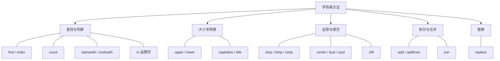

# 字符串方法与格式化

> **所属路径**：`01_基础能力/01_开发环境与技术英语/02_字符串与编码/01_字符串方法与格式化`
> **预计学习时间**：50 分钟
> **难度等级**：⭐

---

## 前置知识

- [变量与数据类型](../../01_编程语言基础/01_变量与数据类型/01_变量与数据类型.md)（了解字符串的基本概念和索引操作）
- [函数与模块](../../01_编程语言基础/03_函数与模块/03_函数与模块.md)（了解函数调用和方法的概念）

> 如果以上内容还不熟悉，建议先完成对应课程再继续。

---

## 学习目标

完成本节后，你将能够：

1. 使用常见的字符串方法完成查找、替换、拆分、合并等文本操作
2. 区分并熟练运用三种字符串格式化方式：`%` 操作符、`str.format()` 和 f-string
3. 使用格式规范符控制数字精度、对齐方式和填充字符
4. 运用字符串方法完成简单的文本清洗任务

---

## 正文讲解

### 1. 字符串是什么？——从"不可变序列"说起

在 [变量与数据类型](../../01_编程语言基础/01_变量与数据类型/01_变量与数据类型.md) 中，我们已经初步认识了字符串——用引号包裹的一串字符。现在让我们更深入地理解它。

Python 中的 **字符串（String, str）** 是一个 **不可变（Immutable）** 的 **序列（Sequence）** 。这两个词非常关键：

- **序列** 意味着字符串中的每个字符都有一个固定的位置（索引），你可以通过索引访问单个字符，也可以用切片获取子串。
- **不可变** 意味着字符串一旦创建，就无法修改其中的某个字符。任何"修改"操作实际上都会创建一个全新的字符串。

```python
name = "Python"
print(name[0])      # 'P'  —— 通过索引访问
print(name[2:5])    # 'tho' —— 切片操作

# 尝试修改会报错
# name[0] = 'J'     # TypeError: 'str' object does not support item assignment
```

想一想：既然不能修改，那我们日常使用的 `replace()`、`upper()` 这些方法是怎么"改变"字符串的？答案是——它们不改变原字符串，而是返回一个新的字符串。理解了这一点，你就抓住了字符串操作的精髓。

### 2. 常用字符串方法：你的文本处理工具箱

Python 为字符串内置了几十个方法，但日常编程中最常用的不超过 20 个。我们按照功能分组来学习。

#### 查找与判断类

当你需要在一段文本中查找特定内容时，以下方法是你的首选工具：

```python
text = "Hello, World! Hello, Python!"

# 查找子串的位置
print(text.find("World"))       # 7  —— 返回首次出现的索引
print(text.find("Java"))        # -1 —— 找不到返回 -1
print(text.index("World"))      # 7  —— 与 find 类似，但找不到会抛出 ValueError

# 计数
print(text.count("Hello"))      # 2  —— 出现了 2 次

# 判断开头和结尾
print(text.startswith("Hello")) # True
print(text.endswith("!"))       # True

# 包含检查（使用 in 运算符，不是方法，但非常常用）
print("World" in text)          # True
```

> 💡 **小技巧**：`find()` 和 `index()` 的区别在于找不到时的行为——`find()` 返回 `-1` ，`index()` 抛出异常。在不确定子串是否存在时，优先使用 `find()` 或 `in` 运算符。

#### 大小写转换类

处理用户输入或文本标准化时，大小写转换非常实用：

```python
s = "hello, WORLD"

print(s.upper())       # "HELLO, WORLD"  —— 全部大写
print(s.lower())       # "hello, world"  —— 全部小写
print(s.capitalize())  # "Hello, world"  —— 首字母大写
print(s.title())       # "Hello, World"  —— 每个单词首字母大写
print(s.swapcase())    # "HELLO, world"  —— 大小写互换
```

一个常见的应用场景：比较用户输入时忽略大小写。

```python
user_input = "Yes"
if user_input.lower() == "yes":
    print("用户同意了")
```

#### 去除与填充类

从文件或网络读取的文本经常带有多余的空白字符（空格、换行符、制表符），需要先"清洗"：

```python
raw = "  \t Hello, World! \n  "

print(raw.strip())    # "Hello, World!"  —— 去除两端空白
print(raw.lstrip())   # "Hello, World! \n  "  —— 只去左端
print(raw.rstrip())   # "  \t Hello, World!"  —— 只去右端

# strip 也可以指定要去除的字符
csv_field = "###data###"
print(csv_field.strip("#"))  # "data"
```

反过来，有时需要把字符串填充到固定长度，用于格式化输出：

```python
title = "Python"
print(title.center(20, "="))  # "=======Python======="
print(title.ljust(20, "-"))   # "Python--------------"
print(title.rjust(20, "-"))   # "--------------Python"
print("42".zfill(6))          # "000042" —— 数字补零
```

#### 拆分与合并类

这是文本处理中最强大的操作之一——将一个字符串拆成多个部分，或将多个部分合成一个字符串：

```python
# 拆分：split()
csv_line = "Alice,25,Beijing"
fields = csv_line.split(",")
print(fields)          # ['Alice', '25', 'Beijing']

# 按换行拆分
multiline = "第一行\n第二行\n第三行"
lines = multiline.splitlines()
print(lines)           # ['第一行', '第二行', '第三行']

# 限制拆分次数
log = "2024-01-15 ERROR 文件未找到"
parts = log.split(" ", 2)  # 最多拆成 3 部分
print(parts)           # ['2024-01-15', 'ERROR', '文件未找到']

# 合并：join()
words = ["Python", "is", "awesome"]
sentence = " ".join(words)
print(sentence)        # "Python is awesome"

# 用逗号合并
csv_output = ",".join(["Alice", "25", "Beijing"])
print(csv_output)      # "Alice,25,Beijing"
```

> 💡 **注意**：`join()` 是字符串方法，不是列表方法——它的语法是 `分隔符.join(列表)` ，初学者容易搞反。

#### 替换类

```python
text = "I love Java. Java is great."

# 替换所有匹配
new_text = text.replace("Java", "Python")
print(new_text)  # "I love Python. Python is great."

# 限制替换次数
new_text = text.replace("Java", "Python", 1)
print(new_text)  # "I love Python. Java is great."
```

下面这张图总结了最常用的字符串方法分类：



> 📌 **图解说明**：Python 字符串方法按功能分为五大类，日常编程中最高频使用的是拆分合并和查找判断。

### 3. 字符串判断方法

Python 还提供了一组 `is*` 方法，用于判断字符串内容的特征，在输入验证中特别有用：

```python
# 内容判断
print("12345".isdigit())     # True  —— 是否全是数字
print("abcDEF".isalpha())    # True  —— 是否全是字母
print("abc123".isalnum())    # True  —— 是否全是字母或数字
print("   \t\n".isspace())   # True  —— 是否全是空白字符

# 大小写判断
print("HELLO".isupper())     # True
print("hello".islower())     # True

# 实际应用：简单的输入验证
user_id = "user123"
if user_id.isalnum():
    print("合法的用户 ID")
else:
    print("用户 ID 只能包含字母和数字")
```

### 4. 字符串格式化：三代方案的演进

在实际编程中，我们经常需要将变量的值嵌入到一段文本模板中——比如生成一句问候语、输出一行日志、或者拼装一条 SQL 查询。Python 提供了三种字符串格式化方式，它们代表了不同时代的设计思路。

#### 第一代：`%` 操作符（C 风格）

这是 Python 从 C 语言借鉴来的格式化方式，虽然已经不太推荐在新代码中使用，但在很多老项目和日志模块中仍然常见：

```python
name = "Alice"
age = 25
score = 95.678

# 基本用法
print("我叫 %s，今年 %d 岁" % (name, age))
# 输出：我叫 Alice，今年 25 岁

# 浮点数精度控制
print("分数：%.2f" % score)
# 输出：分数：95.68

# 常用占位符：%s（字符串）、%d（整数）、%f（浮点数）、%x（十六进制）
```

#### 第二代：`str.format()` 方法

Python 2.6 引入的 `str.format()` 方法更加灵活，支持位置参数和命名参数：

```python
# 位置参数
print("我叫 {}，今年 {} 岁".format(name, age))

# 索引参数（可以重复使用）
print("{0} 说：{0} 很喜欢 {1}".format("Alice", "Python"))
# 输出：Alice 说：Alice 很喜欢 Python

# 命名参数
print("坐标：({x}, {y})".format(x=3, y=5))
```

#### 第三代：f-string（推荐）

Python 3.6 引入的 **格式化字符串字面量（f-string）** 是目前最推荐的方式——简洁、直观、性能最好：

```python
name = "Alice"
age = 25
score = 95.678

# 基本用法：在引号前加 f，用花括号嵌入表达式
print(f"我叫 {name}，今年 {age} 岁")

# 花括号里可以放任意表达式
print(f"明年 {age + 1} 岁")
print(f"名字大写：{name.upper()}")

# 多行 f-string
info = (
    f"姓名：{name}\n"
    f"年龄：{age}\n"
    f"成绩：{score:.2f}"
)
print(info)
```

### 5. 格式规范符：精确控制输出样式

无论使用 `str.format()` 还是 f-string，都支持在花括号中使用 **格式规范符（Format Specification）** ，语法为 `{表达式:规范}` ：

```python
# 数字精度
pi = 3.14159265
print(f"π ≈ {pi:.2f}")       # "π ≈ 3.14"      —— 保留 2 位小数
print(f"π ≈ {pi:.4f}")       # "π ≈ 3.1416"    —— 保留 4 位小数

# 宽度与对齐
name = "Python"
print(f"|{name:<15}|")       # "|Python         |"  —— 左对齐，宽 15
print(f"|{name:>15}|")       # "|         Python|"  —— 右对齐
print(f"|{name:^15}|")       # "|    Python     |"  —— 居中对齐
print(f"|{name:=^15}|")      # "|====Python=====|"  —— 用 = 填充

# 千分位分隔符
big_number = 1234567890
print(f"{big_number:,}")      # "1,234,567,890"
print(f"{big_number:_}")      # "1_234_567_890"

# 百分比
ratio = 0.856
print(f"准确率：{ratio:.1%}")  # "准确率：85.6%"

# 进制转换
n = 255
print(f"十进制：{n:d}")       # "十进制：255"
print(f"二进制：{n:b}")       # "二进制：11111111"
print(f"八进制：{n:o}")       # "八进制：377"
print(f"十六进制：{n:x}")     # "十六进制：ff"
```

下面这张表汇总了最常用的格式规范符：

| 规范符 | 含义 | 示例 | 输出 |
| ------ | ---- | ---- | ---- |
| `:.2f` | 保留 2 位小数 | `f"{3.14159:.2f}"` | `3.14` |
| `:,` | 千分位逗号 | `f"{1000000:,}"` | `1,000,000` |
| `:.1%` | 百分比（1位小数） | `f"{0.85:.1%}"` | `85.0%` |
| `:<10` | 左对齐，宽 10 | `f"{'hi':<10}"` | `hi        ` |
| `:>10` | 右对齐，宽 10 | `f"{'hi':>10}"` | `        hi` |
| `:^10` | 居中，宽 10 | `f"{'hi':^10}"` | `    hi    ` |
| `:b` | 二进制 | `f"{10:b}"` | `1010` |
| `:x` | 十六进制 | `f"{255:x}"` | `ff` |
| `:e` | 科学计数法 | `f"{0.001:e}"` | `1.000000e-03` |

### 6. 多行字符串与原始字符串

在实际开发中，你还会经常遇到两种特殊的字符串写法：

#### 三引号多行字符串

当文本内容跨越多行时，使用三引号（`"""` 或 `'''`）：

```python
sql = """
SELECT name, age
FROM users
WHERE age > 18
ORDER BY name
"""
print(sql)

# 注意：三引号会保留所有的换行和缩进
# 如果不想要开头的换行，可以用反斜杠
sql = """\
SELECT name, age
FROM users
"""
```

#### 原始字符串（r-string）

在字符串前加 `r` 前缀，所有反斜杠 `\` 都会被当作普通字符，不再作为转义符。这在处理正则表达式和文件路径时非常有用：

```python
# 普通字符串中，\n 是换行符
print("hello\nworld")
# hello
# world

# 原始字符串中，\n 就是两个字符 \ 和 n
print(r"hello\nworld")
# hello\nworld

# Windows 文件路径
path = r"C:\Users\Admin\Documents"
print(path)  # C:\Users\Admin\Documents
```

---

## 动手实践

学了这么多方法，让我们来做一个综合练习——用字符串方法清洗和格式化一份简单的学生成绩数据：

```python
# 文件：code/string_demo.py
# 综合示例：学生成绩数据清洗与格式化

# 模拟从文件读取的原始数据（带有多余空白和不一致的格式）
raw_data = """
  Alice , 95.5, beijing
  Bob,  88.0 ,SHANGHAI
  Charlie , 72.3,  Guangzhou
"""

# 第 1 步：按行拆分，去除空行
lines = [line.strip() for line in raw_data.strip().splitlines()]
print("拆分后的行：", lines)

# 第 2 步：解析每行数据
students = []
for line in lines:
    parts = line.split(",")
    name = parts[0].strip().title()    # 去空白 + 首字母大写
    score = float(parts[1].strip())    # 去空白 + 转为浮点数
    city = parts[2].strip().title()    # 去空白 + 首字母大写
    students.append((name, score, city))

# 第 3 步：格式化输出
print(f"\n{'姓名':<10} {'成绩':>6} {'城市':<10}")
print("-" * 28)
for name, score, city in students:
    print(f"{name:<10} {score:>6.1f} {city:<10}")

# 第 4 步：计算平均分
avg = sum(s[1] for s in students) / len(students)
print("-" * 28)
print(f"{'平均分':<10} {avg:>6.1f}")
```

**运行说明**：
- 环境要求：Python 3.10+
- 运行命令：`python code/string_demo.py`

**预期输出**：
```
拆分后的行： ['Alice , 95.5, beijing', 'Bob,  88.0 ,SHANGHAI', 'Charlie , 72.3,  Guangzhou']

姓名         成绩 城市
----------------------------
Alice         95.5 Beijing
Bob           88.0 Shanghai
Charlie       72.3 Guangzhou
----------------------------
平均分        85.3
```

这个例子串联了我们学到的大部分知识：`strip()` 去除空白、`split()` 拆分字段、`title()` 标准化大小写、`float()` 类型转换、f-string 格式化输出。在后续的 [数据清洗](../../../05_数据能力/02_数据清洗/) 课程中，你会用 Pandas 库来处理更大规模的数据，但底层的文本处理思路是一样的。

---

## 典型误区

| 误区 | 正确理解 |
| ---- | -------- |
| 认为 `str.replace()` 会修改原字符串 | 字符串是不可变的，`replace()` 返回一个新字符串，原字符串不变 |
| 用 `+` 在循环中拼接大量字符串 | 每次 `+` 都会创建新字符串，效率很低；应该用 `"".join(列表)` |
| 混淆 `find()` 返回 `-1` 和 `index()` 抛异常 | 不确定子串是否存在时用 `find()` ，确定存在时用 `index()` |
| f-string 中忘记加 `f` 前缀 | 没有 `f` 前缀时，`{name}` 不会被替换，只会原样输出 |

---

## 练习题

### 练习 1：密码强度检查（难度：⭐）

编写一个函数 `check_password(password)` ，检查密码是否满足以下要求：
- 长度至少 8 位
- 同时包含大写字母、小写字母和数字

返回 `True` 或 `False` 。

<details>
<summary>💡 提示</summary>

可以使用 `any()` 函数配合生成器表达式来检查每个条件。例如 `any(c.isupper() for c in password)` 检查是否包含大写字母。

</details>

<details>
<summary>✅ 参考答案</summary>

```python
def check_password(password):
    if len(password) < 8:
        return False
    has_upper = any(c.isupper() for c in password)
    has_lower = any(c.islower() for c in password)
    has_digit = any(c.isdigit() for c in password)
    return has_upper and has_lower and has_digit

# 测试
print(check_password("Abc12345"))   # True
print(check_password("abc12345"))   # False（无大写）
print(check_password("Ab1"))        # False（太短）
```

</details>

### 练习 2：CSV 行解析器（难度：⭐⭐）

编写一个函数 `parse_csv_line(line)` ，将一行 CSV 文本解析为字段列表。要求：
- 按逗号分隔
- 去除每个字段的前后空白
- 忽略空字段

例如 `parse_csv_line("  Alice , , 25 , Beijing, ")` 应返回 `["Alice", "25", "Beijing"]` 。

<details>
<summary>💡 提示</summary>

先用 `split(",")` 拆分，再用列表推导式同时完成 `strip()` 和过滤空字符串的操作。

</details>

<details>
<summary>✅ 参考答案</summary>

```python
def parse_csv_line(line):
    return [field.strip() for field in line.split(",") if field.strip()]

# 测试
result = parse_csv_line("  Alice , , 25 , Beijing, ")
print(result)  # ['Alice', '25', 'Beijing']

assert parse_csv_line("a, b, c") == ["a", "b", "c"]
assert parse_csv_line(" , , ") == []
assert parse_csv_line("hello") == ["hello"]
```

</details>

### 练习 3：格式化报表生成（难度：⭐⭐）

给定一个商品列表 `products = [("苹果", 5.5, 3), ("牛奶", 12.8, 2), ("面包", 8.0, 1)]` ，其中每个元组包含 `(名称, 单价, 数量)` 。请生成如下格式的报表：

```
商品       单价    数量    小计
-------------------------------
苹果       5.50       3   16.50
牛奶      12.80       2   25.60
面包       8.00       1    8.00
-------------------------------
总计                      50.10
```

<details>
<summary>💡 提示</summary>

使用 f-string 的对齐和精度控制：`{name:<6}` 左对齐宽 6，`{price:>6.2f}` 右对齐保留两位小数。

</details>

<details>
<summary>✅ 参考答案</summary>

```python
products = [("苹果", 5.5, 3), ("牛奶", 12.8, 2), ("面包", 8.0, 1)]

print(f"{'商品':<6} {'单价':>6} {'数量':>6} {'小计':>7}")
print("-" * 31)

total = 0
for name, price, qty in products:
    subtotal = price * qty
    total += subtotal
    print(f"{name:<6} {price:>6.2f} {qty:>6d} {subtotal:>7.2f}")

print("-" * 31)
print(f"{'总计':<6} {'':>6} {'':>6} {total:>7.2f}")
```

</details>

---

## 下一步学习

- 📖 下一个知识点：[Unicode与编解码](../02_Unicode与编解码/02_Unicode与编解码.md) — 理解字符编码原理，告别乱码
- 🔗 相关知识点：[正则表达式](../../05_正则表达式/) — 用模式匹配完成更复杂的文本处理
- 🔗 相关知识点：[文本数据预处理](../../../05_数据能力/10_文本数据预处理/) — 在数据科学中处理文本数据

---

## 参考资料

1. [Python 官方文档 - 字符串方法](https://docs.python.org/zh-cn/3/library/stdtypes.html#string-methods) — 所有字符串方法的完整参考（官方文档）
2. [Python 官方文档 - 格式规范迷你语言](https://docs.python.org/zh-cn/3/library/string.html#formatspec) — 格式规范符的完整语法说明（官方文档）
3. [PEP 498 – Literal String Interpolation](https://peps.python.org/pep-0498/) — f-string 的设计规范（Python 官方提案）
4. [Real Python - Python String Formatting Best Practices](https://realpython.com/python-string-formatting/) — 三种格式化方式的对比教程（公开教程）
