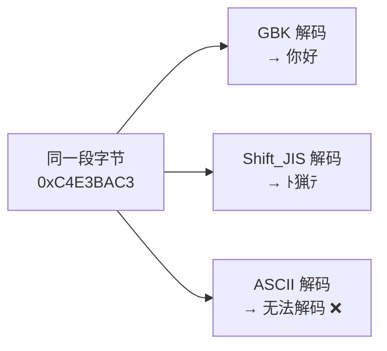
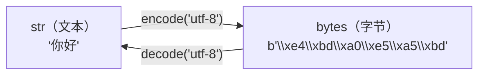

# Unicode与编解码

> **所属路径**：`01_基础能力/01_开发环境与技术英语/02_字符串与编码/02_Unicode与编解码`
> **预计学习时间**：50 分钟
> **难度等级**：⭐⭐

---

## 前置知识

- [变量与数据类型](../../01_编程语言基础/01_变量与数据类型/01_变量与数据类型.md)（了解字符串和整数的基本概念）
- [字符串方法与格式化](../01_字符串方法与格式化/01_字符串方法与格式化.md)（了解字符串的基本操作）

> 如果以上内容还不熟悉，建议先完成对应课程再继续。

---

## 学习目标

完成本节后，你将能够：

1. 解释 ASCII、Unicode 和 UTF-8 三者之间的关系
2. 区分"字符"和"字节"的本质差异
3. 使用 `encode()` 和 `decode()` 在字符串与字节串之间正确转换
4. 诊断并修复常见的乱码问题
5. 在文件读写中正确指定编码

---

## 正文讲解

### 1. 从"乱码"说起：一个你一定遇到过的问题

如果你曾经打开一个文件，看到过类似 `欢迎使ç"¨` 或 `浣犲ソ` 这样的乱码，或者在终端里看到过 `UnicodeDecodeError` 这个令人头疼的错误——恭喜你，你即将理解这一切背后的原因。

乱码的本质其实很简单：**写入文件时用的编码方式，和读取文件时用的编码方式不一致。** 就好比你用中文写了一封信，收信人却用日文的规则来"解读"每一个笔画，自然就读成了一堆不知所云的内容。

要理解这个问题，我们需要先回到一个最基础的问题：计算机是如何存储文字的？

### 2. 字符编码的历史演进

#### 起点：ASCII——只够用的 128 个字符

计算机只认识 0 和 1。最早的解决方案是 **ASCII（American Standard Code for Information Interchange，美国信息交换标准代码）** ，它用一个字节（8 位）中的 7 位来表示 128 个字符：

```python
# ASCII 编码示例
print(ord('A'))    # 65  —— 'A' 的 ASCII 码
print(ord('a'))    # 97  —— 'a' 的 ASCII 码
print(ord('0'))    # 48  —— '0'（字符零）的 ASCII 码
print(chr(65))     # 'A' —— 将编码转回字符

# ASCII 的范围：0-127
print(ord(' '))    # 32  —— 空格
print(ord('~'))    # 126 —— 最后一个可打印字符
```

ASCII 对于英语世界来说足够了——26 个大写字母、26 个小写字母、10 个数字、标点符号和一些控制字符，总共 128 个。但问题很快就出现了：中文有几万个汉字，日文有假名，阿拉伯文从右往左书写，还有各种特殊符号……128 个位置远远不够。

#### 过渡：各自为政的编码方案

为了容纳更多字符，各个国家和地区各自创造了自己的编码标准：

- **GBK/GB2312**：中国大陆的中文编码，用 2 个字节表示一个汉字
- **Big5**：中国台湾地区的繁体中文编码
- **Shift_JIS**：日本的日文编码
- **EUC-KR**：韩国的韩文编码

这就像每个国家都发明了自己的密码本——同一个字节序列，用中文密码本解读是"你好"，用日文密码本解读可能就变成了乱码。



> 📌 **图解说明**：同一段字节数据，用不同的编码方式解读会得到完全不同的结果——这就是乱码产生的根本原因。

#### 终极方案：Unicode——全世界的统一字典

**Unicode（统一码）** 的目标是为世界上每一个字符分配一个唯一的编号（称为 **码点，Code Point** ），不管它是哪种语言、哪种文字。

```python
# Unicode 码点
print(ord('你'))     # 20320  —— 十进制
print(hex(ord('你'))) # '0x4f60' —— 十六进制
print('\u4f60')      # '你'   —— 用 Unicode 转义序列表示

# Unicode 囊括了全世界的文字
print(ord('α'))      # 945   —— 希腊字母
print(ord('日'))     # 26085 —— 日文汉字
print(ord('😀'))     # 128512 —— 甚至包括 emoji
```

截至 2024 年，Unicode 已经定义了超过 15 万个字符，覆盖了人类已知的几乎所有书写系统。

但是，Unicode 只是一个"字典"——它规定了每个字符的编号（码点），却没有规定这个编号在计算机中该如何存储。这就引出了"编码方案"的概念。

### 3. UTF-8：互联网时代的事实标准

**UTF-8（8-bit Unicode Transformation Format）** 是 Unicode 最流行的 **编码方案（Encoding Scheme）** 。它的核心思想是 **变长编码** ——用不同长度的字节来表示不同范围的码点：

| 码点范围 | UTF-8 字节数 | 覆盖字符 |
| -------- | ------------ | -------- |
| U+0000 – U+007F | 1 字节 | ASCII 字符（英文字母、数字等） |
| U+0080 – U+07FF | 2 字节 | 拉丁文扩展、希腊字母等 |
| U+0800 – U+FFFF | 3 字节 | 中日韩汉字、常用符号等 |
| U+10000 – U+10FFFF | 4 字节 | 生僻汉字、emoji 等 |

这个设计非常巧妙：

- **兼容 ASCII**：所有 ASCII 字符在 UTF-8 中仍然只用 1 字节，编码值不变。这意味着用 ASCII 写的英文文件用 UTF-8 也能正确读取。
- **节省空间**：英文文本（主要是 ASCII 字符）用 UTF-8 编码后和原来一样大，而不像 UTF-32 那样固定用 4 字节导致膨胀。

```python
# 编码：str → bytes（人类可读 → 计算机存储）
text = "Hi你好"
utf8_bytes = text.encode("utf-8")
print(utf8_bytes)       # b'Hi\xe4\xbd\xa0\xe5\xa5\xbd'
print(len(utf8_bytes))  # 8  —— 'H'(1) + 'i'(1) + '你'(3) + '好'(3)

# 解码：bytes → str（计算机存储 → 人类可读）
restored = utf8_bytes.decode("utf-8")
print(restored)         # "Hi你好"

# 对比不同编码的字节长度
print(len("Hi你好".encode("utf-8")))    # 8
print(len("Hi你好".encode("gbk")))      # 6  —— GBK 中汉字占 2 字节
print(len("Hi你好".encode("utf-16")))   # 10 —— UTF-16 有 BOM + 每字符 2 字节
print(len("Hi你好".encode("utf-32")))   # 20 —— 含 BOM + 每字符 4 字节
```

### 4. Python 中的 str 与 bytes

在 Python 3 中，有一个非常清晰的区分：

- **`str` 类型**：存储的是 Unicode 字符序列（人类可读的文本）
- **`bytes` 类型**：存储的是原始字节序列（计算机存储/传输的二进制数据）



> 📌 **图解说明**：`encode()` 将人类可读的文本转换为计算机可存储的字节，`decode()` 则是反向转换。编码和解码必须使用相同的编码方案。

这两个类型之间的转换靠 `encode()` 和 `decode()` 方法：

```python
# str → bytes（编码）
text = "你好，世界"
data = text.encode("utf-8")
print(type(data))   # <class 'bytes'>

# bytes → str（解码）
text2 = data.decode("utf-8")
print(type(text2))  # <class 'str'>
print(text2)        # "你好，世界"
```

### 5. 乱码的诊断与修复

现在我们有了足够的知识来理解和修复乱码。乱码通常发生在以下场景：

#### 场景 1：编码和解码不一致

```python
# 用 UTF-8 编码，却用 GBK 解码
text = "你好"
data = text.encode("utf-8")        # 编码为 UTF-8 字节
wrong = data.decode("gbk", errors="replace")  # 用 GBK 解码
print(wrong)  # "浣犲ソ" —— 经典的乱码！

# 修复方法：用正确的编码重新解码
correct = data.decode("utf-8")
print(correct)  # "你好"
```

#### 场景 2：解码失败抛异常

```python
# 某些字节序列在目标编码中不合法
data = "你好".encode("utf-8")
try:
    data.decode("ascii")
except UnicodeDecodeError as e:
    print(f"解码失败：{e}")
    # 'ascii' codec can't decode byte 0xe4 in position 0

# 三种错误处理策略
print(data.decode("ascii", errors="replace"))    # "������" —— 用 ? 替代
print(data.decode("ascii", errors="ignore"))      # ""       —— 直接忽略
print(data.decode("ascii", errors="backslashreplace"))  # "\\xe4\\xbd..."
```

#### 场景 3：文件编码问题

```python
# 读取文件时指定正确的编码——这是最常见的实际场景
# 错误做法：不指定编码（依赖系统默认编码，不同系统可能不同）
# with open("data.txt") as f:  # 危险！

# 正确做法：显式指定编码
with open("data.txt", encoding="utf-8") as f:
    content = f.read()
```

> 💡 **最佳实践**：在所有 `open()` 调用中都显式指定 `encoding="utf-8"` ，除非你明确知道文件使用了其他编码。从 Python 3.15 开始，不指定编码会产生 `DeprecationWarning` 。

### 6. 常用编码速查

| 编码 | 特点 | 适用场景 |
| ---- | ---- | -------- |
| UTF-8 | 变长（1-4 字节），兼容 ASCII，互联网标准 | Web 开发、API、新项目的默认选择 |
| ASCII | 固定 1 字节，仅支持 128 个字符 | 纯英文文本、协议头部 |
| GBK | 变长（1-2 字节），中文编码 | 中国大陆的遗留系统 |
| UTF-16 | 固定 2 或 4 字节，有大小端之分 | Windows 内部、Java 内部 |
| UTF-32 | 固定 4 字节，最简单但最浪费空间 | 内部处理需要 O(1) 索引时 |
| Latin-1 | 固定 1 字节，覆盖西欧语言 | ISO-8859-1 遗留系统 |

---

## 动手实践

让我们写一个实用的编码探测与转换工具：

```python
# 文件：code/encoding_demo.py
# 编码探测与转换示例

def analyze_encoding(text):
    """分析一段文本在不同编码下的字节表示"""
    encodings = ["utf-8", "gbk", "ascii", "utf-16", "utf-32"]
    print(f"原始文本：'{text}'（共 {len(text)} 个字符）\n")
    print(f"{'编码':<10} {'字节数':>6}  {'字节内容'}")
    print("-" * 55)
    for enc in encodings:
        try:
            data = text.encode(enc)
            print(f"{enc:<10} {len(data):>6}  {data}")
        except UnicodeEncodeError:
            print(f"{enc:<10}  {'编码失败（不支持该字符）':>6}")


def fix_mojibake(broken_text, wrong_enc="latin-1", right_enc="utf-8"):
    """
    修复'双重编码'乱码：
    文本本来是 right_enc 编码的字节，
    但被错误地用 wrong_enc 解码成了 str
    """
    # 反向操作：先用错误编码"编回"字节，再用正确编码解码
    raw_bytes = broken_text.encode(wrong_enc)
    return raw_bytes.decode(right_enc)


# 示例 1：分析不同编码的字节表示
analyze_encoding("Hello")
print()
analyze_encoding("你好世界")
print()
analyze_encoding("Hi🎉")

# 示例 2：修复乱码
print("\n--- 乱码修复示例 ---")
# 模拟乱码：UTF-8 字节被当作 Latin-1 解码
original = "你好"
utf8_bytes = original.encode("utf-8")
broken = utf8_bytes.decode("latin-1")  # 错误解码
print(f"乱码文本：{broken}")

fixed = fix_mojibake(broken, "latin-1", "utf-8")
print(f"修复后：{fixed}")
```

**运行说明**：
- 环境要求：Python 3.10+
- 运行命令：`python code/encoding_demo.py`

**预期输出**：
```
原始文本：'Hello'（共 5 个字符）

编码         字节数  字节内容
-------------------------------------------------------
utf-8            5  b'Hello'
gbk              5  b'Hello'
ascii            5  b'Hello'
utf-16          12  b'\xff\xfeH\x00e\x00l\x00l\x00o\x00'
utf-32          24  b'\xff\xfe\x00\x00H\x00\x00\x00e\x00\x00\x00l\x00\x00\x00l\x00\x00\x00o\x00\x00\x00'

原始文本：'你好世界'（共 4 个字符）

编码         字节数  字节内容
-------------------------------------------------------
utf-8           12  b'\xe4\xbd\xa0\xe5\xa5\xbd\xe4\xb8\x96\xe7\x95\x8c'
gbk              8  b'\xc4\xe3\xba\xc3\xca\xc0\xbd\xe7'
ascii        编码失败（不支持该字符）
utf-16          10  b'\xff\xfe`O}Y\x16N\x8cz'
utf-32          20  b'\xff\xfe\x00\x00`O\x00\x00}Y\x00\x00\x16N\x00\x00\x8cz\x00\x00'

--- 乱码修复示例 ---
乱码文本：ä½ å¥½
修复后：你好
```

从输出中可以清楚地看到：对于纯英文 "Hello"，UTF-8、GBK 和 ASCII 的编码结果完全一致（都是 5 字节）；而中文 "你好世界" 在 UTF-8 下需要 12 字节（每个汉字 3 字节），在 GBK 下只需 8 字节（每个汉字 2 字节），在 ASCII 下则完全无法编码。

---

## 典型误区

| 误区 | 正确理解 |
| ---- | -------- |
| Unicode 是一种编码 | Unicode 是字符集（字典），UTF-8/UTF-16/UTF-32 才是具体的编码方案（存储规则） |
| Python 3 不需要关心编码 | Python 3 的 `str` 确实是 Unicode，但读写文件、网络传输时仍需要指定编码 |
| UTF-8 中每个汉字占 2 字节 | UTF-8 中汉字占 3 字节（GBK 中才是 2 字节） |
| `len("你好")` 返回字节数 | Python 3 中 `len()` 返回的是字符数（2），不是字节数。要看字节数需要先 `encode()` |

---

## 练习题

### 练习 1：编码字节计算（难度：⭐）

不运行代码，预测以下表达式的值，然后验证：

```python
len("Hello")
len("Hello".encode("utf-8"))
len("你好")
len("你好".encode("utf-8"))
len("你好".encode("gbk"))
len("A😀B")
len("A😀B".encode("utf-8"))
```

<details>
<summary>💡 提示</summary>

`len()` 对 `str` 返回字符数，对 `bytes` 返回字节数。ASCII 字符 UTF-8 编码 1 字节，汉字 3 字节，emoji 4 字节。

</details>

<details>
<summary>✅ 参考答案</summary>

```python
print(len("Hello"))                     # 5（5 个字符）
print(len("Hello".encode("utf-8")))     # 5（5 × 1 字节）
print(len("你好"))                       # 2（2 个字符）
print(len("你好".encode("utf-8")))      # 6（2 × 3 字节）
print(len("你好".encode("gbk")))        # 4（2 × 2 字节）
print(len("A😀B"))                       # 3（3 个字符，emoji 算 1 个字符）
print(len("A😀B".encode("utf-8")))      # 6（1 + 4 + 1 字节）
```

</details>

### 练习 2：乱码诊断与修复（难度：⭐⭐）

你的同事给你发了一段数据，但显示为乱码：`"ÄÐÐÐ"`。经过排查，你发现这段文本原本是 GBK 编码的中文，但被程序错误地当作 Latin-1 解码了。请编写代码修复这段乱码。

<details>
<summary>💡 提示</summary>

修复"双重编码"乱码的思路：先用错误的编码（Latin-1）把乱码文本"编回"字节，再用正确的编码（GBK）解码。

</details>

<details>
<summary>✅ 参考答案</summary>

```python
broken = "ÄÐÐÐ"
# 第一步：用 Latin-1 编码回字节（逆转错误的解码）
raw_bytes = broken.encode("latin-1")
print(f"原始字节：{raw_bytes}")

# 第二步：用正确的 GBK 编码解码
fixed = raw_bytes.decode("gbk")
print(f"修复后：{fixed}")
```

Latin-1（ISO-8859-1）的特殊性质：它的码点 0-255 与字节值一一对应，所以用 Latin-1 `encode()` 可以无损地将单字节字符"转回"字节。

</details>

### 练习 3：安全的文件编码读取器（难度：⭐⭐）

编写一个函数 `safe_read(filepath)` ，它会依次尝试用 `utf-8`、`gbk`、`latin-1` 三种编码读取文件。如果某种编码成功（不抛异常），就返回文件内容和编码名称的元组；如果全部失败，返回 `None` 。

<details>
<summary>💡 提示</summary>

用 `try/except UnicodeDecodeError` 包裹每次读取尝试。注意：Latin-1 永远不会抛出解码异常（因为它可以将任意字节映射到字符），所以放在最后作为兜底。

</details>

<details>
<summary>✅ 参考答案</summary>

```python
def safe_read(filepath):
    encodings = ["utf-8", "gbk", "latin-1"]
    for enc in encodings:
        try:
            with open(filepath, encoding=enc) as f:
                content = f.read()
            return (content, enc)
        except (UnicodeDecodeError, FileNotFoundError):
            continue
    return None

# 使用示例（需要实际文件）
# result = safe_read("data.txt")
# if result:
#     content, encoding = result
#     print(f"成功读取，使用编码：{encoding}")
# else:
#     print("所有编码都无法读取")
```

</details>

---

## 下一步学习

- 📖 下一个知识点：[字节串与二进制处理](../03_字节串与二进制处理/03_字节串与二进制处理.md) — 深入学习 bytes 类型的操作方法
- 🔗 相关知识点：[文件操作与IO](../../01_编程语言基础/07_文件操作与IO/07_文件操作与IO.md) — 文件读写中的编码实践
- 📚 拓展阅读：[数据格式与序列化](../../../05_数据能力/13_数据格式与序列化/) — 了解更多数据编码格式

---

## 参考资料

1. [Python 官方文档 - Unicode HOWTO](https://docs.python.org/zh-cn/3/howto/unicode.html) — Python 处理 Unicode 的官方指南（官方文档）
2. [Joel on Software - The Absolute Minimum Every Software Developer Must Know About Unicode](https://www.joelonsoftware.com/2003/10/08/the-absolute-minimum-every-software-developer-absolutely-positively-must-know-about-unicode-and-character-sets-no-excuses/) — 经典的 Unicode 入门文章（公开博客）
3. [Unicode 官方网站](https://home.unicode.org/) — Unicode 标准的权威来源（官方网站）
4. [Real Python - Unicode & Character Encodings in Python](https://realpython.com/python-encodings-guide/) — Python 编码实用指南（公开教程）
