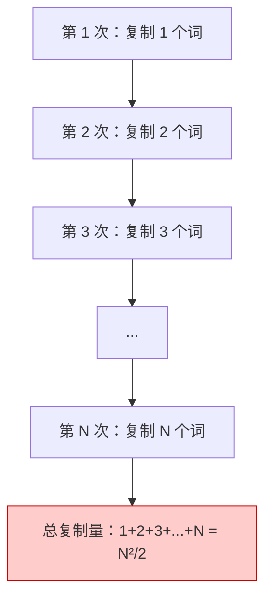

# 字符串性能与intern机制

> **所属路径**：`01_基础能力/01_开发环境与技术英语/02_字符串与编码/04_字符串性能与intern机制`
> **预计学习时间**：45 分钟
> **难度等级**：⭐⭐⭐

---

## 前置知识

- [变量与数据类型](../../01_编程语言基础/01_变量与数据类型/01_变量与数据类型.md)（理解 Python 的"标签模型"和不可变类型）
- [字符串方法与格式化](../01_字符串方法与格式化/01_字符串方法与格式化.md)（了解字符串的基本操作和不可变性）
- [列表推导与生成器](../../01_编程语言基础/04_列表推导与生成器/04_列表推导与生成器.md)（了解 `join()` 的使用场景）

> 如果以上内容还不熟悉，建议先完成对应课程再继续。

---

## 学习目标

完成本节后，你将能够：

1. 解释字符串拼接的性能问题及其根本原因
2. 在不同场景下选择最优的字符串构建方式
3. 解释 Python 的字符串驻留（intern）机制及其对性能的影响
4. 使用 `timeit` 模块进行简单的性能基准测试

---

## 正文讲解

### 1. 一个令人意外的性能差距

在 [字符串方法与格式化](../01_字符串方法与格式化/01_字符串方法与格式化.md) 中，我们在"典型误区"里提到过：不要用 `+` 在循环中拼接大量字符串。现在让我们来深入理解这个问题。

假设你需要将 10000 个单词拼接成一个长字符串。直觉上，最简单的做法是用 `+` 号一个个拼起来：

```python
# 方式 1：用 + 号逐个拼接
result = ""
for word in words:
    result = result + word + " "
```

但如果你对比另一种写法：

```python
# 方式 2：用 join() 一次性合并
result = " ".join(words)
```

当 `words` 包含 10000 个元素时，方式 2 比方式 1 快几十倍甚至上百倍。为什么会有这么大的差距？

### 2. 字符串拼接的隐藏代价

答案藏在字符串的 **不可变性（Immutability）** 中。

当你执行 `result = result + word + " "` 时，Python 不是在 `result` 后面追加内容（字符串不可变，无法追加），而是：

1. 创建一个新字符串，长度为 `len(result) + len(word) + 1`
2. 把 `result` 的全部内容复制到新字符串
3. 把 `word` 和空格复制到新字符串末尾
4. 让 `result` 指向新字符串，旧字符串等待垃圾回收

关键问题在于第 2 步——**每次拼接都要复制已有的全部内容**。当循环执行到第 5000 次时，每次操作都要复制前 5000 个单词的全部内容。



> 📌 **图解说明**：每次拼接都要复制已有内容，导致总复制量与元素个数的平方成正比——这就是 $O(n^2)$ 时间复杂度的来源。

而 `" ".join(words)` 的工作方式完全不同：

1. 先遍历列表，计算最终字符串的总长度
2. 一次性分配足够大的内存空间
3. 把所有单词和分隔符依次复制进去

总共只遍历和复制了一次，时间复杂度为 $O(n)$ 。

### 3. 五种字符串构建方式对比

让我们系统地对比五种常见的字符串构建方式：

```python
import timeit

words = [f"word{i}" for i in range(10000)]

# 方式 1：+ 号拼接
def method_plus():
    result = ""
    for w in words:
        result += w + " "
    return result

# 方式 2：join()
def method_join():
    return " ".join(words)

# 方式 3：列表 append + join
def method_list_join():
    parts = []
    for w in words:
        parts.append(w)
    return " ".join(parts)

# 方式 4：f-string 在循环中拼接
def method_fstring():
    result = ""
    for w in words:
        result = f"{result}{w} "
    return result

# 方式 5：io.StringIO
def method_stringio():
    import io
    buf = io.StringIO()
    for w in words:
        buf.write(w)
        buf.write(" ")
    return buf.getvalue()
```

运行基准测试后，典型的结果如下：

| 方式 | 典型耗时 | 适用场景 |
| ---- | -------- | -------- |
| `join()` | **1x**（最快） | 已有列表/可迭代对象时的首选 |
| 列表 append + join | ~1.5x | 构建过程中需要条件判断时 |
| `io.StringIO` | ~2x | 大量小片段写入，类似文件操作的场景 |
| `+` 拼接 | **50-100x**（最慢） | 仅限少量（<10 次）拼接 |
| f-string 循环拼接 | **50-100x**（最慢） | 仅限少量拼接 |

> 💡 **最佳实践总结**：
> - 拼接少量字符串（2-5 个）：直接用 `+` 或 f-string，代码更清晰
> - 拼接大量字符串：**始终使用 `join()`**
> - 需要逐步构建：先 `append()` 到列表，最后用 `join()`

### 4. CPython 的 += 优化

细心的读者可能会注意到：在 CPython（Python 的标准实现）中，字符串 `+=` 有一个特殊的优化——当只有一个引用指向该字符串时，CPython 会尝试 **原地扩展** 内存而不是创建新对象。

```python
# CPython 优化：当引用计数为 1 时，+= 可能原地扩展
s = "hello"
s += " world"  # CPython 可能不创建新对象，而是原地扩展 s
```

但这个优化有严格的限制：

1. **仅限 CPython**：PyPy、Jython 等其他 Python 实现不保证有此优化
2. **仅当引用计数为 1**：如果其他变量也指向同一个字符串，优化不会生效
3. **不是语言规范的一部分**：未来版本可能改变行为

```python
# 优化失效的情况
s = "hello"
t = s          # t 也引用了同一个字符串
s += " world"  # 引用计数 > 1，无法原地扩展，必须创建新对象
```

**结论**：不要依赖这个优化。在需要拼接大量字符串时，始终使用 `join()` 。

### 5. 字符串驻留（Intern）机制

Python 还有一个有趣的内部优化机制：**字符串驻留（String Interning）** 。

#### 什么是驻留？

驻留是指 Python 在内部维护一个字符串"池"——当创建一个新字符串时，如果池中已经有内容相同的字符串，就直接复用已有的对象，而不是创建一个新的。

```python
# 驻留示例
a = "hello"
b = "hello"
print(a is b)  # True —— a 和 b 指向内存中的同一个对象！

# 对比
c = "hello world"
d = "hello world"
print(c is d)  # True 或 False —— 取决于具体实现
```

> ⚠️ **重要提醒**：`is` 运算符比较的是两个变量是否指向 **同一个内存对象** ，`==` 比较的是两个对象的 **内容是否相同** 。判断字符串相等 **始终使用 `==`** ，不要用 `is` 。

#### 驻留的规则

CPython 会自动驻留以下字符串：

1. **编译期常量**：源代码中直接写出的字符串字面量
2. **看起来像标识符的字符串**：只包含字母、数字和下划线的字符串
3. **长度为 0 或 1 的字符串**：空字符串和单字符字符串

```python
# 自动驻留的情况
a = "hello"        # 编译期常量
b = "hello"
print(a is b)      # True

# 通常不自动驻留的情况
c = "hello world"  # 包含空格，不像标识符
d = "hello world"
print(c is d)      # 在交互式环境中通常为 False

# 运行时动态创建的字符串通常不驻留
e = "hel" + "lo"   # 编译器可能优化为 "hello"（常量折叠）
f = "hello"
print(e is f)      # True（因为编译期优化）

g = "hel"
h = g + "lo"       # 运行时拼接
print(h is f)      # False（运行时创建的新对象）
```

#### 手动驻留

如果你确实需要驻留某个字符串（比如用作字典键的高频字符串），可以使用 `sys.intern()` ：

```python
import sys

a = sys.intern("hello world")
b = sys.intern("hello world")
print(a is b)  # True —— 手动驻留后，两个变量指向同一对象
```

手动驻留的典型应用场景：

- 大量使用相同字符串作为字典键时，驻留可以加速键查找（`is` 比较比 `==` 快）
- 处理大型数据集中重复出现的标签或类别名称时，驻留可以节省内存

### 6. 使用 timeit 进行性能测量

在讨论性能时，"感觉快"和"实际快"可能完全不同。Python 内置了 `timeit` 模块，可以精确地测量代码片段的执行时间：

```python
import timeit

# 测量单个表达式
time1 = timeit.timeit('"".join(str(i) for i in range(100))', number=10000)
time2 = timeit.timeit(
    '''
result = ""
for i in range(100):
    result += str(i)
''',
    number=10000,
)

print(f"join:   {time1:.4f} 秒")
print(f"+= :   {time2:.4f} 秒")
print(f"比值：  {time2/time1:.1f}x")
```

> 💡 **使用技巧**：`timeit.timeit()` 默认执行 100 万次，可通过 `number` 参数调整。它会自动关闭垃圾回收以减少干扰，提供更稳定的测量结果。

---

## 动手实践

让我们用一个完整的实验来亲眼看看不同拼接方式的性能差异：

```python
# 文件：code/performance_demo.py
# 字符串拼接性能对比实验

import timeit
import io


def bench_plus(words):
    """+ 号拼接"""
    result = ""
    for w in words:
        result += w
    return result


def bench_join(words):
    """join() 方法"""
    return "".join(words)


def bench_list_join(words):
    """列表 + join()"""
    parts = []
    for w in words:
        parts.append(w)
    return "".join(parts)


def bench_stringio(words):
    """io.StringIO"""
    buf = io.StringIO()
    for w in words:
        buf.write(w)
    return buf.getvalue()


# 不同规模的测试
for n in [100, 1000, 10000]:
    words = [f"word{i:04d}" for i in range(n)]
    repeat = max(1, 100000 // n)  # 调整重复次数

    print(f"\n--- 拼接 {n} 个字符串（各执行 {repeat} 次）---")

    for name, func in [
        ("+= 拼接", bench_plus),
        ("join()", bench_join),
        ("list+join", bench_list_join),
        ("StringIO", bench_stringio),
    ]:
        elapsed = timeit.timeit(lambda: func(words), number=repeat)
        avg_ms = elapsed / repeat * 1000
        print(f"  {name:<12} 总计 {elapsed:.3f}s  平均 {avg_ms:.3f}ms/次")
```

**运行说明**：
- 环境要求：Python 3.10+
- 运行命令：`python code/performance_demo.py`

**预期输出**（具体数值因硬件而异，关注相对比例）：
```
--- 拼接 100 个字符串（各执行 1000 次）---
  += 拼接      总计 0.025s  平均 0.025ms/次
  join()       总计 0.008s  平均 0.008ms/次
  list+join    总计 0.015s  平均 0.015ms/次
  StringIO     总计 0.020s  平均 0.020ms/次

--- 拼接 1000 个字符串（各执行 100 次）---
  += 拼接      总计 0.045s  平均 0.450ms/次
  join()       总计 0.005s  平均 0.050ms/次
  list+join    总计 0.010s  平均 0.100ms/次
  StringIO     总计 0.012s  平均 0.120ms/次

--- 拼接 10000 个字符串（各执行 10 次）---
  += 拼接      总计 0.300s  平均 30.000ms/次
  join()       总计 0.005s  平均 0.500ms/次
  list+join    总计 0.010s  平均 1.000ms/次
  StringIO     总计 0.012s  平均 1.200ms/次
```

从结果中可以清楚看到：当拼接规模从 100 增长到 10000 时，`+=` 拼接的耗时增长了约 1000 倍（ $O(n^2)$ ），而 `join()` 的耗时只增长了约 60 倍（近似 $O(n)$ ），差距越来越大。

---

## 典型误区

| 误区 | 正确理解 |
| ---- | -------- |
| 任何情况下 `+` 拼接都很慢 | 拼接少量字符串时 `+` 和 f-string 完全没问题，代码清晰更重要 |
| `is` 可以用来比较字符串内容 | `is` 比较的是对象身份（是否同一对象），**永远** 用 `==` 比较内容 |
| `sys.intern()` 应该到处使用 | 驻留只在特定场景有用（高频字典键、大量重复字符串），滥用反而浪费内存 |
| CPython 的 `+=` 优化让 `join()` 没必要 | 该优化不可靠（依赖引用计数且非语言规范），`join()` 才是正确做法 |

---

## 练习题

### 练习 1：拼接性能实验（难度：⭐）

使用 `timeit` 模块，分别测量用 `+=` 和 `join()` 拼接 50000 个字符串各需要多长时间，计算两者的速度比。

<details>
<summary>💡 提示</summary>

使用 `timeit.timeit(lambda: func(), number=3)` 来测量，`number` 设小一点避免等太久。

</details>

<details>
<summary>✅ 参考答案</summary>

```python
import timeit

words = [f"item{i}" for i in range(50000)]

def plus_concat():
    result = ""
    for w in words:
        result += w
    return result

def join_concat():
    return "".join(words)

t_plus = timeit.timeit(plus_concat, number=3)
t_join = timeit.timeit(join_concat, number=3)

print(f"+= 拼接：{t_plus:.3f}s")
print(f"join()：{t_join:.3f}s")
print(f"速度比：{t_plus / t_join:.0f}x")
```

</details>

### 练习 2：驻留验证实验（难度：⭐⭐）

编写代码验证以下场景中字符串是否被驻留（使用 `is` 运算符），并解释原因：

1. 两个相同的短字符串字面量
2. 两个相同的包含空格的字符串字面量
3. 用 `+` 运算符在编译期拼接的字符串
4. 用变量在运行时拼接的字符串
5. 使用 `sys.intern()` 手动驻留的字符串

<details>
<summary>💡 提示</summary>

注意区分"编译期能确定的常量"和"运行时才计算的值"。Python 编译器会在编译期对常量表达式进行 **常量折叠（Constant Folding）** 。

</details>

<details>
<summary>✅ 参考答案</summary>

```python
import sys

# 1. 短字符串字面量——驻留
a = "hello"
b = "hello"
print(f"1. a is b: {a is b}")  # True（编译期常量，自动驻留）

# 2. 含空格的字符串字面量——可能驻留也可能不驻留
c = "hello world"
d = "hello world"
print(f"2. c is d: {c is d}")  # True 或 False（取决于实现）

# 3. 编译期常量拼接——驻留（常量折叠）
e = "hel" + "lo"
f = "hello"
print(f"3. e is f: {e is f}")  # True（编译器将 "hel" + "lo" 折叠为 "hello"）

# 4. 运行时变量拼接——不驻留
prefix = "hel"
g = prefix + "lo"
print(f"4. g is f: {g is f}")  # False（运行时创建的新对象）

# 5. 手动驻留——驻留
h = sys.intern("hello world!")
i = sys.intern("hello world!")
print(f"5. h is i: {h is i}")  # True（手动驻留，强制共享）
```

</details>

### 练习 3：高效日志构建器（难度：⭐⭐）

编写一个 `LogBuilder` 类，支持链式调用添加日志行，最后通过 `build()` 方法一次性生成完整日志字符串。要求使用高效的字符串构建方式（不用 `+=`）。

```python
log = LogBuilder()
log.add("系统启动").add("加载配置文件").add("连接数据库").add("服务就绪")
print(log.build())
# 输出：
# [1] 系统启动
# [2] 加载配置文件
# [3] 连接数据库
# [4] 服务就绪
```

<details>
<summary>💡 提示</summary>

在内部使用列表存储日志行，`build()` 时用 `"\n".join()` 合并。链式调用的关键是每个方法返回 `self` 。

</details>

<details>
<summary>✅ 参考答案</summary>

```python
class LogBuilder:
    def __init__(self):
        self._lines = []

    def add(self, message):
        self._lines.append(f"[{len(self._lines) + 1}] {message}")
        return self  # 返回 self 以支持链式调用

    def build(self):
        return "\n".join(self._lines)

    def __str__(self):
        return self.build()

# 测试
log = LogBuilder()
log.add("系统启动").add("加载配置文件").add("连接数据库").add("服务就绪")
print(log.build())

# 验证
assert "系统启动" in str(log)
assert str(log).count("\n") == 3
```

</details>

---

## 下一步学习

- 📖 下一个知识主题：[容器类型深入](../../03_容器类型深入/) — 学习 collections 模块中的高效容器
- 🔗 相关知识点：[Python内存模型与性能](../../09_Python内存模型与性能/) — 更深入地理解 Python 的内存管理
- 🔗 相关知识点：[性能分析工具](../../11_调试/04_性能分析/) — 学习使用 cProfile 等工具进行性能分析

---

## 参考资料

1. [Python 官方文档 - sys.intern()](https://docs.python.org/zh-cn/3/library/sys.html#sys.intern) — 字符串驻留函数的官方说明（官方文档）
2. [Python 官方文档 - timeit 模块](https://docs.python.org/zh-cn/3/library/timeit.html) — 性能测量工具（官方文档）
3. [Python Wiki - String Concatenation](https://wiki.python.org/moin/PythonSpeed/PerformanceTips#String_Concatenation) — Python 官方性能技巧：字符串拼接（官方 Wiki，CC BY 许可）
4. [Real Python - Efficient String Concatenation in Python](https://realpython.com/python-string-concatenation/) — 字符串拼接的性能对比教程（公开教程）
