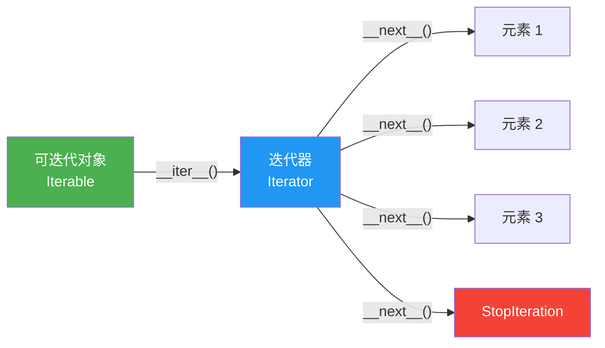
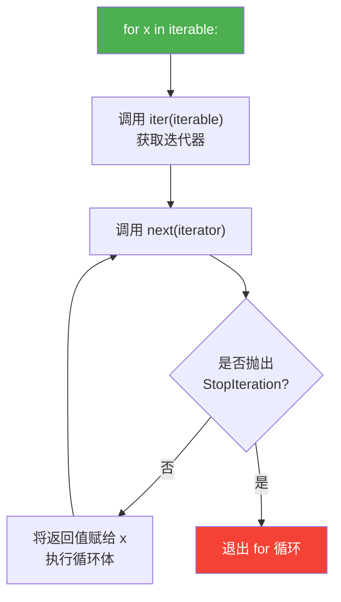

# 迭代器协议

> **所属路径**：`01_基础能力/01_开发环境与技术英语/04_迭代器与函数式工具/01_迭代器协议`
> **预计学习时间**：50 分钟
> **难度等级**：⭐⭐

---

## 前置知识

- [列表推导与生成器](../../01_编程语言基础/04_列表推导与生成器/04_列表推导与生成器.md)（了解列表推导式、生成器表达式和 `yield` 关键字）
- [函数与模块](../../01_编程语言基础/03_函数与模块/03_函数与模块.md)（了解函数定义、参数传递和模块导入）

> 如果以上内容还不熟悉，建议先完成对应课程再继续。

---

## 学习目标

完成本节后，你将能够：

1. 解释 Python 迭代器协议（Iterator Protocol）的两个核心方法 `__iter__` 和 `__next__` 的作用
2. 说明 `for` 循环在底层是如何调用迭代器协议来逐个获取元素的
3. 编写自定义的迭代器类，实现特定的遍历逻辑
4. 区分 **可迭代对象（Iterable）** 和 **迭代器（Iterator）** 的概念
5. 理解生成器函数为什么是创建迭代器的语法糖，以及惰性求值带来的内存优势

---

## 正文讲解

### 1. 从一个日常场景说起

想象你正在逐行阅读一本很厚的书。你不需要把整本书的内容一次性记在脑子里——你只需要记住"当前读到了哪一页哪一行"，然后每次往下读一行就好。如果有人问"下一行是什么？"你就翻到下一行读给他听；如果已经读到了最后一页，你就告诉他"没有了"。

Python 的 **迭代器（Iterator）** 正是这样一个"逐个读取"的机制。无论数据有多大——一个上百万行的日志文件、一个无穷无尽的数字序列——迭代器每次只取出一个元素，用完就丢，绝不会把所有数据一口气塞进内存。

那么问题来了：Python 的 `for` 循环到底是怎么实现这种"每次取一个"的呢？答案就是 **[迭代器协议（Iterator Protocol）](../01_迭代器协议/)** 。

### 2. 可迭代对象与迭代器

在深入协议细节之前，我们先厘清两个容易混淆的概念：

- **可迭代对象（Iterable）** ：任何实现了 `__iter__` 方法的对象。调用 `__iter__` 会返回一个迭代器。列表、字典、字符串、文件对象都是可迭代对象。
- **迭代器（Iterator）** ：同时实现了 `__iter__` 和 `__next__` 方法的对象。`__next__` 每次被调用时返回序列中的下一个元素；当没有更多元素时，抛出 `StopIteration` 异常。

二者的关系可以这样理解：可迭代对象是一个"数据容器"，它知道如何创建一个迭代器；迭代器是一个"游标"，它记住了当前的位置并知道如何取出下一个元素。



> 📌 **图解说明**：可迭代对象通过 `__iter__()` 方法返回一个迭代器，迭代器通过反复调用 `__next__()` 逐个产出元素，直到抛出 `StopIteration` 表示遍历结束。

我们用 Python 内置函数来验证这一点：

```python
numbers = [10, 20, 30]

# 列表是可迭代对象，但不是迭代器
print(hasattr(numbers, '__iter__'))   # True
print(hasattr(numbers, '__next__'))   # False

# 调用 iter() 获取迭代器
it = iter(numbers)  # 等价于 numbers.__iter__()
print(hasattr(it, '__iter__'))   # True
print(hasattr(it, '__next__'))   # True

# 手动调用 next() 逐个获取元素
print(next(it))  # 10
print(next(it))  # 20
print(next(it))  # 30
# print(next(it))  # 会抛出 StopIteration
```

> 💡 **小技巧**：内置函数 `iter(obj)` 实际上就是调用 `obj.__iter__()` ，而 `next(it)` 就是调用 `it.__next__()` 。Python 推荐使用内置函数而非直接调用魔术方法。

### 3. for 循环的真面目

理解了迭代器协议，`for` 循环的工作原理就一目了然了。当你写下：

```python
for x in [10, 20, 30]:
    print(x)
```

Python 解释器实际上执行的等价代码是：

```python
_iter = iter([10, 20, 30])   # 第一步：获取迭代器
while True:
    try:
        x = next(_iter)       # 第二步：获取下一个元素
    except StopIteration:     # 第三步：遇到 StopIteration 就停止
        break
    print(x)                  # 第四步：执行循环体
```



> 📌 **图解说明**：`for` 循环在底层先调用 `iter()` 获取迭代器，然后不断调用 `next()` 取出元素，直到捕获 `StopIteration` 异常后退出循环。

这就是为什么任何实现了 `__iter__` 和 `__next__` 的对象都能放在 `for` 循环中使用——`for` 循环并不关心你是列表、字典、文件还是自定义对象，它只要求你遵守迭代器协议。

### 4. 自定义迭代器类

理解了协议，我们就可以自己动手创建一个迭代器了。下面实现一个 `Countdown` 迭代器，从指定数字倒数到 1：

```python
class Countdown:
    """从 n 倒数到 1 的迭代器"""

    def __init__(self, n):
        self.current = n

    def __iter__(self):
        return self  # 迭代器的 __iter__ 返回自身

    def __next__(self):
        if self.current <= 0:
            raise StopIteration
        value = self.current
        self.current -= 1
        return value


# 使用自定义迭代器
for num in Countdown(5):
    print(num, end=" ")
# 输出: 5 4 3 2 1
```

几个关键细节值得注意：

- `__iter__` 返回 `self` ——这是迭代器类的标准做法，表示"我自己就是迭代器"。
- `__next__` 内部维护状态（`self.current`），每次调用后更新状态。
- 到达结束条件时抛出 `StopIteration` ，这是告诉 `for` 循环"没有更多元素了"的信号。

但要注意一个重要的限制：**迭代器只能遍历一次**。用完之后 `self.current` 已经变成了 0，再次遍历不会得到任何结果：

```python
cd = Countdown(3)
print(list(cd))  # [3, 2, 1]
print(list(cd))  # []  ← 空的！迭代器已经耗尽
```

如果需要支持多次遍历，应该将"可迭代对象"和"迭代器"分开设计——可迭代对象的 `__iter__` 每次返回一个新的迭代器实例：

```python
class CountdownIterable:
    """可多次遍历的倒数可迭代对象"""

    def __init__(self, n):
        self.n = n

    def __iter__(self):
        return CountdownIterator(self.n)  # 每次返回新的迭代器


class CountdownIterator:
    """倒数迭代器（一次性）"""

    def __init__(self, n):
        self.current = n

    def __iter__(self):
        return self

    def __next__(self):
        if self.current <= 0:
            raise StopIteration
        value = self.current
        self.current -= 1
        return value


cd = CountdownIterable(3)
print(list(cd))  # [3, 2, 1]
print(list(cd))  # [3, 2, 1]  ← 每次创建新迭代器，可以重复遍历
```

### 5. 生成器——创建迭代器的语法糖

前面我们用类实现了一个倒数迭代器，写了将近 20 行代码。Python 提供了一种更简洁的方式来创建迭代器——**[生成器（Generator）](../../01_编程语言基础/04_列表推导与生成器/04_列表推导与生成器.md)** 。使用 `yield` 关键字的函数就是生成器函数，调用它会返回一个生成器对象，而生成器对象天然就是一个迭代器：

```python
def countdown(n):
    """生成器版本的倒数"""
    while n > 0:
        yield n
        n -= 1


# 生成器对象是迭代器
gen = countdown(3)
print(hasattr(gen, '__iter__'))   # True
print(hasattr(gen, '__next__'))   # True

print(next(gen))  # 3
print(next(gen))  # 2
print(next(gen))  # 1
# next(gen) 会抛出 StopIteration
```

同样的逻辑，从 20 行类定义缩减为 4 行函数。生成器之所以好用，是因为 Python 帮你自动生成了 `__iter__` 和 `__next__` 方法——每次 `next()` 调用会执行到下一个 `yield` 语句并暂停，函数执行完毕后自动抛出 `StopIteration` 。

生成器表达式更加简洁——它就是"圆括号版的列表推导"：

```python
# 列表推导：一次性创建所有元素，占用内存
squares_list = [x ** 2 for x in range(1000000)]

# 生成器表达式：惰性求值，几乎不占内存
squares_gen = (x ** 2 for x in range(1000000))
```

### 6. 惰性求值的威力

为什么要费这么大劲用迭代器而不直接用列表呢？核心原因是 **惰性求值（Lazy Evaluation）** ——迭代器不会一次性计算所有结果，而是"按需产出"。这在两种场景中至关重要：

**场景一：数据量极大**。假如你要处理一个 10GB 的日志文件：

```python
# ❌ 错误：试图把整个文件读进内存
lines = open("huge_log.txt").readlines()  # 可能导致 MemoryError

# ✅ 正确：逐行迭代，内存中只有一行
for line in open("huge_log.txt"):
    process(line)
```

文件对象本身就是一个迭代器——每次 `next()` 只从磁盘读取一行。

**场景二：序列可能无穷**。比如生成斐波那契数列：

```python
def fibonacci():
    a, b = 0, 1
    while True:  # 无限循环！
        yield a
        a, b = b, a + b

# 从无穷序列中只取前 10 个
from itertools import islice
print(list(islice(fibonacci(), 10)))
# [0, 1, 1, 2, 3, 5, 8, 13, 21, 34]
```

这里用到了 **[itertools 模块](../02_itertools模块/02_itertools模块.md)** 中的 `islice` 函数，它能从迭代器中"切片"取出指定数量的元素——下一课我们会详细学习这个强大的工具箱。

### 7. iter() 的哨兵模式

内置函数 `iter()` 除了接收可迭代对象外，还有一种不太为人知的用法——**哨兵值模式（Sentinel Mode）** ：

```python
iter(callable, sentinel)
```

它会不断调用 `callable()` ，直到返回值等于 `sentinel` 时停止。这在从流或文件中读取数据时特别有用：

```python
# 模拟：不断读取用户输入，直到输入 "quit"
# 等价于 while True: line = input(); if line == "quit": break
import io

# 用 StringIO 模拟输入流
stream = io.StringIO("hello\nworld\nquit\nextra\n")

for line in iter(stream.readline, "quit\n"):
    print(f"收到: {line.strip()}")

# 输出:
# 收到: hello
# 收到: world
```

再比如，按固定块大小读取二进制文件：

```python
from functools import partial

# 每次读取 4096 字节，直到读取到空字节串 b''（文件末尾）
# with open("data.bin", "rb") as f:
#     for block in iter(partial(f.read, 4096), b''):
#         process(block)
```

> 💡 **小技巧**：`iter(callable, sentinel)` 中的 `callable` 必须是一个无参函数。如果原始函数需要参数（如 `f.read(4096)`），可以用 `functools.partial` 把参数"冻结"进去。

---

## 动手实践

现在让我们综合运用本课所学的知识，编写一个可运行的示例：

```python
# 文件：code/iterator_demo.py
# 演示迭代器协议的核心概念

# === 1. 手动使用迭代器协议 ===
print("=== 1. 手动使用迭代器协议 ===")
colors = ["红", "绿", "蓝"]
it = iter(colors)
print(next(it))  # 红
print(next(it))  # 绿
print(next(it))  # 蓝

try:
    next(it)
except StopIteration:
    print("迭代器已耗尽！")


# === 2. 自定义迭代器：等差数列 ===
print("\n=== 2. 自定义迭代器：等差数列 ===")


class ArithmeticSequence:
    """等差数列迭代器"""

    def __init__(self, start, step, count):
        self.current = start
        self.step = step
        self.remaining = count

    def __iter__(self):
        return self

    def __next__(self):
        if self.remaining <= 0:
            raise StopIteration
        value = self.current
        self.current += self.step
        self.remaining -= 1
        return value


seq = ArithmeticSequence(start=2, step=3, count=5)
print(list(seq))  # [2, 5, 8, 11, 14]


# === 3. 生成器 vs 列表的内存对比 ===
print("\n=== 3. 生成器 vs 列表的内存对比 ===")
import sys

list_version = [x ** 2 for x in range(10000)]
gen_version = (x ** 2 for x in range(10000))

print(f"列表占用内存: {sys.getsizeof(list_version):,} 字节")
print(f"生成器占用内存: {sys.getsizeof(gen_version):,} 字节")


# === 4. iter() 哨兵模式 ===
print("\n=== 4. iter() 哨兵模式 ===")
import random

random.seed(42)
# 不断生成随机数，直到生成 5 就停止
for num in iter(lambda: random.randint(1, 10), 5):
    print(f"  生成了: {num}")
print("  遇到 5，停止！")
```

**运行说明**：
- 环境要求：Python 3.10+（无第三方依赖）
- 运行命令：`python code/iterator_demo.py`

**预期输出**：
```
=== 1. 手动使用迭代器协议 ===
红
绿
蓝
迭代器已耗尽！

=== 2. 自定义迭代器：等差数列 ===
[2, 5, 8, 11, 14]

=== 3. 生成器 vs 列表的内存对比 ===
列表占用内存: 87,616 字节
生成器占用内存: 200 字节

=== 4. iter() 哨兵模式 ===
  生成了: 1
  生成了: 10
  遇到 5，停止！
```

从第 3 个例子可以清楚看到：列表把所有元素存在内存中，占用了约 87KB；而生成器对象本身只占 200 字节——无论序列有多长，内存占用几乎不变。这就是惰性求值的威力。

---

## 典型误区

| 误区 | 正确理解 |
| ---- | -------- |
| 可迭代对象和迭代器是同一个东西 | 可迭代对象（Iterable）只需实现 `__iter__` ，迭代器（Iterator）需同时实现 `__iter__` 和 `__next__` 。列表是可迭代对象但不是迭代器 |
| 迭代器可以多次遍历 | 迭代器是一次性的——遍历完后再调用 `next()` 只会得到 `StopIteration` 。如需重复遍历，应将可迭代对象和迭代器分开设计 |
| `for` 循环只能遍历列表和字典 | `for` 循环能遍历任何实现了迭代器协议的对象，包括文件、生成器、自定义类等 |
| 生成器表达式和列表推导式的性能相同 | 生成器表达式采用惰性求值，内存占用极低且启动更快；列表推导式则一次性计算所有结果 |
| `iter()` 只能接收一个参数 | `iter(callable, sentinel)` 的双参数形式可以将任何可调用对象转化为迭代器，非常适合流式读取场景 |

---

## 练习题

### 练习 1：判断迭代器类型（难度：⭐）

判断以下对象分别是"可迭代对象但不是迭代器"还是"既是可迭代对象也是迭代器"：

```python
a = [1, 2, 3]
b = iter([1, 2, 3])
c = (x for x in range(5))
d = "hello"
e = range(10)
```

<details>
<summary>💡 提示</summary>

使用 `hasattr(obj, '__next__')` 来判断是否是迭代器。可迭代对象有 `__iter__` 但不一定有 `__next__` ；迭代器两者都有。

</details>

<details>
<summary>✅ 参考答案</summary>

```python
objects = {
    "a (list)": [1, 2, 3],
    "b (list_iterator)": iter([1, 2, 3]),
    "c (generator)": (x for x in range(5)),
    "d (str)": "hello",
    "e (range)": range(10),
}

for name, obj in objects.items():
    is_iterable = hasattr(obj, '__iter__')
    is_iterator = hasattr(obj, '__next__')
    if is_iterable and is_iterator:
        print(f"{name}: 迭代器（也是可迭代对象）")
    elif is_iterable:
        print(f"{name}: 可迭代对象（不是迭代器）")
    else:
        print(f"{name}: 都不是")
```

预期输出：

```
a (list): 可迭代对象（不是迭代器）
b (list_iterator): 迭代器（也是可迭代对象）
c (generator): 迭代器（也是可迭代对象）
d (str): 可迭代对象（不是迭代器）
e (range): 可迭代对象（不是迭代器）
```

</details>

### 练习 2：实现一个循环迭代器（难度：⭐⭐）

实现一个 `CycleN` 类，接收一个可迭代对象和重复次数 $n$ ，循环产出元素 $n$ 轮：

```python
# CycleN([1, 2, 3], 2) 应产出: 1, 2, 3, 1, 2, 3

for item in CycleN(["A", "B"], 3):
    print(item, end=" ")
# 期望输出: A B A B A B
```

<details>
<summary>💡 提示</summary>

在 `__init__` 中保存原始数据（用 `list()` 转换，因为输入可能是一次性迭代器），用一个计数器记录当前是第几轮、第几个元素。

</details>

<details>
<summary>✅ 参考答案</summary>

```python
class CycleN:
    def __init__(self, iterable, n):
        self.data = list(iterable)
        self.n = n

    def __iter__(self):
        for _ in range(self.n):
            for item in self.data:
                yield item

for item in CycleN(["A", "B"], 3):
    print(item, end=" ")
# 输出: A B A B A B
print()

# 验证
assert list(CycleN([1, 2, 3], 2)) == [1, 2, 3, 1, 2, 3]
print("测试通过！")
```

> 💡 这里巧妙地在 `__iter__` 中使用了 `yield` ，使得 `__iter__` 本身成为一个生成器函数，避免了单独编写迭代器类。

</details>

### 练习 3：逐行读取并过滤（难度：⭐⭐）

编写一个生成器函数 `grep(pattern, lines)` ，接收一个关键字和一个行迭代器，惰性地产出包含该关键字的行：

```python
def grep(pattern, lines):
    """惰性过滤：只产出包含 pattern 的行"""
    # 请实现此函数
    pass

# 测试
log_lines = [
    "2024-01-01 INFO 服务启动",
    "2024-01-01 ERROR 连接超时",
    "2024-01-01 INFO 请求处理完成",
    "2024-01-01 ERROR 数据库异常",
    "2024-01-01 INFO 服务关闭",
]

errors = grep("ERROR", log_lines)
print(type(errors))  # 应该是 generator 类型
print(list(errors))
# 应输出: ['2024-01-01 ERROR 连接超时', '2024-01-01 ERROR 数据库异常']
```

<details>
<summary>💡 提示</summary>

使用 `yield` 关键字，对每一行检查 `pattern in line` ，如果匹配就 `yield` 出去。

</details>

<details>
<summary>✅ 参考答案</summary>

```python
def grep(pattern, lines):
    """惰性过滤：只产出包含 pattern 的行"""
    for line in lines:
        if pattern in line:
            yield line

log_lines = [
    "2024-01-01 INFO 服务启动",
    "2024-01-01 ERROR 连接超时",
    "2024-01-01 INFO 请求处理完成",
    "2024-01-01 ERROR 数据库异常",
    "2024-01-01 INFO 服务关闭",
]

errors = grep("ERROR", log_lines)
print(type(errors))  # <class 'generator'>
result = list(errors)
print(result)
assert result == [
    "2024-01-01 ERROR 连接超时",
    "2024-01-01 ERROR 数据库异常",
]
print("测试通过！")
```

</details>

---

## 下一步学习

- 📖 下一个知识点：[itertools模块](../02_itertools模块/02_itertools模块.md) — 掌握标准库中最强大的迭代器工具箱
- 🔗 相关知识点：[列表推导与生成器](../../01_编程语言基础/04_列表推导与生成器/04_列表推导与生成器.md) — 回顾生成器的基础用法
- 📚 拓展阅读：[自定义容器](../../03_容器类型深入/04_自定义容器/04_自定义容器.md) — 学习如何让自定义类支持更多容器协议

---

## 参考资料

1. [Python 官方文档 - 迭代器类型](https://docs.python.org/zh-cn/3/library/stdtypes.html#iterator-types) — 迭代器协议的官方规范（官方文档）
2. [Python 官方文档 - iter() 内置函数](https://docs.python.org/zh-cn/3/library/functions.html#iter) — `iter()` 函数的两种调用形式（官方文档）
3. [Python 官方教程 - 迭代器](https://docs.python.org/zh-cn/3/tutorial/classes.html#iterators) — 官方教程中关于迭代器的章节（官方文档）
4. [Real Python - Python Iterators](https://realpython.com/python-iterators-iterables/) — 迭代器与可迭代对象的详细对比教程（公开教程）
