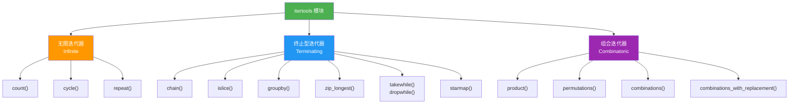

# itertools模块

> **所属路径**：`01_基础能力/01_开发环境与技术英语/04_迭代器与函数式工具/02_itertools模块`
> **预计学习时间**：60 分钟
> **难度等级**：⭐⭐

---

## 前置知识

- [迭代器协议](../01_迭代器协议/01_迭代器协议.md)（理解 `__iter__` 和 `__next__` 的工作原理、惰性求值的概念）
- [列表推导与生成器](../../01_编程语言基础/04_列表推导与生成器/04_列表推导与生成器.md)（了解生成器表达式和 `yield` 关键字）
- [函数与模块](../../01_编程语言基础/03_函数与模块/03_函数与模块.md)（了解 `lambda` 表达式和函数作为参数传递）

> 如果以上内容还不熟悉，建议先完成对应课程再继续。

---

## 学习目标

完成本节后，你将能够：

1. 说明 `itertools` 模块的设计哲学：用可组合的迭代器"积木"构建复杂的数据处理流水线
2. 使用无限迭代器（`count`、`cycle`、`repeat`）生成无穷序列，并安全地从中取出有限元素
3. 使用终止型迭代器（`chain`、`islice`、`groupby`、`zip_longest` 等）对已有数据进行拼接、切片、分组等操作
4. 使用组合迭代器（`product`、`permutations`、`combinations`）生成排列组合
5. 对比 itertools 方案与列表推导方案的内存和性能差异

---

## 正文讲解

### 1. 为什么需要 itertools？

在上一课 [迭代器协议](../01_迭代器协议/01_迭代器协议.md) 中，我们学会了用 `__iter__` 和 `__next__` 创建自定义迭代器，也体验了生成器带来的惰性求值优势。但如果每个常见的迭代模式都要自己手写生成器函数，那工作量可不小。

Python 标准库中的 **itertools 模块** 就是为此而生的——它提供了一组经过优化的"迭代器积木"，涵盖了日常开发中最常见的迭代模式：无限序列生成、序列拼接与切片、分组与聚合、排列与组合……所有这些函数都返回迭代器，天然具备惰性求值和内存高效的特性。

更重要的是，这些"积木"可以自由组合——就像搭乐高积木一样，你可以把 `chain` 和 `islice` 组合起来"先拼接再切片"，把 `groupby` 和 `starmap` 串联起来"先分组再批量处理"。这种组合式编程风格正是函数式编程的核心魅力。



> 📌 **图解说明**：`itertools` 模块的函数大致分为三类——无限迭代器（可以产出无穷多个元素）、终止型迭代器（对有限输入进行变换）和组合迭代器（生成排列组合）。接下来我们逐一介绍每一类中最实用的函数。

### 2. 无限迭代器——永不停歇的数据源

无限迭代器会产出无穷多个元素，因此绝对不能直接用 `list()` 转换——那样会让程序陷入死循环直到内存耗尽。正确的用法是搭配 `islice`、`takewhile` 或手动 `break` 来限制获取的数量。

#### count——无限计数器

`count(start=0, step=1)` 从 `start` 开始，每次递增 `step` ，永远不停：

```python
from itertools import count, islice

# 从 10 开始，每次加 2
counter = count(10, 2)
print(list(islice(counter, 5)))  # [10, 12, 14, 16, 18]

# 给元素自动编号
names = ["Alice", "Bob", "Charlie"]
for i, name in zip(count(1), names):
    print(f"#{i}: {name}")
# #1: Alice
# #2: Bob
# #3: Charlie
```

> 💡 **小技巧**：`zip(count(1), iterable)` 的效果和 `enumerate(iterable, 1)` 一样，但 `count` 更灵活——它支持任意起始值和步长，甚至可以用浮点数。

#### cycle——无限循环

`cycle(iterable)` 把一个可迭代对象无限循环重复：

```python
from itertools import cycle, islice

# 交替分配任务给团队成员
team = cycle(["张三", "李四", "王五"])
tasks = ["任务A", "任务B", "任务C", "任务D", "任务E"]

for task, member in zip(tasks, team):
    print(f"{member} 负责 {task}")
# 张三 负责 任务A
# 李四 负责 任务B
# 王五 负责 任务C
# 张三 负责 任务D
# 李四 负责 任务E
```

注意这里的 `zip(tasks, team)` 会在 `tasks` 耗尽时自动停止——即使 `team` 是无限的，有限序列的一方决定了总长度。

#### repeat——重复同一个值

`repeat(value, times=None)` 不断重复同一个值。如果指定了 `times` ，则只重复有限次：

```python
from itertools import repeat

# 无限重复
print(list(islice(repeat("hello"), 3)))  # ['hello', 'hello', 'hello']

# 有限重复
print(list(repeat(0, 5)))  # [0, 0, 0, 0, 0]

# 实际用途：搭配 map 做幂运算
bases = [2, 3, 4, 5]
print(list(map(pow, bases, repeat(3))))  # [8, 27, 64, 125]
```

### 3. 终止型迭代器——对数据做变换

终止型迭代器接收一个或多个有限的可迭代对象，返回一个新的迭代器。它们是日常数据处理中使用频率最高的一组工具。

#### chain——拼接多个序列

`chain(*iterables)` 把多个可迭代对象首尾相连，形成一个逻辑上的长序列：

```python
from itertools import chain

# 拼接多个列表（不创建新列表，零额外内存）
all_items = chain([1, 2], [3, 4], [5, 6])
print(list(all_items))  # [1, 2, 3, 4, 5, 6]

# 实际场景：合并多个文件的行
# all_lines = chain.from_iterable(open(f) for f in file_list)
```

与 `list1 + list2 + list3` 相比，`chain` 不会创建新的列表对象——它只是在遍历时依次从每个输入中取元素，内存效率更高。

`chain.from_iterable` 是一个变体，接收一个"可迭代对象的可迭代对象"（嵌套结构），将其展平一层：

```python
from itertools import chain

nested = [[1, 2], [3, 4], [5, 6]]
print(list(chain.from_iterable(nested)))  # [1, 2, 3, 4, 5, 6]
```

#### islice——迭代器切片

`islice(iterable, stop)` 或 `islice(iterable, start, stop, step)` 的功能类似列表的 `[start:stop:step]` 切片，但它能对任何迭代器使用——包括无限迭代器和不支持索引的生成器：

```python
from itertools import islice, count

# 从无限计数器中取 5 个
print(list(islice(count(100), 5)))  # [100, 101, 102, 103, 104]

# 带 start 和 step
print(list(islice(range(20), 2, 10, 3)))  # [2, 5, 8]

# 取生成器的前 N 个元素
def fibonacci():
    a, b = 0, 1
    while True:
        yield a
        a, b = b, a + b

print(list(islice(fibonacci(), 8)))  # [0, 1, 1, 2, 3, 5, 8, 13]
```

> ⚠️ **注意**：`islice` 不支持负数索引，因为迭代器没有"长度"的概念，无法从末尾倒数。

#### takewhile 与 dropwhile——条件截取

`takewhile(predicate, iterable)` 从头开始产出元素，直到 `predicate` 返回 `False` 就停止；`dropwhile` 则跳过开头的满足条件的元素，从第一个不满足条件的元素开始产出后续所有元素：

```python
from itertools import takewhile, dropwhile

data = [1, 3, 5, 7, 2, 4, 6, 8]

# 从头取，直到遇到偶数就停
print(list(takewhile(lambda x: x % 2 == 1, data)))
# [1, 3, 5, 7]

# 从头跳过，直到遇到偶数后开始输出
print(list(dropwhile(lambda x: x % 2 == 1, data)))
# [2, 4, 6, 8]
```

注意区分 `takewhile` 和 `filter` ：`filter` 会检查所有元素，只保留满足条件的；`takewhile` 则在第一次不满足时就停止，后面的元素即使满足条件也不会被输出。

#### zip_longest——长度不等的拉链

内置的 `zip` 会在最短的输入耗尽时停止。如果你希望以最长的输入为准，缺失的部分用填充值补齐，就用 `zip_longest` ：

```python
from itertools import zip_longest

names = ["Alice", "Bob", "Charlie"]
scores = [90, 85]

# 内置 zip：以最短为准
print(list(zip(names, scores)))
# [('Alice', 90), ('Bob', 85)]

# zip_longest：以最长为准，缺失用 fillvalue 填充
print(list(zip_longest(names, scores, fillvalue=0)))
# [('Alice', 90), ('Bob', 85), ('Charlie', 0)]
```

#### starmap——展开参数的映射

`starmap(func, iterable)` 类似 `map` ，但它会把每个元素解包为多个参数传给函数：

```python
from itertools import starmap

# map 版本需要 lambda 拆包
pairs = [(2, 3), (4, 5), (6, 7)]
print(list(map(lambda p: p[0] * p[1], pairs)))  # [6, 20, 42]

# starmap 自动拆包，更简洁
print(list(starmap(lambda a, b: a * b, pairs)))  # [6, 20, 42]

# 搭配 pow 计算幂
print(list(starmap(pow, [(2, 10), (3, 5), (10, 3)])))
# [1024, 243, 1000]
```

#### groupby——连续分组

`groupby(iterable, key=None)` 把相邻的相同元素（或 key 函数返回值相同的元素）归为一组。使用前 **必须先对数据按分组键排序**，否则同一组的元素如果不连续，会被拆成多个组：

```python
from itertools import groupby

# 按首字母分组（数据已排序）
words = ["apple", "avocado", "banana", "blueberry", "cherry", "coconut"]

for letter, group in groupby(words, key=lambda w: w[0]):
    print(f"{letter}: {list(group)}")
# a: ['apple', 'avocado']
# b: ['banana', 'blueberry']
# c: ['cherry', 'coconut']
```

> ⚠️ **注意**：`groupby` 只对 **连续相同** 的元素分组。如果数据没有排序，同一类的元素散布在不同位置，它们会被拆成多个组。所以使用 `groupby` 前，务必先用 `sorted()` 按相同的 key 排序。

```python
from itertools import groupby

# 未排序：同一类被拆成多组！
data = [("水果", "苹果"), ("蔬菜", "白菜"), ("水果", "香蕉")]
for k, g in groupby(data, key=lambda x: x[0]):
    print(f"{k}: {[item[1] for item in g]}")
# 水果: ['苹果']
# 蔬菜: ['白菜']
# 水果: ['香蕉']  ← "水果"被拆成了两组！

# 正确做法：先排序
data_sorted = sorted(data, key=lambda x: x[0])
for k, g in groupby(data_sorted, key=lambda x: x[0]):
    print(f"{k}: {[item[1] for item in g]}")
# 水果: ['苹果', '香蕉']
# 蔬菜: ['白菜']
```

### 4. 组合迭代器——排列组合一步到位

组合迭代器用于生成输入元素的各种排列组合，在算法题、测试用例生成和参数搜索中非常有用。

#### product——笛卡尔积

`product(*iterables, repeat=1)` 生成多个可迭代对象的笛卡尔积，等价于嵌套 `for` 循环：

```python
from itertools import product

# 两个集合的笛卡尔积
colors = ["红", "蓝"]
sizes = ["S", "M", "L"]
print(list(product(colors, sizes)))
# [('红', 'S'), ('红', 'M'), ('红', 'L'), ('蓝', 'S'), ('蓝', 'M'), ('蓝', 'L')]

# 等价于：
# [(c, s) for c in colors for s in sizes]

# repeat 参数：自身的笛卡尔积
print(list(product([0, 1], repeat=3)))
# [(0,0,0), (0,0,1), (0,1,0), (0,1,1), (1,0,0), (1,0,1), (1,1,0), (1,1,1)]
```

#### permutations——全排列

`permutations(iterable, r=None)` 生成长度为 $r$ 的所有排列（顺序有关、不重复选取）：

```python
from itertools import permutations

# 3 个元素的全排列
print(list(permutations("ABC")))
# [('A','B','C'), ('A','C','B'), ('B','A','C'),
#  ('B','C','A'), ('C','A','B'), ('C','B','A')]

# 从 4 个中取 2 个的排列
print(list(permutations("ABCD", 2)))
# [('A','B'), ('A','C'), ('A','D'), ('B','A'), ('B','C'), ('B','D'),
#  ('C','A'), ('C','B'), ('C','D'), ('D','A'), ('D','B'), ('D','C')]
```

排列总数为 $A_n^r = \dfrac{n!}{(n-r)!}$ ，当 $r = n$ 时就是 $n!$ 。

#### combinations 与 combinations_with_replacement——组合

`combinations(iterable, r)` 生成长度为 $r$ 的所有组合（顺序无关、不重复选取）：

```python
from itertools import combinations, combinations_with_replacement

# 从 4 个中选 2 个的组合
print(list(combinations("ABCD", 2)))
# [('A','B'), ('A','C'), ('A','D'), ('B','C'), ('B','D'), ('C','D')]

# 允许重复选取的组合
print(list(combinations_with_replacement("AB", 3)))
# [('A','A','A'), ('A','A','B'), ('A','B','B'), ('B','B','B')]
```

组合总数为 $C_n^r = \dfrac{n!}{r!(n-r)!}$ 。

### 5. itertools vs 列表推导——何时用哪个？

你可能会问：很多 itertools 的功能用列表推导也能实现，为什么要多学一套 API？关键区别在于 **惰性求值** 和 **可读性**：

| 维度 | 列表推导 | itertools |
| ---- | -------- | --------- |
| 求值方式 | 立即求值，一次性计算所有结果 | 惰性求值，按需产出 |
| 内存占用 | 与结果大小成正比 | 近乎常数（仅保存状态） |
| 适合场景 | 结果集较小、需要随机访问 | 结果集极大、只需遍历一次 |
| 可读性 | 简单场景更直观 | 复杂组合场景更清晰 |
| 可组合性 | 嵌套多层时可读性下降 | 管道式组合，层层叠加 |

一般原则：如果数据量小且逻辑简单，列表推导更 Pythonic；如果数据量大、需要组合多步操作、或者涉及无限序列，itertools 是更好的选择。

---

## 动手实践

下面用一个综合示例把本课学到的 itertools 函数串联起来：

```python
# 文件：code/itertools_demo.py
# 综合演示 itertools 模块的三类迭代器
from itertools import (
    count, cycle, repeat,
    chain, islice, groupby, zip_longest, starmap,
    product, permutations, combinations,
)

# === 1. 无限迭代器 ===
print("=== 1. 无限迭代器 ===")

# count: 生成编号
items = ["苹果", "香蕉", "橙子"]
for i, item in zip(count(1), items):
    print(f"  #{i} {item}")

# cycle: 轮流分配
team = ["A组", "B组", "C组"]
tasks = [f"任务{i}" for i in range(7)]
assignment = list(zip(tasks, cycle(team)))
print(f"任务分配: {assignment}")

# === 2. 终止型迭代器 ===
print("\n=== 2. 终止型迭代器 ===")

# chain: 拼接序列
morning = ["晨会", "编码"]
afternoon = ["评审", "测试"]
full_day = list(chain(morning, afternoon))
print(f"全天安排: {full_day}")

# islice: 从斐波那契数列中取前 10 个
def fibonacci():
    a, b = 0, 1
    while True:
        yield a
        a, b = b, a + b

fib10 = list(islice(fibonacci(), 10))
print(f"斐波那契前10项: {fib10}")

# groupby: 按成绩等级分组
scores = [
    ("A", "张三"), ("A", "李四"), ("B", "王五"),
    ("B", "赵六"), ("C", "钱七"),
]
print("成绩分组:")
for grade, students in groupby(scores, key=lambda x: x[0]):
    names = [s[1] for s in students]
    print(f"  {grade}等: {names}")

# zip_longest: 对齐不等长序列
questions = ["Q1", "Q2", "Q3"]
answers = ["A1", "A2"]
qa = list(zip_longest(questions, answers, fillvalue="待回答"))
print(f"问答对齐: {qa}")

# === 3. 组合迭代器 ===
print("\n=== 3. 组合迭代器 ===")

# product: 笛卡尔积——生成所有骰子组合
dice = list(product(range(1, 7), repeat=2))
print(f"两个骰子的组合数: {len(dice)}")
print(f"点数之和为7的组合: {[(a, b) for a, b in dice if a + b == 7]}")

# permutations: 3 个字母的全排列
perms = list(permutations("ABC"))
print(f"ABC的全排列({len(perms)}种): {perms[:6]}...")

# combinations: 从5人中选3人
team5 = ["A", "B", "C", "D", "E"]
combos = list(combinations(team5, 3))
print(f"5选3的组合({len(combos)}种): {combos}")
```

**运行说明**：
- 环境要求：Python 3.10+（无第三方依赖）
- 运行命令：`python code/itertools_demo.py`

**预期输出**：
```
=== 1. 无限迭代器 ===
  #1 苹果
  #2 香蕉
  #3 橙子
任务分配: [('任务0', 'A组'), ('任务1', 'B组'), ('任务2', 'C组'), ('任务3', 'A组'), ('任务4', 'B组'), ('任务5', 'C组'), ('任务6', 'A组')]

=== 2. 终止型迭代器 ===
全天安排: ['晨会', '编码', '评审', '测试']
斐波那契前10项: [0, 1, 1, 2, 3, 5, 8, 13, 21, 34]
成绩分组:
  A等: ['张三', '李四']
  B等: ['王五', '赵六']
  C等: ['钱七']
问答对齐: [('Q1', 'A1'), ('Q2', 'A2'), ('Q3', '待回答')]

=== 3. 组合迭代器 ===
两个骰子的组合数: 36
点数之和为7的组合: [(1, 6), (2, 5), (3, 4), (4, 3), (5, 2), (6, 1)]
ABC的全排列(6种): [('A', 'B', 'C'), ('A', 'C', 'B'), ('B', 'A', 'C'), ('B', 'C', 'A'), ('C', 'A', 'B'), ('C', 'B', 'A')]...
5选3的组合(10种): [('A', 'B', 'C'), ('A', 'B', 'D'), ('A', 'B', 'E'), ('A', 'C', 'D'), ('A', 'C', 'E'), ('A', 'D', 'E'), ('B', 'C', 'D'), ('B', 'C', 'E'), ('B', 'D', 'E'), ('C', 'D', 'E')]
```

---

## 典型误区

| 误区 | 正确理解 |
| ---- | -------- |
| 直接对无限迭代器调用 `list()` | 无限迭代器永远不会停止，`list(count())` 会导致内存耗尽。必须搭配 `islice`、`takewhile` 或手动 `break` |
| `groupby` 能对未排序的数据正确分组 | `groupby` 只对 **连续相同** 的元素分组。如果同一类元素不连续，会被拆成多组。使用前务必按 key 排序 |
| itertools 函数返回列表 | 所有 itertools 函数都返回 **迭代器**，需要用 `list()` 转换才能看到全部内容或多次遍历 |
| `permutations` 和 `combinations` 一样 | `permutations` 考虑顺序（AB ≠ BA），`combinations` 不考虑顺序（AB = BA）。排列数通常远大于组合数 |
| `chain` 会创建一个新列表 | `chain` 不复制任何数据，只是在遍历时依次从各个输入迭代器中取元素，内存开销几乎为零 |

---

## 练习题

### 练习 1：展平嵌套列表（难度：⭐）

使用 `chain.from_iterable` 将一个二维列表展平为一维列表：

```python
from itertools import chain

nested = [[1, 2, 3], [4, 5], [6, 7, 8, 9]]
# 请用一行代码将 nested 展平
flat = ???

assert flat == [1, 2, 3, 4, 5, 6, 7, 8, 9]
```

<details>
<summary>💡 提示</summary>

`chain.from_iterable` 接收一个"可迭代对象的可迭代对象"，将其展平一层。记得用 `list()` 将迭代器转为列表。

</details>

<details>
<summary>✅ 参考答案</summary>

```python
from itertools import chain

nested = [[1, 2, 3], [4, 5], [6, 7, 8, 9]]
flat = list(chain.from_iterable(nested))

assert flat == [1, 2, 3, 4, 5, 6, 7, 8, 9]
print(f"展平结果: {flat}")
print("测试通过！")
```

</details>

### 练习 2：密码生成器（难度：⭐⭐）

使用 `product` 生成所有由 `"abc"` 和 `"123"` 组成的两位"密码"（第一位是字母，第二位是数字），并统计总数：

```python
from itertools import product

letters = "abc"
digits = "123"
# 请生成所有密码组合，每个密码是一个字符串
passwords = ???

print(passwords)
assert len(passwords) == 9
assert "a1" in passwords and "c3" in passwords
```

<details>
<summary>💡 提示</summary>

使用 `product(letters, digits)` 生成元组对，再用 `"".join()` 或字符串拼接将元组转为字符串。

</details>

<details>
<summary>✅ 参考答案</summary>

```python
from itertools import product

letters = "abc"
digits = "123"
passwords = ["".join(pair) for pair in product(letters, digits)]

print(passwords)
# ['a1', 'a2', 'a3', 'b1', 'b2', 'b3', 'c1', 'c2', 'c3']
assert len(passwords) == 9
assert "a1" in passwords and "c3" in passwords
print("测试通过！")
```

</details>

### 练习 3：滑动窗口求平均（难度：⭐⭐）

使用 `islice` 实现一个滑动窗口函数 `sliding_window(iterable, n)` ，然后用它计算时间序列数据的移动平均值：

```python
from itertools import islice
from collections import deque

def sliding_window(iterable, n):
    """产出长度为 n 的滑动窗口"""
    # 请实现此函数
    pass

def moving_average(data, window_size):
    """计算移动平均值"""
    return [sum(w) / len(w) for w in sliding_window(data, window_size)]

# 测试
data = [10, 20, 30, 40, 50, 60, 70]
result = moving_average(data, 3)
print(result)
# 期望: [20.0, 30.0, 40.0, 50.0, 60.0]
assert result == [20.0, 30.0, 40.0, 50.0, 60.0]
```

<details>
<summary>💡 提示</summary>

创建迭代器后，先用 `islice` 取前 $n$ 个元素放入一个 `deque(maxlen=n)` 作为初始窗口，然后 `yield tuple(window)` 。之后每取一个新元素，`deque` 会自动丢弃最旧的元素，实现滑动效果。

</details>

<details>
<summary>✅ 参考答案</summary>

```python
from itertools import islice
from collections import deque

def sliding_window(iterable, n):
    """产出长度为 n 的滑动窗口"""
    it = iter(iterable)
    window = deque(islice(it, n), maxlen=n)
    if len(window) == n:
        yield tuple(window)
    for item in it:
        window.append(item)
        yield tuple(window)

def moving_average(data, window_size):
    """计算移动平均值"""
    return [sum(w) / len(w) for w in sliding_window(data, window_size)]

# 测试
data = [10, 20, 30, 40, 50, 60, 70]
result = moving_average(data, 3)
print(result)
assert result == [20.0, 30.0, 40.0, 50.0, 60.0]
print("测试通过！")
```

> 💡 Python 3.10+ 中 `itertools` 新增了 `pairwise()` 函数，Python 3.12+ 还在 `itertools` 的文档中提供了 `sliding_window` 的参考实现。这里我们自己实现一遍以加深理解。

</details>

---

## 下一步学习

- 📖 下一个知识点：[functools模块](../03_functools模块/03_functools模块.md) — 学习缓存、偏函数和函数组合工具
- 🔗 相关知识点：[迭代器协议](../01_迭代器协议/01_迭代器协议.md) — 回顾迭代器的底层机制
- 📚 拓展阅读：[collections模块](../../03_容器类型深入/01_collections模块/01_collections模块.md) — 掌握 deque 等高效容器，与 itertools 搭配使用

---

## 参考资料

1. [Python 官方文档 - itertools 模块](https://docs.python.org/zh-cn/3/library/itertools.html) — itertools 全部函数的完整 API 参考与使用示例（官方文档）
2. [Python 官方文档 - 函数式编程 HOWTO](https://docs.python.org/zh-cn/3/howto/functional.html) — Python 函数式编程风格指南，涵盖迭代器和 itertools（官方文档）
3. [Real Python - Python itertools](https://realpython.com/python-itertools/) — itertools 模块的详细使用教程与实际案例（公开教程）
4. [more-itertools 文档](https://more-itertools.readthedocs.io/) — itertools 的社区扩展库，提供更多实用迭代器工具（开源项目，MIT 许可）
