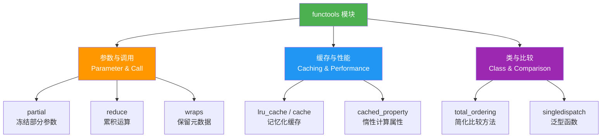

# functools模块

> **所属路径**：`01_基础能力/01_开发环境与技术英语/04_迭代器与函数式工具/03_functools模块`
> **预计学习时间**：50 分钟
> **难度等级**：⭐⭐

---

## 前置知识

- [装饰器与上下文管理器](../../01_编程语言基础/06_装饰器与上下文管理器/06_装饰器与上下文管理器.md)（理解装饰器的语法和原理）
- [迭代器协议](../01_迭代器协议/01_迭代器协议.md)（理解迭代器和惰性求值的基本概念）

> 如果以上内容还不熟悉，建议先完成对应课程再继续。

---

## 学习目标

完成本节后，你将能够：

1. 使用 `functools.partial` 为函数预填参数，简化重复调用
2. 使用 `functools.lru_cache` 和 `functools.cache` 对纯函数进行 **[记忆化（Memoization）](../01_迭代器协议/)** ，避免重复计算
3. 使用 `functools.reduce` 对序列执行累积运算
4. 使用 `functools.wraps` 在编写装饰器时保留被装饰函数的元数据
5. 了解 `functools.total_ordering`、`functools.singledispatch` 和 `functools.cached_property` 的用途与场景

---

## 正文讲解

### 1. 从一个重复调用的烦恼说起

假设你正在做一个国际化项目，需要频繁调用一个日志函数，而每次调用都要传入同一个 `level="DEBUG"` 参数：

```python
def log(level, message):
    print(f"[{level}] {message}")

log("DEBUG", "初始化配置")
log("DEBUG", "加载数据")
log("DEBUG", "开始训练")
```

每次都写 `"DEBUG"` 太啰嗦了。你或许会想：能不能把 `level="DEBUG"` 提前"固定"好，之后只传 `message` 就行？

这正是 **functools 模块** 要解决的第一类问题——通过 **[偏函数（Partial Function）](../03_functools模块/)** 冻结部分参数，生成一个更简洁的新函数。

事实上，`functools` 模块是 Python 标准库中专门为 **函数式编程（Functional Programming）** 提供工具的模块。它的名字就暗示了用途：**func**tion + **tools**——函数工具箱。这个工具箱里的工具大致可以分为三类：



> 📌 **图解说明**：`functools` 模块的工具分为三大类——参数与调用类（简化函数调用方式）、缓存与性能类（避免重复计算）、类与比较类（简化类定义）。接下来我们按使用频率从高到低逐一学习。

### 2. partial——冻结参数，生成新函数

**`functools.partial(func, *args, **kwargs)`** 接收一个函数和一些预填的参数，返回一个新的 **[可调用对象（Callable）](../../01_编程语言基础/03_函数与模块/03_函数与模块.md)** 。当你调用这个新对象时，它会把预填的参数和你新传入的参数合并在一起，再调用原函数。

回到刚才的日志例子：

```python
from functools import partial

def log(level, message):
    print(f"[{level}] {message}")

# 冻结 level 参数，生成 debug 专用函数
debug = partial(log, "DEBUG")
info = partial(log, "INFO")

debug("初始化配置")   # [DEBUG] 初始化配置
debug("加载数据")     # [DEBUG] 加载数据
info("训练完成")      # [INFO] 训练完成
```

`partial` 的强大之处在于它不仅冻结位置参数，也支持冻结关键字参数。例如把 `int()` 函数的 `base` 参数固定为 2，就得到了一个"二进制转十进制"函数：

```python
from functools import partial

binary_to_int = partial(int, base=2)
print(binary_to_int("1010"))  # 10
print(binary_to_int("1111"))  # 15
```

想一想：这和用 `lambda` 写 `lambda s: int(s, base=2)` 有什么区别？功能上几乎一样，但 `partial` 对象保留了原始函数的引用（`binary_to_int.func` 就是 `int`），这在调试和序列化时更有优势。

### 3. lru_cache 与 cache——记忆化缓存

接下来看一个经典问题——用递归计算第 $n$ 个 **[斐波那契数（Fibonacci Number）](../../02_数学基础/01_线性代数/)** ：

```python
def fib(n):
    if n < 2:
        return n
    return fib(n - 1) + fib(n - 2)
```

当 $n = 40$ 时，这段代码慢得令人崩溃，因为它做了大量重复计算——`fib(38)` 被算了两次，`fib(37)` 被算了三次，以此类推。

**`functools.lru_cache`** 是一个装饰器，它自动为函数建立一个缓存字典：如果某组参数已经计算过，就直接返回缓存的结果，不再重复执行函数体。LRU 代表 **Least Recently Used（最近最少使用）** ，当缓存满了时会淘汰最久没用过的条目。

```python
from functools import lru_cache

@lru_cache(maxsize=128)
def fib(n):
    if n < 2:
        return n
    return fib(n - 1) + fib(n - 2)

print(fib(40))  # 102334155，瞬间返回
print(fib.cache_info())  # 查看缓存命中率
```

`maxsize` 参数控制缓存容量。传入 `None` 则不限大小。Python 3.9+ 还引入了 **`functools.cache`** ——它就是 `lru_cache(maxsize=None)` 的简写，适合参数空间不大、不需要淘汰策略的场景：

```python
from functools import cache  # Python 3.9+

@cache
def factorial(n):
    return 1 if n < 2 else n * factorial(n - 1)
```

> ⚠️ **注意**：`lru_cache` 要求函数参数必须是 **[可哈希的（Hashable）](../../03_容器类型深入/05_容器性能对比/05_容器性能对比.md)** ，因为它用参数元组作为字典的键。列表、字典等可变对象不能直接作为参数。

### 4. reduce——累积运算

在上一课 **[itertools模块](../02_itertools模块/02_itertools模块.md)** 中，我们用 `accumulate` 查看了累积运算的中间过程。如果你只关心最终结果，**`functools.reduce`** 更加简洁。

`reduce(func, iterable, initial)` 的工作方式是：

1. 从 `iterable` 中取出前两个元素 $a_1, a_2$ ，计算 `func(a_1, a_2)` 得到中间结果 $r_1$
2. 再取出第三个元素 $a_3$ ，计算 `func(r_1, a_3)` 得到 $r_2$
3. 如此反复，直到序列耗尽，返回最终结果

如果提供了 `initial` 参数，则它作为第一轮计算的 $a_1$ 。

```python
from functools import reduce

# 计算 1 * 2 * 3 * 4 * 5
product = reduce(lambda a, b: a * b, [1, 2, 3, 4, 5])
print(product)  # 120

# 带初始值——空列表时不会报错
total = reduce(lambda a, b: a + b, [], 0)
print(total)  # 0
```

虽然 `reduce` 功能强大，但在实际项目中，很多场景用 `sum()`、`math.prod()`、`max()` 等内置函数更清晰。`reduce` 更适合定义不那么常见的累积逻辑，比如嵌套字典的深度取值：

```python
from functools import reduce

data = {"a": {"b": {"c": 42}}}
keys = ["a", "b", "c"]
result = reduce(lambda d, k: d[k], keys, data)
print(result)  # 42
```

### 5. wraps——装饰器的好搭档

在 **[装饰器与上下文管理器](../../01_编程语言基础/06_装饰器与上下文管理器/06_装饰器与上下文管理器.md)** 一课中，你可能注意到一个问题：用装饰器包装后，原函数的 `__name__`、`__doc__` 等元数据会丢失：

```python
def my_decorator(func):
    def wrapper(*args, **kwargs):
        return func(*args, **kwargs)
    return wrapper

@my_decorator
def greet(name):
    """打招呼函数"""
    return f"你好，{name}！"

print(greet.__name__)  # wrapper  ← 不是 greet！
print(greet.__doc__)   # None     ← 文档字符串丢了！
```

**`functools.wraps`** 就是为了解决这个问题而存在的。它本身是一个装饰器，用来把被包装函数的元数据复制到 wrapper 函数上：

```python
from functools import wraps

def my_decorator(func):
    @wraps(func)  # ← 加上这一行
    def wrapper(*args, **kwargs):
        return func(*args, **kwargs)
    return wrapper

@my_decorator
def greet(name):
    """打招呼函数"""
    return f"你好，{name}！"

print(greet.__name__)  # greet  ✓
print(greet.__doc__)   # 打招呼函数  ✓
```

这是编写装饰器时的最佳实践——**始终使用 `@wraps`** 。

### 6. total_ordering——简化比较方法

当你定义一个需要支持比较操作的类时，可能需要实现 `__lt__`、`__le__`、`__gt__`、`__ge__` 四个方法。**`functools.total_ordering`** 让你只需实现 `__eq__` 和另外一个比较方法（比如 `__lt__`），它会自动帮你推导出其余的：

```python
from functools import total_ordering

@total_ordering
class Student:
    def __init__(self, name, score):
        self.name = name
        self.score = score

    def __eq__(self, other):
        return self.score == other.score

    def __lt__(self, other):
        return self.score < other.score

    def __repr__(self):
        return f"Student({self.name!r}, {self.score})"

s1 = Student("Alice", 90)
s2 = Student("Bob", 85)
print(s1 > s2)   # True  ← 自动推导出来的
print(s1 >= s2)  # True
print(s1 <= s2)  # False
```

### 7. singledispatch——泛型函数

有时候你希望同一个函数名根据第一个参数的类型执行不同的逻辑——这就是 **[泛型函数（Generic Function）](../03_functools模块/)** 的思路。`functools.singledispatch` 让你无需写大量 `if isinstance(...)` 判断：

```python
from functools import singledispatch

@singledispatch
def format_value(value):
    return str(value)

@format_value.register(int)
def _(value):
    return f"整数: {value:,}"

@format_value.register(float)
def _(value):
    return f"浮点: {value:.2f}"

@format_value.register(list)
def _(value):
    return f"列表[{len(value)}项]"

print(format_value(1234567))    # 整数: 1,234,567
print(format_value(3.14159))    # 浮点: 3.14
print(format_value([1, 2, 3]))  # 列表[3项]
print(format_value("hello"))    # hello（走默认分支）
```

### 8. cached_property——惰性计算属性

最后介绍一个在类中非常实用的工具。`functools.cached_property`（Python 3.8+）和内置的 `@property` 类似，但它只在第一次访问时计算，之后把结果缓存到实例的 `__dict__` 中：

```python
from functools import cached_property

class DataAnalyzer:
    def __init__(self, data):
        self.data = data

    @cached_property
    def mean(self):
        print("正在计算均值...")  # 只会打印一次
        return sum(self.data) / len(self.data)

analyzer = DataAnalyzer([1, 2, 3, 4, 5])
print(analyzer.mean)  # 正在计算均值... 3.0
print(analyzer.mean)  # 3.0（直接从缓存取，不再计算）
```

这对于计算开销大且结果不变的属性特别有用——例如数据集的统计量、模型的参数数量等。

---

## 动手实践

下面这段代码综合运用了 `partial`、`lru_cache`、`reduce` 和 `wraps`，实现了一个带计时功能的斐波那契计算器：

```python
# 文件：code/functools_demo.py
from functools import partial, lru_cache, reduce, wraps
import time

# --- wraps：编写一个计时装饰器 ---
def timer(func):
    @wraps(func)
    def wrapper(*args, **kwargs):
        start = time.perf_counter()
        result = func(*args, **kwargs)
        elapsed = time.perf_counter() - start
        print(f"{func.__name__}({args}) 耗时: {elapsed:.6f}秒")
        return result
    return wrapper

# --- lru_cache：带缓存的斐波那契 ---
@timer
@lru_cache(maxsize=256)
def fib(n):
    """计算第 n 个斐波那契数"""
    if n < 2:
        return n
    return fib(n - 1) + fib(n - 2)

# --- partial：创建特定起点的累加器 ---
def power(base, exp):
    return base ** exp

square = partial(power, exp=2)
cube = partial(power, exp=3)

# --- reduce：批量计算乘积 ---
def product(iterable):
    return reduce(lambda a, b: a * b, iterable, 1)

if __name__ == "__main__":
    # 测试 lru_cache
    print("=== 斐波那契 ===")
    print(f"fib(30) = {fib(30)}")
    print(f"缓存信息: {fib.__wrapped__.cache_info()}")

    # 测试 partial
    print("\n=== 偏函数 ===")
    print(f"square(5) = {square(5)}")
    print(f"cube(3) = {cube(3)}")

    # 测试 reduce
    print("\n=== reduce 累积 ===")
    print(f"product([1,2,3,4,5]) = {product([1, 2, 3, 4, 5])}")

    # 验证 wraps 保留了元数据
    print(f"\n函数名: {fib.__name__}")
    print(f"文档: {fib.__doc__}")
```

**运行说明**：
- 环境要求：Python 3.8+
- 运行命令：`python code/functools_demo.py`

**预期输出**（计时数据会因机器而异）：
```
=== 斐波那契 ===
fib((30,)) 耗时: 0.000xxx秒
fib(30) = 832040
缓存信息: CacheInfo(hits=27, misses=31, maxsize=256, currsize=31)

=== 偏函数 ===
square(5) = 25
cube(3) = 27

=== reduce 累积 ===
product([1,2,3,4,5]) = 120

函数名: fib
文档: 计算第 n 个斐波那契数
```

从缓存信息可以看出，31 次不同参数的调用中有 27 次命中了缓存——这正是 `lru_cache` 避免重复计算的威力。

---

## 典型误区

| 误区 | 正确理解 |
| --- | --- |
| 对带有可变参数（如列表）的函数使用 `lru_cache` | `lru_cache` 要求所有参数都是可哈希的。如果参数包含列表或字典，需要先转为元组或 `frozenset` |
| `reduce` 对空序列调用时不传 `initial` | 当序列为空且没有 `initial` 时，`reduce` 会抛出 `TypeError`。养成传 `initial` 的习惯 |
| 写装饰器时忘记 `@wraps` | 不加 `@wraps` 会导致被装饰函数的 `__name__`、`__doc__` 等元数据丢失，影响调试和文档生成 |
| 认为 `cached_property` 等价于 `lru_cache` | `cached_property` 用于类的属性，缓存存储在实例的 `__dict__` 中；`lru_cache` 用于普通函数，缓存存储在函数对象上 |
| 混淆 `partial` 和 `lambda` 的适用场景 | `partial` 更适合冻结已有函数的参数，保留原始函数引用；`lambda` 更适合定义全新的简短逻辑 |

---

## 练习题

### 练习 1：缓存加速（难度：⭐）

编写一个带 `@lru_cache` 的函数 `climb_stairs(n)` ，计算爬 $n$ 级台阶共有多少种走法（每次可以走 1 级或 2 级）。测试 `climb_stairs(30)` 应返回 1346269。

<details>
<summary>💡 提示</summary>

这个问题的递推关系和斐波那契数列完全一样：$f(n) = f(n-1) + f(n-2)$ ，只是 $f(1) = 1, f(2) = 2$ 。

</details>

<details>
<summary>✅ 参考答案</summary>

```python
from functools import lru_cache

@lru_cache(maxsize=None)
def climb_stairs(n):
    if n <= 2:
        return n
    return climb_stairs(n - 1) + climb_stairs(n - 2)

assert climb_stairs(30) == 1346269
print(f"climb_stairs(30) = {climb_stairs(30)}")
print("测试通过！")
```

</details>

### 练习 2：偏函数工厂（难度：⭐⭐）

使用 `functools.partial` 创建一组进制转换函数：`to_binary`（二进制字符串转十进制）、`to_octal`（八进制转十进制）、`to_hex`（十六进制转十进制）。验证 `to_binary("11111111")` 返回 255，`to_hex("ff")` 返回 255。

<details>
<summary>💡 提示</summary>

内置函数 `int(x, base)` 可以将字符串按指定进制转换为十进制整数。用 `partial` 冻结 `base` 参数即可。

</details>

<details>
<summary>✅ 参考答案</summary>

```python
from functools import partial

to_binary = partial(int, base=2)
to_octal = partial(int, base=8)
to_hex = partial(int, base=16)

assert to_binary("11111111") == 255
assert to_octal("377") == 255
assert to_hex("ff") == 255
print("全部测试通过！")
```

</details>

### 练习 3：带超时的缓存装饰器（难度：⭐⭐⭐）

`lru_cache` 不支持缓存过期。请编写一个装饰器 `timed_cache(seconds)` ，它在底层使用 `lru_cache` 进行缓存，但如果距离上次缓存已过去超过 `seconds` 秒，则清空缓存重新计算。要求使用 `@wraps` 保留原函数元数据。

<details>
<summary>💡 提示</summary>

可以在 wrapper 函数中记录上次清空时间，每次调用时检查当前时间。如果超时，调用 `func.cache_clear()` 清空缓存。

</details>

<details>
<summary>✅ 参考答案</summary>

```python
from functools import lru_cache, wraps
import time

def timed_cache(seconds):
    def decorator(func):
        cached_func = lru_cache(maxsize=128)(func)
        cached_func._last_reset = time.time()

        @wraps(func)
        def wrapper(*args, **kwargs):
            now = time.time()
            if now - cached_func._last_reset > seconds:
                cached_func.cache_clear()
                cached_func._last_reset = now
            return cached_func(*args, **kwargs)

        wrapper.cache_info = cached_func.cache_info
        wrapper.cache_clear = cached_func.cache_clear
        return wrapper
    return decorator

@timed_cache(seconds=2)
def expensive_query(key):
    """模拟耗时查询"""
    print(f"  实际计算: {key}")
    return key.upper()

# 测试
print(expensive_query("hello"))  # 实际计算
print(expensive_query("hello"))  # 命中缓存
time.sleep(2.5)
print(expensive_query("hello"))  # 缓存过期，重新计算
print(f"函数名: {expensive_query.__name__}")
print(f"文档: {expensive_query.__doc__}")
print("测试通过！")
```

</details>

---

## 下一步学习

- 📖 下一个知识点：[operator模块与排序](../04_operator模块与排序/04_operator模块与排序.md) — 学习用 operator 函数替代 lambda，实现更高效的排序和运算
- 🔗 相关知识点：[itertools模块](../02_itertools模块/02_itertools模块.md) — 回顾迭代器组合工具，与 functools 搭配使用
- 📚 拓展阅读：[装饰器与上下文管理器](../../01_编程语言基础/06_装饰器与上下文管理器/06_装饰器与上下文管理器.md) — 深入理解装饰器模式，加深对 `wraps` 的理解

---

## 参考资料

1. [Python 官方文档 - functools 模块](https://docs.python.org/zh-cn/3/library/functools.html) — functools 全部函数的完整 API 参考与使用示例（官方文档）
2. [Python 官方文档 - 函数式编程 HOWTO](https://docs.python.org/zh-cn/3/howto/functional.html) — Python 函数式编程风格指南，涵盖 reduce、partial 等工具（官方文档）
3. [Real Python - Python's functools Module](https://realpython.com/python-functools/) — functools 模块的详细教程与实际案例（公开教程）
4. [Python Wiki - Memoization](https://wiki.python.org/moin/PythonDecoratorLibrary#Memoize) — Python 装饰器库中的记忆化模式参考（社区 Wiki，公开资源）
