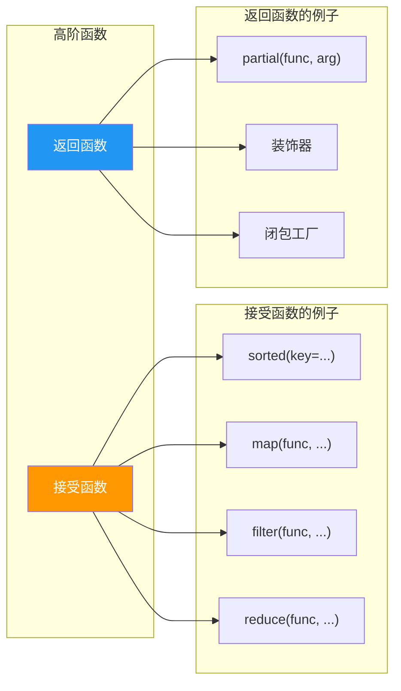
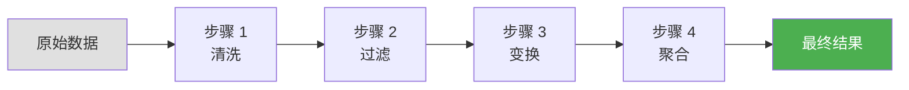

# 高阶函数实践

> **所属路径**：`01_基础能力/01_开发环境与技术英语/04_迭代器与函数式工具/05_高阶函数实践`
> **预计学习时间**：50 分钟
> **难度等级**：⭐⭐⭐

---

## 前置知识

- [函数与模块](../../01_编程语言基础/03_函数与模块/03_函数与模块.md)（理解函数作为一等对象、`lambda` 表达式、闭包）
- [迭代器协议](../01_迭代器协议/01_迭代器协议.md)（理解迭代器和惰性求值）
- [itertools模块](../02_itertools模块/02_itertools模块.md)（了解迭代器组合工具）
- [functools模块](../03_functools模块/03_functools模块.md)（了解 `partial`、`reduce` 等工具）

> 如果以上内容还不熟悉，建议先完成对应课程再继续。

---

## 学习目标

完成本节后，你将能够：

1. 解释 **高阶函数（Higher-Order Function）** 的概念——接受函数作为参数或返回函数的函数
2. 熟练运用 `map()`、`filter()`、`reduce()` 三件套进行函数式数据变换
3. 实现 **函数组合（Function Composition）** 和 **管道模式（Pipeline Pattern）** ，将多个小函数串联成数据处理流水线
4. 将装饰器理解为高阶函数的一种应用
5. 判断何时使用函数式风格、何时使用命令式风格，做出合理的代码风格选择

---

## 正文讲解

### 1. 什么是高阶函数？

在前几节课中，我们已经多次将函数作为参数传递——传给 `sorted()` 的 `key` 参数、传给 `map()` 的变换函数、传给 `reduce()` 的累积函数。这些接受函数作为参数的函数，就叫做 **高阶函数（Higher-Order Function）** 。

更准确地说，满足以下任一条件的函数就是高阶函数：

- **接受一个或多个函数作为参数**（如 `sorted(data, key=func)`）
- **返回一个函数作为结果**（如 `functools.partial(func, arg)` 返回新函数）

高阶函数是 **[函数式编程（Functional Programming）](../../01_编程语言基础/03_函数与模块/03_函数与模块.md)** 的核心构件。在 Python 中，函数是 **[一等对象（First-Class Object）](../../01_编程语言基础/03_函数与模块/03_函数与模块.md)** ——它们可以像普通变量一样被赋值、传递、存储在数据结构中。正是这个特性让高阶函数成为可能。



> 📌 **图解说明**：高阶函数分为两大类——接受函数作为参数（如 `map`、`filter`、`sorted`）和返回函数作为结果（如 `partial`、装饰器、闭包工厂）。许多高阶函数同时属于两类。

### 2. map、filter、reduce 三件套

这三个函数是函数式编程中最经典的组合，几乎在所有编程语言中都有对应物。我们在前面的课程中已经分别接触过它们，现在把它们放在一起，看看如何协同工作。

#### map——逐个变换

`map(func, iterable)` 对可迭代对象中的每个元素应用 `func` ，返回一个惰性迭代器：

```python
numbers = [1, 2, 3, 4, 5]
squares = list(map(lambda x: x ** 2, numbers))
print(squares)  # [1, 4, 9, 16, 25]
```

#### filter——条件筛选

`filter(func, iterable)` 保留 `func` 返回 `True` 的元素：

```python
numbers = [1, 2, 3, 4, 5, 6, 7, 8]
evens = list(filter(lambda x: x % 2 == 0, numbers))
print(evens)  # [2, 4, 6, 8]
```

#### reduce——累积聚合

**[functools.reduce](../03_functools模块/03_functools模块.md)** 将序列"折叠"成一个值：

```python
from functools import reduce

numbers = [1, 2, 3, 4, 5]
total = reduce(lambda a, b: a + b, numbers)
print(total)  # 15
```

把三者串起来，就能用函数式风格完成"对列表中的偶数求平方和"：

```python
from functools import reduce

numbers = range(1, 11)

result = reduce(
    lambda a, b: a + b,                 # 第三步：累加
    map(lambda x: x ** 2,                # 第二步：平方
        filter(lambda x: x % 2 == 0,     # 第一步：筛选偶数
               numbers))
)
print(result)  # 220 = 4 + 16 + 36 + 64 + 100
```

不过说实话，嵌套三层函数调用读起来有点费劲。有没有更优雅的写法？这就引出了下一个话题——函数组合与管道模式。

### 3. 函数组合——把小函数拼成大函数

在数学中，如果有两个函数 $f$ 和 $g$ ，它们的 **[组合（Composition）](../05_高阶函数实践/)** 写作 $f \circ g$ ，定义为 $(f \circ g)(x) = f(g(x))$ 。

在 Python 中，我们可以编写一个 `compose` 函数来实现这种组合：

```python
from functools import reduce

def compose(*funcs):
    """从右到左组合多个函数：compose(f, g, h)(x) = f(g(h(x)))"""
    def composed(x):
        return reduce(lambda acc, f: f(acc), reversed(funcs), x)
    return composed

# 示例：将字符串先去空格，再转小写，最后取长度
pipeline = compose(len, str.lower, str.strip)
print(pipeline("  Hello World  "))  # 11
```

注意组合的方向是 **从右到左**——这和数学中的写法一致，但与阅读顺序相反。很多人更喜欢 **从左到右** 的"管道"风格，这就是 **管道模式（Pipeline Pattern）** 。

### 4. 管道模式——数据从左流向右

管道模式的核心思想是：**数据像水一样依次流过一系列处理步骤，每一步的输出是下一步的输入**。



> 📌 **图解说明**：管道模式将数据处理拆分为多个独立的步骤，数据从左到右依次流过每一步。每个步骤只做一件事，组合起来完成复杂任务。

我们可以实现一个 `pipe` 函数，让函数按从左到右的顺序执行：

```python
from functools import reduce

def pipe(value, *funcs):
    """将 value 依次传入每个函数：pipe(x, f, g, h) = h(g(f(x)))"""
    return reduce(lambda acc, f: f(acc), funcs, value)

# 示例
result = pipe(
    "  Hello, World!  ",
    str.strip,
    str.lower,
    lambda s: s.replace("!", ""),
)
print(result)  # "hello, world"
```

这种写法的好处是 **阅读顺序与执行顺序一致**——从上到下就是数据的处理流程，非常直观。

### 5. 装饰器——高阶函数的经典应用

在 **[装饰器与上下文管理器](../../01_编程语言基础/06_装饰器与上下文管理器/06_装饰器与上下文管理器.md)** 一课中，我们学习了装饰器的语法和用法。现在从高阶函数的角度重新审视它：

- 装饰器是一个接受函数作为参数、返回新函数的函数——这正是高阶函数的定义
- `@decorator` 语法只是 `func = decorator(func)` 的语法糖

理解了这一点，你就能自如地编写各种装饰器——计时、日志、权限检查、重试、缓存……它们本质上都是高阶函数。

```python
from functools import wraps

def retry(max_attempts=3):
    """高阶函数：返回一个装饰器"""
    def decorator(func):
        @wraps(func)
        def wrapper(*args, **kwargs):
            for attempt in range(1, max_attempts + 1):
                try:
                    return func(*args, **kwargs)
                except Exception as e:
                    if attempt == max_attempts:
                        raise
                    print(f"  第 {attempt} 次失败: {e}，重试中...")
        return wrapper
    return decorator
```

这里 `retry(max_attempts=3)` 本身返回一个装饰器，装饰器又返回 `wrapper` 函数——这是高阶函数的两层嵌套。

### 6. 构建数据处理管道

现在我们把前面学到的所有工具综合起来，解决一个现实问题：清洗和处理一批用户记录。

假设你拿到了这样一份原始数据：

```python
raw_records = [
    {"name": " Alice ", "age": "25", "email": "ALICE@EXAMPLE.COM"},
    {"name": "Bob",     "age": "invalid", "email": "bob@example.com"},
    {"name": " Carol ", "age": "30", "email": "CAROL@EXAMPLE.COM"},
    {"name": "",        "age": "28", "email": "nobody@example.com"},
    {"name": " Dave ",  "age": "22", "email": "dave@example.com"},
]
```

你需要：(1) 去掉 name 的前后空格并转为小写；(2) 将 age 转为整数，无效则标记为 `None` ；(3) email 转为小写；(4) 过滤掉 name 为空或 age 无效的记录；(5) 按 age 排序。

用函数式风格，每个步骤就是一个小函数：

```python
from operator import itemgetter

def clean_name(record):
    return {**record, "name": record["name"].strip().lower()}

def clean_email(record):
    return {**record, "email": record["email"].lower()}

def parse_age(record):
    try:
        return {**record, "age": int(record["age"])}
    except ValueError:
        return {**record, "age": None}

def is_valid(record):
    return record["name"] and record["age"] is not None

def process_pipeline(records):
    cleaned = map(clean_name, records)
    cleaned = map(clean_email, cleaned)
    cleaned = map(parse_age, cleaned)
    valid = filter(is_valid, cleaned)
    return sorted(valid, key=itemgetter("age"))
```

每个函数只做一件事，组合起来就完成了整个数据清洗流程。这就是函数式编程的魅力：**小函数 + 组合 = 大能力**。

### 7. 函数式风格 vs 命令式风格——如何选择？

函数式编程虽然优雅，但并不适合所有场景。以下是一些实用的判断标准：

| 场景 | 推荐风格 | 原因 |
| --- | --- | --- |
| 数据变换（map/filter/sort） | 函数式 | 逻辑清晰，无副作用 |
| 简单的循环处理 | 命令式（for 循环） | 更直观，调试更方便 |
| 复杂的状态管理 | 命令式 | 函数式处理可变状态很笨拙 |
| IO 操作（读写文件、网络请求） | 命令式 | IO 本质上有副作用 |
| 短小的变换链（2-3 步） | 列表推导 | 最 Pythonic 的方式 |
| 长的变换链（4+ 步） | 管道模式 | 每步独立，易于测试和维护 |

Python 的设计哲学是 **实用主义**（"There should be one—and preferably only one—obvious way to do it"）。在实际项目中，最好的做法是：**以可读性为第一优先级，在合适的地方使用函数式工具，但不要强行"纯函数式"** 。

列表推导和生成器表达式往往是 `map` + `filter` 的更 Pythonic 替代：

```python
# 函数式写法
result = list(map(lambda x: x ** 2, filter(lambda x: x % 2 == 0, range(10))))

# Pythonic 写法（推荐）
result = [x ** 2 for x in range(10) if x % 2 == 0]
```

两者功能完全等价，但后者更简洁、更易读。不过当变换逻辑复杂到需要拆成多个具名函数时，管道模式比嵌套的列表推导更清晰。

---

## 动手实践

下面是一个完整的数据处理管道示例，模拟清洗电商订单数据：

```python
# 文件：code/higher_order_demo.py
from functools import reduce, partial
from operator import itemgetter
from itertools import groupby

# --- 原始数据 ---
raw_orders = [
    {"user": " Alice ", "product": "笔记本", "price": "5999", "qty": "2"},
    {"user": "Bob",     "product": "键盘",   "price": "299",  "qty": "invalid"},
    {"user": " Carol ", "product": "鼠标",   "price": "149",  "qty": "3"},
    {"user": "",        "product": "显示器", "price": "2499", "qty": "1"},
    {"user": " Alice ", "product": "耳机",   "price": "899",  "qty": "1"},
    {"user": " Dave ",  "product": "笔记本", "price": "6999", "qty": "1"},
]

# --- 步骤 1：清洗用户名 ---
def clean_user(order):
    return {**order, "user": order["user"].strip()}

# --- 步骤 2：解析数值字段 ---
def parse_numbers(order):
    try:
        price = float(order["price"])
        qty = int(order["qty"])
        return {**order, "price": price, "qty": qty, "total": price * qty}
    except (ValueError, TypeError):
        return {**order, "price": None, "qty": None, "total": None}

# --- 步骤 3：过滤无效记录 ---
def is_valid_order(order):
    return bool(order["user"]) and order["total"] is not None

# --- 管道函数 ---
def pipe(data, *steps):
    """通用数据管道：依次对 data 应用每个 step"""
    for step in steps:
        data = step(data)
    return data

# --- 组装管道 ---
def process(orders):
    return pipe(
        orders,
        partial(map, clean_user),
        partial(map, parse_numbers),
        partial(filter, is_valid_order),
        list,
    )

# --- 执行 ---
if __name__ == "__main__":
    valid_orders = process(raw_orders)

    print("=== 有效订单 ===")
    for o in valid_orders:
        print(f"  {o['user']:6s} | {o['product']:4s} | "
              f"¥{o['price']:.0f} × {o['qty']} = ¥{o['total']:.0f}")

    # --- 按用户分组，计算每人总消费 ---
    print("\n=== 用户消费统计 ===")
    sorted_orders = sorted(valid_orders, key=itemgetter("user"))
    for user, group in groupby(sorted_orders, key=itemgetter("user")):
        orders_list = list(group)
        user_total = reduce(lambda acc, o: acc + o["total"], orders_list, 0)
        print(f"  {user}: ¥{user_total:.0f} ({len(orders_list)} 笔订单)")

    print("\n处理完成！")
```

**运行说明**：
- 环境要求：Python 3.8+
- 运行命令：`python code/higher_order_demo.py`

**预期输出**：
```
=== 有效订单 ===
  Alice  | 笔记本 | ¥5999 × 2 = ¥11998
  Carol  | 鼠标   | ¥149 × 3 = ¥447
  Alice  | 耳机   | ¥899 × 1 = ¥899
  Dave   | 笔记本 | ¥6999 × 1 = ¥6999

=== 用户消费统计 ===
  Alice: ¥12897 (2 笔订单)
  Carol: ¥447 (1 笔订单)
  Dave: ¥6999 (1 笔订单)

处理完成！
```

这段代码演示了完整的函数式数据处理流程：清洗 → 解析 → 过滤 → 分组 → 聚合。每个步骤都是纯函数，易于单独测试和替换。

---

## 典型误区

| 误区 | 正确理解 |
| --- | --- |
| 函数式编程 = 不用 for 循环 | Python 不是纯函数式语言，合理使用 for 循环完全没问题。函数式风格的核心是"无副作用 + 可组合" |
| `map` 和 `filter` 总是比列表推导好 | 对于简单的变换和过滤，列表推导更 Pythonic 也更易读。`map`/`filter` 更适合传入已有的具名函数 |
| 管道中的每个步骤都要用 `lambda` | 应该给每个步骤取一个有意义的函数名（如 `clean_user`、`parse_numbers`），而不是堆砌匿名函数 |
| 函数式风格一定性能更好 | 在 Python 中，函数式风格的性能与命令式写法大致相当，甚至可能更慢（多次函数调用有开销）。选择风格应以可读性和可维护性为主 |
| `reduce` 可以替代所有循环 | `reduce` 适合累积操作，但对于带条件分支、提前终止或副作用的循环，for 循环更清晰 |

---

## 练习题

### 练习 1：compose 函数（难度：⭐⭐）

实现一个 `compose` 函数，接受任意多个单参数函数，返回它们从右到左的组合。验证：`compose(str, abs, int)("-42.5")` 应返回 `"42"` 。

<details>
<summary>💡 提示</summary>

使用 `functools.reduce` 和 `reversed()` ，以传入值为初始值，依次应用每个函数。

</details>

<details>
<summary>✅ 参考答案</summary>

```python
from functools import reduce

def compose(*funcs):
    def composed(x):
        return reduce(lambda acc, f: f(acc), reversed(funcs), x)
    return composed

to_abs_str = compose(str, abs, int)
assert to_abs_str("-42.5") == "42"
print(f'compose(str, abs, int)("-42.5") = {to_abs_str("-42.5")}')
print("测试通过！")
```

</details>

### 练习 2：数据过滤管道（难度：⭐⭐）

给定一组学生字典列表，编写一个管道完成以下处理：(1) 将 score 字段从字符串转为整数；(2) 过滤出 score ≥ 60 的及格学生；(3) 按 score 降序排列；(4) 提取出 name 列表。用 `pipe` 函数串联所有步骤。

```python
students = [
    {"name": "Alice", "score": "92"},
    {"name": "Bob", "score": "55"},
    {"name": "Carol", "score": "78"},
    {"name": "Dave", "score": "45"},
    {"name": "Eve", "score": "88"},
]
# 期望结果：["Alice", "Eve", "Carol"]
```

<details>
<summary>💡 提示</summary>

将每步写成独立函数：`parse_score`、`filter_pass`、`sort_desc`、`extract_names` ，然后用 `pipe` 串联。

</details>

<details>
<summary>✅ 参考答案</summary>

```python
from functools import reduce
from operator import itemgetter

def pipe(data, *steps):
    for step in steps:
        data = step(data)
    return data

students = [
    {"name": "Alice", "score": "92"},
    {"name": "Bob", "score": "55"},
    {"name": "Carol", "score": "78"},
    {"name": "Dave", "score": "45"},
    {"name": "Eve", "score": "88"},
]

result = pipe(
    students,
    lambda data: [{**s, "score": int(s["score"])} for s in data],
    lambda data: [s for s in data if s["score"] >= 60],
    lambda data: sorted(data, key=itemgetter("score"), reverse=True),
    lambda data: [s["name"] for s in data],
)
print(result)
assert result == ["Alice", "Eve", "Carol"]
print("测试通过！")
```

</details>

### 练习 3：通用 map-filter-reduce（难度：⭐⭐⭐）

编写一个通用的 `transform(data, mapper=None, predicate=None, reducer=None, initial=None)` 函数，它按顺序执行 map → filter → reduce 三步操作。未传入的步骤则跳过。

验证：
- `transform([1,2,3,4,5], mapper=lambda x: x**2, predicate=lambda x: x>5, reducer=lambda a,b: a+b, initial=0)` 应返回 `50`（即 $9+16+25$ ）
- `transform(["hello", "world"], mapper=str.upper)` 应返回 `["HELLO", "WORLD"]`

<details>
<summary>💡 提示</summary>

如果 `reducer` 不为 `None` ，使用 `functools.reduce` 返回单个值；否则用 `list()` 收集结果。注意惰性求值——`map` 和 `filter` 返回的是迭代器，只遍历一次。

</details>

<details>
<summary>✅ 参考答案</summary>

```python
from functools import reduce as functools_reduce

def transform(data, mapper=None, predicate=None, reducer=None, initial=None):
    result = iter(data)
    if mapper is not None:
        result = map(mapper, result)
    if predicate is not None:
        result = filter(predicate, result)
    if reducer is not None:
        if initial is not None:
            return functools_reduce(reducer, result, initial)
        return functools_reduce(reducer, result)
    return list(result)

# 测试 1：完整 map-filter-reduce
r1 = transform(
    [1, 2, 3, 4, 5],
    mapper=lambda x: x ** 2,
    predicate=lambda x: x > 5,
    reducer=lambda a, b: a + b,
    initial=0,
)
assert r1 == 50, f"期望 50，实际 {r1}"

# 测试 2：仅 map
r2 = transform(["hello", "world"], mapper=str.upper)
assert r2 == ["HELLO", "WORLD"], f"期望 ['HELLO', 'WORLD']，实际 {r2}"

# 测试 3：仅 filter
r3 = transform([1, 2, 3, 4, 5], predicate=lambda x: x % 2 == 0)
assert r3 == [2, 4], f"期望 [2, 4]，实际 {r3}"

print("全部测试通过！")
```

</details>

---

## 下一步学习

- 📖 下一个知识主题：[正则表达式](../../05_正则表达式/01_模式语法/01_模式语法.md) — 学习使用正则表达式进行文本模式匹配与提取
- 🔗 相关知识点：[列表推导与生成器](../../01_编程语言基础/04_列表推导与生成器/04_列表推导与生成器.md) — 列表推导是 map/filter 的 Pythonic 替代
- 📚 拓展阅读：[装饰器与上下文管理器](../../01_编程语言基础/06_装饰器与上下文管理器/06_装饰器与上下文管理器.md) — 从高阶函数的角度深入理解装饰器模式

---

## 参考资料

1. [Python 官方文档 - 函数式编程 HOWTO](https://docs.python.org/zh-cn/3/howto/functional.html) — Python 官方的函数式编程指南，涵盖 map/filter/reduce 和迭代器（官方文档）
2. [Python 官方文档 - 内置函数](https://docs.python.org/zh-cn/3/library/functions.html) — map、filter、sorted 等内置高阶函数的完整文档（官方文档）
3. [Real Python - Functional Programming in Python](https://realpython.com/python-functional-programming/) — 函数式编程在 Python 中的实践指南（公开教程）
4. [Composing Programs - Higher-Order Functions](https://www.composingprograms.com/pages/16-higher-order-functions.html) — UC Berkeley CS61A 课程教材中关于高阶函数的章节（CC BY-SA 许可，公开教材）
