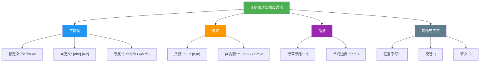

# 模式语法

> **所属路径**：`01_基础能力/01_开发环境与技术英语/05_正则表达式/01_模式语法`
> **预计学习时间**：50 分钟
> **难度等级**：⭐⭐

---

## 前置知识

- [字符串方法与格式化](../../02_字符串与编码/01_字符串方法与格式化/01_字符串方法与格式化.md)（熟悉字符串的基本操作方法）
- [Unicode与编解码](../../02_字符串与编码/02_Unicode与编解码/02_Unicode与编解码.md)（了解字符编码的基本概念）

> 如果以上内容还不熟悉，建议先完成对应课程再继续。

---

## 学习目标

完成本节后，你将能够：

1. 区分正则表达式中的**字面字符**和**元字符**，理解转义规则
2. 使用**字符类**（`\d`、`\w`、`\s` 及自定义字符类 `[...]`）精确匹配特定类型的字符
3. 使用**量词**（`*`、`+`、`?`、`{n,m}`）控制匹配次数，区分贪婪与非贪婪模式
4. 使用**锚点**（`^`、`$`、`\b`）定位匹配在文本中的位置
5. 理解 Python 原始字符串 `r""` 在正则表达式中的重要性，并正确使用 `re.compile()` 和常用标志位

---

## 正文讲解

### 1. 从一个实际需求说起

假设你正在开发一个用户注册系统，需要验证用户输入的手机号码是否合法。中国大陆手机号的规则是：以 1 开头，第二位是 3–9 之间的数字，后面跟着 9 位任意数字，总共 11 位。

用字符串方法来验证，你可能会写出这样的代码：

```python
def is_valid_phone(phone: str) -> bool:
    if len(phone) != 11:
        return False
    if not phone.isdigit():
        return False
    if phone[0] != '1':
        return False
    if phone[1] not in '3456789':
        return False
    return True
```

代码虽然能工作，但写起来繁琐、读起来费劲。如果规则变得更复杂——比如还要支持带国际区号的格式 `+86-13812345678` 或者中间带空格的格式——代码会迅速膨胀。

而使用 **正则表达式（Regular Expression, Regex）** ，同样的验证只需要一行模式：

```python
import re

pattern = r'^1[3-9]\d{9}$'
print(re.match(pattern, '13812345678'))  # <re.Match object; ...>
print(re.match(pattern, '12345678901'))  # None
```

这个模式 `^1[3-9]\d{9}$` 就像一个**文本的模具**：它精确描述了"以 1 开头、第二位是 3 到 9、后面跟 9 个数字、到此结束"这个规则。接下来，我们就来系统学习如何"制造"这样的模具。

### 2. 字面字符与元字符

正则表达式由两类字符组成：

- **字面字符（Literal Characters）** ：表示它们自身。比如模式 `hello` 就是匹配文本中的 `hello` 这五个字符。大多数普通字符（字母、数字、部分标点）都是字面字符。

- **元字符（Metacharacters）** ：具有特殊含义的字符。它们是正则表达式的"魔法"所在，让模式能描述复杂的匹配规则。

Python 正则表达式中的元字符包括：

```
. ^ $ * + ? { } [ ] \ | ( )
```

> 💡 **记忆技巧**：可以这样分组记忆——`.` 匹配任意字符；`^ $` 是锚点；`* + ? { }` 是量词；`[ ]` 是字符类；`\` 是转义；`|` 是或；`( )` 是分组。

如果你想匹配元字符本身（比如匹配一个字面的 `.` 或 `$`），就需要用反斜杠 `\` 进行**转义（Escape）** 。例如，`\.` 匹配字面的句点，`\$` 匹配字面的美元符号。

### 3. 字符类——匹配"某一类"字符

在手机号的例子中，`[3-9]` 表示"匹配 3 到 9 之间的任意一个数字"。这就是 **字符类（Character Class）** 的用法——用方括号 `[]` 定义一组字符，匹配其中的任意一个。

#### 自定义字符类

| 语法 | 含义 | 示例 |
| ---- | ---- | ---- |
| `[abc]` | 匹配 a、b 或 c 中的任意一个 | `[aeiou]` 匹配任意元音字母 |
| `[a-z]` | 匹配 a 到 z 范围内的任意一个字符 | `[A-Za-z]` 匹配任意英文字母 |
| `[0-9]` | 匹配 0 到 9 的任意一个数字 | `[0-9a-f]` 匹配十六进制数字 |
| `[^abc]` | 匹配**除了** a、b、c 之外的任意一个字符 | `[^0-9]` 匹配非数字字符 |

> ⚠️ **注意**：`^` 在方括号内部开头处表示"取反"，而在方括号外部表示"行首"——同一个字符在不同位置含义不同，这是初学时容易混淆的地方。

#### 预定义字符类

Python 正则表达式提供了几个常用的快捷写法：

| 预定义 | 等价写法 | 含义 |
| ------ | -------- | ---- |
| `\d` | `[0-9]` | 匹配一个数字 |
| `\D` | `[^0-9]` | 匹配一个非数字 |
| `\w` | `[a-zA-Z0-9_]` | 匹配一个"单词字符"（字母、数字、下划线） |
| `\W` | `[^a-zA-Z0-9_]` | 匹配一个非单词字符 |
| `\s` | `[ \t\n\r\f\v]` | 匹配一个空白字符（空格、制表符、换行等） |
| `\S` | `[^ \t\n\r\f\v]` | 匹配一个非空白字符 |

可以看到，大写版本总是小写版本的**互补**——`\d` 匹配数字，`\D` 匹配非数字；`\w` 匹配单词字符，`\W` 匹配非单词字符。这个规律非常好记。

```python
import re

text = "订单号: A-2024-0531, 金额: ¥128.50"
print(re.findall(r'\d', text))   # ['2', '0', '2', '4', '0', '5', '3', '1', '1', '2', '8', '5', '0']
print(re.findall(r'\d+', text))  # ['2024', '0531', '128', '50']
print(re.findall(r'\w+', text))  # ['订单号', 'A', '2024', '0531', '金额', '128', '50']
```

> 💡 **提示**：在 Python 3 中，`\w` 默认使用 Unicode 匹配规则，因此中文汉字也被视为"单词字符"。如果只想匹配 ASCII 字母数字，可以使用 `re.ASCII` 标志。

### 4. 量词——控制"匹配几次"

在上面的例子中，`\d+` 中的 `+` 就是一个 **量词（Quantifier）** ，表示"前面的元素匹配一次或多次"。量词让模式具有了灵活性——不再局限于精确的字符数量。

| 量词 | 含义 | 示例 |
| ---- | ---- | ---- |
| `*` | 匹配 0 次或多次 | `ab*c` 匹配 `ac`、`abc`、`abbc`、`abbbc` ... |
| `+` | 匹配 1 次或多次 | `ab+c` 匹配 `abc`、`abbc`，但不匹配 `ac` |
| `?` | 匹配 0 次或 1 次 | `colou?r` 匹配 `color` 和 `colour` |
| `{n}` | 精确匹配 $n$ 次 | `\d{4}` 匹配恰好 4 个数字 |
| `{n,}` | 匹配至少 $n$ 次 | `\d{2,}` 匹配 2 个及以上数字 |
| `{n,m}` | 匹配 $n$ 到 $m$ 次 | `\d{1,3}` 匹配 1 到 3 个数字 |

#### 贪婪与非贪婪

默认情况下，量词是 **贪婪的（Greedy）** ——它会尽可能多地匹配字符。这在某些场景下会带来意想不到的结果：

```python
import re

html = '<b>粗体</b>和<i>斜体</i>'
# 贪婪匹配：尽可能多地匹配
print(re.findall(r'<.*>', html))
# ['<b>粗体</b>和<i>斜体</i>']  ← 匹配了最长的一段！

# 非贪婪匹配：尽可能少地匹配
print(re.findall(r'<.*?>', html))
# ['<b>', '</b>', '<i>', '</i>']  ← 匹配每个标签
```

在量词后面加一个 `?` 就变成了 **非贪婪模式（Lazy/Non-greedy）** ：`*?`、`+?`、`??`、`{n,m}?`。非贪婪量词会在满足匹配的前提下尽可能少地消耗字符。

> 📌 **经验法则**：当你要匹配"某个开头和某个结尾之间的内容"时（比如 HTML 标签、引号内的文本），**优先考虑非贪婪模式**。

### 5. 锚点——定位"在哪匹配"

量词控制"匹配几次"，而 **锚点（Anchor）** 控制"在哪里匹配"。锚点不消耗字符，它们只是断言匹配发生在文本的特定位置。

| 锚点 | 含义 |
| ---- | ---- |
| `^` | 匹配字符串的开头（或在 `re.MULTILINE` 模式下匹配每一行的开头） |
| `$` | 匹配字符串的结尾（或在 `re.MULTILINE` 模式下匹配每一行的结尾） |
| `\b` | 匹配单词边界（单词字符与非单词字符的交界处） |
| `\B` | 匹配非单词边界 |

```python
import re

text = "cat concatenate category"
# 不用锚点：匹配所有包含 cat 的位置
print(re.findall(r'cat', text))       # ['cat', 'cat', 'cat']

# 使用单词边界：只匹配独立的单词 cat
print(re.findall(r'\bcat\b', text))   # ['cat']

# 匹配以 cat 开头的单词
print(re.findall(r'\bcat\w*', text))  # ['cat', 'concatenate', 'category']
```

回到开头手机号验证的例子：`^1[3-9]\d{9}$` 中的 `^` 和 `$` 确保了整个字符串从头到尾都必须符合模式，而不是只在字符串的某个局部匹配成功。

### 6. 点号 `.` 与交替 `|`

**点号 `.`** 是一个特殊的元字符，匹配除换行符 `\n` 之外的任意一个字符。如果希望 `.` 也能匹配换行符，可以使用 `re.DOTALL`（或 `re.S`）标志。

```python
import re

text = "第一行\n第二行"
print(re.findall(r'.+', text))                    # ['第一行', '第二行']
print(re.findall(r'.+', text, re.DOTALL))         # ['第一行\n第二行']
```

**交替 `|`** 类似于逻辑"或"，让模式匹配左边或右边的子模式：

```python
import re

text = "I have a cat and a dog"
print(re.findall(r'cat|dog', text))  # ['cat', 'dog']

# 交替与分组配合使用
print(re.findall(r'col(ou|o)r', text))  # 匹配 colour 或 color
```

### 7. 转义与原始字符串

在正则表达式中，`\` 用于转义元字符和表示预定义字符类。但在 Python 的普通字符串中，`\` 也有转义含义（如 `\n` 表示换行、`\t` 表示制表符）。这种"双重转义"很容易让人迷惑：

```python
# 想匹配字面的反斜杠 \
# 正则表达式需要：\\（转义反斜杠）
# Python 普通字符串中 \\ 表示一个 \，所以需要 \\\\
import re

text = r"路径是 C:\new\test"
print(re.findall('\\\\', text))   # 普通字符串：4个反斜杠
print(re.findall(r'\\', text))    # 原始字符串：2个反斜杠，清晰多了！
```

**原始字符串（Raw String）** `r"..."` 告诉 Python 不要对反斜杠做转义处理，让字符串中的 `\` 保持字面含义。这使得正则表达式的书写更加清晰直观。

> ⚠️ **强烈建议**：在 Python 中编写正则表达式时，**始终使用原始字符串** `r"..."`。这是避免转义问题的最简单方式。

### 8. 编译模式与标志位

当同一个正则表达式需要多次使用时，可以用 `re.compile()` 预先 **编译（Compile）** 成一个模式对象，避免重复解析：

```python
import re

phone_pattern = re.compile(r'^1[3-9]\d{9}$')
# 编译后的模式对象拥有与 re 模块相同的方法
print(phone_pattern.match('13812345678'))  # <re.Match object; ...>
print(phone_pattern.match('12345'))        # None
```

编译时还可以传入 **标志位（Flags）** 来修改匹配行为：

| 标志 | 缩写 | 含义 |
| ---- | ---- | ---- |
| `re.IGNORECASE` | `re.I` | 忽略大小写 |
| `re.MULTILINE` | `re.M` | 让 `^` 和 `$` 匹配每一行的开头和结尾 |
| `re.DOTALL` | `re.S` | 让 `.` 也匹配换行符 |
| `re.VERBOSE` | `re.X` | 允许在模式中添加注释和空白，提高可读性 |
| `re.ASCII` | `re.A` | 让 `\w`、`\d`、`\s` 仅匹配 ASCII 字符 |

`re.VERBOSE` 标志特别适合编写复杂的正则表达式，因为它允许添加注释：

```python
import re

email_pattern = re.compile(r"""
    ^                   # 字符串开头
    [a-zA-Z0-9._%+-]+   # 用户名部分
    @                   # @ 符号
    [a-zA-Z0-9.-]+      # 域名部分
    \.                  # 字面点号
    [a-zA-Z]{2,}        # 顶级域名（至少2个字母）
    $                   # 字符串结尾
""", re.VERBOSE)

print(email_pattern.match('user@example.com'))  # <re.Match object; ...>
print(email_pattern.match('invalid@.com'))      # None
```

下面这张图总结了正则表达式模式语法的核心元素及其分类：



> 📌 **图解说明**：正则表达式模式语法的四大核心组成部分——字符类决定"匹配什么字符"，量词决定"匹配几次"，锚点决定"在哪匹配"，其他元字符提供更多灵活性。

---

## 动手实践

下面我们用一个完整的例子，将本课学到的模式语法元素串联起来：

```python
# 文件：code/pattern_basics.py
# 环境要求：Python 3.10+
import re

# ---------- 1. 字符类与量词 ----------
text = "我的手机号是 13812345678，备用号码 15999887766"
phones = re.findall(r'1[3-9]\d{9}', text)
print("手机号:", phones)
# 手机号: ['13812345678', '15999887766']

# ---------- 2. 锚点与单词边界 ----------
code = "error: file not found (errno: 2)"
words = re.findall(r'\b\w+\b', code)
print("单词列表:", words)
# 单词列表: ['error', 'file', 'not', 'found', 'errno', '2']

# ---------- 3. 贪婪与非贪婪 ----------
html = '<span class="highlight">重点</span>'
greedy = re.findall(r'<.*>', html)
lazy = re.findall(r'<.*?>', html)
print("贪婪:", greedy)   # ['<span class="highlight">重点</span>']
print("非贪婪:", lazy)   # ['<span class="highlight">', '</span>']

# ---------- 4. 带注释的模式 ----------
date_pattern = re.compile(r"""
    (\d{4})     # 年份
    [-/.]       # 分隔符
    (\d{1,2})   # 月份
    [-/.]       # 分隔符
    (\d{1,2})   # 日期
""", re.VERBOSE)

dates = ["2024-05-31", "2024/6/1", "2024.12.25"]
for d in dates:
    m = date_pattern.match(d)
    if m:
        print(f"{d} → 年:{m.group(1)} 月:{m.group(2)} 日:{m.group(3)}")
# 2024-05-31 → 年:2024 月:05 日:31
# 2024/6/1 → 年:2024 月:6 日:1
# 2024.12.25 → 年:2024 月:12 日:25
```

**运行说明**：
- 环境要求：Python 3.10+
- 运行命令：`python code/pattern_basics.py`

---

## 典型误区

| 误区 | 正确理解 |
| ---- | -------- |
| 不用原始字符串写正则，导致 `\b` 被解释为退格符 | 始终用 `r"..."` 原始字符串编写正则表达式 |
| 认为 `.*` 总是匹配一切 | `.` 默认不匹配换行符 `\n` ，需要 `re.DOTALL` 标志 |
| 混淆 `[^abc]` 和 `^[abc]` | `[^abc]` 是字符类取反（非 a、b、c 的字符）；`^[abc]` 是"行首是 a、b 或 c" |
| 贪婪匹配"吞掉"了太多内容 | 需要匹配最短时，使用非贪婪量词 `*?`、`+?`、`??` |
| 认为 `\d` 只匹配 ASCII 数字 | Python 3 中 `\d` 默认使用 Unicode，也匹配全角数字等；如需仅匹配 `0-9` ，用 `[0-9]` 或加 `re.ASCII` 标志 |

---

## 练习题

### 练习 1：匹配中国身份证号码（难度：⭐）

中国身份证号码为 18 位，前 17 位是数字，最后一位可以是数字或大写字母 `X` 。请写出匹配身份证号的正则表达式。

<details>
<summary>💡 提示</summary>

使用 `\d{17}` 匹配前 17 位，用 `[\dX]` 匹配最后一位，用 `^` 和 `$` 锚定首尾。

</details>

<details>
<summary>✅ 参考答案</summary>

```python
import re

pattern = r'^\d{17}[\dX]$'
print(re.match(pattern, '11010519900307891X'))  # 匹配
print(re.match(pattern, '110105199003078912'))   # 匹配
print(re.match(pattern, '1101051990030789'))     # None（位数不够）
```

</details>

### 练习 2：阅读理解——这个模式匹配什么？（难度：⭐⭐）

请解释以下正则表达式会匹配什么内容，并给出 3 个能匹配和 3 个不能匹配的例子：

```python
r'^[a-zA-Z_]\w{0,31}$'
```

<details>
<summary>💡 提示</summary>

逐个分析：`^` 行首，`[a-zA-Z_]` 首字符是字母或下划线，`\w{0,31}` 后续 0 到 31 个单词字符，`$` 行尾。

</details>

<details>
<summary>✅ 参考答案</summary>

这个模式匹配合法的 Python 变量名（简化版）：以字母或下划线开头，后面跟 0 到 31 个字母、数字或下划线，总长度 1 到 32 个字符。

能匹配：`name` 、`_private` 、`my_var_2`

不能匹配：`2name`（以数字开头）、`my-var`（包含连字符）、空字符串

</details>

### 练习 3：编写 IPv4 地址的简化匹配模式（难度：⭐⭐）

编写一个正则表达式，匹配形如 `192.168.1.100` 的 IPv4 地址。简化要求：每组 1 到 3 个数字，用点分隔，不需要验证数值范围（0–255）。

<details>
<summary>💡 提示</summary>

IPv4 地址由四组数字组成，每组 1 到 3 位，用字面点 `\.` 分隔。可以用 `\d{1,3}` 匹配每组数字。

</details>

<details>
<summary>✅ 参考答案</summary>

```python
import re

pattern = r'^\d{1,3}\.\d{1,3}\.\d{1,3}\.\d{1,3}$'
print(re.match(pattern, '192.168.1.100'))  # 匹配
print(re.match(pattern, '10.0.0.1'))       # 匹配
print(re.match(pattern, '999.999.999.999'))# 匹配（未验证范围）
print(re.match(pattern, '192.168.1'))      # None（只有3组）
```

更简洁的写法（利用分组和量词）：

```python
pattern = r'^(\d{1,3}\.){3}\d{1,3}$'
```

</details>

---

## 下一步学习

- 📖 下一个知识点：[匹配搜索与替换](../02_匹配搜索与替换/02_匹配搜索与替换.md)——学会了模式语法后，接下来学习如何在 Python 中用 `re` 模块的各种函数执行匹配、搜索和替换操作
- 🔗 相关知识点：[字符串方法与格式化](../../02_字符串与编码/01_字符串方法与格式化/01_字符串方法与格式化.md)——对比正则表达式与字符串内置方法的适用场景

---

## 参考资料

1. [Python 官方文档 - re 模块](https://docs.python.org/3/library/re.html) — Python 标准库 re 模块完整参考（官方文档）
2. [Python 官方文档 - 正则表达式 HOWTO](https://docs.python.org/3/howto/regex.html) — Python 官方的正则表达式入门教程（官方文档）
3. [regex101](https://regex101.com/) — 在线正则表达式测试与可视化工具，支持 Python 风格（免费在线工具）
4. [Regular-Expressions.info](https://www.regular-expressions.info/) — 全面的正则表达式教程与参考（公开教育资源）
