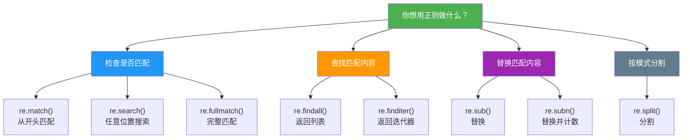

# 匹配搜索与替换

> **所属路径**：`01_基础能力/01_开发环境与技术英语/05_正则表达式/02_匹配搜索与替换`
> **预计学习时间**：45 分钟
> **难度等级**：⭐⭐

---

## 前置知识

- [模式语法](../01_模式语法/01_模式语法.md)（掌握字符类、量词、锚点等正则表达式基础语法）
- [迭代器协议](../../04_迭代器与函数式工具/01_迭代器协议/01_迭代器协议.md)（了解迭代器的基本概念，有助于理解 `re.finditer()`）

> 如果以上内容还不熟悉，建议先完成对应课程再继续。

---

## 学习目标

完成本节后，你将能够：

1. 区分 `re.match()`、`re.search()`、`re.fullmatch()` 三种匹配函数的使用场景
2. 使用 `re.findall()` 和 `re.finditer()` 查找文本中的所有匹配项
3. 使用 `re.sub()` 和 `re.subn()` 进行基于模式的文本替换
4. 熟练操作 **Match 对象** 提取匹配结果的详细信息
5. 使用 `re.split()` 按正则模式分割文本，并理解 `re.compile()` 的性能优势

---

## 正文讲解

### 1. 从语法到实践：re 模块的函数全家福

在 [上一课](../01_模式语法/01_模式语法.md) 中，我们学会了如何"制造模具"——编写正则表达式模式。但模具本身不能工作，你还需要把模具"压"到具体的文本上才能得到结果。Python 的 `re` 模块提供了一系列函数来完成这个"压模"过程，每个函数的用途略有不同。

先来一张全家福，对它们有个整体认识：



> 📌 **图解说明**：`re` 模块的核心函数按用途分为四类——检查匹配、查找内容、替换内容和分割文本。根据你的需求选择合适的函数。

### 2. 检查是否匹配：match、search 与 fullmatch

这三个函数的共同点是：找到匹配就返回一个 **Match 对象（Match Object）** ，找不到就返回 `None` 。它们的区别在于"从哪里开始找"。

#### `re.match()` ——从开头匹配

`re.match(pattern, string)` 只在字符串的 **开头** 尝试匹配。如果开头不符合模式，即使后面有匹配的内容，也会返回 `None` ：

```python
import re

text = "Error: 文件未找到"
print(re.match(r'Error', text))   # <re.Match object; ...> ✓ 开头匹配
print(re.match(r'文件', text))    # None ✗ 不在开头
```

#### `re.search()` ——任意位置搜索

`re.search(pattern, string)` 在字符串的 **任意位置** 搜索第一个匹配项：

```python
import re

text = "Error: 文件未找到"
print(re.search(r'文件', text))   # <re.Match object; ...> ✓ 在任意位置找到了
print(re.search(r'成功', text))   # None ✗ 整个字符串中都没有
```

#### `re.fullmatch()` ——完整匹配

`re.fullmatch(pattern, string)` 要求 **整个字符串** 必须完全匹配模式，相当于在模式前后加了 `^` 和 `$` ：

```python
import re

print(re.fullmatch(r'\d+', '12345'))      # <re.Match object; ...> ✓
print(re.fullmatch(r'\d+', '123abc'))     # None ✗ 不是全部数字
print(re.fullmatch(r'\d+', ''))           # None ✗ 空字符串不匹配 +
```

> 💡 **选择建议**：验证用户输入（如邮箱、手机号）时优先用 `fullmatch()`；在长文本中搜索特定模式时用 `search()`；`match()` 适合已知内容在开头的场景（如解析日志行的开头时间戳）。

### 3. 查找所有匹配：findall 与 finditer

当文本中可能有多个匹配项时，`search()` 只能找到第一个。要找到所有匹配项，需要用 `findall()` 或 `finditer()` 。

#### `re.findall()` ——返回列表

`re.findall(pattern, string)` 返回所有匹配项组成的列表：

```python
import re

text = "联系方式：13800001111 或 15999998888，座机 010-12345678"
phones = re.findall(r'1[3-9]\d{9}', text)
print(phones)  # ['13800001111', '15999998888']
```

> ⚠️ **注意**：当模式中包含 **捕获组** `()` 时，`findall()` 返回的是组的内容而非整个匹配。如果有多个组，返回元组列表。这个行为在 [下一课分组与断言](../03_分组与断言/03_分组与断言.md) 中会详细讨论。

```python
import re

text = "2024-05-31 和 2024-06-01"
# 模式中有捕获组 → findall 返回组的内容
print(re.findall(r'(\d{4})-(\d{2})-(\d{2})', text))
# [('2024', '05', '31'), ('2024', '06', '01')]
```

#### `re.finditer()` ——返回迭代器

`re.finditer(pattern, string)` 返回一个 **[迭代器（Iterator）](../../04_迭代器与函数式工具/01_迭代器协议/01_迭代器协议.md)** ，每次迭代产出一个 Match 对象。相比 `findall()` ，它在处理大文本时更节省内存，而且保留了每个匹配项的详细位置信息：

```python
import re

text = "价格：苹果 5.5 元，香蕉 3.2 元，西瓜 15.0 元"
for m in re.finditer(r'\d+\.\d+', text):
    print(f"找到 '{m.group()}' 在位置 {m.start()}-{m.end()}")
# 找到 '5.5' 在位置 7-10
# 找到 '3.2' 在位置 14-17
# 找到 '15.0' 在位置 21-25
```

### 4. Match 对象——提取匹配的详细信息

无论是 `match()`、`search()` 还是 `finditer()` ，匹配成功时都会返回一个 Match 对象。这个对象携带了关于匹配结果的丰富信息：

| 方法/属性 | 说明 |
| --------- | ---- |
| `m.group()` 或 `m.group(0)` | 返回整个匹配的字符串 |
| `m.group(n)` | 返回第 $n$ 个捕获组的内容 |
| `m.groups()` | 返回所有捕获组的内容（元组） |
| `m.start()` / `m.end()` | 匹配的起始/结束位置 |
| `m.span()` | 返回 `(start, end)` 元组 |
| `m.groupdict()` | 返回命名组的字典（下一课详述） |

```python
import re

text = "出生日期：1990-03-15"
m = re.search(r'(\d{4})-(\d{2})-(\d{2})', text)
if m:
    print("完整匹配:", m.group())     # 1990-03-15
    print("年:", m.group(1))          # 1990
    print("月:", m.group(2))          # 03
    print("日:", m.group(3))          # 15
    print("所有组:", m.groups())       # ('1990', '03', '15')
    print("位置:", m.span())          # (5, 15)
```

> 💡 **安全习惯**：`search()` 和 `match()` 可能返回 `None` ，直接对 `None` 调用 `.group()` 会报 `AttributeError` 。一定要先用 `if m:` 判断是否匹配成功。

### 5. 替换：sub 与 subn

**`re.sub(pattern, repl, string, count=0)`** 将字符串中所有匹配 `pattern` 的部分替换为 `repl` ：

```python
import re

text = "联系电话：13812345678，备用：15999887766"
# 将手机号替换为脱敏格式
masked = re.sub(r'(1\d{2})\d{4}(\d{4})', r'\1****\2', text)
print(masked)  # 联系电话：138****5678，备用：159****7766
```

这里的 `r'\1****\2'` 使用了 **反向引用（Backreference）** ：`\1` 代表第一个捕获组的内容，`\2` 代表第二个。这个强大的特性在 [分组与断言](../03_分组与断言/03_分组与断言.md) 中会深入讲解。

`repl` 参数还可以是一个 **函数** ，接收 Match 对象作为参数，返回替换字符串：

```python
import re

text = "apple costs 3 dollars, banana costs 2 dollars"
# 用函数将价格翻倍
def double_price(m):
    return str(int(m.group()) * 2)

result = re.sub(r'\d+', double_price, text)
print(result)  # apple costs 6 dollars, banana costs 4 dollars
```

`count` 参数控制最大替换次数（默认 `0` 表示全部替换）：

```python
import re

text = "aaa bbb ccc"
print(re.sub(r'\w+', 'X', text))           # X X X（全部替换）
print(re.sub(r'\w+', 'X', text, count=2))  # X X ccc（只替换前2个）
```

**`re.subn()`** 的行为与 `sub()` 完全一样，只是返回一个元组 `(替换后的字符串, 替换次数)` ：

```python
import re

text = "Hello World Hello Python"
result, count = re.subn(r'Hello', 'Hi', text)
print(result)  # Hi World Hi Python
print(count)   # 2
```

### 6. 分割：re.split()

`re.split(pattern, string)` 按照模式匹配的位置分割字符串。相比字符串自带的 `str.split()` ，它可以使用正则模式作为分隔符：

```python
import re

# str.split() 只能按固定字符串分割
text = "苹果, 香蕉;  西瓜、橘子"
print(text.split(','))  # ['苹果', ' 香蕉;  西瓜、橘子']  ← 只按逗号分割

# re.split() 可以按多种分隔符分割
print(re.split(r'[,;、]\s*', text))  # ['苹果', '香蕉', '西瓜', '橘子']
```

`maxsplit` 参数控制最大分割次数：

```python
import re

text = "one:two:three:four"
print(re.split(r':', text, maxsplit=2))  # ['one', 'two', 'three:four']
```

> ⚠️ **注意**：如果模式中包含捕获组，分隔符本身也会出现在结果列表中。如果不想保留分隔符，使用 **非捕获组** `(?:...)` ——这是下一课的内容。

### 7. 编译与复用：re.compile() 的价值

前面我们已经见过 `re.compile()` ，它将模式字符串编译成一个可复用的 **正则表达式对象（Pattern Object）** 。编译后的对象拥有与 `re` 模块相同的方法（`match`、`search`、`findall`、`sub` 等），但省去了每次调用时重新解析模式的开销：

```python
import re

# 编译一次，多次使用
url_pattern = re.compile(
    r'https?://[a-zA-Z0-9.-]+\.[a-zA-Z]{2,}(?:/[^\s]*)?',
    re.IGNORECASE
)

texts = [
    "请访问 https://example.com/path 了解更多",
    "文档地址：http://docs.python.org/3/library/re.html",
    "这里没有链接",
]

for text in texts:
    urls = url_pattern.findall(text)
    if urls:
        print(f"找到 URL: {urls}")
# 找到 URL: ['https://example.com/path']
# 找到 URL: ['http://docs.python.org/3/library/re.html']
```

> 💡 **性能建议**：虽然 Python 的 `re` 模块内部有模式缓存机制（默认缓存最近使用的模式），但在以下场景中，显式编译依然有明显优势：
> - 同一模式在循环中反复使用
> - 模式较为复杂（编译耗时较长）
> - 想在代码中给模式一个有意义的变量名，提高可读性

---

## 动手实践

下面是一个综合示例，演示了从匹配到替换的完整工作流：

```python
# 文件：code/match_search_replace.py
# 环境要求：Python 3.10+
import re

# ---------- 场景：清洗和格式化用户提交的文本 ----------
raw_text = """
姓名：  张三
电话：138-1234-5678
邮箱：zhangsan@example.com
地址：  北京市 朝阳区  xxx路 100号
备注：请在2024/06/15前回复，或拨打 010-87654321
"""

# 1. 提取手机号（去掉横杠）
phone_match = re.search(r'电话[：:]\s*([\d-]+)', raw_text)
if phone_match:
    phone = phone_match.group(1).replace('-', '')
    print(f"手机号: {phone}")
# 手机号: 13812345678

# 2. 提取邮箱
email_match = re.search(r'[a-zA-Z0-9._%+-]+@[a-zA-Z0-9.-]+\.[a-zA-Z]{2,}', raw_text)
if email_match:
    print(f"邮箱: {email_match.group()}")
# 邮箱: zhangsan@example.com

# 3. 提取所有日期
dates = re.findall(r'\d{4}[/.-]\d{2}[/.-]\d{2}', raw_text)
print(f"日期: {dates}")
# 日期: ['2024/06/15']

# 4. 清理多余空白（将连续空白替换为单个空格）
cleaned = re.sub(r'[ \t]+', ' ', raw_text)
print("--- 清理后 ---")
print(cleaned.strip())

# 5. 统计替换次数
result, count = re.subn(r'\d', '*', raw_text)
print(f"\n共脱敏了 {count} 个数字字符")
```

**运行说明**：
- 环境要求：Python 3.10+
- 运行命令：`python code/match_search_replace.py`

---

## 典型误区

| 误区 | 正确理解 |
| ---- | -------- |
| 用 `re.match()` 在长文本中搜索，总是返回 `None` | `match()` 只从字符串开头匹配，搜索任意位置应用 `search()` |
| 对 `search()` 返回的结果直接调用 `.group()` 不做 `None` 检查 | 匹配失败时返回 `None` ，必须先判断 `if m:` |
| `findall()` 有捕获组时，期望返回完整匹配 | 有捕获组时 `findall()` 返回组的内容；想要完整匹配可用非捕获组 `(?:...)` 或用 `finditer()` |
| 在大文本上用 `findall()` 一次性获取所有结果导致内存过高 | 处理大文本时优先使用 `finditer()` ，它返回迭代器，按需产出结果 |
| 认为 `re.sub()` 只能用固定字符串替换 | `repl` 参数可以是函数，接收 Match 对象，能实现灵活的动态替换 |

---

## 练习题

### 练习 1：提取文本中的所有浮点数（难度：⭐）

给定文本 `"温度：23.5°C，湿度：67.8%，气压：1013.25hPa"` ，使用 `re.findall()` 提取所有浮点数。

<details>
<summary>💡 提示</summary>

浮点数的模式：一个或多个数字，一个点，再一个或多个数字。

</details>

<details>
<summary>✅ 参考答案</summary>

```python
import re

text = "温度：23.5°C，湿度：67.8%，气压：1013.25hPa"
numbers = re.findall(r'\d+\.\d+', text)
print(numbers)  # ['23.5', '67.8', '1013.25']
```

</details>

### 练习 2：敏感词替换（难度：⭐⭐）

给定文本和一个敏感词列表 `["坏话", "骂人", "脏字"]` ，用 `re.sub()` 将文本中出现的任何敏感词替换为等长度的 `*` 号。

<details>
<summary>💡 提示</summary>

可以用 `|` 将多个敏感词组合成一个模式，`repl` 参数使用函数来生成等长度的 `*` 。

</details>

<details>
<summary>✅ 参考答案</summary>

```python
import re

bad_words = ["坏话", "骂人", "脏字"]
text = "不要说坏话，更不要骂人，脏字也不行"

pattern = '|'.join(re.escape(w) for w in bad_words)
result = re.sub(pattern, lambda m: '*' * len(m.group()), text)
print(result)  # 不要说**，更不要**，**也不行
```

注意使用 `re.escape()` 对敏感词进行转义，防止其中包含正则元字符。

</details>

### 练习 3：日志行解析（难度：⭐⭐）

使用 `re.finditer()` 从以下日志文本中提取每一行的时间戳和日志级别，输出格式为 `时间戳 [级别]` ：

```
2024-05-31 10:23:45 INFO 用户登录成功
2024-05-31 10:24:01 ERROR 数据库连接失败
2024-05-31 10:24:15 WARNING 内存使用率超过80%
```

<details>
<summary>💡 提示</summary>

时间戳模式：`\d{4}-\d{2}-\d{2} \d{2}:\d{2}:\d{2}` ；日志级别：`INFO|ERROR|WARNING` 或 `[A-Z]+` 。使用捕获组分别提取两部分。

</details>

<details>
<summary>✅ 参考答案</summary>

```python
import re

log = """2024-05-31 10:23:45 INFO 用户登录成功
2024-05-31 10:24:01 ERROR 数据库连接失败
2024-05-31 10:24:15 WARNING 内存使用率超过80%"""

pattern = r'(\d{4}-\d{2}-\d{2} \d{2}:\d{2}:\d{2}) (INFO|ERROR|WARNING)'

for m in re.finditer(pattern, log):
    print(f"{m.group(1)} [{m.group(2)}]")
# 2024-05-31 10:23:45 [INFO]
# 2024-05-31 10:24:01 [ERROR]
# 2024-05-31 10:24:15 [WARNING]
```

</details>

---

## 下一步学习

- 📖 下一个知识点：[分组与断言](../03_分组与断言/03_分组与断言.md)——学习捕获组、命名组、非捕获组和前瞻/后顾断言等高级语法
- 🔗 相关知识点：[模式语法](../01_模式语法/01_模式语法.md)——回顾正则表达式的基础语法元素

---

## 参考资料

1. [Python 官方文档 - re 模块](https://docs.python.org/3/library/re.html) — 全部 re 模块函数的完整参考（官方文档）
2. [Python 官方文档 - 正则表达式 HOWTO](https://docs.python.org/3/howto/regex.html) — 官方正则表达式教程，详细介绍了各函数用法（官方文档）
3. [regex101](https://regex101.com/) — 在线正则测试工具，可实时查看匹配过程和捕获组（免费在线工具）
