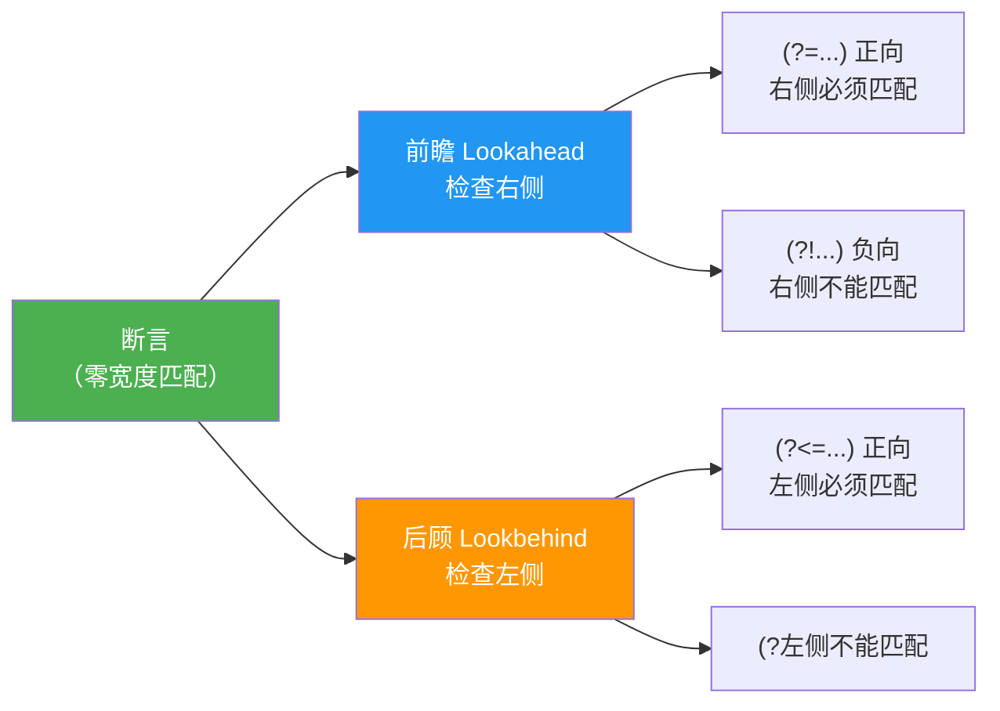

# 分组与断言

> **所属路径**：`01_基础能力/01_开发环境与技术英语/05_正则表达式/03_分组与断言`
> **预计学习时间**：50 分钟
> **难度等级**：⭐⭐⭐

---

## 前置知识

- [模式语法](../01_模式语法/01_模式语法.md)（掌握字符类、量词、锚点等基础语法）
- [匹配搜索与替换](../02_匹配搜索与替换/02_匹配搜索与替换.md)（熟悉 `re` 模块的核心函数和 Match 对象）

> 如果以上内容还不熟悉，建议先完成对应课程再继续。

---

## 学习目标

完成本节后，你将能够：

1. 使用 **捕获组** `()` 从匹配结果中提取特定子串
2. 使用 **命名组** `(?P<name>...)` 让正则表达式更具可读性
3. 区分捕获组与 **非捕获组** `(?:...)` ，在不需要提取时避免不必要的捕获
4. 使用 **反向引用** `\1` 和 `(?P=name)` 匹配之前捕获的相同内容
5. 使用 **前瞻断言** 和 **后顾断言** 实现"匹配但不消耗"的精确定位

---

## 正文讲解

### 1. 为什么需要分组？

在前两课中，我们学会了如何匹配整段文本。但很多时候，我们不仅要知道"是否匹配"，还想从匹配结果中 **提取特定的部分** 。

比如，从一个 URL `https://www.example.com/path/page?query=1` 中，你可能想分别提取协议（`https`）、域名（`www.example.com`）、路径（`/path/page`）和查询参数（`query=1`）。如果把整个 URL 当作一个匹配结果，后续还需要大量字符串处理来拆分。而使用 **分组（Group）** ，你可以在模式中直接标记"我关心的部分"，匹配完成后直接提取。

### 2. 捕获组——用圆括号标记感兴趣的部分

**捕获组（Capturing Group）** 用圆括号 `()` 定义。每个捕获组会记住匹配到的子串，可以通过 Match 对象的 `group(n)` 方法提取：

```python
import re

url = "https://www.example.com/path/page?query=1"
pattern = r'(https?)://([^/]+)(/[^?]*)?\??(.*)?'

m = re.match(pattern, url)
if m:
    print("协议:", m.group(1))    # https
    print("域名:", m.group(2))    # www.example.com
    print("路径:", m.group(3))    # /path/page
    print("查询:", m.group(4))    # query=1
    print("全部:", m.groups())    # ('https', 'www.example.com', '/path/page', 'query=1')
```

捕获组按照 **左括号出现的顺序** 从 1 开始编号。`group(0)` 始终返回整个匹配。

> ⚠️ **注意**：如果在 `re.findall()` 中使用了捕获组，返回的是 **组的内容** 而非整个匹配。这在上一课中提过，现在你已经理解了背后的原因。

```python
import re

text = "2024-05-31 和 2024-06-01"
# 有捕获组 → findall 返回组的内容
print(re.findall(r'(\d{4})-(\d{2})-(\d{2})', text))
# [('2024', '05', '31'), ('2024', '06', '01')]

# 想要整个匹配？去掉捕获组或用非捕获组
print(re.findall(r'\d{4}-\d{2}-\d{2}', text))
# ['2024-05-31', '2024-06-01']
```

### 3. 命名组——给分组起个名字

当模式中有很多捕获组时，用数字编号（`group(1)`、`group(2)` ...）容易搞混。**命名组（Named Group）** 用 `(?P<name>...)` 语法为分组起一个有意义的名字：

```python
import re

log_line = "2024-05-31 10:23:45 ERROR [db] 连接超时"
pattern = r'(?P<date>\d{4}-\d{2}-\d{2}) (?P<time>\d{2}:\d{2}:\d{2}) (?P<level>\w+) \[(?P<module>\w+)\] (?P<message>.+)'

m = re.match(pattern, log_line)
if m:
    print(m.group('date'))    # 2024-05-31
    print(m.group('level'))   # ERROR
    print(m.group('module'))  # db
    print(m.groupdict())
    # {'date': '2024-05-31', 'time': '10:23:45', 'level': 'ERROR',
    #  'module': 'db', 'message': '连接超时'}
```

`groupdict()` 方法返回一个字典，键是组名，值是匹配到的内容——这在结构化数据提取中极其方便。

### 4. 非捕获组——只分组不捕获

有时候你需要用圆括号来组织模式逻辑（比如交替 `|` 或量词的作用范围），但并不需要捕获匹配内容。这时使用 **非捕获组（Non-capturing Group）** `(?:...)` ：

```python
import re

# 匹配 http 或 https，但不需要单独捕获协议部分
urls = ["http://a.com", "https://b.com", "ftp://c.com"]
for url in urls:
    m = re.match(r'(?:https?|ftp)://(\S+)', url)
    if m:
        print(m.group(1))  # 只有域名被捕获
# a.com
# b.com
# c.com
```

非捕获组不会被编号，也不会出现在 `groups()` 和 `findall()` 的结果中。当你发现 `findall()` 的结果不符合预期时，检查一下是不是该用非捕获组。

下面这张表格帮助你区分三种分组类型：

| 语法 | 名称 | 是否捕获 | 是否编号 | 使用场景 |
| ---- | ---- | -------- | -------- | -------- |
| `(...)` | 捕获组 | ✅ 是 | ✅ 自动编号 | 需要提取匹配子串 |
| `(?P<name>...)` | 命名组 | ✅ 是 | ✅ 编号 + 名称 | 提取子串且希望用名称引用 |
| `(?:...)` | 非捕获组 | ❌ 否 | ❌ 否 | 仅用于组织模式逻辑，不需要提取 |

### 5. 反向引用——匹配之前捕获过的内容

**反向引用（Backreference）** 让你在模式中引用前面某个捕获组匹配到的 **同样的文本** 。这在查找重复内容时非常有用。

用 `\n` 引用第 $n$ 个捕获组，或用 `(?P=name)` 引用命名组：

```python
import re

# 查找连续重复的单词（如打字错误 "the the"）
text = "This is is a test test case"
print(re.findall(r'\b(\w+)\s+\1\b', text))
# ['is', 'test']

# 使用命名组的反向引用
text2 = '<div>内容</div> <span>文本</span> <p>错误</b>'
# 匹配配对的 HTML 标签
pattern = r'<(?P<tag>\w+)>.*?</(?P=tag)>'
for m in re.finditer(pattern, text2):
    print(f"配对标签: {m.group()}")
# 配对标签: <div>内容</div>
# 配对标签: <span>文本</span>
# （<p>错误</b> 未匹配，因为标签不配对）
```

在 `re.sub()` 的替换字符串中，也可以用 `\1`、`\2` 或 `\g<name>` 来引用捕获组：

```python
import re

# 将 "姓 名" 格式转换为 "名 姓"
text = "Zhang San, Li Si, Wang Wu"
result = re.sub(r'(\w+) (\w+)', r'\2 \1', text)
print(result)  # San Zhang, Si Li, Wu Wang

# 使用命名引用
result2 = re.sub(
    r'(?P<last>\w+) (?P<first>\w+)',
    r'\g<first> \g<last>',
    text
)
print(result2)  # San Zhang, Si Li, Wu Wang
```

### 6. 前瞻断言——向前看但不消耗

**前瞻断言（Lookahead Assertion）** 检查当前位置之后的内容是否符合条件，但 **不消耗字符** （匹配指针不前进）。它分为两种：

- **正向前瞻** `(?=...)` ：后面的内容 **必须匹配** 指定模式
- **负向前瞻** `(?!...)` ：后面的内容 **不能匹配** 指定模式

```python
import re

# 正向前瞻：匹配后面跟着 "元" 的数字
text = "苹果 5 元，香蕉 3 个，西瓜 15 元"
print(re.findall(r'\d+(?=\s*元)', text))  # ['5', '15']

# 负向前瞻：匹配后面没有跟 "元" 的数字
print(re.findall(r'\d+(?!\s*元)', text))  # ['3', '1']
```

> 💡 注意第二个结果中出现了 `'1'` ——这是因为当 `15` 中的 `15` 不能匹配（后面跟着"元"）时，正则引擎回退到只匹配 `1` （因为 `1` 后面跟的是 `5` ，不是"元"）。这是正则引擎回溯行为的体现。

一个经典应用场景是 **密码强度验证** ——同时检查多个条件但不消耗字符：

```python
import re

# 密码要求：至少8位，包含大写字母、小写字母和数字
password_pattern = re.compile(r"""
    ^
    (?=.*[A-Z])        # 前瞻：至少一个大写字母
    (?=.*[a-z])        # 前瞻：至少一个小写字母
    (?=.*\d)           # 前瞻：至少一个数字
    .{8,}              # 实际匹配：至少8个任意字符
    $
""", re.VERBOSE)

passwords = ["Abc12345", "abcdefgh", "ABCDEFGH", "Abc123", "MyP@ss99"]
for pwd in passwords:
    result = "✓ 通过" if password_pattern.match(pwd) else "✗ 不通过"
    print(f"  {pwd:12s} → {result}")
# Abc12345     → ✓ 通过
# abcdefgh     → ✗ 不通过（缺少大写和数字）
# ABCDEFGH     → ✗ 不通过（缺少小写和数字）
# Abc123       → ✗ 不通过（不足8位）
# MyP@ss99     → ✓ 通过
```

### 7. 后顾断言——向后看但不消耗

**后顾断言（Lookbehind Assertion）** 检查当前位置之前的内容：

- **正向后顾** `(?<=...)` ：前面的内容 **必须匹配** 指定模式
- **负向后顾** `(?<!...)` ：前面的内容 **不能匹配** 指定模式

```python
import re

# 正向后顾：提取 ¥ 符号后面的金额
text = "总计 ¥128.50，优惠 ¥30.00，实付 ¥98.50"
print(re.findall(r'(?<=¥)\d+\.\d+', text))
# ['128.50', '30.00', '98.50']

# 负向后顾：匹配前面不是 $ 的数字
text2 = "价格 $100 和 200 元"
print(re.findall(r'(?<!\$)\b\d+', text2))  # ['200']
```

> ⚠️ **重要限制**：在 Python 的 `re` 模块中，后顾断言的模式 **必须是固定长度的** 。也就是说，后顾断言中不能使用 `*`、`+`、`?` 等变长量词。如果需要变长后顾，可以考虑使用第三方 `regex` 模块。

下面这张图总结了四种断言的方向和语义：



> 📌 **图解说明**：四种断言按方向和语义分类——前瞻检查右侧，后顾检查左侧；正向要求必须匹配，负向要求不能匹配。所有断言都是"零宽度"的，不消耗字符。

### 8. 组合实战：结构化数据提取

让我们用一个综合例子把分组和断言结合起来，从配置文件中提取键值对：

```python
import re

config_text = """
# 数据库配置
DB_HOST = "localhost"
DB_PORT = 5432
DB_NAME = "myapp"
# 缓存配置
CACHE_TTL = 3600
DEBUG = True
"""

# 使用命名组 + 后顾断言
pattern = re.compile(r"""
    ^(?P<key>[A-Z_]+)     # 键名：大写字母和下划线
    \s*=\s*               # 等号（前后可能有空白）
    (?P<value>.+?)        # 值：非贪婪匹配
    \s*$                  # 去除行尾空白
""", re.VERBOSE | re.MULTILINE)

config = {}
for m in pattern.finditer(config_text):
    key = m.group('key')
    value = m.group('value').strip('"')  # 去除引号
    config[key] = value
    print(f"  {key} = {value}")

# DB_HOST = localhost
# DB_PORT = 5432
# DB_NAME = myapp
# CACHE_TTL = 3600
# DEBUG = True
```

---

## 动手实践

```python
# 文件：code/groups_assertions.py
# 环境要求：Python 3.10+
import re

# ---------- 1. 从 Markdown 链接中提取文字和 URL ----------
markdown = """
请参考 [Python 文档](https://docs.python.org) 和
[正则教程](https://regex101.com) 了解更多。
"""

link_pattern = re.compile(r'\[(?P<text>[^\]]+)\]\((?P<url>[^)]+)\)')
for m in link_pattern.finditer(markdown):
    print(f"文字: {m.group('text'):15s} URL: {m.group('url')}")
# 文字: Python 文档      URL: https://docs.python.org
# 文字: 正则教程          URL: https://regex101.com

# ---------- 2. 使用前瞻断言为数字添加千分位逗号 ----------
def add_commas(n: str) -> str:
    """给整数添加千分位分隔符"""
    return re.sub(r'(?<=\d)(?=(\d{3})+(?!\d))', ',', n)

print(add_commas("1234567890"))   # 1,234,567,890
print(add_commas("42"))           # 42
print(add_commas("100000"))       # 100,000

# ---------- 3. 使用反向引用去除连续重复单词 ----------
text = "I I love love Python Python very very much"
cleaned = re.sub(r'\b(\w+)(\s+\1)+\b', r'\1', text)
print(cleaned)  # I love Python very much
```

**运行说明**：
- 环境要求：Python 3.10+
- 运行命令：`python code/groups_assertions.py`

---

## 典型误区

| 误区 | 正确理解 |
| ---- | -------- |
| 在 `findall()` 中使用捕获组后，结果不包含完整匹配 | `findall()` 有捕获组时返回组的内容；用非捕获组 `(?:...)` 或 `finditer()` 获取完整匹配 |
| 后顾断言中使用 `*` 或 `+` 等变长量词 | Python `re` 模块的后顾断言只支持固定长度模式；变长后顾需使用第三方 `regex` 模块 |
| 混淆 `\1`（模式中的反向引用）和 `\g<1>`（替换字符串中的引用） | 在模式中用 `\1` ，在 `re.sub()` 的替换字符串中用 `\1` 或 `\g<1>` ，命名组用 `\g<name>` |
| 断言消耗了字符导致后续匹配失败 | 断言是零宽度的，不消耗字符——如果匹配结果不符合预期，检查断言是否正确 |
| 过度使用捕获组导致 `groups()` 返回大量不需要的内容 | 不需要提取的组应使用非捕获组 `(?:...)` ，保持结果清晰 |

---

## 练习题

### 练习 1：提取 HTML 标签的属性值（难度：⭐⭐）

从以下 HTML 片段中，使用命名组提取每个 `<a>` 标签的 `href` 属性和链接文字：

```html
<a href="https://python.org">Python 官网</a>
<a href="https://github.com">GitHub</a>
```

<details>
<summary>💡 提示</summary>

模式结构：`<a href="(?P<url>...)">(?P<text>...)</a>` ，URL 部分用 `[^"]+` 匹配引号内的内容，文字部分用 `[^<]+` 匹配标签内的文本。

</details>

<details>
<summary>✅ 参考答案</summary>

```python
import re

html = '''<a href="https://python.org">Python 官网</a>
<a href="https://github.com">GitHub</a>'''

pattern = r'<a href="(?P<url>[^"]+)">(?P<text>[^<]+)</a>'
for m in re.finditer(pattern, html):
    print(f"URL: {m.group('url')}, 文字: {m.group('text')}")
# URL: https://python.org, 文字: Python 官网
# URL: https://github.com, 文字: GitHub
```

</details>

### 练习 2：使用前瞻断言验证密码（难度：⭐⭐⭐）

编写正则模式验证密码强度：至少 8 位，必须同时包含大写字母、小写字母、数字和特殊字符（`!@#$%^&*` 中的任意一个）。

<details>
<summary>💡 提示</summary>

在 `^` 后连续使用多个正向前瞻 `(?=.*[条件])` 分别检查每个条件，最后用 `.{8,}$` 完成实际匹配。

</details>

<details>
<summary>✅ 参考答案</summary>

```python
import re

pattern = re.compile(r"""
    ^
    (?=.*[A-Z])           # 至少一个大写字母
    (?=.*[a-z])           # 至少一个小写字母
    (?=.*\d)              # 至少一个数字
    (?=.*[!@#$%^&*])      # 至少一个特殊字符
    .{8,}                 # 总长度至少8
    $
""", re.VERBOSE)

test_cases = ["Abc123!!", "abcABC12", "Abc!defg", "A1!bcdef"]
for pwd in test_cases:
    result = "✓" if pattern.match(pwd) else "✗"
    print(f"  {pwd:12s} {result}")
# Abc123!!     ✓
# abcABC12     ✗（缺少特殊字符）
# Abc!defg     ✗（缺少数字）
# A1!bcdef     ✓
```

</details>

### 练习 3：使用后顾断言提取特定前缀后的值（难度：⭐⭐）

从以下文本中，使用后顾断言提取所有 `key=` 后面的值（值由字母和数字组成）：

```
config: key=abc123 mode=fast timeout=30
```

<details>
<summary>💡 提示</summary>

使用正向后顾 `(?<=关键词=)` 锚定位置，然后用 `\w+` 匹配值。

</details>

<details>
<summary>✅ 参考答案</summary>

```python
import re

text = "config: key=abc123 mode=fast timeout=30"
# 提取所有 "单词=" 后面的值
values = re.findall(r'(?<=\w=)\w+', text)
print(values)  # ['abc123', 'fast', '30']

# 如果想同时获取键和值，用命名组
pairs = re.findall(r'(\w+)=(\w+)', text)
print(pairs)   # [('key', 'abc123'), ('mode', 'fast'), ('timeout', '30')]
```

注意：第一种方法中 `(?<=\w=)` 利用了固定长度的后顾断言（`\w` 匹配一个字符，`=` 匹配一个字符，总共固定 2 个字符）。如果键名长度不固定且需要完整后顾，第二种用捕获组的方法更实用。

</details>

---

## 下一步学习

- 📖 下一个知识点：[实战文本处理](../04_实战文本处理/04_实战文本处理.md)——将分组与断言等技能综合运用到日志解析、数据提取、文本清洗等真实场景中
- 🔗 相关知识点：[匹配搜索与替换](../02_匹配搜索与替换/02_匹配搜索与替换.md)——复习 `re.sub()` 中反向引用的用法

---

## 参考资料

1. [Python 官方文档 - re 模块：正则表达式语法](https://docs.python.org/3/library/re.html#regular-expression-syntax) — 分组和断言语法的完整参考（官方文档）
2. [Python 官方文档 - 正则表达式 HOWTO](https://docs.python.org/3/howto/regex.html#grouping) — 官方教程中关于分组的章节（官方文档）
3. [regex101](https://regex101.com/) — 在线可视化工具，可实时查看分组捕获和断言匹配过程（免费在线工具）
4. [Regular-Expressions.info - Lookahead and Lookbehind](https://www.regular-expressions.info/lookaround.html) — 前瞻和后顾断言的详细教程（公开教育资源）
