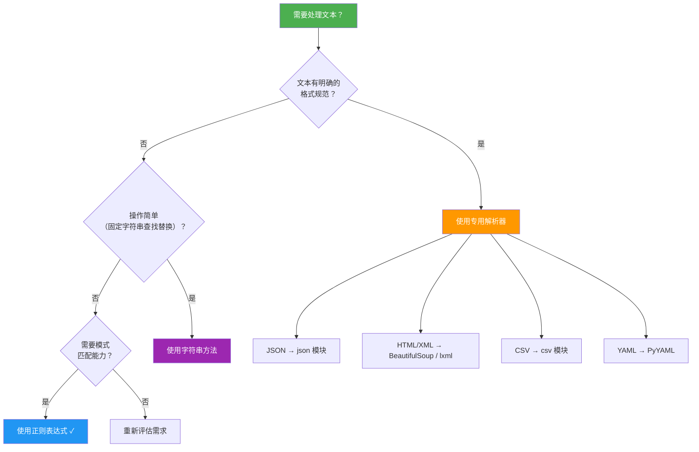

# 实战文本处理

> **所属路径**：`01_基础能力/01_开发环境与技术英语/05_正则表达式/04_实战文本处理`
> **预计学习时间**：60 分钟
> **难度等级**：⭐⭐⭐

---

## 前置知识

- [模式语法](../01_模式语法/01_模式语法.md)（掌握字符类、量词、锚点等基础语法）
- [匹配搜索与替换](../02_匹配搜索与替换/02_匹配搜索与替换.md)（熟悉 `re` 模块的核心函数）
- [分组与断言](../03_分组与断言/03_分组与断言.md)（掌握捕获组、命名组和断言的用法）

> 如果以上内容还不熟悉，建议先完成对应课程再继续。

---

## 学习目标

完成本节后，你将能够：

1. 使用正则表达式解析日志文件，提取时间戳、级别和消息等结构化信息
2. 编写正则模式提取常见数据格式（邮箱、URL、IP 地址、电话号码等）
3. 使用正则表达式完成文本清洗任务（去除 HTML 标签、规范化空白、标准化格式）
4. 判断何时应该使用正则表达式、何时应该使用专用解析器或字符串方法
5. 了解正则表达式的性能陷阱并掌握基本的优化技巧

---

## 正文讲解

### 1. 从学习到实战

在前三课中，我们从模式语法学到分组与断言，已经掌握了 Python 正则表达式的完整工具箱。但你可能仍然会有疑问："我知道这些语法了，可遇到真实问题时，该从哪里下手？"

这正是本课要解决的问题。我们将通过四个真实场景，把前面学到的知识串联起来，同时讨论正则表达式的适用边界和性能注意事项。

### 2. 案例一：日志文件解析

日志解析是正则表达式最经典的应用场景之一。一条典型的应用日志可能长这样：

```
2024-05-31 10:23:45.123 [INFO ] main.app - 服务启动成功，端口 8080
2024-05-31 10:24:01.456 [ERROR] db.conn  - 连接超时：host=192.168.1.100, port=5432
2024-05-31 10:24:15.789 [WARN ] cache    - 缓存命中率低于阈值：23.5%
```

每条日志都有固定结构：时间戳、日志级别、模块名、消息内容。用命名组可以直接把它们提取为结构化数据：

```python
import re

log_pattern = re.compile(r"""
    (?P<timestamp>\d{4}-\d{2}-\d{2}\s\d{2}:\d{2}:\d{2}\.\d{3})  # 时间戳
    \s+\[(?P<level>\w+)\s*\]                                      # 日志级别
    \s+(?P<module>\S+)                                             # 模块名
    \s+-\s+                                                        # 分隔符
    (?P<message>.+)                                                # 消息内容
""", re.VERBOSE)

log_lines = [
    "2024-05-31 10:23:45.123 [INFO ] main.app - 服务启动成功，端口 8080",
    "2024-05-31 10:24:01.456 [ERROR] db.conn  - 连接超时：host=192.168.1.100, port=5432",
    "2024-05-31 10:24:15.789 [WARN ] cache    - 缓存命中率低于阈值：23.5%",
]

for line in log_lines:
    m = log_pattern.match(line)
    if m:
        d = m.groupdict()
        print(f"[{d['level']:5s}] {d['timestamp']} | {d['module']:10s} | {d['message']}")
```

**预期输出**：
```
[INFO ] 2024-05-31 10:23:45.123 | main.app   | 服务启动成功，端口 8080
[ERROR] 2024-05-31 10:24:01.456 | db.conn    | 连接超时：host=192.168.1.100, port=5432
[WARN ] 2024-05-31 10:24:15.789 | cache      | 缓存命中率低于阈值：23.5%
```

> 💡 **实用技巧**：解析日志时总是用 `re.compile()` 预编译模式——日志文件通常有成千上万行，编译一次复用多次的性能优势非常明显。

在提取出结构化数据后，还可以进一步分析。比如，从 ERROR 级别的消息中提取具体的错误参数：

```python
import re

error_msg = "连接超时：host=192.168.1.100, port=5432"
params = dict(re.findall(r'(\w+)=([\w.]+)', error_msg))
print(params)  # {'host': '192.168.1.100', 'port': '5432'}
```

### 3. 案例二：常见数据格式提取

在文本数据中，经常需要提取邮箱地址、URL、IP 地址等结构化信息。下面是一组实用的正则模式：

#### 邮箱地址

```python
import re

email_pattern = re.compile(r'[a-zA-Z0-9._%+-]+@[a-zA-Z0-9.-]+\.[a-zA-Z]{2,}')

text = "联系我：admin@example.com 或 support.team@company.co.jp"
print(email_pattern.findall(text))
# ['admin@example.com', 'support.team@company.co.jp']
```

#### URL 提取

```python
import re

url_pattern = re.compile(r'https?://[^\s<>"\']+')

text = '请访问 https://example.com/path?q=1 或 http://docs.python.org 了解更多'
print(url_pattern.findall(text))
# ['https://example.com/path?q=1', 'http://docs.python.org']
```

#### IPv4 地址（带范围验证）

```python
import re

# 简化版：不验证数值范围
simple_ip = re.compile(r'\b\d{1,3}\.\d{1,3}\.\d{1,3}\.\d{1,3}\b')

# 精确版：验证每组 0-255
precise_ip = re.compile(
    r'\b(?:(?:25[0-5]|2[0-4]\d|[01]?\d\d?)\.){3}'
    r'(?:25[0-5]|2[0-4]\d|[01]?\d\d?)\b'
)

text = "服务器 192.168.1.100 和 10.0.0.1 正常，999.999.999.999 无效"
print(simple_ip.findall(text))    # ['192.168.1.100', '10.0.0.1', '999.999.999.999']
print(precise_ip.findall(text))   # ['192.168.1.100', '10.0.0.1']
```

#### 中国手机号

```python
import re

phone_pattern = re.compile(r'(?<!\d)1[3-9]\d{9}(?!\d)')

text = "手机 13812345678，座机 010-87654321，长号 123456789012"
print(phone_pattern.findall(text))  # ['13812345678']
```

> 📌 注意这里使用了负向后顾 `(?<!\d)` 和负向前瞻 `(?!\d)` 来确保手机号前后不是数字，避免从更长的数字串中错误提取。

### 4. 案例三：文本清洗

文本清洗是数据预处理的核心步骤。以下是几个常见的正则清洗任务：

#### 去除 HTML 标签

```python
import re

html = '<p>这是<b>粗体</b>和<a href="url">链接</a>文本</p>'
clean = re.sub(r'<[^>]+>', '', html)
print(clean)  # 这是粗体和链接文本
```

> ⚠️ **注意**：这个简单的正则只能处理规范的 HTML。对于复杂的 HTML（嵌套标签、属性中包含 `>` 的情况），应该使用专用的 HTML 解析器（如 `BeautifulSoup` 或 `lxml`）——这一点我们稍后会详细讨论。

#### 规范化空白

```python
import re

text = "  多个   空格   和\t制表符\n以及\n\n多余的   换行  "
# 将连续空白替换为单个空格
normalized = re.sub(r'\s+', ' ', text).strip()
print(normalized)
# 多个 空格 和 制表符 以及 多余的 换行
```

#### 标准化日期格式

```python
import re

text = "日期有 2024/05/31、2024.06.01 和 2024-06-15 三种格式"
# 统一为 YYYY-MM-DD 格式
standardized = re.sub(r'(\d{4})[/.](\d{2})[/.](\d{2})', r'\1-\2-\3', text)
print(standardized)
# 日期有 2024-05-31、2024-06-01 和 2024-06-15 三种格式
```

#### 清理中英文之间缺少的空格

```python
import re

text = "使用Python进行AI开发需要NumPy库"
# 在中文和英文/数字之间添加空格
result = re.sub(r'([\u4e00-\u9fff])([A-Za-z0-9])', r'\1 \2', text)
result = re.sub(r'([A-Za-z0-9])([\u4e00-\u9fff])', r'\1 \2', result)
print(result)
# 使用 Python 进行 AI 开发需要 NumPy 库
```

### 5. 案例四：CSV 与结构化文本处理

简单的 CSV 文件可以用正则表达式辅助处理，但要注意其局限性：

```python
import re

# 简单 CSV（无引号嵌套）
csv_line = "张三,25,北京,工程师"
fields = re.split(r',', csv_line)
print(fields)  # ['张三', '25', '北京', '工程师']

# 处理带引号的字段（值中包含逗号）
csv_complex = '张三,25,"北京,朝阳",工程师'
# 匹配引号字段或非逗号字段
fields = re.findall(r'"([^"]*)"| *([^,]+)', csv_complex)
print([a or b for a, b in fields])
# ['张三', '25', '北京,朝阳', '工程师']
```

> ⚠️ **重要提醒**：对于真实的 CSV 文件，应该使用 Python 标准库的 `csv` 模块而非正则表达式。CSV 的完整规范（转义引号、换行嵌入等）远比表面看起来复杂。

### 6. 何时不该使用正则表达式

正则表达式虽然强大，但不是万能的。以下场景应该使用专用工具：



> 📌 **图解说明**：选择文本处理工具的决策流程——有明确格式规范的用专用解析器，简单操作用字符串方法，需要模式匹配能力时才用正则表达式。

具体的对比：

| 任务 | 推荐工具 | 不推荐用正则的原因 |
| ---- | -------- | ------------------ |
| 解析 JSON | `json` 模块 | JSON 有嵌套结构，正则无法处理递归 |
| 解析 HTML/XML | `BeautifulSoup` / `lxml` | 标签嵌套、属性格式多变 |
| 解析 CSV | `csv` 模块 | 引号转义、换行嵌入等边界情况复杂 |
| 简单字符串查找 | `str.find()` / `in` | 固定字符串查找时字符串方法更快更简单 |
| 简单字符串替换 | `str.replace()` | 固定替换不需要模式匹配 |
| 按固定分隔符分割 | `str.split()` | 固定分隔符不需要正则 |

### 7. 性能注意事项

正则表达式的执行效率受模式设计影响很大。以下是几个关键的优化建议：

#### 预编译模式

```python
import re
import time

text = "a" * 1000000
pattern_str = r'\d+'

# 不编译：每次调用都重新解析
start = time.time()
for _ in range(1000):
    re.findall(pattern_str, text)
print(f"不编译: {time.time() - start:.3f}s")

# 编译后复用
compiled = re.compile(pattern_str)
start = time.time()
for _ in range(1000):
    compiled.findall(text)
print(f"编译后: {time.time() - start:.3f}s")
```

#### 避免灾难性回溯

**灾难性回溯（Catastrophic Backtracking）** 是正则表达式最严重的性能陷阱。它通常发生在模式中有多个嵌套量词且匹配失败时：

```python
import re

# 危险模式：嵌套量词可能导致指数级回溯
# pattern = r'(a+)+b'  # 不要这样写！

# 测试：以下输入会导致长时间挂起
# re.match(r'(a+)+b', 'a' * 25 + 'c')  # 极慢！不要运行！

# 安全替代：消除嵌套量词
safe_pattern = r'a+b'  # 等价但安全
```

> ⚠️ **警告**：永远不要在用户输入驱动的正则匹配中使用未经审查的模式。恶意构造的模式可能导致 **正则表达式拒绝服务（ReDoS）** 攻击。

#### 其他优化技巧

- 使用非捕获组 `(?:...)` 替代不需要的捕获组
- 尽量让模式的开头具有唯一性，减少回溯尝试
- 对于固定前缀，可以先用 `str.startswith()` 过滤再用正则
- 处理超大文本时，使用 `finditer()` 而非 `findall()` 以节省内存

### 8. 第三方 regex 模块简介

Python 标准库的 `re` 模块覆盖了大部分需求，但在某些高级场景下，第三方的 `regex` 模块提供了更多特性：

| 特性 | `re` 模块 | `regex` 模块 |
| ---- | --------- | ------------ |
| 变长后顾断言 | ❌ 不支持 | ✅ 支持 |
| Unicode 属性 `\p{Han}` | ❌ 不支持 | ✅ 支持 |
| 原子组（防止回溯） | ❌ 不支持 | ✅ 支持 |
| 模糊匹配（近似匹配） | ❌ 不支持 | ✅ 支持 |
| API 兼容性 | — | 完全兼容 `re` |

`regex` 模块可以通过 `pip install regex` 安装，其 API 与 `re` 完全兼容，可以作为直接替代：

```python
# pip install regex
import regex

# 变长后顾断言（re 模块不支持）
text = "price: $100, cost: €200, fee: ¥300"
# 提取任意长度货币符号后的数字
print(regex.findall(r'(?<=\p{Sc})\d+', text))
# ['100', '200', '300']
```

---

## 动手实践

下面是一个完整的日志分析器示例，综合运用了本主题四课的内容：

```python
# 文件：code/log_analyzer.py
# 环境要求：Python 3.10+
import re
from collections import Counter

# ---------- 模拟日志数据 ----------
LOG_DATA = """
2024-05-31 10:23:45.123 [INFO ] app.main    - 服务启动成功，监听端口 8080
2024-05-31 10:23:46.001 [INFO ] app.main    - 加载配置文件 /etc/app/config.yaml
2024-05-31 10:24:01.456 [ERROR] db.conn     - 连接超时：host=192.168.1.100, port=5432, timeout=30s
2024-05-31 10:24:02.789 [ERROR] db.conn     - 重试连接失败：host=192.168.1.100, attempt=3/3
2024-05-31 10:24:15.321 [WARN ] cache.redis - 缓存命中率低于阈值：当前 23.5%, 阈值 50%
2024-05-31 10:25:00.000 [INFO ] app.api     - GET /api/users 200 45ms
2024-05-31 10:25:01.100 [INFO ] app.api     - POST /api/data 201 120ms
2024-05-31 10:25:02.200 [WARN ] app.api     - GET /api/report 429 5ms (限流)
2024-05-31 10:25:30.500 [ERROR] app.auth    - 认证失败：user=admin, ip=10.0.0.55
""".strip()

# ---------- 1. 解析日志结构 ----------
log_pattern = re.compile(r"""
    (?P<timestamp>\d{4}-\d{2}-\d{2}\s\d{2}:\d{2}:\d{2}\.\d{3})
    \s+\[(?P<level>\w+)\s*\]
    \s+(?P<module>\S+)
    \s+-\s+
    (?P<message>.+)
""", re.VERBOSE)

entries = []
for line in LOG_DATA.splitlines():
    m = log_pattern.match(line)
    if m:
        entries.append(m.groupdict())

print(f"共解析 {len(entries)} 条日志")

# ---------- 2. 统计日志级别分布 ----------
level_counts = Counter(e['level'] for e in entries)
print("\n日志级别分布:")
for level, count in level_counts.most_common():
    bar = "█" * count
    print(f"  {level:5s} | {bar} ({count})")

# ---------- 3. 提取 ERROR 日志中的关键参数 ----------
print("\n错误详情:")
param_pattern = re.compile(r'(\w+)=([\w./]+)')
for e in entries:
    if e['level'] == 'ERROR':
        params = dict(param_pattern.findall(e['message']))
        print(f"  [{e['module']}] {e['message']}")
        if params:
            print(f"    参数: {params}")

# ---------- 4. 提取 API 请求日志 ----------
print("\nAPI 请求:")
api_pattern = re.compile(r'(?P<method>GET|POST|PUT|DELETE) (?P<path>/\S+) (?P<status>\d+) (?P<time>\d+)ms')
for e in entries:
    m = api_pattern.search(e['message'])
    if m:
        d = m.groupdict()
        status_icon = "✓" if d['status'].startswith('2') else "✗"
        print(f"  {status_icon} {d['method']:6s} {d['path']:20s} → {d['status']} ({d['time']}ms)")

# ---------- 5. 提取所有 IP 地址 ----------
ip_pattern = re.compile(r'\b(?:\d{1,3}\.){3}\d{1,3}\b')
all_ips = set()
for e in entries:
    ips = ip_pattern.findall(e['message'])
    all_ips.update(ips)

print(f"\n发现的 IP 地址: {sorted(all_ips)}")
```

**运行说明**：
- 环境要求：Python 3.10+
- 运行命令：`python code/log_analyzer.py`

**预期输出**：
```
共解析 9 条日志

日志级别分布:
  INFO  | ████ (4)
  ERROR | ███ (3)
  WARN  | ██ (2)

错误详情:
  [db.conn] 连接超时：host=192.168.1.100, port=5432, timeout=30s
    参数: {'host': '192.168.1.100', 'port': '5432', 'timeout': '30s'}
  [db.conn] 重试连接失败：host=192.168.1.100, attempt=3/3
    参数: {'host': '192.168.1.100', 'attempt': '3/3'}
  [app.auth] 认证失败：user=admin, ip=10.0.0.55
    参数: {'user': 'admin', 'ip': '10.0.0.55'}

API 请求:
  ✓ GET    /api/users           → 200 (45ms)
  ✓ POST   /api/data            → 201 (120ms)
  ✗ GET    /api/report          → 429 (5ms)

发现的 IP 地址: ['10.0.0.55', '192.168.1.100']
```

---

## 典型误区

| 误区 | 正确理解 |
| ---- | -------- |
| 用正则表达式解析 HTML/XML | HTML 不是正则语言，嵌套标签无法用正则正确处理；应使用 `BeautifulSoup` 或 `lxml` |
| 用正则表达式解析 JSON | JSON 有递归嵌套结构，应使用 `json` 模块 |
| 编写过于复杂的单个正则来一次性解决所有问题 | 将复杂任务分解为多个简单正则，分步处理更清晰、更容易调试 |
| 忽视灾难性回溯风险，在生产环境中使用用户输入的正则 | 对用户输入的正则设置超时限制，或使用白名单方式限制可用模式 |
| 简单查找替换也用正则 | `str.find()`、`str.replace()`、`str.split()` 对于固定字符串操作更快更简单 |

---

## 练习题

### 练习 1：Apache 访问日志解析（难度：⭐⭐）

解析以下 Apache 访问日志行，提取 IP 地址、请求方法、请求路径、状态码和响应大小：

```
192.168.1.1 - - [31/May/2024:10:23:45 +0800] "GET /index.html HTTP/1.1" 200 1234
10.0.0.55 - - [31/May/2024:10:24:01 +0800] "POST /api/login HTTP/1.1" 401 89
```

<details>
<summary>💡 提示</summary>

各字段之间用空格分隔。IP 地址在行首，请求信息在双引号中，状态码和大小在最后。可以使用命名组来提取各部分。

</details>

<details>
<summary>✅ 参考答案</summary>

```python
import re

log_lines = [
    '192.168.1.1 - - [31/May/2024:10:23:45 +0800] "GET /index.html HTTP/1.1" 200 1234',
    '10.0.0.55 - - [31/May/2024:10:24:01 +0800] "POST /api/login HTTP/1.1" 401 89',
]

pattern = re.compile(
    r'(?P<ip>\S+) \S+ \S+ \[(?P<time>[^\]]+)\] '
    r'"(?P<method>\w+) (?P<path>\S+) \S+" '
    r'(?P<status>\d+) (?P<size>\d+)'
)

for line in log_lines:
    m = pattern.match(line)
    if m:
        d = m.groupdict()
        print(f"IP={d['ip']}, 方法={d['method']}, "
              f"路径={d['path']}, 状态={d['status']}, 大小={d['size']}")
# IP=192.168.1.1, 方法=GET, 路径=/index.html, 状态=200, 大小=1234
# IP=10.0.0.55, 方法=POST, 路径=/api/login, 状态=401, 大小=89
```

</details>

### 练习 2：批量标准化电话号码（难度：⭐⭐）

给定一批格式不统一的电话号码，将它们统一格式化为 `138-1234-5678` 的形式：

```python
phones = [
    "13812345678",
    "138 1234 5678",
    "138-1234-5678",
    "+86 13812345678",
    "+86-138-1234-5678",
]
```

<details>
<summary>💡 提示</summary>

先用正则去掉所有非数字字符，再从中提取手机号的 11 位数字部分，最后按 `3-4-4` 格式组装。

</details>

<details>
<summary>✅ 参考答案</summary>

```python
import re

phones = [
    "13812345678",
    "138 1234 5678",
    "138-1234-5678",
    "+86 13812345678",
    "+86-138-1234-5678",
]

def normalize_phone(raw: str) -> str:
    digits = re.sub(r'\D', '', raw)          # 去掉非数字
    m = re.search(r'(1[3-9]\d{9})$', digits) # 从末尾提取11位手机号
    if m:
        phone = m.group(1)
        return f"{phone[:3]}-{phone[3:7]}-{phone[7:]}"
    return raw  # 无法识别则返回原始值

for p in phones:
    print(f"  {p:25s} → {normalize_phone(p)}")
# 13812345678               → 138-1234-5678
# 138 1234 5678             → 138-1234-5678
# 138-1234-5678             → 138-1234-5678
# +86 13812345678           → 138-1234-5678
# +86-138-1234-5678         → 138-1234-5678
```

</details>

### 练习 3：文本清洗流水线（难度：⭐⭐⭐）

编写一个文本清洗函数 `clean_text(text)` ，依次完成以下操作：
1. 去除 HTML 标签
2. 将连续空白字符替换为单个空格
3. 在中英文之间添加空格
4. 去除首尾空白

用以下测试文本验证：

```python
raw = '  <p>使用Python3和NumPy进行   数据分析</p>  '
# 期望输出: '使用 Python3 和 NumPy 进行 数据分析'
```

<details>
<summary>💡 提示</summary>

将每个清洗步骤写成一个 `re.sub()` 调用，最后 `strip()` 。中英文之间添加空格需要两条正则：中文→英文和英文→中文。

</details>

<details>
<summary>✅ 参考答案</summary>

```python
import re

def clean_text(text: str) -> str:
    # 1. 去除 HTML 标签
    text = re.sub(r'<[^>]+>', '', text)
    # 2. 连续空白替换为单个空格
    text = re.sub(r'\s+', ' ', text)
    # 3. 中英文之间添加空格
    text = re.sub(r'([\u4e00-\u9fff])([A-Za-z0-9])', r'\1 \2', text)
    text = re.sub(r'([A-Za-z0-9])([\u4e00-\u9fff])', r'\1 \2', text)
    # 4. 去除首尾空白
    return text.strip()

raw = '  <p>使用Python3和NumPy进行   数据分析</p>  '
print(clean_text(raw))
# 使用 Python3 和 NumPy 进行 数据分析

assert clean_text(raw) == '使用 Python3 和 NumPy 进行 数据分析'
print("✓ 测试通过")
```

</details>

---

## 下一步学习

- 📖 下一个知识主题：[日期时间与日志](../../06_日期时间与日志/)——学习 Python 的日期时间处理和日志框架，日志解析中会大量运用正则表达式
- 🔗 相关知识点：[文本数据预处理](../../../05_数据能力/10_文本数据预处理/)——在 NLP 和数据科学中进一步运用正则表达式进行文本清洗和特征提取
- 📚 拓展阅读：第三方 [`regex` 模块文档](https://github.com/mrabarnett/mrab-regex)——了解 Python `re` 模块的增强替代方案

---

## 参考资料

1. [Python 官方文档 - re 模块](https://docs.python.org/3/library/re.html) — re 模块的完整 API 参考（官方文档）
2. [Python 官方文档 - 正则表达式 HOWTO](https://docs.python.org/3/howto/regex.html) — 官方正则表达式入门教程（官方文档）
3. [regex101](https://regex101.com/) — 在线正则表达式测试工具，支持 Python 风格（免费在线工具）
4. [mrab-regex - GitHub](https://github.com/mrabarnett/mrab-regex) — 第三方 regex 模块，提供变长后顾、Unicode 属性等高级特性（开源项目，Apache-2.0 许可）
5. [OWASP - ReDoS](https://owasp.org/www-community/attacks/Regular_expression_Denial_of_Service_-_ReDoS) — 正则表达式拒绝服务攻击的安全指南（公开安全资源）
