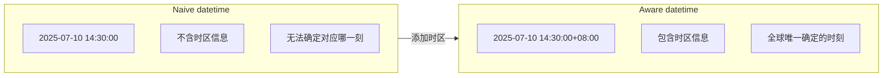
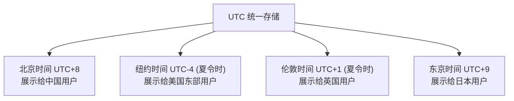
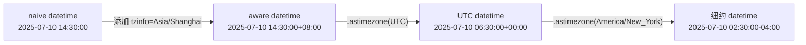

# 时区与国际化

> **所属路径**：`01_基础能力/01_开发环境与技术英语/06_日期时间与日志/02_时区与国际化`
> **预计学习时间**：50 分钟
> **难度等级**：⭐⭐

---

## 前置知识

- [日期与时间处理](../01_日期与时间处理/01_日期与时间处理.md)
- [字符串方法与格式化](../../02_字符串与编码/01_字符串方法与格式化/01_字符串方法与格式化.md)

> 如果以上内容还不熟悉，建议先完成对应课程再继续。

---

## 学习目标

完成本节后，你将能够：

1. 解释为什么在程序中必须正确处理时区，并描述忽略时区可能带来的典型问题
2. 区分 **naive datetime** 与 **aware datetime** ，并说明各自的适用场景
3. 使用 Python 标准库 `zoneinfo` 模块创建和转换时区感知的日期时间对象
4. 在 UTC 与本地时间之间正确转换，并理解 Unix 时间戳的含义
5. 使用 `locale` 模块将日期时间格式化为不同语言和地区的表示形式

---

## 正文讲解

### 1. 为什么时区如此重要

想象这样一个场景：你在北京写了一段定时脚本，计划每天凌晨 2:00 执行数据备份。代码测试通过，上线后一切正常——直到某天你的美国同事报告说："数据备份怎么在我们的下午 2 点跑了？"

这就是忽略时区带来的经典问题：你的 "凌晨 2 点" 是北京时间（UTC+8），而服务器可能部署在美国东部（UTC-5），两者相差 13 个小时。类似的问题在跨国团队协作、分布式系统日志对齐、金融交易时间记录等场景中频繁出现。

时区问题之所以容易被忽视，是因为在本地开发环境中一切看起来都正常。只有当系统跨越地理边界时，时间的"歧义性"才会暴露出来。因此，从一开始就正确处理时区，是每个程序员的基本功。

### 2. Naive 与 Aware：两种日期时间对象

在上一课中，我们学习了 `datetime` 模块的基本用法。现在要引入一个关键概念的区分：Python 中的 `datetime` 对象分为两种——**无时区信息的（Naive）** 和 **有时区信息的（Aware）** 。



> 📌 **图解说明**：左侧的 Naive datetime 只有日期和时间，没有时区标记，因此无法确定它代表地球上哪个时刻。右侧的 Aware datetime 带有 `+08:00` 偏移量，可以唯一确定一个全球统一的时间点。

简单来说：

| 类型 | `tzinfo` 属性 | 含义 | 适用场景 |
| ---- | ------------- | ---- | -------- |
| Naive | `None` | "我只是一个数字，不知道自己属于哪个时区" | 纯本地计算、无跨时区需求 |
| Aware | 非 `None` | "我明确知道自己是哪个时区的几点几分" | 跨时区系统、日志记录、数据库存储 |

一个关键规则：**Naive 和 Aware 对象不能直接比较或做减法运算**，否则 Python 会抛出 `TypeError` 。这是 Python 在提醒你——把两个含义不明确的时间放在一起运算是危险的。

### 3. UTC——全球时间的"公共语言"

在真实项目中，你会经常听到一个建议："所有时间都用 UTC 存储，只在展示给用户时才转换为本地时间。" 这句话背后的逻辑是什么？

**协调世界时（Coordinated Universal Time, UTC）** 是全球通用的时间标准，不受夏令时影响，也不属于任何特定国家。它的偏移量始终为 `+00:00` 。如果你把所有服务器、数据库、日志的时间戳统一为 UTC，那么无论数据来自纽约、伦敦还是东京，它们的时间都可以直接比较——不需要任何转换。



> 📌 **图解说明**：数据在存储和传输时统一使用 UTC，只在面向终端用户展示时才转换为对应的本地时间。这样可以避免跨时区对比时的混乱。

你可能注意到图中纽约和伦敦标注了"夏令时"。这正是使用 UTC 的另一个好处——UTC 本身没有夏令时（Daylight Saving Time, DST）的概念。如果你直接用当地时间存储，一年中有两天的时间可能出现"重复"或"跳过"，这会导致非常诡异的 bug。

### 4. 使用 zoneinfo 模块处理时区

从 Python 3.9 开始，标准库新增了 `zoneinfo` 模块，它基于操作系统的 IANA 时区数据库（也叫 Olson 数据库），提供了简洁而准确的时区处理能力。如果你使用的是 Python 3.9 以下版本，可以通过 `pip install tzdata` 或使用第三方库 `pytz` 实现类似功能，但本课以 `zoneinfo` 为主。

创建一个时区感知的 datetime 对象非常简单：

```python
from datetime import datetime
from zoneinfo import ZoneInfo

# 创建一个北京时间（Asia/Shanghai）的 aware datetime
beijing_time = datetime(2025, 7, 10, 14, 30, 0, tzinfo=ZoneInfo("Asia/Shanghai"))
print(beijing_time)
# 输出: 2025-07-10 14:30:00+08:00

# 检查 tzinfo 属性
print(beijing_time.tzinfo)
# 输出: Asia/Shanghai

# 获取当前 UTC 时间（aware）
utc_now = datetime.now(tz=ZoneInfo("UTC"))
print(utc_now)
# 输出类似: 2025-07-10 06:30:00+00:00（具体值取决于执行时间）
```

这里有一个要点：时区名称使用的是 IANA 标准格式，比如 `"Asia/Shanghai"` 而不是 `"CST"` 或 `"UTC+8"` 。这是因为像 `"CST"` 这样的缩写可能代表 China Standard Time、Central Standard Time 或 Cuba Standard Time——它是歧义的。而 `"Asia/Shanghai"` 是唯一确定的标识。

### 5. 在时区之间转换

有了 aware datetime 对象之后，在不同时区之间转换只需一步——调用 `astimezone()` 方法：

```python
from datetime import datetime
from zoneinfo import ZoneInfo

# 从北京时间出发
beijing_time = datetime(2025, 7, 10, 14, 30, 0, tzinfo=ZoneInfo("Asia/Shanghai"))

# 转换为纽约时间
ny_time = beijing_time.astimezone(ZoneInfo("America/New_York"))
print(f"北京: {beijing_time}")
print(f"纽约: {ny_time}")
# 北京: 2025-07-10 14:30:00+08:00
# 纽约: 2025-07-10 02:30:00-04:00

# 转换为 UTC
utc_time = beijing_time.astimezone(ZoneInfo("UTC"))
print(f"UTC:  {utc_time}")
# UTC:  2025-07-10 06:30:00+00:00

# 验证：三个时间代表的是同一个时刻
print(beijing_time == ny_time == utc_time)
# 输出: True
```

最后那行 `True` 非常重要——它证明了三个看起来完全不同的时间字符串，实际上指向的是同一个物理时刻。这就是 aware datetime 的核心价值：无论你用什么时区表示，底层代表的时刻是一致的。

下面这张图总结了整个转换流程：



> 📌 **图解说明**：先将 naive datetime 绑定时区变成 aware，然后通过 `astimezone()` 在任意时区之间自由转换。

### 6. 夏令时的陷阱

夏令时（Daylight Saving Time, DST）是时区处理中最容易踩坑的地方。以美国东部为例，每年 3 月第二个周日凌晨 2:00 时钟会"向前跳一小时"到 3:00（这意味着 2:00\~2:59 这段时间不存在），而 11 月第一个周日凌晨 2:00 时钟会"倒退一小时"回到 1:00（这意味着 1:00\~1:59 这段时间出现了两次）。

`zoneinfo` 模块能够自动处理这些边界情况：

```python
from datetime import datetime
from zoneinfo import ZoneInfo

# 2025 年美国东部夏令时开始：3 月 9 日 2:00 AM
# 此时时钟从 2:00 直接跳到 3:00

# 夏令时开始前：EST (UTC-5)
before_dst = datetime(2025, 3, 9, 1, 30, tzinfo=ZoneInfo("America/New_York"))
print(f"夏令时前: {before_dst} ({before_dst.tzname()})")
# 夏令时前: 2025-03-09 01:30:00-05:00 (EST)

# 夏令时开始后：EDT (UTC-4)
after_dst = datetime(2025, 3, 9, 3, 30, tzinfo=ZoneInfo("America/New_York"))
print(f"夏令时后: {after_dst} ({after_dst.tzname()})")
# 夏令时后: 2025-03-09 03:30:00-04:00 (EDT)

# 两者之间实际只差了 1 小时（不是 2 小时）
diff = after_dst - before_dst
print(f"实际间隔: {diff}")
# 实际间隔: 1:00:00
```

从输出可以看到，虽然时钟读数从 1:30 跳到了 3:30（看起来差了 2 小时），但实际间隔只有 1 小时。如果你用 naive datetime 做减法，会得到错误的 2 小时。这正是 aware datetime 和 `zoneinfo` 的价值所在——它们会自动考虑 DST 转换。

### 7. Unix 时间戳与 datetime 的互转

在实际开发中，你经常会遇到 **Unix 时间戳（Unix Timestamp）** ——它是从 1970 年 1 月 1 日 00:00:00 UTC 到某一时刻所经过的秒数。API 返回的时间、数据库中存储的时间、日志中记录的时间，很多时候都是以时间戳形式出现的。

```python
from datetime import datetime
from zoneinfo import ZoneInfo

# datetime → 时间戳
beijing_time = datetime(2025, 7, 10, 14, 30, 0, tzinfo=ZoneInfo("Asia/Shanghai"))
timestamp = beijing_time.timestamp()
print(f"时间戳: {timestamp}")
# 时间戳: 1752130200.0

# 时间戳 → aware datetime（推荐方式：先转为 UTC，再转为本地时间）
utc_dt = datetime.fromtimestamp(timestamp, tz=ZoneInfo("UTC"))
print(f"UTC:    {utc_dt}")
# UTC:    2025-07-10 06:30:00+00:00

local_dt = utc_dt.astimezone(ZoneInfo("Asia/Shanghai"))
print(f"北京:   {local_dt}")
# 北京:   2025-07-10 14:30:00+08:00
```

> ⚠️ **注意**：`datetime.fromtimestamp(ts)` 如果不传 `tz` 参数，会返回一个 naive datetime，使用的是运行机器的本地时区。这在服务器上会产生不可预测的结果。**永远传入明确的 `tz` 参数**。

### 8. 本地化格式——locale 模块

处理完时区问题后，还有一个相关的需求：不同国家和地区对日期时间的书写习惯不同。比如：

- 中国：`2025年7月10日 星期四`
- 美国：`Thursday, July 10, 2025`
- 德国：`Donnerstag, 10. Juli 2025`

Python 的 `locale` 模块可以切换当前进程的区域设置，使 `strftime()` 输出本地化的日期格式：

```python
import locale
from datetime import datetime
from zoneinfo import ZoneInfo

dt = datetime(2025, 7, 10, 14, 30, 0, tzinfo=ZoneInfo("Asia/Shanghai"))

# 查看当前默认 locale
print(f"默认 locale: {locale.getlocale()}")

# 尝试设置中文 locale（Linux: zh_CN.UTF-8, macOS: zh_CN.UTF-8）
try:
    locale.setlocale(locale.LC_TIME, "zh_CN.UTF-8")
    print(f"中文格式: {dt.strftime('%Y年%m月%d日 %A %H:%M')}")
except locale.Error:
    print("当前系统不支持 zh_CN.UTF-8，使用默认格式")
    print(f"默认格式: {dt.strftime('%Y-%m-%d %A %H:%M')}")

# 恢复默认 locale
locale.setlocale(locale.LC_TIME, "")
```

需要注意的是，`locale.setlocale()` 会影响整个进程的全局状态，在多线程环境中使用需要格外小心。对于 Web 应用或需要同时支持多语言的场景，推荐使用第三方库 `babel`  来处理国际化格式，它不依赖全局状态：

```python
# 需要安装: pip install babel
from babel.dates import format_datetime
from datetime import datetime
from zoneinfo import ZoneInfo

dt = datetime(2025, 7, 10, 14, 30, 0, tzinfo=ZoneInfo("Asia/Shanghai"))

# Babel 不修改全局状态，通过参数指定 locale
print(format_datetime(dt, locale="zh_CN"))       # 2025年7月10日 下午2:30:00
print(format_datetime(dt, locale="en_US"))       # Jul 10, 2025, 2:30:00 PM
print(format_datetime(dt, locale="de_DE"))       # 10.07.2025, 14:30:00

# 也可以自定义格式
print(format_datetime(dt, "yyyy/MM/dd EEEE", locale="ja_JP"))  # 2025/07/10 木曜日
```

---

## 动手实践

前面讲了很多概念，现在让我们把它们组合到一个完整的实践中。下面这段代码模拟了一个"全球团队会议时间协调器"——给定一个 UTC 时间，自动转换为多个城市的本地时间并格式化输出：

```python
# 文件：code/meeting_scheduler.py
# 全球团队会议时间协调器
# 环境要求：Python 3.10+

from datetime import datetime
from zoneinfo import ZoneInfo

def schedule_meeting(utc_time_str: str, cities: dict[str, str]) -> None:
    """
    将 UTC 时间转换为多个城市的本地时间。

    参数:
        utc_time_str: ISO 格式的 UTC 时间字符串，如 "2025-07-10T09:00:00"
        cities: 字典，键为城市名，值为 IANA 时区名
    """
    # 解析 UTC 时间
    utc_dt = datetime.fromisoformat(utc_time_str).replace(tzinfo=ZoneInfo("UTC"))
    print(f"会议 UTC 时间: {utc_dt.isoformat()}")
    print("-" * 50)

    for city, tz_name in cities.items():
        local_dt = utc_dt.astimezone(ZoneInfo(tz_name))
        # 格式化为可读字符串
        formatted = local_dt.strftime("%Y-%m-%d %H:%M (%Z, UTC%z)")
        print(f"  {city:12s} → {formatted}")

    print("-" * 50)
    # 检查是否有城市的本地时间不在工作时间（9:00-18:00）
    print("⏰ 工作时间检查:")
    for city, tz_name in cities.items():
        local_dt = utc_dt.astimezone(ZoneInfo(tz_name))
        hour = local_dt.hour
        time_str = local_dt.strftime("%H:%M")
        if 9 <= hour <= 17:
            print(f"  ✅ {city}: {time_str} 在工作时间内")
        else:
            print(f"  ❌ {city}: {time_str} 不在工作时间内")


# 运行示例
if __name__ == "__main__":
    meeting_cities = {
        "北京": "Asia/Shanghai",
        "东京": "Asia/Tokyo",
        "伦敦": "Europe/London",
        "纽约": "America/New_York",
        "旧金山": "America/Los_Angeles",
    }

    # 假设会议安排在 UTC 09:00
    schedule_meeting("2025-07-10T09:00:00", meeting_cities)
```

**运行说明**：

- 环境要求：Python 3.10+
- 运行命令：`python code/meeting_scheduler.py`

**预期输出**：

```
会议 UTC 时间: 2025-07-10T09:00:00+00:00
--------------------------------------------------
  北京           → 2025-07-10 17:00 (CST, UTC+0800)
  东京           → 2025-07-10 18:00 (JST, UTC+0900)
  伦敦           → 2025-07-10 10:00 (BST, UTC+0100)
  纽约           → 2025-07-10 05:00 (EDT, UTC-0400)
  旧金山         → 2025-07-10 02:00 (PDT, UTC-0700)
--------------------------------------------------
⏰ 工作时间检查:
  ✅ 北京: 17:00 在工作时间内
  ❌ 东京: 18:00 不在工作时间内
  ✅ 伦敦: 10:00 在工作时间内
  ❌ 纽约: 05:00 不在工作时间内
  ❌ 旧金山: 02:00 不在工作时间内
```

从输出可以看到，一个对北京和伦敦友好的会议时间，对纽约和旧金山来说却是凌晨——这就是跨时区协作的真实挑战。在工程实践中，类似的逻辑广泛用于通知调度、定时任务配置和用户时间展示。

---

## 典型误区

| 误区 | 正确理解 |
| ---- | -------- |
| "时区就是一个固定的偏移量，比如东八区永远是 +8" | 不完全正确。许多时区有夏令时切换，偏移量会在一年中变化。例如美国东部在冬天是 UTC-5（EST），夏天变成 UTC-4（EDT）。应该使用 IANA 时区名称（如 `"America/New_York"` ）而非固定偏移量 |
| "用 `datetime.now()` 获取当前时间就够了" | `datetime.now()` 返回的是 naive datetime，在跨时区环境中含义不明确。推荐使用 `datetime.now(tz=ZoneInfo("UTC"))` 获取 aware 的 UTC 时间 |
| "naive 和 aware datetime 可以混合使用" | Python 禁止 naive 和 aware datetime 之间的比较和运算，会抛出 `TypeError` 。在项目中应统一使用 aware datetime |
| " `locale.setlocale()` 可以在多线程中随意使用" | `setlocale()` 修改的是进程级别的全局状态，在多线程环境中会产生竞态条件。多语言格式化应使用 `babel` 等线程安全的库 |
| "时间戳没有时区问题" | Unix 时间戳本身确实是基于 UTC 的，但 `datetime.fromtimestamp(ts)` 在不传 `tz` 参数时会使用本地时区返回 naive datetime，容易导致混淆。应始终传入 `tz` 参数 |

---

## 练习题

### 练习 1：UTC 与本地时间转换（难度：⭐）

编写一个函数 `utc_to_local(utc_str, tz_name)` ，接收一个 ISO 格式的 UTC 时间字符串和一个 IANA 时区名称，返回转换后的本地时间字符串（格式：`"YYYY-MM-DD HH:MM:SS TZ"` ）。

示例调用：

```python
result = utc_to_local("2025-07-10T06:30:00", "Asia/Shanghai")
print(result)  # "2025-07-10 14:30:00 CST"
```

<details>
<summary>💡 提示</summary>

使用 `datetime.fromisoformat()` 解析字符串，然后用 `.replace(tzinfo=...)` 添加 UTC 时区信息，最后用 `.astimezone()` 转换。格式化时用 `%Z` 获取时区缩写。

</details>

<details>
<summary>✅ 参考答案</summary>

```python
from datetime import datetime
from zoneinfo import ZoneInfo

def utc_to_local(utc_str: str, tz_name: str) -> str:
    utc_dt = datetime.fromisoformat(utc_str).replace(tzinfo=ZoneInfo("UTC"))
    local_dt = utc_dt.astimezone(ZoneInfo(tz_name))
    return local_dt.strftime("%Y-%m-%d %H:%M:%S %Z")

# 验证
result = utc_to_local("2025-07-10T06:30:00", "Asia/Shanghai")
print(result)  # "2025-07-10 14:30:00 CST"
assert "14:30:00" in result
assert "2025-07-10" in result
```

</details>

### 练习 2：时间戳往返转换（难度：⭐⭐）

编写一个函数 `roundtrip_timestamp(year, month, day, hour, minute, tz_name)` ，执行以下步骤：
1. 用给定参数创建一个 aware datetime
2. 将其转换为 Unix 时间戳
3. 再从时间戳转回 aware datetime（UTC）
4. 最后转回原始时区

函数应返回 `True` 表示往返转换后的时间与原始时间相等。

<details>
<summary>💡 提示</summary>

使用 `.timestamp()` 获取时间戳，用 `datetime.fromtimestamp(ts, tz=ZoneInfo("UTC"))` 转回 datetime，再用 `.astimezone()` 回到原始时区。最后比较两个 datetime 对象是否相等。

</details>

<details>
<summary>✅ 参考答案</summary>

```python
from datetime import datetime
from zoneinfo import ZoneInfo

def roundtrip_timestamp(year, month, day, hour, minute, tz_name):
    # 步骤 1: 创建 aware datetime
    original = datetime(year, month, day, hour, minute, tzinfo=ZoneInfo(tz_name))

    # 步骤 2: 转为时间戳
    ts = original.timestamp()

    # 步骤 3: 从时间戳转回 UTC
    utc_dt = datetime.fromtimestamp(ts, tz=ZoneInfo("UTC"))

    # 步骤 4: 转回原始时区
    restored = utc_dt.astimezone(ZoneInfo(tz_name))

    print(f"原始:  {original}")
    print(f"恢复:  {restored}")
    print(f"相等:  {original == restored}")
    return original == restored

# 验证
assert roundtrip_timestamp(2025, 7, 10, 14, 30, "Asia/Shanghai")
assert roundtrip_timestamp(2025, 1, 15, 3, 0, "America/New_York")
print("所有测试通过！")
```

</details>

### 练习 3：检测夏令时转换（难度：⭐⭐⭐）

编写一个函数 `is_dst(dt_aware)` ，判断一个 aware datetime 是否处于夏令时期间。然后用它验证：纽约在 2025 年 1 月 15 日不是夏令时，而在 2025 年 7 月 10 日是夏令时。

提示：可以比较该时刻的 UTC 偏移量与该时区的标准偏移量是否不同。

<details>
<summary>💡 提示</summary>

`datetime` 对象有一个 `.dst()` 方法，当处于夏令时期间时返回一个非零的 `timedelta` ，否则返回 `timedelta(0)` 。注意此方法只对 aware datetime 有效。

</details>

<details>
<summary>✅ 参考答案</summary>

```python
from datetime import datetime, timedelta
from zoneinfo import ZoneInfo

def is_dst(dt_aware: datetime) -> bool:
    """判断一个 aware datetime 是否处于夏令时期间"""
    dst_offset = dt_aware.dst()
    if dst_offset is None:
        raise ValueError("需要传入 aware datetime 对象")
    return dst_offset != timedelta(0)

# 验证
ny_winter = datetime(2025, 1, 15, 12, 0, tzinfo=ZoneInfo("America/New_York"))
ny_summer = datetime(2025, 7, 10, 12, 0, tzinfo=ZoneInfo("America/New_York"))

print(f"纽约 1月: DST={is_dst(ny_winter)}, 时区={ny_winter.tzname()}")
# 纽约 1月: DST=False, 时区=EST
print(f"纽约 7月: DST={is_dst(ny_summer)}, 时区={ny_summer.tzname()}")
# 纽约 7月: DST=True, 时区=EDT

assert not is_dst(ny_winter), "1 月不应该是夏令时"
assert is_dst(ny_summer), "7 月应该是夏令时"
print("所有测试通过！")
```

</details>

---

## 下一步学习

- 📖 下一个知识点：[logging 日志框架](../03_logging日志框架/03_logging日志框架.md)
- 🔗 相关知识点：[并发编程](../../07_并发编程/)（多线程中的时区与 locale 安全问题）
- 📚 拓展阅读：[IANA 时区数据库](https://www.iana.org/time-zones)

---

## 参考资料

1. [Python 官方文档 — zoneinfo 模块](https://docs.python.org/3/library/zoneinfo.html) — Python 标准库官方文档，`zoneinfo` 模块的完整 API 参考（官方文档）
2. [Python 官方文档 — datetime 模块](https://docs.python.org/3/library/datetime.html) — datetime 对象的时区处理相关部分（官方文档）
3. [Python 官方文档 — locale 模块](https://docs.python.org/3/library/locale.html) — 本地化和国际化相关的标准库文档（官方文档）
4. [IANA Time Zone Database](https://www.iana.org/time-zones) — 全球时区数据的权威来源，被 `zoneinfo` 模块使用（公开标准）
5. [Babel 官方文档](https://babel.pocoo.org/en/latest/) — Python 国际化工具库，提供线程安全的日期格式化功能（开源项目，BSD 许可）
