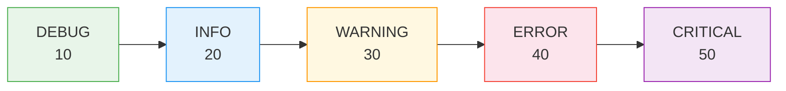
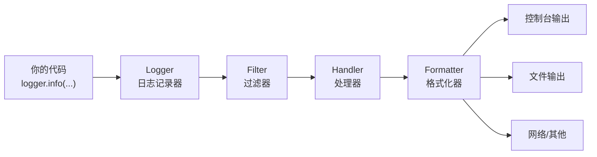
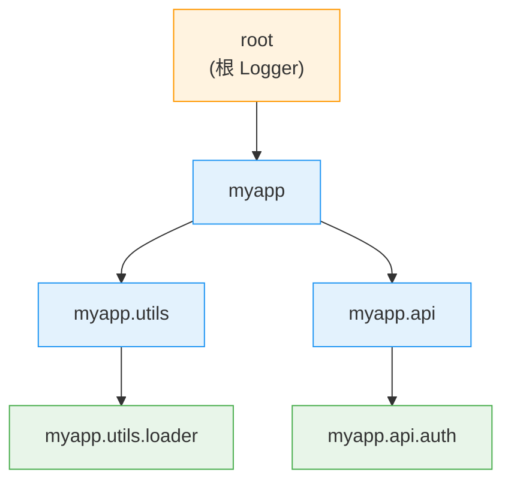

# logging日志框架

> **所属路径**：`01_基础能力/01_开发环境与技术英语/06_日期时间与日志/03_logging日志框架`
> **预计学习时间**：55 分钟
> **难度等级**：⭐⭐

---

## 前置知识

- [函数与模块](../../01_编程语言基础/03_函数与模块/03_函数与模块.md)（`import` 导入、函数定义与调用）
- [异常处理](../../01_编程语言基础/05_异常处理/05_异常处理.md)（`try/except` 基本用法）
- [日期与时间处理](../01_日期与时间处理/01_日期与时间处理.md)（`datetime` 模块基础）

> 如果以上内容还不熟悉，建议先完成对应课程再继续。

---

## 学习目标

完成本节后，你将能够：

1. 解释为什么在生产代码中应该使用 `logging` 而非 `print()` 来记录信息
2. 正确使用 Python 的 5 个标准日志级别（DEBUG、INFO、WARNING、ERROR、CRITICAL）
3. 使用 `logging.basicConfig()` 快速配置简单的日志输出
4. 描述 logging 模块的核心架构：Logger、Handler、Formatter、Filter 的协作关系
5. 理解 Logger 的层级结构与日志传播机制，避免日志重复输出

---

## 正文讲解

### 1. 为什么需要 logging——从 print 的困境说起

假设你正在开发一个数据处理脚本。在开发阶段，你习惯性地往代码里撒满了 `print()` ：

```python
print("开始读取数据...")
print(f"读取了 {len(data)} 条记录")
print("警告：发现 3 条重复数据")
print(f"错误：文件 {filename} 不存在")
```

在本地测试时一切正常，可一旦脚本部署到服务器上，你就会遇到一连串的问题：

- **信息洪流**：几千行 `print` 输出混在一起，你无法快速找到那条关键的错误信息。
- **无法过滤**：你想只看错误信息，但 `print` 不区分"这条是调试信息"还是"这条是严重错误"。
- **无法分流**：你希望普通信息输出到终端，错误信息同时写入文件——但 `print` 做不到。
- **缺少上下文**：出了问题，你想知道这条信息是什么时间、哪个模块产生的——但 `print` 只有一行裸文本。
- **难以关闭**：上线后你想关掉所有调试输出，只能一行一行注释 `print` 。

Python 标准库中的 **logging 模块** 正是为了解决这些问题而设计的。它提供了严重级别划分、灵活的输出目标、格式化模板和层级化管理——一句话概括：`print()` 是给开发者自己看的临时工具，而 `logging` 是为生产环境设计的专业信息记录系统。

| 需求 | `print()` | `logging` |
| ---- | --------- | --------- |
| 区分严重级别 | ❌ 全部一样 | ✅ 5 个级别 |
| 输出到文件 | 需要手动重定向 | ✅ Handler 灵活配置 |
| 按级别过滤 | ❌ 不支持 | ✅ 内置过滤 |
| 自动添加时间戳 | ❌ 需手写 | ✅ Formatter 自动添加 |
| 生产环境关闭调试输出 | 需逐行注释 | ✅ 调整级别即可 |
| 多模块统一管理 | ❌ 各自为政 | ✅ 层级化 Logger |

### 2. 五个日志级别——给每条消息贴上"紧急度标签"

`logging` 模块定义了 5 个标准级别，每个级别对应一个整数值。级别越高，表示事件越严重：



> 📌 **图解说明**：从左到右严重程度递增。设置某个级别后，只有该级别及更高级别的日志才会被输出。例如设置为 WARNING，则 DEBUG 和 INFO 的消息会被过滤掉。

每个级别的使用场景如下：

| 级别 | 数值 | 什么时候用 | 示例 |
| ---- | ---- | ---------- | ---- |
| `DEBUG` | 10 | 开发调试时的详细诊断信息 | 变量值、执行路径、循环计数 |
| `INFO` | 20 | 程序正常运行的关键节点 | "服务启动"、"数据加载完成" |
| `WARNING` | 30 | 值得注意但不影响运行的情况 | 配置缺失用了默认值、磁盘空间偏低 |
| `ERROR` | 40 | 某个功能失败但程序仍可继续 | 文件读取失败、API 调用超时 |
| `CRITICAL` | 50 | 严重错误，程序可能无法继续运行 | 数据库连接断开、内存耗尽 |

一个实用的判断原则：**如果这条消息需要有人立刻处理，用 ERROR 或 CRITICAL；如果只是"以防万一记一下"，用 INFO 或 DEBUG；如果介于两者之间，用 WARNING。**

### 3. 快速上手——basicConfig 一行搞定

在正式了解 logging 的完整架构之前，让我们先用最简单的方式跑起来。 `logging.basicConfig()` 是 logging 模块提供的"一键配置"函数，适合脚本和小型程序：

```python
import logging

# 一行配置：设置最低输出级别为 DEBUG，指定输出格式
logging.basicConfig(
    level=logging.DEBUG,
    format="%(asctime)s [%(levelname)s] %(message)s"
)

# 使用不同级别记录消息
logging.debug("这是一条调试信息")
logging.info("程序启动成功")
logging.warning("磁盘空间不足 20%")
logging.error("无法连接数据库")
logging.critical("系统内存耗尽，即将退出")
```

**预期输出**：

```
2025-07-14 10:30:00,123 [DEBUG] 这是一条调试信息
2025-07-14 10:30:00,123 [INFO] 程序启动成功
2025-07-14 10:30:00,124 [WARNING] 磁盘空间不足 20%
2025-07-14 10:30:00,124 [ERROR] 无法连接数据库
2025-07-14 10:30:00,124 [CRITICAL] 系统内存耗尽，即将退出
```

注意一个细节：如果你把 `level` 改为 `logging.WARNING` ，前两条消息（DEBUG 和 INFO）就不会出现了——这就是级别过滤的效果。

> ⚠️ **重要提示**： `basicConfig()` 只在第一次调用时生效。如果你在交互式环境（如 Jupyter Notebook）中多次运行包含 `basicConfig()` 的单元格，第二次及之后的调用不会更新配置。遇到这种情况，可以重启内核，或使用 `force=True` 参数（Python 3.8+）：
>
> ```python
> logging.basicConfig(level=logging.DEBUG, format="...", force=True)
> ```

### 4. 核心架构——四大组件协同工作

`basicConfig()` 虽然方便，但它背后其实帮你创建了一整套组件。理解这套架构是掌握 logging 模块的关键。logging 的核心由四个组件构成：



> 📌 **图解说明**：日志消息从你的代码出发，先经过 Logger 判断级别，再经过 Filter 做进一步筛选，然后交给 Handler 决定输出到哪里，最后由 Formatter 把消息整理成指定的格式。一个 Logger 可以挂载多个 Handler，实现"同一条日志同时输出到终端和文件"。

下面逐一介绍这四个组件的职责：

| 组件 | 类名 | 职责 | 类比 |
| ---- | ---- | ---- | ---- |
| **Logger** | `logging.Logger` | 程序中记录日志的入口，提供 `debug()` 、 `info()` 等方法 | 记者——负责采集消息 |
| **Handler** | `logging.Handler` | 决定日志消息送到哪里（控制台、文件、网络等） | 快递员——负责投递 |
| **Formatter** | `logging.Formatter` | 定义日志的最终输出格式 | 排版编辑——负责排版 |
| **Filter** | `logging.Filter` | 对日志做更精细的过滤（超出级别过滤的能力） | 审核员——负责筛选 |

前三个是日常使用中最核心的，Filter 在简单场景下通常不需要手动配置。

### 5. Logger——日志记录器

**Logger（日志记录器）** 是你在代码中直接打交道的对象。获取 Logger 的标准方式是调用 `logging.getLogger(name)` ：

```python
import logging

# 推荐：用模块名作为 Logger 名称
logger = logging.getLogger(__name__)
```

为什么用 `__name__` 作为名称？因为 Python 会自动将 `__name__` 设置为当前模块的完整导入路径（如 `myproject.utils.data_loader` ），这样你一眼就能看出日志来自哪个模块。

Logger 有两个关键行为：

1. **级别过滤**：Logger 自身有一个级别（通过 `logger.setLevel()` 设置）。低于该级别的消息会被直接丢弃，不会传给任何 Handler。
2. **分发消息**：通过级别检查的消息会被分发给 Logger 上挂载的所有 Handler。

```python
logger = logging.getLogger("myapp")
logger.setLevel(logging.DEBUG)  # Logger 接受 DEBUG 及以上的消息
```

> ⚠️ **关键细节**：Logger 和 Handler 各自都有级别设置，消息必须同时通过两道关卡才能最终输出。Logger 的级别是"第一道门"，Handler 的级别是"第二道门"。

### 6. Handler——决定日志去哪里

**Handler（处理器）** 负责把日志消息送到指定的输出目的地。logging 模块内置了十几种 Handler，最常用的是两个：

| Handler 类型 | 作用 | 用法 |
| ------------ | ---- | ---- |
| `StreamHandler` | 输出到控制台（默认 `sys.stderr` ） | 开发时查看实时日志 |
| `FileHandler` | 输出到文件 | 生产环境持久化日志记录 |

下面的例子展示了如何给一个 Logger 同时挂载两个 Handler——一个输出到终端，一个写入文件：

```python
import logging

# 1. 创建 Logger
logger = logging.getLogger("myapp")
logger.setLevel(logging.DEBUG)  # Logger 接受所有级别

# 2. 创建控制台 Handler，只输出 WARNING 及以上
console_handler = logging.StreamHandler()
console_handler.setLevel(logging.WARNING)

# 3. 创建文件 Handler，记录 DEBUG 及以上（所有消息）
file_handler = logging.FileHandler("app.log", encoding="utf-8")
file_handler.setLevel(logging.DEBUG)

# 4. 把 Handler 挂到 Logger 上
logger.addHandler(console_handler)
logger.addHandler(file_handler)

# 5. 测试
logger.debug("调试：变量 x = 42")
logger.info("信息：数据加载完成")
logger.warning("警告：磁盘空间不足")
logger.error("错误：文件未找到")
```

运行后，终端只会看到 WARNING 和 ERROR 两条消息，而 `app.log` 文件中会包含全部 4 条消息。这就是"同一条日志，不同目的地，不同级别"的威力。

### 7. Formatter——定义日志的"长相"

**Formatter（格式化器）** 决定了日志最终输出的样子。你通过一个格式字符串来告诉 Formatter 要包含哪些字段：

```python
formatter = logging.Formatter(
    fmt="%(asctime)s | %(name)s | %(levelname)-8s | %(message)s",
    datefmt="%Y-%m-%d %H:%M:%S"
)
```

常用的格式字段如下：

| 字段 | 含义 | 输出示例 |
| ---- | ---- | -------- |
| `%(asctime)s` | 日志产生的时间 | `2025-07-14 10:30:00` |
| `%(name)s` | Logger 的名称 | `myapp.utils` |
| `%(levelname)s` | 日志级别名称 | `WARNING` |
| `%(message)s` | 你传入的日志消息文本 | `磁盘空间不足` |
| `%(filename)s` | 产生日志的源文件名 | `app.py` |
| `%(lineno)d` | 产生日志的行号 | `42` |
| `%(funcName)s` | 产生日志的函数名 | `load_data` |
| `%(module)s` | 模块名（不含扩展名） | `app` |

Formatter 需要设置到 Handler 上（而不是 Logger 上），因为不同 Handler 可以使用不同的格式：

```python
# 终端用简洁格式
console_fmt = logging.Formatter("%(levelname)s: %(message)s")
console_handler.setFormatter(console_fmt)

# 文件用详细格式
file_fmt = logging.Formatter(
    "%(asctime)s [%(levelname)s] %(name)s:%(lineno)d - %(message)s"
)
file_handler.setFormatter(file_fmt)
```

这样终端输出干净清爽，文件日志则包含完整的诊断信息——两全其美。

### 8. Logger 层级与传播机制

logging 模块中所有 Logger 构成一棵树，树根是 **根 Logger（Root Logger）** ，子节点通过名称中的点号 `.` 分隔来确定：



> 📌 **图解说明**：Logger 名称中的点号 `.` 定义了父子关系。 `myapp.utils.loader` 的父 Logger 是 `myapp.utils` ，祖父是 `myapp` ，最终到达 root。

这棵树带来了一个重要机制—— **传播（Propagation）** ：

1. 当 `myapp.utils.loader` 记录一条日志时，它先交给自己的 Handler 处理。
2. 处理完毕后，如果 `propagate` 属性为 `True` （默认值），这条消息会继续向上传递给父 Logger `myapp.utils` 的 Handler。
3. 然后再向上传递给 `myapp` ，最终到达 root Logger。

这意味着：如果你在 root Logger 和子 Logger 上都挂了 Handler，同一条消息可能被输出多次。这是新手最常遇到的"日志重复"问题。解决办法有两种：

- **方法一**：只在 root Logger 上配置 Handler，子 Logger 不加 Handler，依靠传播机制让消息自动向上流动。
- **方法二**：在子 Logger 上设置 `logger.propagate = False` ，阻止消息向上传播。

```python
# 示例：阻止传播
child_logger = logging.getLogger("myapp.utils")
child_logger.propagate = False  # 不再向父 Logger 传递
```

### 9. 记录异常信息——logging 的杀手锏

当程序出现异常时，你不仅想记录错误消息，还想保留完整的堆栈信息（traceback）以便事后排查。 `logging` 提供了优雅的方式来做到这一点：

```python
import logging

logger = logging.getLogger(__name__)

try:
    result = 10 / 0
except ZeroDivisionError:
    # 方式一：使用 logger.exception()，自动附加堆栈信息
    logger.exception("计算过程中出现错误")

    # 方式二：使用 exc_info=True 参数
    # logger.error("计算过程中出现错误", exc_info=True)
```

`logger.exception()` 等价于 `logger.error(..., exc_info=True)` ，它会在 ERROR 级别记录消息，并自动附加当前异常的完整堆栈。输出类似：

```
ERROR:__main__:计算过程中出现错误
Traceback (most recent call last):
  File "demo.py", line 6, in <module>
    result = 10 / 0
ZeroDivisionError: division by zero
```

这比手动写 `print(traceback.format_exc())` 干净得多，而且堆栈信息会和日志消息一起被格式化、过滤、路由到相应的 Handler。

### 10. 最佳实践——getLogger(__name__) 的哲学

在本节结尾，让我们总结几条在实际项目中被广泛采用的最佳实践：

**① 每个模块用 `__name__` 获取 Logger**

```python
# myproject/utils/data_loader.py
import logging

logger = logging.getLogger(__name__)
# __name__ == "myproject.utils.data_loader"
```

这样做的好处是：Logger 名称自动与模块路径对齐，你一眼就能在日志中看出消息来源。同时，名称中的点号自动形成层级关系，方便统一管理。

**② 库代码只创建 Logger，不配置 Handler**

如果你在写一个供他人使用的库（而非最终应用），**永远不要** 在库代码中调用 `basicConfig()` 或添加 Handler。配置日志是应用层（调用你的库的人）的责任。库代码只需要：

```python
# 库代码：只获取 Logger，不配置
logger = logging.getLogger(__name__)
```

如果用户没有配置任何 Handler，Python 3.2+ 会在 root Logger 上使用一个 `lastResort` Handler，把 WARNING 及以上的消息输出到 `sys.stderr` ，不会完全沉默。

**③ 避免直接使用 root Logger**

调用 `logging.info()` 、 `logging.error()` 等模块级函数其实是在使用 root Logger。在小脚本中这没问题，但在多模块项目中，所有消息都汇聚到 root Logger 会导致混乱——你无法区分消息来自哪个模块。所以，始终使用具名 Logger：

```python
# ❌ 不推荐：使用 root Logger
logging.info("数据加载完成")

# ✅ 推荐：使用具名 Logger
logger = logging.getLogger(__name__)
logger.info("数据加载完成")
```

---

## 动手实践

> 下面我们把前面学到的所有知识串起来，构建一个完整的日志配置示例：一个 Logger 同时输出到控制台和文件，使用不同的级别和格式。

```python
# 文件：code/logging_demo.py
# 演示 logging 模块的完整配置流程
# 环境要求：Python 3.10+，无需额外依赖

import logging
import os


def setup_logger(name: str, log_file: str = "demo.log") -> logging.Logger:
    """
    创建并配置一个 Logger：
    - 控制台输出 INFO 及以上，使用简洁格式
    - 文件输出 DEBUG 及以上，使用详细格式
    """
    logger = logging.getLogger(name)
    logger.setLevel(logging.DEBUG)  # Logger 本身接受所有级别

    # --- 控制台 Handler ---
    console_handler = logging.StreamHandler()
    console_handler.setLevel(logging.INFO)
    console_fmt = logging.Formatter("%(levelname)-8s | %(message)s")
    console_handler.setFormatter(console_fmt)

    # --- 文件 Handler ---
    file_handler = logging.FileHandler(log_file, encoding="utf-8")
    file_handler.setLevel(logging.DEBUG)
    file_fmt = logging.Formatter(
        "%(asctime)s [%(levelname)-8s] %(name)s:%(funcName)s:%(lineno)d - %(message)s",
        datefmt="%Y-%m-%d %H:%M:%S",
    )
    file_handler.setFormatter(file_fmt)

    # 挂载 Handler（先清空，防止重复添加）
    logger.handlers.clear()
    logger.addHandler(console_handler)
    logger.addHandler(file_handler)

    return logger


def process_data(logger: logging.Logger) -> None:
    """模拟一个数据处理流程"""
    logger.debug("进入 process_data 函数")
    logger.info("开始加载数据...")

    data = list(range(100))
    logger.debug(f"加载了 {len(data)} 条原始记录")

    # 模拟一个警告场景
    duplicates = 3
    if duplicates > 0:
        logger.warning(f"发现 {duplicates} 条重复数据，已自动去重")

    # 模拟一个异常场景
    try:
        result = data[0] / 0
    except ZeroDivisionError:
        logger.exception("数据处理中出现除零错误")

    logger.info("数据处理流程结束")


def main() -> None:
    logger = setup_logger("myapp", log_file="demo.log")
    logger.info("=== 应用启动 ===")
    process_data(logger)
    logger.info("=== 应用结束 ===")
    print(f"\n📄 详细日志已写入 demo.log，查看命令：cat demo.log")


if __name__ == "__main__":
    main()
```

**运行命令**：

```bash
python code/logging_demo.py
```

**控制台预期输出**（简洁格式，只有 INFO 及以上）：

```
INFO     | === 应用启动 ===
INFO     | 开始加载数据...
WARNING  | 发现 3 条重复数据，已自动去重
ERROR    | 数据处理中出现除零错误
Traceback (most recent call last):
  File "code/logging_demo.py", line 54, in process_data
    result = data[0] / 0
ZeroDivisionError: division by zero
INFO     | 数据处理流程结束
INFO     | === 应用结束 ===

📄 详细日志已写入 demo.log，查看命令：cat demo.log
```

**文件 demo.log 预期内容**（详细格式，包含 DEBUG）：

```
2025-07-14 10:30:00 [DEBUG   ] myapp:process_data:42 - 进入 process_data 函数
2025-07-14 10:30:00 [INFO    ] myapp:process_data:43 - 开始加载数据...
2025-07-14 10:30:00 [DEBUG   ] myapp:process_data:46 - 加载了 100 条原始记录
2025-07-14 10:30:00 [WARNING ] myapp:process_data:50 - 发现 3 条重复数据，已自动去重
2025-07-14 10:30:00 [ERROR   ] myapp:process_data:55 - 数据处理中出现除零错误
Traceback (most recent call last):
  ...
ZeroDivisionError: division by zero
2025-07-14 10:30:00 [INFO    ] myapp:process_data:57 - 数据处理流程结束
```

从输出中我们验证了几个关键点：

1. **级别过滤生效**：控制台没有 DEBUG 消息，文件中有。
2. **格式差异化**：控制台是简洁的 `级别 | 消息` ，文件中包含时间、模块名、函数名和行号。
3. **异常堆栈被完整记录**：`logger.exception()` 自动附加了 traceback。

---

## 典型误区

| 误区 | 正确理解 |
| ---- | -------- |
| 在生产代码中仍然大量使用 `print()` 来记录信息 | `print()` 适合临时调试，生产代码应使用 `logging` ——它支持级别过滤、格式化、多目标输出，且可全局配置 |
| 不理解 Logger 层级，导致同一条日志输出两次 | Logger 默认 `propagate=True` ，消息会向父 Logger 传播。如果父子 Logger 都有 Handler，同一消息会被重复输出。解决方法：只在顶层配置 Handler，或设置 `propagate=False` |
| 在 Logger 上设了级别但忘了在 Handler 上也设级别（或反过来） | 消息必须同时通过 Logger 和 Handler 两道级别关卡。常见错误是 Logger 设为 DEBUG 但 Handler 默认 WARNING，导致 DEBUG 和 INFO 消息"消失" |
| 在库代码中调用 `logging.basicConfig()` 或添加 Handler | 库代码只应获取 Logger（ `logging.getLogger(__name__)` ），日志配置是应用层的责任。库中配置 Handler 会干扰使用者的日志设置 |
| 在所有模块中直接调用 `logging.info()` 等模块级函数 | 这些函数使用的是 root Logger，在多模块项目中无法区分消息来源。应使用 `logger = logging.getLogger(__name__)` 获取具名 Logger |

---

## 练习题

### 练习 1：级别过滤实验（难度：⭐）

编写一段代码，使用 `logging.basicConfig()` 配置日志级别为 `INFO` ，然后分别用 5 个级别（DEBUG、INFO、WARNING、ERROR、CRITICAL）各记录一条消息。观察并回答：哪些消息会被输出？为什么？

<details>
<summary>💡 提示</summary>

`basicConfig(level=logging.INFO)` 意味着只有 INFO（20）及以上级别的消息才会通过。DEBUG 的数值是 10，低于 INFO。

</details>

<details>
<summary>✅ 参考答案</summary>

```python
import logging

logging.basicConfig(level=logging.INFO, format="%(levelname)s: %(message)s", force=True)

logging.debug("这条不会输出")      # DEBUG=10 < INFO=20，被过滤
logging.info("这条会输出")         # INFO=20 >= INFO=20，通过
logging.warning("这条会输出")      # WARNING=30 >= INFO=20，通过
logging.error("这条会输出")        # ERROR=40 >= INFO=20，通过
logging.critical("这条会输出")     # CRITICAL=50 >= INFO=20，通过
```

输出结果：

```
INFO: 这条会输出
WARNING: 这条会输出
ERROR: 这条会输出
CRITICAL: 这条会输出
```

DEBUG 消息被过滤掉了，因为其级别数值（10）低于设定的最低级别 INFO（20）。

</details>

### 练习 2：双 Handler 配置（难度：⭐⭐）

创建一个名为 `"quiz"` 的 Logger，为它配置两个 Handler：

1. 一个 `StreamHandler` ，级别设为 `ERROR` ，格式为 `"❌ %(levelname)s: %(message)s"`
2. 一个 `FileHandler` ，写入 `"quiz.log"` ，级别设为 `DEBUG` ，格式为 `"%(asctime)s [%(levelname)s] %(message)s"`

然后依次记录一条 INFO 消息和一条 ERROR 消息。预测：控制台和文件中分别会出现什么？

<details>
<summary>💡 提示</summary>

记得把 Logger 自身的级别设为 `DEBUG` ，否则 INFO 消息在第一道关卡就会被拦截。Handler 的级别是独立的第二道关卡。

</details>

<details>
<summary>✅ 参考答案</summary>

```python
import logging

logger = logging.getLogger("quiz")
logger.setLevel(logging.DEBUG)
logger.handlers.clear()

# 控制台 Handler：只输出 ERROR 及以上
ch = logging.StreamHandler()
ch.setLevel(logging.ERROR)
ch.setFormatter(logging.Formatter("❌ %(levelname)s: %(message)s"))
logger.addHandler(ch)

# 文件 Handler：记录 DEBUG 及以上
fh = logging.FileHandler("quiz.log", encoding="utf-8")
fh.setLevel(logging.DEBUG)
fh.setFormatter(logging.Formatter("%(asctime)s [%(levelname)s] %(message)s"))
logger.addHandler(fh)

logger.info("这是一条普通信息")
logger.error("这是一条错误信息")
```

**控制台输出**（只有 ERROR）：

```
❌ ERROR: 这是一条错误信息
```

**quiz.log 文件内容**（INFO 和 ERROR 都有）：

```
2025-07-14 10:30:00,123 [INFO] 这是一条普通信息
2025-07-14 10:30:00,123 [ERROR] 这是一条错误信息
```

INFO 消息通过了 Logger 的 DEBUG 关卡，但被控制台 Handler 的 ERROR 关卡拦截；文件 Handler 的 DEBUG 关卡则两条都放行。

</details>

### 练习 3：异常日志记录（难度：⭐⭐）

编写一个函数 `safe_divide(a, b)` ，当 `b` 为 0 时捕获 `ZeroDivisionError` ，使用 `logger.exception()` 记录完整的异常堆栈，并返回 `None` 。正常情况下返回 `a / b` 。用日志验证：调用 `safe_divide(10, 0)` 时，日志中是否包含 `Traceback` 信息。

<details>
<summary>💡 提示</summary>

`logger.exception()` 必须在 `except` 块内调用，它会自动获取当前异常的堆栈信息。

</details>

<details>
<summary>✅ 参考答案</summary>

```python
import logging

logging.basicConfig(
    level=logging.DEBUG,
    format="%(levelname)s: %(message)s",
    force=True,
)
logger = logging.getLogger("calc")

def safe_divide(a, b):
    try:
        return a / b
    except ZeroDivisionError:
        logger.exception(f"除零错误：{a} / {b}")
        return None

result = safe_divide(10, 0)
print(f"返回值: {result}")
assert result is None
```

**预期输出**：

```
ERROR: 除零错误：10 / 0
Traceback (most recent call last):
  File "...", line ..., in safe_divide
    return a / b
ZeroDivisionError: division by zero
返回值: None
```

`logger.exception()` 在 ERROR 级别记录了消息，并自动附加了完整的异常堆栈（Traceback）。

</details>

---

## 下一步学习

- 📖 下一个知识点：[日志配置与最佳实践](../04_日志配置与最佳实践/04_日志配置与最佳实践.md)
- 🔗 相关知识点：[异常处理](../../01_编程语言基础/05_异常处理/05_异常处理.md)（logging 与异常处理配合使用）
- 🔗 相关知识点：[日志与异常](../../11_调试/02_日志与异常/)（调试中的日志使用技巧）

---

## 参考资料

1. [logging — Logging facility for Python](https://docs.python.org/3/library/logging.html) — Python 官方文档，logging 模块完整 API 参考
2. [Logging HOWTO](https://docs.python.org/3/howto/logging.html) — Python 官方入门教程，适合初学者快速上手
3. [Logging Cookbook](https://docs.python.org/3/howto/logging-cookbook.html) — Python 官方进阶示例集，包含多进程日志、网络日志等高级用法
