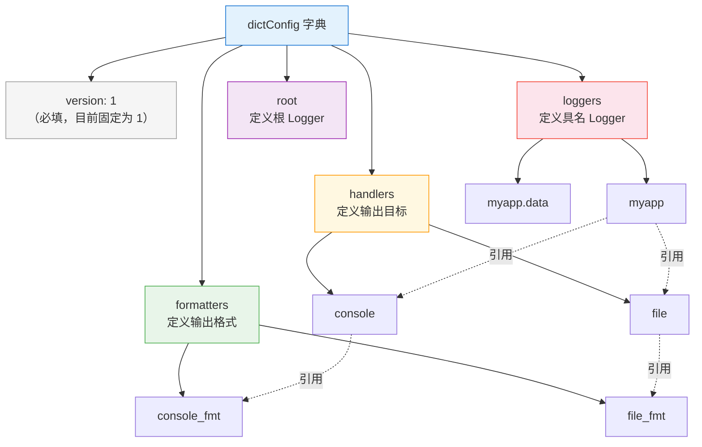
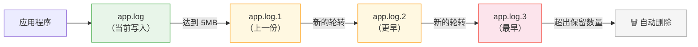

# 日志配置与最佳实践

> **所属路径**：`01_基础能力/01_开发环境与技术英语/06_日期时间与日志/04_日志配置与最佳实践`
> **预计学习时间**：50 分钟
> **难度等级**：⭐⭐⭐

---

## 前置知识

- [logging日志框架](../03_logging日志框架/03_logging日志框架.md)（Logger、Handler、Formatter 的协作关系与层级传播机制）
- [文件操作与IO](../../01_编程语言基础/07_文件操作与IO/07_文件操作与IO.md)（文件读写与路径操作基础）

> 如果以上内容还不熟悉，建议先完成对应课程再继续。

---

## 学习目标

完成本节后，你将能够：

1. 使用 `dictConfig` 从字典配置 logging，实现配置与代码分离
2. 配置 `RotatingFileHandler` 和 `TimedRotatingFileHandler` 实现日志轮转
3. 实现 JSON 格式的结构化日志输出，满足生产环境的机器解析需求
4. 列举并应用日志的最佳实践清单，避免常见的生产事故
5. 为多模块应用设计一套完整的日志方案

---

## 正文讲解

### 1. 从硬编码到外部配置——为什么配置方式很重要

在 **[logging日志框架](../03_logging日志框架/03_logging日志框架.md)** 中，我们学会了用 `basicConfig()` 快速配置日志，也尝试了手动创建 Logger、Handler 和 Formatter 并用代码把它们组装起来。这在小脚本中完全够用，但当你的项目逐渐长大——比如一个包含数据采集、模型训练和 API 服务三个模块的 AI 项目——你会遇到这些困扰：

- **改配置就要改代码**：想把日志级别从 DEBUG 切换到 WARNING ？你得打开源文件、找到 `setLevel()` 那行、改完再重新部署。
- **配置散落各处**：每个模块里都有一段 Handler 创建代码，格式不统一，改一个漏一个。
- **环境差异难管理**：开发环境想看 DEBUG 、生产环境只要 WARNING ，但代码是同一份。

解决思路很简单：**把日志配置从代码中抽出来，放到一个集中的配置结构里**。Python 的 `logging.config` 模块提供了两种外部化配置方案：

| 方案 | 函数 | 配置格式 | 推荐度 |
| ---- | ---- | -------- | ------ |
| 字典配置 | `logging.config.dictConfig()` | Python 字典（可从 JSON/YAML 加载） | ⭐⭐⭐ **推荐** |
| 文件配置 | `logging.config.fileConfig()` | INI / CFG 文件 | ⭐ 老项目兼容 |

`dictConfig` 是 Python 3 推荐的标准方式——它更灵活、更易于和 JSON / YAML 配置文件结合，也更适合现代项目的 CI/CD 流程。接下来我们重点学习它。

### 2. dictConfig——用字典定义整套日志配置

`dictConfig` 的核心思想是：**用一个 Python 字典描述所有 Formatter、Handler、Logger 和 root logger 的关系**，然后一次性应用。

字典的顶层结构如下：



> 📌 **图解说明**：一个 `dictConfig` 字典由 5 个顶层键组成。 `formatters` 定义格式模板， `handlers` 定义输出目标并引用某个 formatter ， `loggers` 定义具名 Logger 并引用若干 handler 。 `root` 是所有 Logger 的兜底配置。所有引用都通过**名称字符串**关联，不需要手动创建对象。

下面是一个完整的 `dictConfig` 示例：

```python
import logging
import logging.config

LOGGING_CONFIG = {
    "version": 1,
    "disable_existing_loggers": False,  # 不禁用已有 Logger

    "formatters": {
        "simple": {
            "format": "%(levelname)-8s %(message)s"
        },
        "detailed": {
            "format": "%(asctime)s %(name)-20s %(levelname)-8s %(message)s",
            "datefmt": "%Y-%m-%d %H:%M:%S"
        },
    },

    "handlers": {
        "console": {
            "class": "logging.StreamHandler",
            "level": "WARNING",
            "formatter": "simple",
            "stream": "ext://sys.stdout",
        },
        "file": {
            "class": "logging.FileHandler",
            "level": "DEBUG",
            "formatter": "detailed",
            "filename": "app.log",
            "encoding": "utf-8",
        },
    },

    "loggers": {
        "myapp": {
            "level": "DEBUG",
            "handlers": ["console", "file"],
            "propagate": False,
        },
    },

    "root": {
        "level": "WARNING",
        "handlers": ["console"],
    },
}

# 一行应用所有配置
logging.config.dictConfig(LOGGING_CONFIG)

# 测试
logger = logging.getLogger("myapp")
logger.debug("调试信息——只出现在文件中")
logger.warning("警告信息——同时出现在终端和文件中")
```

几个关键细节值得注意：

- **`version: 1`** ：目前唯一合法的版本号，必须填写。
- **`disable_existing_loggers: False`** ：默认为 `True` ，会禁用调用 `dictConfig` 前已创建的所有 Logger 。在大多数项目中你应该设为 `False` ，否则第三方库的日志会被意外静默。
- **`"class"` 使用完整类名**：如 `"logging.StreamHandler"` 、 `"logging.FileHandler"` ，也可以用 `"logging.handlers.RotatingFileHandler"` 等扩展 Handler 。
- **`"ext://sys.stdout"`** ：前缀 `ext://` 表示引用一个外部 Python 对象，这里指向标准输出流。
- **`"propagate": False`** ：阻止日志消息向父 Logger（root）传播，避免重复输出。

### 3. 从 JSON/YAML 文件加载配置

把字典写在代码里虽然比 `basicConfig` 好了一大步，但配置仍然和代码混在一起。更好的做法是**把字典存成外部的 JSON 或 YAML 文件**，在程序启动时加载。

#### JSON 配置文件

创建一个 `logging_config.json` ：

```json
{
    "version": 1,
    "disable_existing_loggers": false,
    "formatters": {
        "detailed": {
            "format": "%(asctime)s %(name)s %(levelname)-8s %(message)s",
            "datefmt": "%Y-%m-%d %H:%M:%S"
        }
    },
    "handlers": {
        "console": {
            "class": "logging.StreamHandler",
            "level": "INFO",
            "formatter": "detailed",
            "stream": "ext://sys.stdout"
        }
    },
    "root": {
        "level": "INFO",
        "handlers": ["console"]
    }
}
```

在代码中加载：

```python
import json
import logging.config

with open("logging_config.json", "r", encoding="utf-8") as f:
    config = json.load(f)

logging.config.dictConfig(config)
logger = logging.getLogger(__name__)
logger.info("从 JSON 文件加载的日志配置生效了")
```

这样，运维人员可以在不碰代码的情况下，直接修改 JSON 文件来调整日志级别或输出目标——这在生产环境中非常实用。

#### YAML 配置文件（可选）

如果你的项目已经在使用 YAML（如 Docker Compose 或 Kubernetes 配置），也可以用 YAML 格式，但需要安装 `pyyaml` 库：

```python
import yaml
import logging.config

with open("logging_config.yaml", "r", encoding="utf-8") as f:
    config = yaml.safe_load(f)

logging.config.dictConfig(config)
```

> 💡 **提示**：JSON 是 Python 标准库自带的，无需额外安装；YAML 需要第三方库。如果没有特别理由，推荐使用 JSON 。

### 4. 日志轮转——别让日志文件撑爆磁盘

在前置课程中我们使用了 `FileHandler` 把日志写入文件。但有一个隐患：随着程序持续运行，日志文件会不断增长。一个训练 3 天的深度学习模型，每秒记录一条日志，光日志文件就可能膨胀到几个 GB 。如果磁盘被日志撑满，训练进程可能因为无法写入检查点而崩溃——这在 AI 工程中是一个真实的痛点。

**日志轮转（Log Rotation）** 的思路很简单：当日志文件达到一定条件时（文件大小或时间间隔），自动"切割"成新文件，旧文件按编号或日期保留若干份，超出数量的最旧文件自动删除。



> 📌 **图解说明**：应用程序始终向 `app.log` 写入。当文件达到 5MB ，当前文件被重命名为 `app.log.1` ，程序开始写入新的 `app.log` 。之前的 `.1` 变成 `.2` ，依此类推。超出保留数量（这里是 3 份）的最旧文件被自动删除。

#### 按大小轮转：RotatingFileHandler

`RotatingFileHandler` 在文件达到指定大小时进行轮转：

```python
import logging
from logging.handlers import RotatingFileHandler

handler = RotatingFileHandler(
    filename="app.log",
    maxBytes=5 * 1024 * 1024,  # 5MB
    backupCount=3,             # 保留 3 个备份文件
    encoding="utf-8",
)
handler.setFormatter(logging.Formatter(
    "%(asctime)s %(name)s %(levelname)-8s %(message)s"
))

logger = logging.getLogger("myapp")
logger.setLevel(logging.DEBUG)
logger.addHandler(handler)
```

运行后，磁盘上最多会有 4 个文件：`app.log` （当前） + `app.log.1` 、 `app.log.2` 、 `app.log.3` （备份）。总占用不超过 20MB 。

#### 按时间轮转：TimedRotatingFileHandler

`TimedRotatingFileHandler` 按时间间隔轮转，适合按天或按小时归档日志：

```python
import logging
from logging.handlers import TimedRotatingFileHandler

handler = TimedRotatingFileHandler(
    filename="app.log",
    when="midnight",   # 每天午夜轮转
    interval=1,        # 间隔 1 天
    backupCount=7,     # 保留最近 7 天的日志
    encoding="utf-8",
)
handler.suffix = "%Y-%m-%d"  # 备份文件后缀格式

handler.setFormatter(logging.Formatter(
    "%(asctime)s %(name)s %(levelname)-8s %(message)s"
))

logger = logging.getLogger("myapp")
logger.setLevel(logging.DEBUG)
logger.addHandler(handler)
```

`when` 参数支持的常用值：

| `when` 值 | 轮转时机 | 典型场景 |
| ---------- | -------- | -------- |
| `"S"` | 每秒 | 测试用 |
| `"M"` | 每分钟 | 测试用 |
| `"H"` | 每小时 | 高流量服务 |
| `"midnight"` | 每天午夜 | 最常用 |
| `"W0"` – `"W6"` | 每周某天（0=周一） | 低流量任务 |

#### 在 dictConfig 中配置轮转

更推荐的方式是把轮转 Handler 写进 `dictConfig` 字典：

```python
LOGGING_CONFIG = {
    "version": 1,
    "disable_existing_loggers": False,
    "formatters": {
        "detailed": {
            "format": "%(asctime)s %(name)s %(levelname)-8s %(message)s",
            "datefmt": "%Y-%m-%d %H:%M:%S",
        }
    },
    "handlers": {
        "rotating_file": {
            "class": "logging.handlers.RotatingFileHandler",
            "level": "DEBUG",
            "formatter": "detailed",
            "filename": "app.log",
            "maxBytes": 5242880,   # 5MB
            "backupCount": 3,
            "encoding": "utf-8",
        }
    },
    "root": {
        "level": "DEBUG",
        "handlers": ["rotating_file"],
    }
}
```

### 5. 结构化日志——让机器也能读懂日志

传统的日志格式是人类友好的文本行：

```
2025-07-14 10:30:00 myapp WARNING 磁盘空间不足 20%
```

对人来说很直观，但对机器来说，要从这行文本中提取"时间"、"模块"、"级别"和"消息"，就需要编写正则表达式——这既脆弱又容易出错。

**结构化日志（Structured Logging）** 的核心思想是：**用 JSON 等结构化格式输出每条日志**，让日志聚合工具（如 ELK Stack 、 Grafana Loki 、 CloudWatch）可以直接解析和检索。

```json
{"timestamp": "2025-07-14T10:30:00", "name": "myapp", "level": "WARNING", "message": "磁盘空间不足", "disk_usage_pct": 80}
```

#### 自定义 JSON Formatter

我们可以通过继承 `logging.Formatter` 来实现 JSON 格式输出，不需要安装任何第三方库：

```python
import json
import logging
from datetime import datetime, timezone


class JsonFormatter(logging.Formatter):
    """将日志记录格式化为 JSON 字符串"""

    def format(self, record: logging.LogRecord) -> str:
        log_data = {
            "timestamp": datetime.fromtimestamp(
                record.created, tz=timezone.utc
            ).isoformat(),
            "name": record.name,
            "level": record.levelname,
            "message": record.getMessage(),
            "module": record.module,
            "function": record.funcName,
            "line": record.lineno,
        }
        # 如果有异常信息，加入堆栈
        if record.exc_info and record.exc_info[0] is not None:
            log_data["exception"] = self.formatException(record.exc_info)
        # 合并通过 extra 传入的自定义字段
        if hasattr(record, "extra_fields"):
            log_data.update(record.extra_fields)
        return json.dumps(log_data, ensure_ascii=False)
```

使用方式：

```python
handler = logging.StreamHandler()
handler.setFormatter(JsonFormatter())

logger = logging.getLogger("myapp")
logger.setLevel(logging.DEBUG)
logger.addHandler(handler)

logger.info("模型训练开始")
logger.warning("GPU 显存占用较高", extra={"extra_fields": {"gpu_mem_pct": 92}})
```

**预期输出**（每条日志一行 JSON）：

```json
{"timestamp": "2025-07-14T02:30:00+00:00", "name": "myapp", "level": "INFO", "message": "模型训练开始", "module": "train", "function": "<module>", "line": 12}
{"timestamp": "2025-07-14T02:30:00+00:00", "name": "myapp", "level": "WARNING", "message": "GPU 显存占用较高", "module": "train", "function": "<module>", "line": 13, "gpu_mem_pct": 92}
```

> 💡 **提示**：生产环境中也可以使用第三方库 `python-json-logger` ，它提供了更完善的 JSON 格式化支持，但核心原理与上面的自定义实现一致。

#### 在 dictConfig 中使用自定义 Formatter

`dictConfig` 支持通过 `"()"` 键指定自定义 Formatter 类：

```python
LOGGING_CONFIG = {
    "version": 1,
    "disable_existing_loggers": False,
    "formatters": {
        "json": {
            "()": "myapp.logging_utils.JsonFormatter",  # 指向自定义类
        }
    },
    "handlers": {
        "console": {
            "class": "logging.StreamHandler",
            "formatter": "json",
            "stream": "ext://sys.stdout",
        }
    },
    "root": {
        "level": "INFO",
        "handlers": ["console"],
    }
}
```

`"()"` 是一个特殊键，它告诉 `dictConfig` ："这个 Formatter 不是用标准的 `logging.Formatter` 构造的，而是用我指定的工厂函数/类来创建。"

### 6. 多模块应用的日志设计

在实际的 AI 项目中，你的代码通常分散在多个模块里：

```
myproject/
├── main.py           # 入口
├── data/
│   ├── loader.py     # 数据加载
│   └── cleaner.py    # 数据清洗
├── model/
│   ├── train.py      # 模型训练
│   └── evaluate.py   # 模型评估
└── utils/
    └── logger_setup.py  # 日志配置（集中管理）
```

正确的做法是遵循**"配置集中在入口，使用分散在各处"**的原则：

**规则一：每个模块用 `__name__` 创建自己的 Logger 。**

```python
# data/loader.py
import logging

logger = logging.getLogger(__name__)  # -> "myproject.data.loader"

def load_data(path):
    logger.info(f"加载数据: {path}")
    # ...
```

```python
# model/train.py
import logging

logger = logging.getLogger(__name__)  # -> "myproject.model.train"

def train(config):
    logger.info(f"开始训练，学习率: {config['lr']}")
    # ...
```

**规则二：只在程序入口（`main.py`）配置一次 `dictConfig` 。**

```python
# main.py
import logging.config
from data.loader import load_data
from model.train import train

LOGGING_CONFIG = {
    "version": 1,
    "disable_existing_loggers": False,
    "formatters": {
        "standard": {
            "format": "%(asctime)s %(name)-30s %(levelname)-8s %(message)s"
        }
    },
    "handlers": {
        "console": {
            "class": "logging.StreamHandler",
            "level": "INFO",
            "formatter": "standard",
        },
        "file": {
            "class": "logging.handlers.RotatingFileHandler",
            "level": "DEBUG",
            "formatter": "standard",
            "filename": "project.log",
            "maxBytes": 10485760,
            "backupCount": 5,
            "encoding": "utf-8",
        },
    },
    "loggers": {
        "myproject": {
            "level": "DEBUG",
            "handlers": ["console", "file"],
            "propagate": False,
        }
    },
    "root": {
        "level": "WARNING",
        "handlers": ["console"],
    }
}

logging.config.dictConfig(LOGGING_CONFIG)

# 因为 loader.py 的 logger 名是 "myproject.data.loader"，
# 它是 "myproject" 的子 Logger，会自动继承 "myproject" 的 Handler 配置
load_data("train.csv")
train({"lr": 0.001})
```

**为什么这样设计有效？** 因为 logging 模块的 Logger 是按 **`.` 分隔的层级结构** 组织的—— `"myproject.data.loader"` 是 `"myproject.data"` 的子 Logger ，后者又是 `"myproject"` 的子 Logger 。子 Logger 在没有自己的 Handler 时，会把消息向上传播给父 Logger 处理。所以你只需要配置 `"myproject"` 这个顶层 Logger ，它下面所有子模块的日志都会自动按照统一的格式和目标输出。

### 7. 最佳实践清单

下面这份清单总结了 Python 日志在真实项目中最重要的实践经验。建议打印出来贴在显示器旁边：

| # | 实践 | 说明 |
| --- | ---- | ---- |
| 1 | **用 `__name__` 命名 Logger** | 自动反映模块层级，方便定位问题来源 |
| 2 | **库代码只创建 Logger ，不配置 Handler** | 让应用层决定日志输出方式，库只负责 `getLogger(__name__)` |
| 3 | **使用合适的日志级别** | DEBUG 给开发者看，INFO 给运维看，WARNING 给值班看，ERROR/CRITICAL 给告警系统看 |
| 4 | **日志中包含上下文信息** | 添加请求 ID 、用户 ID 、批次号等，方便在海量日志中追踪单个请求 |
| 5 | **绝不记录敏感信息** | 密码、API 密钥、用户隐私数据不得出现在日志中 |
| 6 | **生产环境必须配置日志轮转** | 使用 `RotatingFileHandler` 或 `TimedRotatingFileHandler` ，避免磁盘爆满 |
| 7 | **生产环境推荐结构化日志** | JSON 格式便于日志聚合系统解析，大幅提升排查效率 |
| 8 | **用 `logger.exception()` 记录异常** | 在 `except` 块中调用，自动附带完整的堆栈信息 |
| 9 | **不要在热循环中打日志** | 每秒执行百万次的内层循环里的 `logger.debug()` 会严重拖慢性能 |
| 10 | **`disable_existing_loggers` 设为 `False`** | 避免意外静默第三方库的日志输出 |

#### 库代码 vs 应用代码的日志模式

这个区分至关重要，值得单独强调：

```python
# ✅ 库代码（给别人用的模块）——只创建 Logger，不加 Handler
import logging
logger = logging.getLogger(__name__)

def my_lib_function():
    logger.debug("库内部的调试信息")
```

```python
# ✅ 应用代码（你自己的入口）——负责配置 Handler
import logging.config
logging.config.dictConfig(LOGGING_CONFIG)  # 在这里统一配置
```

如果库代码自行添加了 Handler ，使用这个库的人就会看到不受控的日志输出——这是一个常见的设计错误。

### 8. 与 AI/ML 工程的连接

在 AI 和机器学习工程中，日志系统承担着比一般 Web 应用更重的任务：

- **训练过程监控**：每个 epoch 的 loss 、accuracy 、learning rate 等指标都需要记录，以便发现训练异常（如 loss 突然增大、梯度爆炸等）。
- **实验可追溯性**：哪个配置组合产生了最好的结果？日志是实验记录的第一道防线。后续你将在 **[实验管理](../../../../03_工程落地/01_人工智能工程化与部署/02_实验管理/)** 中学习更专业的实验追踪工具（如 MLflow 、Weights & Biases），但它们的底层仍然依赖日志机制。
- **数据管道调试**：数据清洗过程中，哪些记录被丢弃了？为什么？结构化日志可以帮你快速定位 **[数据清洗](../../../../01_基础能力/05_数据能力/02_数据清洗/)** 中的问题。
- **模型服务排查**：线上推理服务出了问题，请求 ID 和响应时间的日志是唯一的线索。

一个简单的训练日志示例：

```python
import logging

logger = logging.getLogger("myproject.train")

def log_epoch(epoch, loss, accuracy, lr):
    """记录每个 epoch 的训练指标"""
    logger.info(
        "训练进度",
        extra={"extra_fields": {
            "epoch": epoch,
            "loss": round(loss, 4),
            "accuracy": round(accuracy, 4),
            "learning_rate": lr,
        }}
    )
```

配合前面的 `JsonFormatter` ，输出的每条日志都是结构化的 JSON ，后续可以直接导入到可视化工具中分析训练曲线。

---

## 动手实践

> 下面我们把本课学到的所有技术整合起来，为一个多模块应用搭建一套完整的日志系统：dictConfig 集中配置 + 轮转文件 Handler + 结构化 JSON 输出。

```python
# 文件：code/logging_practice.py
# 环境要求：Python 3.10+（无需第三方库）

import json
import logging
import logging.config
from datetime import datetime, timezone


# === 第一部分：自定义 JSON Formatter ===

class JsonFormatter(logging.Formatter):
    """将日志记录格式化为 JSON 字符串"""

    def format(self, record: logging.LogRecord) -> str:
        log_data = {
            "timestamp": datetime.fromtimestamp(
                record.created, tz=timezone.utc
            ).isoformat(),
            "name": record.name,
            "level": record.levelname,
            "message": record.getMessage(),
            "module": record.module,
            "line": record.lineno,
        }
        if record.exc_info and record.exc_info[0] is not None:
            log_data["exception"] = self.formatException(record.exc_info)
        if hasattr(record, "extra_fields"):
            log_data.update(record.extra_fields)
        return json.dumps(log_data, ensure_ascii=False)


# === 第二部分：dictConfig 配置 ===
# 注意：因为 JsonFormatter 定义在本文件中，
# dictConfig 使用 "()" 引用时需要对应模块路径。
# 这里我们先手动创建 Formatter 再注入。

LOGGING_CONFIG = {
    "version": 1,
    "disable_existing_loggers": False,
    "formatters": {
        "console_fmt": {
            "format": "%(asctime)s %(name)-25s %(levelname)-8s %(message)s",
            "datefmt": "%H:%M:%S",
        },
        # JSON formatter 将在 dictConfig 之后手动设置
    },
    "handlers": {
        "console": {
            "class": "logging.StreamHandler",
            "level": "INFO",
            "formatter": "console_fmt",
            "stream": "ext://sys.stdout",
        },
        "rotating_file": {
            "class": "logging.handlers.RotatingFileHandler",
            "level": "DEBUG",
            "formatter": "console_fmt",  # 先用文本格式占位
            "filename": "app_practice.log",
            "maxBytes": 1048576,     # 1MB（演示用，生产中建议 5-50MB）
            "backupCount": 3,
            "encoding": "utf-8",
        },
    },
    "loggers": {
        "myapp": {
            "level": "DEBUG",
            "handlers": ["console", "rotating_file"],
            "propagate": False,
        },
    },
    "root": {
        "level": "WARNING",
        "handlers": ["console"],
    },
}


def setup_logging():
    """初始化日志配置"""
    logging.config.dictConfig(LOGGING_CONFIG)
    # 为文件 Handler 设置 JSON Formatter
    rotating_handler = logging.getLogger("myapp").handlers[1]
    rotating_handler.setFormatter(JsonFormatter())
    print("✅ 日志系统初始化完成\n")


# === 第三部分：模拟多模块使用 ===

def simulate_data_loader():
    """模拟数据加载模块"""
    logger = logging.getLogger("myapp.data.loader")
    logger.info("开始加载训练数据")
    logger.debug("数据路径: /data/train.csv")
    logger.info("加载完成，共 10000 条记录")


def simulate_model_training():
    """模拟模型训练模块"""
    logger = logging.getLogger("myapp.model.train")
    for epoch in range(1, 4):
        loss = 2.5 / epoch
        acc = 0.6 + epoch * 0.1
        logger.info(
            f"Epoch {epoch} 完成",
            extra={"extra_fields": {
                "epoch": epoch,
                "loss": round(loss, 4),
                "accuracy": round(acc, 4),
            }}
        )
    logger.warning("GPU 温度较高，建议检查散热")


def simulate_error_scenario():
    """模拟异常场景"""
    logger = logging.getLogger("myapp.service")
    try:
        result = 1 / 0
    except ZeroDivisionError:
        logger.exception("推理服务发生异常")


# === 第四部分：运行 ===

if __name__ == "__main__":
    setup_logging()
    simulate_data_loader()
    print()  # 空行分隔
    simulate_model_training()
    print()
    simulate_error_scenario()
    print(f"\n📄 结构化日志已写入 app_practice.log")
```

**运行命令**：

```bash
python code/logging_practice.py
```

**预期输出**（控制台，使用人类友好的文本格式）：

```
✅ 日志系统初始化完成

10:30:00 myapp.data.loader         INFO     开始加载训练数据
10:30:00 myapp.data.loader         INFO     加载完成，共 10000 条记录

10:30:00 myapp.model.train         INFO     Epoch 1 完成
10:30:00 myapp.model.train         INFO     Epoch 2 完成
10:30:00 myapp.model.train         INFO     Epoch 3 完成
10:30:00 myapp.model.train         WARNING  GPU 温度较高，建议检查散热

10:30:00 myapp.service             ERROR    推理服务发生异常
Traceback (most recent call last):
  File "...", line ..., in simulate_error_scenario
    result = 1 / 0
ZeroDivisionError: division by zero
```

同时，`app_practice.log` 中的每条日志都是一行 JSON ，方便机器解析：

```json
{"timestamp": "2025-07-14T02:30:00+00:00", "name": "myapp.data.loader", "level": "DEBUG", "message": "数据路径: /data/train.csv", "module": "logging_practice", "line": 83}
{"timestamp": "2025-07-14T02:30:00+00:00", "name": "myapp.model.train", "level": "INFO", "message": "Epoch 1 完成", "module": "logging_practice", "line": 95, "epoch": 1, "loss": 2.5, "accuracy": 0.7}
```

注意终端只显示 INFO 及以上的消息（因为 console Handler 的级别是 INFO ），而文件中包含所有 DEBUG 级别的消息——这正是我们想要的：**终端看关键信息，文件存完整记录**。

---

## 典型误区

| 误区 | 正确理解 |
| ---- | -------- |
| "每个模块都调用 `dictConfig` 配置一遍日志" | ❌ `dictConfig` 应该只在程序入口调用一次。各模块只需 `getLogger(__name__)` ，由 Logger 层级自动继承配置 |
| "`disable_existing_loggers` 用默认值就好" | ❌ 默认值是 `True` ，会静默掉第三方库的日志。应显式设为 `False` |
| "日志文件不需要轮转，磁盘够大" | ❌ 再大的磁盘也经不住长期运行的日志积累。设置轮转是基本的工程素养 |
| "结构化日志太麻烦，文本格式够用" | 小项目可以，但一旦日志量超过手动阅读的能力（通常在几百 MB 以上），没有结构化格式的日志几乎无法有效检索 |
| "在库代码中添加 `StreamHandler` 方便调试" | ❌ 库代码添加 Handler 会导致使用方看到不受控的输出。库只创建 Logger ，Handler 由应用层负责 |

---

## 练习题

### 练习 1：dictConfig 环境切换（难度：⭐⭐）

编写两份 `dictConfig` 字典—— `DEV_CONFIG` 和 `PROD_CONFIG` ：

- **DEV_CONFIG**：root Logger 级别为 DEBUG ，只有一个 StreamHandler 输出到终端，格式包含时间、模块名、级别和消息。
- **PROD_CONFIG**：root Logger 级别为 WARNING ，包含一个 RotatingFileHandler（ 5MB 轮转，保留 3 份备份）和一个 StreamHandler（级别 ERROR ）。

编写一个函数 `setup_logging(env: str)` ，根据传入的 `"dev"` 或 `"prod"` 应用对应的配置。测试两种模式下，同样 5 条日志（每个级别各一条）的输出差异。

<details>
<summary>💡 提示</summary>

两份配置字典的结构完全相同，只是值不同。 `setup_logging` 函数内部用 `if/else` 选择字典，然后调用 `logging.config.dictConfig()` 即可。

</details>

<details>
<summary>✅ 参考答案</summary>

```python
import logging
import logging.config

DEV_CONFIG = {
    "version": 1,
    "disable_existing_loggers": False,
    "formatters": {
        "verbose": {
            "format": "%(asctime)s %(name)s %(levelname)-8s %(message)s",
            "datefmt": "%H:%M:%S",
        }
    },
    "handlers": {
        "console": {
            "class": "logging.StreamHandler",
            "level": "DEBUG",
            "formatter": "verbose",
            "stream": "ext://sys.stdout",
        }
    },
    "root": {
        "level": "DEBUG",
        "handlers": ["console"],
    },
}

PROD_CONFIG = {
    "version": 1,
    "disable_existing_loggers": False,
    "formatters": {
        "verbose": {
            "format": "%(asctime)s %(name)s %(levelname)-8s %(message)s",
            "datefmt": "%Y-%m-%d %H:%M:%S",
        }
    },
    "handlers": {
        "console": {
            "class": "logging.StreamHandler",
            "level": "ERROR",
            "formatter": "verbose",
            "stream": "ext://sys.stderr",
        },
        "file": {
            "class": "logging.handlers.RotatingFileHandler",
            "level": "WARNING",
            "formatter": "verbose",
            "filename": "prod.log",
            "maxBytes": 5242880,
            "backupCount": 3,
            "encoding": "utf-8",
        },
    },
    "root": {
        "level": "WARNING",
        "handlers": ["console", "file"],
    },
}


def setup_logging(env: str):
    config = DEV_CONFIG if env == "dev" else PROD_CONFIG
    logging.config.dictConfig(config)


# 测试
setup_logging("dev")
logger = logging.getLogger("test")
logger.debug("调试信息")
logger.info("普通信息")
logger.warning("警告信息")
logger.error("错误信息")
logger.critical("严重错误")

# DEV 模式：终端输出全部 5 条
# PROD 模式：终端只输出 ERROR 和 CRITICAL ；
# prod.log 文件中记录 WARNING、ERROR、CRITICAL
```

</details>

### 练习 2：自定义 JSON Formatter（难度：⭐⭐⭐）

基于正文中的 `JsonFormatter` ，扩展一个 `TrainingJsonFormatter` ，要求：

1. 在每条日志中自动添加 `"hostname"` 字段（使用 `socket.gethostname()` 获取）
2. 在每条日志中自动添加 `"pid"` 字段（使用 `os.getpid()` 获取进程 ID）
3. 如果日志 `extra` 中包含 `"epoch"` 字段，自动将它提升到 JSON 顶层

用这个 Formatter 模拟记录 3 个 epoch 的训练日志，验证输出的 JSON 中包含 `hostname` 、 `pid` 和 `epoch` 字段。

<details>
<summary>💡 提示</summary>

继承 `JsonFormatter` ，在 `format` 方法中先调用父类构造 `log_data` 字典，再往里添加 `hostname` 和 `pid` 。也可以直接重写 `format` 方法。 `socket.gethostname()` 建议在 `__init__` 中调用一次并缓存，避免每条日志都做系统调用。

</details>

<details>
<summary>✅ 参考答案</summary>

```python
import json
import logging
import os
import socket
from datetime import datetime, timezone


class TrainingJsonFormatter(logging.Formatter):
    """带主机名和进程 ID 的训练日志 Formatter"""

    def __init__(self):
        super().__init__()
        self._hostname = socket.gethostname()

    def format(self, record: logging.LogRecord) -> str:
        log_data = {
            "timestamp": datetime.fromtimestamp(
                record.created, tz=timezone.utc
            ).isoformat(),
            "hostname": self._hostname,
            "pid": os.getpid(),
            "name": record.name,
            "level": record.levelname,
            "message": record.getMessage(),
        }
        if hasattr(record, "extra_fields"):
            extras = record.extra_fields
            if "epoch" in extras:
                log_data["epoch"] = extras.pop("epoch")
            log_data.update(extras)
        return json.dumps(log_data, ensure_ascii=False)


# 测试
handler = logging.StreamHandler()
handler.setFormatter(TrainingJsonFormatter())

logger = logging.getLogger("train_test")
logger.setLevel(logging.DEBUG)
logger.handlers.clear()
logger.addHandler(handler)

for epoch in range(1, 4):
    logger.info(
        f"Epoch {epoch} 完成",
        extra={"extra_fields": {
            "epoch": epoch,
            "loss": round(2.0 / epoch, 4),
            "accuracy": round(0.5 + epoch * 0.15, 4),
        }}
    )
```

**预期输出**（每行一条 JSON ，已格式化展示）：

```json
{"timestamp": "...", "hostname": "your-host", "pid": 12345, "name": "train_test", "level": "INFO", "message": "Epoch 1 完成", "epoch": 1, "loss": 2.0, "accuracy": 0.65}
{"timestamp": "...", "hostname": "your-host", "pid": 12345, "name": "train_test", "level": "INFO", "message": "Epoch 2 完成", "epoch": 2, "loss": 1.0, "accuracy": 0.8}
{"timestamp": "...", "hostname": "your-host", "pid": 12345, "name": "train_test", "level": "INFO", "message": "Epoch 3 完成", "epoch": 3, "loss": 0.6667, "accuracy": 0.95}
```

每条日志都自动包含了 `hostname` 和 `pid` ，且 `epoch` 被提升到 JSON 顶层，方便日志聚合系统按 epoch 检索。

</details>

### 练习 3：排查日志重复输出（难度：⭐⭐）

运行以下代码，控制台出现了重复的日志输出。找出原因并修复：

```python
import logging

logging.basicConfig(level=logging.INFO, format="ROOT: %(message)s", force=True)

logger = logging.getLogger("myapp")
logger.setLevel(logging.DEBUG)

handler = logging.StreamHandler()
handler.setFormatter(logging.Formatter("MYAPP: %(message)s"))
logger.addHandler(handler)

logger.warning("这条消息出现了几次？")
```

<details>
<summary>💡 提示</summary>

想想 Logger 的层级传播机制：子 Logger 处理完消息后，会把消息向上传播给父 Logger 。 `"myapp"` 的父 Logger 是谁？

</details>

<details>
<summary>✅ 参考答案</summary>

**原因**：`"myapp"` Logger 自己有一个 StreamHandler ，输出 `"MYAPP: ..."` ；同时由于 `propagate` 默认为 `True` ，消息还会传播到 root Logger ，root Logger 的 StreamHandler 又输出了一遍 `"ROOT: ..."` 。所以同一条消息出现了两次。

**修复方案**：在子 Logger 上设置 `propagate = False` ：

```python
import logging

logging.basicConfig(level=logging.INFO, format="ROOT: %(message)s", force=True)

logger = logging.getLogger("myapp")
logger.setLevel(logging.DEBUG)
logger.propagate = False  # ← 修复：阻止向 root 传播

handler = logging.StreamHandler()
handler.setFormatter(logging.Formatter("MYAPP: %(message)s"))
logger.addHandler(handler)

logger.warning("这条消息现在只出现一次了")
```

修复后只输出：`MYAPP: 这条消息现在只出现一次了`

</details>

---

## 下一步学习

- 📖 下一个主题模块：[并发编程](../../07_并发编程/)
- 🔗 相关知识点：[实验管理](../../../../03_工程落地/01_人工智能工程化与部署/02_实验管理/)（日志与实验追踪的结合）
- 🔗 相关知识点：[日志与异常](../../11_调试/02_日志与异常/)（调试中的日志使用技巧）
- 🔗 相关知识点：[监控](../../../../03_工程落地/01_人工智能工程化与部署/10_监控/)（生产环境日志监控与告警）

---

## 参考资料

1. [logging.config — Logging configuration](https://docs.python.org/3/library/logging.config.html) — Python 官方文档，`dictConfig` 和 `fileConfig` 的完整 API 参考
2. [Logging Cookbook](https://docs.python.org/3/howto/logging-cookbook.html) — Python 官方进阶示例集，包含日志轮转、网络日志、多进程日志等实用场景
3. [logging.handlers — Logging handlers](https://docs.python.org/3/library/logging.handlers.html) — Python 官方文档，`RotatingFileHandler` 、 `TimedRotatingFileHandler` 等 Handler 的详细说明
