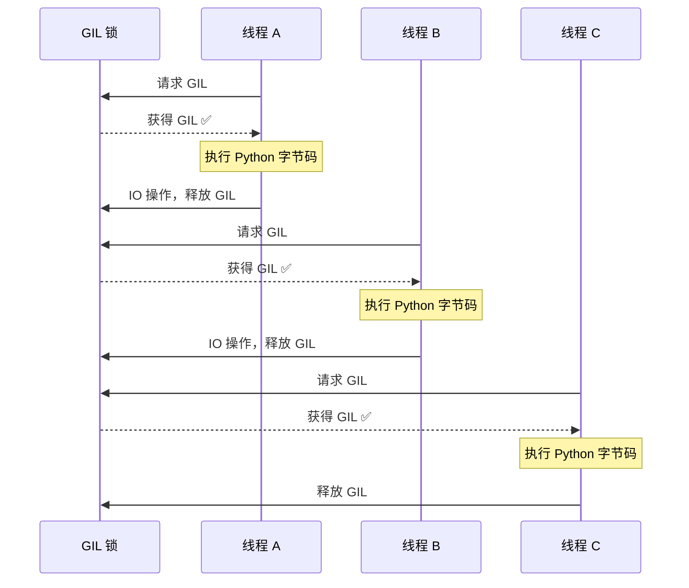
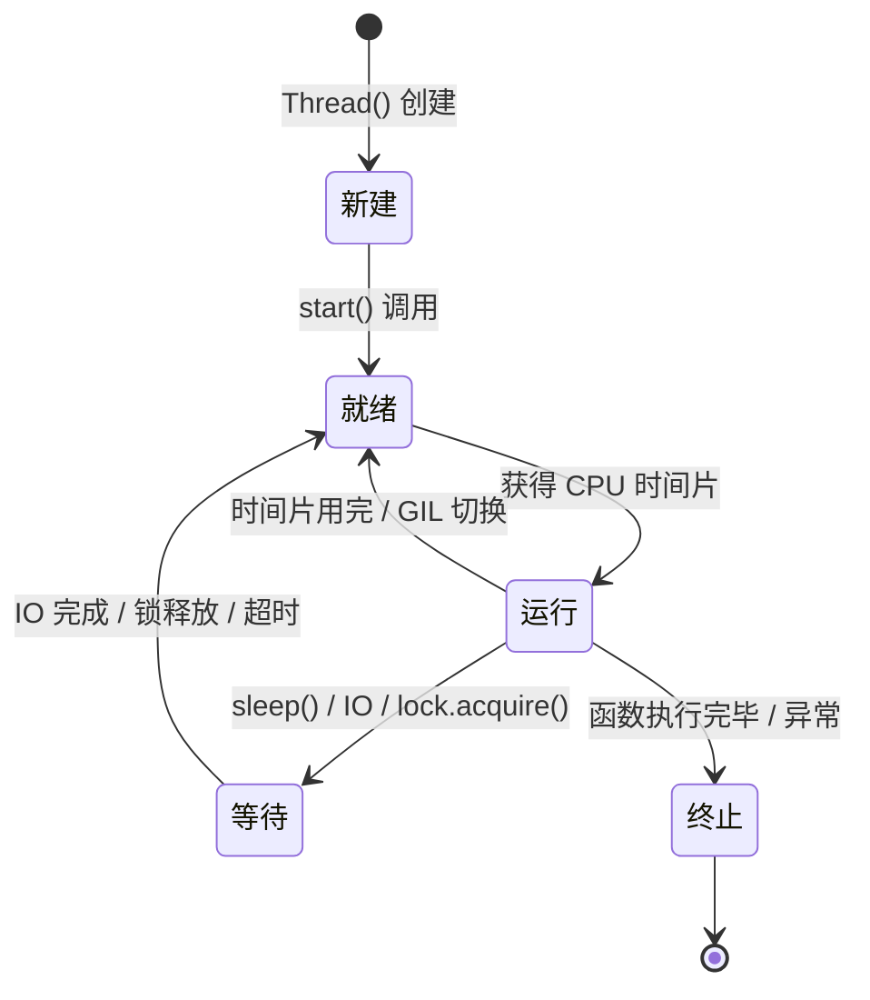
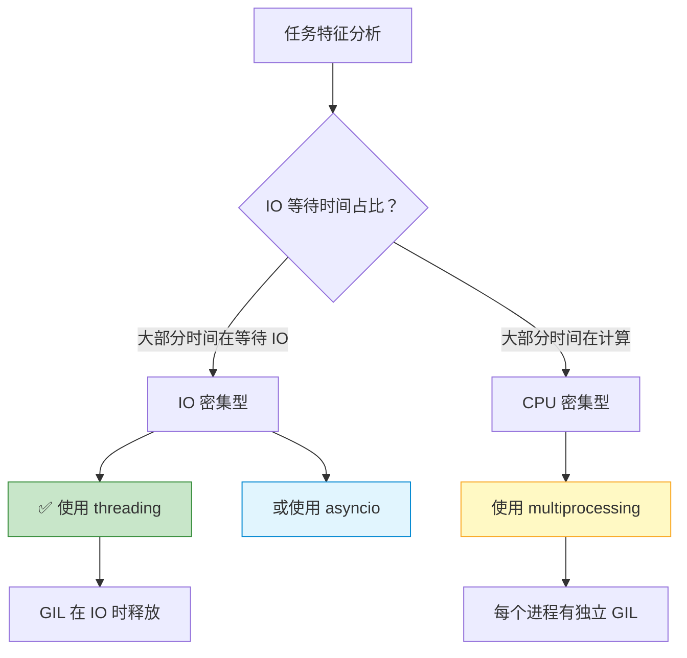

# 多线程与GIL

> **所属路径**：`01_基础能力/01_开发环境与技术英语/07_并发编程/01_多线程与GIL`
> **预计学习时间**：60 分钟
> **难度等级**：⭐⭐

---

## 前置知识

- [函数与模块](../../01_编程语言基础/03_函数与模块/03_函数与模块.md)（理解函数定义、参数传递和模块导入）
- [异常处理](../../01_编程语言基础/05_异常处理/05_异常处理.md)（理解 try/except 机制，线程中需要妥善处理异常）
- [进程与线程](../../../03_编程与计算机基础/04_操作系统/01_进程与线程/)（了解操作系统中进程与线程的基本概念）

> 如果以上内容还不熟悉，建议先完成对应课程再继续。

---

## 学习目标

完成本节后，你将能够：

1. 解释并发（Concurrency）和并行（Parallelism）的区别
2. 使用 `threading` 模块创建和管理线程
3. 解释 GIL 是什么，以及它如何影响 Python 多线程的性能
4. 使用同步原语（Lock、RLock、Event、Semaphore）避免竞态条件
5. 判断多线程在 Python 中的适用场景和不适用场景

---

## 正文讲解

### 1. 并发与并行的区别

想象你走进一家小餐馆。厨房里只有一个厨师，但他同时接了三桌客人的订单。他的做法是：先把第一桌的汤放到炉子上煮着，趁等待的时候去切第二桌的菜，然后再去翻第三桌的炒锅。虽然只有一个人，但三桌的菜都在"同时"推进——这就是 **并发（Concurrency）** 。

现在假设厨房又来了两个厨师，三个人各负责一桌，真正同时在操作——这就是 **并行（Parallelism）** 。

这两个概念在编程中非常关键：

- **并发** ：多个任务在时间上交替推进，可以在单个 CPU 核心上实现。关键在于任务之间的切换和调度。
- **并行** ：多个任务在物理上同时执行，需要多个 CPU 核心。

```mermaid
gantt
    title 并发（单核交替执行）
    dateFormat X
    axisFormat %s
    section 线程 A
    执行 A1   :a1, 0, 2
    等待 IO    :crit, a2, 2, 4
    执行 A2   :a3, 6, 8
    section 线程 B
    等待       :crit, b0, 0, 2
    执行 B1   :b1, 2, 4
    等待 IO    :crit, b2, 4, 6
    section 线程 C
    等待       :crit, c0, 0, 4
    执行 C1   :c1, 4, 6
    执行 C2   :c2, 8, 10
```



> 📌 **图解说明**：在并发模式下，同一时刻只有一个线程在执行 Python 代码（就像只有一个厨师），但通过在 IO 等待时切换到其他线程，整体效率仍然很高。

对于 Python 来说，由于 **全局解释器锁（Global Interpreter Lock, GIL）** 的存在，多线程在 CPython 中实际上是并发而非并行——稍后我们会详细解释这一点。

### 2. Python 多线程快速入门

Python 标准库提供了 `threading` 模块来创建和管理线程。最基本的用法只需要三步：创建线程对象、启动线程、等待线程完成。

我们先看一个最简单的例子——模拟同时下载多个文件：

```python
# 文件：code/basic_threading.py
# 环境要求：Python 3.10+（仅使用标准库）
import threading
import time


def download_file(filename: str, seconds: float) -> None:
    """模拟下载文件（用 sleep 代替真正的网络请求）"""
    print(f"[开始] 下载 {filename}...")
    time.sleep(seconds)  # 模拟 IO 等待
    print(f"[完成] {filename} 下载完毕（耗时 {seconds}s）")


# --- 串行下载 ---
print("=" * 40)
print("串行下载：")
start = time.time()

download_file("data.csv", 2)
download_file("model.pkl", 3)
download_file("config.json", 1)

serial_time = time.time() - start
print(f"串行总耗时：{serial_time:.1f}s\n")

# --- 多线程下载 ---
print("=" * 40)
print("多线程下载：")
start = time.time()

# 创建线程
t1 = threading.Thread(target=download_file, args=("data.csv", 2))
t2 = threading.Thread(target=download_file, args=("model.pkl", 3))
t3 = threading.Thread(target=download_file, args=("config.json", 1))

# 启动线程
t1.start()
t2.start()
t3.start()

# 等待所有线程完成
t1.join()
t2.join()
t3.join()

concurrent_time = time.time() - start
print(f"多线程总耗时：{concurrent_time:.1f}s")
print(f"加速比：{serial_time / concurrent_time:.1f}x")
```

**运行说明**：
- 环境要求：Python 3.10+
- 运行命令：`python code/basic_threading.py`

**预期输出**：
```
========================================
串行下载：
[开始] 下载 data.csv...
[完成] data.csv 下载完毕（耗时 2s）
[开始] 下载 model.pkl...
[完成] model.pkl 下载完毕（耗时 3s）
[开始] 下载 config.json...
[完成] config.json 下载完毕（耗时 1s）
串行总耗时：6.0s

========================================
多线程下载：
[开始] 下载 data.csv...
[开始] 下载 model.pkl...
[开始] 下载 config.json...
[完成] config.json 下载完毕（耗时 1s）
[完成] data.csv 下载完毕（耗时 2s）
[完成] model.pkl 下载完毕（耗时 3s）
多线程总耗时：3.0s
加速比：2.0x
```

从输出可以看到：串行下载需要 $2 + 3 + 1 = 6$ 秒，而多线程下载只需要 $\max(2, 3, 1) = 3$ 秒——因为三个下载任务在"同时"进行。这里的核心 API 包含三个步骤：

1. **`threading.Thread(target=函数, args=参数元组)`** ：创建线程对象，指定线程要执行的目标函数和参数。
2. **`thread.start()`** ：启动线程，让它开始在后台执行。
3. **`thread.join()`** ：等待线程执行完毕。如果不调用 `join()` ，主线程可能在子线程完成之前就结束了。

当线程数量较多时，用列表管理会更方便：

```python
files = [("data.csv", 2), ("model.pkl", 3), ("config.json", 1)]
threads = []

for filename, seconds in files:
    t = threading.Thread(target=download_file, args=(filename, seconds))
    threads.append(t)
    t.start()

for t in threads:
    t.join()
```

### 3. 什么是 GIL？

你可能会想："既然多线程这么好用，那拿它来加速数学运算岂不美哉？"先别急——Python（更准确地说是 CPython，最常用的 Python 解释器）有一个特殊的机制，叫做 **全局解释器锁（Global Interpreter Lock, GIL）** 。

#### GIL 的本质

GIL 是 CPython 解释器中的一把全局互斥锁。它的规则很简单也很"霸道"：**在任意时刻，只有一个线程能执行 Python 字节码** 。

为什么要有这把锁？原因在于 CPython 的内存管理机制——引用计数。Python 中每个对象都有一个引用计数器，记录有多少变量引用了它。当引用计数归零时，对象就会被回收。如果多个线程同时修改引用计数而没有锁保护，就可能出现内存损坏或内存泄漏。GIL 通过让同一时刻只有一个线程执行，简单粗暴地避免了这个问题。



> 📌 **图解说明**：三个线程轮流持有 GIL。在某个线程执行 IO 操作（如网络请求、文件读写）时，它会主动释放 GIL，让其他线程有机会执行。这就是为什么 IO 密集型任务仍然能从多线程中获益。

#### IO 密集 vs CPU 密集

GIL 的影响取决于任务类型：

- **IO 密集型任务** ：线程在等待 IO（网络、磁盘）时会释放 GIL，其他线程可以趁机执行。多线程能带来真正的加速。
- **CPU 密集型任务** ：线程一直在执行 Python 字节码，GIL 不会被主动释放（只在执行一定数量的字节码指令后才强制切换），多个线程实际上在"排队"，不仅没有加速，还有线程切换的额外开销。

下面这个实验会让你直观感受到区别：

```python
# 文件：code/gil_demo.py
# 环境要求：Python 3.10+（仅使用标准库）
import threading
import time


def io_bound_task(task_id: int) -> None:
    """IO 密集型任务：模拟网络请求"""
    time.sleep(1)


def cpu_bound_task(n: int) -> float:
    """CPU 密集型任务：计算大量浮点运算"""
    total = 0.0
    for i in range(n):
        total += i * 0.5
    return total


def run_serial(func, args_list: list) -> float:
    """串行执行多个任务，返回耗时"""
    start = time.time()
    for args in args_list:
        func(*args)
    return time.time() - start


def run_threaded(func, args_list: list) -> float:
    """多线程执行多个任务，返回耗时"""
    start = time.time()
    threads = []
    for args in args_list:
        t = threading.Thread(target=func, args=args)
        threads.append(t)
        t.start()
    for t in threads:
        t.join()
    return time.time() - start


# --- 实验 1：IO 密集型 ---
print("=" * 50)
print("实验 1：IO 密集型任务（4 个，每个 sleep 1s）")
io_args = [(i,) for i in range(4)]

serial_time = run_serial(io_bound_task, io_args)
threaded_time = run_threaded(io_bound_task, io_args)

print(f"  串行耗时：{serial_time:.2f}s")
print(f"  多线程耗时：{threaded_time:.2f}s")
print(f"  加速比：{serial_time / threaded_time:.1f}x")

# --- 实验 2：CPU 密集型 ---
print("\n" + "=" * 50)
print("实验 2：CPU 密集型任务（4 个，每个 5_000_000 次运算）")
cpu_args = [(5_000_000,) for _ in range(4)]

serial_time = run_serial(cpu_bound_task, cpu_args)
threaded_time = run_threaded(cpu_bound_task, cpu_args)

print(f"  串行耗时：{serial_time:.2f}s")
print(f"  多线程耗时：{threaded_time:.2f}s")
print(f"  加速比：{serial_time / threaded_time:.1f}x")
```

**运行说明**：
- 环境要求：Python 3.10+
- 运行命令：`python code/gil_demo.py`

**预期输出**（具体时间因机器而异）：
```
==================================================
实验 1：IO 密集型任务（4 个，每个 sleep 1s）
  串行耗时：4.00s
  多线程耗时：1.00s
  加速比：4.0x

==================================================
实验 2：CPU 密集型任务（4 个，每个 5_000_000 次运算）
  串行耗时：1.20s
  多线程耗时：1.25s
  加速比：1.0x
```

IO 密集型任务获得了近 $4$ 倍加速，而 CPU 密集型任务的多线程版本甚至可能比串行更慢——这就是 GIL 的影响。对于 CPU 密集型任务，应该使用 **[多进程（multiprocessing）](../02_多进程与进程池/02_多进程与进程池.md)** 来绕开 GIL 的限制。

### 4. 线程同步

多线程带来了便利，但也引入了一个棘手的问题——当多个线程同时读写共享数据时，结果可能出乎意料。

#### 竞态条件

来看一个经典的例子：多个线程同时给一个共享计数器加 $1$ ：

```python
# 文件：code/race_condition.py
# 环境要求：Python 3.10+（仅使用标准库）
import threading


counter = 0


def increment(n: int) -> None:
    """对全局计数器累加 n 次"""
    global counter
    for _ in range(n):
        counter += 1  # 这行代码不是原子操作！


# 创建 10 个线程，每个累加 100,000 次
threads = []
for _ in range(10):
    t = threading.Thread(target=increment, args=(100_000,))
    threads.append(t)

for t in threads:
    t.start()
for t in threads:
    t.join()

print(f"期望值：{10 * 100_000:,}")
print(f"实际值：{counter:,}")
print(f"丢失了：{10 * 100_000 - counter:,} 次累加")
```

**预期输出**（每次运行结果不同）：
```
期望值：1,000,000
实际值：682,371
丢失了：317,629 次累加
```

为什么会这样？因为 `counter += 1` 看起来是一行代码，实际上对 Python 解释器来说分为三步：

1. **读取** ：从内存读取 `counter` 的当前值
2. **计算** ：将值加 $1$
3. **写入** ：将新值写回 `counter`

如果线程 A 刚读取了 `counter = 100` ，还没来得及写入 $101$ ，线程 B 也读取到了 $100$ 并写入了 $101$ ，那线程 A 再写入的 $101$ 就覆盖了线程 B 的结果——一次累加被"吞"掉了。这就是 **竞态条件（Race Condition）** 。

#### Lock 互斥锁

解决竞态条件最直接的工具是 **锁（Lock）** 。锁保证同一时刻只有一个线程能执行被保护的代码段：

```python
# 文件：code/lock_fix.py
# 环境要求：Python 3.10+（仅使用标准库）
import threading


counter = 0
lock = threading.Lock()


def increment_safe(n: int) -> None:
    """使用 Lock 保护共享计数器"""
    global counter
    for _ in range(n):
        with lock:          # 获取锁（自动释放）
            counter += 1    # 临界区：同一时刻只有一个线程执行


threads = []
for _ in range(10):
    t = threading.Thread(target=increment_safe, args=(100_000,))
    threads.append(t)

for t in threads:
    t.start()
for t in threads:
    t.join()

print(f"期望值：{10 * 100_000:,}")
print(f"实际值：{counter:,}")
print(f"结果正确：{counter == 10 * 100_000}")
```

**预期输出**：
```
期望值：1,000,000
实际值：1,000,000
结果正确：True
```

使用 `with lock:` 语法（上下文管理器）是推荐的方式——即使代码块内发生异常，锁也会被自动释放，不会造成死锁。

#### RLock 可重入锁

普通 `Lock` 有一个限制：同一个线程不能重复获取同一把锁，否则会死锁。 **可重入锁（RLock）** 允许同一个线程多次获取同一把锁，但必须释放相同的次数：

```python
rlock = threading.RLock()

def outer():
    with rlock:
        inner()  # inner 中再次获取同一把 rlock，不会死锁

def inner():
    with rlock:
        print("在嵌套锁中执行")
```

#### Event 事件通知

**Event** 用于线程之间的信号通知——一个线程等待某个条件成立，另一个线程在条件满足时发出通知：

```python
import threading
import time

data_ready = threading.Event()

def producer():
    print("生产者：正在准备数据...")
    time.sleep(2)
    print("生产者：数据准备完毕！")
    data_ready.set()  # 发出通知

def consumer():
    print("消费者：等待数据...")
    data_ready.wait()  # 阻塞，直到 event 被 set
    print("消费者：收到数据，开始处理")
```

#### Semaphore 信号量

**信号量（Semaphore）** 允许限定同时访问某个资源的线程数量。比如限制同时最多 $3$ 个线程执行数据库查询：

```python
import threading
import time

db_semaphore = threading.Semaphore(3)  # 最多 3 个并发

def query_database(query_id: int) -> None:
    with db_semaphore:
        print(f"查询 {query_id}：执行中...")
        time.sleep(1)
        print(f"查询 {query_id}：完成")
```

下面这张表总结了常用同步原语的适用场景：

| 同步原语 | 作用 | 典型场景 |
| -------- | ---- | -------- |
| `Lock` | 互斥访问，同一时刻只允许一个线程 | 保护共享变量 |
| `RLock` | 可重入互斥锁 | 嵌套函数调用中需要多次获取同一把锁 |
| `Event` | 线程间信号通知 | 一个线程完成初始化后通知其他线程开始工作 |
| `Semaphore` | 限制并发数量 | 限制同时访问数据库的连接数 |

### 5. 线程安全的数据结构

在多线程编程中，与其手动给每个共享变量加锁，不如直接使用线程安全的数据结构。Python 标准库中的 `queue.Queue` 就是专为多线程设计的先进先出队列。

**生产者-消费者模式** 是多线程编程中最经典的模式之一：一组线程负责生产数据放入队列，另一组线程从队列中取出数据进行处理。`Queue` 内部已经处理好了所有的锁和同步问题，你只需要调用 `put()` 和 `get()` 。

```python
# 文件：code/producer_consumer.py
# 环境要求：Python 3.10+（仅使用标准库）
import threading
import queue
import time
import random


def producer(q: queue.Queue, producer_id: int, count: int) -> None:
    """生产者：生成数据放入队列"""
    for i in range(count):
        item = f"P{producer_id}-item{i}"
        time.sleep(random.uniform(0.1, 0.3))  # 模拟生产耗时
        q.put(item)
        print(f"  [生产者 {producer_id}] 放入: {item}")
    print(f"  [生产者 {producer_id}] 完成生产")


def consumer(q: queue.Queue, consumer_id: int) -> None:
    """消费者：从队列取出数据进行处理"""
    while True:
        try:
            item = q.get(timeout=2)  # 最多等待 2 秒
            time.sleep(random.uniform(0.2, 0.5))  # 模拟处理耗时
            print(f"  [消费者 {consumer_id}] 处理: {item}")
            q.task_done()  # 标记任务完成
        except queue.Empty:
            print(f"  [消费者 {consumer_id}] 队列为空，退出")
            break


print("生产者-消费者模式演示")
print("=" * 40)

task_queue: queue.Queue = queue.Queue(maxsize=5)  # 最多缓存 5 个

# 启动 2 个生产者，每个生产 3 个物品
producers = []
for pid in range(2):
    t = threading.Thread(target=producer, args=(task_queue, pid, 3))
    producers.append(t)
    t.start()

# 启动 3 个消费者
consumers = []
for cid in range(3):
    t = threading.Thread(target=consumer, args=(task_queue, cid))
    consumers.append(t)
    t.start()

# 等待所有生产者完成
for t in producers:
    t.join()

# 等待队列被完全处理
task_queue.join()
print("\n所有任务处理完毕！")

# 等待消费者线程退出（它们会在 timeout 后自动退出）
for t in consumers:
    t.join()
```

**运行说明**：
- 环境要求：Python 3.10+
- 运行命令：`python code/producer_consumer.py`

**预期输出**（顺序可能不同）：
```
生产者-消费者模式演示
========================================
  [生产者 0] 放入: P0-item0
  [生产者 1] 放入: P1-item0
  [消费者 0] 处理: P0-item0
  [生产者 0] 放入: P0-item1
  [消费者 1] 处理: P1-item0
  [生产者 1] 放入: P1-item1
  [消费者 2] 处理: P0-item1
  [生产者 0] 放入: P0-item2
  [生产者 0] 完成生产
  [消费者 0] 处理: P1-item1
  [生产者 1] 放入: P1-item2
  [生产者 1] 完成生产
  [消费者 1] 处理: P0-item2
  [消费者 2] 处理: P1-item2

所有任务处理完毕！
  [消费者 0] 队列为空，退出
  [消费者 1] 队列为空，退出
  [消费者 2] 队列为空，退出
```

`Queue` 的关键方法：

| 方法 | 说明 |
| ---- | ---- |
| `put(item)` | 放入一个元素。队列满时阻塞等待 |
| `get(timeout=N)` | 取出一个元素。队列空时阻塞等待，超时抛出 `queue.Empty` |
| `task_done()` | 通知队列某个 `get()` 取出的任务已处理完毕 |
| `join()` | 阻塞直到所有已放入的任务都被 `task_done()` |
| `qsize()` | 返回当前队列大小（近似值，不可靠地用于同步） |

### 6. 守护线程与线程生命周期

默认情况下，Python 主线程会等待所有子线程结束后才退出。但有时候你希望某些后台线程（如日志收集、心跳检测）在主线程结束时自动终止，而不是阻止程序退出——这就是 **守护线程（Daemon Thread）** 的用途。

```python
import threading
import time


def background_monitor():
    """后台监控任务（守护线程）"""
    while True:
        print("[守护线程] 心跳检测...")
        time.sleep(1)


# 设置为守护线程
monitor = threading.Thread(target=background_monitor, daemon=True)
monitor.start()

# 主线程工作 3 秒后结束
time.sleep(3)
print("[主线程] 工作完成，程序退出")
# 主线程结束时，守护线程会被自动终止
```

线程的完整生命周期如下：



> 📌 **图解说明**：线程从创建到终止会经历多个状态。理解这些状态有助于排查线程"卡住"的问题——大多数情况下，线程是在"等待"状态中阻塞了。

需要注意的是，Python 没有提供强制终止线程的 API。如果需要让线程优雅退出，推荐使用 `Event` 来发送停止信号：

```python
stop_event = threading.Event()

def worker():
    while not stop_event.is_set():
        # 执行工作...
        stop_event.wait(timeout=0.5)  # 每 0.5 秒检查一次是否该停止

# 需要停止时
stop_event.set()
```

### 7. 多线程的适用场景

经过前面的学习，我们可以总结出 Python 多线程的"黄金法则"：

**✅ 适合多线程的场景（IO 密集型）**：
- **网络请求** ：同时请求多个 API、爬取多个网页
- **文件操作** ：同时读写多个文件
- **数据库查询** ：并发执行多条查询
- **用户界面** ：保持界面响应的同时执行后台任务

**❌ 不适合多线程的场景（CPU 密集型）**：
- 大规模数值计算
- 图像处理、视频编码
- 模型训练
- 数据压缩



> 📌 **图解说明**：选择并发方案的核心依据是任务类型。IO 密集型选 `threading` 或 `asyncio` ，CPU 密集型选 `multiprocessing` 。后续课程会逐一讲解这些方案。

---

## 动手实践

前面我们已经在每个概念讲解后穿插了完整的代码示例。这里再给出一个综合实践——一个线程安全的任务调度器，整合了本课所学的线程创建、Lock、Queue 和守护线程：

```python
# 文件：code/task_scheduler.py
# 环境要求：Python 3.10+（仅使用标准库）
import threading
import queue
import time
import random


class TaskScheduler:
    """简单的多线程任务调度器"""

    def __init__(self, num_workers: int = 3):
        self.task_queue: queue.Queue = queue.Queue()
        self.results: list = []
        self.results_lock = threading.Lock()
        self.num_workers = num_workers
        self._workers: list[threading.Thread] = []

    def submit(self, task_name: str, duration: float) -> None:
        """提交一个任务"""
        self.task_queue.put((task_name, duration))

    def _worker(self, worker_id: int) -> None:
        """工作线程：从队列取任务并执行"""
        while True:
            try:
                task_name, duration = self.task_queue.get(timeout=1)
            except queue.Empty:
                break

            start = time.time()
            print(f"  [Worker-{worker_id}] 开始执行: {task_name}")
            time.sleep(duration)  # 模拟任务执行
            elapsed = time.time() - start

            with self.results_lock:
                self.results.append({
                    "task": task_name,
                    "worker": worker_id,
                    "time": round(elapsed, 2),
                })

            print(f"  [Worker-{worker_id}] 完成: {task_name} ({elapsed:.2f}s)")
            self.task_queue.task_done()

    def run(self) -> list:
        """启动所有工作线程并等待任务完成"""
        print(f"启动 {self.num_workers} 个工作线程...")
        for i in range(self.num_workers):
            t = threading.Thread(target=self._worker, args=(i,), daemon=True)
            self._workers.append(t)
            t.start()

        self.task_queue.join()

        for t in self._workers:
            t.join(timeout=2)

        return self.results


# 使用示例
if __name__ == "__main__":
    scheduler = TaskScheduler(num_workers=3)

    # 提交 6 个任务
    tasks = [
        ("下载数据集", 1.5),
        ("清洗数据", 0.8),
        ("特征提取", 1.2),
        ("模型推理", 2.0),
        ("生成报告", 0.5),
        ("发送通知", 0.3),
    ]

    start = time.time()
    for name, duration in tasks:
        scheduler.submit(name, duration)

    results = scheduler.run()
    total = time.time() - start

    print(f"\n{'=' * 40}")
    print(f"所有任务完成！总耗时: {total:.2f}s")
    print(f"（串行预计: {sum(d for _, d in tasks):.1f}s）")
    print(f"\n任务执行明细:")
    for r in results:
        print(f"  {r['task']:10s} → Worker-{r['worker']} ({r['time']}s)")
```

**运行说明**：
- 环境要求：Python 3.10+
- 运行命令：`python code/task_scheduler.py`

**预期输出**（顺序可能不同）：
```
启动 3 个工作线程...
  [Worker-0] 开始执行: 下载数据集
  [Worker-1] 开始执行: 清洗数据
  [Worker-2] 开始执行: 特征提取
  [Worker-1] 完成: 清洗数据 (0.80s)
  [Worker-1] 开始执行: 模型推理
  [Worker-2] 完成: 特征提取 (1.20s)
  [Worker-2] 开始执行: 生成报告
  [Worker-0] 完成: 下载数据集 (1.50s)
  [Worker-0] 开始执行: 发送通知
  [Worker-2] 完成: 生成报告 (0.50s)
  [Worker-0] 完成: 发送通知 (0.30s)
  [Worker-1] 完成: 模型推理 (2.00s)

========================================
所有任务完成！总耗时: 2.81s
（串行预计: 6.3s）

任务执行明细:
  清洗数据       → Worker-1 (0.8s)
  特征提取       → Worker-2 (1.2s)
  下载数据集      → Worker-0 (1.5s)
  生成报告       → Worker-2 (0.5s)
  发送通知       → Worker-0 (0.3s)
  模型推理       → Worker-1 (2.0s)
```

这个示例展示了如何将线程创建、Queue、Lock 和守护线程组合在一起构建一个实用的并发工具。

---

## 典型误区

| 误区 | 正确理解 |
| ---- | -------- |
| "Python 多线程完全没用，因为有 GIL" | 多线程对 IO 密集型任务非常有效。GIL 只在 CPU 密集型任务中才是瓶颈 |
| "不调用 `join()` 也没关系" | 如果不 `join()` ，主线程可能在子线程完成前退出，导致结果丢失或程序行为不可预测 |
| "单行赋值是原子操作，不需要加锁" | `counter += 1` 等复合操作在字节码层面是多步操作，多线程下会出现竞态条件 |
| "用全局变量在线程之间传递数据" | 应该使用 `queue.Queue` 等线程安全的数据结构，而不是裸的全局变量 |
| "守护线程可以用来做重要的数据持久化" | 守护线程在主线程退出时会被强制终止，重要的收尾工作不应放在守护线程中 |

---

## 练习题

### 练习 1：多线程计时器（难度：⭐）

编写一个程序，创建 $5$ 个线程，每个线程打印自己的编号后 `sleep` 不同的时间（1 到 5 秒），最后在主线程中打印总耗时。要求总耗时接近 $5$ 秒而非 $15$ 秒。

<details>
<summary>💡 提示</summary>

使用 `threading.Thread` 创建线程，`start()` 启动，`join()` 等待。关键是所有线程要先全部 `start()` ，再全部 `join()` 。

</details>

<details>
<summary>✅ 参考答案</summary>

```python
import threading
import time

def timer_task(thread_id: int, seconds: int) -> None:
    print(f"线程 {thread_id} 开始，等待 {seconds}s")
    time.sleep(seconds)
    print(f"线程 {thread_id} 完成")

start = time.time()
threads = []
for i in range(5):
    t = threading.Thread(target=timer_task, args=(i, i + 1))
    threads.append(t)
    t.start()

for t in threads:
    t.join()

total = time.time() - start
print(f"总耗时：{total:.1f}s")
# 断言：总耗时应接近 5 秒
assert 4.5 < total < 6.0, f"耗时异常：{total:.1f}s"
```

</details>

### 练习 2：修复竞态条件（难度：⭐⭐）

以下代码存在竞态条件，多次运行结果不一致。请使用 `threading.Lock` 修复它，使结果始终正确：

```python
import threading

balance = 1000

def withdraw(amount: int, times: int) -> None:
    global balance
    for _ in range(times):
        if balance >= amount:
            balance -= amount

def deposit(amount: int, times: int) -> None:
    global balance
    for _ in range(times):
        balance += amount

t1 = threading.Thread(target=withdraw, args=(1, 100_000))
t2 = threading.Thread(target=deposit, args=(1, 100_000))
t1.start()
t2.start()
t1.join()
t2.join()

print(f"最终余额: {balance}（应为 1000）")
```

<details>
<summary>💡 提示</summary>

创建一个 `threading.Lock()` 对象，在每次读写 `balance` 时使用 `with lock:` 保护临界区。注意 `withdraw` 中的条件判断和减法操作必须在同一个锁的保护范围内。

</details>

<details>
<summary>✅ 参考答案</summary>

```python
import threading

balance = 1000
lock = threading.Lock()

def withdraw(amount: int, times: int) -> None:
    global balance
    for _ in range(times):
        with lock:
            if balance >= amount:
                balance -= amount

def deposit(amount: int, times: int) -> None:
    global balance
    for _ in range(times):
        with lock:
            balance += amount

t1 = threading.Thread(target=withdraw, args=(1, 100_000))
t2 = threading.Thread(target=deposit, args=(1, 100_000))
t1.start()
t2.start()
t1.join()
t2.join()

print(f"最终余额: {balance}（应为 1000）")
assert balance == 1000, f"竞态条件未修复！余额为 {balance}"
```

</details>

### 练习 3：生产者-消费者日志系统（难度：⭐⭐⭐）

实现一个多线程日志系统：3 个"应用线程"产生日志消息放入队列，1 个"日志写入线程"从队列中取出消息并打印（模拟写入文件）。要求：

1. 使用 `queue.Queue` 传递消息
2. 每个应用线程生产 $5$ 条日志
3. 日志写入线程在所有日志处理完毕后自动退出
4. 打印处理的日志总数

<details>
<summary>💡 提示</summary>

可以使用一个特殊的"终止信号"（如 `None`）放入队列来通知写入线程退出，也可以使用 `queue.Queue` 的 `get(timeout=N)` 配合 `queue.Empty` 异常来实现超时退出。

</details>

<details>
<summary>✅ 参考答案</summary>

```python
import threading
import queue
import time
import random

log_queue: queue.Queue = queue.Queue()
log_count = 0
count_lock = threading.Lock()

def app_thread(app_id: int) -> None:
    for i in range(5):
        msg = f"[App-{app_id}] 日志消息 #{i}: 操作完成"
        time.sleep(random.uniform(0.05, 0.2))
        log_queue.put(msg)

def log_writer() -> None:
    global log_count
    while True:
        try:
            msg = log_queue.get(timeout=2)
            print(f"  写入: {msg}")
            with count_lock:
                log_count += 1
            log_queue.task_done()
        except queue.Empty:
            break

# 启动应用线程
apps = []
for i in range(3):
    t = threading.Thread(target=app_thread, args=(i,))
    apps.append(t)
    t.start()

# 启动日志写入线程
writer = threading.Thread(target=log_writer)
writer.start()

for t in apps:
    t.join()
log_queue.join()
writer.join()

print(f"\n共处理 {log_count} 条日志")
assert log_count == 15, f"日志数量不对：{log_count}"
```

</details>

---

## 下一步学习

- 📖 下一个知识点：[多进程与进程池](../02_多进程与进程池/02_多进程与进程池.md) — 学习如何用多进程绕开 GIL 限制，实现真正的并行计算
- 🔗 相关知识点：[并发模式选择](../05_并发模式选择/05_并发模式选择.md) — 系统对比 threading、multiprocessing、asyncio 的适用场景
- 🔗 相关知识点：[异步编程与asyncio](../03_异步编程与asyncio/03_异步编程与asyncio.md) — IO 密集型任务的另一种高效方案

---

## 参考资料

1. [Python threading 官方文档](https://docs.python.org/3/library/threading.html) — Python 标准库 threading 模块的完整 API 参考（官方文档）
2. [Python queue 官方文档](https://docs.python.org/3/library/queue.html) — 线程安全队列的完整 API 参考（官方文档）
3. [Python GIL 官方文档](https://docs.python.org/3/glossary.html#term-global-interpreter-lock) — CPython GIL 的官方定义与说明（官方文档）
4. [Real Python — An Intro to Threading in Python](https://realpython.com/intro-to-python-threading/) — 详细的 Python 多线程入门教程，含丰富示例（公开教程）
5. [David Beazley — Understanding the Python GIL](https://www.dabeaz.com/GIL/) — GIL 机制的深入技术分析，含演讲视频（公开技术资料）
