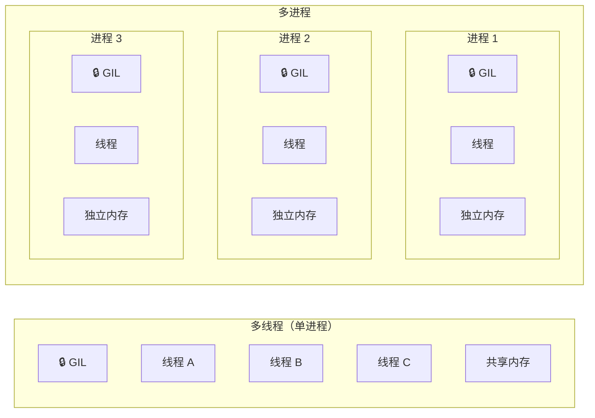
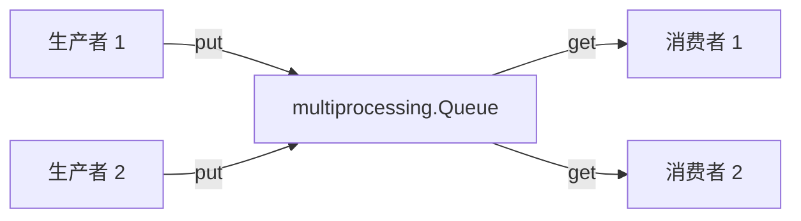
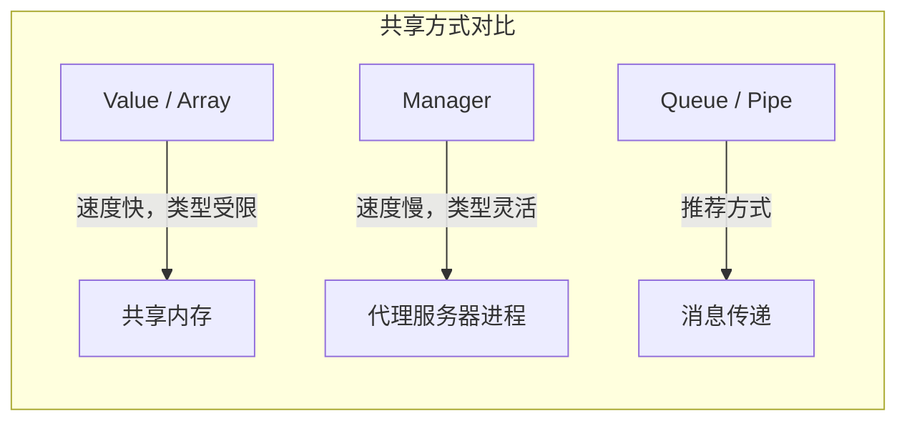
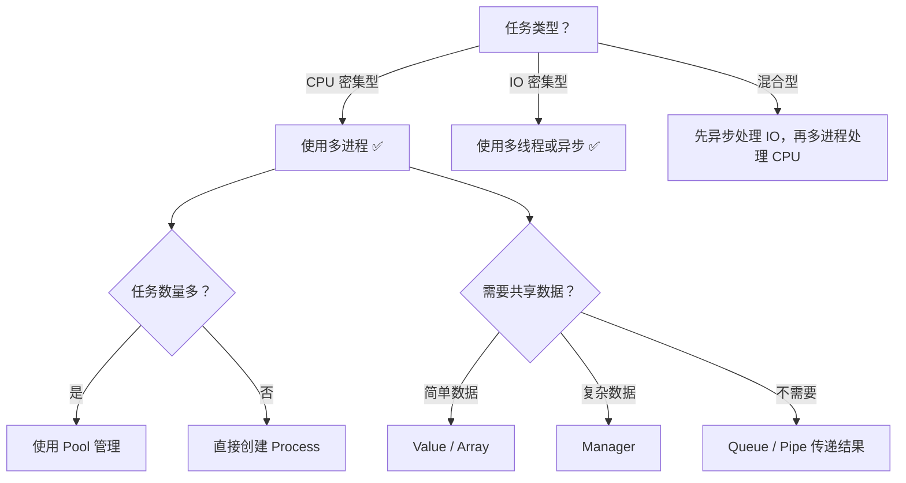

# 多进程与进程池

> **所属路径**：`01_基础能力/01_开发环境与技术英语/07_并发编程/02_多进程与进程池`
> **预计学习时间**：55 分钟
> **难度等级**：⭐⭐

---

## 前置知识

- [多线程与GIL](../01_多线程与GIL/01_多线程与GIL.md)（理解线程、GIL 对 CPU 密集型任务的限制）
- [函数与模块](../../01_编程语言基础/03_函数与模块/03_函数与模块.md)（理解函数定义、参数传递和模块导入）
- [进程与线程](../../../03_编程与计算机基础/04_操作系统/01_进程与线程/)（了解操作系统中进程与线程的基本概念）

> 如果以上内容还不熟悉，建议先完成对应课程再继续。

---

## 学习目标

完成本节后，你将能够：

1. 解释为什么多进程能绕过 GIL，实现真正的 CPU 并行
2. 使用 `multiprocessing` 模块创建和管理进程
3. 使用 `Pool` 进行并行任务执行（`map`、`apply_async`、`starmap`）
4. 使用 `Queue` 和 `Pipe` 在进程之间传递数据
5. 使用共享内存（`Value`、`Array`、`Manager`）在进程之间共享状态
6. 区分 `fork`、`spawn`、`forkserver` 三种进程启动方式

---

## 正文讲解

### 1. 为什么需要多进程

在上一课中，我们学习了 **[多线程与GIL](../01_多线程与GIL/01_多线程与GIL.md)** ，知道了一个关键事实：CPython 的 **全局解释器锁（Global Interpreter Lock, GIL）** 使得同一时刻只有一个线程能执行 Python 字节码。对于 IO 密集型任务（如网络请求、文件读写），多线程表现不错，因为线程在等待 IO 时会释放 GIL。但对于 CPU 密集型任务（如数值计算、图像处理），多线程几乎无法利用多核 CPU。

那怎么办？答案就是 **多进程（Multiprocessing）** 。

核心思路很直观：既然 GIL 是"每个解释器一把锁"，那我们干脆启动多个 Python 解释器进程，每个进程有自己独立的 GIL，互不干扰。这样就能真正利用多核 CPU 实现并行计算。



> 📌 **图解说明**：左侧多线程模型中，所有线程共享同一把 GIL 和同一块内存，因此同一时刻只有一个线程能运行 Python 代码。右侧多进程模型中，每个进程拥有独立的 GIL 和内存空间，可以真正并行执行 CPU 密集型任务。

用一句话总结：**多线程适合 IO 密集型，多进程适合 CPU 密集型** 。接下来我们就来学习 Python 标准库中的 `multiprocessing` 模块。

### 2. 创建进程

Python 的 `multiprocessing` 模块提供了与 `threading` 非常相似的 API，如果你已经熟悉多线程，切换到多进程几乎无缝衔接。

最基本的用法是通过 `multiprocessing.Process` 类创建进程：

```python
# 文件：code/basic_process.py
# 环境要求：Python 3.10+（仅使用标准库）
import multiprocessing
import os
import time


def cpu_heavy_task(name: str, count: int) -> None:
    """模拟一个 CPU 密集型任务：计算累加和"""
    print(f"[进程 {name}] PID={os.getpid()}, 开始计算...")
    total = 0
    for i in range(count):
        total += i * i
    print(f"[进程 {name}] PID={os.getpid()}, 结果={total}")


if __name__ == "__main__":
    count = 20_000_000

    # --- 单进程顺序执行 ---
    start = time.perf_counter()
    cpu_heavy_task("A-串行", count)
    cpu_heavy_task("B-串行", count)
    serial_time = time.perf_counter() - start
    print(f"\n串行耗时: {serial_time:.2f}s")

    # --- 多进程并行执行 ---
    start = time.perf_counter()
    p1 = multiprocessing.Process(target=cpu_heavy_task, args=("A-并行", count))
    p2 = multiprocessing.Process(target=cpu_heavy_task, args=("B-并行", count))

    p1.start()  # 启动进程
    p2.start()

    p1.join()   # 等待进程结束
    p2.join()
    parallel_time = time.perf_counter() - start
    print(f"并行耗时: {parallel_time:.2f}s")
    print(f"加速比: {serial_time / parallel_time:.2f}x")
```

**运行说明**：
- 环境要求：Python 3.10+
- 运行命令：`python code/basic_process.py`

**预期输出**（实际数值因机器而异）：
```
[进程 A-串行] PID=12345, 开始计算...
[进程 A-串行] PID=12345, 结果=2666666466666660000000
[进程 B-串行] PID=12345, 开始计算...
[进程 B-串行] PID=12345, 结果=2666666466666660000000

串行耗时: 4.52s
[进程 A-并行] PID=12347, 开始计算...
[进程 B-并行] PID=12348, 开始计算...
[进程 A-并行] PID=12347, 结果=2666666466666660000000
[进程 B-并行] PID=12348, 结果=2666666466666660000000
并行耗时: 2.35s
加速比: 1.92x
```

注意几个要点：

- 每个子进程都有自己独立的 **PID（进程 ID）** ，说明它们是真正独立的操作系统进程。
- 在双核以上的机器上，并行耗时约为串行的一半——这就是绕过 GIL 的好处。
- `start()` 和 `join()` 的用法与 `threading.Thread` 完全一致。
- **必须使用 `if __name__ == "__main__":` 保护** ，否则在 Windows/macOS 上会出错（原因在第 6 节详细解释）。

### 3. 进程池（Pool）

当你需要并行处理大量任务时，手动创建和管理每个进程非常繁琐。`multiprocessing.Pool` 提供了一个更优雅的方式：你只需指定进程池的大小，然后把任务"扔"进去，Pool 会自动分配给空闲进程执行。

想象一下快递分拣中心：你不需要给每个包裹安排一个专人，只需要维持一组分拣员（进程池），新包裹来了就分配给空闲的分拣员。

#### Pool 的常用方法

| 方法 | 功能 | 是否阻塞 | 返回值 |
| ---- | ---- | -------- | ------ |
| `pool.map(func, iterable)` | 并行映射，类似内置 `map()` | 阻塞 | 结果列表 |
| `pool.starmap(func, iterable)` | 并行映射，支持多参数 | 阻塞 | 结果列表 |
| `pool.apply_async(func, args)` | 异步提交单个任务 | 非阻塞 | `AsyncResult` 对象 |
| `pool.map_async(func, iterable)` | 异步并行映射 | 非阻塞 | `AsyncResult` 对象 |

下面来看一个完整示例：

```python
# 文件：code/pool_demo.py
# 环境要求：Python 3.10+（仅使用标准库）
import multiprocessing
import time
import math


def is_prime(n: int) -> bool:
    """判断一个数是否为素数"""
    if n < 2:
        return False
    if n < 4:
        return True
    if n % 2 == 0 or n % 3 == 0:
        return False
    i = 5
    while i * i <= n:
        if n % i == 0 or n % (i + 2) == 0:
            return False
        i += 6
    return True


def count_primes_in_range(start_end: tuple[int, int]) -> int:
    """统计区间 [start, end) 内的素数个数"""
    start, end = start_end
    return sum(1 for n in range(start, end) if is_prime(n))


if __name__ == "__main__":
    total_range = 2_000_000
    num_workers = 4

    # 将任务拆分为 num_workers 个子区间
    chunk_size = total_range // num_workers
    ranges = [
        (i * chunk_size, (i + 1) * chunk_size)
        for i in range(num_workers)
    ]
    # 确保覆盖剩余部分
    ranges[-1] = (ranges[-1][0], total_range)

    # --- 串行计算 ---
    start = time.perf_counter()
    serial_result = sum(count_primes_in_range(r) for r in ranges)
    serial_time = time.perf_counter() - start
    print(f"串行: {serial_result} 个素数, 耗时 {serial_time:.2f}s")

    # --- Pool.map 并行计算 ---
    start = time.perf_counter()
    with multiprocessing.Pool(processes=num_workers) as pool:
        results = pool.map(count_primes_in_range, ranges)
    parallel_result = sum(results)
    parallel_time = time.perf_counter() - start
    print(f"并行: {parallel_result} 个素数, 耗时 {parallel_time:.2f}s")
    print(f"加速比: {serial_time / parallel_time:.2f}x")
```

**运行说明**：
- 环境要求：Python 3.10+
- 运行命令：`python code/pool_demo.py`

**预期输出**（实际耗时因机器而异）：
```
串行: 148933 个素数, 耗时 3.41s
并行: 148933 个素数, 耗时 1.12s
加速比: 3.05x
```

这段代码展示了 `Pool.map()` 的典型用法。它和内置 `map()` 非常像——给定一个函数和一个可迭代对象，Pool 会把任务分配到多个进程并行执行，最后汇总结果。

当函数需要多个参数时，使用 `pool.starmap()`：

```python
# starmap 用法示例
def power(base: int, exp: int) -> int:
    return base ** exp

with multiprocessing.Pool(4) as pool:
    results = pool.starmap(power, [(2, 10), (3, 8), (5, 6), (7, 4)])
    print(results)  # [1024, 6561, 15625, 2401]
```

对于需要更灵活控制的场景，可以使用 `apply_async()`：

```python
# apply_async 用法示例
with multiprocessing.Pool(4) as pool:
    # 异步提交多个任务
    async_results = [
        pool.apply_async(is_prime, (n,))
        for n in [999999937, 999999893, 999999877]
    ]
    # 获取结果（会阻塞直到对应任务完成）
    for ar in async_results:
        print(ar.get(timeout=10))  # True, True, True
```

> 💡 **提示**：推荐使用 `with` 语句管理 Pool 的生命周期（上下文管理器），它会在退出时自动调用 `pool.terminate()` 清理子进程。如果不使用 `with` ，你需要手动调用 `pool.close()` 和 `pool.join()` 。

### 4. 进程间通信

多线程中，线程共享同一块内存，通信天然方便。但多进程中，每个进程的内存空间是 **隔离** 的——你在一个进程里修改一个变量，另一个进程根本看不到。

那进程之间如何交换数据呢？ `multiprocessing` 提供了两种主要的通信机制：**队列（Queue）** 和 **管道（Pipe）** 。

#### Queue：多对多消息传递

`multiprocessing.Queue` 是进程安全的队列，多个生产者可以往里放数据，多个消费者可以从中取数据。它的接口与 `queue.Queue`（线程安全队列）几乎一致。

```python
# 文件：code/queue_demo.py
# 环境要求：Python 3.10+（仅使用标准库）
import multiprocessing
import time
import random


def producer(queue: multiprocessing.Queue, name: str, count: int) -> None:
    """生产者：往队列中放入数据"""
    for i in range(count):
        item = f"{name}-任务{i}"
        queue.put(item)
        print(f"[生产者 {name}] 放入: {item}")
        time.sleep(random.uniform(0.1, 0.3))
    queue.put(None)  # 放入哨兵值表示结束


def consumer(queue: multiprocessing.Queue, name: str) -> None:
    """消费者：从队列中取出数据并处理"""
    while True:
        item = queue.get()
        if item is None:
            print(f"[消费者 {name}] 收到结束信号，退出")
            break
        print(f"[消费者 {name}] 处理: {item}")
        time.sleep(0.2)  # 模拟处理耗时


if __name__ == "__main__":
    queue = multiprocessing.Queue()

    prod = multiprocessing.Process(
        target=producer, args=(queue, "P1", 5)
    )
    cons = multiprocessing.Process(
        target=consumer, args=(queue, "C1")
    )

    prod.start()
    cons.start()

    prod.join()
    cons.join()
    print("所有进程完成")
```

**运行说明**：
- 环境要求：Python 3.10+
- 运行命令：`python code/queue_demo.py`

**预期输出**（顺序可能不同）：
```
[生产者 P1] 放入: P1-任务0
[消费者 C1] 处理: P1-任务0
[生产者 P1] 放入: P1-任务1
[消费者 C1] 处理: P1-任务1
[生产者 P1] 放入: P1-任务2
[生产者 P1] 放入: P1-任务3
[消费者 C1] 处理: P1-任务2
[生产者 P1] 放入: P1-任务4
[消费者 C1] 处理: P1-任务3
[消费者 C1] 处理: P1-任务4
[消费者 C1] 收到结束信号，退出
所有进程完成
```



> 📌 **图解说明**：`Queue` 充当进程之间的"邮箱"，生产者通过 `put()` 放入消息，消费者通过 `get()` 取出消息。Queue 内部处理了跨进程的序列化和同步，使用起来非常简单。

#### Pipe：一对一双向通信

如果只有两个进程需要通信，`multiprocessing.Pipe` 更加轻量高效。它会创建一对连接对象，两端各持一个：

```python
# Pipe 基本用法
import multiprocessing


def sender(conn):
    conn.send({"type": "greeting", "msg": "你好，接收端！"})
    response = conn.recv()
    print(f"[发送端] 收到回复: {response}")
    conn.close()


def receiver(conn):
    data = conn.recv()
    print(f"[接收端] 收到: {data}")
    conn.send("已收到，谢谢！")
    conn.close()


if __name__ == "__main__":
    conn1, conn2 = multiprocessing.Pipe()

    p1 = multiprocessing.Process(target=sender, args=(conn1,))
    p2 = multiprocessing.Process(target=receiver, args=(conn2,))

    p1.start()
    p2.start()
    p1.join()
    p2.join()
```

> 💡 **选择建议**：需要多个进程之间传递消息时用 `Queue` ，仅两个进程之间通信时用 `Pipe` 。一般来说，**优先使用消息传递（Queue / Pipe），而非共享状态** ——这能避免大量并发问题。

### 5. 共享状态

虽然消息传递是推荐的进程间通信方式，但有些场景确实需要多个进程读写同一份数据。 `multiprocessing` 为此提供了几种共享状态机制。

#### Value 和 Array：简单共享数据

`Value` 和 `Array` 在共享内存中创建数据，多个进程可以直接读写：

```python
# 文件：code/shared_state.py
# 环境要求：Python 3.10+（仅使用标准库）
import multiprocessing


def increment(shared_counter: multiprocessing.Value, lock: multiprocessing.Lock, n: int) -> None:
    """使用锁保护的安全递增"""
    for _ in range(n):
        with lock:
            shared_counter.value += 1


if __name__ == "__main__":
    # 'i' 表示有符号整数类型（C 语言类型码）
    counter = multiprocessing.Value('i', 0)
    lock = multiprocessing.Lock()

    processes = [
        multiprocessing.Process(target=increment, args=(counter, lock, 100_000))
        for _ in range(4)
    ]

    for p in processes:
        p.start()
    for p in processes:
        p.join()

    print(f"最终计数: {counter.value}")  # 400000
    print(f"期望计数: 400000")
    print(f"结果正确: {counter.value == 400_000}")
```

**运行说明**：
- 环境要求：Python 3.10+
- 运行命令：`python code/shared_state.py`

**预期输出**：
```
最终计数: 400000
期望计数: 400000
结果正确: True
```

`Value` 的类型码遵循 Python `array` 模块的约定：`'i'` 表示整数，`'d'` 表示双精度浮点数。注意：**即使 `Value` 本身是进程安全的，但复合操作（如 `counter.value += 1` ，先读后写）仍然需要锁来保证原子性** 。

#### Manager：共享复杂数据结构

如果需要在进程间共享字典、列表等复杂数据结构，可以使用 `multiprocessing.Manager` ：

```python
# Manager 基本用法
import multiprocessing


def worker(shared_dict, key, value):
    shared_dict[key] = value


if __name__ == "__main__":
    with multiprocessing.Manager() as manager:
        shared_dict = manager.dict()

        processes = [
            multiprocessing.Process(
                target=worker,
                args=(shared_dict, f"key_{i}", i * 10)
            )
            for i in range(4)
        ]
        for p in processes:
            p.start()
        for p in processes:
            p.join()

        print(dict(shared_dict))
        # {'key_0': 0, 'key_1': 10, 'key_2': 20, 'key_3': 30}
```

> ⚠️ **注意**：`Manager` 在底层会启动一个独立的服务器进程来管理共享数据，所有读写操作都通过网络（或 IPC）代理完成，因此性能比 `Value` / `Array` 低很多。只有在确实需要共享复杂数据结构时才使用它。



> 📌 **图解说明**：三种进程间数据共享方式各有适用场景。一般情况下，优先使用消息传递（Queue / Pipe）；需要共享简单数值时用 Value / Array；需要共享复杂对象时才考虑 Manager。

### 6. 进程启动方式

`multiprocessing` 支持三种进程启动方式，不同操作系统的默认方式不同：

| 启动方式 | 默认平台 | 机制 | 特点 |
| -------- | -------- | ---- | ---- |
| `fork` | Linux | 复制父进程的内存空间 | 速度快，但可能继承不安全的状态（如锁、文件描述符） |
| `spawn` | Windows、macOS（3.8+） | 启动全新的 Python 解释器 | 速度较慢，但更安全；子进程不继承父进程的全局状态 |
| `forkserver` | 支持 Unix 管道的系统 | 启动一个服务器进程，由它 fork 出子进程 | 介于两者之间，避免 fork 的不安全问题 |

**为什么 Windows 上必须写 `if __name__ == "__main__":` ？**

在 `spawn` 模式下，子进程会重新导入（import）主模块。如果你的进程创建代码写在模块顶层（没有 `if __name__ == "__main__":` 保护），子进程导入时又会创建新的子进程，导致无限递归：

```python
# ❌ 错误写法（在 Windows/macOS 上会无限递归）
import multiprocessing

p = multiprocessing.Process(target=some_func)
p.start()  # 子进程导入此文件 → 又创建新进程 → 再导入 → 无限循环！
```

```python
# ✅ 正确写法
import multiprocessing

if __name__ == "__main__":
    p = multiprocessing.Process(target=some_func)
    p.start()  # 子进程导入此文件时 __name__ != "__main__"，不会执行这段
```

你可以通过 `multiprocessing.set_start_method()` 显式指定启动方式：

```python
import multiprocessing

if __name__ == "__main__":
    multiprocessing.set_start_method("spawn")  # 显式使用 spawn
    # ... 后续代码 ...
```

> 💡 **最佳实践**：为了代码的跨平台兼容性，始终加上 `if __name__ == "__main__":` 保护，无论你使用哪种启动方式。

### 7. 多进程的适用场景与注意事项

学到这里，我们来总结一下什么时候该用多进程，什么时候不该用。

#### 适用场景

| 场景 | 示例 |
| ---- | ---- |
| CPU 密集型计算 | 大规模数值运算、矩阵计算、密码学哈希 |
| 图像/音频批处理 | 并行处理数百张图像的缩放、滤镜、格式转换 |
| 数据预处理流水线 | 特征工程、数据清洗、文本分词的并行化 |
| 科学模拟 | 蒙特卡罗模拟、参数扫描 |

在人工智能和机器学习领域，多进程的典型应用包括：

- **数据加载与预处理**：PyTorch 的 `DataLoader` 通过 `num_workers` 参数在后台使用多进程并行加载和预处理训练数据。
- **并行特征工程**：对大规模数据集进行并行的特征编码、缩放和变换。
- **超参数搜索**：同时训练多组不同超参数的模型。

#### 注意事项

1. **进程创建开销**：创建进程比创建线程慢得多（需要复制整个内存空间或启动新解释器）。对于小任务，这个开销可能超过并行带来的收益。
2. **序列化要求**：传递给子进程的参数和返回值必须是可 pickle 序列化的。Lambda 函数、局部嵌套函数、数据库连接等不可序列化的对象会导致错误。
3. **内存占用**：每个进程都有独立的内存空间。如果每个进程都加载一份大型数据集，总内存占用会成倍增加。
4. **调试难度**：多进程的调试比多线程更困难，因为无法在一个调试器中同时跟踪多个进程。



> 📌 **图解说明**：这张决策流程图帮助你根据任务特征选择合适的并发方案和进程间通信方式。

---

## 动手实践

前面讲了不少概念，现在我们来做一个综合实践——用进程池并行计算大批量数字的因数分解。因数分解是一个典型的 CPU 密集型任务，非常适合用多进程加速。

```python
# 文件：code/factorize_parallel.py
# 环境要求：Python 3.10+（仅使用标准库）
import multiprocessing
import time


def factorize(n: int) -> list[int]:
    """返回 n 的所有因数"""
    factors = []
    d = 1
    while d * d <= n:
        if n % d == 0:
            factors.append(d)
            if d != n // d:
                factors.append(n // d)
        d += 1
    return sorted(factors)


def factorize_batch_serial(numbers: list[int]) -> list[list[int]]:
    """串行因数分解"""
    return [factorize(n) for n in numbers]


def factorize_batch_parallel(numbers: list[int], workers: int = 4) -> list[list[int]]:
    """并行因数分解"""
    with multiprocessing.Pool(processes=workers) as pool:
        return pool.map(factorize, numbers)


if __name__ == "__main__":
    # 生成一批大数
    numbers = [
        98765431, 87654329, 76543217, 65432113,
        54321107, 43219879, 32198761, 21987653,
        99999989, 88888891, 77777773, 66666671,
        55555553, 44444447, 33333331, 22222223,
    ]

    print(f"待处理: {len(numbers)} 个数字")
    print(f"CPU 核心数: {multiprocessing.cpu_count()}")

    # 串行
    start = time.perf_counter()
    serial_results = factorize_batch_serial(numbers)
    serial_time = time.perf_counter() - start
    print(f"\n串行耗时: {serial_time:.4f}s")

    # 并行
    workers = min(4, multiprocessing.cpu_count())
    start = time.perf_counter()
    parallel_results = factorize_batch_parallel(numbers, workers)
    parallel_time = time.perf_counter() - start
    print(f"并行耗时 ({workers} workers): {parallel_time:.4f}s")

    # 验证结果一致
    assert serial_results == parallel_results, "结果不一致！"
    print(f"\n结果一致: ✅")
    print(f"加速比: {serial_time / parallel_time:.2f}x")

    # 展示部分结果
    for num, factors in zip(numbers[:3], parallel_results[:3]):
        print(f"\n{num} 的因数: {factors}")
```

**运行说明**：
- 环境要求：Python 3.10+
- 运行命令：`python code/factorize_parallel.py`

**预期输出**（实际耗时因机器而异）：
```
待处理: 16 个数字
CPU 核心数: 4

串行耗时: 0.0823s
并行耗时 (4 workers): 0.0512s

结果一致: ✅
加速比: 1.61x

98765431 的因数: [1, 98765431]
87654329 的因数: [1, 87654329]
76543217 的因数: [1, 76543217]
```

从这个例子中你可以看到：`Pool.map()` 将列表中的每个数字分配给进程池中的空闲进程，自动完成任务分发和结果收集，代码写起来非常简洁。结果列表的顺序与输入列表完全对应——这是 `map()` 的保证。

---

## 典型误区

| 误区 | 正确理解 |
| ---- | -------- |
| 忘记 `if __name__ == "__main__":` 保护 | 在 Windows 和 macOS 上会导致无限递归或 `RuntimeError` 。这是 `spawn` 启动方式的要求，建议所有平台都加上 |
| 认为多进程一定比单进程快 | 进程创建和进程间通信有额外开销。对于耗时很短的任务，多进程反而更慢。Pool 的初始化本身也需要时间 |
| 尝试直接在进程间共享复杂对象 | 普通 Python 对象无法跨进程共享。必须使用 `Queue` 、 `Pipe` 、 `Value` 、 `Array` 或 `Manager` |
| 忘记 `pool.close()` 和 `pool.join()` | 不正确关闭 Pool 可能导致子进程成为僵尸进程。推荐使用 `with` 语句自动管理 |
| 传递不可 pickle 的对象给子进程 | Lambda 函数、嵌套函数、数据库连接等不可序列化。改用模块级别的普通函数 |

---

## 练习题

### 练习 1：并行文本处理（难度：⭐）

使用 `Pool.map()` 并行统计多个字符串中每个字符串的单词数。

输入：
```python
texts = [
    "Python is a great programming language",
    "Multiprocessing allows true parallelism in Python",
    "The Pool class manages a group of worker processes",
    "Data science and machine learning use Python extensively",
]
```

要求：编写函数 `count_words(text: str) -> int` ，然后用 `Pool.map()` 并行调用，返回每个字符串的单词数列表。

<details>
<summary>💡 提示</summary>

`str.split()` 可以将字符串按空格拆分为单词列表，`len()` 返回列表长度。

</details>

<details>
<summary>✅ 参考答案</summary>

```python
import multiprocessing


def count_words(text: str) -> int:
    return len(text.split())


if __name__ == "__main__":
    texts = [
        "Python is a great programming language",
        "Multiprocessing allows true parallelism in Python",
        "The Pool class manages a group of worker processes",
        "Data science and machine learning use Python extensively",
    ]
    with multiprocessing.Pool(2) as pool:
        results = pool.map(count_words, texts)
    print(results)  # [6, 7, 9, 8]
    assert results == [6, 7, 8, 8]
```

</details>

### 练习 2：生产者-消费者模式（难度：⭐⭐）

使用 `multiprocessing.Queue` 实现一个生产者-消费者模式：

- 2 个生产者进程，每个生成 5 个随机整数（1-100）放入队列
- 1 个消费者进程，从队列中取出数字并计算总和
- 消费者在收到 2 个哨兵值 `None` 后退出

<details>
<summary>💡 提示</summary>

每个生产者在完成后放入一个 `None` 作为哨兵值。消费者每收到一个 `None` 就计数，当哨兵计数等于生产者数量时退出循环。可以使用 `multiprocessing.Queue` 的 `put()` 和 `get()` 方法。

</details>

<details>
<summary>✅ 参考答案</summary>

```python
import multiprocessing
import random


def producer(queue, name, count):
    for _ in range(count):
        num = random.randint(1, 100)
        queue.put(num)
        print(f"[{name}] 放入: {num}")
    queue.put(None)  # 哨兵值


def consumer(queue, num_producers):
    total = 0
    done_count = 0
    while done_count < num_producers:
        item = queue.get()
        if item is None:
            done_count += 1
            continue
        total += item
    print(f"[消费者] 总和: {total}")


if __name__ == "__main__":
    q = multiprocessing.Queue()
    prods = [
        multiprocessing.Process(target=producer, args=(q, f"P{i}", 5))
        for i in range(2)
    ]
    cons = multiprocessing.Process(target=consumer, args=(q, 2))

    for p in prods:
        p.start()
    cons.start()

    for p in prods:
        p.join()
    cons.join()
```

</details>

### 练习 3：Pool.starmap 多参数并行（难度：⭐⭐）

编写函数 `compute(base: int, exp: int, mod: int) -> int` ，计算 $base^{exp} \mod mod$ 的值。使用 `Pool.starmap()` 并行计算以下输入的结果：

```python
tasks = [
    (2, 1000000, 1000000007),
    (3, 500000, 998244353),
    (5, 750000, 1000000007),
    (7, 600000, 998244353),
]
```

<details>
<summary>💡 提示</summary>

Python 内置的 `pow(base, exp, mod)` 可以高效计算模幂运算。 `starmap` 会自动将元组中的元素解包为多个参数。

</details>

<details>
<summary>✅ 参考答案</summary>

```python
import multiprocessing


def compute(base: int, exp: int, mod: int) -> int:
    return pow(base, exp, mod)


if __name__ == "__main__":
    tasks = [
        (2, 1000000, 1000000007),
        (3, 500000, 998244353),
        (5, 750000, 1000000007),
        (7, 600000, 998244353),
    ]
    with multiprocessing.Pool(4) as pool:
        results = pool.starmap(compute, tasks)
    for task, result in zip(tasks, results):
        print(f"pow({task[0]}, {task[1]}, {task[2]}) = {result}")
```

</details>

---

## 下一步学习

- 📖 下一个知识点：[异步编程与asyncio](../03_异步编程与asyncio/03_异步编程与asyncio.md)（学习 Python 的协程和事件循环，适合高并发 IO 场景）
- 🔗 相关知识点：[concurrent.futures](../04_concurrent.futures/04_concurrent.futures.md)（统一的线程池 / 进程池接口，更简洁的高级 API）
- 🔗 相关知识点：[进程与线程](../../../03_编程与计算机基础/04_操作系统/01_进程与线程/)（深入理解操作系统层面的进程机制）

---

## 参考资料

1. [multiprocessing — Process-based parallelism](https://docs.python.org/3/library/multiprocessing.html) — Python 官方文档，最权威的 API 参考（官方文档）
2. [multiprocessing — Programming guidelines](https://docs.python.org/3/library/multiprocessing.html#programming-guidelines) — 官方编程指南，包含跨平台注意事项（官方文档）
3. [concurrent.futures — Launching parallel tasks](https://docs.python.org/3/library/concurrent.futures.html) — 更高级的并行任务接口，基于 multiprocessing（官方文档）
4. [Real Python — Python Multiprocessing](https://realpython.com/python-multiprocessing/) — 详细的多进程教程与实例（公开教程）
