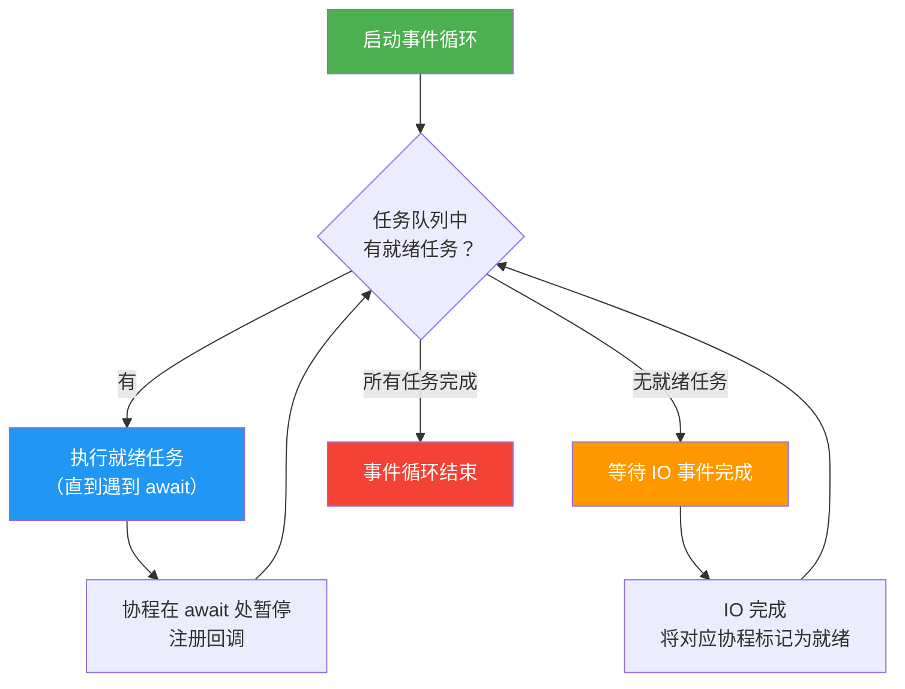

# 异步编程与asyncio

> **所属路径**：`01_基础能力/01_开发环境与技术英语/07_并发编程/03_异步编程与asyncio`
> **预计学习时间**：65 分钟
> **难度等级**：⭐⭐⭐

---

## 前置知识

- [多线程与GIL](../01_多线程与GIL/01_多线程与GIL.md)（理解并发的概念、GIL 对 IO 密集型任务的影响）
- [列表推导与生成器](../../01_编程语言基础/04_列表推导与生成器/04_列表推导与生成器.md)（理解 `yield` 和生成器——协程正是从生成器演化而来）
- [迭代器协议](../../04_迭代器与函数式工具/01_迭代器协议/)（理解 `__iter__` 和 `__next__` ，异步迭代器是其异步版本）

> 如果以上内容还不熟悉，建议先完成对应课程再继续。

---

## 学习目标

完成本节后，你将能够：

1. 解释协作式多任务和事件循环的核心概念
2. 使用 `async def` 和 `await` 编写协程
3. 使用 `asyncio.gather()` 和 `asyncio.create_task()` 并发运行多个协程
4. 利用 asyncio 高效处理 IO 密集型并发操作
5. 区分 asyncio 与 threading 的适用场景

---

## 正文讲解

### 1. 从同步到异步：咖啡店的故事

想象你在经营一家咖啡店。

**同步模式** ：你是一个非常"专注"的店员——接到第一位顾客的订单后，你开始磨咖啡豆、煮咖啡、拉花、递给顾客，全部完成后才喊"下一位"。如果煮咖啡需要等 3 分钟，你就站在咖啡机旁边发呆 3 分钟，什么也不做。

**异步模式** ：你是一个聪明的店员——接到订单后启动咖啡机，然后趁咖啡在煮的时候，你转身去接第二位顾客的订单、给第三位顾客打包甜点。当咖啡机发出"滴滴"声，你再回来把咖啡递给第一位顾客。整个过程中，你一个人就高效地服务了多位顾客。

这就是 **异步编程（Asynchronous Programming）** 的核心思想：**在等待的时候不要傻等，而是去做别的事** 。

```mermaid
gantt
    title 同步 vs 异步执行时间线
    dateFormat X
    axisFormat %s
    section 同步模式
    请求A（发送）   :a1, 0, 1
    请求A（等待响应）:crit, a2, 1, 4
    请求A（处理）   :a3, 4, 5
    请求B（发送）   :b1, 5, 6
    请求B（等待响应）:crit, b2, 6, 9
    请求B（处理）   :b3, 9, 10
    请求C（发送）   :c1, 10, 11
    请求C（等待响应）:crit, c2, 11, 14
    请求C（处理）   :c3, 14, 15
    section 异步模式
    请求A（发送）   :d1, 0, 1
    请求B（发送）   :d2, 1, 2
    请求C（发送）   :d3, 2, 3
    请求A（等待+处理）:crit, d4, 3, 5
    请求B（等待+处理）:crit, d5, 3, 5
    请求C（等待+处理）:crit, d6, 3, 5
```



> 📌 **图解说明**：上半部分是同步模式——必须等一个请求完全处理完才能开始下一个，总耗时约为各请求耗时之和。下半部分是异步模式——在等待 IO 响应时去发起其他请求，总耗时接近最长的那一个。

在上一课 **[多线程与GIL](../01_多线程与GIL/01_多线程与GIL.md)** 中，我们学会了用多线程来实现并发。多线程的做法相当于雇了多个店员，每个店员负责一个顾客。但这有开销——每个线程都需要独立的栈空间（通常 1–8 MB），且线程切换由操作系统控制，开销不小。当你需要同时处理成千上万个网络连接时（比如一个 Web 服务器），为每个连接创建一个线程就不太现实了。

异步编程给出了一个更轻量的方案：**只用一个线程，但通过协程在 IO 等待时主动让出控制权** 。就像那个聪明的店员，一个人就能高效服务众多顾客。这就是 Python 标准库 `asyncio` 要做的事情。

### 2. 协程基础

#### 什么是协程

**协程（Coroutine）** 是一种特殊的函数，它可以在执行过程中"暂停"自己，把控制权交还给调用者，之后再从暂停的地方"恢复"继续执行。

如果你熟悉 **[生成器（Generator）](../../01_编程语言基础/04_列表推导与生成器/04_列表推导与生成器.md)** ，可以这样类比：生成器用 `yield` 产出值并暂停；协程用 `await` 等待结果并暂停。事实上，Python 的协程正是从生成器演化而来——早期的协程甚至直接用 `yield from` 实现。

在现代 Python（3.5+）中，定义协程用 `async def` ，暂停协程用 `await` ：

```python
# 文件：code/basic_coroutine.py
# 环境要求：Python 3.10+（仅使用标准库）
import asyncio


async def say_hello(name: str) -> str:
    """一个简单的协程函数"""
    print(f"你好，{name}！开始准备问候...")
    await asyncio.sleep(1)  # 模拟 IO 等待（暂停 1 秒）
    print(f"问候 {name} 完成！")
    return f"Hello, {name}!"


async def main() -> None:
    """入口协程"""
    result = await say_hello("Python 学习者")
    print(f"返回值: {result}")


# 启动事件循环并运行入口协程
asyncio.run(main())
```

**运行说明**：
- 环境要求：Python 3.10+
- 运行命令：`python code/basic_coroutine.py`

**预期输出**：
```
你好，Python 学习者！开始准备问候...
问候 Python 学习者 完成！
返回值: Hello, Python 学习者!
```

这段代码中有三个关键要素：

1. **`async def`** ：定义一个协程函数。调用它不会立即执行，而是返回一个协程对象。
2. **`await`** ：暂停当前协程，等待被 await 的异步操作完成后再继续执行。只能在 `async def` 内部使用。
3. **`asyncio.run()`** ：启动事件循环，运行入口协程，直到其完成后关闭事件循环。这是从同步代码进入异步世界的入口。

#### 协程 vs 普通函数

一个关键区别：直接调用协程函数 **不会执行** 函数体，只会得到一个协程对象：

```python
# ❌ 常见错误：忘记 await
coro = say_hello("World")  # 这只是创建了一个协程对象
print(type(coro))           # <class 'coroutine'>
# 函数体并没有被执行！Python 会发出 RuntimeWarning

# ✅ 正确做法：在 async 函数中 await
async def main():
    result = await say_hello("World")  # 这才会真正执行
```

#### asyncio.sleep() vs time.sleep()

在异步编程中，有一个非常重要的区别：

- **`asyncio.sleep(n)`** ：异步等待，暂停当前协程但 **不阻塞** 事件循环，其他协程可以趁机运行。
- **`time.sleep(n)`** ：同步等待，**阻塞** 整个线程（也就阻塞了事件循环），所有协程都被卡住。

这就像咖啡店的区别：`asyncio.sleep` 是把咖啡放到机器上后去做别的事，`time.sleep` 是站在咖啡机旁边发呆等着。

### 3. 事件循环：协程的调度中心

异步编程的核心引擎是 **事件循环（Event Loop）** 。它就像咖啡店里那个聪明店员的"大脑"——不断检查"哪个任务准备好了？谁需要继续执行？"

事件循环的工作流程如下：



> 📌 **图解说明**：事件循环不断循环——取出就绪的协程执行，当协程遇到 `await` 暂停时，事件循环去执行其他就绪的协程。当 IO 操作完成后，对应的协程被标记为就绪，等待下一轮被调度执行。

这就是 **协作式多任务（Cooperative Multitasking）** ——协程在 `await` 处 **主动** 让出控制权，而不是像线程那样被操作系统强制切换。这意味着：

- **优点** ：没有线程切换的开销，没有竞态条件（同一时刻只有一个协程在执行），代码更可预测。
- **代价** ：如果一个协程长时间不 `await` （比如做大量 CPU 计算），它就会"霸占"事件循环，其他协程全部卡住。

### 4. 并发运行多个协程

单个协程本身不比同步代码快——异步的威力在于 **并发运行多个协程** 。Python 提供了多种方式来实现。

#### asyncio.gather()：批量并发

`asyncio.gather()` 接受多个协程（或 Future），并发运行它们，等待全部完成后返回结果列表：

```python
# 文件：code/gather_demo.py
# 环境要求：Python 3.10+（仅使用标准库）
import asyncio
import time


async def fetch_data(name: str, delay: float) -> dict:
    """模拟异步获取数据（如 HTTP 请求）"""
    print(f"[开始] 获取 {name}...")
    await asyncio.sleep(delay)  # 模拟网络延迟
    print(f"[完成] {name} 获取成功（耗时 {delay}s）")
    return {"source": name, "data": f"{name}_内容", "delay": delay}


async def main() -> None:
    # --- 串行获取 ---
    print("=" * 45)
    print("串行获取：")
    start = time.time()

    r1 = await fetch_data("用户信息", 2.0)
    r2 = await fetch_data("订单列表", 3.0)
    r3 = await fetch_data("推荐结果", 1.5)

    serial_time = time.time() - start
    print(f"串行总耗时：{serial_time:.1f}s\n")

    # --- 并发获取 ---
    print("=" * 45)
    print("并发获取（asyncio.gather）：")
    start = time.time()

    results = await asyncio.gather(
        fetch_data("用户信息", 2.0),
        fetch_data("订单列表", 3.0),
        fetch_data("推荐结果", 1.5),
    )

    concurrent_time = time.time() - start
    print(f"并发总耗时：{concurrent_time:.1f}s")
    print(f"加速比：{serial_time / concurrent_time:.1f}x")
    print(f"返回结果数：{len(results)}")


asyncio.run(main())
```

**运行说明**：
- 环境要求：Python 3.10+
- 运行命令：`python code/gather_demo.py`

**预期输出**：
```
=============================================
串行获取：
[开始] 获取 用户信息...
[完成] 用户信息 获取成功（耗时 2.0s）
[开始] 获取 订单列表...
[完成] 订单列表 获取成功（耗时 3.0s）
[开始] 获取 推荐结果...
[完成] 推荐结果 获取成功（耗时 1.5s）
串行总耗时：6.5s

=============================================
并发获取（asyncio.gather）：
[开始] 获取 用户信息...
[开始] 获取 订单列表...
[开始] 获取 推荐结果...
[完成] 推荐结果 获取成功（耗时 1.5s）
[完成] 用户信息 获取成功（耗时 2.0s）
[完成] 订单列表 获取成功（耗时 3.0s）
并发总耗时：3.0s
加速比：2.2x
返回结果数：3
```

串行获取耗时 $2.0 + 3.0 + 1.5 = 6.5$ 秒，并发获取耗时 $\max(2.0, 3.0, 1.5) = 3.0$ 秒——三个请求"同时"在等待 IO ，总耗时取决于最慢的那一个。而且全程 **只使用了一个线程** 。

#### asyncio.create_task()：创建后台任务

如果你需要更灵活的控制（比如启动一个任务后继续做别的事），可以用 `asyncio.create_task()` 将协程包装为 **任务（Task）** ，它会立即被提交到事件循环中调度执行：

```python
# 文件：code/create_task_demo.py
# 环境要求：Python 3.10+（仅使用标准库）
import asyncio


async def background_job(name: str, delay: float) -> str:
    """一个后台异步任务"""
    print(f"  [{name}] 开始执行...")
    await asyncio.sleep(delay)
    print(f"  [{name}] 执行完毕！")
    return f"{name} 的结果"


async def main() -> None:
    print("创建后台任务：")

    # create_task() 立即提交任务到事件循环
    task1 = asyncio.create_task(background_job("数据清洗", 2.0))
    task2 = asyncio.create_task(background_job("模型预测", 1.5))

    # 主协程可以继续做其他事情
    print("  [主协程] 任务已创建，我先做点别的...")
    await asyncio.sleep(0.5)
    print("  [主协程] 别的事情做完了，等待任务完成...")

    # 在需要时 await 获取结果
    result1 = await task1
    result2 = await task2
    print(f"  结果: {result1}, {result2}")


asyncio.run(main())
```

**运行说明**：
- 环境要求：Python 3.10+
- 运行命令：`python code/create_task_demo.py`

**预期输出**：
```
创建后台任务：
  [主协程] 任务已创建，我先做点别的...
  [数据清洗] 开始执行...
  [模型预测] 开始执行...
  [主协程] 别的事情做完了，等待任务完成...
  [模型预测] 执行完毕！
  [数据清洗] 执行完毕！
  结果: 数据清洗 的结果, 模型预测 的结果
```

注意 `create_task()` 和直接 `await` 的区别：

| 方式 | 何时开始执行 | 何时获取结果 |
| ---- | ------------ | ------------ |
| `await coro()` | 立即执行，等待完成 | 当前行就得到结果 |
| `asyncio.create_task(coro())` | 提交到事件循环，尽快执行 | 在后续 `await task` 时获取 |
| `asyncio.gather(coro1(), coro2())` | 全部并发执行 | 等待全部完成，返回结果列表 |

#### TaskGroup（Python 3.11+）：结构化并发

Python 3.11 引入了 `asyncio.TaskGroup` ，提供了更安全的结构化并发模式——如果任何一个任务抛出异常，其余任务会被自动取消：

```python
# 需要 Python 3.11+
async def main() -> None:
    async with asyncio.TaskGroup() as tg:
        task1 = tg.create_task(fetch_data("用户信息", 2.0))
        task2 = tg.create_task(fetch_data("订单列表", 3.0))
        task3 = tg.create_task(fetch_data("推荐结果", 1.5))
    # 离开 async with 块时，所有任务已完成
    print(task1.result(), task2.result(), task3.result())
```

`TaskGroup` 是推荐的现代写法——它让并发任务的生命周期被清晰地限定在一个作用域内，异常处理也更可靠。

### 5. 异步迭代与异步上下文管理器

除了基本的 `await` ，Python 还为异步编程提供了两个重要的语法扩展。

#### async for：异步迭代

当你需要逐步从异步数据源读取数据时（比如逐行读取网络流、逐条消费消息队列），可以使用 `async for` ：

```python
# 文件：code/async_iteration.py
# 环境要求：Python 3.10+（仅使用标准库）
import asyncio


async def async_countdown(n: int):
    """一个异步生成器：模拟从远程服务逐步获取数据"""
    for i in range(n, 0, -1):
        await asyncio.sleep(0.5)  # 模拟异步获取
        yield i


async def main() -> None:
    print("异步倒计时：")
    async for number in async_countdown(5):
        print(f"  {number}...")
    print("  发射！🚀")


asyncio.run(main())
```

**运行说明**：
- 环境要求：Python 3.10+
- 运行命令：`python code/async_iteration.py`

**预期输出**：
```
异步倒计时：
  5...
  4...
  3...
  2...
  1...
  发射！🚀
```

异步生成器使用 `async def` + `yield` 定义，每次 `yield` 前可以 `await` 异步操作。这在处理流式数据（如 LLM 流式输出、WebSocket 消息流）时非常实用。

#### async with：异步上下文管理器

类似普通的 `with` 语句，`async with` 用于管理需要异步初始化和清理的资源：

```python
import asyncio


class AsyncTimer:
    """异步上下文管理器示例：计时器"""

    async def __aenter__(self):
        self.start = asyncio.get_event_loop().time()
        print("计时开始")
        return self

    async def __aexit__(self, exc_type, exc_val, exc_tb):
        elapsed = asyncio.get_event_loop().time() - self.start
        print(f"计时结束：{elapsed:.2f}s")
        return False


async def main() -> None:
    async with AsyncTimer():
        await asyncio.sleep(1.5)
        print("  做了一些异步工作...")


asyncio.run(main())
```

在实际应用中，`async with` 常用于管理异步数据库连接、HTTP 会话、WebSocket 连接等资源。

### 6. 异步编程的适用场景

了解了 asyncio 的基本用法后，我们来明确它的 **擅长领域** 和 **不擅长领域** 。

#### 适合 asyncio 的场景

| 场景 | 说明 | 示例 |
| ---- | ---- | ---- |
| Web 服务器 | 同时处理大量客户端连接 | FastAPI、aiohttp |
| API 客户端 | 并发请求多个外部服务 | 批量调用大模型 API |
| 数据库查询 | 并发执行多个查询 | asyncpg、aiomysql |
| 爬虫 | 并发抓取多个网页 | aiohttp + 异步解析 |
| 消息队列 | 异步消费/生产消息 | aiokafka、aio-pika |
| 文件 IO | 异步读写大量文件 | aiofiles |

#### 不适合 asyncio 的场景

- **CPU 密集型任务** ：数值计算、图像处理、模型训练——这些任务不涉及 IO 等待，用 asyncio 没有收益。应使用 **[多进程与进程池](../02_多进程与进程池/02_多进程与进程池.md)** 。
- **调用阻塞式库** ：如果你使用的库不支持异步（如 `requests`、`time.sleep()`），它们会阻塞事件循环。需要用 `asyncio.to_thread()` 将其放到线程中执行。

#### 与 AI 工程的联系

异步编程在 AI 工程中的应用越来越广泛：

- **异步模型推理服务** ：用 FastAPI（基于 asyncio）构建模型 API ，单进程就能处理大量并发请求。
- **并发调用 LLM API** ：需要同时向 OpenAI / Claude 等 API 发送多个请求时，asyncio 比多线程更高效。
- **异步数据管道** ：在数据预处理阶段，并发下载、解析、存储数据。
- **流式输出处理** ：LLM 的 streaming response 天然适合用 `async for` 处理。

### 7. asyncio vs threading：如何选择

在 **[多线程与GIL](../01_多线程与GIL/01_多线程与GIL.md)** 中我们学习了 threading ，现在又学了 asyncio ，两者都用于处理 IO 密集型并发。它们有什么区别？什么时候该用哪个？

| 对比维度 | threading | asyncio |
| -------- | --------- | ------- |
| 调度方式 | 抢占式（操作系统控制切换） | 协作式（协程主动让出控制权） |
| 并发单元 | 线程（~1–8 MB 栈空间） | 协程（~几 KB） |
| 可伸缩性 | 数百个线程 | 数万个协程 |
| 竞态条件 | 存在（需要 Lock 保护共享数据） | 几乎不存在（单线程执行） |
| 调试难度 | 较高（非确定性交错） | 较低（执行顺序更可预测） |
| 生态支持 | 所有库都可用 | 需要异步版本的库 |
| 学习曲线 | 较低 | 较高（async/await 传染性） |
| 适用规模 | 中等并发（几十到几百） | 高并发（几千到几万） |

**选择建议** ：

- 如果你的项目需要调用 **不支持异步的第三方库** ，或者并发量不大（几十个），用 **threading** 更简单。
- 如果你需要处理 **大量并发 IO** （Web 服务器、API 网关、爬虫），或者项目已经在使用异步框架（FastAPI、aiohttp），用 **asyncio** 更高效。
- 在实际工程中，两者经常 **混合使用** ——asyncio 作为主框架，通过 `asyncio.to_thread()` 调用阻塞式库：

```python
import asyncio
import time


def blocking_io_operation() -> str:
    """一个不支持异步的阻塞式函数"""
    time.sleep(2)  # 模拟阻塞 IO
    return "阻塞操作的结果"


async def main() -> None:
    # 用 asyncio.to_thread() 把阻塞操作放到线程池中
    result = await asyncio.to_thread(blocking_io_operation)
    print(result)


asyncio.run(main())
```

---

## 动手实践

前面我们已经理解了异步编程的核心概念，现在来实现一个更完整的例子——模拟一个并发数据采集器，从多个"数据源"异步获取数据，并展示错误处理和超时控制：

```python
# 文件：code/async_scraper.py
# 环境要求：Python 3.10+（仅使用标准库）
import asyncio
import time
import random


async def fetch_page(url: str) -> dict:
    """模拟异步获取网页数据"""
    delay = random.uniform(0.5, 3.0)
    print(f"  📡 请求: {url}（预计 {delay:.1f}s）")

    # 模拟随机失败
    if random.random() < 0.15:
        await asyncio.sleep(delay / 2)
        raise ConnectionError(f"连接失败: {url}")

    await asyncio.sleep(delay)
    return {
        "url": url,
        "status": 200,
        "size": random.randint(1000, 50000),
    }


async def fetch_with_retry(url: str, max_retries: int = 2) -> dict | None:
    """带重试的异步获取"""
    for attempt in range(max_retries + 1):
        try:
            return await fetch_page(url)
        except ConnectionError as e:
            if attempt < max_retries:
                wait = 0.5 * (attempt + 1)
                print(f"  ⚠️ {e}，{wait}s 后重试...")
                await asyncio.sleep(wait)
            else:
                print(f"  ❌ {url} 最终失败（已重试 {max_retries} 次）")
                return None


async def main() -> None:
    urls = [
        "https://api.example.com/users",
        "https://api.example.com/orders",
        "https://api.example.com/products",
        "https://api.example.com/reviews",
        "https://api.example.com/stats",
    ]

    print(f"开始并发采集 {len(urls)} 个数据源...\n")
    start = time.time()

    # 使用 asyncio.gather 并发获取所有页面
    # return_exceptions=False (默认) 会让第一个异常传播
    # 我们用 fetch_with_retry 内部处理异常，所以不需要
    tasks = [fetch_with_retry(url) for url in urls]
    results = await asyncio.gather(*tasks)

    elapsed = time.time() - start

    # 统计结果
    successes = [r for r in results if r is not None]
    failures = [r for r in results if r is None]
    total_size = sum(r["size"] for r in successes)

    print(f"\n{'=' * 45}")
    print(f"采集完成！")
    print(f"  成功: {len(successes)}/{len(urls)}")
    print(f"  失败: {len(failures)}/{len(urls)}")
    print(f"  总数据量: {total_size:,} bytes")
    print(f"  总耗时: {elapsed:.1f}s（串行预计 >{len(urls) * 1.5:.0f}s）")


asyncio.run(main())
```

**运行说明**：
- 环境要求：Python 3.10+
- 运行命令：`python code/async_scraper.py`

**预期输出**（因随机性，每次结果略有不同）：
```
开始并发采集 5 个数据源...

  📡 请求: https://api.example.com/users（预计 1.2s）
  📡 请求: https://api.example.com/orders（预计 2.5s）
  📡 请求: https://api.example.com/products（预计 0.8s）
  📡 请求: https://api.example.com/reviews（预计 1.9s）
  📡 请求: https://api.example.com/stats（预计 1.4s）
  📡 请求: https://api.example.com/products（预计 0.8s）

=============================================
采集完成！
  成功: 5/5
  失败: 0/5
  总数据量: 98,234 bytes
  总耗时: 2.8s（串行预计 >7s）
```

这个示例展示了异步编程在实际场景中的典型模式：并发发起多个 IO 请求，带重试的错误处理，以及结果的聚合统计。同样的任务如果用同步代码，耗时至少是各请求之和；而用 asyncio ，耗时约等于最慢那一个。

---

## 典型误区

| 误区 | 正确理解 |
| ---- | -------- |
| 调用协程函数不加 `await` ，认为它会自动执行 | 直接调用 `async def` 函数只会返回一个协程对象，不会执行函数体。必须用 `await` 或 `asyncio.create_task()` 来执行 |
| 在协程中使用 `time.sleep()` 代替 `asyncio.sleep()` | `time.sleep()` 会阻塞整个事件循环，其他协程全部卡住。必须使用 `asyncio.sleep()` 或其他异步 IO 操作 |
| 认为 asyncio 能加速 CPU 密集型任务 | asyncio 的优势在于 IO 等待时间的复用，CPU 密集型任务没有等待时间可复用，应使用 `multiprocessing` |
| 混用同步库和异步代码（如在 `async def` 中调用 `requests.get()`） | 同步库会阻塞事件循环。应使用异步替代库（如 `aiohttp`），或用 `asyncio.to_thread()` 包装同步调用 |
| 在 Jupyter Notebook 中使用 `asyncio.run()` 报错 | Jupyter 已有一个运行中的事件循环，直接 `await main()` 即可，或使用 `nest_asyncio` 库 |

---

## 练习题

### 练习 1：异步倒计时器（难度：⭐）

编写一个协程 `countdown(name, n)` ，从 $n$ 倒数到 $1$ ，每秒打印一个数字。然后在 `main()` 中用 `asyncio.gather` 同时运行两个倒计时器：`countdown("A", 5)` 和 `countdown("B", 3)` 。要求两个计时器并发运行（总耗时应约为 $5$ 秒而非 $8$ 秒）。

<details>
<summary>💡 提示</summary>

在 `countdown` 协程内部，使用 `for` 循环和 `await asyncio.sleep(1)` 来实现每秒倒数。用 `asyncio.gather()` 在 `main()` 中并发运行两个 `countdown` 协程。

</details>

<details>
<summary>✅ 参考答案</summary>

```python
import asyncio
import time


async def countdown(name: str, n: int) -> None:
    for i in range(n, 0, -1):
        print(f"  [{name}] {i}")
        await asyncio.sleep(1)
    print(f"  [{name}] 完成！")


async def main() -> None:
    start = time.time()
    await asyncio.gather(
        countdown("A", 5),
        countdown("B", 3),
    )
    elapsed = time.time() - start
    print(f"总耗时: {elapsed:.1f}s")
    assert elapsed < 6, "两个计时器应并发运行，总耗时约 5s"


asyncio.run(main())
```

</details>

### 练习 2：带超时的并发获取（难度：⭐⭐）

编写一个 `fetch(name, delay)` 协程模拟网络请求（用 `asyncio.sleep(delay)` 模拟），并发获取 4 个数据源。要求使用 `asyncio.wait_for()` 设置单个请求的超时时间为 $2$ 秒，超时的请求应捕获 `asyncio.TimeoutError` 并返回 `None` 。

数据源：`("快速API", 1.0)` 、 `("中速API", 1.8)` 、 `("慢速API", 3.5)` 、 `("超慢API", 5.0)` 。预期前两个成功，后两个超时。

<details>
<summary>💡 提示</summary>

用 `asyncio.wait_for(coro, timeout=2.0)` 包装每个请求，在 `try/except asyncio.TimeoutError` 中处理超时情况。然后用 `asyncio.gather()` 并发运行所有包装后的协程。

</details>

<details>
<summary>✅ 参考答案</summary>

```python
import asyncio


async def fetch(name: str, delay: float) -> str:
    await asyncio.sleep(delay)
    return f"{name} 的数据"


async def fetch_with_timeout(name: str, delay: float, timeout: float) -> str | None:
    try:
        result = await asyncio.wait_for(fetch(name, delay), timeout=timeout)
        print(f"  ✅ {name}: 成功")
        return result
    except asyncio.TimeoutError:
        print(f"  ⏰ {name}: 超时（>{timeout}s）")
        return None


async def main() -> None:
    sources = [
        ("快速API", 1.0),
        ("中速API", 1.8),
        ("慢速API", 3.5),
        ("超慢API", 5.0),
    ]
    results = await asyncio.gather(
        *[fetch_with_timeout(name, delay, 2.0) for name, delay in sources]
    )
    successes = [r for r in results if r is not None]
    print(f"\n成功: {len(successes)}/{len(sources)}")
    assert len(successes) == 2, "应有 2 个成功，2 个超时"


asyncio.run(main())
```

</details>

### 练习 3：异步生成器——批量数据流（难度：⭐⭐⭐）

编写一个异步生成器 `async_batch_reader(total, batch_size)` ，模拟从数据库中分批异步读取数据。每次读取一批需要 `await asyncio.sleep(0.3)` 模拟网络延迟，然后 `yield` 当前批次的数据（用 `list(range(start, end))` 模拟）。在 `main()` 中用 `async for` 消费所有批次，统计总共读取的记录数。

参数：`total=25, batch_size=8` ，预期产出 4 批（8+8+8+1）。

<details>
<summary>💡 提示</summary>

使用 `async def` + `yield` 定义异步生成器。用 `while` 循环和偏移量来分批读取。每次 `yield` 前先 `await asyncio.sleep()` 模拟异步 IO 。在 `main()` 中用 `async for batch in async_batch_reader(...)` 消费。

</details>

<details>
<summary>✅ 参考答案</summary>

```python
import asyncio


async def async_batch_reader(total: int, batch_size: int):
    """异步分批读取数据"""
    offset = 0
    batch_num = 0
    while offset < total:
        await asyncio.sleep(0.3)  # 模拟数据库查询延迟
        end = min(offset + batch_size, total)
        batch = list(range(offset, end))
        batch_num += 1
        print(f"  批次 {batch_num}: 读取记录 [{offset}, {end})，共 {len(batch)} 条")
        yield batch
        offset = end


async def main() -> None:
    total_records = 0
    batch_count = 0

    async for batch in async_batch_reader(total=25, batch_size=8):
        total_records += len(batch)
        batch_count += 1

    print(f"\n共 {batch_count} 批，总计 {total_records} 条记录")
    assert total_records == 25, f"应读取 25 条，实际 {total_records}"
    assert batch_count == 4, f"应分 4 批，实际 {batch_count}"


asyncio.run(main())
```

</details>

---

## 下一步学习

- 📖 下一个知识点：[concurrent.futures](../04_concurrent.futures/04_concurrent.futures.md) — 统一的线程池/进程池高级接口，可与 asyncio 无缝集成
- 🔗 相关知识点：[多线程与GIL](../01_多线程与GIL/01_多线程与GIL.md) — IO 密集型并发的另一种方案
- 🔗 相关知识点：[并发模式选择](../05_并发模式选择/) — 系统对比 threading、multiprocessing、asyncio 的适用场景
- 📚 拓展阅读：[网络与Web编程](../../08_网络与Web编程/) — asyncio 在网络编程中的实际应用

---

## 参考资料

1. [Python asyncio 官方文档](https://docs.python.org/3/library/asyncio.html) — asyncio 模块的完整 API 参考，包含高级用法和底层接口（官方文档）
2. [PEP 492 — Coroutines with async and await Syntax](https://peps.python.org/pep-0492/) — 引入 `async def` / `await` 语法的 Python 增强提案（官方 PEP）
3. [Real Python — Async IO in Python: A Complete Walkthrough](https://realpython.com/async-io-python/) — 全面的 asyncio 入门教程，含大量实例（公开教程）
4. [Python asyncio TaskGroup 文档](https://docs.python.org/3/library/asyncio-task.html#asyncio.TaskGroup) — Python 3.11+ 结构化并发的官方说明（官方文档）
5. [David Beazley — Python Concurrency from the Ground Up](https://www.dabeaz.com/concurrency/) — 从底层理解 Python 并发模型的经典演讲资料（公开技术资料）
