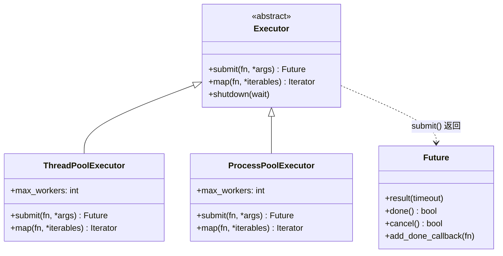
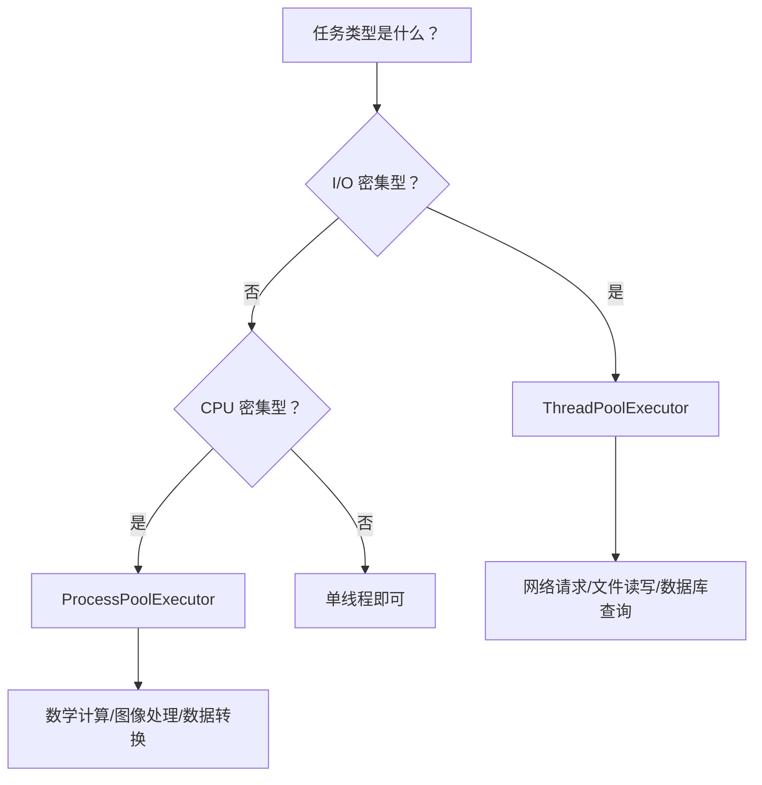

# concurrent.futures

> **所属路径**：`01_基础能力/01_开发环境与技术英语/07_并发编程/04_concurrent.futures`
> **预计学习时间**：45 分钟
> **难度等级**：⭐⭐

---

## 前置知识

- [多线程与GIL](../01_多线程与GIL/01_多线程与GIL.md)
- [多进程与进程池](../02_多进程与进程池/02_多进程与进程池.md)
- [异步编程与asyncio](../03_异步编程与asyncio/03_异步编程与asyncio.md)

> 如果以上内容还不熟悉，建议先完成对应课程再继续。

---

## 学习目标

完成本节后，你将能够：

1. 使用 `ThreadPoolExecutor` 并发执行 I/O 密集型任务
2. 使用 `ProcessPoolExecutor` 并行执行 CPU 密集型任务
3. 通过 `submit()` 提交任务并操作 `Future` 对象
4. 使用 `executor.map()` 进行并行映射
5. 使用 `as_completed()` 按完成顺序处理结果

---

## 正文讲解

### 1. 为什么需要统一的并发接口

在前面的课程中，我们分别学习了 **[多线程（Threading）](../01_多线程与GIL/01_多线程与GIL.md)** 和 **[多进程（Multiprocessing）](../02_多进程与进程池/02_多进程与进程池.md)** 。你可能已经注意到，它们的 API 风格有不少差异：创建线程用 `threading.Thread`，创建进程用 `multiprocessing.Process`；线程池用 `multiprocessing.pool.ThreadPool` 或者自己管理线程，进程池用 `multiprocessing.Pool`。如果一个项目从 I/O 密集型转为 CPU 密集型，想从线程切换到进程，可能需要修改大量代码。

有没有一种统一的接口，让我们只改一行代码就能在线程池和进程池之间自由切换呢？

答案就是 Python 标准库中的 **`concurrent.futures`** 模块。它在 PEP 3148 中被提出，从 Python 3.2 开始内置，提供了一套高层级的并发执行抽象。其核心设计思想是：**把"提交任务"和"获取结果"分离开来**，通过统一的 `Executor` 接口和 `Future` 对象来管理并发任务。

下面这张图展示了 `concurrent.futures` 的整体架构：



> 📌 **图解说明**：`Executor` 是抽象基类，定义了 `submit()` 和 `map()` 两个核心方法。`ThreadPoolExecutor` 和 `ProcessPoolExecutor` 是它的两个具体实现，分别使用线程池和进程池来执行任务。`submit()` 方法返回一个 `Future` 对象，代表一个尚未完成的异步计算结果。

这意味着，你的业务代码只需要依赖 `Executor` 接口。当需要在线程池和进程池之间切换时，只需修改实例化那一行代码——其余所有代码都不用改动。

### 2. ThreadPoolExecutor 快速入门

让我们从最简单的场景开始：使用 **线程池执行器（ThreadPoolExecutor）** 来并发执行 I/O 密集型任务。

`ThreadPoolExecutor` 最常见的用法是搭配 `with` 语句作为上下文管理器（Context Manager）使用。这样当 `with` 块结束时，执行器会自动关闭并等待所有任务完成，避免资源泄漏。

最简洁的并发执行方式是 `executor.map()`，它的用法几乎和内置函数 `map()` 一模一样，只不过每个调用会在独立的线程中并发执行：

```python
# 文件：code/threadpool_basic.py
# 环境要求：Python 3.10+（无额外依赖）
import time
from concurrent.futures import ThreadPoolExecutor


def fetch_data(url: str) -> str:
    """模拟网络请求：每个请求耗时 1 秒"""
    print(f"  开始请求: {url}")
    time.sleep(1)  # 模拟 I/O 等待
    return f"来自 {url} 的数据"


urls = [
    "https://api.example.com/users",
    "https://api.example.com/orders",
    "https://api.example.com/products",
    "https://api.example.com/reviews",
    "https://api.example.com/stats",
]

# --- 串行执行 ---
start = time.perf_counter()
serial_results = [fetch_data(url) for url in urls]
serial_time = time.perf_counter() - start
print(f"串行耗时: {serial_time:.2f} 秒\n")

# --- 并发执行 ---
start = time.perf_counter()
with ThreadPoolExecutor(max_workers=5) as executor:
    # executor.map() 按原始顺序返回结果
    concurrent_results = list(executor.map(fetch_data, urls))
concurrent_time = time.perf_counter() - start
print(f"并发耗时: {concurrent_time:.2f} 秒")
print(f"加速比: {serial_time / concurrent_time:.1f}x")

# 验证结果一致
assert serial_results == concurrent_results
print("结果一致性验证通过 ✓")
```

**运行说明**：
- 环境要求：Python 3.10+
- 运行命令：`python code/threadpool_basic.py`

**预期输出**：
```
  开始请求: https://api.example.com/users
  开始请求: https://api.example.com/orders
  开始请求: https://api.example.com/products
  开始请求: https://api.example.com/reviews
  开始请求: https://api.example.com/stats
串行耗时: 5.01 秒

  开始请求: https://api.example.com/users
  开始请求: https://api.example.com/orders
  开始请求: https://api.example.com/products
  开始请求: https://api.example.com/reviews
  开始请求: https://api.example.com/stats
并发耗时: 1.00 秒
加速比: 5.0x
结果一致性验证通过 ✓
```

从结果可以看到，5 个各需 1 秒的请求，串行执行需要约 5 秒，而使用 5 个线程并发执行只需约 1 秒——接近线性加速。注意 `executor.map()` 保证**按提交顺序**返回结果，这一点非常方便。

### 3. ProcessPoolExecutor 快速入门

对于 CPU 密集型任务，由于 **[GIL（全局解释器锁）](../01_多线程与GIL/01_多线程与GIL.md)** 的限制，多线程无法实现真正的并行。此时需要使用 **进程池执行器（ProcessPoolExecutor）** 。

`concurrent.futures` 的优雅之处在于：**切换到进程池只需改一行代码**。我们来看一个 CPU 密集型的例子——判断素数：

```python
# 文件：code/processpool_basic.py
# 环境要求：Python 3.10+（无额外依赖）
import time
import math
from concurrent.futures import ThreadPoolExecutor, ProcessPoolExecutor


def is_prime(n: int) -> bool:
    """判断一个数是否为素数（CPU 密集型计算）"""
    if n < 2:
        return False
    if n < 4:
        return True
    if n % 2 == 0 or n % 3 == 0:
        return False
    for i in range(5, int(math.sqrt(n)) + 1, 6):
        if n % i == 0 or n % (i + 2) == 0:
            return False
    return True


# 一组需要判断的大数
numbers = [
    112272535095293, 112582705942171, 112272535095293,
    115280095190773, 115797848077099, 1099726899285419,
    112272535095293, 112582705942171, 115280095190773,
    115797848077099, 1099726899285419, 112272535095293,
]

# --- 串行执行 ---
start = time.perf_counter()
serial_results = [is_prime(n) for n in numbers]
serial_time = time.perf_counter() - start
print(f"串行耗时: {serial_time:.2f} 秒")

# --- 线程池（受 GIL 限制，无法真正并行） ---
start = time.perf_counter()
with ThreadPoolExecutor(max_workers=4) as executor:
    thread_results = list(executor.map(is_prime, numbers))
thread_time = time.perf_counter() - start
print(f"线程池耗时: {thread_time:.2f} 秒")

# --- 进程池（真正的多核并行） ---
# 注意：只改了这一行！ThreadPoolExecutor → ProcessPoolExecutor
start = time.perf_counter()
with ProcessPoolExecutor(max_workers=4) as executor:
    process_results = list(executor.map(is_prime, numbers))
process_time = time.perf_counter() - start
print(f"进程池耗时: {process_time:.2f} 秒")

print(f"\n进程池 vs 串行加速比: {serial_time / process_time:.1f}x")
print(f"线程池 vs 串行加速比: {serial_time / thread_time:.1f}x")

# 验证结果一致
assert serial_results == thread_results == process_results
print("三种方式结果一致 ✓")
```

**运行说明**：
- 环境要求：Python 3.10+
- 运行命令：`python code/processpool_basic.py`

**预期输出**（具体数值因硬件而异）：
```
串行耗时: 2.45 秒
线程池耗时: 2.48 秒
进程池耗时: 0.82 秒

进程池 vs 串行加速比: 3.0x
线程池 vs 串行加速比: 1.0x
三种方式结果一致 ✓
```

线程池几乎没有加速（因为 GIL），而进程池在 4 核机器上获得了约 3 倍加速。关键要点是：**业务逻辑完全没有改变，只是把 `ThreadPoolExecutor` 换成了 `ProcessPoolExecutor`** 。

下面这张流程图总结了选择执行器的决策过程：



> 📌 **图解说明**：I/O 密集型任务选择 `ThreadPoolExecutor`（线程开销小，不受 GIL 影响），CPU 密集型任务选择 `ProcessPoolExecutor`（绕过 GIL，实现真正并行）。

### 4. Future 对象

`executor.map()` 虽然简洁，但它隐藏了很多细节。当你需要更精细地控制每个任务——比如逐个提交、检查状态、添加回调——就需要使用 `executor.submit()` 和 **Future（未来对象）** 。

**Future** 是 `concurrent.futures` 的核心概念。可以把它理解为一张"提货单"：你提交了一个任务，拿到一个 Future 作为凭证；任务完成后，你可以用这个凭证来取结果。

```python
# 文件：code/future_demo.py
# 环境要求：Python 3.10+（无额外依赖）
import time
from concurrent.futures import ThreadPoolExecutor, Future


def slow_computation(name: str, seconds: float) -> str:
    """模拟一个耗时计算"""
    time.sleep(seconds)
    return f"任务 '{name}' 完成（耗时 {seconds} 秒）"


with ThreadPoolExecutor(max_workers=3) as executor:
    # submit() 立即返回一个 Future 对象，不会阻塞
    future_a: Future = executor.submit(slow_computation, "A", 2.0)
    future_b: Future = executor.submit(slow_computation, "B", 1.0)
    future_c: Future = executor.submit(slow_computation, "C", 3.0)

    print(f"提交完成，A 是否已完成？{future_a.done()}")  # False
    print(f"提交完成，B 是否已完成？{future_b.done()}")  # False

    # result() 会阻塞直到结果可用
    print(f"\n等待 B 的结果: {future_b.result()}")
    print(f"此时 A 是否已完成？{future_a.done()}")  # 可能为 True

    # 获取剩余结果
    print(f"A 的结果: {future_a.result()}")
    print(f"C 的结果: {future_c.result()}")

    # --- 使用回调函数 ---
    def on_complete(fut: Future) -> None:
        """任务完成时自动调用"""
        print(f"  [回调] 收到结果: {fut.result()}")

    future_d = executor.submit(slow_computation, "D", 0.5)
    future_d.add_done_callback(on_complete)

    # 等待回调执行
    time.sleep(1)
    print("主线程继续执行...")
```

**运行说明**：
- 环境要求：Python 3.10+
- 运行命令：`python code/future_demo.py`

**预期输出**：
```
提交完成，A 是否已完成？False
提交完成，B 是否已完成？False

等待 B 的结果: 任务 'B' 完成（耗时 1.0 秒）
此时 A 是否已完成？True
A 的结果: 任务 'A' 完成（耗时 2.0 秒）
C 的结果: 任务 'C' 完成（耗时 3.0 秒）
  [回调] 收到结果: 任务 'D' 完成（耗时 0.5 秒）
主线程继续执行...
```

Future 的常用方法总结如下：

| 方法 | 说明 |
| ---- | ---- |
| `result(timeout=None)` | 获取结果，若未完成则阻塞等待；可设置超时 |
| `done()` | 返回布尔值，任务是否已完成 |
| `cancel()` | 尝试取消任务（仅在任务尚未开始执行时有效） |
| `cancelled()` | 返回布尔值，任务是否已被成功取消 |
| `add_done_callback(fn)` | 注册回调函数，任务完成时自动调用 |
| `exception(timeout=None)` | 获取任务中发生的异常（若无异常返回 `None` ） |

### 5. as_completed() 与 wait()

当你提交了多个任务，有两种方式来收集结果：

- **`executor.map()`**：按**提交顺序**返回结果。如果第一个任务最慢，后面的结果都得等它。
- **`as_completed()`**：按**完成顺序**返回 Future。谁先完成谁先处理，不浪费等待时间。

这个区别在任务耗时差异较大时特别重要：

```python
# 文件：code/as_completed_demo.py
# 环境要求：Python 3.10+（无额外依赖）
import time
from concurrent.futures import (
    ThreadPoolExecutor,
    as_completed,
    wait,
    FIRST_COMPLETED,
    ALL_COMPLETED,
)


def process_item(item_id: int) -> dict:
    """模拟处理任务，不同任务耗时不同"""
    duration = 3.0 - item_id * 0.5  # ID 越大完成越快
    time.sleep(max(duration, 0.1))
    return {"id": item_id, "duration": round(duration, 1)}


items = [0, 1, 2, 3, 4]

# --- 方式 1: map()，按提交顺序返回 ---
print("=== executor.map()（按提交顺序）===")
with ThreadPoolExecutor(max_workers=5) as executor:
    start = time.perf_counter()
    for result in executor.map(process_item, items):
        elapsed = time.perf_counter() - start
        print(f"  [{elapsed:.1f}s] 收到结果: item {result['id']}")

# --- 方式 2: as_completed()，按完成顺序返回 ---
print("\n=== as_completed()（按完成顺序）===")
with ThreadPoolExecutor(max_workers=5) as executor:
    start = time.perf_counter()
    # 用字典记录 Future → 原始输入的映射
    future_to_item = {
        executor.submit(process_item, item): item for item in items
    }
    for future in as_completed(future_to_item):
        elapsed = time.perf_counter() - start
        result = future.result()
        print(f"  [{elapsed:.1f}s] 收到结果: item {result['id']}")

# --- 方式 3: wait()，等待特定条件 ---
print("\n=== wait() 示例 ===")
with ThreadPoolExecutor(max_workers=5) as executor:
    futures = [executor.submit(process_item, i) for i in items]

    # 等待第一个任务完成
    done, not_done = wait(futures, return_when=FIRST_COMPLETED)
    print(f"第一个完成的任务: {done.pop().result()}")
    print(f"尚未完成的任务数: {len(not_done)}")

    # 等待所有任务完成
    done, not_done = wait(futures, return_when=ALL_COMPLETED)
    print(f"全部完成，共 {len(done)} 个任务")
```

**运行说明**：
- 环境要求：Python 3.10+
- 运行命令：`python code/as_completed_demo.py`

**预期输出**：
```
=== executor.map()（按提交顺序）===
  [3.0s] 收到结果: item 0
  [3.0s] 收到结果: item 1
  [3.0s] 收到结果: item 2
  [3.0s] 收到结果: item 3
  [3.0s] 收到结果: item 4

=== as_completed()（按完成顺序）===
  [0.1s] 收到结果: item 4
  [0.5s] 收到结果: item 3
  [1.0s] 收到结果: item 2
  [1.5s] 收到结果: item 1
  [3.0s] 收到结果: item 0

=== wait() 示例 ===
第一个完成的任务: {'id': 4, 'duration': -0.5}
尚未完成的任务数: 4
全部完成，共 5 个任务
```

可以清楚地看到：`map()` 在第 3 秒才一次性输出所有结果（被最慢的任务阻塞），而 `as_completed()` 从第 0.1 秒就开始输出结果，让我们能**尽早处理已完成的任务**。

### 6. 异常处理

在并发编程中，异常处理尤为重要。`concurrent.futures` 的一个优秀设计是：**工作线程/进程中的异常不会让主程序崩溃，而是被封装在 Future 对象中**，只在调用 `result()` 时才重新抛出。

```python
# 文件：code/exception_handling.py
# 环境要求：Python 3.10+（无额外依赖）
from concurrent.futures import ThreadPoolExecutor, as_completed


def risky_task(task_id: int) -> str:
    """可能会失败的任务"""
    if task_id == 2:
        raise ValueError(f"任务 {task_id} 遇到无效数据！")
    if task_id == 4:
        raise ConnectionError(f"任务 {task_id} 网络连接失败！")
    return f"任务 {task_id} 成功完成"


# --- 模式 1: 逐个处理异常 ---
print("=== 模式 1: 逐个检查 Future ===")
with ThreadPoolExecutor(max_workers=3) as executor:
    futures = {
        executor.submit(risky_task, i): i for i in range(6)
    }
    for future in as_completed(futures):
        task_id = futures[future]
        try:
            result = future.result()
            print(f"  ✅ 任务 {task_id}: {result}")
        except ValueError as e:
            print(f"  ❌ 任务 {task_id} 数据错误: {e}")
        except ConnectionError as e:
            print(f"  ❌ 任务 {task_id} 连接错误: {e}")

# --- 模式 2: 使用 exception() 方法检查 ---
print("\n=== 模式 2: 使用 exception() 检查 ===")
with ThreadPoolExecutor(max_workers=3) as executor:
    futures = [executor.submit(risky_task, i) for i in range(6)]

    for i, future in enumerate(futures):
        future.result() if future.exception() is None else None  # 等待完成
        exc = future.exception()
        if exc is not None:
            print(f"  ❌ 任务 {i} 异常类型: {type(exc).__name__}, 信息: {exc}")
        else:
            print(f"  ✅ 任务 {i}: {future.result()}")
```

**运行说明**：
- 环境要求：Python 3.10+
- 运行命令：`python code/exception_handling.py`

**预期输出**：
```
=== 模式 1: 逐个检查 Future ===
  ✅ 任务 0: 任务 0 成功完成
  ✅ 任务 1: 任务 1 成功完成
  ❌ 任务 2 数据错误: 任务 2 遇到无效数据！
  ✅ 任务 3: 任务 3 成功完成
  ❌ 任务 4 连接错误: 任务 4 网络连接失败！
  ✅ 任务 5: 任务 5 成功完成

=== 模式 2: 使用 exception() 检查 ===
  ✅ 任务 0: 任务 0 成功完成
  ✅ 任务 1: 任务 1 成功完成
  ❌ 任务 2 异常类型: ValueError, 信息: 任务 2 遇到无效数据！
  ✅ 任务 3: 任务 3 成功完成
  ❌ 任务 4 异常类型: ConnectionError, 信息: 任务 4 网络连接失败！
  ✅ 任务 5: 任务 5 成功完成
```

关键原则：**永远在 `try/except` 中调用 `future.result()`** 。不处理异常的 Future 是并发编程中最常见的 Bug 来源之一。

### 7. 实际应用模式

在人工智能和数据工程领域， `concurrent.futures` 有许多典型应用场景。下面介绍几个实际项目中常用的模式。

#### 批处理模式

当需要处理大量数据时，可以将数据分批提交到线程/进程池：

```python
# 文件：code/batch_processing.py
# 环境要求：Python 3.10+（无额外依赖）
import time
import math
from concurrent.futures import ProcessPoolExecutor, as_completed


def process_batch(batch: list[int]) -> dict:
    """处理一批数据（模拟 CPU 密集型计算）"""
    results = []
    for n in batch:
        results.append({"number": n, "is_prime": is_prime(n)})
    return {"batch_size": len(batch), "results": results}


def is_prime(n: int) -> bool:
    if n < 2:
        return False
    if n < 4:
        return True
    if n % 2 == 0 or n % 3 == 0:
        return False
    for i in range(5, int(math.sqrt(n)) + 1, 6):
        if n % i == 0 or n % (i + 2) == 0:
            return False
    return True


def chunk_list(lst: list, chunk_size: int) -> list[list]:
    """将列表分成固定大小的块"""
    return [lst[i:i + chunk_size] for i in range(0, len(lst), chunk_size)]


if __name__ == "__main__":
    # 生成测试数据
    data = list(range(10_000_000, 10_001_000))  # 1000 个大数
    batches = chunk_list(data, 100)  # 每批 100 个

    print(f"总数据量: {len(data)}, 分 {len(batches)} 批处理")

    start = time.perf_counter()
    completed = 0
    with ProcessPoolExecutor(max_workers=4) as executor:
        futures = {
            executor.submit(process_batch, batch): i
            for i, batch in enumerate(batches)
        }
        for future in as_completed(futures):
            batch_idx = futures[future]
            try:
                result = future.result()
                completed += result["batch_size"]
                primes_found = sum(
                    1 for r in result["results"] if r["is_prime"]
                )
                # 进度报告
                progress = completed / len(data) * 100
                print(
                    f"\r  进度: {progress:5.1f}% | "
                    f"批次 {batch_idx:2d} 完成, "
                    f"发现 {primes_found} 个素数",
                    end="",
                    flush=True,
                )
            except Exception as e:
                print(f"\n  ❌ 批次 {batch_idx} 失败: {e}")

    elapsed = time.perf_counter() - start
    print(f"\n总耗时: {elapsed:.2f} 秒")
```

**运行说明**：
- 环境要求：Python 3.10+
- 运行命令：`python code/batch_processing.py`

#### 与 AI 领域的关联

`concurrent.futures` 在人工智能项目中的典型应用包括：

| 应用场景 | 执行器类型 | 说明 |
| -------- | ---------- | ---- |
| 并行下载训练数据 | `ThreadPoolExecutor` | 从多个 URL 并发下载数据集 |
| 并行数据预处理 | `ProcessPoolExecutor` | 图像缩放、文本分词等 CPU 密集型预处理 |
| 批量模型推理 | `ThreadPoolExecutor` | 并发调用远程模型 API |
| 超参数搜索 | `ProcessPoolExecutor` | 并行训练不同超参数组合 |
| 并行特征工程 | `ProcessPoolExecutor` | 对不同特征列进行独立计算 |

---

## 动手实践

下面的完整示例综合运用了本节学到的知识，实现一个带进度跟踪的并行文件处理器：

```python
# 文件：code/practical_example.py
# 环境要求：Python 3.10+（无额外依赖）
"""
实践示例：使用 concurrent.futures 并行处理数据
模拟对一批"文件"进行分析（统计字符频率），展示完整的错误处理和进度跟踪。
"""
import time
import string
import random
from concurrent.futures import ThreadPoolExecutor, as_completed


def generate_fake_file(file_id: int) -> str:
    """生成模拟文件内容"""
    random.seed(file_id)
    length = random.randint(1000, 5000)
    return "".join(random.choices(string.ascii_lowercase + " ", k=length))


def analyze_file(file_id: int) -> dict:
    """分析文件内容，返回统计结果"""
    # 模拟偶尔失败的情况
    if file_id % 7 == 0 and file_id != 0:
        raise IOError(f"文件 {file_id} 读取失败")

    content = generate_fake_file(file_id)
    time.sleep(0.1)  # 模拟 I/O 延迟

    # 统计字母频率
    freq = {}
    for ch in content:
        if ch.isalpha():
            freq[ch] = freq.get(ch, 0) + 1

    top3 = sorted(freq.items(), key=lambda x: x[1], reverse=True)[:3]
    return {
        "file_id": file_id,
        "total_chars": len(content),
        "unique_chars": len(freq),
        "top3": top3,
    }


def main():
    file_ids = list(range(20))
    results = []
    errors = []

    print(f"开始并行分析 {len(file_ids)} 个文件...\n")
    start = time.perf_counter()

    with ThreadPoolExecutor(max_workers=5) as executor:
        future_map = {
            executor.submit(analyze_file, fid): fid
            for fid in file_ids
        }

        for future in as_completed(future_map):
            fid = future_map[future]
            try:
                result = future.result()
                results.append(result)
                top = ", ".join(f"'{k}':{v}" for k, v in result["top3"])
                print(f"  ✅ 文件 {fid:2d}: {result['total_chars']} 字符, 高频: [{top}]")
            except Exception as e:
                errors.append((fid, str(e)))
                print(f"  ❌ 文件 {fid:2d}: {e}")

    elapsed = time.perf_counter() - start
    print(f"\n{'='*50}")
    print(f"处理完成: 成功 {len(results)}, 失败 {len(errors)}, 耗时 {elapsed:.2f} 秒")

    if errors:
        print(f"失败的文件: {[fid for fid, _ in errors]}")


if __name__ == "__main__":
    main()
```

**运行说明**：
- 环境要求：Python 3.10+
- 运行命令：`python code/practical_example.py`

**预期输出**（顺序可能不同）：
```
开始并行分析 20 个文件...

  ✅ 文件  0: 3214 字符, 高频: ['e':142, 'a':135, 'o':130]
  ✅ 文件  1: 2156 字符, 高频: ['t':98, 's':95, 'n':92]
  ❌ 文件  7: 文件 7 读取失败
  ❌ 文件 14: 文件 14 读取失败
  ...

==================================================
处理完成: 成功 18, 失败 2, 耗时 0.42 秒
失败的文件: [7, 14]
```

---

## 典型误区

| 误区 | 正确理解 |
| ---- | -------- |
| 不使用 `with` 语句，忘记调用 `shutdown()` | 始终使用 `with` 上下文管理器，确保执行器正确关闭并等待任务完成 |
| 对 I/O 密集型任务使用 `ProcessPoolExecutor` | 进程创建和数据序列化有额外开销，I/O 密集型任务应使用 `ThreadPoolExecutor` |
| 不处理 `Future` 中的异常 | `future.result()` 会重新抛出异常，务必用 `try/except` 包裹 |
| 混淆 `map()` 和 `submit()` 的使用场景 | `map()` 适合简单的"对每个元素执行相同操作"；`submit()` 适合需要精细控制（回调、取消、按完成顺序处理）的场景 |
| `max_workers` 设置过大 | 线程池默认 $\min(32, \text{CPU核心数} + 4)$ ，进程池默认 CPU 核心数。设置过大反而会因上下文切换导致性能下降 |
| 在 `ProcessPoolExecutor` 中使用不可序列化的对象 | 进程间通信使用 `pickle` 序列化，Lambda 函数、数据库连接等无法序列化 |

---

## 练习题

### 练习 1：并行网页抓取模拟（难度：⭐）

使用 `ThreadPoolExecutor` 和 `executor.map()` 并发模拟抓取以下 URL（用 `time.sleep()` 模拟网络延迟）。要求统计总耗时并与串行执行对比。

```python
urls = [f"https://api.example.com/page/{i}" for i in range(10)]
```

每个请求模拟耗时 0.5 秒，串行应约 5 秒，使用 5 个线程应约 1 秒。

<details>
<summary>💡 提示</summary>

使用 `with ThreadPoolExecutor(max_workers=5) as executor` 和 `executor.map(fetch, urls)` 即可。

</details>

<details>
<summary>✅ 参考答案</summary>

```python
import time
from concurrent.futures import ThreadPoolExecutor

def fetch(url: str) -> str:
    time.sleep(0.5)
    return f"响应: {url}"

urls = [f"https://api.example.com/page/{i}" for i in range(10)]

start = time.perf_counter()
serial = [fetch(u) for u in urls]
print(f"串行: {time.perf_counter() - start:.2f}s")

start = time.perf_counter()
with ThreadPoolExecutor(max_workers=5) as executor:
    concurrent = list(executor.map(fetch, urls))
print(f"并发: {time.perf_counter() - start:.2f}s")

assert serial == concurrent
```

</details>

### 练习 2：带异常处理的并行计算（难度：⭐⭐）

编写一个函数 `safe_sqrt(n)`，对正数返回平方根，对负数抛出 `ValueError`。使用 `submit()` 和 `as_completed()` 并行处理列表 `[16, -4, 25, -9, 100, 0, 49]`，收集所有成功结果和失败信息。

<details>
<summary>💡 提示</summary>

使用 `executor.submit()` 提交每个任务，用字典映射 Future 到原始输入。在 `as_completed()` 循环中用 `try/except` 分别收集成功和失败的结果。

</details>

<details>
<summary>✅ 参考答案</summary>

```python
import math
from concurrent.futures import ThreadPoolExecutor, as_completed

def safe_sqrt(n: float) -> float:
    if n < 0:
        raise ValueError(f"不能对负数 {n} 开平方根")
    return math.sqrt(n)

numbers = [16, -4, 25, -9, 100, 0, 49]
successes = {}
failures = {}

with ThreadPoolExecutor(max_workers=3) as executor:
    future_to_num = {
        executor.submit(safe_sqrt, n): n for n in numbers
    }
    for future in as_completed(future_to_num):
        n = future_to_num[future]
        try:
            successes[n] = future.result()
        except ValueError as e:
            failures[n] = str(e)

print("成功:", successes)  # {16: 4.0, 25: 5.0, 100: 10.0, 0: 0.0, 49: 7.0}
print("失败:", failures)    # {-4: '...', -9: '...'}
assert len(successes) == 5 and len(failures) == 2
```

</details>

### 练习 3：map() vs submit() 性能对比（难度：⭐⭐）

编写一个程序，分别用 `executor.map()` 和 `executor.submit()` + `as_completed()` 处理一组耗时不同的任务（如任务 $i$ 耗时 $3 - 0.3i$ 秒），比较两种方式**首次收到结果**的时间差异。

<details>
<summary>💡 提示</summary>

`map()` 按提交顺序返回，所以首次收到结果要等最先提交的任务完成。`as_completed()` 按完成顺序返回，最快的任务先返回。分别记录第一次 `next()` 或循环第一轮的时间即可。

</details>

<details>
<summary>✅ 参考答案</summary>

```python
import time
from concurrent.futures import ThreadPoolExecutor, as_completed

def task(i: int) -> int:
    duration = max(3.0 - 0.3 * i, 0.1)
    time.sleep(duration)
    return i

items = list(range(10))

# map() 方式
with ThreadPoolExecutor(max_workers=10) as exe:
    start = time.perf_counter()
    it = exe.map(task, items)
    first = next(iter(it))
    map_first = time.perf_counter() - start
    list(it)  # 消费剩余

# as_completed() 方式
with ThreadPoolExecutor(max_workers=10) as exe:
    start = time.perf_counter()
    futs = [exe.submit(task, i) for i in items]
    first_fut = next(iter(as_completed(futs)))
    ac_first = time.perf_counter() - start

print(f"map() 首次结果: {map_first:.2f}s (等最慢的任务0)")
print(f"as_completed() 首次结果: {ac_first:.2f}s (最快的任务先到)")
# map 约 3 秒，as_completed 约 0.1 秒
```

</details>

---

## 下一步学习

- 📖 下一个知识点：[并发模式选择](../05_并发模式选择/05_并发模式选择.md)
- 🔗 相关知识点：[多线程与GIL](../01_多线程与GIL/01_多线程与GIL.md)、[多进程与进程池](../02_多进程与进程池/02_多进程与进程池.md)

---

## 参考资料

1. [concurrent.futures — Python 官方文档](https://docs.python.org/3/library/concurrent.futures.html) — 标准库权威参考，包含所有类和方法的完整说明（官方文档）
2. [PEP 3148 – futures - execute computations asynchronously](https://peps.python.org/pep-3148/) — `concurrent.futures` 模块的设计提案，阐述了统一并发接口的设计动机（Python PEP）
3. [Python Cookbook, 3rd Edition — Chapter 12: Concurrency](https://www.oreilly.com/library/view/python-cookbook-3rd/9781449357337/) — David Beazley 和 Brian K. Jones 编写的并发编程实践指南（公开参考书）
4. [RealPython — Python concurrent.futures Tutorial](https://realpython.com/python-concurrent-futures/) — 详细的 `concurrent.futures` 教程，包含丰富的实际案例（免费技术博客）
