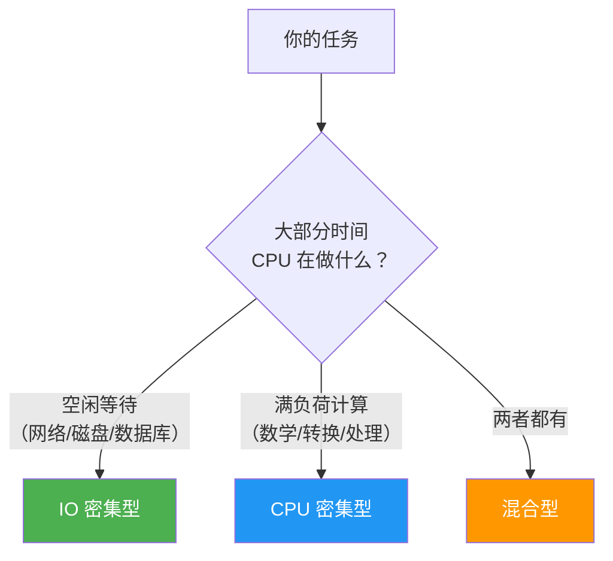
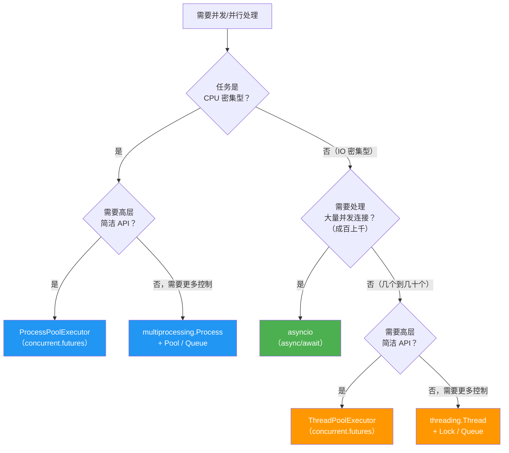

# 并发模式选择

> **所属路径**：`01_基础能力/01_开发环境与技术英语/07_并发编程/05_并发模式选择`
> **预计学习时间**：40 分钟
> **难度等级**：⭐⭐

---

## 前置知识

- [多线程与GIL](../01_多线程与GIL/01_多线程与GIL.md)（理解线程、GIL 和同步原语）
- [多进程与进程池](../02_多进程与进程池/02_多进程与进程池.md)（理解进程、进程池和进程间通信）
- [异步编程与asyncio](../03_异步编程与asyncio/03_异步编程与asyncio.md)（理解协程、事件循环和 async/await）
- [concurrent.futures](../04_concurrent.futures/04_concurrent.futures.md)（理解统一的执行器接口和 Future）

> 如果以上内容还不熟悉，建议先完成对应课程再继续。

---

## 学习目标

完成本节后，你将能够：

1. 准确区分 IO 密集型任务和 CPU 密集型任务
2. 根据任务特征选择合适的并发模型（多线程 / 多进程 / asyncio）
3. 解释三种并发模型在 GIL 影响、开销、可扩展性等维度的权衡
4. 设计混合并发方案来应对复杂的实际场景
5. 将并发编程知识应用于 AI/ML 工程中的典型任务

---

## 正文讲解

### 1. IO 密集型 vs CPU 密集型

在前面的课程中，我们反复提到"IO 密集型"和"CPU 密集型"这两个词。在做出并发模式选择之前，必须先准确判断你的任务属于哪一类——选错模型不仅不会加速，甚至可能比单线程还慢。

**IO 密集型任务（IO-bound）** 是指程序的大部分时间花在等待外部操作完成上：等待网络响应、等待磁盘读写、等待数据库查询返回。在等待期间，CPU 基本处于空闲状态。典型例子包括：

- 批量下载网页或 API 数据
- 读写大量文件
- 数据库查询
- 调用远程模型推理服务

**CPU 密集型任务（CPU-bound）** 是指程序的大部分时间花在计算上：数学运算、数据转换、图像处理、模型训练。CPU 始终在满负荷运行，没有空闲等待。典型例子包括：

- 矩阵乘法和数值计算
- 图像预处理（缩放、裁剪、增强）
- 特征工程中的批量转换
- 密码哈希计算

那么，如何判断一个任务到底是 IO 密集型还是 CPU 密集型呢？最简单的方法是 **观察 CPU 使用率** ：

```python
import time

def io_bound_task():
    """模拟 IO 密集型任务：大部分时间在等待"""
    time.sleep(1)  # 模拟网络请求，CPU 空闲
    return "done"

def cpu_bound_task():
    """模拟 CPU 密集型任务：大部分时间在计算"""
    total = 0
    for i in range(10_000_000):  # CPU 满负荷运算
        total += i * i
    return total
```

> 💡 **判断技巧**：运行你的程序时，打开系统的任务管理器或 `top` 命令。如果 CPU 使用率长时间接近 0%，说明是 IO 密集型；如果 CPU 使用率持续接近 100%，说明是 CPU 密集型。你也可以在代码中使用 `time.perf_counter()` 测量执行时间，对比总耗时和实际计算时间的差距。



> 📌 **图解说明**：任务分类的第一步是观察 CPU 的行为模式。很多实际任务是混合型的——比如"下载数据后再处理"，此时需要拆分任务，分别使用不同的并发模型。

### 2. 三种并发模型全景对比

经过前面四节课的学习，你已经掌握了 Python 的三大并发武器。下面这张表格把它们放在一起做一个全面对比：

| 维度 | 多线程（threading） | 多进程（multiprocessing） | 异步编程（asyncio） |
| ---- | ------------------- | ------------------------- | ------------------- |
| **适用任务** | IO 密集型 | CPU 密集型 | IO 密集型（高并发） |
| **GIL 影响** | ⚠️ 受限——同一时刻只有一个线程执行 Python 字节码 | ✅ 不受限——每个进程有自己的 GIL | ✅ 不受限——单线程内协作调度 |
| **真正并行** | ❌ 无法并行 CPU 计算 | ✅ 可以利用多核 CPU | ❌ 单线程，不并行 |
| **创建开销** | 低（共享内存空间） | 高（需要复制整个进程） | 极低（协程是轻量级对象） |
| **内存占用** | 低（线程共享内存） | 高（每个进程独立内存） | 极低（单线程） |
| **可扩展性** | 中等（数百线程） | 低（受 CPU 核心数限制） | 高（可调度数万协程） |
| **数据共享** | 简单（共享内存，需加锁） | 复杂（需 Queue/Pipe/Manager） | 简单（单线程，无竞态） |
| **调试难度** | 较高（竞态条件难复现） | 中等（进程隔离更清晰） | 中等（调用栈不直观） |
| **学习曲线** | 低 | 低 | 较高（需理解协程模型） |
| **生态兼容** | 广泛（大部分库都支持） | 广泛（但需注意 pickle 限制） | 需要异步版本的库 |

想一想：为什么没有一个"万能"的并发模型？因为 **每种模型都是在不同的约束条件下做出的权衡** ——线程轻量但受 GIL 限制，进程不受 GIL 限制但开销大，协程开销最小但需要整个调用链都是异步的。

### 3. 并发模式决策流程图

面对一个具体任务，如何选择并发模型？下面这个决策流程图可以帮助你快速做出判断：



> 📌 **图解说明**：这个决策树是一个简化的指导框架。实际项目中可能需要根据具体约束（如是否已有异步生态、团队熟悉程度等）灵活调整。一个核心原则是： **优先使用 `concurrent.futures`** ，它提供了最简洁的接口，且切换线程池/进程池只需改一行代码。

让我们用几个具体场景来验证这个决策流程：

| 场景 | 任务类型 | 推荐方案 | 理由 |
| ---- | -------- | -------- | ---- |
| 批量调用 API 获取数据（10 个请求） | IO 密集型，少量并发 | ThreadPoolExecutor | 简单高效，无需异步生态 |
| 爬取 1000 个网页 | IO 密集型，大量并发 | asyncio + aiohttp | 协程开销极低，可轻松管理上千并发 |
| 并行处理 10000 张图片 | CPU 密集型 | ProcessPoolExecutor | 利用多核，不受 GIL 限制 |
| Web 服务器处理请求 | IO 密集型，大量并发 | asyncio（FastAPI/Starlette） | 高并发 IO 是 asyncio 的主场 |
| 训练数据的特征工程 | CPU 密集型 | multiprocessing.Pool | 需要精细控制进程间共享数据 |

### 4. 混合模式：当单一模型不够用时

现实世界的任务往往不是纯粹的 IO 密集型或 CPU 密集型。比如，一个数据处理管道可能先从网络下载数据（IO 密集），再对数据进行复杂的转换（CPU 密集）。这时候就需要 **混合模式** 。

#### asyncio + ProcessPoolExecutor

`asyncio` 提供了 `loop.run_in_executor()` 方法，可以在事件循环中调用线程池或进程池执行阻塞操作：

```python
import asyncio
from concurrent.futures import ProcessPoolExecutor
import math

def cpu_heavy(n):
    """CPU 密集型：判断是否为素数"""
    if n < 2:
        return False
    for i in range(2, int(math.sqrt(n)) + 1):
        if n % i == 0:
            return False
    return True

async def check_primes(numbers):
    """异步调度 + 进程池执行 CPU 任务"""
    loop = asyncio.get_running_loop()
    with ProcessPoolExecutor() as pool:
        # 将 CPU 密集型任务交给进程池
        tasks = [
            loop.run_in_executor(pool, cpu_heavy, n)
            for n in numbers
        ]
        results = await asyncio.gather(*tasks)
    return dict(zip(numbers, results))

if __name__ == "__main__":
    nums = [15485863, 15485867, 32416187567, 100000007, 999999937]
    result = asyncio.run(check_primes(nums))
    for n, is_prime in result.items():
        print(f"  {n}: {'素数' if is_prime else '非素数'}")
```

**预期输出**：
```
  15485863: 素数
  15485867: 非素数
  32416187567: 素数
  100000007: 素数
  999999937: 素数
```

#### 多进程 + 多线程

在每个进程内部使用多线程来处理 IO 任务，进程之间并行执行 CPU 任务：

```python
from concurrent.futures import ProcessPoolExecutor
import time

def download_and_process(item):
    """每个进程内：先模拟下载（IO），再模拟处理（CPU）"""
    # 模拟下载（IO 密集）
    time.sleep(0.5)
    data = f"data_{item}"
    
    # 模拟处理（CPU 密集）
    result = sum(i * i for i in range(1_000_000))
    return f"{data} → 处理完成 (result={result % 1000})"

if __name__ == "__main__":
    items = list(range(8))
    
    # 用进程池并行处理
    with ProcessPoolExecutor(max_workers=4) as pool:
        results = list(pool.map(download_and_process, items))
    
    for r in results:
        print(f"  {r}")
```

> 💡 **选择混合模式的原则**：先分析任务的瓶颈在哪里。如果瓶颈是 IO，用 asyncio 或线程池；如果瓶颈是 CPU，用进程池。如果两者都有，把任务拆分成 IO 阶段和 CPU 阶段，分别使用最合适的模型。

### 5. AI/ML 工程中的并发应用

并发编程在人工智能工程中无处不在。让我们看看几个最典型的场景：

#### 数据加载：PyTorch DataLoader

PyTorch 的 `DataLoader` 是最经典的多进程应用之一。它使用多个工作进程并行加载和预处理训练数据，让 GPU 不用等待数据：

```python
# PyTorch DataLoader 的 num_workers 参数
# 就是在使用多进程加速数据加载
# 运行需要安装 torch 库，此处仅展示用法
from torch.utils.data import DataLoader

train_loader = DataLoader(
    dataset,
    batch_size=32,
    num_workers=4,   # 4 个工作进程并行加载数据
    pin_memory=True  # 配合 GPU 加速数据传输
)
```

> ⚠️ **注意**：这里展示的是 PyTorch 的实际用法，运行需要安装 `torch` 库。理解概念即可，不需要现在就运行。

#### 模型服务：FastAPI 异步框架

模型部署时，Web 服务器需要同时处理多个推理请求。FastAPI 使用 asyncio 实现高并发：

```python
# FastAPI 使用异步处理并发推理请求
# 运行需要: pip install fastapi uvicorn
from fastapi import FastAPI
import asyncio

app = FastAPI()

async def run_inference(text: str) -> str:
    """模拟模型推理"""
    await asyncio.sleep(0.1)  # 模拟推理耗时
    return f"结果: {text[::-1]}"

@app.post("/predict")
async def predict(text: str):
    result = await run_inference(text)
    return {"prediction": result}
```

#### 并行特征工程

大规模数据集的特征工程经常使用多进程加速：

```python
from concurrent.futures import ProcessPoolExecutor
import math

def extract_features(record):
    """为单条记录提取特征（CPU 密集型）"""
    features = {
        "log_value": math.log1p(abs(record["value"])),
        "squared": record["value"] ** 2,
        "category_hash": hash(record["category"]) % 1000,
    }
    return features

if __name__ == "__main__":
    # 模拟数据集
    dataset = [
        {"value": i * 0.1, "category": f"cat_{i % 5}"}
        for i in range(1000)
    ]
    
    # 并行提取特征
    with ProcessPoolExecutor(max_workers=4) as pool:
        features = list(pool.map(extract_features, dataset))
    
    print(f"处理了 {len(features)} 条记录")
    print(f"第一条特征: {features[0]}")
```

**预期输出**：
```
处理了 1000 条记录
第一条特征: {'log_value': 0.0, 'squared': 0.0, 'category_hash': ...}
```

下面这张表格总结了 AI/ML 工程中常见场景的并发模型选择：

| AI/ML 场景 | 并发模型 | 原因 |
| ---------- | -------- | ---- |
| 数据下载与爬取 | asyncio / ThreadPoolExecutor | IO 密集型，可能涉及大量并发连接 |
| 数据预处理与清洗 | ProcessPoolExecutor | CPU 密集型，需要多核并行 |
| 训练数据加载 | multiprocessing（DataLoader） | CPU 密集型预处理 + IO 读取 |
| 模型推理服务 | asyncio（FastAPI） | 高并发 IO，同时接受多个请求 |
| 批量推理 | ProcessPoolExecutor | CPU 密集型，批量并行计算 |
| 实验超参数搜索 | multiprocessing | 每组超参数独立训练，完全并行 |
| 分布式训练通信 | multiprocessing + 专用库 | 多 GPU/多节点间的数据同步 |

### 6. 性能对比实验

"纸上得来终觉浅"——让我们用一个完整的性能对比实验来验证前面的理论。我们分别测试 IO 密集型和 CPU 密集型任务在不同并发模型下的表现：

```python
import time
import asyncio
from concurrent.futures import ThreadPoolExecutor, ProcessPoolExecutor

# === IO 密集型任务 ===
def io_task(n):
    """模拟 IO 操作（网络请求等待）"""
    time.sleep(0.5)
    return n

async def async_io_task(n):
    """异步版本的 IO 操作"""
    await asyncio.sleep(0.5)
    return n

# === CPU 密集型任务 ===
def cpu_task(n):
    """CPU 密集型计算"""
    return sum(i * i for i in range(500_000))

def benchmark_sequential(task, items):
    """顺序执行基准"""
    start = time.perf_counter()
    results = [task(i) for i in items]
    return time.perf_counter() - start

def benchmark_threads(task, items, workers=4):
    """线程池"""
    start = time.perf_counter()
    with ThreadPoolExecutor(max_workers=workers) as exe:
        results = list(exe.map(task, items))
    return time.perf_counter() - start

def benchmark_processes(task, items, workers=4):
    """进程池"""
    start = time.perf_counter()
    with ProcessPoolExecutor(max_workers=workers) as exe:
        results = list(exe.map(task, items))
    return time.perf_counter() - start

async def benchmark_async(items):
    """asyncio"""
    start = time.perf_counter()
    tasks = [async_io_task(i) for i in items]
    results = await asyncio.gather(*tasks)
    return time.perf_counter() - start

if __name__ == "__main__":
    N = 8  # 任务数量
    items = list(range(N))
    
    print("=" * 55)
    print(f"性能对比实验（{N} 个任务，4 个工作线程/进程）")
    print("=" * 55)
    
    # IO 密集型测试
    print("\n📡 IO 密集型任务（每个任务等待 0.5 秒）")
    print("-" * 55)
    
    t_seq = benchmark_sequential(io_task, items)
    print(f"  顺序执行:       {t_seq:.2f}s")
    
    t_thread = benchmark_threads(io_task, items)
    print(f"  线程池:          {t_thread:.2f}s  "
          f"(加速 {t_seq/t_thread:.1f}x)")
    
    t_proc = benchmark_processes(io_task, items)
    print(f"  进程池:          {t_proc:.2f}s  "
          f"(加速 {t_seq/t_proc:.1f}x)")
    
    t_async = asyncio.run(benchmark_async(items))
    print(f"  asyncio:         {t_async:.2f}s  "
          f"(加速 {t_seq/t_async:.1f}x)")
    
    # CPU 密集型测试
    print(f"\n🔢 CPU 密集型任务（每个任务执行大量计算）")
    print("-" * 55)
    
    t_seq = benchmark_sequential(cpu_task, items)
    print(f"  顺序执行:       {t_seq:.2f}s")
    
    t_thread = benchmark_threads(cpu_task, items)
    print(f"  线程池:          {t_thread:.2f}s  "
          f"(加速 {t_seq/t_thread:.1f}x)")
    
    t_proc = benchmark_processes(cpu_task, items)
    print(f"  进程池:          {t_proc:.2f}s  "
          f"(加速 {t_seq/t_proc:.1f}x)")
    
    print("\n💡 结论：")
    print("  - IO 密集型 → 线程池和 asyncio 都有显著加速")
    print("  - CPU 密集型 → 只有进程池能真正并行加速")
    print("  - 线程池对 CPU 任务几乎无加速（GIL 限制）")
```

**预期输出**（具体数值因机器而异）：
```
=======================================================
性能对比实验（8 个任务，4 个工作线程/进程）
=======================================================

📡 IO 密集型任务（每个任务等待 0.5 秒）
-------------------------------------------------------
  顺序执行:       4.01s
  线程池:          1.01s  (加速 4.0x)
  进程池:          1.10s  (加速 3.6x)
  asyncio:         0.50s  (加速 8.0x)

🔢 CPU 密集型任务（每个任务执行大量计算）
-------------------------------------------------------
  顺序执行:       1.85s
  线程池:          1.90s  (加速 1.0x)
  进程池:          0.55s  (加速 3.4x)

💡 结论：
  - IO 密集型 → 线程池和 asyncio 都有显著加速
  - CPU 密集型 → 只有进程池能真正并行加速
  - 线程池对 CPU 任务几乎无加速（GIL 限制）
```

> 📌 **结果解读**：这个实验完美验证了我们的理论——IO 密集型任务中，asyncio 表现最好（所有协程同时等待，总耗时约等于单个任务的等待时间）；CPU 密集型任务中，只有进程池能带来真正的加速，线程池因为 GIL 的限制几乎没有提升。

### 7. 并发编程的通用原则

最后，无论选择哪种并发模型，以下几条通用原则都值得牢记：

**原则一：先测量，再优化**

不要猜测瓶颈在哪里。先用 `time.perf_counter()` 或 `cProfile` 测量，确定程序的时间到底花在了 IO 等待还是 CPU 计算上，然后再选择并发策略。

**原则二：从简单开始**

优先使用 `concurrent.futures` ——它的 API 最简洁，且在线程池和进程池之间切换只需改一行代码。只有当你需要精细控制（如自定义进程间通信、复杂的协程编排）时，才考虑使用底层的 `threading` 、 `multiprocessing` 或 `asyncio` 。

**原则三：优先消息传递，避免共享状态**

共享可变状态是并发 Bug 的最大来源。尽量使用 `Queue` 、 `Pipe` 等消息传递机制在线程/进程之间通信，而不是直接共享变量。如果必须共享，务必使用锁来保护。

**原则四：控制并发度**

并发并不是越多越好。线程太多会导致频繁的上下文切换，进程太多会耗尽系统资源。一般来说：
- 线程池大小：IO 密集型任务可以设置为 CPU 核心数的 2–4 倍
- 进程池大小：CPU 密集型任务设置为 CPU 核心数（`os.cpu_count()`）

**原则五：充分测试并发代码**

并发 Bug（如竞态条件、死锁）往往难以复现。编写并发代码后，要进行充分的测试，包括：
- 在不同的任务数量和并发度下测试
- 故意制造异常情况（如任务抛出异常、超时）
- 在多核机器上测试（单核可能掩盖竞态问题）


> 📌 **图解说明**：并发编程的最佳实践遵循"测量→选择→实现→验证"的闭环。蓝色代表分析阶段，绿色代表实现阶段，黄色代表验证阶段。

---

## 动手实践

让我们综合运用本章所学，编写一个完整的"并发方案选择演示器"。这个脚本接受不同类型的任务，自动选择最合适的并发模型执行，并报告性能对比结果。

```python
# 文件：code/concurrency_advisor.py
# 并发模式选择演示：根据任务特征自动推荐并发方案
import time
import asyncio
from concurrent.futures import ThreadPoolExecutor, ProcessPoolExecutor

# === 模拟不同类型的任务 ===

def simulate_io(duration=0.3):
    """模拟 IO 密集型任务"""
    time.sleep(duration)
    return "io_done"

def simulate_cpu(iterations=2_000_000):
    """模拟 CPU 密集型任务"""
    return sum(i * i for i in range(iterations))

async def simulate_async_io(duration=0.3):
    """模拟异步 IO 任务"""
    await asyncio.sleep(duration)
    return "async_io_done"

# === 并发方案推荐器 ===

def recommend_model(task_type: str, concurrency_level: int) -> str:
    """根据任务类型和并发量推荐并发模型"""
    if task_type == "cpu":
        return "ProcessPoolExecutor（CPU 密集型 → 多进程）"
    elif concurrency_level > 100:
        return "asyncio（IO 密集型 + 高并发 → 协程）"
    else:
        return "ThreadPoolExecutor（IO 密集型 + 中低并发 → 线程池）"

def run_comparison(task_type: str, count: int):
    """运行性能对比"""
    print(f"\n{'='*50}")
    print(f"任务类型: {task_type}, 任务数量: {count}")
    print(f"推荐方案: {recommend_model(task_type, count)}")
    print(f"{'='*50}")
    
    if task_type == "io":
        task = simulate_io
    else:
        task = simulate_cpu
    
    items = list(range(count))
    
    # 顺序执行
    start = time.perf_counter()
    [task() for _ in items]
    t_seq = time.perf_counter() - start
    print(f"  顺序执行:       {t_seq:.2f}s")
    
    # 线程池
    start = time.perf_counter()
    with ThreadPoolExecutor(max_workers=4) as exe:
        list(exe.map(lambda _: task(), items))
    t_thread = time.perf_counter() - start
    print(f"  线程池(4):       {t_thread:.2f}s  "
          f"(加速 {t_seq/t_thread:.1f}x)")
    
    # 进程池（注意：lambda 不能被 pickle，需要用顶层函数）
    if task_type == "cpu":
        start = time.perf_counter()
        with ProcessPoolExecutor(max_workers=4) as exe:
            list(exe.map(simulate_cpu, [2_000_000] * count))
        t_proc = time.perf_counter() - start
        print(f"  进程池(4):       {t_proc:.2f}s  "
              f"(加速 {t_seq/t_proc:.1f}x)")

if __name__ == "__main__":
    print("🔬 并发模式选择实验")
    
    # 实验 1：IO 密集型，少量任务
    run_comparison("io", 8)
    
    # 实验 2：CPU 密集型，少量任务
    run_comparison("cpu", 8)
    
    print(f"\n{'='*50}")
    print("📊 总结")
    print("  IO 密集型 → 线程池/asyncio 有效")
    print("  CPU 密集型 → 只有进程池有效")
    print("  选择原则: 先测量，再决策！")
```

**运行说明**：
- 环境要求：Python 3.10+（无第三方依赖）
- 运行命令：`python code/concurrency_advisor.py`

**预期输出**（具体数值因机器而异）：
```
🔬 并发模式选择实验

==================================================
任务类型: io, 任务数量: 8
推荐方案: ThreadPoolExecutor（IO 密集型 + 中低并发 → 线程池）
==================================================
  顺序执行:       2.40s
  线程池(4):       0.61s  (加速 3.9x)

==================================================
任务类型: cpu, 任务数量: 8
推荐方案: ProcessPoolExecutor（CPU 密集型 → 多进程）
==================================================
  顺序执行:       1.52s
  线程池(4):       1.55s  (加速 1.0x)
  进程池(4):       0.48s  (加速 3.2x)

==================================================
📊 总结
  IO 密集型 → 线程池/asyncio 有效
  CPU 密集型 → 只有进程池有效
  选择原则: 先测量，再决策！
```

---

## 典型误区

| 误区 | 正确理解 |
| ---- | -------- |
| "多进程总是比多线程快" | 多进程有更高的创建开销和内存占用，对 IO 密集型任务反而不如线程池高效 |
| "asyncio 可以加速任何任务" | asyncio 只对 IO 密集型任务有效，CPU 密集型任务需要进程池 |
| "并发越多越快" | 过多的线程/进程会导致上下文切换开销增大，反而降低性能 |
| "GIL 让 Python 多线程完全无用" | GIL 只限制 CPU 密集型的并行执行，IO 密集型任务中多线程仍然有效 |
| "只用一种并发模型就够了" | 复杂的实际项目常常需要混合模式：asyncio 处理 IO + ProcessPoolExecutor 处理 CPU |

---

## 练习题

### 练习 1：任务分类（难度：⭐）

下面列出了几种常见任务，请将它们分类为 IO 密集型或 CPU 密集型，并推荐合适的并发模型：

1. 从 10 个不同的 API 获取天气数据
2. 对 5000 张图片进行缩放和裁剪
3. 同时查询 3 个数据库表
4. 训练一个随机森林模型
5. 从 100 个网站爬取新闻标题

<details>
<summary>💡 提示</summary>

判断标准：任务的时间主要花在等待外部响应（IO）还是 CPU 计算上？

</details>

<details>
<summary>✅ 参考答案</summary>

1. **IO 密集型** → ThreadPoolExecutor 或 asyncio（网络请求，等待响应）
2. **CPU 密集型** → ProcessPoolExecutor（图像处理，大量计算）
3. **IO 密集型** → ThreadPoolExecutor（数据库查询，等待响应；数量少，无需 asyncio）
4. **CPU 密集型** → ProcessPoolExecutor 或直接使用 scikit-learn 内置的 `n_jobs` 参数
5. **IO 密集型** → asyncio + aiohttp（大量并发网络请求，asyncio 的主场）

</details>

### 练习 2：修复并发选择错误（难度：⭐⭐）

下面的代码使用了错误的并发模型，导致性能没有提升。请分析问题并修复：

```python
from concurrent.futures import ThreadPoolExecutor
import time

def heavy_computation(n):
    """CPU 密集型计算"""
    total = 0
    for i in range(n):
        total += i ** 2
    return total

if __name__ == "__main__":
    numbers = [5_000_000] * 8
    
    start = time.perf_counter()
    with ThreadPoolExecutor(max_workers=4) as exe:
        results = list(exe.map(heavy_computation, numbers))
    elapsed = time.perf_counter() - start
    
    print(f"耗时: {elapsed:.2f}s")
```

<details>
<summary>💡 提示</summary>

`heavy_computation` 是一个 CPU 密集型函数，但代码使用了 `ThreadPoolExecutor` 。回忆一下 GIL 对线程池执行 CPU 密集型任务的影响。

</details>

<details>
<summary>✅ 参考答案</summary>

问题：CPU 密集型任务使用了 `ThreadPoolExecutor` ，受 GIL 限制无法并行。

修复：将 `ThreadPoolExecutor` 改为 `ProcessPoolExecutor` ：

```python
from concurrent.futures import ProcessPoolExecutor
import time

def heavy_computation(n):
    """CPU 密集型计算"""
    total = 0
    for i in range(n):
        total += i ** 2
    return total

if __name__ == "__main__":
    numbers = [5_000_000] * 8
    
    start = time.perf_counter()
    # 修复：改用 ProcessPoolExecutor
    with ProcessPoolExecutor(max_workers=4) as exe:
        results = list(exe.map(heavy_computation, numbers))
    elapsed = time.perf_counter() - start
    
    print(f"耗时: {elapsed:.2f}s")
```

只需要修改一行代码——这正是 `concurrent.futures` 统一接口的优势！

</details>

### 练习 3：设计混合方案（难度：⭐⭐⭐）

假设你需要构建一个数据处理管道：
1. 从 20 个 URL 下载 JSON 数据（每个请求约 0.5 秒）
2. 对每条 JSON 数据进行复杂的解析和特征提取（每条约 0.3 秒 CPU 计算）
3. 将处理结果写入数据库（每条约 0.1 秒）

请设计一个使用混合并发模式的方案，写出伪代码并解释每个阶段为什么选择该并发模型。

<details>
<summary>💡 提示</summary>

三个阶段的特征分别是：IO 密集型（下载）、CPU 密集型（解析）、IO 密集型（写入）。考虑使用不同的并发模型处理每个阶段，或使用 `asyncio` + `run_in_executor()` 进行混合编排。

</details>

<details>
<summary>✅ 参考答案</summary>

```python
import asyncio
from concurrent.futures import ProcessPoolExecutor, ThreadPoolExecutor

# 阶段 1：下载数据（IO 密集型 → asyncio 或线程池）
async def download_all(urls):
    """用 asyncio 并发下载所有 URL"""
    async def fetch(url):
        await asyncio.sleep(0.5)  # 模拟网络请求
        return {"url": url, "data": "..."}
    
    tasks = [fetch(url) for url in urls]
    return await asyncio.gather(*tasks)

# 阶段 2：特征提取（CPU 密集型 → 进程池）
def extract_features(json_data):
    """CPU 密集型的特征提取"""
    import time
    time.sleep(0.3)  # 模拟 CPU 计算
    return {"features": f"processed_{json_data['url']}"}

# 阶段 3：写入数据库（IO 密集型 → 线程池）
def write_to_db(record):
    """IO 密集型的数据库写入"""
    import time
    time.sleep(0.1)  # 模拟数据库写入
    return True

async def pipeline(urls):
    loop = asyncio.get_running_loop()
    
    # 阶段 1：asyncio 并发下载（~0.5s 而非 10s）
    raw_data = await download_all(urls)
    print(f"下载完成: {len(raw_data)} 条")
    
    # 阶段 2：进程池并行处理（~1.5s 而非 6s）
    with ProcessPoolExecutor(max_workers=4) as pool:
        features = list(await asyncio.gather(*[
            loop.run_in_executor(pool, extract_features, d)
            for d in raw_data
        ]))
    print(f"特征提取完成: {len(features)} 条")
    
    # 阶段 3：线程池并发写入（~0.5s 而非 2s）
    with ThreadPoolExecutor(max_workers=8) as pool:
        results = list(await asyncio.gather(*[
            loop.run_in_executor(pool, write_to_db, f)
            for f in features
        ]))
    print(f"写入完成: {sum(results)} 条成功")

if __name__ == "__main__":
    urls = [f"https://api.example.com/data/{i}"
            for i in range(20)]
    asyncio.run(pipeline(urls))
```

**方案解释**：
- **阶段 1 用 asyncio** ：20 个网络请求全部并发，等待时间从 10 秒降至 0.5 秒
- **阶段 2 用 ProcessPoolExecutor** ：CPU 密集型计算需要多进程绕过 GIL，4 核并行降至约 1.5 秒
- **阶段 3 用 ThreadPoolExecutor** ：数据库写入是 IO 操作，线程池足够高效

总耗时从顺序执行的 18 秒降至约 2.5 秒。

</details>

---

## 下一步学习

- 📖 下一个知识主题：[网络与Web编程](../../08_网络与Web编程/)
- 🔗 相关知识点：[分布式训练](../../../../03_工程落地/01_人工智能工程化与部署/09_分布式训练/)（并发编程是分布式训练的基础）
- 🔗 相关知识点：[数据管道](../../../../03_工程落地/01_人工智能工程化与部署/04_数据管道/)（并行数据处理管道设计）

---

## 参考资料

1. [Python 官方文档 — threading](https://docs.python.org/3/library/threading.html) — 多线程模块的完整 API 参考（官方文档）
2. [Python 官方文档 — multiprocessing](https://docs.python.org/3/library/multiprocessing.html) — 多进程模块的完整 API 参考（官方文档）
3. [Python 官方文档 — asyncio](https://docs.python.org/3/library/asyncio.html) — 异步编程模块的完整 API 参考（官方文档）
4. [Python 官方文档 — concurrent.futures](https://docs.python.org/3/library/concurrent.futures.html) — 统一并发执行接口的参考（官方文档）
5. [RealPython — Speed Up Your Python Program With Concurrency](https://realpython.com/python-concurrency/) — 全面的 Python 并发编程指南，包含性能对比和最佳实践（免费技术博客）
