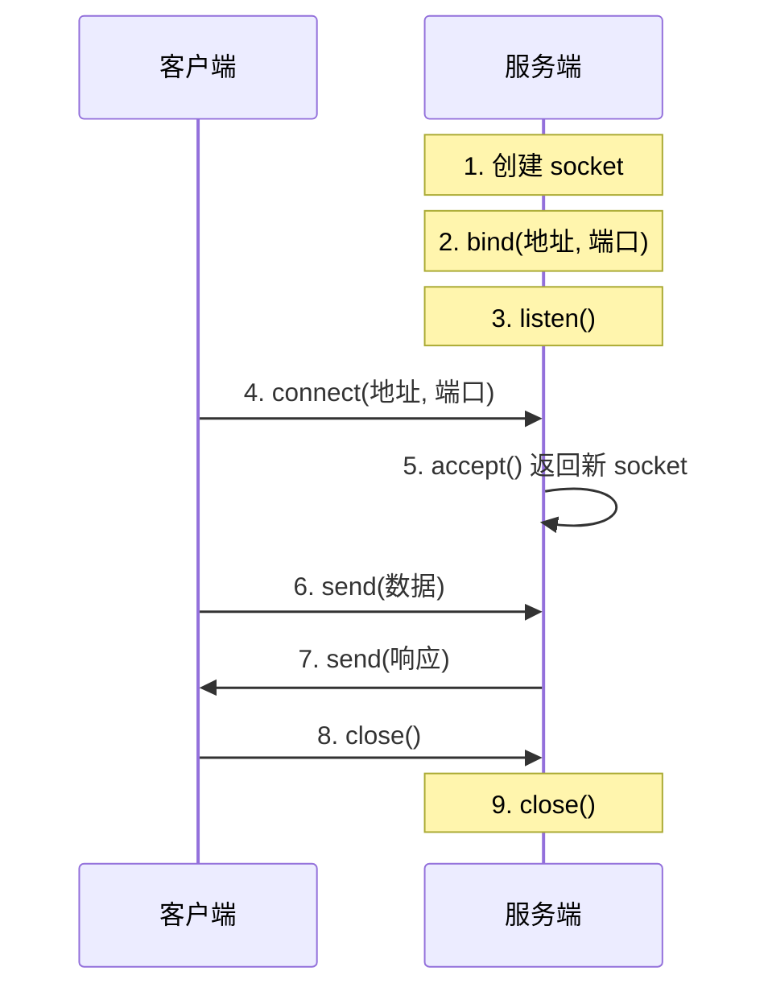

# socket编程基础

> **所属路径**：`01_基础能力/01_开发环境与技术英语/08_网络与Web编程/01_socket编程基础`
> **预计学习时间**：50 分钟
> **难度等级**：⭐⭐

---

## 前置知识

- [编程语言基础](../../01_编程语言基础/01_变量与数据类型/01_变量与数据类型.md)（了解基本数据类型和字节串）
- [异常处理](../../01_编程语言基础/05_异常处理/05_异常处理.md)（了解 try-except 和资源清理）
- [字符串与编码](../../02_字符串与编码/01_字符串方法与格式化/01_字符串方法与格式化.md)（了解字符串与字节串的转换）
- [传输控制与网际协议基础](../../../03_编程与计算机基础/05_计算机网络/01_传输控制与网际协议基础/)（了解 TCP/IP 协议栈的基本概念）

> 如果以上内容还不熟悉，建议先完成对应课程再继续。

---

## 学习目标

完成本节后，你将能够：

1. 解释 socket 在网络通信中的角色和工作原理
2. 使用 Python 的 `socket` 模块创建 TCP 客户端和服务端
3. 实现一个简单的回显（echo）服务器
4. 区分 TCP 和 UDP 的使用场景，并编写基本的 UDP 通信程序
5. 处理 socket 编程中的常见错误

---

## 正文讲解

### 1. 什么是 Socket？

想象你要给远方的朋友寄一封信。你需要知道对方的地址（IP 地址）和收件人姓名（端口号），还需要一个信封来装信件（socket）。**套接字（Socket）** 就是操作系统提供给应用程序的网络通信"接口"——它抽象了底层的网络协议细节，让你可以像读写文件一样收发网络数据。



> 📌 **图解说明**：TCP 通信的完整生命周期。服务端先准备好"信箱"（bind + listen），客户端主动发起连接（connect），双方通过 send/recv 交换数据，最后关闭连接。

Python 标准库中的 `socket` 模块直接映射了操作系统的 socket API，是理解网络编程的最佳起点。虽然日常开发中我们更多使用高层库（如 `requests`），但理解 socket 能帮助你：

- **排查网络问题**：当 HTTP 请求失败时，理解底层发生了什么
- **构建自定义协议**：某些场景（如实时游戏、IoT 设备）需要自定义通信协议
- **深入理解框架**：Web 框架（Flask、FastAPI）本质上就是封装了 socket 的高层抽象

### 2. 创建第一个 TCP 服务端

**传输控制协议（Transmission Control Protocol, TCP）** 是互联网上最常用的传输协议，它保证数据可靠、有序地到达。让我们用 Python 构建一个最简单的 TCP 服务端——**回显服务器（Echo Server）**，它接收客户端发来的任何消息，然后原样返回：

```python
# 文件：code/echo_server.py
import socket

# 创建 TCP socket
# AF_INET 表示使用 IPv4 地址
# SOCK_STREAM 表示使用 TCP 协议（流式传输）
server_socket = socket.socket(socket.AF_INET, socket.SOCK_STREAM)

# 允许地址重用，避免 "Address already in use" 错误
server_socket.setsockopt(socket.SOL_SOCKET, socket.SO_REUSEADDR, 1)

# 绑定到本机的 9999 端口
server_socket.bind(("127.0.0.1", 9999))

# 开始监听，参数是等待队列的最大长度
server_socket.listen(5)
print("Echo 服务器已启动，等待连接...")

try:
    while True:
        # accept() 阻塞等待客户端连接
        # 返回：(新的 socket 对象, 客户端地址)
        client_socket, client_addr = server_socket.accept()
        print(f"客户端 {client_addr} 已连接")

        try:
            while True:
                # 接收数据，最多 1024 字节
                data = client_socket.recv(1024)
                if not data:
                    # 客户端断开连接时 recv 返回空字节串
                    break
                print(f"收到: {data.decode('utf-8')}")
                # 原样返回数据
                client_socket.sendall(data)
        finally:
            client_socket.close()
            print(f"客户端 {client_addr} 已断开")
finally:
    server_socket.close()
```

这里有几个关键点值得注意：

- `socket.AF_INET` 指定使用 **IPv4** 地址族，`socket.SOCK_STREAM` 指定使用 **TCP** 协议
- `setsockopt(SO_REUSEADDR)` 允许程序重启后立即重新绑定端口，否则可能遇到"地址已被占用"的错误
- `accept()` 返回一个**新的 socket 对象**用于与该客户端通信，原始的 `server_socket` 继续监听新连接
- `sendall()` 比 `send()` 更安全——它确保所有数据都被发送，而 `send()` 可能只发送部分数据

### 3. 创建 TCP 客户端

有了服务端，我们再写一个客户端来连接它：

```python
# 文件：code/echo_client.py
import socket

# 创建 TCP socket
client_socket = socket.socket(socket.AF_INET, socket.SOCK_STREAM)

try:
    # 连接到服务端
    client_socket.connect(("127.0.0.1", 9999))
    print("已连接到服务器")

    # 发送数据
    message = "你好，Socket！"
    client_socket.sendall(message.encode("utf-8"))

    # 接收回显数据
    response = client_socket.recv(1024)
    print(f"服务器回复: {response.decode('utf-8')}")
finally:
    client_socket.close()
```

**运行说明**：
- 环境要求：Python 3.10+（无额外依赖）
- 运行步骤：先在一个终端运行 `python code/echo_server.py`，再在另一个终端运行 `python code/echo_client.py`

**预期输出**：

服务端终端：
```
Echo 服务器已启动，等待连接...
客户端 ('127.0.0.1', xxxxx) 已连接
收到: 你好，Socket！
客户端 ('127.0.0.1', xxxxx) 已断开
```

客户端终端：
```
已连接到服务器
服务器回复: 你好，Socket！
```

从输出中可以看到，客户端发送的消息被服务端原样返回了——这就是一个最基本的网络通信过程。

### 4. 用 `with` 语句简化资源管理

在上面的代码中，我们用 `try-finally` 来确保 socket 被关闭。Python 3.2+ 的 socket 对象支持 **[上下文管理器（Context Manager）](../../01_编程语言基础/06_装饰器与上下文管理器/)** 协议，可以用 `with` 语句更简洁地管理资源：

```python
# 文件：code/echo_client_with.py
import socket

with socket.socket(socket.AF_INET, socket.SOCK_STREAM) as s:
    s.connect(("127.0.0.1", 9999))
    s.sendall(b"Hello from with statement!")
    data = s.recv(1024)
    print(f"收到回复: {data.decode('utf-8')}")
```

### 5. UDP 通信——更轻量的选择

TCP 保证了数据的可靠传输，但这种可靠性是有代价的——三次握手建立连接、确认重传机制都会增加延迟。在某些场景下，我们更关心速度而不是可靠性（比如视频流、DNS 查询、游戏状态同步），这时可以使用 **用户数据报协议（User Datagram Protocol, UDP）** 。

| 对比项 | TCP | UDP |
| ------ | --- | --- |
| 连接方式 | 面向连接（需要三次握手） | 无连接（直接发送） |
| 可靠性 | 保证数据到达和顺序 | 不保证（可能丢包、乱序） |
| 速度 | 较慢（额外开销） | 较快（最小开销） |
| 适用场景 | HTTP、文件传输、邮件 | DNS、视频流、游戏同步 |

下面是一个简单的 UDP 通信示例：

```python
# 文件：code/udp_server.py
import socket

# SOCK_DGRAM 表示 UDP 协议
with socket.socket(socket.AF_INET, socket.SOCK_DGRAM) as s:
    s.bind(("127.0.0.1", 9998))
    print("UDP 服务器已启动...")

    while True:
        # recvfrom 返回 (数据, 发送方地址)
        data, addr = s.recvfrom(1024)
        print(f"来自 {addr}: {data.decode('utf-8')}")
        # 直接回复，无需建立连接
        s.sendto(f"收到: {data.decode('utf-8')}".encode("utf-8"), addr)
```

```python
# 文件：code/udp_client.py
import socket

with socket.socket(socket.AF_INET, socket.SOCK_DGRAM) as s:
    message = "UDP 你好！"
    s.sendto(message.encode("utf-8"), ("127.0.0.1", 9998))
    data, addr = s.recvfrom(1024)
    print(f"服务器回复: {data.decode('utf-8')}")
```

注意 UDP 编程与 TCP 的关键区别：

- 使用 `SOCK_DGRAM` 而非 `SOCK_STREAM`
- 服务端不需要 `listen()` 和 `accept()`
- 使用 `sendto()` / `recvfrom()` 代替 `send()` / `recv()`，因为每个数据包都需要指明目标地址

### 6. 常见错误与处理

socket 编程中最常遇到的几个错误：

```python
# 文件：code/socket_errors.py
import socket
import errno

def demo_socket_errors():
    """演示常见 socket 错误及处理方式"""

    # 1. ConnectionRefusedError —— 目标端口没有服务在监听
    try:
        with socket.socket(socket.AF_INET, socket.SOCK_STREAM) as s:
            s.settimeout(3)  # 设置超时，避免无限等待
            s.connect(("127.0.0.1", 19999))
    except ConnectionRefusedError:
        print("连接被拒绝：目标端口没有服务在监听")

    # 2. socket.timeout —— 连接或读取超时
    try:
        with socket.socket(socket.AF_INET, socket.SOCK_STREAM) as s:
            s.settimeout(1)
            s.connect(("192.0.2.1", 80))  # 不可达的地址
    except socket.timeout:
        print("连接超时：服务器无响应")

    # 3. OSError: Address already in use
    try:
        with socket.socket(socket.AF_INET, socket.SOCK_STREAM) as s1:
            s1.bind(("127.0.0.1", 19998))
            # 尝试绑定同一个端口
            with socket.socket(socket.AF_INET, socket.SOCK_STREAM) as s2:
                s2.bind(("127.0.0.1", 19998))
    except OSError as e:
        if e.errno == errno.EADDRINUSE:
            print(f"地址被占用：{e}")

if __name__ == "__main__":
    demo_socket_errors()
```

**运行说明**：
- 环境要求：Python 3.10+
- 运行命令：`python code/socket_errors.py`

**预期输出**：
```
连接被拒绝：目标端口没有服务在监听
连接超时：服务器无响应
地址被占用：[Errno 98] Address already in use
```

---

## 动手实践

前面我们已经在正文中实现了回显服务器。现在让我们把它改进一下——添加一个简单的消息协议，让服务端能正确处理变长消息：

```python
# 文件：code/length_prefix_server.py
import socket
import struct

def recv_exact(sock, n):
    """确保接收到恰好 n 个字节"""
    data = b""
    while len(data) < n:
        chunk = sock.recv(n - len(data))
        if not chunk:
            raise ConnectionError("连接意外断开")
        data += chunk
    return data

def send_message(sock, message):
    """发送带长度前缀的消息"""
    encoded = message.encode("utf-8")
    # 用 4 字节大端序整数表示消息长度
    header = struct.pack(">I", len(encoded))
    sock.sendall(header + encoded)

def recv_message(sock):
    """接收带长度前缀的消息"""
    header = recv_exact(sock, 4)
    length = struct.unpack(">I", header)[0]
    data = recv_exact(sock, length)
    return data.decode("utf-8")

# 服务端主循环
with socket.socket(socket.AF_INET, socket.SOCK_STREAM) as server:
    server.setsockopt(socket.SOL_SOCKET, socket.SO_REUSEADDR, 1)
    server.bind(("127.0.0.1", 9997))
    server.listen(5)
    print("长度前缀服务器已启动...")

    client, addr = server.accept()
    with client:
        print(f"客户端 {addr} 已连接")
        msg = recv_message(client)
        print(f"收到消息: {msg}")
        send_message(client, f"服务端收到了你的消息，长度为 {len(msg)} 字符")
```

```python
# 文件：code/length_prefix_client.py
import socket
import struct

def recv_exact(sock, n):
    data = b""
    while len(data) < n:
        chunk = sock.recv(n - len(data))
        if not chunk:
            raise ConnectionError("连接意外断开")
        data += chunk
    return data

def send_message(sock, message):
    encoded = message.encode("utf-8")
    header = struct.pack(">I", len(encoded))
    sock.sendall(header + encoded)

def recv_message(sock):
    header = recv_exact(sock, 4)
    length = struct.unpack(">I", header)[0]
    data = recv_exact(sock, length)
    return data.decode("utf-8")

with socket.socket(socket.AF_INET, socket.SOCK_STREAM) as s:
    s.connect(("127.0.0.1", 9997))
    send_message(s, "这是一条变长消息，可以包含任意长度的中文内容！🎉")
    reply = recv_message(s)
    print(f"服务器回复: {reply}")
```

**运行说明**：
- 运行步骤：先运行 `python code/length_prefix_server.py`，再运行 `python code/length_prefix_client.py`

**预期输出**：

客户端：
```
服务器回复: 服务端收到了你的消息，长度为 24 字符
```

这个"长度前缀协议"解决了 TCP 的 **粘包问题**——因为 TCP 是字节流协议，多次 `send()` 的数据可能被合并为一次 `recv()`，或者一次 `send()` 的数据被拆分为多次 `recv()`。通过在每条消息前加上 4 字节的长度信息，接收方就能精确地知道该读取多少字节。

---

## 典型误区

| 误区 | 正确理解 |
| ---- | -------- |
| `recv(1024)` 一定能收到 1024 字节 | `recv(1024)` 最多收 1024 字节，实际可能更少。必须循环读取直到收满需要的数据量 |
| TCP 发一次就是收一次（消息边界） | TCP 是**字节流**协议，没有消息边界。一次 `send` 的数据可能分多次 `recv` 到达，多次 `send` 的数据也可能合并为一次 `recv` |
| `send()` 一定能发完所有数据 | `send()` 可能只发送部分数据，应使用 `sendall()` 确保完整发送 |
| UDP 比 TCP 好 | TCP 和 UDP 各有适用场景。需要可靠传输用 TCP，需要低延迟容忍丢包用 UDP |

---

## 练习题

### 练习 1：多消息回显客户端（难度：⭐）

修改 `echo_client.py`，让客户端可以循环发送多条消息（从键盘输入），输入 `quit` 时退出。

<details>
<summary>💡 提示</summary>

使用 `while True` 循环和 `input()` 获取用户输入，判断输入是否为 `"quit"` 来决定是否退出循环。

</details>

<details>
<summary>✅ 参考答案</summary>

```python
import socket

with socket.socket(socket.AF_INET, socket.SOCK_STREAM) as s:
    s.connect(("127.0.0.1", 9999))
    print("已连接，输入 quit 退出")
    while True:
        msg = input(">>> ")
        if msg.strip().lower() == "quit":
            break
        s.sendall(msg.encode("utf-8"))
        data = s.recv(1024)
        print(f"回复: {data.decode('utf-8')}")
```

</details>

### 练习 2：简易聊天室（难度：⭐⭐⭐）

基于 TCP socket，实现一个支持多个客户端同时连接的聊天服务器。服务端收到任何一个客户端的消息后，将其广播给所有其他已连接的客户端。

<details>
<summary>💡 提示</summary>

使用 `threading` 模块为每个客户端连接创建一个独立的线程。维护一个全局的客户端 socket 列表，广播时遍历列表逐个发送。注意线程安全——使用 `threading.Lock` 保护共享的客户端列表。

</details>

<details>
<summary>✅ 参考答案</summary>

```python
import socket
import threading

clients = []
lock = threading.Lock()

def handle_client(client_socket, addr):
    try:
        while True:
            data = client_socket.recv(1024)
            if not data:
                break
            message = f"[{addr}] {data.decode('utf-8')}"
            print(message)
            with lock:
                for c in clients:
                    if c != client_socket:
                        try:
                            c.sendall(message.encode("utf-8"))
                        except OSError:
                            pass
    finally:
        with lock:
            clients.remove(client_socket)
        client_socket.close()
        print(f"{addr} 已断开")

with socket.socket(socket.AF_INET, socket.SOCK_STREAM) as server:
    server.setsockopt(socket.SOL_SOCKET, socket.SO_REUSEADDR, 1)
    server.bind(("127.0.0.1", 9996))
    server.listen(10)
    print("聊天室已启动...")
    while True:
        client, addr = server.accept()
        with lock:
            clients.append(client)
        print(f"{addr} 已加入")
        threading.Thread(target=handle_client, args=(client, addr), daemon=True).start()
```

</details>

---

## 下一步学习

- 📖 下一个知识点：[HTTP客户端与requests](../02_HTTP客户端与requests/02_HTTP客户端与requests.md)
- 🔗 相关知识点：[传输控制与网际协议基础](../../../03_编程与计算机基础/05_计算机网络/01_传输控制与网际协议基础/)
- 🔗 相关知识点：[异步编程与asyncio](../../07_并发编程/03_异步编程与asyncio/)

---

## 参考资料

1. [Python socket 官方文档](https://docs.python.org/3/library/socket.html) — Python 标准库文档，socket 模块完整 API 参考（官方文档）
2. [Socket Programming HOWTO](https://docs.python.org/3/howto/sockets.html) — Python 官方的 socket 编程入门教程（官方文档）
3. [Beej's Guide to Network Programming](https://beej.us/guide/bgnet/) — 经典的网络编程入门指南，虽然用 C 语言，但概念通用（公开免费教程，CC BY-NC-ND 许可）
