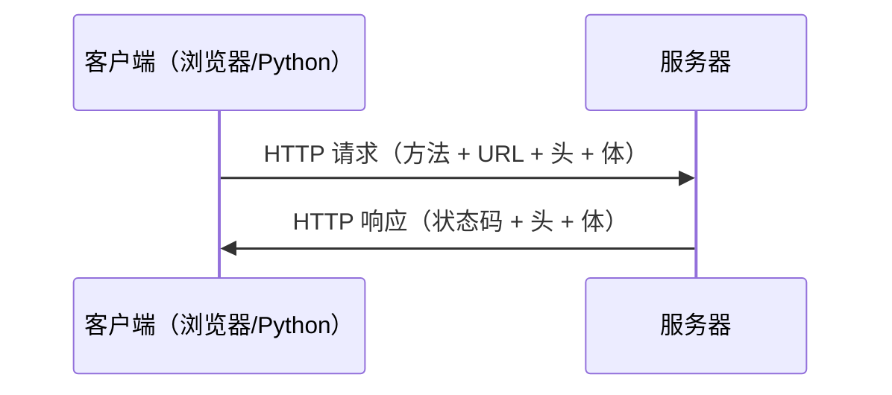

# HTTP客户端与requests

> **所属路径**：`01_基础能力/01_开发环境与技术英语/08_网络与Web编程/02_HTTP客户端与requests`
> **预计学习时间**：50 分钟
> **难度等级**：⭐⭐

---

## 前置知识

- [socket编程基础](../01_socket编程基础/01_socket编程基础.md)（了解 TCP 通信的基本流程）
- [字符串与编码](../../02_字符串与编码/01_字符串方法与格式化/01_字符串方法与格式化.md)（了解字符串编码和字节串转换）
- [超文本传输协议与接口](../../../03_编程与计算机基础/05_计算机网络/02_超文本传输协议与接口/)（了解 HTTP 协议基础概念）

> 如果以上内容还不熟悉，建议先完成对应课程再继续。

---

## 学习目标

完成本节后，你将能够：

1. 解释 HTTP 协议的请求-响应模型和常用方法（GET、POST、PUT、DELETE）
2. 使用 Python 标准库 `urllib` 发送基本 HTTP 请求
3. 使用 `requests` 库发送各种类型的 HTTP 请求并处理响应
4. 正确处理响应编码、超时和错误
5. 使用 `Session` 对象复用连接和维持会话状态

---

## 正文讲解

### 1. HTTP 协议快速回顾

在上一课中，我们学会了用 socket 直接收发字节数据。但在实际互联网应用中，浏览器和服务器之间并不直接传输原始字节，而是通过 **超文本传输协议（Hypertext Transfer Protocol, HTTP）** 进行结构化通信。

HTTP 的工作模式非常简单——**请求-响应（Request-Response）** ：



> 📌 **图解说明**：HTTP 通信的核心模型。客户端发起请求，服务器返回响应，每次交互都是独立的（无状态）。

HTTP 定义了几种常用的 **请求方法（Request Method）** ：

| 方法 | 用途 | 示例场景 |
| ---- | ---- | -------- |
| GET | 获取资源 | 获取网页、查询数据 |
| POST | 提交数据 | 提交表单、上传文件 |
| PUT | 更新资源 | 修改用户信息 |
| DELETE | 删除资源 | 删除一条记录 |
| PATCH | 部分更新 | 只修改某个字段 |

### 2. 用标准库发送请求——urllib

Python 内置的 `urllib` 模块可以发送 HTTP 请求，无需安装第三方库：

```python
# 文件：code/urllib_demo.py
from urllib.request import urlopen, Request
from urllib.error import URLError, HTTPError
import json

# 最简单的 GET 请求
try:
    with urlopen("https://httpbin.org/get", timeout=10) as response:
        # 读取响应体
        body = response.read()
        # 查看响应信息
        print(f"状态码: {response.status}")
        print(f"Content-Type: {response.headers['Content-Type']}")
        # 解码并解析 JSON
        data = json.loads(body.decode("utf-8"))
        print(f"你的 IP: {data.get('origin', '未知')}")
except HTTPError as e:
    print(f"HTTP 错误: {e.code} {e.reason}")
except URLError as e:
    print(f"网络错误: {e.reason}")
```

`urllib` 能工作，但用起来比较繁琐——需要手动处理编码、手动构建 POST 请求体、异常处理也不够直观。这就是为什么 Python 社区几乎都选择使用 **requests** 库。

### 3. requests——给人类用的 HTTP 库

**requests** 是 Python 生态中最流行的 HTTP 客户端库，它的口号是 *"HTTP for Humans"*。相比 `urllib` ，它的 API 更简洁、功能更强大：

```python
# 文件：code/requests_demo.py
# 环境要求：pip install requests
import requests

# ===== GET 请求 =====
response = requests.get("https://httpbin.org/get", timeout=10)
print(f"状态码: {response.status_code}")
print(f"编码: {response.encoding}")

# 自动解码的文本内容
print(f"文本内容（前 200 字符）: {response.text[:200]}")

# 如果响应是 JSON，可以直接解析
data = response.json()
print(f"你的 IP: {data['origin']}")

# ===== 带参数的 GET 请求 =====
# requests 自动处理 URL 编码
params = {"q": "Python 教程", "page": 1}
response = requests.get("https://httpbin.org/get", params=params, timeout=10)
print(f"\n请求 URL: {response.url}")
# 输出: https://httpbin.org/get?q=Python+%E6%95%99%E7%A8%8B&page=1

# ===== POST 请求（发送 JSON 数据） =====
payload = {"name": "张三", "age": 25}
response = requests.post("https://httpbin.org/post", json=payload, timeout=10)
result = response.json()
print(f"\n服务器收到的 JSON: {result['json']}")

# ===== POST 请求（发送表单数据） =====
form_data = {"username": "alice", "password": "secret123"}
response = requests.post("https://httpbin.org/post", data=form_data, timeout=10)
result = response.json()
print(f"服务器收到的表单: {result['form']}")

# ===== 自定义请求头 =====
headers = {
    "User-Agent": "MyPythonApp/1.0",
    "Accept-Language": "zh-CN",
}
response = requests.get("https://httpbin.org/headers", headers=headers, timeout=10)
print(f"\n服务器看到的请求头: {response.json()['headers']}")
```

**运行说明**：
- 环境要求：Python 3.10+, requests（`pip install requests`）
- 运行命令：`python code/requests_demo.py`

**预期输出**（部分）：
```
状态码: 200
编码: utf-8
你的 IP: xxx.xxx.xxx.xxx
请求 URL: https://httpbin.org/get?q=Python+%E6%95%99%E7%A8%8B&page=1
服务器收到的 JSON: {'name': '张三', 'age': 25}
```

从代码对比可以看出，requests 的优势非常明显：

- **自动编码**：`response.text` 自动检测并解码字符编码
- **JSON 支持**：`response.json()` 直接解析，发送时用 `json=` 参数自动序列化
- **参数处理**：`params=` 自动进行 URL 编码
- **简洁 API**：每种 HTTP 方法对应一个同名函数

### 4. 响应对象详解

`requests.get()` 等方法返回一个 `Response` 对象，包含了服务器响应的所有信息：

```python
# 文件：code/response_detail.py
import requests

response = requests.get("https://httpbin.org/get", timeout=10)

# 状态信息
print(f"状态码: {response.status_code}")         # 200
print(f"是否成功: {response.ok}")                 # True（状态码 < 400）
print(f"原因短语: {response.reason}")             # OK

# 响应头（不区分大小写的字典）
print(f"Content-Type: {response.headers['content-type']}")

# 响应体
print(f"文本长度: {len(response.text)}")          # 解码后的字符串
print(f"字节长度: {len(response.content)}")       # 原始字节

# 请求信息（反查发出去的请求）
print(f"请求方法: {response.request.method}")     # GET
print(f"请求 URL: {response.request.url}")

# 耗时
print(f"请求耗时: {response.elapsed.total_seconds():.3f}s")
```

### 5. 错误处理与超时

网络请求不可能总是成功的。健壮的代码必须处理各种失败情况：

```python
# 文件：code/error_handling.py
import requests
from requests.exceptions import (
    ConnectionError,
    Timeout,
    HTTPError,
    RequestException,
)

def safe_request(url, **kwargs):
    """安全的 HTTP 请求封装"""
    try:
        response = requests.get(url, timeout=5, **kwargs)
        # 如果状态码表示错误（4xx 或 5xx），抛出 HTTPError
        response.raise_for_status()
        return response
    except ConnectionError:
        print(f"连接失败：无法连接到 {url}")
    except Timeout:
        print(f"请求超时：{url} 响应时间过长")
    except HTTPError as e:
        print(f"HTTP 错误：{e.response.status_code} {e.response.reason}")
    except RequestException as e:
        print(f"请求异常：{e}")
    return None

# 测试各种情况
print("--- 正常请求 ---")
resp = safe_request("https://httpbin.org/get")
if resp:
    print(f"成功！状态码: {resp.status_code}")

print("\n--- 404 错误 ---")
safe_request("https://httpbin.org/status/404")

print("\n--- 超时 ---")
safe_request("https://httpbin.org/delay/10")  # 服务器延迟 10 秒

print("\n--- 连接失败 ---")
safe_request("https://this-domain-does-not-exist.example.com")
```

**运行说明**：
- 环境要求：Python 3.10+, requests
- 运行命令：`python code/error_handling.py`

**预期输出**：
```
--- 正常请求 ---
成功！状态码: 200

--- 404 错误 ---
HTTP 错误：404 NOT FOUND

--- 超时 ---
请求超时：https://httpbin.org/delay/10 响应时间过长

--- 连接失败 ---
连接失败：无法连接到 https://this-domain-does-not-exist.example.com
```

> ⚠️ **重要提醒**：始终为 HTTP 请求设置 `timeout` 参数！如果不设置超时，程序可能会在网络异常时无限等待，导致整个程序卡住。

### 6. Session——复用连接与会话状态

如果你需要向同一个服务器发送多次请求（比如先登录再查询数据），使用 `Session` 对象可以：

- **复用 TCP 连接**，减少建立连接的开销
- **自动保持 Cookie**，维持登录状态
- **共享默认参数**，如请求头、认证信息

```python
# 文件：code/session_demo.py
import requests

# 创建 Session 对象
session = requests.Session()

# 设置全局默认请求头
session.headers.update({
    "User-Agent": "MyApp/1.0",
    "Accept": "application/json",
})

# 第一次请求：设置 Cookie
session.get("https://httpbin.org/cookies/set/token/abc123", timeout=10)

# 第二次请求：Cookie 自动携带
response = session.get("https://httpbin.org/cookies", timeout=10)
print(f"当前 Cookie: {response.json()['cookies']}")
# 输出: {'token': 'abc123'}

# Session 也支持 with 语句
with requests.Session() as s:
    s.headers["Authorization"] = "Bearer my_token"
    resp = s.get("https://httpbin.org/headers", timeout=10)
    print(f"Auth 头: {resp.json()['headers'].get('Authorization')}")

# 关闭 Session（with 语句会自动关闭）
session.close()
```

---

## 动手实践

让我们结合前面学到的知识，实现一个简单的"网页标题提取器"，它可以获取任意网页的标题：

```python
# 文件：code/title_fetcher.py
import requests
import re

def fetch_title(url):
    """获取网页标题"""
    try:
        response = requests.get(url, timeout=10, headers={
            "User-Agent": "Mozilla/5.0 (compatible; TitleBot/1.0)"
        })
        response.raise_for_status()

        # 确保正确的编码
        # requests 有时会猜错编码，apparent_encoding 更准确
        if response.encoding == "ISO-8859-1":
            response.encoding = response.apparent_encoding

        # 用正则提取 <title> 标签内容
        match = re.search(r"<title[^>]*>(.*?)</title>", response.text, re.IGNORECASE | re.DOTALL)
        if match:
            title = match.group(1).strip()
            # 清理多余的空白字符
            title = re.sub(r"\s+", " ", title)
            return title
        return "(未找到标题)"

    except requests.RequestException as e:
        return f"(请求失败: {e})"

# 测试几个网站
urls = [
    "https://www.python.org",
    "https://docs.python.org/3/",
    "https://github.com",
]

for url in urls:
    title = fetch_title(url)
    print(f"{url}\n  标题: {title}\n")
```

**运行说明**：
- 环境要求：Python 3.10+, requests
- 运行命令：`python code/title_fetcher.py`

**预期输出**（标题可能因网站更新而变化）：
```
https://www.python.org
  标题: Welcome to Python.org

https://docs.python.org/3/
  标题: 3.x.x Documentation

https://github.com
  标题: GitHub: Let's build from here
```

---

## 典型误区

| 误区 | 正确理解 |
| ---- | -------- |
| 不设置 timeout | **必须**设置 timeout，否则网络异常时程序会无限等待。建议设置 `timeout=(连接超时, 读取超时)`，如 `timeout=(3, 10)` |
| 用 `response.text` 获取二进制数据 | 下载图片、PDF 等二进制文件应使用 `response.content`（字节串），而不是 `response.text`（字符串） |
| 不检查状态码就使用响应 | 始终用 `response.raise_for_status()` 或检查 `response.ok` 确认请求成功后再处理数据 |
| 每次请求都创建新连接 | 多次请求同一服务器时，使用 `Session` 对象复用连接，显著提升性能 |

---

## 练习题

### 练习 1：JSON 数据获取（难度：⭐）

使用 requests 向 `https://httpbin.org/json` 发送 GET 请求，解析 JSON 响应并打印其中的 `slideshow.title` 字段。

<details>
<summary>💡 提示</summary>

使用 `response.json()` 将响应解析为 Python 字典，然后通过键访问嵌套数据：`data["slideshow"]["title"]` 。

</details>

<details>
<summary>✅ 参考答案</summary>

```python
import requests

response = requests.get("https://httpbin.org/json", timeout=10)
response.raise_for_status()
data = response.json()
print(f"标题: {data['slideshow']['title']}")
# 输出: 标题: Sample Slide Show
```

</details>

### 练习 2：带重试的下载函数（难度：⭐⭐）

实现一个函数 `download_with_retry(url, max_retries=3)`，当请求失败时自动重试，每次重试前等待递增的时间（1 秒、2 秒、3 秒）。成功时返回响应文本，全部失败时返回 `None` 。

<details>
<summary>💡 提示</summary>

使用 `for i in range(max_retries)` 循环，在 `except` 块中用 `time.sleep(i + 1)` 实现递增等待。

</details>

<details>
<summary>✅ 参考答案</summary>

```python
import requests
import time

def download_with_retry(url, max_retries=3):
    for attempt in range(max_retries):
        try:
            response = requests.get(url, timeout=5)
            response.raise_for_status()
            return response.text
        except requests.RequestException as e:
            wait = attempt + 1
            print(f"第 {attempt + 1} 次尝试失败: {e}")
            if attempt < max_retries - 1:
                print(f"等待 {wait} 秒后重试...")
                time.sleep(wait)
    print("所有重试均失败")
    return None

# 测试
text = download_with_retry("https://httpbin.org/get")
if text:
    print(f"成功获取 {len(text)} 字符")
```

</details>

### 练习 3：文件下载器（难度：⭐⭐）

使用 requests 下载一个文件（如 `https://httpbin.org/image/png`），以流式方式写入本地文件 `download.png` 。要求使用 `stream=True` 参数和分块写入。

<details>
<summary>💡 提示</summary>

使用 `requests.get(url, stream=True)` 开启流模式，然后用 `response.iter_content(chunk_size=8192)` 逐块读取并写入文件。

</details>

<details>
<summary>✅ 参考答案</summary>

```python
import requests

def download_file(url, filename):
    with requests.get(url, stream=True, timeout=30) as response:
        response.raise_for_status()
        with open(filename, "wb") as f:
            for chunk in response.iter_content(chunk_size=8192):
                f.write(chunk)
    print(f"已下载: {filename}")

download_file("https://httpbin.org/image/png", "download.png")
```

</details>

---

## 下一步学习

- 📖 下一个知识点：[Web API调用与认证](../03_Web_API调用与认证/03_Web_API调用与认证.md)
- 🔗 相关知识点：[超文本传输协议与接口](../../../03_编程与计算机基础/05_计算机网络/02_超文本传输协议与接口/)
- 📚 拓展阅读：[requests 高级用法](https://docs.python-requests.org/en/latest/user/advanced/)

---

## 参考资料

1. [requests 官方文档](https://docs.python-requests.org/en/latest/) — Python 最流行的 HTTP 库的完整文档（开源项目，Apache 2.0 许可）
2. [Python urllib 官方文档](https://docs.python.org/3/library/urllib.html) — Python 标准库 HTTP 模块参考（官方文档）
3. [httpbin.org](https://httpbin.org/) — 免费的 HTTP 请求测试服务，支持各种 HTTP 方法和场景（开源项目）
4. [MDN HTTP 教程](https://developer.mozilla.org/zh-CN/docs/Web/HTTP) — Mozilla 提供的 HTTP 协议全面教程（CC BY-SA 许可）
