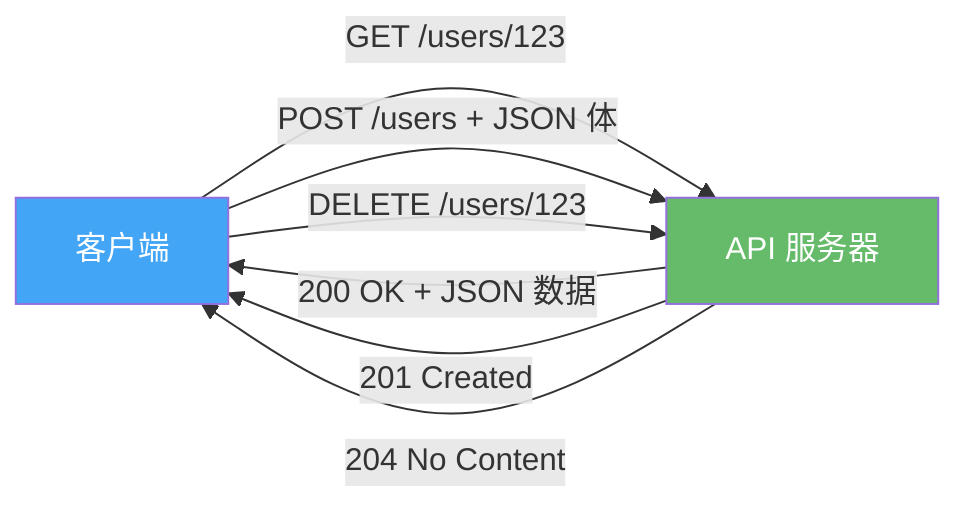
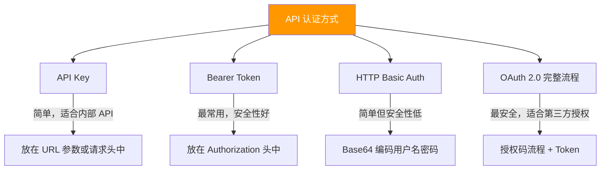

# Web API调用与认证

> **所属路径**：`01_基础能力/01_开发环境与技术英语/08_网络与Web编程/03_Web_API调用与认证`
> **预计学习时间**：55 分钟
> **难度等级**：⭐⭐⭐

---

## 前置知识

- [HTTP客户端与requests](../02_HTTP客户端与requests/02_HTTP客户端与requests.md)（掌握 requests 库的基本使用）
- [字符串与编码](../../02_字符串与编码/01_字符串方法与格式化/01_字符串方法与格式化.md)（了解 JSON 数据格式）
- [异常处理](../../01_编程语言基础/05_异常处理/05_异常处理.md)（掌握异常处理模式）

> 如果以上内容还不熟悉，建议先完成对应课程再继续。

---

## 学习目标

完成本节后，你将能够：

1. 解释 REST API 的基本设计原则和常见约定
2. 使用 API Key、Bearer Token 等方式进行 API 认证
3. 正确处理分页、速率限制和错误响应
4. 解析嵌套的 JSON 响应数据
5. 编写健壮的 API 调用函数，包含重试和日志

---

## 正文讲解

### 1. 什么是 Web API？

在上一课中，我们用 requests 获取了网页内容——那是人类阅读的 HTML 页面。但现代互联网中，程序之间的通信更多依赖 **Web API（应用程序编程接口）** ——服务器返回的不是 HTML，而是结构化的数据（通常是 JSON），专门给程序读取。

举个例子：当你打开天气 App 查看天气时，App 并不是去解析天气网站的 HTML 页面，而是直接调用天气服务的 API，获取结构化的天气数据：

```json
{
    "city": "北京",
    "temperature": 22,
    "weather": "晴",
    "humidity": 45
}
```

目前最流行的 Web API 设计风格是 **REST（Representational State Transfer，表述性状态转移）** 。REST API 的核心思想很简单：

- 用 **URL** 表示资源（如 `/users/123` 表示编号为 123 的用户）
- 用 **HTTP 方法** 表示操作（GET 查询、POST 创建、PUT 更新、DELETE 删除）
- 用 **状态码** 表示结果（200 成功、404 未找到、401 未授权、500 服务器错误）



> 📌 **图解说明**：REST API 的核心模式——客户端通过不同的 HTTP 方法对 URL 表示的资源执行不同操作。

### 2. API 认证方式

大多数有价值的 API 都需要 **认证（Authentication）** ——服务端需要知道"你是谁"以及"你有没有权限"。常见的认证方式有三种：

#### API Key

最简单的认证方式，服务端分配一个密钥字符串，客户端在每次请求中附带：

```python
# 文件：code/api_key_demo.py
import requests

API_KEY = "your_api_key_here"  # 实际使用时从环境变量读取

# 方式 1：通过 URL 参数传递
response = requests.get(
    "https://httpbin.org/get",
    params={"api_key": API_KEY},
    timeout=10,
)
print(f"URL 参数方式: {response.url}")

# 方式 2：通过请求头传递（更安全，不会出现在 URL 中）
response = requests.get(
    "https://httpbin.org/get",
    headers={"X-API-Key": API_KEY},
    timeout=10,
)
print(f"请求头方式: {response.status_code}")
```

#### Bearer Token

OAuth 2.0 体系中最常用的方式，Token 通过 `Authorization` 请求头传递：

```python
# 文件：code/bearer_token_demo.py
import requests

TOKEN = "your_bearer_token_here"

response = requests.get(
    "https://httpbin.org/bearer",
    headers={"Authorization": f"Bearer {TOKEN}"},
    timeout=10,
)
print(f"状态码: {response.status_code}")
print(f"认证结果: {response.json()}")
```

#### HTTP 基本认证

最古老的认证方式，用户名和密码通过 Base64 编码后放在请求头中。requests 对此有原生支持：

```python
# 文件：code/basic_auth_demo.py
import requests

response = requests.get(
    "https://httpbin.org/basic-auth/user/passwd",
    auth=("user", "passwd"),  # requests 自动处理 Base64 编码
    timeout=10,
)
print(f"状态码: {response.status_code}")
print(f"响应: {response.json()}")
```



> 📌 **图解说明**：四种常见的 API 认证方式，按安全性从低到高排列。日常使用中 API Key 和 Bearer Token 最常见。

> ⚠️ **安全提醒**：永远不要在代码中硬编码 API Key 或 Token！应该使用环境变量或配置文件来管理敏感信息。

### 3. 从环境变量读取密钥

在实际项目中，API 密钥应通过环境变量传入，而不是写在代码里：

```python
# 文件：code/env_secret.py
import os

# 从环境变量读取 API Key
API_KEY = os.environ.get("MY_API_KEY")
if not API_KEY:
    raise RuntimeError(
        "请设置环境变量 MY_API_KEY\n"
        "Linux/Mac: export MY_API_KEY=your_key\n"
        "Windows: set MY_API_KEY=your_key"
    )

print(f"API Key 已加载（前4位）: {API_KEY[:4]}...")
```

### 4. 处理分页响应

当 API 返回大量数据时，通常会 **分页（Pagination）** 返回。常见的分页方式有两种：

```python
# 文件：code/pagination_demo.py
import requests

def fetch_all_pages_offset(base_url, params=None):
    """偏移量分页：使用 page 和 per_page 参数"""
    all_items = []
    page = 1
    per_page = 10

    while True:
        request_params = {"page": page, "per_page": per_page}
        if params:
            request_params.update(params)

        response = requests.get(base_url, params=request_params, timeout=10)
        response.raise_for_status()
        items = response.json()

        if not items:  # 空页表示没有更多数据
            break

        all_items.extend(items)
        print(f"已获取第 {page} 页，{len(items)} 条数据")

        if len(items) < per_page:  # 最后一页
            break
        page += 1

    return all_items

def fetch_all_pages_cursor(base_url, params=None):
    """游标分页：使用 next_cursor 字段"""
    all_items = []
    cursor = None

    while True:
        request_params = {}
        if params:
            request_params.update(params)
        if cursor:
            request_params["cursor"] = cursor

        response = requests.get(base_url, params=request_params, timeout=10)
        response.raise_for_status()
        data = response.json()

        all_items.extend(data.get("items", []))
        cursor = data.get("next_cursor")

        if not cursor:  # 没有下一页
            break
        print(f"继续获取，游标: {cursor[:20]}...")

    return all_items

# 示例：使用 GitHub API 获取公开仓库列表（偏移量分页）
repos = fetch_all_pages_offset(
    "https://api.github.com/users/python/repos",
    params={"type": "public", "sort": "updated"},
)
print(f"\n共获取 {len(repos)} 个仓库")
if repos:
    print(f"第一个: {repos[0]['name']}")
```

### 5. 处理速率限制

大多数公开 API 都有 **速率限制（Rate Limiting）** ——限制你在一段时间内可以发送的请求数量。超过限制时，服务器通常返回 `429 Too Many Requests` 状态码。

```python
# 文件：code/rate_limit_demo.py
import requests
import time

def request_with_rate_limit(url, headers=None, max_retries=3, timeout=10):
    """处理速率限制的请求函数"""
    for attempt in range(max_retries):
        response = requests.get(url, headers=headers, timeout=timeout)

        if response.status_code == 429:
            # 从响应头获取建议的等待时间
            retry_after = int(response.headers.get("Retry-After", 60))
            print(f"触发速率限制，等待 {retry_after} 秒...")
            time.sleep(retry_after)
            continue

        # 检查剩余配额（GitHub API 的示例）
        remaining = response.headers.get("X-RateLimit-Remaining")
        if remaining is not None:
            remaining = int(remaining)
            if remaining < 10:
                print(f"⚠️ API 配额即将耗尽，剩余: {remaining}")

        response.raise_for_status()
        return response

    raise Exception(f"重试 {max_retries} 次后仍被限制")

# 测试 GitHub API 的速率限制信息
response = request_with_rate_limit("https://api.github.com/rate_limit")
data = response.json()
core = data["resources"]["core"]
print(f"GitHub API 速率限制:")
print(f"  每小时配额: {core['limit']}")
print(f"  已使用: {core['used']}")
print(f"  剩余: {core['remaining']}")
```

### 6. 完整的 API 客户端封装

在实际项目中，我们通常会将 API 调用封装成一个类，统一处理认证、错误和重试：

```python
# 文件：code/api_client.py
import requests
import time
import logging

logging.basicConfig(level=logging.INFO)
logger = logging.getLogger(__name__)

class APIClient:
    """通用 API 客户端封装"""

    def __init__(self, base_url, api_key=None, token=None, timeout=10):
        self.base_url = base_url.rstrip("/")
        self.timeout = timeout
        self.session = requests.Session()

        # 设置认证
        if token:
            self.session.headers["Authorization"] = f"Bearer {token}"
        elif api_key:
            self.session.headers["X-API-Key"] = api_key

        self.session.headers["Accept"] = "application/json"

    def _request(self, method, path, max_retries=3, **kwargs):
        """发送请求，自动处理重试和速率限制"""
        url = f"{self.base_url}{path}"
        kwargs.setdefault("timeout", self.timeout)

        for attempt in range(max_retries):
            try:
                response = self.session.request(method, url, **kwargs)

                # 处理速率限制
                if response.status_code == 429:
                    wait = int(response.headers.get("Retry-After", 2 ** attempt))
                    logger.warning(f"速率限制，等待 {wait}s 后重试")
                    time.sleep(wait)
                    continue

                response.raise_for_status()
                return response.json() if response.content else None

            except requests.ConnectionError:
                if attempt < max_retries - 1:
                    wait = 2 ** attempt
                    logger.warning(f"连接失败，{wait}s 后重试")
                    time.sleep(wait)
                else:
                    raise

        raise requests.HTTPError(f"重试 {max_retries} 次后仍失败")

    def get(self, path, **kwargs):
        return self._request("GET", path, **kwargs)

    def post(self, path, **kwargs):
        return self._request("POST", path, **kwargs)

    def put(self, path, **kwargs):
        return self._request("PUT", path, **kwargs)

    def delete(self, path, **kwargs):
        return self._request("DELETE", path, **kwargs)

    def close(self):
        self.session.close()

    def __enter__(self):
        return self

    def __exit__(self, *args):
        self.close()

# 使用示例
if __name__ == "__main__":
    with APIClient("https://httpbin.org") as client:
        # GET 请求
        data = client.get("/get", params={"key": "value"})
        print(f"GET 响应: {data['args']}")

        # POST 请求
        data = client.post("/post", json={"name": "测试"})
        print(f"POST 响应: {data['json']}")
```

**运行说明**：
- 环境要求：Python 3.10+, requests
- 运行命令：`python code/api_client.py`

**预期输出**：
```
GET 响应: {'key': 'value'}
POST 响应: {'name': '测试'}
```

---

## 动手实践

上面的 `APIClient` 类已经是一个很好的实践项目。你可以在此基础上进一步扩展——比如添加请求日志、响应缓存或指标统计。

---

## 典型误区

| 误区 | 正确理解 |
| ---- | -------- |
| 把 API Key 写在代码中 | API Key 应通过环境变量或配置文件管理，不能提交到版本控制系统 |
| 忽略速率限制 | 应检查响应头中的速率限制信息，超限时按 `Retry-After` 等待 |
| 不处理分页就认为获取了全部数据 | 大多数 API 默认只返回第一页（如 20 条），需要遍历所有页面才能获取完整数据 |
| 用 GET 请求发送敏感数据 | GET 请求的参数会出现在 URL 中（浏览器历史、服务器日志），敏感数据应使用 POST 请求体传输 |

---

## 练习题

### 练习 1：GitHub 用户信息查询（难度：⭐）

编写一个函数，调用 GitHub API（`https://api.github.com/users/{username}`）获取指定用户的公开信息，打印用户名、头像 URL、公开仓库数和个人简介。

<details>
<summary>💡 提示</summary>

GitHub 的公开 API 不需要认证即可访问（但有更低的速率限制）。直接用 `requests.get()` 获取 JSON 数据，按键名提取字段。

</details>

<details>
<summary>✅ 参考答案</summary>

```python
import requests

def get_github_user(username):
    url = f"https://api.github.com/users/{username}"
    response = requests.get(url, timeout=10)
    response.raise_for_status()
    user = response.json()
    print(f"用户名: {user['login']}")
    print(f"头像: {user['avatar_url']}")
    print(f"公开仓库: {user['public_repos']}")
    print(f"简介: {user.get('bio', '无')}")

get_github_user("python")
```

</details>

### 练习 2：带认证的 API 客户端（难度：⭐⭐）

使用前面实现的 `APIClient` 类，编写一个脚本来创建和获取 httpbin 的资源。要求：
1. 用 POST 向 `/post` 发送一个包含 `title` 和 `content` 字段的 JSON 数据
2. 用 GET 向 `/get` 查询带参数的请求
3. 打印两次请求的响应

<details>
<summary>💡 提示</summary>

实例化 `APIClient("https://httpbin.org")`，分别调用 `.post()` 和 `.get()` 方法。

</details>

<details>
<summary>✅ 参考答案</summary>

```python
# 假设 api_client.py 在同一目录中
from api_client import APIClient

with APIClient("https://httpbin.org") as client:
    # 创建资源
    result = client.post("/post", json={
        "title": "学习 Web API",
        "content": "API 调用是 AI 工程化的基础技能"
    })
    print(f"POST 结果: {result['json']}")

    # 查询资源
    result = client.get("/get", params={"search": "Python"})
    print(f"GET 结果: {result['args']}")
```

</details>

---

## 下一步学习

- 📖 下一个知识点：[简单Web服务](../04_简单Web服务/04_简单Web服务.md)
- 🔗 相关知识点：[网络安全基础](../../../03_编程与计算机基础/05_计算机网络/04_网络安全基础/)
- 🔗 相关知识点：[logging日志框架](../../06_日期时间与日志/03_logging日志框架/)

---

## 参考资料

1. [requests 官方文档 - 高级用法](https://docs.python-requests.org/en/latest/user/advanced/) — 包含 Session、认证、流式请求等高级主题（开源项目，Apache 2.0 许可）
2. [GitHub REST API 文档](https://docs.github.com/en/rest) — 设计优良的 REST API 文档范例（公开文档）
3. [httpbin.org](https://httpbin.org/) — HTTP 请求测试服务，免费使用（开源项目，MIT 许可）
4. [RESTful API 设计最佳实践](https://restfulapi.net/) — REST API 设计原则与最佳实践参考（公开免费资源）
