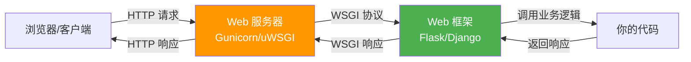

# 简单Web服务

> **所属路径**：`01_基础能力/01_开发环境与技术英语/08_网络与Web编程/04_简单Web服务`
> **预计学习时间**：55 分钟
> **难度等级**：⭐⭐⭐

---

## 前置知识

- [socket编程基础](../01_socket编程基础/01_socket编程基础.md)（理解 TCP 服务端的基本流程）
- [HTTP客户端与requests](../02_HTTP客户端与requests/02_HTTP客户端与requests.md)（理解 HTTP 请求-响应模型）
- [Web API调用与认证](../03_Web_API调用与认证/03_Web_API调用与认证.md)（了解 REST API 的设计理念）
- [装饰器与上下文管理器](../../01_编程语言基础/06_装饰器与上下文管理器/)（了解装饰器的基本概念）

> 如果以上内容还不熟悉，建议先完成对应课程再继续。

---

## 学习目标

完成本节后，你将能够：

1. 使用 Python 标准库 `http.server` 快速启动一个静态文件服务器
2. 使用 Flask 框架搭建带有路由和 JSON 接口的 Web 服务
3. 理解路由、请求处理和 JSON 响应的基本机制
4. 构建一个简单的 REST API 服务
5. 了解 WSGI 的基本概念以及 Web 框架的选择

---

## 正文讲解

### 1. 从调用者到提供者

在前面三课中，我们一直扮演"客户端"角色——向别人的服务器发请求获取数据。但在实际的 AI 项目中，你经常需要 **自己搭建服务**：

- 训练好模型后，需要一个 API 接口来提供推理服务
- 数据标注任务需要一个 Web 页面来展示待标注的数据
- 团队协作需要一个内部工具来管理实验记录

这一课，我们将从"调用者"转变为"提供者"，学习如何用 Python 搭建 Web 服务。

### 2. 最简方案——标准库 http.server

Python 内置的 `http.server` 模块可以一行命令启动一个静态文件服务器：

```bash
# 在当前目录启动一个 HTTP 服务器，端口 8000
python -m http.server 8000
```

这会把当前目录下的文件通过 HTTP 提供访问。虽然功能有限，但在以下场景非常方便：

- 快速分享文件给局域网内的同事
- 测试前端页面
- 临时提供数据下载

如果需要自定义处理逻辑，可以继承 `BaseHTTPRequestHandler`：

```python
# 文件：code/simple_http_server.py
from http.server import HTTPServer, BaseHTTPRequestHandler
import json

class MyHandler(BaseHTTPRequestHandler):
    """自定义 HTTP 请求处理器"""

    def do_GET(self):
        """处理 GET 请求"""
        if self.path == "/":
            self.send_response(200)
            self.send_header("Content-Type", "text/html; charset=utf-8")
            self.end_headers()
            self.wfile.write("<h1>你好，这是我的第一个 Web 服务！</h1>".encode("utf-8"))

        elif self.path == "/api/time":
            from datetime import datetime
            self.send_response(200)
            self.send_header("Content-Type", "application/json")
            self.end_headers()
            data = {"time": datetime.now().isoformat(), "message": "服务运行中"}
            self.wfile.write(json.dumps(data, ensure_ascii=False).encode("utf-8"))

        else:
            self.send_response(404)
            self.send_header("Content-Type", "text/plain; charset=utf-8")
            self.end_headers()
            self.wfile.write("页面未找到".encode("utf-8"))

    def do_POST(self):
        """处理 POST 请求"""
        content_length = int(self.headers.get("Content-Length", 0))
        body = self.rfile.read(content_length)
        data = json.loads(body.decode("utf-8"))

        self.send_response(200)
        self.send_header("Content-Type", "application/json")
        self.end_headers()
        response = {"received": data, "status": "ok"}
        self.wfile.write(json.dumps(response, ensure_ascii=False).encode("utf-8"))

if __name__ == "__main__":
    server = HTTPServer(("127.0.0.1", 8080), MyHandler)
    print("服务器启动在 http://127.0.0.1:8080")
    try:
        server.serve_forever()
    except KeyboardInterrupt:
        print("\n服务器已停止")
        server.server_close()
```

**运行说明**：
- 环境要求：Python 3.10+（无额外依赖）
- 运行命令：`python code/simple_http_server.py`
- 测试：浏览器打开 `http://127.0.0.1:8080` 或 `http://127.0.0.1:8080/api/time`

可以看到，用标准库写 Web 服务非常繁琐——每个路由都要手动判断 `self.path`，响应也要一步步构建。这就是为什么 Python 社区开发了各种 **Web 框架** 来简化这些工作。

### 3. Flask——轻量级 Web 框架

**Flask** 是 Python 最流行的轻量级 Web 框架之一。它用 **装饰器** 来定义路由，代码简洁直观：

```python
# 文件：code/flask_hello.py
# 环境要求：pip install flask
from flask import Flask

app = Flask(__name__)

@app.route("/")
def hello():
    return "<h1>你好，Flask！</h1>"

@app.route("/greet/<name>")
def greet(name):
    return f"<h1>你好，{name}！</h1>"

if __name__ == "__main__":
    app.run(host="127.0.0.1", port=5000, debug=True)
```

**运行说明**：
- 环境要求：Python 3.10+, Flask（`pip install flask`）
- 运行命令：`python code/flask_hello.py`
- 测试：浏览器打开 `http://127.0.0.1:5000` 或 `http://127.0.0.1:5000/greet/张三`

**预期输出**（浏览器中）：
```
你好，Flask！
```

对比标准库版本，Flask 的改进非常明显：

- `@app.route("/")` 装饰器优雅地定义路由
- `<name>` 自动捕获 URL 中的变量
- 返回字符串即可，框架自动处理响应头
- `debug=True` 开启热重载，修改代码后自动重启

### 4. 构建 JSON API

在 AI 工程中，我们更常需要的是返回 JSON 数据的 API 接口，而不是 HTML 页面。Flask 提供了 `jsonify` 函数来简化 JSON 响应：

```python
# 文件：code/flask_api.py
from flask import Flask, jsonify, request

app = Flask(__name__)

# 模拟数据库
tasks = [
    {"id": 1, "title": "学习 Flask", "done": True},
    {"id": 2, "title": "构建 API", "done": False},
    {"id": 3, "title": "部署模型", "done": False},
]

@app.route("/api/tasks", methods=["GET"])
def get_tasks():
    """获取所有任务"""
    return jsonify({"tasks": tasks, "total": len(tasks)})

@app.route("/api/tasks/<int:task_id>", methods=["GET"])
def get_task(task_id):
    """获取单个任务"""
    task = next((t for t in tasks if t["id"] == task_id), None)
    if task is None:
        return jsonify({"error": "任务不存在"}), 404
    return jsonify(task)

@app.route("/api/tasks", methods=["POST"])
def create_task():
    """创建新任务"""
    if not request.is_json:
        return jsonify({"error": "请求体必须是 JSON"}), 400

    data = request.get_json()
    if "title" not in data:
        return jsonify({"error": "缺少 title 字段"}), 400

    new_task = {
        "id": max(t["id"] for t in tasks) + 1 if tasks else 1,
        "title": data["title"],
        "done": data.get("done", False),
    }
    tasks.append(new_task)
    return jsonify(new_task), 201

@app.route("/api/tasks/<int:task_id>", methods=["PUT"])
def update_task(task_id):
    """更新任务"""
    task = next((t for t in tasks if t["id"] == task_id), None)
    if task is None:
        return jsonify({"error": "任务不存在"}), 404

    data = request.get_json()
    task["title"] = data.get("title", task["title"])
    task["done"] = data.get("done", task["done"])
    return jsonify(task)

@app.route("/api/tasks/<int:task_id>", methods=["DELETE"])
def delete_task(task_id):
    """删除任务"""
    task = next((t for t in tasks if t["id"] == task_id), None)
    if task is None:
        return jsonify({"error": "任务不存在"}), 404

    tasks.remove(task)
    return "", 204

if __name__ == "__main__":
    app.run(host="127.0.0.1", port=5000, debug=True)
```

**运行说明**：
- 环境要求：Python 3.10+, Flask
- 运行命令：`python code/flask_api.py`
- 测试（使用另一个终端）：

```bash
# 获取所有任务
curl http://127.0.0.1:5000/api/tasks

# 创建新任务
curl -X POST http://127.0.0.1:5000/api/tasks \
  -H "Content-Type: application/json" \
  -d '{"title": "写练习题"}'

# 更新任务
curl -X PUT http://127.0.0.1:5000/api/tasks/1 \
  -H "Content-Type: application/json" \
  -d '{"done": true}'

# 删除任务
curl -X DELETE http://127.0.0.1:5000/api/tasks/1
```

这个例子实现了一个完整的 **CRUD（Create-Read-Update-Delete）** API。注意几个设计要点：

- GET 返回 200，POST 创建成功返回 201，DELETE 成功返回 204（无内容）
- 输入验证：检查 `request.is_json` 和必要字段是否存在
- 错误处理：资源不存在时返回 404

### 5. WSGI 与 Web 框架选择

Flask（以及 Django 等框架）背后的标准协议是 **WSGI（Web Server Gateway Interface）** ——它定义了 Python Web 应用与 Web 服务器之间的通信接口。你不需要深入了解 WSGI 的细节，但知道它的存在有助于理解 Web 框架的工作原理：



> 📌 **图解说明**：Web 服务的分层架构。开发时 Flask 自带的开发服务器已够用，生产环境则需要 Gunicorn 等专业 WSGI 服务器来处理并发。

常见的 Python Web 框架对比：

| 框架 | 特点 | 适用场景 |
| ---- | ---- | -------- |
| Flask | 轻量灵活，学习曲线低 | 小型 API、原型验证、模型服务 |
| FastAPI | 自动文档、类型提示、异步支持 | 高性能 API、模型服务 |
| Django | 全功能、自带 ORM 和管理后台 | 大型 Web 应用 |
| Bottle | 极简，单文件框架 | 超小型项目 |

对于 AI 工程来说，**Flask** 和 **FastAPI** 是最常用的选择。Flask 更成熟、生态更丰富；FastAPI 更现代、性能更好。

### 6. 模型推理服务示例

最后，让我们来看一个更贴近 AI 实践的例子——把一个简单的文本处理"模型"包装成 Web API：

```python
# 文件：code/model_service.py
from flask import Flask, jsonify, request
import re

app = Flask(__name__)

def simple_sentiment(text):
    """一个极简的情感分析'模型'（仅作演示）"""
    positive_words = {"好", "棒", "优秀", "喜欢", "满意", "推荐", "不错"}
    negative_words = {"差", "烂", "糟糕", "讨厌", "失望", "垃圾", "难用"}

    words = set(re.findall(r"[\u4e00-\u9fff]+", text))
    pos_count = len(words & positive_words)
    neg_count = len(words & negative_words)

    if pos_count > neg_count:
        return "positive", pos_count / (pos_count + neg_count + 1e-6)
    elif neg_count > pos_count:
        return "negative", neg_count / (pos_count + neg_count + 1e-6)
    else:
        return "neutral", 0.5

@app.route("/api/predict", methods=["POST"])
def predict():
    """情感分析预测接口"""
    if not request.is_json:
        return jsonify({"error": "请发送 JSON 数据"}), 400

    data = request.get_json()
    text = data.get("text", "")
    if not text:
        return jsonify({"error": "text 字段不能为空"}), 400

    label, confidence = simple_sentiment(text)
    return jsonify({
        "text": text,
        "label": label,
        "confidence": round(confidence, 4),
    })

@app.route("/api/health", methods=["GET"])
def health():
    """健康检查接口"""
    return jsonify({"status": "healthy", "model": "simple_sentiment_v1"})

if __name__ == "__main__":
    app.run(host="127.0.0.1", port=5000, debug=True)
```

测试命令：

```bash
# 健康检查
curl http://127.0.0.1:5000/api/health

# 预测
curl -X POST http://127.0.0.1:5000/api/predict \
  -H "Content-Type: application/json" \
  -d '{"text": "这个产品很棒，非常满意"}'
```

**预期输出**：
```json
{"text": "这个产品很棒，非常满意", "label": "positive", "confidence": 1.0}
```

这就是将模型部署为 Web 服务的基本模式：**加载模型 → 接收请求 → 预处理输入 → 模型推理 → 返回结果**。在后续的 [模型服务](../../../03_工程落地/01_人工智能工程化与部署/05_模型服务/) 课程中，我们会学习更完善的部署方案。

---

## 动手实践

上面的 Flask API 和模型服务示例本身就是很好的动手项目。建议你在本地运行它们，并尝试用 requests 或 curl 发送各种请求进行测试。

---

## 典型误区

| 误区 | 正确理解 |
| ---- | -------- |
| 用 Flask 开发服务器部署到生产环境 | Flask 自带的开发服务器**不适合生产使用**，生产环境应使用 Gunicorn 或 uWSGI |
| 所有数据都放在内存中 | 示例中的列表存储仅用于演示，实际项目应使用数据库 |
| 不做输入验证 | 永远不要信任客户端输入，必须验证数据类型、格式和范围 |
| 忘记设置 CORS | 如果前端和 API 不在同一域名下，需要配置跨域资源共享（CORS） |

---

## 练习题

### 练习 1：计算器 API（难度：⭐⭐）

用 Flask 实现一个计算器 API，路由为 `POST /api/calculate`，接收 JSON 数据 `{"a": 数字, "b": 数字, "op": "+"/"-"/"*"/"/"}`，返回计算结果。要求处理除以零的错误。

<details>
<summary>💡 提示</summary>

使用 `request.get_json()` 获取参数，用 `if-elif` 判断运算符。除法时检查 `b` 是否为 0 。

</details>

<details>
<summary>✅ 参考答案</summary>

```python
from flask import Flask, jsonify, request

app = Flask(__name__)

@app.route("/api/calculate", methods=["POST"])
def calculate():
    data = request.get_json()
    a, b, op = data.get("a"), data.get("b"), data.get("op")

    if a is None or b is None or op is None:
        return jsonify({"error": "缺少必要参数"}), 400

    if op == "+":
        result = a + b
    elif op == "-":
        result = a - b
    elif op == "*":
        result = a * b
    elif op == "/":
        if b == 0:
            return jsonify({"error": "除数不能为零"}), 400
        result = a / b
    else:
        return jsonify({"error": f"不支持的运算符: {op}"}), 400

    return jsonify({"a": a, "b": b, "op": op, "result": result})

if __name__ == "__main__":
    app.run(debug=True)
```

</details>

### 练习 2：待办事项 API 客户端（难度：⭐⭐）

使用 requests 库编写一个客户端脚本，依次完成以下操作：
1. 获取所有任务（GET）
2. 创建一个新任务（POST）
3. 再次获取所有任务确认创建成功
4. 打印每一步的结果

（需要先运行 `flask_api.py` 作为服务端）

<details>
<summary>💡 提示</summary>

使用 `requests.get()` 和 `requests.post()` 依次调用 API，记得设置 `json=` 参数来发送 JSON 数据。

</details>

<details>
<summary>✅ 参考答案</summary>

```python
import requests

BASE = "http://127.0.0.1:5000/api/tasks"

# 1. 获取所有任务
resp = requests.get(BASE, timeout=5)
print(f"当前任务数: {resp.json()['total']}")

# 2. 创建新任务
new_task = {"title": "完成 Web 服务练习"}
resp = requests.post(BASE, json=new_task, timeout=5)
print(f"创建成功: {resp.json()}")

# 3. 再次获取确认
resp = requests.get(BASE, timeout=5)
data = resp.json()
print(f"更新后任务数: {data['total']}")
for task in data["tasks"]:
    status = "✅" if task["done"] else "⬜"
    print(f"  {status} [{task['id']}] {task['title']}")
```

</details>

---

## 下一步学习

- 📖 下一个知识主题：[Python内存模型与性能](../../09_Python内存模型与性能/)
- 🔗 相关知识点：[模型服务](../../../03_工程落地/01_人工智能工程化与部署/05_模型服务/)（生产级模型部署）
- 🔗 相关知识点：[容器](../../../03_工程落地/01_人工智能工程化与部署/06_容器/)（Docker 容器化部署）
- 📚 拓展阅读：[FastAPI 官方教程](https://fastapi.tiangolo.com/zh/tutorial/)

---

## 参考资料

1. [Flask 官方文档](https://flask.palletsprojects.com/) — Python 最流行的轻量级 Web 框架文档（开源项目，BSD 许可）
2. [Python http.server 官方文档](https://docs.python.org/3/library/http.server.html) — 标准库 HTTP 服务器模块参考（官方文档）
3. [FastAPI 官方文档](https://fastapi.tiangolo.com/) — 现代高性能 Python Web 框架（开源项目，MIT 许可）
4. [MDN HTTP 状态码参考](https://developer.mozilla.org/zh-CN/docs/Web/HTTP/Status) — HTTP 状态码完整列表与说明（CC BY-SA 许可）
