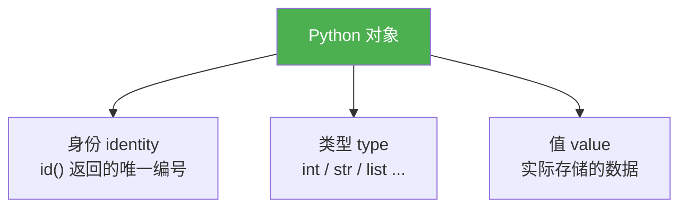
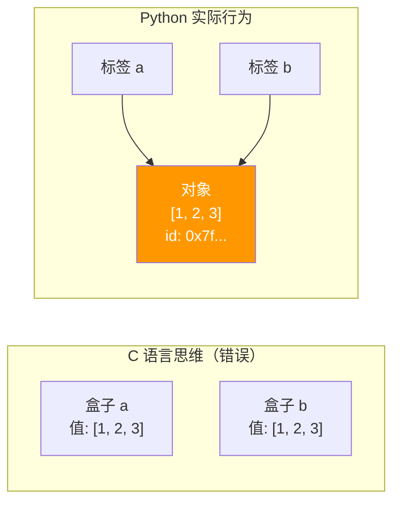
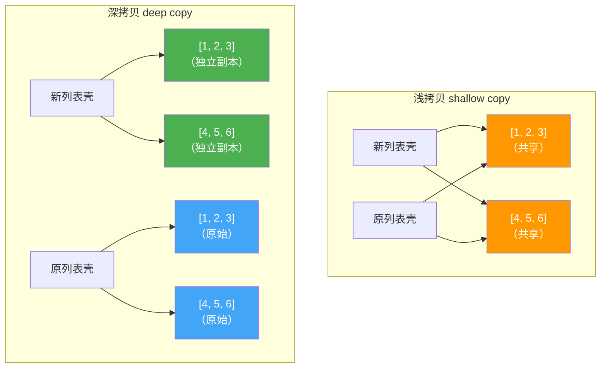

# 对象模型与引用

> **所属路径**：`01_基础能力/01_开发环境与技术英语/09_Python内存模型与性能/01_对象模型与引用`
> **预计学习时间**：50 分钟
> **难度等级**：⭐⭐

---

## 前置知识

- [变量与数据类型](../../01_编程语言基础/01_变量与数据类型/01_变量与数据类型.md)（了解 Python 基本数据类型）
- [函数与模块](../../01_编程语言基础/03_函数与模块/03_函数与模块.md)（了解函数参数传递）
- [容器类型深入](../../03_容器类型深入/01_collections模块/01_collections模块.md)（了解列表、字典等容器的基本操作）

> 如果以上内容还不熟悉，建议先完成对应课程再继续。

---

## 学习目标

完成本节后，你将能够：

1. 解释 Python 中"一切皆对象"的含义及其内存表示
2. 区分变量名（引用）和对象本身的关系
3. 使用 `id()` 和 `is` 判断两个变量是否指向同一个对象
4. 理解可变对象与不可变对象在赋值、传参和拷贝时的行为差异
5. 正确使用浅拷贝和深拷贝避免数据意外修改

---

## 正文讲解

### 1. 一切皆对象

在很多编程语言中，整数 `42` 就是一个简单的数值，直接存放在变量对应的内存位置。但在 Python 中，情况完全不同——**一切皆对象（Everything is an Object）** 。整数 `42` 是一个对象，字符串 `"hello"` 是一个对象，函数是一个对象，甚至类本身也是一个对象。

每个 Python 对象都包含三个核心信息：



> 📌 **图解说明**：每个 Python 对象由身份（内存地址）、类型和值三部分组成。身份在对象创建后不会改变，类型通常也不变（除非使用黑魔法），只有值可能改变（如果是可变对象）。

让我们亲眼看看这三个属性：

```python
# 文件：code/object_basics.py
x = 42

print(f"值: {x}")            # 42
print(f"类型: {type(x)}")     # <class 'int'>
print(f"身份: {id(x)}")       # 一个大整数（内存地址）

# 函数也是对象
def greet():
    return "hello"

print(f"\n函数的类型: {type(greet)}")   # <class 'function'>
print(f"函数的身份: {id(greet)}")       # 另一个内存地址

# 类型本身也是对象
print(f"\nint 的类型: {type(int)}")     # <class 'type'>
print(f"type 的类型: {type(type)}")     # <class 'type'>（自引用！）
```

**运行说明**：
- 环境要求：Python 3.10+
- 运行命令：`python code/object_basics.py`

**预期输出**（id 值会因运行环境不同而变化）：
```
值: 42
类型: <class 'int'>
身份: 140234866423952

函数的类型: <class 'function'>
函数的身份: 140234866500880

int 的类型: <class 'type'>
type 的类型: <class 'type'>
```

### 2. 变量是标签，不是盒子

这是理解 Python 内存模型最关键的一句话：**变量不是盒子，而是贴在对象上的标签**。

在 C 或 Java 这样的语言中，变量像一个"盒子"——你把值放进盒子里。但在 Python 中，变量只是对象的"名字"或"引用"——对象存在于内存中的某个位置，变量名就是指向这个位置的标签。



> 📌 **图解说明**：左边是错误的"盒子"思维——以为 `b = a` 会复制一份数据。右边是 Python 的实际行为—— `b = a` 只是让 `b` 这个标签也指向了 `a` 指向的同一个对象。

让我们验证这一点：

```python
# 文件：code/labels_not_boxes.py
# 赋值只是贴标签，不是复制数据
a = [1, 2, 3]
b = a  # b 和 a 指向同一个列表对象

print(f"a 的 id: {id(a)}")
print(f"b 的 id: {id(b)}")
print(f"a is b: {a is b}")   # True —— 同一个对象！

# 修改 a 指向的列表，b 也会"看到"变化
a.append(4)
print(f"\na: {a}")   # [1, 2, 3, 4]
print(f"b: {b}")     # [1, 2, 3, 4] —— 也变了！

# 但重新赋值不同——它让标签指向新对象
a = [10, 20, 30]     # a 现在指向一个全新的列表
print(f"\na: {a}")   # [10, 20, 30]
print(f"b: {b}")     # [1, 2, 3, 4] —— b 没变，它还指向原来的对象
print(f"a is b: {a is b}")   # False —— 不再是同一个对象
```

**预期输出**：
```
a 的 id: 140234866423952
b 的 id: 140234866423952
a is b: True

a: [1, 2, 3, 4]
b: [1, 2, 3, 4]

a: [10, 20, 30]
b: [1, 2, 3, 4]
a is b: False
```

这里有一个至关重要的区别：

- `a.append(4)` 是**修改对象本身**（原地操作），所有指向该对象的变量都能看到变化
- `a = [10, 20, 30]` 是**重新绑定变量**（让标签指向新对象），不影响其他变量

### 3. `==` 与 `is` 的区别

理解了"变量是标签"之后，`==` 和 `is` 的区别就很清楚了：

- `==` 比较的是**值**（两个对象的内容是否相等）
- `is` 比较的是**身份**（两个变量是否指向同一个对象）

```python
# 文件：code/eq_vs_is.py
a = [1, 2, 3]
b = [1, 2, 3]  # 创建了一个新列表，内容相同
c = a           # c 和 a 指向同一个列表

print(f"a == b: {a == b}")   # True  —— 值相同
print(f"a is b: {a is b}")   # False —— 不是同一个对象
print(f"a == c: {a == c}")   # True  —— 值相同
print(f"a is c: {a is c}")   # True  —— 同一个对象

# 特殊情况：小整数缓存
x = 256
y = 256
print(f"\n256 is 256: {x is y}")  # True —— Python 缓存了 -5 到 256 的整数

x = 257
y = 257
# 注意：在交互式环境和脚本中行为可能不同
print(f"257 is 257: {x is y}")    # 在脚本中通常为 True（编译优化）

# 最佳实践：只在比较 None 时使用 is
value = None
print(f"\nvalue is None: {value is None}")  # 推荐写法
print(f"value == None: {value == None}")    # 不推荐（可能被自定义 __eq__ 欺骗）
```

> 💡 **最佳实践**：除了与 `None` 比较时使用 `is`，其他情况都应该使用 `==` 。Python 会缓存小整数和短字符串（称为 **驻留（interning）** ），但这是实现细节，不应依赖。

### 4. 可变与不可变对象

Python 对象分为两大类：

| 类别 | 代表类型 | 特点 |
| ---- | -------- | ---- |
| **不可变（Immutable）** | `int`, `float`, `str`, `tuple`, `frozenset`, `bytes` | 创建后值不能改变 |
| **可变（Mutable）** | `list`, `dict`, `set`, `bytearray` | 创建后值可以原地修改 |

这个区别对理解赋值和传参行为至关重要：

```python
# 文件：code/mutable_immutable.py
# === 不可变对象：修改会创建新对象 ===
a = "hello"
print(f"修改前 id(a): {id(a)}")

a = a + " world"    # 字符串拼接创建了新字符串
print(f"修改后 id(a): {id(a)}")  # id 变了！说明是新对象
print(f"值: {a}")

# 元组也是不可变的
t = (1, 2, 3)
try:
    t[0] = 10  # 会报错
except TypeError as e:
    print(f"\n元组不可变: {e}")

# === 可变对象：修改不创建新对象 ===
lst = [1, 2, 3]
print(f"\n修改前 id(lst): {id(lst)}")

lst.append(4)  # 原地修改，不创建新对象
print(f"修改后 id(lst): {id(lst)}")  # id 没变！还是同一个对象
print(f"值: {lst}")

# === 陷阱：元组中的可变元素 ===
# 元组本身不可变，但它里面的可变元素可以修改！
mixed = ([1, 2], [3, 4])
mixed[0].append(99)  # 不会报错！
print(f"\n'不可变'元组中的列表被修改了: {mixed}")
# 输出: ([1, 2, 99], [3, 4])
```

### 5. 函数参数传递

Python 的参数传递方式经常引起争论——到底是"值传递"还是"引用传递"？准确的说法是 **共享对象传递（Call by Object Sharing）** ——函数接收的是对象引用的副本。

```python
# 文件：code/function_args.py
def modify_list(lst):
    """修改传入的列表——调用者会看到变化"""
    lst.append(99)
    print(f"函数内 id(lst): {id(lst)}")

def reassign_list(lst):
    """重新赋值参数——调用者不会看到变化"""
    lst = [10, 20, 30]  # 局部变量 lst 指向新对象
    print(f"函数内 id(lst): {id(lst)}")

# 测试 1：原地修改
my_list = [1, 2, 3]
print(f"调用前 id: {id(my_list)}, 值: {my_list}")

modify_list(my_list)
print(f"调用后 id: {id(my_list)}, 值: {my_list}")
# [1, 2, 3, 99] —— 被修改了！

# 测试 2：重新赋值
print()
my_list2 = [1, 2, 3]
print(f"调用前 id: {id(my_list2)}, 值: {my_list2}")

reassign_list(my_list2)
print(f"调用后 id: {id(my_list2)}, 值: {my_list2}")
# [1, 2, 3] —— 没变！

# 测试 3：不可变对象
def try_modify_int(n):
    print(f"函数内修改前 id: {id(n)}")
    n = n + 1  # 创建了新的 int 对象
    print(f"函数内修改后 id: {id(n)}")
    return n

print()
x = 42
print(f"调用前 id: {id(x)}, 值: {x}")
result = try_modify_int(x)
print(f"调用后 id: {id(x)}, 值: {x}")  # x 没变
print(f"返回值: {result}")
```

**预期输出**（id 值会变化）：
```
调用前 id: 140..., 值: [1, 2, 3]
函数内 id(lst): 140...（相同）
调用后 id: 140..., 值: [1, 2, 3, 99]

调用前 id: 140..., 值: [1, 2, 3]
函数内 id(lst): 140...（不同）
调用后 id: 140..., 值: [1, 2, 3]

调用前 id: 140..., 值: 42
函数内修改前 id: 140...（相同）
函数内修改后 id: 140...（不同）
调用后 id: 140..., 值: 42
返回值: 43
```

简单记忆规则：

- 传入可变对象 + 原地修改 → 调用者**看得到**变化
- 传入可变对象 + 重新赋值 → 调用者**看不到**变化
- 传入不可变对象 → 调用者**看不到**任何变化（因为只能重新赋值）

### 6. 浅拷贝与深拷贝

既然赋值只是贴标签，那么如何真正"复制"一个对象呢？Python 提供了两种复制方式：

```python
# 文件：code/copy_demo.py
import copy

# 原始数据：嵌套列表
original = [[1, 2, 3], [4, 5, 6]]

# === 赋值：只是贴标签 ===
assigned = original
assigned[0].append(99)
print(f"赋值后修改: original = {original}")  # 被修改了！

# 重置
original = [[1, 2, 3], [4, 5, 6]]

# === 浅拷贝：只复制第一层 ===
shallow = copy.copy(original)
# 也可以用: shallow = original.copy() 或 shallow = list(original)

print(f"\nshallow is original: {shallow is original}")           # False
print(f"shallow[0] is original[0]: {shallow[0] is original[0]}")  # True！

# 浅拷贝的陷阱：内层对象仍然共享
shallow[0].append(88)
print(f"浅拷贝后修改内层: original = {original}")  # 内层被修改了！
print(f"浅拷贝后修改内层: shallow = {shallow}")

# 但修改第一层不影响原始对象
shallow.append([7, 8, 9])
print(f"\n浅拷贝后添加新元素: original = {original}")  # 没有新元素
print(f"浅拷贝后添加新元素: shallow = {shallow}")     # 有新元素

# 重置
original = [[1, 2, 3], [4, 5, 6]]

# === 深拷贝：递归复制所有层 ===
deep = copy.deepcopy(original)

print(f"\ndeep is original: {deep is original}")               # False
print(f"deep[0] is original[0]: {deep[0] is original[0]}")      # False！

deep[0].append(77)
print(f"深拷贝后修改内层: original = {original}")  # 没被修改！
print(f"深拷贝后修改内层: deep = {deep}")
```

**预期输出**：
```
赋值后修改: original = [[1, 2, 3, 99], [4, 5, 6]]

shallow is original: False
shallow[0] is original[0]: True
浅拷贝后修改内层: original = [[1, 2, 3, 88], [4, 5, 6]]
浅拷贝后修改内层: shallow = [[1, 2, 3, 88], [4, 5, 6]]

浅拷贝后添加新元素: original = [[1, 2, 3, 88], [4, 5, 6]]
浅拷贝后添加新元素: shallow = [[1, 2, 3, 88], [4, 5, 6], [7, 8, 9]]

deep is original: False
deep[0] is original[0]: False
深拷贝后修改内层: original = [[1, 2, 3], [4, 5, 6]]
深拷贝后修改内层: deep = [[1, 2, 3, 77], [4, 5, 6]]
```



> 📌 **图解说明**：浅拷贝只复制最外层容器，内层元素仍然共享（橙色）；深拷贝递归复制所有层级，产生完全独立的副本（绿色与蓝色互不影响）。

---

## 动手实践

让我们写一个工具函数来直观地展示对象的引用关系：

```python
# 文件：code/ref_inspector.py
import sys

def inspect_refs(*args, names=None):
    """检查多个变量的引用关系"""
    if names is None:
        names = [f"var{i}" for i in range(len(args))]

    print("=" * 60)
    for name, obj in zip(names, args):
        print(f"{name:>10} | id: {id(obj):<18} | type: {type(obj).__name__:<10} | "
              f"size: {sys.getsizeof(obj)} bytes | refcount: {sys.getrefcount(obj) - 1}")

    # 检查哪些变量指向同一个对象
    print("-" * 60)
    for i in range(len(args)):
        for j in range(i + 1, len(args)):
            if args[i] is args[j]:
                print(f"  {names[i]} is {names[j]} → 同一对象")
    print("=" * 60)

# 演示
a = [1, 2, 3]
b = a
c = a.copy()
d = [1, 2, 3]

inspect_refs(a, b, c, d, names=["a", "b", "c", "d"])
```

**运行说明**：
- 环境要求：Python 3.10+
- 运行命令：`python code/ref_inspector.py`

**预期输出**：
```
============================================================
         a | id: 140234866423952  | type: list       | size: 120 bytes | refcount: 2
         b | id: 140234866423952  | type: list       | size: 120 bytes | refcount: 2
         c | id: 140234866424016  | type: list       | size: 120 bytes | refcount: 1
         d | id: 140234866424080  | type: list       | size: 120 bytes | refcount: 1
------------------------------------------------------------
  a is b → 同一对象
============================================================
```

---

## 典型误区

| 误区 | 正确理解 |
| ---- | -------- |
| "Python 是值传递"或"Python 是引用传递" | Python 是**共享对象传递**——参数和调用者的变量指向同一个对象，但参数本身是一个新的引用 |
| `a = b` 会复制 b 的数据 | 赋值只是让 `a` 指向 `b` 指向的同一个对象，不复制数据 |
| `list.copy()` 就能完全独立 | `list.copy()` 是浅拷贝，嵌套对象仍然共享。需要完全独立应使用 `copy.deepcopy()` |
| 小整数相等就一定 `is True` | 小整数缓存（-5 到 256）是 CPython 的实现细节，不应在代码中依赖 |

---

## 练习题

### 练习 1：预测输出（难度：⭐）

不运行代码，预测以下代码的输出，然后验证你的预测：

```python
x = [1, 2, 3]
y = x
x = x + [4]
print(x)
print(y)
```

<details>
<summary>💡 提示</summary>

`x + [4]` 会创建一个新列表（与 `x.append(4)` 不同）。`x =` 会让 `x` 指向这个新列表。

</details>

<details>
<summary>✅ 参考答案</summary>

```
x: [1, 2, 3, 4]
y: [1, 2, 3]
```

`x + [4]` 创建了新列表 `[1, 2, 3, 4]`，然后 `x = ...` 让 `x` 指向新列表。`y` 仍然指向原来的 `[1, 2, 3]` 。如果把 `x = x + [4]` 改成 `x += [4]`（等价于 `x.extend([4])`），那么 `y` 也会变成 `[1, 2, 3, 4]` 。

</details>

### 练习 2：安全的默认参数（难度：⭐⭐）

以下代码有一个常见 bug，请找出问题并修复：

```python
def add_item(item, items=[]):
    items.append(item)
    return items

print(add_item("a"))
print(add_item("b"))
print(add_item("c"))
```

<details>
<summary>💡 提示</summary>

可变对象作为默认参数值时，默认值对象在函数定义时只创建一次，之后所有调用共享同一个对象。

</details>

<details>
<summary>✅ 参考答案</summary>

问题：默认参数 `items=[]` 的列表对象在函数定义时创建，所有调用共享同一个列表。

输出：`['a']`、`['a', 'b']`、`['a', 'b', 'c']`（不是每次得到新列表）

修复：

```python
def add_item(item, items=None):
    if items is None:
        items = []  # 每次调用创建新列表
    items.append(item)
    return items

print(add_item("a"))  # ['a']
print(add_item("b"))  # ['b']
print(add_item("c"))  # ['c']
```

</details>

### 练习 3：实现安全的字典合并（难度：⭐⭐）

实现一个函数 `merge_configs(default, override)`，将两个嵌套字典合并（override 覆盖 default），要求：不修改任何输入字典，返回一个全新的字典。

<details>
<summary>💡 提示</summary>

先对 `default` 做深拷贝，然后递归地用 `override` 的值覆盖。

</details>

<details>
<summary>✅ 参考答案</summary>

```python
import copy

def merge_configs(default, override):
    result = copy.deepcopy(default)
    for key, value in override.items():
        if key in result and isinstance(result[key], dict) and isinstance(value, dict):
            result[key] = merge_configs(result[key], value)
        else:
            result[key] = copy.deepcopy(value)
    return result

# 测试
default = {"db": {"host": "localhost", "port": 5432}, "debug": False}
override = {"db": {"port": 3306}, "debug": True}
merged = merge_configs(default, override)
print(merged)
# {'db': {'host': 'localhost', 'port': 3306}, 'debug': True}
print(default)
# {'db': {'host': 'localhost', 'port': 5432}, 'debug': False}（未被修改）
```

</details>

---

## 下一步学习

- 📖 下一个知识点：[垃圾回收机制](../02_垃圾回收机制/02_垃圾回收机制.md)
- 🔗 相关知识点：[Python数据模型](../../10_元编程与高级特性/05_Python数据模型/)
- 🔗 相关知识点：[容器性能对比](../../03_容器类型深入/05_容器性能对比/05_容器性能对比.md)

---

## 参考资料

1. [Python 官方文档 - 数据模型](https://docs.python.org/3/reference/datamodel.html) — Python 对象模型的权威参考（官方文档）
2. [Python 官方文档 - copy 模块](https://docs.python.org/3/library/copy.html) — 浅拷贝和深拷贝的完整说明（官方文档）
3. [Ned Batchelder - Facts and Myths about Python Names and Values](https://nedbatchelder.com/text/names.html) — 关于 Python 变量和值的经典博文（公开博客）
