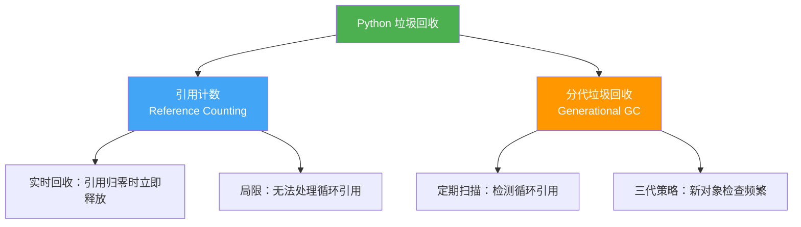
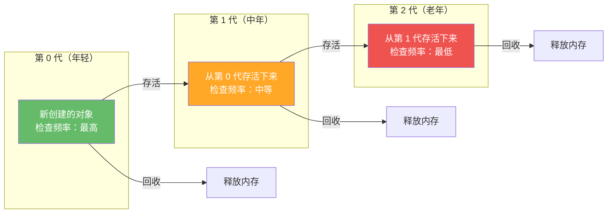

# 垃圾回收机制

> **所属路径**：`01_基础能力/01_开发环境与技术英语/09_Python内存模型与性能/02_垃圾回收机制`
> **预计学习时间**：50 分钟
> **难度等级**：⭐⭐⭐

---

## 前置知识

- [对象模型与引用](../01_对象模型与引用/01_对象模型与引用.md)（理解 Python 对象、引用和可变性）
- [函数与模块](../../01_编程语言基础/03_函数与模块/03_函数与模块.md)（了解作用域和变量生命周期）

> 如果以上内容还不熟悉，建议先完成对应课程再继续。

---

## 学习目标

完成本节后，你将能够：

1. 解释 Python 的引用计数机制及其工作原理
2. 理解循环引用为何导致引用计数失效
3. 描述 Python 分代垃圾回收器的基本工作方式
4. 使用 `gc` 模块监控和调试垃圾回收行为
5. 识别常见的内存泄漏模式并采取预防措施

---

## 正文讲解

### 1. 为什么需要垃圾回收？

在上一课中，我们知道了 Python 的变量只是对象的引用（标签）。当我们创建对象时，Python 会为它分配内存。但问题来了——**当对象不再被需要时，这块内存该怎么释放？**

在 C 语言中，程序员必须手动调用 `free()` 释放内存，忘记释放就会 **内存泄漏（Memory Leak）** ，释放两次则可能导致程序崩溃。Python 为我们自动处理了这一切——这个自动回收不再使用的内存的机制，就叫做 **垃圾回收（Garbage Collection, GC）** 。

Python（CPython 实现）使用了两种互补的垃圾回收策略：



> 📌 **图解说明**：Python 的双重垃圾回收机制——引用计数处理大部分情况（快速、实时），分代 GC 作为补充处理引用计数无法解决的循环引用问题。

### 2. 引用计数——主力回收机制

Python 为每个对象维护一个 **引用计数器（Reference Count）** ——记录有多少个引用指向该对象。当引用计数降到 0 时，对象立即被销毁、内存立即被释放。

```python
# 文件：code/refcount_demo.py
import sys

# 创建一个列表对象
a = [1, 2, 3]
print(f"创建后引用计数: {sys.getrefcount(a) - 1}")
# 注：getrefcount 本身会创建一个临时引用，所以减 1

# 增加引用
b = a
print(f"b = a 后引用计数: {sys.getrefcount(a) - 1}")

# 放入容器也增加引用
c = {"data": a}
print(f"放入字典后引用计数: {sys.getrefcount(a) - 1}")

# 减少引用
del b
print(f"del b 后引用计数: {sys.getrefcount(a) - 1}")

del c
print(f"del c 后引用计数: {sys.getrefcount(a) - 1}")

# 重新赋值也减少引用
a = None  # 原列表的引用计数降为 0，被立即回收
print("原列表已被回收")
```

**运行说明**：
- 环境要求：Python 3.10+
- 运行命令：`python code/refcount_demo.py`

**预期输出**：
```
创建后引用计数: 1
b = a 后引用计数: 2
放入字典后引用计数: 3
del b 后引用计数: 2
del c 后引用计数: 1
原列表已被回收
```

哪些操作会改变引用计数？

| 增加引用 | 减少引用 |
| -------- | -------- |
| 赋值：`b = a` | 删除：`del b` |
| 传参：`func(a)` | 变量离开作用域 |
| 放入容器：`[a]`、`{"k": a}` | 从容器移除 |
| 用 `import` 导入模块 | 重新赋值：`a = None` |

我们可以通过 `__del__` 方法观察对象被销毁的时机：

```python
# 文件：code/destructor_demo.py
class TrackedObject:
    def __init__(self, name):
        self.name = name
        print(f"  [{self.name}] 对象已创建")

    def __del__(self):
        print(f"  [{self.name}] 对象已销毁（__del__ 被调用）")

print("--- 正常回收 ---")
obj = TrackedObject("A")
print(f"  引用计数: {__import__('sys').getrefcount(obj) - 1}")
del obj  # 引用计数降为 0，立即回收
print("  del 之后")

print("\n--- 作用域结束 ---")
def create_object():
    local_obj = TrackedObject("B")
    print("  函数即将返回")
    # 函数返回后 local_obj 离开作用域

create_object()
print("  函数已返回")
```

**预期输出**：
```
--- 正常回收 ---
  [A] 对象已创建
  引用计数: 1
  [A] 对象已销毁（__del__ 被调用）
  del 之后

--- 作用域结束 ---
  [B] 对象已创建
  函数即将返回
  [B] 对象已销毁（__del__ 被调用）
  函数已返回
```

### 3. 循环引用——引用计数的盲点

引用计数机制简单高效，但有一个致命弱点——**循环引用（Circular Reference）** ：

```python
# 文件：code/circular_ref.py
import gc

class Node:
    def __init__(self, name):
        self.name = name
        self.partner = None

    def __repr__(self):
        partner_name = self.partner.name if self.partner else "None"
        return f"Node({self.name}, partner={partner_name})"

    def __del__(self):
        print(f"  Node({self.name}) 被回收")

# 创建循环引用
print("--- 创建循环引用 ---")
a = Node("A")
b = Node("B")
a.partner = b  # A 引用 B
b.partner = a  # B 引用 A —— 形成循环！

print(f"  a: {a}")
print(f"  b: {b}")

# 删除外部引用
print("\n--- 删除外部引用 ---")
del a
del b
print("  del a, del b 执行完毕")
# 此时 A 和 B 的引用计数都是 1（互相引用），不是 0
# 引用计数机制无法回收它们！

# 手动触发分代 GC 来回收循环引用
print("\n--- 手动触发 GC ---")
gc.collect()
print("  gc.collect() 执行完毕")
```

**预期输出**：
```
--- 创建循环引用 ---
  a: Node(A, partner=B)
  b: Node(B, partner=A)

--- 删除外部引用 ---
  del a, del b 执行完毕

--- 手动触发 GC ---
  Node(A) 被回收
  Node(B) 被回收
  gc.collect() 执行完毕
```

循环引用在实际代码中比你想象的更常见：

- 父子关系：父对象引用子对象，子对象也引用父对象
- 缓存：对象存了一个指向自身所在容器的引用
- 观察者模式：被观察者持有观察者列表，观察者持有被观察者引用

### 4. 分代垃圾回收——处理循环引用

为了解决循环引用问题，Python 实现了 **分代垃圾回收器（Generational Garbage Collector）** 。它基于一个观察：**大多数对象要么很快变成垃圾，要么会存活很久**。



> 📌 **图解说明**：分代 GC 将对象按"年龄"分为三代。新对象从第 0 代开始，每次 GC 扫描后存活的对象晋升到下一代。年轻代（第 0 代）检查频率最高，因为大多数对象都"短命"。

### 5. 使用 gc 模块监控垃圾回收

Python 的 `gc` 模块让我们可以查看和控制垃圾回收行为：

```python
# 文件：code/gc_monitor.py
import gc

# 查看 GC 状态
print("=== GC 基本信息 ===")
print(f"GC 是否启用: {gc.isenabled()}")
print(f"各代阈值: {gc.get_threshold()}")
# 默认: (700, 10, 10)
# 意思是：分配 700 次后触发第 0 代 GC
# 第 0 代 GC 运行 10 次后触发第 1 代 GC
# 第 1 代 GC 运行 10 次后触发第 2 代 GC

print(f"各代当前计数: {gc.get_count()}")

# 查看不可达对象
print("\n=== 收集垃圾 ===")
collected = gc.collect()
print(f"本次回收了 {collected} 个不可达对象")

# 开启 GC 调试信息
print("\n=== GC 调试模式 ===")
gc.set_debug(gc.DEBUG_STATS)

# 创建循环引用
class A:
    pass

# 创建 100 个循环引用对
for _ in range(100):
    x = A()
    y = A()
    x.ref = y
    y.ref = x

# 手动触发 GC 并观察统计信息
del x, y
collected = gc.collect()
print(f"\n手动回收了 {collected} 个对象")

# 关闭调试
gc.set_debug(0)

# 查看各代中的对象数量
print(f"\n各代对象数量: {gc.get_count()}")
```

### 6. 常见内存泄漏模式

即使有垃圾回收，Python 程序仍然可能发生内存泄漏。以下是几种常见模式：

```python
# 文件：code/memory_leak_patterns.py
import gc
import weakref

# === 模式 1：全局列表不断增长 ===
cache = []

def process_data_bad(data):
    """每次调用都往全局缓存中添加结果，从不清理"""
    result = data * 2
    cache.append(result)  # 缓存无限增长！
    return result

# 修复：使用有限大小的缓存
from collections import deque
bounded_cache = deque(maxlen=1000)

def process_data_good(data):
    result = data * 2
    bounded_cache.append(result)  # 自动丢弃最旧的数据
    return result

# === 模式 2：使用 weakref 打破循环引用 ===
class Parent:
    def __init__(self, name):
        self.name = name
        self.children = []

class ChildBad:
    """不好的写法：强引用父对象"""
    def __init__(self, name, parent):
        self.name = name
        self.parent = parent  # 强引用 → 循环引用
        parent.children.append(self)

class ChildGood:
    """好的写法：弱引用父对象"""
    def __init__(self, name, parent):
        self.name = name
        self.parent = weakref.ref(parent)  # 弱引用 → 不增加引用计数
        parent.children.append(self)

# 测试弱引用
print("=== weakref 示例 ===")
p = Parent("父节点")
c = ChildGood("子节点", p)

# 通过弱引用访问父对象
parent_ref = c.parent()  # 调用弱引用获取实际对象
if parent_ref is not None:
    print(f"子节点的父节点: {parent_ref.name}")
else:
    print("父节点已被回收")

# 删除父对象
del p
gc.collect()

# 父对象已被回收，弱引用返回 None
parent_ref = c.parent()
if parent_ref is not None:
    print(f"父节点仍然存在: {parent_ref.name}")
else:
    print("父节点已被回收，弱引用返回 None")

# === 模式 3：__del__ 中的异常 ===
print("\n=== __del__ 注意事项 ===")
print("注意：不要在 __del__ 中做复杂操作")
print("原因：对象销毁顺序不确定，依赖的对象可能已经被回收")
print("建议：使用 with 语句和上下文管理器管理资源")
```

**运行说明**：
- 环境要求：Python 3.10+
- 运行命令：`python code/memory_leak_patterns.py`

**预期输出**：
```
=== weakref 示例 ===
子节点的父节点: 父节点
父节点已被回收，弱引用返回 None

=== __del__ 注意事项 ===
注意：不要在 __del__ 中做复杂操作
原因：对象销毁顺序不确定，依赖的对象可能已经被回收
建议：使用 with 语句和上下文管理器管理资源
```

---

## 动手实践

上面的代码示例已经涵盖了垃圾回收的主要概念。建议你在 Python 交互式环境中逐一运行这些代码，通过修改和实验来加深理解。

---

## 典型误区

| 误区 | 正确理解 |
| ---- | -------- |
| `del` 会立即释放内存 | `del` 只是删除一个引用。只有当对象的引用计数降为 0 时才会释放内存 |
| Python 不会内存泄漏 | 全局变量引用的对象、循环引用（如果 GC 被禁用）、C 扩展中的内存都可能泄漏 |
| 应该经常手动调用 `gc.collect()` | 正常情况下让 GC 自动运行即可。频繁手动触发会降低性能 |
| `__del__` 是可靠的清理机制 | `__del__` 的调用时机不确定。可靠的资源清理应使用 `with` 语句和上下文管理器 |

---

## 练习题

### 练习 1：引用计数追踪（难度：⭐）

编写一段代码，创建一个对象，然后通过不同方式增加和减少其引用计数，使用 `sys.getrefcount()` 在每一步打印引用计数。

<details>
<summary>💡 提示</summary>

注意 `sys.getrefcount()` 本身会临时增加一次引用计数，结果需要减 1 。尝试：赋值给新变量、放入列表、从列表移除、`del` 变量。

</details>

<details>
<summary>✅ 参考答案</summary>

```python
import sys

obj = [1, 2, 3]
print(f"创建后: {sys.getrefcount(obj) - 1}")  # 1

alias = obj
print(f"赋值后: {sys.getrefcount(obj) - 1}")  # 2

container = [obj, obj]
print(f"放入列表后: {sys.getrefcount(obj) - 1}")  # 4

del alias
print(f"del alias 后: {sys.getrefcount(obj) - 1}")  # 3

container.pop()
print(f"移除一个后: {sys.getrefcount(obj) - 1}")  # 2

container.clear()
print(f"清空容器后: {sys.getrefcount(obj) - 1}")  # 1
```

</details>

### 练习 2：检测循环引用（难度：⭐⭐）

使用 `gc` 模块编写一个函数，检测给定的两个对象之间是否存在循环引用。提示：可以使用 `gc.get_referents()` 获取对象引用的其他对象。

<details>
<summary>💡 提示</summary>

`gc.get_referents(obj)` 返回 `obj` 直接引用的所有对象。可以检查 A 引用的对象中是否包含 B，以及 B 引用的对象中是否包含 A 。

</details>

<details>
<summary>✅ 参考答案</summary>

```python
import gc

def has_circular_ref(a, b):
    """检测 a 和 b 之间是否存在直接循环引用"""
    a_refs = gc.get_referents(a)
    b_refs = gc.get_referents(b)
    return (b in a_refs) and (a in b_refs)

# 测试
class Node:
    def __init__(self):
        self.ref = None

x = Node()
y = Node()
print(f"无循环: {has_circular_ref(x, y)}")  # False

x.ref = y
y.ref = x
print(f"有循环: {has_circular_ref(x, y)}")  # True
```

</details>

---

## 下一步学习

- 📖 下一个知识点：[性能分析工具](../03_性能分析工具/03_性能分析工具.md)
- 🔗 相关知识点：[内存优化策略](../04_内存优化策略/04_内存优化策略.md)
- 🔗 相关知识点：[对象模型与引用](../01_对象模型与引用/01_对象模型与引用.md)

---

## 参考资料

1. [Python 官方文档 - gc 模块](https://docs.python.org/3/library/gc.html) — 垃圾回收模块的完整 API 参考（官方文档）
2. [Python 官方文档 - weakref 模块](https://docs.python.org/3/library/weakref.html) — 弱引用模块文档（官方文档）
3. [CPython 源码 - gcmodule.c](https://github.com/python/cpython/blob/main/Modules/gcmodule.c) — CPython 垃圾回收器的 C 源码（开源项目，PSF 许可）
4. [Python Memory Management - RealPython](https://realpython.com/python-memory-management/) — Python 内存管理的通俗讲解（公开教程）
