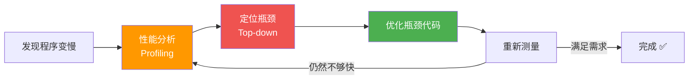

# 性能分析工具

> **所属路径**：`01_基础能力/01_开发环境与技术英语/09_Python内存模型与性能/03_性能分析工具`
> **预计学习时间**：50 分钟
> **难度等级**：⭐⭐

---

## 前置知识

- [对象模型与引用](../01_对象模型与引用/01_对象模型与引用.md)（理解 Python 对象和内存模型基础）
- [装饰器与上下文管理器](../../01_编程语言基础/06_装饰器与上下文管理器/)（了解装饰器，用于构建计时工具）
- [函数与模块](../../01_编程语言基础/03_函数与模块/03_函数与模块.md)（了解函数和模块的基本使用）

> 如果以上内容还不熟悉，建议先完成对应课程再继续。

---

## 学习目标

完成本节后，你将能够：

1. 使用 `time` 和 `timeit` 准确测量代码执行时间
2. 使用 `cProfile` 分析函数级别的性能瓶颈
3. 使用 `line_profiler` 定位行级别的耗时代码
4. 使用 `memory_profiler` 分析内存使用情况
5. 建立"先测量，后优化"的性能调优方法论

---

## 正文讲解

### 1. 为什么需要性能分析？

程序员中有一句名言：

> *"过早优化是万恶之源"* ——Donald Knuth

这句话的意思不是"不要优化"，而是"不要在没有数据支持的情况下优化"。你凭直觉认为慢的代码，可能根本不是瓶颈；而真正的瓶颈往往藏在你意想不到的地方。

**性能分析（Profiling）** 就是用工具来测量代码的实际表现——哪个函数调用最多、哪行代码最耗时、哪里分配了最多内存。有了数据，你才能把有限的优化时间用在刀刃上。



> 📌 **图解说明**：性能优化的正确流程——先分析、再定位、再优化、再验证。不要跳过分析直接优化！

### 2. 计时——最简单的性能测量

#### 手动计时

最直观的方式是用 `time.perf_counter()` 手动计时：

```python
# 文件：code/manual_timing.py
import time

def slow_sum(n):
    """用循环求和（慢）"""
    total = 0
    for i in range(n):
        total += i
    return total

def fast_sum(n):
    """用数学公式求和（快）"""
    return n * (n - 1) // 2

# 手动计时
n = 10_000_000

start = time.perf_counter()
result1 = slow_sum(n)
elapsed1 = time.perf_counter() - start
print(f"循环求和: {elapsed1:.4f}s, 结果: {result1}")

start = time.perf_counter()
result2 = fast_sum(n)
elapsed2 = time.perf_counter() - start
print(f"公式求和: {elapsed2:.6f}s, 结果: {result2}")

print(f"\n加速比: {elapsed1 / elapsed2:.0f}x")
```

**运行说明**：
- 环境要求：Python 3.10+
- 运行命令：`python code/manual_timing.py`

**预期输出**（时间因机器而异）：
```
循环求和: 0.5432s, 结果: 49999995000000
公式求和: 0.000001s, 结果: 49999995000000

加速比: 543200x
```

#### 装饰器计时器

为了复用计时逻辑，我们可以把它封装为 **[装饰器（Decorator）](../../01_编程语言基础/06_装饰器与上下文管理器/)** ：

```python
# 文件：code/timer_decorator.py
import time
import functools

def timer(func):
    """计时装饰器"""
    @functools.wraps(func)
    def wrapper(*args, **kwargs):
        start = time.perf_counter()
        result = func(*args, **kwargs)
        elapsed = time.perf_counter() - start
        print(f"[{func.__name__}] 耗时: {elapsed:.6f}s")
        return result
    return wrapper

@timer
def process_data(n):
    """模拟数据处理"""
    return sum(i ** 2 for i in range(n))

result = process_data(1_000_000)
print(f"结果: {result}")
```

#### timeit——专业的微基准测量

对于非常快的代码片段（微秒级），单次测量误差很大。`timeit` 模块通过多次运行取平均值来得到更准确的结果：

```python
# 文件：code/timeit_demo.py
import timeit

# 比较列表推导式 vs map + lambda
n = 1000

# 方式 1：列表推导式
time1 = timeit.timeit(
    "[x ** 2 for x in range(1000)]",
    number=10000,
)

# 方式 2：map + lambda
time2 = timeit.timeit(
    "list(map(lambda x: x ** 2, range(1000)))",
    number=10000,
)

# 方式 3：map + 内置函数
time3 = timeit.timeit(
    "list(map(pow, range(1000), [2]*1000))",
    number=10000,
)

print(f"列表推导式: {time1:.4f}s")
print(f"map + lambda: {time2:.4f}s")
print(f"map + pow:    {time3:.4f}s")

# 也可以测量自定义函数
def my_function():
    return sorted([3, 1, 4, 1, 5, 9, 2, 6, 5, 3, 5])

time4 = timeit.timeit(my_function, number=100000)
print(f"\n排序函数: {time4:.4f}s（100000 次）")
print(f"单次平均: {time4 / 100000 * 1e6:.2f}μs")
```

**运行说明**：
- 环境要求：Python 3.10+
- 运行命令：`python code/timeit_demo.py`

**预期输出**（时间因机器而异）：
```
列表推导式: 3.2145s
map + lambda: 4.1234s
map + pow:    4.5678s

排序函数: 0.4567s（100000 次）
单次平均: 4.57μs
```

### 3. cProfile——函数级性能分析

当你的程序有很多函数互相调用时，单纯的计时无法告诉你"瓶颈在哪个函数"。`cProfile` 是 Python 标准库自带的 **函数级分析器（Function-level Profiler）** ：

```python
# 文件：code/cprofile_demo.py
import cProfile
import pstats
import io

def read_data(n):
    """模拟读取数据"""
    return list(range(n))

def process(data):
    """模拟数据处理"""
    return [x ** 2 for x in data]

def filter_data(data):
    """模拟数据过滤"""
    return [x for x in data if x % 3 == 0]

def aggregate(data):
    """模拟聚合计算"""
    return sum(data)

def pipeline(n):
    """完整的数据处理流水线"""
    data = read_data(n)
    processed = process(data)
    filtered = filter_data(processed)
    result = aggregate(filtered)
    return result

# 方式 1：直接使用 cProfile.run()
print("=== cProfile 基本用法 ===")
cProfile.run("pipeline(1_000_000)", sort="cumulative")

# 方式 2：编程方式使用，便于控制输出
print("\n=== 编程方式 ===")
profiler = cProfile.Profile()
profiler.enable()

result = pipeline(1_000_000)

profiler.disable()

# 格式化输出
stream = io.StringIO()
stats = pstats.Stats(profiler, stream=stream)
stats.sort_stats("cumulative")
stats.print_stats(10)  # 只打印前 10 行
print(stream.getvalue())
print(f"计算结果: {result}")
```

**运行说明**：
- 环境要求：Python 3.10+
- 运行命令：`python code/cprofile_demo.py`

也可以从命令行直接使用 cProfile：

```bash
# 对任意脚本进行性能分析
python -m cProfile -s cumulative your_script.py

# 输出到文件，然后用 pstats 分析
python -m cProfile -o profile.stats your_script.py
python -c "import pstats; p = pstats.Stats('profile.stats'); p.sort_stats('cumulative'); p.print_stats(20)"
```

cProfile 输出中的关键列含义：

| 列名 | 含义 |
| ---- | ---- |
| `ncalls` | 函数被调用的次数 |
| `tottime` | 函数自身（不含子调用）的总耗时 |
| `percall` | tottime / ncalls |
| `cumtime` | 函数及其所有子调用的总耗时 |
| `percall` | cumtime / ncalls |

### 4. line_profiler——行级分析

cProfile 能告诉你"哪个函数慢"，但有时你还需要知道"函数里哪一行慢"。`line_profiler` 就是为此而生的：

```python
# 文件：code/line_profiler_demo.py
# 环境要求：pip install line_profiler

def process_items(n):
    """处理数据的函数，我们想知道每一行的耗时"""
    # 创建数据
    items = list(range(n))

    # 过滤
    filtered = [x for x in items if x % 2 == 0]

    # 变换
    transformed = [x ** 2 for x in filtered]

    # 排序
    sorted_data = sorted(transformed, reverse=True)

    # 聚合
    total = sum(sorted_data)
    average = total / len(sorted_data) if sorted_data else 0

    return average

# 使用 line_profiler 的编程接口
try:
    from line_profiler import LineProfiler

    profiler = LineProfiler()
    profiler.add_function(process_items)
    profiler.enable_by_count()

    result = process_items(500_000)

    profiler.disable_by_count()
    profiler.print_stats()
    print(f"结果: {result:.2f}")

except ImportError:
    print("line_profiler 未安装，使用 cProfile 替代：")
    print("安装命令: pip install line_profiler")
    print()

    # 退而求其次，用 cProfile
    import cProfile
    cProfile.run("process_items(500_000)", sort="tottime")
```

从命令行使用 `line_profiler`（需要在函数前加 `@profile` 装饰器）：

```bash
# 步骤 1：在函数前加 @profile 装饰器
# 步骤 2：使用 kernprof 运行
kernprof -l -v code/line_profiler_demo.py
```

### 5. 内存分析——memory_profiler

除了时间，内存也是重要的性能维度。`memory_profiler` 可以逐行显示内存使用变化：

```python
# 文件：code/memory_demo.py
import sys

def show_size():
    """展示不同数据结构的内存占用"""
    # 基础类型
    print("=== 基础类型大小 ===")
    for obj in [0, 1, 256, 10**20, 3.14, True, None, "", "hello", b"hello"]:
        print(f"  {str(obj):>15} ({type(obj).__name__:>5}): {sys.getsizeof(obj)} bytes")

    # 容器类型
    print("\n=== 容器类型大小 ===")
    containers = [
        ("空列表", []),
        ("10 元素列表", list(range(10))),
        ("1000 元素列表", list(range(1000))),
        ("空字典", {}),
        ("10 键字典", {i: i for i in range(10)}),
        ("空集合", set()),
        ("10 元素集合", set(range(10))),
        ("空元组", ()),
        ("10 元素元组", tuple(range(10))),
    ]
    for name, obj in containers:
        print(f"  {name:>15}: {sys.getsizeof(obj)} bytes")

    # 注意：getsizeof 只计算对象自身，不递归计算内容
    print("\n=== 浅 vs 深 大小 ===")
    nested = [[i] * 100 for i in range(100)]
    shallow = sys.getsizeof(nested)

    # 手动计算深层大小
    deep = sys.getsizeof(nested)
    for item in nested:
        deep += sys.getsizeof(item)
    print(f"  嵌套列表浅大小: {shallow} bytes")
    print(f"  嵌套列表深大小（估算）: {deep} bytes")

show_size()
```

如果需要逐行内存分析，可以使用 `memory_profiler`：

```python
# 文件：code/memory_profiler_demo.py
# 环境要求：pip install memory_profiler

try:
    from memory_profiler import profile as mem_profile

    @mem_profile
    def memory_heavy_function():
        """内存密集型函数"""
        # 创建大列表
        big_list = [i ** 2 for i in range(1_000_000)]

        # 创建字典
        big_dict = {i: str(i) for i in range(500_000)}

        # 过滤
        filtered = [x for x in big_list if x % 7 == 0]

        # 清理
        del big_list
        del big_dict

        return len(filtered)

    result = memory_heavy_function()
    print(f"结果: {result}")

except ImportError:
    print("memory_profiler 未安装")
    print("安装命令: pip install memory_profiler")
    print("然后运行: python -m memory_profiler code/memory_profiler_demo.py")
```

### 6. 性能分析实战方法论

总结一下，完整的性能分析流程是：

1. **先用 timeit 或手动计时** 确认"确实有性能问题"
2. **用 cProfile** 找到最耗时的函数（宏观定位）
3. **用 line_profiler** 找到函数中最耗时的行（微观定位）
4. **用 memory_profiler** 检查是否有内存问题
5. **优化后重新测量**，确认改进效果

| 工具 | 粒度 | 开销 | 场景 |
| ---- | ---- | ---- | ---- |
| `time.perf_counter()` | 代码块 | 极低 | 快速检查 |
| `timeit` | 表达式/函数 | 低 | 微基准测试 |
| `cProfile` | 函数 | 中等 | 找到最慢的函数 |
| `line_profiler` | 行 | 较高 | 分析函数内部热点 |
| `memory_profiler` | 行 | 高 | 分析内存使用 |
| `sys.getsizeof()` | 对象 | 极低 | 检查单个对象大小 |

---

## 动手实践

上面的代码示例已经涵盖了各种性能分析工具的使用。建议你在自己的项目中选择一个"感觉慢"的脚本，按照上述方法论进行完整的性能分析。

---

## 典型误区

| 误区 | 正确理解 |
| ---- | -------- |
| 凭直觉判断瓶颈 | 必须用工具测量。人的直觉经常是错的——真正的瓶颈往往出人意料 |
| 只测一次就下结论 | 应多次测量取平均值。系统负载、GC 触发等因素都会影响单次结果 |
| 优化所有代码 | 只优化瓶颈代码。根据 80/20 法则，20% 的代码占了 80% 的运行时间 |
| `time.time()` 足够精确 | `time.perf_counter()` 的精度更高（纳秒级），`time.time()` 可能受系统时钟调整影响 |

---

## 练习题

### 练习 1：比较字符串拼接方式（难度：⭐）

使用 `timeit` 比较以下三种字符串拼接方式的性能（拼接 1000 个数字字符串）：
1. `+` 逐个拼接
2. `"".join()` 方法
3. f-string 格式化

<details>
<summary>💡 提示</summary>

分别编写三个函数实现相同功能，然后用 `timeit.timeit()` 测量每个函数执行 1000 次的总时间。

</details>

<details>
<summary>✅ 参考答案</summary>

```python
import timeit

def concat_plus():
    s = ""
    for i in range(1000):
        s += str(i)
    return s

def concat_join():
    return "".join(str(i) for i in range(1000))

def concat_fstring():
    parts = [f"{i}" for i in range(1000)]
    return "".join(parts)

for func in [concat_plus, concat_join, concat_fstring]:
    t = timeit.timeit(func, number=1000)
    print(f"{func.__name__:>20}: {t:.4f}s")

# join 通常最快，+ 拼接最慢（因为每次创建新字符串）
```

</details>

### 练习 2：分析并优化代码（难度：⭐⭐）

以下代码运行缓慢，使用 cProfile 找出瓶颈并优化：

```python
def find_common_elements(list1, list2):
    common = []
    for item in list1:
        if item in list2:  # 这里是 O(n) 查找
            common.append(item)
    return common

data1 = list(range(10000))
data2 = list(range(5000, 15000))
result = find_common_elements(data1, data2)
```

<details>
<summary>💡 提示</summary>

`item in list2` 对列表是 $O(n)$ 操作。将 `list2` 转换为集合（set），查找变为 $O(1)$ 。

</details>

<details>
<summary>✅ 参考答案</summary>

```python
def find_common_optimized(list1, list2):
    set2 = set(list2)  # O(n) 构建一次
    return [item for item in list1 if item in set2]  # O(1) 查找

# 或更简洁：
def find_common_set(list1, list2):
    return list(set(list1) & set(list2))

import timeit
data1 = list(range(10000))
data2 = list(range(5000, 15000))

t1 = timeit.timeit(lambda: find_common_elements(data1, data2), number=10)
t2 = timeit.timeit(lambda: find_common_optimized(data1, data2), number=10)
print(f"原始: {t1:.4f}s")
print(f"优化: {t2:.4f}s")
print(f"加速: {t1/t2:.0f}x")
```

</details>

---

## 下一步学习

- 📖 下一个知识点：[内存优化策略](../04_内存优化策略/04_内存优化策略.md)
- 🔗 相关知识点：[性能分析](../../11_调试/04_性能分析/)（调试课程中的性能分析部分）
- 🔗 相关知识点：[NumPy基础](../../../04_数值计算与科学计算/01_NumPy基础/)（NumPy 的向量化计算是 Python 数值计算性能优化的关键）

---

## 参考资料

1. [Python 官方文档 - timeit](https://docs.python.org/3/library/timeit.html) — 标准库计时模块参考（官方文档）
2. [Python 官方文档 - cProfile](https://docs.python.org/3/library/profile.html) — 标准库性能分析模块参考（官方文档）
3. [line_profiler 文档](https://github.com/pyutils/line_profiler) — 行级性能分析工具（开源项目，BSD 许可）
4. [memory_profiler 文档](https://github.com/pythonprofilers/memory_profiler) — 内存分析工具（开源项目，BSD 许可）
