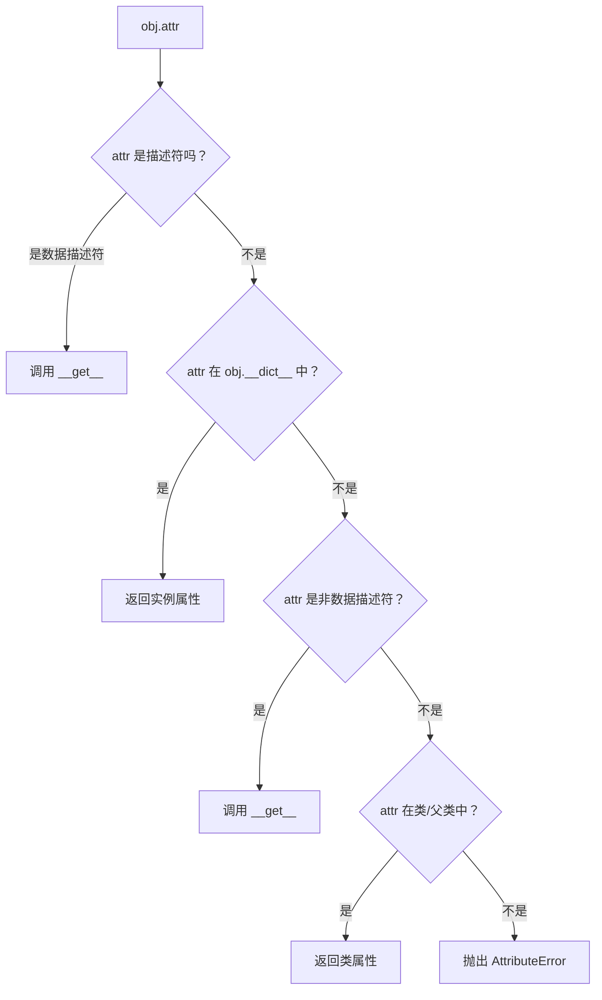

# 描述符协议

> **所属路径**：`01_基础能力/01_开发环境与技术英语/10_元编程与高级特性/01_描述符协议`
> **预计学习时间**：50 分钟
> **难度等级**：⭐⭐⭐

---

## 前置知识

- [装饰器与上下文管理器](../../01_编程语言基础/06_装饰器与上下文管理器/06_装饰器与上下文管理器.md)（理解装饰器的工作机制和 `__enter__`/`__exit__` 协议）
- [类型提示与静态检查](../../01_编程语言基础/08_类型提示与静态检查/08_类型提示与静态检查.md)（了解 Python 类与实例的基本概念）
- [自定义容器](../../03_容器类型深入/04_自定义容器/04_自定义容器.md)（了解魔术方法的使用方式）

> 如果以上内容还不熟悉，建议先完成对应课程再继续。

---

## 学习目标

完成本节后，你将能够：

1. 解释描述符协议的三个核心方法 `__get__`、`__set__`、`__delete__` 的调用时机
2. 区分 **数据描述符（Data Descriptor）** 和 **非数据描述符（Non-data Descriptor）** 的优先级差异
3. 使用描述符实现类型检查、延迟计算等实用功能
4. 理解 `property`、`classmethod`、`staticmethod` 底层的描述符实现原理

---

## 正文讲解

### 1. 属性访问背后的秘密

当你写下 `obj.name` 这样简单的一行代码时，Python 并不是直接从对象的字典里取出一个值那么简单。它实际上经历了一套精心设计的 **属性查找机制（Attribute Lookup）** ，而这套机制的核心就是 **描述符协议（Descriptor Protocol）** 。

你可能已经用过 `@property` 装饰器来为类定义"伪属性"——读取时自动调用 getter，赋值时自动调用 setter。有没有想过 `property` 是怎么做到的？答案就是描述符。



> 📌 **图解说明**：Python 属性查找的优先级链。数据描述符优先于实例字典，而实例字典又优先于非数据描述符。这个优先级是理解描述符的关键。

### 2. 描述符协议的三个方法

**描述符（Descriptor）** 是一个实现了以下方法中至少一个的对象：

| 方法 | 触发时机 | 签名 |
| ---- | -------- | ---- |
| `__get__` | 读取属性时 | `__get__(self, obj, objtype=None)` |
| `__set__` | 赋值属性时 | `__set__(self, obj, value)` |
| `__delete__` | 删除属性时 | `__delete__(self, obj)` |

其中 `self` 是描述符实例本身， `obj` 是拥有这个描述符的实例（如果通过类访问则为 `None` ）， `objtype` 是拥有这个描述符的类。

来看一个最简单的描述符——一个在每次读取时打印日志的属性：

```python
class LoggedAttribute:
    """一个会在读取时打印日志的描述符"""
    
    def __set_name__(self, owner, name):
        # Python 3.6+ 自动调用，告诉描述符自己叫什么名字
        self.name = name
        self.private_name = f'_{name}'
    
    def __get__(self, obj, objtype=None):
        if obj is None:
            return self  # 通过类访问时返回描述符本身
        value = getattr(obj, self.private_name, '未设置')
        print(f"[LOG] 读取 {self.name} = {value}")
        return value
    
    def __set__(self, obj, value):
        print(f"[LOG] 设置 {self.name} = {value}")
        setattr(obj, self.private_name, value)


class User:
    name = LoggedAttribute()
    email = LoggedAttribute()


u = User()
u.name = "Alice"        # [LOG] 设置 name = Alice
u.email = "a@test.com"  # [LOG] 设置 email = a@test.com
print(u.name)           # [LOG] 读取 name = Alice → Alice
```

注意 `__set_name__` 方法——它在 Python 3.6 中引入，当描述符被赋值给类属性时自动调用，让描述符知道自己被绑定到了哪个名字上。这省去了手动传入名称的麻烦。

### 3. 数据描述符 vs 非数据描述符

描述符分为两类，区别在于它们实现了哪些方法：

- **数据描述符（Data Descriptor）** ：同时实现了 `__get__` 和 `__set__`（或 `__delete__` ）
- **非数据描述符（Non-data Descriptor）** ：只实现了 `__get__`

它们之间最重要的区别是 **查找优先级** ：

```
数据描述符 > 实例 __dict__ > 非数据描述符
```

这意味着：如果类中定义了一个数据描述符 `x` ，即使你往实例字典 `obj.__dict__['x']` 里塞了一个值，访问 `obj.x` 时仍然会触发描述符的 `__get__` ，而不是返回实例字典中的值。

```python
class DataDesc:
    """数据描述符：同时有 __get__ 和 __set__"""
    def __get__(self, obj, objtype=None):
        return "来自数据描述符"
    def __set__(self, obj, value):
        pass  # 拦截赋值

class NonDataDesc:
    """非数据描述符：只有 __get__"""
    def __get__(self, obj, objtype=None):
        return "来自非数据描述符"

class MyClass:
    data_attr = DataDesc()
    nondata_attr = NonDataDesc()

obj = MyClass()

# 尝试在实例字典中设置同名属性
obj.__dict__['data_attr'] = "实例字典的值"
obj.__dict__['nondata_attr'] = "实例字典的值"

print(obj.data_attr)     # 来自数据描述符 ← 数据描述符胜出！
print(obj.nondata_attr)  # 实例字典的值   ← 实例字典胜出！
```

> 💡 **为什么这样设计？** 数据描述符需要完全控制属性的读写行为（例如类型检查、只读保护），所以必须优先于实例字典。而非数据描述符（如普通方法）只需要在实例字典中找不到同名属性时提供默认行为。

### 4. property 的描述符本质

你最熟悉的描述符其实就是 `property` 。下面用描述符手动实现一个简化版的 `property` ：

```python
class MyProperty:
    """简化版 property 实现"""
    
    def __init__(self, fget=None, fset=None, fdel=None):
        self.fget = fget
        self.fset = fset
        self.fdel = fdel
    
    def __get__(self, obj, objtype=None):
        if obj is None:
            return self
        if self.fget is None:
            raise AttributeError("不可读")
        return self.fget(obj)
    
    def __set__(self, obj, value):
        if self.fset is None:
            raise AttributeError("不可写")
        self.fset(obj, value)
    
    def __delete__(self, obj):
        if self.fdel is None:
            raise AttributeError("不可删除")
        self.fdel(obj)
    
    def setter(self, fset):
        return type(self)(self.fget, fset, self.fdel)


class Circle:
    def __init__(self, radius):
        self._radius = radius
    
    @MyProperty
    def radius(self):
        return self._radius
    
    @radius.setter
    def radius(self, value):
        if value < 0:
            raise ValueError("半径不能为负")
        self._radius = value


c = Circle(5)
print(c.radius)   # 5
c.radius = 10
print(c.radius)   # 10
# c.radius = -1   # ValueError: 半径不能为负
```

同样的原理也适用于 `classmethod` 和 `staticmethod` ——它们都是描述符，只不过在 `__get__` 中对函数做了不同的包装。

### 5. 实用描述符：类型校验器

描述符最常见的实际用途之一是 **属性类型校验** 。下面实现一个通用的类型检查描述符：

```python
class Typed:
    """通用类型校验描述符"""
    
    def __init__(self, expected_type):
        self.expected_type = expected_type
    
    def __set_name__(self, owner, name):
        self.name = name
        self.private_name = f'_{name}'
    
    def __get__(self, obj, objtype=None):
        if obj is None:
            return self
        return getattr(obj, self.private_name, None)
    
    def __set__(self, obj, value):
        if not isinstance(value, self.expected_type):
            raise TypeError(
                f"{self.name} 期望 {self.expected_type.__name__}，"
                f"实际收到 {type(value).__name__}"
            )
        setattr(obj, self.private_name, value)


# 定义便捷的类型描述符
class String(Typed):
    def __init__(self):
        super().__init__(str)

class Integer(Typed):
    def __init__(self):
        super().__init__(int)

class Float(Typed):
    def __init__(self):
        super().__init__(float)


class Product:
    name = String()
    price = Float()
    quantity = Integer()
    
    def __init__(self, name, price, quantity):
        self.name = name
        self.price = price
        self.quantity = quantity


p = Product("笔记本", 29.9, 100)
print(p.name, p.price, p.quantity)  # 笔记本 29.9 100

try:
    p.price = "免费"  # TypeError: price 期望 float，实际收到 str
except TypeError as e:
    print(e)
```

### 6. 实用描述符：延迟计算属性

另一个经典用例是 **延迟计算（Lazy Evaluation）** ——属性值只在第一次访问时计算，之后缓存结果：

```python
class LazyProperty:
    """延迟计算描述符（非数据描述符）"""
    
    def __init__(self, func):
        self.func = func
        self.name = func.__name__
    
    def __get__(self, obj, objtype=None):
        if obj is None:
            return self
        # 计算值并存入实例字典
        value = self.func(obj)
        # 存入实例字典后，下次访问直接从字典取（因为非数据描述符优先级低于实例字典）
        setattr(obj, self.name, value)
        return value


class DataAnalyzer:
    def __init__(self, data):
        self.data = data
    
    @LazyProperty
    def mean(self):
        print("计算均值...")
        return sum(self.data) / len(self.data)
    
    @LazyProperty
    def variance(self):
        print("计算方差...")
        m = self.mean
        return sum((x - m) ** 2 for x in self.data) / len(self.data)


analyzer = DataAnalyzer([1, 2, 3, 4, 5])
print(analyzer.mean)      # 计算均值... → 3.0
print(analyzer.mean)      # 3.0（直接从实例字典取，不再计算）
print(analyzer.variance)  # 计算方差... → 2.0
```

> 💡 **设计巧思**：`LazyProperty` 是非数据描述符（只有 `__get__` ），所以第一次访问后将结果存入实例字典 `obj.__dict__` ，后续访问时实例字典优先于描述符，直接返回缓存值。Python 3.8+ 提供了 `functools.cached_property` 实现相同功能。

---

## 动手实践

将以上代码保存为文件运行，验证描述符的行为：

```python
# 文件：code/descriptor_demo.py
# 描述符协议综合演示

class RangeChecked:
    """范围校验描述符"""
    
    def __init__(self, min_val=None, max_val=None):
        self.min_val = min_val
        self.max_val = max_val
    
    def __set_name__(self, owner, name):
        self.name = name
        self.private_name = f'_{name}'
    
    def __get__(self, obj, objtype=None):
        if obj is None:
            return self
        return getattr(obj, self.private_name, None)
    
    def __set__(self, obj, value):
        if self.min_val is not None and value < self.min_val:
            raise ValueError(f"{self.name} 不能小于 {self.min_val}")
        if self.max_val is not None and value > self.max_val:
            raise ValueError(f"{self.name} 不能大于 {self.max_val}")
        setattr(obj, self.private_name, value)


class Student:
    age = RangeChecked(min_val=0, max_val=150)
    score = RangeChecked(min_val=0, max_val=100)
    
    def __init__(self, name, age, score):
        self.name = name
        self.age = age
        self.score = score
    
    def __repr__(self):
        return f"Student({self.name}, age={self.age}, score={self.score})"


# 正常使用
s = Student("小明", 18, 95)
print(s)  # Student(小明, age=18, score=95)

# 边界检查
try:
    s.score = 150
except ValueError as e:
    print(f"错误：{e}")  # 错误：score 不能大于 100

try:
    s.age = -1
except ValueError as e:
    print(f"错误：{e}")  # 错误：age 不能小于 0
```

**运行说明**：
- 环境要求：Python 3.10+
- 运行命令：`python code/descriptor_demo.py`

**预期输出**：
```
Student(小明, age=18, score=95)
错误：score 不能大于 100
错误：age 不能小于 0
```

---

## 典型误区

| 误区 | 正确理解 |
| ---- | -------- |
| 描述符只能用于 `property` 这种场景 | 描述符是 Python 属性访问的底层机制，`property`、`classmethod`、`staticmethod`、方法绑定、`__slots__` 都是描述符的应用 |
| 数据描述符和非数据描述符的区别只是实现的方法不同 | 关键区别在于 **查找优先级** ：数据描述符优先于实例字典，非数据描述符则不是 |
| 描述符实例应该直接存储属性值 | 描述符实例是类级别共享的，不能在描述符实例上直接存储每个对象的值，应该存储在宿主对象的 `__dict__` 中 |
| `__set_name__` 是必须实现的 | 它是可选的便利方法（Python 3.6+），没有它也可以通过其他方式让描述符知道自己的名字 |

---

## 练习题

### 练习 1：只读描述符（难度：⭐⭐）

实现一个 `ReadOnly` 描述符，允许在 `__init__` 中赋值一次，之后不允许修改。

<details>
<summary>💡 提示</summary>

在 `__set__` 中检查实例字典是否已经有对应的值。如果有，抛出 `AttributeError` 。

</details>

<details>
<summary>✅ 参考答案</summary>

```python
class ReadOnly:
    def __set_name__(self, owner, name):
        self.name = name
        self.private_name = f'_{name}'
    
    def __get__(self, obj, objtype=None):
        if obj is None:
            return self
        return getattr(obj, self.private_name)
    
    def __set__(self, obj, value):
        if hasattr(obj, self.private_name):
            raise AttributeError(f"{self.name} 是只读属性")
        setattr(obj, self.private_name, value)


class Config:
    host = ReadOnly()
    port = ReadOnly()
    
    def __init__(self, host, port):
        self.host = host
        self.port = port


cfg = Config("localhost", 8080)
print(cfg.host)  # localhost
try:
    cfg.host = "remote"
except AttributeError as e:
    print(e)  # host 是只读属性
```

</details>

### 练习 2：缓存描述符（难度：⭐⭐⭐）

实现一个带过期时间的缓存描述符 `TimedCache` ，在指定秒数内返回缓存值，超时后重新计算。

<details>
<summary>💡 提示</summary>

使用 `time.time()` 记录计算时间，在 `__get__` 中比较当前时间与缓存时间的差值。将计算结果和时间戳一起存储在实例字典中。

</details>

<details>
<summary>✅ 参考答案</summary>

```python
import time

class TimedCache:
    def __init__(self, func, ttl=5):
        self.func = func
        self.ttl = ttl
        self.name = func.__name__
        self.cache_key = f'_cache_{func.__name__}'
    
    def __get__(self, obj, objtype=None):
        if obj is None:
            return self
        cache = getattr(obj, self.cache_key, None)
        now = time.time()
        if cache is not None:
            value, timestamp = cache
            if now - timestamp < self.ttl:
                return value
        value = self.func(obj)
        setattr(obj, self.cache_key, (value, now))
        return value


def timed_cache(ttl=5):
    def decorator(func):
        return TimedCache(func, ttl)
    return decorator


class WeatherService:
    @timed_cache(ttl=3)
    def temperature(self):
        print("正在获取温度数据...")
        return 25.5


ws = WeatherService()
print(ws.temperature)  # 正在获取温度数据... → 25.5
print(ws.temperature)  # 25.5（缓存）
time.sleep(4)
print(ws.temperature)  # 正在获取温度数据... → 25.5（缓存过期，重新计算）
```

</details>

---

## 下一步学习

- 📖 下一个知识点：[元类](../02_元类/02_元类.md)
- 🔗 相关知识点：[Python数据模型](../05_Python数据模型/05_Python数据模型.md)
- 🔗 相关知识点：[装饰器与上下文管理器](../../01_编程语言基础/06_装饰器与上下文管理器/06_装饰器与上下文管理器.md)

---

## 参考资料

1. [Descriptor HowTo Guide — Python 官方文档](https://docs.python.org/3/howto/descriptor.html) — Python 官方的描述符指南，包含完整的属性查找机制说明（官方文档）
2. [Data Model — Python 官方文档](https://docs.python.org/3/reference/datamodel.html#descriptors) — 描述符协议的形式化定义（官方文档）
3. [Python Descriptors: An Introduction — Real Python](https://realpython.com/python-descriptors/) — 配有丰富代码示例的描述符教程（公开教程）
