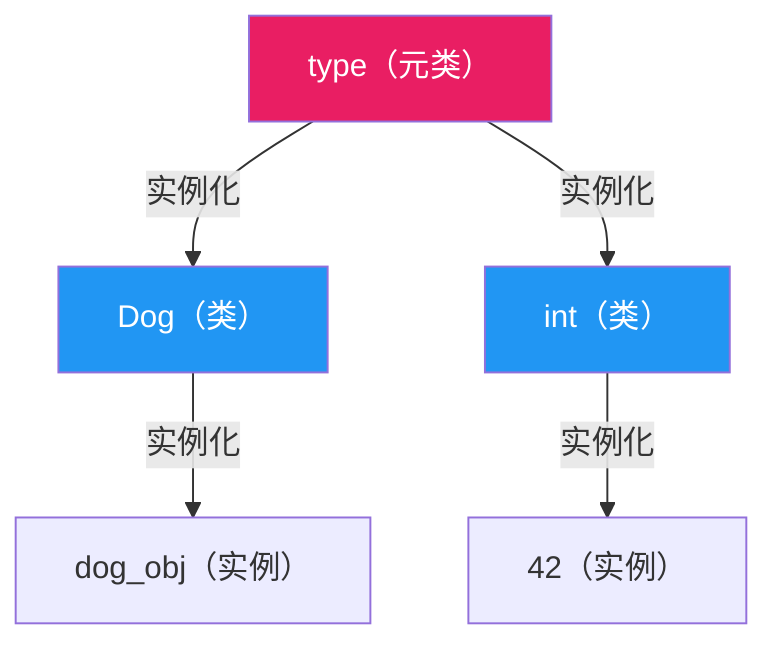
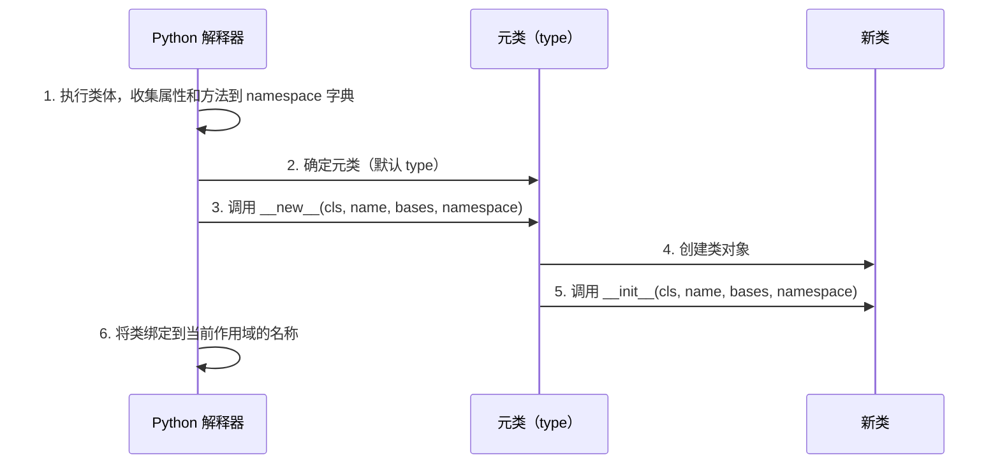

# 元类

> **所属路径**：`01_基础能力/01_开发环境与技术英语/10_元编程与高级特性/02_元类`
> **预计学习时间**：60 分钟
> **难度等级**：⭐⭐⭐⭐

---

## 前置知识

- [装饰器与上下文管理器](../../01_编程语言基础/06_装饰器与上下文管理器/06_装饰器与上下文管理器.md)（理解类装饰器的工作方式）
- [描述符协议](../01_描述符协议/01_描述符协议.md)（理解 Python 属性查找机制和描述符协议）

> 如果以上内容还不熟悉，建议先完成对应课程再继续。

---

## 学习目标

完成本节后，你将能够：

1. 解释"类也是对象"这一 Python 核心概念，理解 `type` 的双重身份
2. 使用 `type()` 动态创建类
3. 编写自定义元类，在类创建时自动执行验证或注册逻辑
4. 区分元类与类装饰器的适用场景，避免过度使用元类

---

## 正文讲解

### 1. 类也是对象

在 Python 中，**一切皆对象** 。整数是对象，字符串是对象，函数是对象——那么类呢？

```python
class Dog:
    pass

print(type(42))       # <class 'int'>
print(type("hello"))  # <class 'str'>
print(type(Dog))      # <class 'type'>
print(type(Dog()))    # <class 'Dog'>
```

整数 `42` 是 `int` 类的实例，字符串 `"hello"` 是 `str` 类的实例。而 `Dog` 类本身，竟然也是某个类的"实例"——它是 `type` 的实例。

**元类（Metaclass）** 就是"类的类"。普通的类定义了实例的行为，而元类定义了类本身的行为。



> 📌 **图解说明**：Python 的类型层次。`type` 是默认的元类，所有类都是 `type` 的实例。`type` 自身也是 `type` 的实例（自引用），这是 Python 类型系统的根。

### 2. type() 的双重身份

`type` 在 Python 中扮演两个角色：

- **检查类型**：`type(obj)` 返回对象的类型
- **创建类**：`type(name, bases, namespace)` 动态创建一个新类

也就是说，当你写 `class Dog: pass` 时，Python 实际上在幕后执行了类似以下的操作：

```python
# 这两种写法完全等价：

# 写法 1：class 语句
class Dog:
    sound = "汪汪"
    def bark(self):
        return self.sound

# 写法 2：直接调用 type()
Dog = type('Dog', (), {
    'sound': '汪汪',
    'bark': lambda self: self.sound,
})

d = Dog()
print(d.bark())  # 汪汪
```

`type(name, bases, namespace)` 的三个参数分别是：
- `name` ：类名（字符串）
- `bases` ：基类元组，如 `(Base1, Base2)`
- `namespace` ：类的命名空间字典，包含属性和方法

### 3. 类的创建过程

当 Python 解释器遇到一个 `class` 语句时，实际经历了以下步骤：



> 📌 **图解说明**：类创建的完整流程。元类的 `__new__` 负责创建类对象，`__init__` 负责初始化类对象。我们可以在这两个环节插入自定义逻辑。

### 4. 编写第一个元类

现在来写一个自定义元类。假设你在开发一个框架，要求所有模型类必须定义 `table_name` 属性：

```python
class ModelMeta(type):
    """确保每个模型类都定义了 table_name"""
    
    def __new__(mcs, name, bases, namespace):
        # 跳过基类本身的检查
        cls = super().__new__(mcs, name, bases, namespace)
        
        if bases:  # 只检查子类，不检查基类
            if 'table_name' not in namespace:
                raise TypeError(
                    f"模型类 {name} 必须定义 table_name 属性"
                )
        return cls


class Model(metaclass=ModelMeta):
    """所有模型的基类"""
    pass


class User(Model):
    table_name = "users"
    # ... 其他属性和方法


# 下面这个会报错：
try:
    class Product(Model):
        pass  # 忘记定义 table_name
except TypeError as e:
    print(e)  # 模型类 Product 必须定义 table_name 属性
```

元类通过 `metaclass=ModelMeta` 参数指定。所有继承自 `Model` 的子类都会自动使用 `ModelMeta` 作为元类，从而在类定义时就得到验证。

### 5. 元类的实际应用：自动注册

另一个经典用例是 **插件注册** ——自动收集所有子类，不需要手动维护注册表：

```python
class PluginMeta(type):
    """自动注册所有插件子类"""
    registry = {}
    
    def __new__(mcs, name, bases, namespace):
        cls = super().__new__(mcs, name, bases, namespace)
        # 跳过基类本身
        if bases:
            plugin_name = namespace.get('name', name.lower())
            mcs.registry[plugin_name] = cls
        return cls


class Plugin(metaclass=PluginMeta):
    """插件基类"""
    name = None


class JSONPlugin(Plugin):
    name = "json"
    def process(self, data):
        return f"JSON处理: {data}"


class XMLPlugin(Plugin):
    name = "xml"
    def process(self, data):
        return f"XML处理: {data}"


class CSVPlugin(Plugin):
    name = "csv"
    def process(self, data):
        return f"CSV处理: {data}"


# 所有插件自动注册，无需手动维护
print(PluginMeta.registry)
# {'json': <class 'JSONPlugin'>, 'xml': <class 'XMLPlugin'>, 'csv': <class 'CSVPlugin'>}

# 根据名称获取插件
plugin = PluginMeta.registry['json']()
print(plugin.process("数据"))  # JSON处理: 数据
```

### 6. __init_subclass__——轻量替代方案

Python 3.6 引入了 `__init_subclass__` ，提供了一种不需要自定义元类就能在子类创建时执行逻辑的方式：

```python
class Model:
    _registry = {}
    
    def __init_subclass__(cls, table_name=None, **kwargs):
        super().__init_subclass__(**kwargs)
        if table_name is None:
            raise TypeError(f"{cls.__name__} 必须指定 table_name")
        cls.table_name = table_name
        Model._registry[table_name] = cls


class User(Model, table_name="users"):
    pass

class Order(Model, table_name="orders"):
    pass

print(Model._registry)
# {'users': <class 'User'>, 'orders': <class 'Order'>}
print(User.table_name)  # users
```

> 💡 **选择建议**：如果你的需求只是在子类创建时做一些简单的检查或注册，优先使用 `__init_subclass__` ，它比元类更简单、更易读。只有当你需要控制类的创建过程本身（比如修改类的 `__new__` 行为）时，才需要自定义元类。

### 7. 元类 vs 类装饰器

| 特性 | 元类 | 类装饰器 |
| ---- | ---- | -------- |
| 作用时机 | 类创建时（`__new__`/`__init__` ） | 类创建后 |
| 继承性 | 子类自动继承元类 | 每个类需要单独装饰 |
| 复杂度 | 高，需理解 `type` 的工作机制 | 低，就是一个函数 |
| 可组合性 | 多元类冲突困难 | 装饰器可以叠加 |
| 适用场景 | 框架级别的类型系统定制 | 简单的类增强（添加方法、注册等） |

**经验法则**：能用类装饰器或 `__init_subclass__` 解决的问题，就不要用元类。元类是最后的手段。

---

## 动手实践

下面综合演示元类和 `__init_subclass__` 的用法：

```python
# 文件：code/metaclass_demo.py
# 元类综合演示

# 用 __init_subclass__ 实现序列化框架
class Serializable:
    """可序列化基类"""
    _serializers = {}
    
    def __init_subclass__(cls, format_name=None, **kwargs):
        super().__init_subclass__(**kwargs)
        if format_name:
            Serializable._serializers[format_name] = cls
    
    @classmethod
    def get_serializer(cls, format_name):
        serializer_cls = cls._serializers.get(format_name)
        if serializer_cls is None:
            raise ValueError(f"未知的序列化格式: {format_name}")
        return serializer_cls()


class JSONSerializer(Serializable, format_name="json"):
    def serialize(self, data):
        import json
        return json.dumps(data, ensure_ascii=False)


class CSVSerializer(Serializable, format_name="csv"):
    def serialize(self, data):
        if not data:
            return ""
        headers = list(data[0].keys())
        lines = [",".join(headers)]
        for row in data:
            lines.append(",".join(str(row[h]) for h in headers))
        return "\n".join(lines)


# 使用注册表获取序列化器
data = [{"name": "Alice", "age": 30}, {"name": "Bob", "age": 25}]

json_ser = Serializable.get_serializer("json")
print("JSON 输出:")
print(json_ser.serialize(data))

csv_ser = Serializable.get_serializer("csv")
print("\nCSV 输出:")
print(csv_ser.serialize(data))

print(f"\n已注册的序列化器: {list(Serializable._serializers.keys())}")
```

**运行说明**：
- 环境要求：Python 3.10+
- 运行命令：`python code/metaclass_demo.py`

**预期输出**：
```
JSON 输出:
[{"name": "Alice", "age": 30}, {"name": "Bob", "age": 25}]

CSV 输出:
name,age
Alice,30
Bob,25

已注册的序列化器: ['json', 'csv']
```

---

## 典型误区

| 误区 | 正确理解 |
| ---- | -------- |
| 元类是 Python 高级特性的必备知识 | 99% 的 Python 代码不需要自定义元类，它主要用于框架开发（如 Django ORM、SQLAlchemy） |
| `type` 只是用来查看类型的内置函数 | `type` 同时是 Python 的默认元类，它本身也是 `type` 的实例 |
| 元类和类装饰器是互斥的选择 | 它们可以同时使用，类装饰器在元类 `__new__` 之后执行 |
| 使用元类比使用 `__init_subclass__` 更"高级" | `__init_subclass__` 是 Python 3.6+ 推荐的轻量替代方案，大多数场景下更合适 |

---

## 练习题

### 练习 1：单例元类（难度：⭐⭐⭐）

编写一个元类 `SingletonMeta` ，使得使用该元类的类只能创建一个实例。

<details>
<summary>💡 提示</summary>

在元类中重写 `__call__` 方法（它在 `MyClass()` 时被调用），检查是否已经有实例存在。

</details>

<details>
<summary>✅ 参考答案</summary>

```python
class SingletonMeta(type):
    _instances = {}
    
    def __call__(cls, *args, **kwargs):
        if cls not in cls._instances:
            instance = super().__call__(*args, **kwargs)
            cls._instances[cls] = instance
        return cls._instances[cls]


class Database(metaclass=SingletonMeta):
    def __init__(self, host="localhost"):
        self.host = host
        print(f"连接数据库: {host}")


db1 = Database("server1")  # 连接数据库: server1
db2 = Database("server2")  # 不打印（不会再次 __init__）
print(db1 is db2)          # True
print(db1.host)            # server1
```

</details>

### 练习 2：字段验证（难度：⭐⭐）

使用 `__init_subclass__` 实现一个基类 `Validated` ，要求所有子类必须定义 `required_fields` 类属性（一个列表），并验证 `__init__` 参数包含所有必需字段。

<details>
<summary>💡 提示</summary>

在 `__init_subclass__` 中检查 `required_fields` 是否存在。在基类中提供一个通用的 `__init__` 方法来检查传入的关键字参数。

</details>

<details>
<summary>✅ 参考答案</summary>

```python
class Validated:
    def __init_subclass__(cls, **kwargs):
        super().__init_subclass__(**kwargs)
        if not hasattr(cls, 'required_fields'):
            raise TypeError(f"{cls.__name__} 必须定义 required_fields")
    
    def __init__(self, **kwargs):
        missing = [f for f in self.required_fields if f not in kwargs]
        if missing:
            raise ValueError(f"缺少必要字段: {missing}")
        for key, value in kwargs.items():
            setattr(self, key, value)


class UserForm(Validated):
    required_fields = ['username', 'email']


u = UserForm(username="alice", email="a@b.com", age=25)
print(u.username, u.email, u.age)  # alice a@b.com 25

try:
    UserForm(username="bob")
except ValueError as e:
    print(e)  # 缺少必要字段: ['email']
```

</details>

---

## 下一步学习

- 📖 下一个知识点：[抽象基类与协议](../03_抽象基类与协议/03_抽象基类与协议.md)
- 🔗 相关知识点：[描述符协议](../01_描述符协议/01_描述符协议.md)
- 🔗 相关知识点：[Python数据模型](../05_Python数据模型/05_Python数据模型.md)

---

## 参考资料

1. [Metaclasses — Python 官方文档](https://docs.python.org/3/reference/datamodel.html#metaclasses) — 元类机制的形式化定义（官方文档）
2. [Python Metaclasses — Real Python](https://realpython.com/python-metaclasses/) — 配有丰富示例的元类教程（公开教程）
3. [PEP 3115 — Metaclasses in Python 3000](https://peps.python.org/pep-3115/) — 定义了 Python 3 中 `metaclass` 关键字参数的 PEP（官方 PEP）
4. [PEP 487 — Simpler customisation of class creation](https://peps.python.org/pep-0487/) — 定义了 `__init_subclass__` 和 `__set_name__` 的 PEP（官方 PEP）
