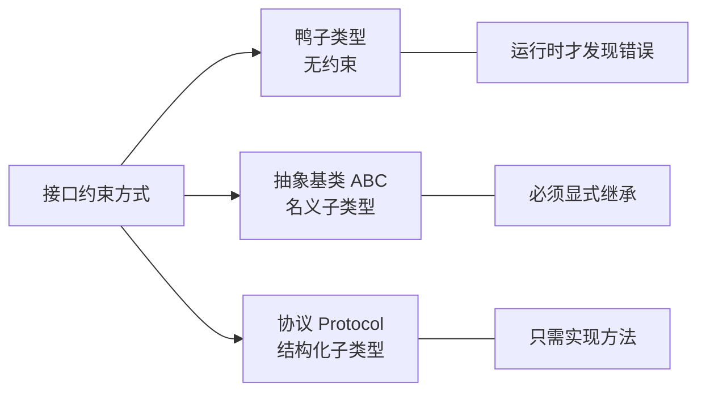

# 抽象基类与协议

> **所属路径**：`01_基础能力/01_开发环境与技术英语/10_元编程与高级特性/03_抽象基类与协议`
> **预计学习时间**：50 分钟
> **难度等级**：⭐⭐⭐

---

## 前置知识

- [类型提示与静态检查](../../01_编程语言基础/08_类型提示与静态检查/08_类型提示与静态检查.md)（了解类型注解的基本用法）
- [元类](../02_元类/02_元类.md)（理解元类的基本概念，ABC 的底层基于元类实现）

> 如果以上内容还不熟悉，建议先完成对应课程再继续。

---

## 学习目标

完成本节后，你将能够：

1. 使用 `abc.ABC` 和 `@abstractmethod` 定义抽象基类，强制子类实现指定方法
2. 解释鸭子类型与结构化子类型的区别
3. 使用 `typing.Protocol` 定义结构化协议，实现静态鸭子类型
4. 根据场景选择抽象基类或协议来约束接口

---

## 正文讲解

### 1. 从鸭子类型说起

Python 是一门推崇 **鸭子类型（Duck Typing）** 的语言——"如果它走起来像鸭子、叫起来像鸭子，那它就是鸭子。"也就是说，Python 关心的是对象 **有什么方法** ，而不是对象 **是什么类型** 。

```python
def calculate_area(shape):
    """计算面积——只要有 area() 方法就行"""
    return shape.area()

class Circle:
    def __init__(self, radius):
        self.radius = radius
    def area(self):
        return 3.14159 * self.radius ** 2

class Rectangle:
    def __init__(self, w, h):
        self.w, self.h = w, h
    def area(self):
        return self.w * self.h

# Circle 和 Rectangle 没有任何继承关系，但都能传给 calculate_area
print(calculate_area(Circle(5)))        # 78.53975
print(calculate_area(Rectangle(3, 4)))  # 12
```

鸭子类型灵活且优雅，但有一个问题：如果某个类忘记实现 `area()` 方法，只有在运行时调用那一刻才会报错。在大型项目中，这种延迟发现的 bug 代价很高。

如何在 **保持灵活性的同时** 提供 **更强的接口约束** ？Python 给出了两条路径：**抽象基类（Abstract Base Class, ABC）** 和 **协议（Protocol）** 。



> 📌 **图解说明**：Python 接口约束的三种方式。鸭子类型最灵活但无保障；ABC 最严格但需要继承；Protocol 在两者之间取得平衡。

### 2. 抽象基类（ABC）

**抽象基类（Abstract Base Class, ABC）** 是一种不能直接实例化的类，它定义了子类 **必须** 实现的方法。如果子类没有实现这些方法，在实例化时就会立即报错——而不是等到调用方法时。

```python
from abc import ABC, abstractmethod

class Shape(ABC):
    """形状抽象基类"""
    
    @abstractmethod
    def area(self) -> float:
        """计算面积"""
        pass
    
    @abstractmethod
    def perimeter(self) -> float:
        """计算周长"""
        pass
    
    def describe(self) -> str:
        """非抽象方法：子类可以直接使用"""
        return f"面积={self.area():.2f}, 周长={self.perimeter():.2f}"


class Circle(Shape):
    def __init__(self, radius: float):
        self.radius = radius
    
    def area(self) -> float:
        return 3.14159 * self.radius ** 2
    
    def perimeter(self) -> float:
        return 2 * 3.14159 * self.radius


# 正常使用
c = Circle(5)
print(c.describe())  # 面积=78.54, 周长=31.42

# 尝试直接实例化抽象基类
try:
    s = Shape()
except TypeError as e:
    print(e)  # Can't instantiate abstract class Shape with abstract methods area, perimeter

# 不完整的子类也会报错
class IncompleteShape(Shape):
    def area(self):
        return 0
    # 忘记实现 perimeter

try:
    s = IncompleteShape()
except TypeError as e:
    print(e)
    # Can't instantiate abstract class IncompleteShape with abstract method perimeter
```

ABC 的优势在于 **提前报错** ——在类实例化时就能发现缺失的方法，而不是在调用时。

### 3. 抽象属性与组合装饰器

除了抽象方法，还可以定义抽象属性和抽象类方法：

```python
from abc import ABC, abstractmethod

class DataSource(ABC):
    @property
    @abstractmethod
    def name(self) -> str:
        """数据源名称"""
        pass
    
    @abstractmethod
    def read(self) -> list:
        """读取数据"""
        pass
    
    @classmethod
    @abstractmethod
    def from_config(cls, config: dict) -> 'DataSource':
        """从配置创建数据源"""
        pass


class CSVSource(DataSource):
    def __init__(self, filepath: str):
        self._filepath = filepath
    
    @property
    def name(self) -> str:
        return f"CSV:{self._filepath}"
    
    def read(self) -> list:
        return [f"数据来自 {self._filepath}"]
    
    @classmethod
    def from_config(cls, config: dict) -> 'CSVSource':
        return cls(config['filepath'])


src = CSVSource.from_config({'filepath': 'data.csv'})
print(src.name)    # CSV:data.csv
print(src.read())  # ['数据来自 data.csv']
```

### 4. 虚拟子类注册

ABC 还有一个独特的功能：可以将一个类"注册"为抽象基类的虚拟子类，而 **无需实际继承** ：

```python
from abc import ABC, abstractmethod

class Drawable(ABC):
    @abstractmethod
    def draw(self):
        pass

class ThirdPartyWidget:
    """第三方库的类，你无法修改它"""
    def draw(self):
        return "绘制第三方组件"

# 将第三方类注册为 Drawable 的虚拟子类
Drawable.register(ThirdPartyWidget)

widget = ThirdPartyWidget()
print(isinstance(widget, Drawable))  # True
print(issubclass(ThirdPartyWidget, Drawable))  # True
```

> ⚠️ **注意**：虚拟子类注册只影响 `isinstance`/`issubclass` 检查，Python 不会真正验证该类是否实现了抽象方法。

### 5. 协议（Protocol）——静态鸭子类型

Python 3.8 引入了 `typing.Protocol` ，提供了另一种接口约束方式。与 ABC 不同，Protocol 基于 **结构化子类型（Structural Subtyping）** ——只要你的类拥有协议要求的方法，就自动满足协议，不需要显式继承。

```python
from typing import Protocol, runtime_checkable

@runtime_checkable
class Renderable(Protocol):
    def render(self) -> str:
        ...

class HTMLPage:
    """没有继承 Renderable，但实现了 render 方法"""
    def render(self) -> str:
        return "<html>...</html>"

class JSONResponse:
    """同样没有继承，但实现了 render 方法"""
    def render(self) -> str:
        return '{"status": "ok"}'

class PlainText:
    """没有 render 方法"""
    def to_string(self) -> str:
        return "hello"


def display(item: Renderable) -> None:
    print(item.render())


# 这两个类自动满足 Renderable 协议
display(HTMLPage())      # <html>...</html>
display(JSONResponse())  # {"status": "ok"}

# 运行时类型检查（需要 @runtime_checkable 装饰器）
print(isinstance(HTMLPage(), Renderable))   # True
print(isinstance(PlainText(), Renderable))  # False
```

### 6. ABC vs Protocol——如何选择？

| 特性 | ABC | Protocol |
| ---- | --- | -------- |
| 约束方式 | 名义子类型（必须继承） | 结构化子类型（只需实现方法） |
| 实例化检查 | 创建时检查缺失方法 | 静态类型检查器检查 |
| 运行时检查 | `isinstance` 自动支持 | 需要 `@runtime_checkable` |
| 第三方类兼容 | 需要注册或包装 | 天然兼容 |
| 适用场景 | 框架内部的类层次设计 | 跨库、跨团队的接口约定 |
| Python 版本 | 2.6+ | 3.8+ |

**选择经验**：
- 如果你 **控制** 所有实现类（如框架内部），用 **ABC** ——它在实例化时报错，调试更方便
- 如果你需要兼容 **第三方代码** ，或者只想做静态类型检查，用 **Protocol** ——无需改动现有类

### 7. 标准库中的 ABC 与 Protocol

Python 标准库大量使用了 ABC 和 Protocol：

```python
from collections.abc import Iterable, Mapping, Callable, Sized

# 这些都是 ABC
print(isinstance([1, 2, 3], Iterable))  # True
print(isinstance({"a": 1}, Mapping))    # True
print(isinstance(len, Callable))        # True
print(isinstance("hello", Sized))       # True

# 自定义类只要实现了 __iter__，就满足 Iterable
class Counter:
    def __init__(self, n):
        self.n = n
    def __iter__(self):
        return iter(range(self.n))

print(isinstance(Counter(5), Iterable))  # True
```

`collections.abc` 中的 ABC 使用了 `__subclasshook__` 进行结构化检查，所以即使不显式继承也能通过 `isinstance` 检测——这是介于传统 ABC 和 Protocol 之间的折中方案。

---

## 动手实践

下面实现一个结合 ABC 和 Protocol 的数据处理管道：

```python
# 文件：code/abc_protocol_demo.py
# 抽象基类与协议综合演示

from abc import ABC, abstractmethod
from typing import Protocol, runtime_checkable


# 使用 Protocol 定义数据源接口（兼容第三方）
@runtime_checkable
class DataReader(Protocol):
    def read_data(self) -> list[dict]:
        ...


# 使用 ABC 定义处理器层次（框架内部）
class Processor(ABC):
    @abstractmethod
    def process(self, data: list[dict]) -> list[dict]:
        pass
    
    def __repr__(self):
        return f"{self.__class__.__name__}()"


class FilterProcessor(Processor):
    def __init__(self, field: str, value):
        self.field = field
        self.value = value
    
    def process(self, data: list[dict]) -> list[dict]:
        return [row for row in data if row.get(self.field) == self.value]


class SortProcessor(Processor):
    def __init__(self, field: str, reverse: bool = False):
        self.field = field
        self.reverse = reverse
    
    def process(self, data: list[dict]) -> list[dict]:
        return sorted(data, key=lambda row: row.get(self.field, 0), reverse=self.reverse)


# 一个满足 DataReader 协议的类（没有显式继承）
class InMemoryData:
    def __init__(self, records: list[dict]):
        self.records = records
    
    def read_data(self) -> list[dict]:
        return self.records.copy()


# 管道：接受任何满足 DataReader 协议的数据源
def run_pipeline(source: DataReader, processors: list[Processor]) -> list[dict]:
    assert isinstance(source, DataReader), "数据源必须实现 read_data 方法"
    data = source.read_data()
    for proc in processors:
        data = proc.process(data)
    return data


# 演示
data = InMemoryData([
    {"name": "Alice", "age": 30, "city": "北京"},
    {"name": "Bob", "age": 25, "city": "上海"},
    {"name": "Charlie", "age": 35, "city": "北京"},
    {"name": "Diana", "age": 28, "city": "北京"},
])

pipeline = [
    FilterProcessor("city", "北京"),
    SortProcessor("age"),
]

result = run_pipeline(data, pipeline)
for row in result:
    print(row)
```

**运行说明**：
- 环境要求：Python 3.10+
- 运行命令：`python code/abc_protocol_demo.py`

**预期输出**：
```
{'name': 'Diana', 'age': 28, 'city': '北京'}
{'name': 'Alice', 'age': 30, 'city': '北京'}
{'name': 'Charlie', 'age': 35, 'city': '北京'}
```

---

## 典型误区

| 误区 | 正确理解 |
| ---- | -------- |
| 抽象基类和接口（Java 的 interface）完全一样 | ABC 可以包含非抽象方法（默认实现），而 Java 传统接口不能（Java 8+ 的 default 方法例外） |
| Protocol 只能用于静态类型检查 | 加上 `@runtime_checkable` 后也支持 `isinstance` 运行时检查 |
| 必须二选一：ABC 或 Protocol | 同一个项目中可以混合使用，按场景选择 |
| `isinstance` 检查在 Python 中是不推荐的 | 对于 ABC 和 Protocol，`isinstance` 是官方推荐的多态检查方式 |

---

## 练习题

### 练习 1：定义抽象缓存（难度：⭐⭐）

定义一个 `Cache` 抽象基类，包含 `get(key)` 、 `set(key, value)` 、 `delete(key)` 三个抽象方法。然后实现一个 `MemoryCache` 子类。

<details>
<summary>💡 提示</summary>

使用字典存储缓存数据。`get` 方法在键不存在时返回 `None` 。

</details>

<details>
<summary>✅ 参考答案</summary>

```python
from abc import ABC, abstractmethod

class Cache(ABC):
    @abstractmethod
    def get(self, key: str):
        pass
    
    @abstractmethod
    def set(self, key: str, value) -> None:
        pass
    
    @abstractmethod
    def delete(self, key: str) -> None:
        pass


class MemoryCache(Cache):
    def __init__(self):
        self._store = {}
    
    def get(self, key: str):
        return self._store.get(key)
    
    def set(self, key: str, value) -> None:
        self._store[key] = value
    
    def delete(self, key: str) -> None:
        self._store.pop(key, None)


cache = MemoryCache()
cache.set("user", "Alice")
print(cache.get("user"))   # Alice
cache.delete("user")
print(cache.get("user"))   # None
```

</details>

### 练习 2：Protocol 日志接口（难度：⭐⭐）

定义一个 `Logger` 协议，要求实现 `log(message: str) -> None` 方法。然后编写一个接受 `Logger` 参数的函数 `process_data` ，验证普通类能自动满足协议。

<details>
<summary>💡 提示</summary>

使用 `typing.Protocol` 和 `@runtime_checkable` 装饰器。

</details>

<details>
<summary>✅ 参考答案</summary>

```python
from typing import Protocol, runtime_checkable

@runtime_checkable
class Logger(Protocol):
    def log(self, message: str) -> None:
        ...

class ConsoleLogger:
    def log(self, message: str) -> None:
        print(f"[CONSOLE] {message}")

class FileLogger:
    def __init__(self, filename: str):
        self.filename = filename
    
    def log(self, message: str) -> None:
        print(f"[FILE:{self.filename}] {message}")

def process_data(data: list, logger: Logger) -> int:
    logger.log(f"开始处理 {len(data)} 条数据")
    result = sum(data)
    logger.log(f"处理完成，结果 = {result}")
    return result

# ConsoleLogger 和 FileLogger 都自动满足 Logger 协议
print(isinstance(ConsoleLogger(), Logger))  # True
process_data([1, 2, 3], ConsoleLogger())
process_data([4, 5, 6], FileLogger("app.log"))
```

</details>

---

## 下一步学习

- 📖 下一个知识点：[动态属性与反射](../04_动态属性与反射/04_动态属性与反射.md)
- 🔗 相关知识点：[自定义容器](../../03_容器类型深入/04_自定义容器/04_自定义容器.md)
- 🔗 相关知识点：[类型提示与静态检查](../../01_编程语言基础/08_类型提示与静态检查/08_类型提示与静态检查.md)

---

## 参考资料

1. [abc — Abstract Base Classes — Python 官方文档](https://docs.python.org/3/library/abc.html) — ABC 模块的完整 API 文档（官方文档）
2. [collections.abc — Abstract Base Classes for Containers](https://docs.python.org/3/library/collections.abc.html) — 容器相关的抽象基类（官方文档）
3. [PEP 544 — Protocols: Structural subtyping](https://peps.python.org/pep-0544/) — 定义 Protocol 的 PEP，解释结构化子类型的设计理念（官方 PEP）
4. [typing — Support for type hints — Python 官方文档](https://docs.python.org/3/library/typing.html#typing.Protocol) — Protocol 的 API 文档（官方文档）
