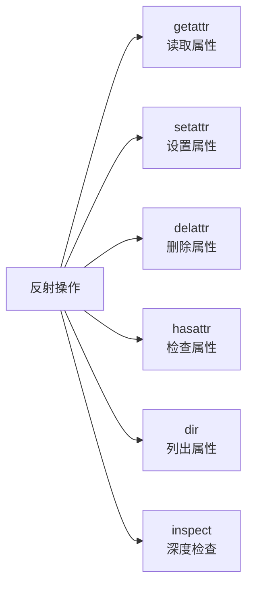

# 动态属性与反射

> **所属路径**：`01_基础能力/01_开发环境与技术英语/10_元编程与高级特性/04_动态属性与反射`
> **预计学习时间**：45 分钟
> **难度等级**：⭐⭐⭐

---

## 前置知识

- [函数与模块](../../01_编程语言基础/03_函数与模块/03_函数与模块.md)（了解模块和 `import` 机制）
- [描述符协议](../01_描述符协议/01_描述符协议.md)（理解 Python 属性查找机制）

> 如果以上内容还不熟悉，建议先完成对应课程再继续。

---

## 学习目标

完成本节后，你将能够：

1. 使用 `getattr`、`setattr`、`delattr`、`hasattr` 动态操作对象属性
2. 使用 `__getattr__` 和 `__getattribute__` 自定义属性访问行为
3. 使用 `inspect` 模块获取对象的签名、源码等运行时信息
4. 理解反射在框架开发和插件系统中的实际应用

---

## 正文讲解

### 1. 什么是反射？

假设你正在开发一个配置系统，需要根据配置文件中的字符串名称来访问对象的属性：

```python
config = {"field": "username", "action": "validate"}
```

你如何根据字符串 `"username"` 来获取对象的 `username` 属性？写一堆 `if-elif` ？这显然不够优雅。

**反射（Reflection）** 是程序在运行时检查和修改自身结构与行为的能力。在 Python 中，反射意味着你可以用 **字符串** 来操作对象的属性和方法，而不需要在代码中硬编码属性名。



> 📌 **图解说明**：Python 反射工具箱。内置函数 `getattr`/`setattr`/`delattr`/`hasattr` 提供基础的属性操作，`dir` 列出所有属性，`inspect` 模块提供更深层次的运行时信息。

### 2. 四大内置反射函数

Python 提供了四个内置函数来动态操作属性：

```python
class User:
    def __init__(self, name, age):
        self.name = name
        self.age = age
    
    def greet(self):
        return f"你好，我是{self.name}"


u = User("Alice", 30)

# getattr：获取属性（等价于 u.name）
print(getattr(u, 'name'))          # Alice
print(getattr(u, 'email', '无'))   # 无（提供默认值避免 AttributeError）

# setattr：设置属性（等价于 u.email = 'a@b.com'）
setattr(u, 'email', 'a@b.com')
print(u.email)                     # a@b.com

# hasattr：检查属性是否存在
print(hasattr(u, 'name'))          # True
print(hasattr(u, 'phone'))         # False

# delattr：删除属性（等价于 del u.email）
delattr(u, 'email')
print(hasattr(u, 'email'))         # False

# getattr 也能获取方法
method = getattr(u, 'greet')
print(method())                    # 你好，我是Alice
```

反射最强大的地方在于：属性名可以是一个 **变量** 。这让你能写出通用的、数据驱动的代码：

```python
def get_fields(obj, field_names):
    """通用字段提取函数"""
    return {name: getattr(obj, name, None) for name in field_names}

fields = get_fields(u, ['name', 'age', 'email'])
print(fields)  # {'name': 'Alice', 'age': 30, 'email': None}
```

### 3. \_\_getattr\_\_ 与 \_\_getattribute\_\_

Python 允许你自定义属性访问的行为。这里有两个常见的魔术方法，它们的触发时机完全不同：

| 方法 | 触发时机 |
| ---- | -------- |
| `__getattribute__` | **每次** 属性访问都会触发（包括存在的属性） |
| `__getattr__` | **只在** 正常途径找不到属性时触发（后备方案） |

```python
class SmartDict:
    """支持 obj.key 语法访问字典内容"""
    
    def __init__(self, data):
        self._data = data
    
    def __getattr__(self, name):
        # 只在正常查找失败时调用
        try:
            return self._data[name]
        except KeyError:
            raise AttributeError(f"没有属性 '{name}'")
    
    def __setattr__(self, name, value):
        if name.startswith('_'):
            # 内部属性走正常流程
            super().__setattr__(name, value)
        else:
            self._data[name] = value


config = SmartDict({"host": "localhost", "port": 8080})
print(config.host)    # localhost
print(config.port)    # 8080
config.debug = True
print(config._data)   # {'host': 'localhost', 'port': 8080, 'debug': True}
```

> ⚠️ **注意**：不要在 `__getattribute__` 中直接访问 `self.xxx` ——这会触发无限递归！必须使用 `super().__getattribute__(name)` 或 `object.__getattribute__(self, name)` 。

### 4. 属性代理模式

`__getattr__` 的一个经典应用是 **代理模式（Proxy Pattern）** ——将属性访问转发给另一个对象：

```python
class LoggingProxy:
    """记录所有方法调用的代理"""
    
    def __init__(self, target):
        self._target = target
        self._log = []
    
    def __getattr__(self, name):
        attr = getattr(self._target, name)
        if callable(attr):
            def wrapper(*args, **kwargs):
                self._log.append(f"{name}({args}, {kwargs})")
                return attr(*args, **kwargs)
            return wrapper
        return attr
    
    def get_log(self):
        return self._log


# 代理一个列表
proxy = LoggingProxy([1, 2, 3])
proxy.append(4)
proxy.extend([5, 6])
result = proxy.pop()

print(proxy._target)   # [1, 2, 3, 4, 5]
print(proxy.get_log())
# ["append((4,), {})", "extend(([5, 6],), {})", "pop((), {})"]
```

### 5. inspect 模块——深度反射

当你需要获取更详细的运行时信息时，`inspect` 模块是你的好帮手：

```python
import inspect

def example_function(x: int, y: float = 3.14, *args, **kwargs) -> str:
    """一个示例函数"""
    return f"{x}, {y}"


class Calculator:
    """计算器类"""
    
    def add(self, a: int, b: int) -> int:
        """加法"""
        return a + b
    
    def multiply(self, a: int, b: int) -> int:
        """乘法"""
        return a * b


# 获取函数签名
sig = inspect.signature(example_function)
print(f"签名: {sig}")
# 签名: (x: int, y: float = 3.14, *args, **kwargs) -> str

# 遍历参数
for name, param in sig.parameters.items():
    print(f"  {name}: kind={param.kind.name}, default={param.default}, "
          f"annotation={param.annotation}")

# 获取类的成员
for name, method in inspect.getmembers(Calculator, predicate=inspect.isfunction):
    print(f"\n方法: {name}")
    print(f"  文档: {method.__doc__}")
    print(f"  签名: {inspect.signature(method)}")

# 检查对象类型
print(inspect.isclass(Calculator))     # True
print(inspect.isfunction(example_function))  # True
print(inspect.ismethod(Calculator().add))    # True
```

### 6. 实际应用：简易依赖注入

反射在框架开发中的一个常见应用是 **依赖注入（Dependency Injection）** ——根据函数参数的类型注解自动提供依赖：

```python
import inspect

class Container:
    """简易依赖注入容器"""
    
    def __init__(self):
        self._services = {}
    
    def register(self, service_type, instance):
        self._services[service_type] = instance
    
    def resolve(self, func):
        """根据类型注解自动注入参数"""
        sig = inspect.signature(func)
        kwargs = {}
        for name, param in sig.parameters.items():
            if param.annotation in self._services:
                kwargs[name] = self._services[param.annotation]
        return func(**kwargs)


class Database:
    def query(self, sql):
        return f"执行查询: {sql}"

class Logger:
    def log(self, msg):
        print(f"[LOG] {msg}")


# 注册服务
container = Container()
container.register(Database, Database())
container.register(Logger, Logger())

# 自动注入
def handle_request(db: Database, logger: Logger):
    logger.log("处理请求")
    return db.query("SELECT * FROM users")

result = container.resolve(handle_request)
# [LOG] 处理请求
print(result)  # 执行查询: SELECT * FROM users
```

---

## 动手实践

下面实现一个基于反射的命令路由器：

```python
# 文件：code/reflection_demo.py
# 动态属性与反射综合演示

import inspect

class CommandRouter:
    """基于反射的命令路由器"""
    
    def __init__(self):
        self._handlers = {}
    
    def register(self, obj):
        """扫描对象中所有以 cmd_ 开头的方法，注册为命令"""
        for name, method in inspect.getmembers(obj, predicate=inspect.ismethod):
            if name.startswith('cmd_'):
                cmd_name = name[4:]  # 去掉 cmd_ 前缀
                self._handlers[cmd_name] = method
    
    def execute(self, command: str, *args):
        """执行命令"""
        handler = self._handlers.get(command)
        if handler is None:
            return f"未知命令: {command}"
        return handler(*args)
    
    def list_commands(self):
        """列出所有可用命令及其文档"""
        for name, handler in sorted(self._handlers.items()):
            doc = handler.__doc__ or "无说明"
            sig = inspect.signature(handler)
            print(f"  {name}{sig} - {doc.strip()}")


class FileCommands:
    def cmd_list(self, path: str = "."):
        """列出目录内容"""
        return f"列出 {path} 中的文件"
    
    def cmd_read(self, filename: str):
        """读取文件内容"""
        return f"读取文件: {filename}"
    
    def cmd_delete(self, filename: str):
        """删除文件"""
        return f"删除文件: {filename}"


class SystemCommands:
    def cmd_status(self):
        """显示系统状态"""
        return "系统运行正常"
    
    def cmd_version(self):
        """显示版本信息"""
        return "v1.0.0"


# 注册命令处理器
router = CommandRouter()
router.register(FileCommands())
router.register(SystemCommands())

# 列出所有命令
print("可用命令:")
router.list_commands()

# 执行命令
print()
print(router.execute("list", "/home"))
print(router.execute("status"))
print(router.execute("read", "config.txt"))
print(router.execute("unknown"))
```

**运行说明**：
- 环境要求：Python 3.10+
- 运行命令：`python code/reflection_demo.py`

**预期输出**：
```
可用命令:
  delete(filename: str) - 删除文件
  list(path: str = '.') - 列出目录内容
  read(filename: str) - 读取文件内容
  status() - 显示系统状态
  version() - 显示版本信息

列出 /home 中的文件
系统运行正常
读取文件: config.txt
未知命令: unknown
```

---

## 典型误区

| 误区 | 正确理解 |
| ---- | -------- |
| `hasattr` 只是检查属性是否存在 | `hasattr` 实际上会调用 `getattr` 并捕获 `AttributeError` ，所以它也会触发 `__getattr__` 和描述符 |
| `__getattr__` 和 `__getattribute__` 功能相同 | `__getattribute__` 拦截所有属性访问，而 `__getattr__` 只在正常查找失败后触发 |
| 反射是不安全的，应该避免使用 | 反射是 Python 的核心特性，Django、Flask、pytest 等知名框架大量依赖反射。关键是要在合适的场景中使用 |
| `dir()` 能返回对象的所有属性 | `dir()` 返回的列表不一定完整，动态生成的属性（如通过 `__getattr__` ）不会出现在 `dir()` 结果中 |

---

## 练习题

### 练习 1：通用序列化器（难度：⭐⭐）

编写一个 `to_dict(obj)` 函数，将任意对象的非下划线开头的属性转换为字典。

<details>
<summary>💡 提示</summary>

使用 `vars(obj)` 或 `obj.__dict__` 获取实例属性字典，然后过滤掉以下划线开头的键。

</details>

<details>
<summary>✅ 参考答案</summary>

```python
def to_dict(obj):
    return {k: v for k, v in vars(obj).items() if not k.startswith('_')}


class Point:
    def __init__(self, x, y):
        self.x = x
        self.y = y
        self._id = 42


p = Point(3, 4)
print(to_dict(p))  # {'x': 3, 'y': 4}
```

</details>

### 练习 2：方法调度器（难度：⭐⭐⭐）

编写一个函数 `dispatch(obj, method_name, *args)` ，安全地调用对象的方法。如果方法不存在，打印警告；如果方法不可调用，抛出 `TypeError` 。

<details>
<summary>💡 提示</summary>

先用 `getattr` 获取属性，再用 `callable` 检查是否可调用。

</details>

<details>
<summary>✅ 参考答案</summary>

```python
def dispatch(obj, method_name, *args):
    attr = getattr(obj, method_name, None)
    if attr is None:
        print(f"警告: {type(obj).__name__} 没有方法 '{method_name}'")
        return None
    if not callable(attr):
        raise TypeError(f"'{method_name}' 不是一个可调用对象")
    return attr(*args)


class MathHelper:
    def add(self, a, b):
        return a + b
    
    value = 42


m = MathHelper()
print(dispatch(m, "add", 3, 5))     # 8
print(dispatch(m, "subtract", 3))   # 警告... → None

try:
    dispatch(m, "value")
except TypeError as e:
    print(e)  # 'value' 不是一个可调用对象
```

</details>

---

## 下一步学习

- 📖 下一个知识点：[Python数据模型](../05_Python数据模型/05_Python数据模型.md)
- 🔗 相关知识点：[描述符协议](../01_描述符协议/01_描述符协议.md)
- 🔗 相关知识点：[元类](../02_元类/02_元类.md)

---

## 参考资料

1. [Built-in Functions — Python 官方文档](https://docs.python.org/3/library/functions.html#getattr) — `getattr`/`setattr`/`hasattr`/`delattr` 的官方说明（官方文档）
2. [inspect — Inspect live objects — Python 官方文档](https://docs.python.org/3/library/inspect.html) — inspect 模块的完整 API（官方文档）
3. [Customizing attribute access — Python 官方文档](https://docs.python.org/3/reference/datamodel.html#customizing-attribute-access) — `__getattr__` 和 `__getattribute__` 的形式化定义（官方文档）
