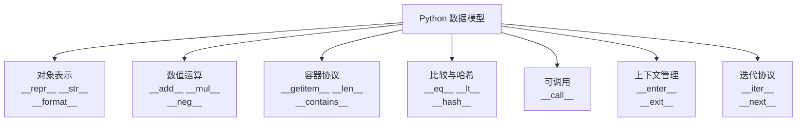

# Python数据模型

> **所属路径**：`01_基础能力/01_开发环境与技术英语/10_元编程与高级特性/05_Python数据模型`
> **预计学习时间**：55 分钟
> **难度等级**：⭐⭐⭐

---

## 前置知识

- [描述符协议](../01_描述符协议/01_描述符协议.md)（理解描述符的 `__get__`/`__set__` 方法）
- [动态属性与反射](../04_动态属性与反射/04_动态属性与反射.md)（理解 `__getattr__` 等属性访问钩子）
- [自定义容器](../../03_容器类型深入/04_自定义容器/04_自定义容器.md)（了解 `__getitem__`/`__len__` 等协议）

> 如果以上内容还不熟悉，建议先完成对应课程再继续。

---

## 学习目标

完成本节后，你将能够：

1. 理解 Python 数据模型的核心思想——"协议即接口"
2. 掌握对象表示、比较、哈希、可调用、上下文管理等常用协议
3. 通过实现魔术方法让自定义类融入 Python 的内置操作体系
4. 建立从"使用魔术方法"到"设计协议"的整体认知

---

## 正文讲解

### 1. 数据模型是什么？

当你写 `len([1, 2, 3])` 时，Python 并不是去列表对象上调用一个叫 `len` 的方法——它调用的是列表的 `__len__` 方法。当你写 `a + b` 时，Python 调用的是 `a.__add__(b)` 。当你写 `for x in obj` 时，Python 调用的是 `obj.__iter__()` 。

**Python 数据模型（Data Model）** 就是这套以双下划线方法（也叫 **魔术方法** 或 **dunder 方法** ）为核心的协议体系。它定义了 Python 对象如何与语言的内置操作（运算符、函数、语句）交互。



> 📌 **图解说明**：Python 数据模型的主要协议分类。每个协议由一组魔术方法组成，实现了对应的协议就能让自定义类支持相应的内置操作。

理解数据模型的意义在于：你可以让自定义对象 **像内置类型一样自然地使用** 。你的类可以支持 `+` 运算、`for` 循环、`with` 语句、`print` 输出、`==` 比较——只要实现了对应的魔术方法。

### 2. 对象表示：\_\_repr\_\_ 与 \_\_str\_\_

这是最基础也最重要的两个方法。它们控制对象"看起来像什么"：

```python
class Vector:
    def __init__(self, x, y):
        self.x = x
        self.y = y
    
    def __repr__(self):
        """面向开发者：精确、无歧义的表示"""
        return f"Vector({self.x!r}, {self.y!r})"
    
    def __str__(self):
        """面向用户：友好的可读表示"""
        return f"({self.x}, {self.y})"


v = Vector(3, 4)
print(repr(v))  # Vector(3, 4)  ← __repr__
print(str(v))   # (3, 4)        ← __str__
print(v)        # (3, 4)        ← print 默认调用 __str__
print(f"向量是 {v!r}")  # 向量是 Vector(3, 4)  ← !r 强制用 __repr__
```

**经验法则**：
- `__repr__` 必须实现，输出应该尽可能准确，理想情况下 `eval(repr(obj)) == obj`
- `__str__` 是可选的，用于面向终端用户的友好输出
- 如果只实现一个，选 `__repr__` ——当 `__str__` 未定义时，Python 会退而使用 `__repr__`

### 3. 数值运算协议

让自定义类支持数学运算符：

```python
class Vector:
    def __init__(self, x, y):
        self.x = x
        self.y = y
    
    def __repr__(self):
        return f"Vector({self.x}, {self.y})"
    
    def __add__(self, other):
        """v1 + v2"""
        if isinstance(other, Vector):
            return Vector(self.x + other.x, self.y + other.y)
        return NotImplemented
    
    def __mul__(self, scalar):
        """v * scalar"""
        if isinstance(scalar, (int, float)):
            return Vector(self.x * scalar, self.y * scalar)
        return NotImplemented
    
    def __rmul__(self, scalar):
        """scalar * v（反向乘法）"""
        return self.__mul__(scalar)
    
    def __neg__(self):
        """-v"""
        return Vector(-self.x, -self.y)
    
    def __abs__(self):
        """abs(v) → 向量长度"""
        return (self.x ** 2 + self.y ** 2) ** 0.5


v1 = Vector(1, 2)
v2 = Vector(3, 4)

print(v1 + v2)       # Vector(4, 6)
print(v1 * 3)        # Vector(3, 6)
print(2 * v1)        # Vector(2, 4)  ← 触发 __rmul__
print(-v1)           # Vector(-1, -2)
print(abs(v2))       # 5.0
```

> 💡 **为什么返回 `NotImplemented` 而不是抛出异常？** 当 `__add__` 返回 `NotImplemented` 时，Python 会尝试调用另一方的 `__radd__` 。这是运算符分派的标准机制，让不同类型之间的运算能够互相协作。

### 4. 比较与哈希

让对象支持 `==`、`<` 等比较运算，以及作为字典键和集合元素：

```python
from functools import total_ordering

@total_ordering  # 只需定义 __eq__ 和 __lt__，自动推导出其他比较
class Temperature:
    def __init__(self, celsius):
        self.celsius = celsius
    
    def __repr__(self):
        return f"Temperature({self.celsius}°C)"
    
    def __eq__(self, other):
        if isinstance(other, Temperature):
            return self.celsius == other.celsius
        return NotImplemented
    
    def __lt__(self, other):
        if isinstance(other, Temperature):
            return self.celsius < other.celsius
        return NotImplemented
    
    def __hash__(self):
        return hash(self.celsius)


t1 = Temperature(20)
t2 = Temperature(30)
t3 = Temperature(20)

print(t1 == t3)  # True
print(t1 < t2)   # True
print(t1 >= t2)  # False（由 @total_ordering 自动生成）

# 可以作为字典键和集合元素
temps = {t1: "舒适", t2: "偏热"}
print(temps[Temperature(20)])  # 舒适
```

> ⚠️ **注意**：如果你定义了 `__eq__` 但没有定义 `__hash__` ，Python 会将 `__hash__` 设为 `None` ，导致对象不可哈希（不能放入集合或作为字典键）。如果对象是可变的，不应该定义 `__hash__` ——可变对象不应作为字典键。

### 5. 可调用协议：\_\_call\_\_

实现 `__call__` 的对象可以像函数一样被调用：

```python
class Retry:
    """可配置的重试装饰器（可调用对象版）"""
    
    def __init__(self, max_retries=3):
        self.max_retries = max_retries
    
    def __call__(self, func):
        def wrapper(*args, **kwargs):
            for attempt in range(1, self.max_retries + 1):
                try:
                    return func(*args, **kwargs)
                except Exception as e:
                    if attempt == self.max_retries:
                        raise
                    print(f"  第 {attempt} 次尝试失败: {e}，重试...")
        wrapper.__name__ = func.__name__
        return wrapper


@Retry(max_retries=3)
def unstable_api():
    import random
    if random.random() < 0.7:
        raise ConnectionError("网络超时")
    return "请求成功"


# Retry(max_retries=3) 创建实例 → 实例(unstable_api) 调用 __call__
try:
    result = unstable_api()
    print(result)
except ConnectionError:
    print("最终失败")
```

`__call__` 让你可以用类来实现有状态的装饰器、策略对象、函数工厂等模式。

### 6. 上下文管理协议

`with` 语句依赖的 `__enter__` 和 `__exit__` ：

```python
class Timer:
    """计时上下文管理器"""
    
    def __enter__(self):
        import time
        self.start = time.time()
        return self
    
    def __exit__(self, exc_type, exc_val, exc_tb):
        import time
        self.elapsed = time.time() - self.start
        print(f"耗时: {self.elapsed:.4f} 秒")
        return False  # 不吞掉异常


with Timer() as t:
    total = sum(range(1_000_000))
    print(f"结果: {total}")
# 结果: 499999500000
# 耗时: 0.0xxx 秒
```

### 7. 协议全景：一个完整的例子

让我们把多个协议组合在一起，实现一个功能完整的 `Money` 类：

```python
from functools import total_ordering

@total_ordering
class Money:
    def __init__(self, amount, currency="CNY"):
        self.amount = round(amount, 2)
        self.currency = currency
    
    # 表示协议
    def __repr__(self):
        return f"Money({self.amount}, '{self.currency}')"
    
    def __str__(self):
        symbols = {"CNY": "¥", "USD": "$", "EUR": "€"}
        symbol = symbols.get(self.currency, self.currency)
        return f"{symbol}{self.amount:.2f}"
    
    # 数值运算
    def __add__(self, other):
        if isinstance(other, Money) and other.currency == self.currency:
            return Money(self.amount + other.amount, self.currency)
        return NotImplemented
    
    def __mul__(self, factor):
        if isinstance(factor, (int, float)):
            return Money(self.amount * factor, self.currency)
        return NotImplemented
    
    def __rmul__(self, factor):
        return self.__mul__(factor)
    
    def __neg__(self):
        return Money(-self.amount, self.currency)
    
    # 比较与哈希
    def __eq__(self, other):
        if isinstance(other, Money):
            return self.amount == other.amount and self.currency == other.currency
        return NotImplemented
    
    def __lt__(self, other):
        if isinstance(other, Money) and other.currency == self.currency:
            return self.amount < other.amount
        return NotImplemented
    
    def __hash__(self):
        return hash((self.amount, self.currency))
    
    # 布尔值
    def __bool__(self):
        return self.amount != 0


price = Money(99.9)
tax = Money(7.99)

print(price)           # ¥99.90
print(repr(price))     # Money(99.9, 'CNY')
print(price + tax)     # ¥107.89
print(price * 2)       # ¥199.80
print(3 * tax)         # ¥23.97
print(price > tax)     # True
print(bool(Money(0)))  # False

# 可以放入集合
prices = {Money(10), Money(20), Money(10)}
print(len(prices))  # 2
```

---

## 动手实践

将上面的 `Money` 类保存运行：

```python
# 文件：code/data_model_demo.py
# Python 数据模型综合演示

from functools import total_ordering

@total_ordering
class Money:
    def __init__(self, amount, currency="CNY"):
        self.amount = round(amount, 2)
        self.currency = currency
    
    def __repr__(self):
        return f"Money({self.amount}, '{self.currency}')"
    
    def __str__(self):
        symbols = {"CNY": "¥", "USD": "$", "EUR": "€"}
        symbol = symbols.get(self.currency, self.currency)
        return f"{symbol}{self.amount:.2f}"
    
    def __add__(self, other):
        if isinstance(other, Money) and other.currency == self.currency:
            return Money(self.amount + other.amount, self.currency)
        return NotImplemented
    
    def __mul__(self, factor):
        if isinstance(factor, (int, float)):
            return Money(self.amount * factor, self.currency)
        return NotImplemented
    
    def __rmul__(self, factor):
        return self.__mul__(factor)
    
    def __neg__(self):
        return Money(-self.amount, self.currency)
    
    def __eq__(self, other):
        if isinstance(other, Money):
            return self.amount == other.amount and self.currency == other.currency
        return NotImplemented
    
    def __lt__(self, other):
        if isinstance(other, Money) and other.currency == self.currency:
            return self.amount < other.amount
        return NotImplemented
    
    def __hash__(self):
        return hash((self.amount, self.currency))
    
    def __bool__(self):
        return self.amount != 0


# 演示
items = [Money(29.9), Money(15.5), Money(99.0), Money(8.8)]
print("购物清单：")
for i, item in enumerate(items, 1):
    print(f"  {i}. {item}")

total = Money(0)
for item in items:
    total = total + item
print(f"\n总价: {total}")
print(f"打八折: {total * 0.8}")
print(f"排序: {sorted(items)}")
```

**运行说明**：
- 环境要求：Python 3.10+
- 运行命令：`python code/data_model_demo.py`

**预期输出**：
```
购物清单：
  1. ¥29.90
  2. ¥15.50
  3. ¥99.00
  4. ¥8.80

总价: ¥153.20
打八折: ¥122.56
排序: [Money(8.8, 'CNY'), Money(15.5, 'CNY'), Money(29.9, 'CNY'), Money(99.0, 'CNY')]
```

---

## 典型误区

| 误区 | 正确理解 |
| ---- | -------- |
| 魔术方法应该直接调用，如 `obj.__len__()` | 应该使用对应的内置函数或运算符，如 `len(obj)` 。内置函数可能有额外的优化和安全检查 |
| 实现了 `__eq__` 就够了 | 如果对象需要作为字典键或放入集合，还必须实现 `__hash__` ；如果需要排序，还要实现比较方法或使用 `@total_ordering` |
| `__repr__` 和 `__str__` 可以随意定义 | `__repr__` 应该尽可能精确和无歧义（理想情况下可以 `eval` 回来），`__str__` 才是面向用户的友好格式 |
| 运算方法应该在类型不匹配时抛出 `TypeError` | 应该返回 `NotImplemented` ，让 Python 有机会尝试另一方的反向方法 |

---

## 练习题

### 练习 1：实现 Range 类（难度：⭐⭐）

实现一个 `Range` 类，支持 `len()` 、`in` 检查、索引访问和迭代：

```python
r = Range(1, 10)
print(len(r))      # 9
print(5 in r)      # True
print(r[0])        # 1
for x in r: ...    # 可迭代
```

<details>
<summary>💡 提示</summary>

实现 `__len__`、`__contains__`、`__getitem__`、`__iter__` 四个方法。

</details>

<details>
<summary>✅ 参考答案</summary>

```python
class Range:
    def __init__(self, start, stop):
        self.start = start
        self.stop = stop
    
    def __len__(self):
        return max(0, self.stop - self.start)
    
    def __contains__(self, value):
        return self.start <= value < self.stop
    
    def __getitem__(self, index):
        if index < 0:
            index = len(self) + index
        if 0 <= index < len(self):
            return self.start + index
        raise IndexError("索引越界")
    
    def __iter__(self):
        current = self.start
        while current < self.stop:
            yield current
            current += 1
    
    def __repr__(self):
        return f"Range({self.start}, {self.stop})"


r = Range(1, 10)
print(len(r))          # 9
print(5 in r)          # True
print(r[0], r[-1])     # 1 9
print(list(r[:3]))     # 需要 __getitem__ 支持切片才行
print(list(r))         # [1, 2, 3, 4, 5, 6, 7, 8, 9]
```

</details>

### 练习 2：可调用计数器（难度：⭐⭐）

实现一个 `Counter` 类，每次被调用时计数加一并返回当前值。同时支持 `repr` 和 `bool`（0 时为 `False` ）。

<details>
<summary>💡 提示</summary>

使用 `__call__` 方法实现调用行为，内部用一个属性记录计数。

</details>

<details>
<summary>✅ 参考答案</summary>

```python
class Counter:
    def __init__(self):
        self.count = 0
    
    def __call__(self):
        self.count += 1
        return self.count
    
    def __repr__(self):
        return f"Counter(count={self.count})"
    
    def __bool__(self):
        return self.count != 0


c = Counter()
print(bool(c))  # False
print(c())      # 1
print(c())      # 2
print(c())      # 3
print(repr(c))  # Counter(count=3)
print(bool(c))  # True
```

</details>

---

## 下一步学习

- 📖 下一个知识主题：[调试](../../11_调试/)
- 🔗 相关知识点：[描述符协议](../01_描述符协议/01_描述符协议.md)
- 🔗 相关知识点：[自定义容器](../../03_容器类型深入/04_自定义容器/04_自定义容器.md)

---

## 参考资料

1. [Data Model — Python 官方文档](https://docs.python.org/3/reference/datamodel.html) — Python 数据模型的权威参考，列出了所有魔术方法（官方文档）
2. [Fluent Python, 2nd Edition — Luciano Ramalho](https://www.fluentpython.com/) — 第 1 章"Python 数据模型"是最经典的数据模型教程（开放获取章节）
3. [Special method names — Python 官方文档](https://docs.python.org/3/reference/datamodel.html#special-method-names) — 所有魔术方法的完整列表和说明（官方文档）
