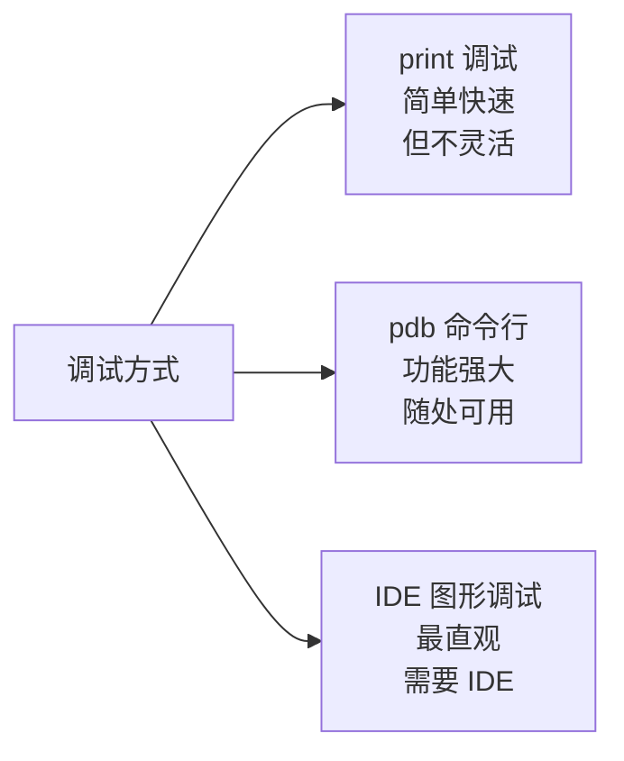

# 断点与单步执行

> **所属路径**：`01_基础能力/01_开发环境与技术英语/11_调试/01_断点与单步执行`
> **预计学习时间**：45 分钟
> **难度等级**：⭐⭐

---

## 前置知识

- [函数与模块](../../01_编程语言基础/03_函数与模块/03_函数与模块.md)（理解函数调用和模块导入）
- [异常处理](../../01_编程语言基础/05_异常处理/05_异常处理.md)（了解异常的基本概念）

> 如果以上内容还不熟悉，建议先完成对应课程再继续。

---

## 学习目标

完成本节后，你将能够：

1. 使用 `breakpoint()` 和 `pdb` 在代码中设置断点
2. 掌握 `pdb` 的核心命令：单步执行、查看变量、跳转、条件断点
3. 在 VS Code 中配置和使用图形化调试器
4. 根据场景选择合适的调试方式

---

## 正文讲解

### 1. 为什么需要调试器？

你一定写过这样的代码：

```python
def calculate_total(items):
    total = 0
    for item in items:
        print(f"DEBUG: item={item}, total={total}")  # 调试输出
        total += item['price'] * item['quantity']
        print(f"DEBUG: 计算后 total={total}")  # 调试输出
    return total
```

在代码中到处插入 `print` 语句来调试——这是每个程序员的第一直觉，但它有很多问题：调试完要记得删除、无法暂停程序查看上下文、无法动态改变执行路径。

**调试器（Debugger）** 提供了一种更系统化的方式来检查程序运行状态。你可以在任意位置 **暂停** 程序，**查看** 所有变量的值，**单步** 执行每一行代码，甚至 **修改** 变量的值后继续运行。



> 📌 **图解说明**：三种主要的调试方式。`print` 适合快速验证，`pdb` 适合远程服务器和脚本调试，IDE 图形调试器适合日常开发。

### 2. breakpoint()——最简单的断点

Python 3.7 引入了内置函数 `breakpoint()` ，它是进入调试器的最简单方式：

```python
def find_bug(data):
    results = []
    for item in data:
        processed = item.strip().lower()
        breakpoint()  # 程序会在这里暂停
        results.append(processed)
    return results

find_bug(["  Hello ", " World  ", "  Python "])
```

运行这段代码后，程序会在 `breakpoint()` 处暂停，你会看到 `pdb` 的交互式提示符 `(Pdb)` 。

### 3. pdb 核心命令

`pdb` 是 Python 内置的命令行调试器。下面是你必须掌握的核心命令：

| 命令 | 缩写 | 作用 |
| ---- | ---- | ---- |
| `next` | `n` | 执行下一行（不进入函数内部） |
| `step` | `s` | 执行下一行（进入函数内部） |
| `continue` | `c` | 继续运行直到下一个断点 |
| `print expr` | `p expr` | 打印表达式的值 |
| `pp expr` | — | 美化打印（对复杂对象更友好） |
| `list` | `l` | 显示当前位置的源代码 |
| `longlist` | `ll` | 显示当前函数的完整源代码 |
| `where` | `w` | 显示调用堆栈 |
| `up` | `u` | 跳到上一层调用帧 |
| `down` | `d` | 跳到下一层调用帧 |
| `break` | `b` | 设置断点 |
| `clear` | `cl` | 清除断点 |
| `return` | `r` | 继续运行直到当前函数返回 |
| `quit` | `q` | 退出调试器 |

让我们用一个实际例子来练习：

```python
# 文件：debug_example.py
def calculate_discount(price, discount_rate):
    """计算折扣价"""
    discount = price * discount_rate
    final_price = price - discount
    return final_price

def process_order(items):
    """处理订单"""
    total = 0
    for item in items:
        name = item['name']
        price = item['price']
        discount = item.get('discount', 0)
        
        breakpoint()  # 在这里设置断点
        
        discounted_price = calculate_discount(price, discount)
        total += discounted_price
    
    return total

items = [
    {'name': '笔记本', 'price': 5000, 'discount': 0.1},
    {'name': '鼠标', 'price': 200, 'discount': 0.05},
    {'name': '键盘', 'price': 800},
]

result = process_order(items)
print(f"订单总额: {result}")
```

运行后，在 `(Pdb)` 提示符下可以这样操作：

```
(Pdb) p name           # 查看变量
'笔记本'
(Pdb) p price
5000
(Pdb) p discount
0.1
(Pdb) n                # 执行下一行
(Pdb) p discounted_price
4500.0
(Pdb) s                # 下一次可以用 s 进入 calculate_discount 内部
(Pdb) l                # 查看当前位置的代码
(Pdb) w                # 查看调用堆栈
(Pdb) c                # 继续到下一个断点（循环的下一次迭代）
```

### 4. 高级 pdb 技巧

#### 条件断点

只在满足条件时才暂停：

```python
# 方法 1：在代码中使用条件 breakpoint
for i, item in enumerate(items):
    if item['price'] > 1000:
        breakpoint()  # 只在高价商品时暂停
    process(item)

# 方法 2：在 pdb 中设置条件断点
# (Pdb) b 15, price > 1000
# 在第 15 行设置断点，仅当 price > 1000 时触发
```

#### 事后调试（Post-mortem Debugging）

程序崩溃后进入调试器，查看崩溃时的状态：

```python
import pdb

def buggy_function():
    data = [1, 2, 3]
    return data[10]  # IndexError!

try:
    buggy_function()
except Exception:
    pdb.post_mortem()  # 在异常发生的位置进入调试器
```

或者在命令行直接使用：

```bash
python -m pdb script.py
# 程序崩溃时自动进入调试器
```

#### 使用 pdb.set_trace() 的替代——breakpoint() 的优势

`breakpoint()` 相比直接调用 `pdb.set_trace()` 有一个重要优势：可以通过环境变量控制行为：

```bash
# 正常调试
python script.py

# 跳过所有断点（生产环境）
PYTHONBREAKPOINT=0 python script.py

# 使用其他调试器（如 ipdb）
PYTHONBREAKPOINT=ipdb.set_trace python script.py
```

### 5. VS Code 图形化调试

对于日常开发，VS Code 的图形化调试器更加直观。你可以：

- **点击行号** 左侧来设置断点（出现红色圆点）
- 按 **F5** 启动调试
- 按 **F10** 单步执行（Step Over，相当于 `n` ）
- 按 **F11** 进入函数（Step Into，相当于 `s` ）
- 在左侧面板查看 **变量** 、 **监视表达式** 和 **调用堆栈**
- 在 **调试控制台** 中直接执行 Python 表达式

VS Code 调试需要一个 `launch.json` 配置文件（放在 `.vscode/` 目录中）：

```json
{
    "version": "0.2.0",
    "configurations": [
        {
            "name": "Python: 当前文件",
            "type": "debugpy",
            "request": "launch",
            "program": "${file}",
            "console": "integratedTerminal"
        }
    ]
}
```

### 6. 调试策略选择

| 场景 | 推荐方式 |
| ---- | -------- |
| 快速验证一个变量值 | `print()` |
| 需要在暂停时交互式探索 | `breakpoint()` + `pdb` |
| 远程服务器上调试 | `pdb` 或 `remote-pdb` |
| 复杂的多文件项目 | VS Code / PyCharm 图形调试器 |
| 程序崩溃后定位原因 | `pdb.post_mortem()` 或 `python -m pdb` |

---

## 动手实践

```python
# 文件：code/debug_practice.py
# 断点与单步执行练习

def fibonacci(n):
    """计算斐波那契数列第 n 项"""
    if n <= 0:
        return 0
    if n == 1:
        return 1
    
    a, b = 0, 1
    for i in range(2, n + 1):
        a, b = b, a + b
    return b


def find_first_fib_above(threshold):
    """找到第一个大于 threshold 的斐波那契数"""
    n = 0
    while True:
        fib = fibonacci(n)
        # 取消下面一行的注释来调试
        # breakpoint()
        if fib > threshold:
            return n, fib
        n += 1


# 运行测试
n, value = find_first_fib_above(100)
print(f"第一个大于 100 的斐波那契数：F({n}) = {value}")

n, value = find_first_fib_above(1000)
print(f"第一个大于 1000 的斐波那契数：F({n}) = {value}")
```

**运行说明**：
- 环境要求：Python 3.10+
- 运行命令：`python code/debug_practice.py`
- 调试练习：取消注释 `breakpoint()` 行，然后重新运行，练习 pdb 命令

**预期输出**（不使用断点时）：
```
第一个大于 100 的斐波那契数：F(12) = 144
第一个大于 1000 的斐波那契数：F(17) = 1597
```

---

## 典型误区

| 误区 | 正确理解 |
| ---- | -------- |
| 调试就是加 `print` | `print` 是最基础的方式，但调试器能暂停、交互探索、修改变量、查看堆栈，功能远超 `print` |
| `pdb` 太麻烦，不如直接看代码 | 对于简单问题确实如此，但当 bug 涉及复杂的状态变化或多层函数调用时，调试器能显著加快定位速度 |
| 图形调试器和 `pdb` 完全不同 | 图形调试器本质上是 `pdb` 的可视化包装（如 VS Code 使用 `debugpy` ），核心原理相同 |
| 调试完后忘记删除 `breakpoint()` | 使用 `PYTHONBREAKPOINT=0` 环境变量可以在不修改代码的情况下跳过所有断点 |

---

## 练习题

### 练习 1：pdb 命令练习（难度：⭐）

创建一个包含嵌套函数调用的脚本，在内层函数中设置断点，使用 `w`（where）命令查看完整的调用堆栈，使用 `u` 和 `d` 在调用帧之间切换。

<details>
<summary>💡 提示</summary>

定义三个函数 `a()` 调用 `b()` ，`b()` 调用 `c()` ，在 `c()` 中设置断点。运行后用 `w` 查看堆栈，用 `u` 跳到 `b()` 的帧查看其局部变量。

</details>

<details>
<summary>✅ 参考答案</summary>

```python
def outer(x):
    y = x * 2
    return middle(y)

def middle(x):
    y = x + 10
    return inner(y)

def inner(x):
    y = x ** 2
    breakpoint()  # 在这里暂停
    return y

result = outer(5)
print(result)

# pdb 交互：
# (Pdb) w          # 查看调用堆栈
# (Pdb) p x, y     # 查看 inner 的变量
# (Pdb) u          # 跳到 middle 的帧
# (Pdb) p x, y     # 查看 middle 的变量
# (Pdb) u          # 跳到 outer 的帧
# (Pdb) p x, y     # 查看 outer 的变量
# (Pdb) d          # 跳回 middle
# (Pdb) c          # 继续执行
```

</details>

### 练习 2：条件断点定位 bug（难度：⭐⭐）

下面的代码有一个 bug——某些输入会导致错误结果。用条件断点找出问题数据：

```python
def process_records(records):
    results = []
    for record in records:
        value = record['value']
        weight = record.get('weight', 1)
        score = value / weight  # 可能除以零？
        results.append(score)
    return results
```

<details>
<summary>💡 提示</summary>

在计算 `score` 之前添加 `if weight == 0: breakpoint()` ，或者使用 pdb 条件断点 `b 行号, weight == 0` 。

</details>

<details>
<summary>✅ 参考答案</summary>

```python
def process_records(records):
    results = []
    for record in records:
        value = record['value']
        weight = record.get('weight', 1)
        if weight == 0:
            breakpoint()  # 只在 weight 为 0 时暂停
        score = value / weight if weight != 0 else 0
        results.append(score)
    return results

records = [
    {'value': 10, 'weight': 2},
    {'value': 20, 'weight': 0},  # 问题数据
    {'value': 30, 'weight': 5},
]

print(process_records(records))  # [5.0, 0, 6.0]
```

</details>

---

## 下一步学习

- 📖 下一个知识点：[日志与异常](../02_日志与异常/02_日志与异常.md)
- 🔗 相关知识点：[异常处理](../../01_编程语言基础/05_异常处理/05_异常处理.md)
- 📚 拓展阅读：[pdb — The Python Debugger](https://docs.python.org/3/library/pdb.html)

---

## 参考资料

1. [pdb — The Python Debugger — Python 官方文档](https://docs.python.org/3/library/pdb.html) — pdb 的完整命令列表和使用说明（官方文档）
2. [breakpoint() — Python 官方文档](https://docs.python.org/3/library/functions.html#breakpoint) — breakpoint 内置函数的说明（官方文档）
3. [Python Debugging With Pdb — Real Python](https://realpython.com/python-debugging-pdb/) — 配有丰富示例的 pdb 教程（公开教程）
4. [Debugging in VS Code — VS Code 官方文档](https://code.visualstudio.com/docs/python/debugging) — VS Code Python 调试配置指南（官方文档）
