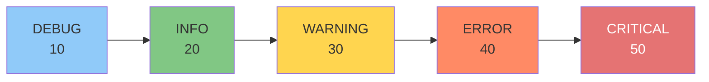

# 日志与异常

> **所属路径**：`01_基础能力/01_开发环境与技术英语/11_调试/02_日志与异常`
> **预计学习时间**：50 分钟
> **难度等级**：⭐⭐

---

## 前置知识

- [异常处理](../../01_编程语言基础/05_异常处理/05_异常处理.md)（理解 try/except/finally 机制）
- [logging日志框架](../../06_日期时间与日志/03_logging日志框架/03_logging日志框架.md)（了解 logging 模块的基本用法）
- [断点与单步执行](../01_断点与单步执行/01_断点与单步执行.md)（了解调试器的基本使用）

> 如果以上内容还不熟悉，建议先完成对应课程再继续。

---

## 学习目标

完成本节后，你将能够：

1. 使用 `logging` 模块替代 `print` 进行结构化调试
2. 理解日志级别的正确使用场景，避免日志过多或过少
3. 使用 `logging.exception()` 和 traceback 记录完整的异常信息
4. 设计分层日志策略，在不同环境（开发/测试/生产）使用不同的日志配置

---

## 正文讲解

### 1. 从 print 到 logging

几乎每个程序员都有这样的经历：上线前手忙脚乱地删除散落在各处的 `print` 调试语句，结果不小心删多了或删少了。问题的根源在于 `print` 不区分"调试输出"和"正常输出"，没有级别控制，也不会自动记录时间和位置。

**logging 模块** 解决了这些问题。它让你的调试信息变成结构化的、可控制的、可持久化的 **日志** 。

```python
import logging

# 配置日志格式
logging.basicConfig(
    level=logging.DEBUG,
    format='%(asctime)s [%(levelname)s] %(name)s: %(message)s',
    datefmt='%H:%M:%S'
)

logger = logging.getLogger(__name__)


def process_data(data):
    logger.info("开始处理数据，共 %d 条", len(data))
    
    results = []
    for i, item in enumerate(data):
        logger.debug("处理第 %d 条: %s", i, item)
        
        if not isinstance(item, dict):
            logger.warning("跳过非字典项: %r", item)
            continue
        
        try:
            value = item['value'] * item['weight']
            results.append(value)
        except KeyError as e:
            logger.error("缺少必要字段 %s: %r", e, item)
        except Exception:
            logger.exception("处理失败")  # 自动记录异常堆栈
    
    logger.info("处理完成，成功 %d 条", len(results))
    return results
```

### 2. 日志级别的正确使用

日志级别是 logging 最核心的概念。选错级别是最常见的日志问题：

| 级别 | 数值 | 使用场景 | 示例 |
| ---- | ---- | -------- | ---- |
| `DEBUG` | 10 | 开发时的详细诊断信息 | `logger.debug("变量 x=%d, y=%d", x, y)` |
| `INFO` | 20 | 程序正常运行的关键节点 | `logger.info("服务启动在端口 %d", port)` |
| `WARNING` | 30 | 可能的问题，但程序仍能继续 | `logger.warning("配置缺失，使用默认值")` |
| `ERROR` | 40 | 发生错误，部分功能受影响 | `logger.error("数据库连接失败: %s", err)` |
| `CRITICAL` | 50 | 严重错误，程序可能无法继续 | `logger.critical("磁盘空间不足")` |



> 📌 **图解说明**：日志级别从低到高。设置日志级别为 `WARNING` 时，只有 WARNING、ERROR、CRITICAL 的日志会被输出，DEBUG 和 INFO 会被忽略。

**常见错误**：
- 把所有日志都设为 `INFO` → 日志太多，找不到重点
- 把异常日志设为 `WARNING` → 真正的错误被淹没
- 生产环境开 `DEBUG` → 性能下降，日志文件暴增

### 3. 异常日志的正确记录方式

记录异常时，最重要的是保留完整的 **堆栈信息（Traceback）** ：

```python
import logging

logger = logging.getLogger(__name__)

# ❌ 错误做法：丢失堆栈信息
try:
    result = 1 / 0
except ZeroDivisionError as e:
    logger.error(f"计算失败: {e}")
    # 输出：计算失败: division by zero
    # 看不到是哪行代码、哪个函数导致的！

# ✅ 正确做法 1：使用 logger.exception()
try:
    result = 1 / 0
except ZeroDivisionError:
    logger.exception("计算失败")
    # 自动附加完整堆栈，日志级别为 ERROR

# ✅ 正确做法 2：使用 exc_info=True
try:
    result = 1 / 0
except ZeroDivisionError:
    logger.error("计算失败", exc_info=True)
    # 效果同上

# ✅ 正确做法 3：WARNING 级别 + 堆栈
try:
    result = 1 / 0
except ZeroDivisionError:
    logger.warning("计算失败，使用默认值", exc_info=True)
    result = 0
```

### 4. 分层日志策略

在实际项目中，不同模块需要不同的日志级别，不同环境也需要不同的日志配置：

```python
import logging
import sys

def setup_logging(env='development'):
    """根据环境配置日志"""
    
    # 根日志器
    root_logger = logging.getLogger()
    root_logger.setLevel(logging.DEBUG)
    
    # 控制台处理器
    console = logging.StreamHandler(sys.stdout)
    console.setFormatter(logging.Formatter(
        '%(asctime)s [%(levelname)-8s] %(name)s: %(message)s'
    ))
    
    if env == 'development':
        console.setLevel(logging.DEBUG)
    elif env == 'production':
        console.setLevel(logging.WARNING)
    
    root_logger.addHandler(console)
    
    # 文件处理器（所有环境都记录到文件）
    file_handler = logging.FileHandler('app.log', encoding='utf-8')
    file_handler.setLevel(logging.INFO)
    file_handler.setFormatter(logging.Formatter(
        '%(asctime)s [%(levelname)s] %(name)s (%(filename)s:%(lineno)d): %(message)s'
    ))
    root_logger.addHandler(file_handler)
    
    # 降低第三方库的日志级别
    logging.getLogger('urllib3').setLevel(logging.WARNING)
    logging.getLogger('requests').setLevel(logging.WARNING)


# 不同模块各自获取 logger
# module_a.py
logger_a = logging.getLogger('myapp.module_a')

# module_b.py
logger_b = logging.getLogger('myapp.module_b')
```

### 5. 调试辅助：临时提高日志级别

在排查问题时，可以临时提高特定模块的日志详细度：

```python
import logging

def debug_module(module_name, level=logging.DEBUG):
    """临时将某个模块的日志级别设为 DEBUG"""
    logger = logging.getLogger(module_name)
    old_level = logger.level
    logger.setLevel(level)
    
    # 添加临时的控制台处理器
    handler = logging.StreamHandler()
    handler.setFormatter(logging.Formatter(
        '🔍 %(name)s: %(message)s'
    ))
    logger.addHandler(handler)
    
    return old_level, handler


def restore_module(module_name, old_level, handler):
    """恢复日志级别"""
    logger = logging.getLogger(module_name)
    logger.setLevel(old_level)
    logger.removeHandler(handler)
```

### 6. 结构化日志

对于需要被程序解析的日志（如日志分析系统），使用结构化格式更合适：

```python
import logging
import json

class JSONFormatter(logging.Formatter):
    """JSON 格式的日志格式化器"""
    
    def format(self, record):
        log_data = {
            'timestamp': self.formatTime(record),
            'level': record.levelname,
            'logger': record.name,
            'message': record.getMessage(),
            'module': record.module,
            'line': record.lineno,
        }
        if record.exc_info and record.exc_info[0]:
            log_data['exception'] = self.formatException(record.exc_info)
        return json.dumps(log_data, ensure_ascii=False)


# 使用 JSON 格式化器
handler = logging.StreamHandler()
handler.setFormatter(JSONFormatter())

logger = logging.getLogger('structured')
logger.addHandler(handler)
logger.setLevel(logging.DEBUG)

logger.info("用户登录", extra={})
# {"timestamp": "2024-01-01 12:00:00", "level": "INFO", "logger": "structured", "message": "用户登录", ...}
```

---

## 动手实践

```python
# 文件：code/logging_debug_demo.py
# 日志与异常调试综合演示

import logging
import sys

# 配置日志
logging.basicConfig(
    level=logging.DEBUG,
    format='%(asctime)s [%(levelname)-8s] %(name)s: %(message)s',
    datefmt='%H:%M:%S',
    stream=sys.stdout
)

logger = logging.getLogger('order_system')


class OrderProcessor:
    def __init__(self):
        self.processed = 0
        self.errors = 0
    
    def process_order(self, order):
        order_id = order.get('id', 'unknown')
        logger.info("开始处理订单 #%s", order_id)
        
        try:
            # 验证订单
            self._validate(order)
            
            # 计算总价
            total = self._calculate_total(order)
            logger.info("订单 #%s 总价: %.2f", order_id, total)
            
            self.processed += 1
            return total
            
        except ValueError as e:
            logger.warning("订单 #%s 验证失败: %s", order_id, e)
            self.errors += 1
            return None
        except Exception:
            logger.exception("订单 #%s 处理异常", order_id)
            self.errors += 1
            return None
    
    def _validate(self, order):
        if 'items' not in order:
            raise ValueError("缺少商品列表")
        if not order['items']:
            raise ValueError("商品列表为空")
        logger.debug("订单验证通过")
    
    def _calculate_total(self, order):
        total = 0
        for item in order['items']:
            price = item['price']
            qty = item.get('quantity', 1)
            logger.debug("  商品: %s, 单价: %.2f, 数量: %d",
                        item.get('name', '未知'), price, qty)
            total += price * qty
        return total


# 测试数据
orders = [
    {'id': '001', 'items': [
        {'name': '笔记本', 'price': 5000, 'quantity': 1},
        {'name': '鼠标', 'price': 200, 'quantity': 2},
    ]},
    {'id': '002'},  # 缺少 items
    {'id': '003', 'items': [
        {'name': '键盘', 'price': 800},
        {'name': '显示器', 'quantity': 1},  # 缺少 price → KeyError
    ]},
]

processor = OrderProcessor()
for order in orders:
    result = processor.process_order(order)
    if result is not None:
        print(f"  → 订单完成，总价: {result}")
    print()

logger.info("处理统计: 成功=%d, 失败=%d", processor.processed, processor.errors)
```

**运行说明**：
- 环境要求：Python 3.10+
- 运行命令：`python code/logging_debug_demo.py`

**预期输出**（时间戳会有差异）：
```
12:00:00 [INFO    ] order_system: 开始处理订单 #001
12:00:00 [DEBUG   ] order_system: 订单验证通过
12:00:00 [DEBUG   ] order_system:   商品: 笔记本, 单价: 5000.00, 数量: 1
12:00:00 [DEBUG   ] order_system:   商品: 鼠标, 单价: 200.00, 数量: 2
12:00:00 [INFO    ] order_system: 订单 #001 总价: 5400.00
  → 订单完成，总价: 5400.0

12:00:00 [INFO    ] order_system: 开始处理订单 #002
12:00:00 [WARNING ] order_system: 订单 #002 验证失败: 缺少商品列表

12:00:00 [INFO    ] order_system: 开始处理订单 #003
12:00:00 [DEBUG   ] order_system: 订单验证通过
12:00:00 [ERROR   ] order_system: 订单 #003 处理异常
Traceback (most recent call last):
  ...
KeyError: 'price'

12:00:00 [INFO    ] order_system: 处理统计: 成功=1, 失败=2
```

---

## 典型误区

| 误区 | 正确理解 |
| ---- | -------- |
| 用 f-string 格式化日志消息 | 应该用 `%s` 占位符：`logger.info("值=%s", val)` 。这样如果日志级别被过滤掉，就不会执行字符串格式化，节省性能 |
| 捕获异常时只记录 `str(e)` | 应该用 `logger.exception()` 或 `exc_info=True` 保留完整堆栈 |
| 在每个函数开头都加日志 | 日志应该记录 **关键节点** 和 **异常情况** ，过多的日志反而让问题更难定位 |
| 生产环境关闭所有日志 | 应该将控制台设为 `WARNING` ，文件设为 `INFO` ，保留足够的信息用于问题排查 |

---

## 练习题

### 练习 1：日志级别配置（难度：⭐）

编写一个函数，接受环境名称（"dev"/"prod"），配置不同的日志级别。dev 环境输出 DEBUG 以上，prod 环境只输出 WARNING 以上。

<details>
<summary>💡 提示</summary>

使用 `logging.basicConfig()` 的 `level` 参数，或手动设置 handler 的级别。

</details>

<details>
<summary>✅ 参考答案</summary>

```python
import logging

def configure_logging(env):
    logger = logging.getLogger('myapp')
    logger.handlers.clear()
    
    handler = logging.StreamHandler()
    handler.setFormatter(logging.Formatter(
        '%(asctime)s [%(levelname)s] %(message)s'
    ))
    
    if env == 'dev':
        handler.setLevel(logging.DEBUG)
        logger.setLevel(logging.DEBUG)
    else:
        handler.setLevel(logging.WARNING)
        logger.setLevel(logging.WARNING)
    
    logger.addHandler(handler)
    return logger

# 测试
logger = configure_logging('dev')
logger.debug("调试信息")    # 显示
logger.warning("警告信息")  # 显示

logger = configure_logging('prod')
logger.debug("调试信息")    # 不显示
logger.warning("警告信息")  # 显示
```

</details>

### 练习 2：异常日志审计（难度：⭐⭐）

编写一个装饰器 `@log_exceptions` ，自动记录被装饰函数中发生的所有异常（包括完整堆栈），然后重新抛出异常。

<details>
<summary>💡 提示</summary>

在装饰器的 `except` 块中使用 `logger.exception()` 记录异常，然后 `raise` 重新抛出。

</details>

<details>
<summary>✅ 参考答案</summary>

```python
import logging
import functools

logger = logging.getLogger('audit')
logging.basicConfig(level=logging.DEBUG)

def log_exceptions(func):
    @functools.wraps(func)
    def wrapper(*args, **kwargs):
        try:
            return func(*args, **kwargs)
        except Exception:
            logger.exception("函数 %s 发生异常", func.__name__)
            raise
    return wrapper


@log_exceptions
def divide(a, b):
    return a / b


print(divide(10, 2))  # 5.0

try:
    divide(10, 0)
except ZeroDivisionError:
    print("捕获到异常（已记录到日志）")
```

</details>

---

## 下一步学习

- 📖 下一个知识点：[最小复现](../03_最小复现/03_最小复现.md)
- 🔗 相关知识点：[logging日志框架](../../06_日期时间与日志/03_logging日志框架/03_logging日志框架.md)
- 🔗 相关知识点：[异常处理](../../01_编程语言基础/05_异常处理/05_异常处理.md)

---

## 参考资料

1. [logging — Logging facility for Python — Python 官方文档](https://docs.python.org/3/library/logging.html) — logging 模块的完整 API（官方文档）
2. [Logging HOWTO — Python 官方文档](https://docs.python.org/3/howto/logging.html) — 官方的日志使用指南（官方文档）
3. [Logging Cookbook — Python 官方文档](https://docs.python.org/3/howto/logging-cookbook.html) — 日志常见场景的解决方案（官方文档）
