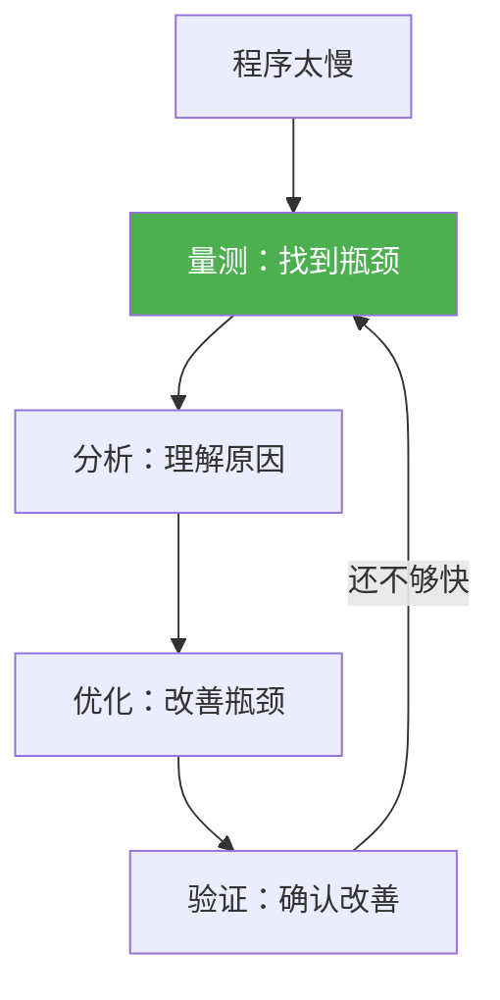

# 性能分析

> **所属路径**：`01_基础能力/01_开发环境与技术英语/11_调试/04_性能分析`
> **预计学习时间**：50 分钟
> **难度等级**：⭐⭐⭐

---

## 前置知识

- [函数与模块](../../01_编程语言基础/03_函数与模块/03_函数与模块.md)（理解函数调用和模块结构）
- [断点与单步执行](../01_断点与单步执行/01_断点与单步执行.md)（了解基本的调试思路）
- [日志与异常](../02_日志与异常/02_日志与异常.md)（了解如何记录运行信息）

> 如果以上内容还不熟悉，建议先完成对应课程再继续。

---

## 学习目标

完成本节后，你将能够：

1. 使用 `time` 和 `timeit` 进行基础计时测量
2. 使用 `cProfile` 分析函数级别的性能瓶颈
3. 使用 `line_profiler` 定位行级别的性能问题
4. 理解"先量测，再优化"的性能分析方法论

---

## 正文讲解

### 1. 为什么需要性能分析？

"这个程序太慢了"——这是你迟早会遇到的问题。面对慢代码，直觉往往是错的：你猜测的"慢"的部分可能只占总时间的 1%，而真正的瓶颈隐藏在你认为"很快"的地方。

> "Premature optimization is the root of all evil."
> "过早优化是万恶之源。" —— Donald Knuth

正确的做法是：**先量测，再优化** 。性能分析（Profiling）工具帮你找到程序中 **真正** 耗时的部分，避免浪费时间优化不重要的代码。



> 📌 **图解说明**：性能优化的正确流程。关键在于"量测"先于"优化"，形成循环直到性能达标。

### 2. 基础计时：time 和 timeit

最简单的性能量测方式是计时：

```python
import time

# 方法 1：手动计时
start = time.perf_counter()
result = sum(range(1_000_000))
elapsed = time.perf_counter() - start
print(f"耗时: {elapsed:.4f} 秒")

# 方法 2：上下文管理器（更优雅）
from contextlib import contextmanager

@contextmanager
def timer(label="代码块"):
    start = time.perf_counter()
    yield
    elapsed = time.perf_counter() - start
    print(f"{label}: {elapsed:.4f} 秒")


with timer("求和"):
    result = sum(range(1_000_000))

with timer("列表推导"):
    squares = [x**2 for x in range(100_000)]
```

对于精确的微基准测试，使用 `timeit` ：

```python
import timeit

# 比较两种字符串拼接方式
time1 = timeit.timeit(
    'result = "".join(parts)',
    setup='parts = [str(i) for i in range(1000)]',
    number=10000
)

time2 = timeit.timeit(
    'result = ""\nfor p in parts:\n    result += p',
    setup='parts = [str(i) for i in range(1000)]',
    number=10000
)

print(f"join: {time1:.4f}s, 拼接: {time2:.4f}s")
print(f"join 快 {time2/time1:.1f} 倍")
```

> 💡 `timeit` 会自动多次运行来减少误差，比手动 `time.time()` 更准确。它还会临时禁用垃圾回收，避免 GC 干扰结果。

### 3. cProfile——函数级性能分析

`cProfile` 是 Python 内置的性能分析器，它记录每个函数被调用了多少次、耗时多少：

```python
import cProfile

def slow_function():
    total = 0
    for i in range(100):
        total += sum(x**2 for x in range(10000))
    return total

def fast_function():
    return sum(range(100)) * 2

def main():
    result1 = slow_function()
    result2 = fast_function()
    return result1 + result2


# 方法 1：直接在代码中分析
cProfile.run('main()', sort='cumulative')

# 方法 2：命令行分析
# python -m cProfile -s cumulative my_script.py
```

输出解读：

```
         ncalls  tottime  percall  cumtime  percall filename:lineno(function)
            1    0.000    0.000    2.345    2.345 script.py:14(main)
            1    2.340    2.340    2.340    2.340 script.py:3(slow_function)
          100    0.000    0.000    2.330    0.023 script.py:5(<genexpr>)
            1    0.000    0.000    0.000    0.000 script.py:9(fast_function)
```

| 列名 | 含义 |
| ---- | ---- |
| `ncalls` | 调用次数 |
| `tottime` | 函数自身耗时（不含子函数） |
| `cumtime` | 函数总耗时（含子函数） |
| `percall` | 每次调用的平均耗时 |

### 4. 使用 pstats 分析结果

将 cProfile 的结果保存到文件，然后用 `pstats` 模块进行交互式分析：

```python
import cProfile
import pstats
from io import StringIO

def profile_and_report(func, *args, top_n=10):
    """分析函数性能并输出报告"""
    profiler = cProfile.Profile()
    profiler.enable()
    result = func(*args)
    profiler.disable()
    
    # 生成报告
    stream = StringIO()
    stats = pstats.Stats(profiler, stream=stream)
    stats.sort_stats('cumulative')
    stats.print_stats(top_n)
    print(stream.getvalue())
    
    return result


# 使用示例
def process_data(n):
    data = [i**2 for i in range(n)]
    filtered = [x for x in data if x % 3 == 0]
    sorted_data = sorted(filtered, reverse=True)
    return sorted_data[:10]

profile_and_report(process_data, 1_000_000)
```

### 5. 行级性能分析

`cProfile` 只能告诉你哪个函数慢，但不能告诉你函数 **内部** 哪一行慢。对于更精确的定位，可以使用 `line_profiler` （需要安装）或使用手动计时：

```python
# 手动行级计时（不需要额外安装）
import time

def analyze_performance():
    """手动为每个步骤计时"""
    timings = {}
    
    t0 = time.perf_counter()
    data = list(range(1_000_000))
    timings['创建列表'] = time.perf_counter() - t0
    
    t0 = time.perf_counter()
    squares = [x**2 for x in data]
    timings['计算平方'] = time.perf_counter() - t0
    
    t0 = time.perf_counter()
    filtered = [x for x in squares if x % 7 == 0]
    timings['过滤'] = time.perf_counter() - t0
    
    t0 = time.perf_counter()
    result = sorted(filtered)
    timings['排序'] = time.perf_counter() - t0
    
    # 报告
    total = sum(timings.values())
    print(f"{'步骤':<12} {'耗时':>8} {'占比':>6}")
    print("-" * 30)
    for step, t in timings.items():
        print(f"{step:<12} {t:>8.4f}s {t/total*100:>5.1f}%")
    print(f"{'总计':<12} {total:>8.4f}s")

analyze_performance()
```

### 6. 常见性能问题模式

通过性能分析，你会频繁遇到以下几种模式：

| 模式 | 表现 | 解决方案 |
| ---- | ---- | -------- |
| 重复计算 | 同一个值被反复计算 | 缓存结果（`functools.lru_cache` ） |
| 不当的数据结构 | `in` 检查在列表上很慢 | 换用集合（`set` ）或字典 |
| 逐个拼接字符串 | `+=` 拼接大量字符串 | 用 `"".join(parts)` |
| Python 循环过慢 | 大量数值计算在 Python 循环中 | 用 NumPy 向量化 |
| 过度的 I/O | 逐行读写文件 | 批量读写，缓冲区 |

```python
# 示例：in 检查的数据结构选择
import time

data = list(range(100_000))
data_set = set(data)

# 列表查找
start = time.perf_counter()
for _ in range(1000):
    99999 in data
list_time = time.perf_counter() - start

# 集合查找
start = time.perf_counter()
for _ in range(1000):
    99999 in data_set
set_time = time.perf_counter() - start

print(f"列表查找: {list_time:.4f}s")
print(f"集合查找: {set_time:.6f}s")
print(f"集合快 {list_time/set_time:.0f} 倍")
```

---

## 动手实践

```python
# 文件：code/profiling_demo.py
# 性能分析综合演示

import time
import cProfile
from contextlib import contextmanager


@contextmanager
def timer(label):
    start = time.perf_counter()
    yield
    elapsed = time.perf_counter() - start
    print(f"{label}: {elapsed:.4f}s")


def find_duplicates_naive(data):
    """朴素方法：O(n²)"""
    duplicates = []
    for i, x in enumerate(data):
        for j, y in enumerate(data):
            if i != j and x == y and x not in duplicates:
                duplicates.append(x)
    return duplicates


def find_duplicates_optimized(data):
    """优化方法：O(n)"""
    seen = set()
    duplicates = set()
    for x in data:
        if x in seen:
            duplicates.add(x)
        seen.add(x)
    return list(duplicates)


# 生成测试数据
data = list(range(2000)) + list(range(500))  # 2500 个元素，500 个重复

# 比较性能
with timer("朴素方法"):
    result1 = find_duplicates_naive(data)

with timer("优化方法"):
    result2 = find_duplicates_optimized(data)

print(f"朴素方法找到 {len(result1)} 个重复")
print(f"优化方法找到 {len(result2)} 个重复")

# 使用 cProfile 分析朴素方法
print("\n=== cProfile 分析 ===")
cProfile.run('find_duplicates_naive(data)', sort='tottime')
```

**运行说明**：
- 环境要求：Python 3.10+
- 运行命令：`python code/profiling_demo.py`

**预期输出**（时间会有差异）：
```
朴素方法: 1.xxxx s
优化方法: 0.000x s
朴素方法找到 500 个重复
优化方法找到 500 个重复

=== cProfile 分析 ===
...（cProfile 输出）
```

---

## 典型误区

| 误区 | 正确理解 |
| ---- | -------- |
| 凭直觉优化"看起来慢"的代码 | 必须先量测！直觉经常是错的，真正的瓶颈往往出乎意料 |
| 只关注算法复杂度 | 常数因子也很重要：Python 循环 vs NumPy 向量化，虽然都是 O(n) ，但速度差 100 倍 |
| `time.time()` 足够精确 | `time.perf_counter()` 精度更高，且不受系统时钟调整影响 |
| 优化一次就够了 | 性能优化是迭代过程：量测 → 分析 → 优化 → 验证 → 下一个瓶颈 |

---

## 练习题

### 练习 1：timeit 比较（难度：⭐）

用 `timeit` 比较以下三种创建列表的方式的性能差异：
1. `for` 循环 + `append`
2. 列表推导式
3. `list(map(...))`

<details>
<summary>💡 提示</summary>

用 `timeit.timeit(stmt, setup, number)` 测量每种方式的耗时。`setup` 中不需要额外准备。

</details>

<details>
<summary>✅ 参考答案</summary>

```python
import timeit

n = 10000

# for 循环
t1 = timeit.timeit(
    '''
result = []
for i in range(1000):
    result.append(i ** 2)
''', number=n)

# 列表推导
t2 = timeit.timeit(
    'result = [i ** 2 for i in range(1000)]',
    number=n
)

# map
t3 = timeit.timeit(
    'result = list(map(lambda i: i ** 2, range(1000)))',
    number=n
)

print(f"for 循环:  {t1:.4f}s")
print(f"列表推导:  {t2:.4f}s")
print(f"map:       {t3:.4f}s")
# 列表推导通常最快
```

</details>

### 练习 2：cProfile 实战（难度：⭐⭐）

用 `cProfile` 分析下面的代码，找出性能瓶颈并优化：

```python
def process(data):
    results = []
    for item in data:
        if item not in results:  # 这里有问题吗？
            results.append(item * 2)
    return sorted(results)
```

<details>
<summary>💡 提示</summary>

`item not in results` 在列表上是 O(n) 操作，随着 results 增长会越来越慢。考虑使用集合辅助去重。

</details>

<details>
<summary>✅ 参考答案</summary>

```python
# 优化版本
def process_optimized(data):
    seen = set()
    results = []
    for item in data:
        if item not in seen:
            seen.add(item)
            results.append(item * 2)
    return sorted(results)

# 验证
import timeit
data = list(range(10000)) + list(range(5000))

t1 = timeit.timeit(lambda: process(data), number=10)
t2 = timeit.timeit(lambda: process_optimized(data), number=10)
print(f"原始: {t1:.4f}s, 优化: {t2:.4f}s, 提升: {t1/t2:.1f}倍")
```

</details>

---

## 下一步学习

- 📖 下一个知识点：[内存调试](../05_内存调试/05_内存调试.md)
- 🔗 相关知识点：[容器性能对比](../../03_容器类型深入/05_容器性能对比/05_容器性能对比.md)

---

## 参考资料

1. [cProfile — Python 官方文档](https://docs.python.org/3/library/profile.html) — cProfile 和 pstats 的完整文档（官方文档）
2. [timeit — Python 官方文档](https://docs.python.org/3/library/timeit.html) — timeit 模块的使用说明（官方文档）
3. [Python Performance Tips — Python Wiki](https://wiki.python.org/moin/PythonSpeed/PerformanceTips) — Python 官方 Wiki 的性能优化技巧集（公开文档）
