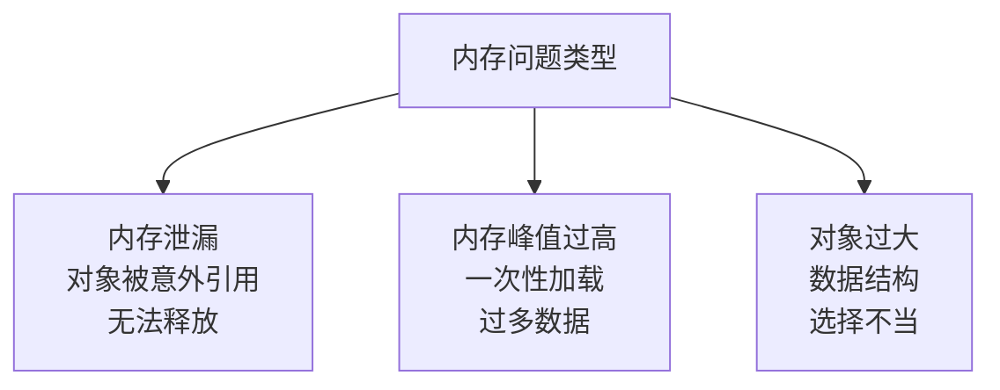

# 内存调试

> **所属路径**：`01_基础能力/01_开发环境与技术英语/11_调试/05_内存调试`
> **预计学习时间**：50 分钟
> **难度等级**：⭐⭐⭐

---

## 前置知识

- [性能分析](../04_性能分析/04_性能分析.md)（了解性能量测的基本方法）
- [Python内存模型与性能](../../09_Python内存模型与性能/)（了解 Python 对象模型和垃圾回收机制的基本概念）

> 如果以上内容还不熟悉，建议先完成对应课程再继续。

---

## 学习目标

完成本节后，你将能够：

1. 使用 `sys.getsizeof` 和 `tracemalloc` 测量 Python 对象和程序的内存使用
2. 识别常见的内存问题：内存泄漏、意外引用、大对象未释放
3. 使用 `gc` 模块检查循环引用
4. 使用 `weakref` 避免不必要的对象引用

---

## 正文讲解

### 1. 为什么关注内存？

你的程序可能功能正确、运行不慢，但内存占用持续增长——运行几个小时后消耗几个 GB 甚至更多，最终被系统杀掉。这就是 **内存泄漏（Memory Leak）** 。

在 Python 中，内存泄漏通常不是因为忘记 `free()` （Python 有垃圾回收），而是因为 **某些对象被意外引用** ，垃圾回收器认为它们仍然在使用，所以不会释放。



> 📌 **图解说明**：Python 中的三种主要内存问题。内存泄漏最难发现，内存峰值最容易触发 OOM，对象过大最容易优化。

### 2. 测量对象大小：sys.getsizeof

`sys.getsizeof` 返回单个对象的内存占用（字节）：

```python
import sys

# 基本类型
print(f"int(0):     {sys.getsizeof(0)} bytes")       # 28
print(f"int(1):     {sys.getsizeof(1)} bytes")       # 28
print(f"float:      {sys.getsizeof(3.14)} bytes")    # 24
print(f"str(''):    {sys.getsizeof('')} bytes")       # 49
print(f"str('abc'): {sys.getsizeof('abc')} bytes")   # 52
print(f"list([]):   {sys.getsizeof([])} bytes")       # 56
print(f"dict({{}}):   {sys.getsizeof({})} bytes")     # 64
print(f"set():      {sys.getsizeof(set())} bytes")   # 216

# 注意：getsizeof 不递归计算！
data = [[1, 2, 3], [4, 5, 6]]
print(f"嵌套列表:   {sys.getsizeof(data)} bytes")  # 只计算外层列表的大小
```

> ⚠️ **注意**：`sys.getsizeof` 只返回对象本身的大小，不包含它引用的子对象。一个列表的 `getsizeof` 只计算列表容器本身，不包括列表中元素的大小。

要递归计算对象的完整大小：

```python
import sys

def deep_getsizeof(obj, seen=None):
    """递归计算对象及其引用的总大小"""
    if seen is None:
        seen = set()
    obj_id = id(obj)
    if obj_id in seen:
        return 0
    seen.add(obj_id)
    
    size = sys.getsizeof(obj)
    
    if isinstance(obj, dict):
        size += sum(deep_getsizeof(k, seen) + deep_getsizeof(v, seen) 
                    for k, v in obj.items())
    elif isinstance(obj, (list, tuple, set, frozenset)):
        size += sum(deep_getsizeof(item, seen) for item in obj)
    
    return size


data = {'users': [{'name': 'Alice', 'age': 30}, {'name': 'Bob', 'age': 25}]}
print(f"浅层大小: {sys.getsizeof(data)} bytes")
print(f"深层大小: {deep_getsizeof(data)} bytes")
```

### 3. tracemalloc——追踪内存分配

`tracemalloc` 是 Python 3.4+ 内置的内存追踪工具，可以告诉你 **哪行代码** 分配了多少内存：

```python
import tracemalloc

# 开始追踪
tracemalloc.start()

# 你的代码
data = [x ** 2 for x in range(100_000)]
filtered = [x for x in data if x % 3 == 0]
text = ''.join(str(x) for x in filtered)

# 获取快照
snapshot = tracemalloc.take_snapshot()

# 按内存使用量排序显示
top_stats = snapshot.statistics('lineno')
print("[ 内存使用 Top 5 ]")
for stat in top_stats[:5]:
    print(f"  {stat}")
```

输出会显示每行代码分配的内存大小和文件位置，让你一眼看出哪里分配了最多内存。

### 4. 比较快照——发现内存泄漏

tracemalloc 最强大的功能是 **比较两个时间点的快照** ，找出内存增长：

```python
import tracemalloc

tracemalloc.start()

# 快照 1：初始状态
snapshot1 = tracemalloc.take_snapshot()

# 模拟内存泄漏
cache = {}
for i in range(10000):
    cache[f'key_{i}'] = list(range(100))  # 持续增长的缓存

# 快照 2：运行一段时间后
snapshot2 = tracemalloc.take_snapshot()

# 比较两个快照
top_stats = snapshot2.compare_to(snapshot1, 'lineno')
print("[ 内存增长 Top 5 ]")
for stat in top_stats[:5]:
    print(f"  {stat}")
```

### 5. gc 模块——检查垃圾回收

`gc` 模块让你可以查看和控制 Python 的垃圾回收器：

```python
import gc

# 检查循环引用
class Node:
    def __init__(self, name):
        self.name = name
        self.ref = None

# 创建循环引用
a = Node("A")
b = Node("B")
a.ref = b
b.ref = a  # 循环引用！

# 删除外部引用
del a, b

# 手动触发垃圾回收
collected = gc.collect()
print(f"回收了 {collected} 个对象")

# 查看无法回收的对象（有 __del__ 的循环引用）
print(f"垃圾对象: {gc.garbage}")

# 获取引用计数信息
import sys
x = [1, 2, 3]
print(f"引用计数: {sys.getrefcount(x)}")  # 注意：getrefcount 本身会增加一次引用
```

### 6. weakref——弱引用

**弱引用（Weak Reference）** 不会阻止对象被垃圾回收。这在缓存和观察者模式中非常有用：

```python
import weakref

class ExpensiveObject:
    def __init__(self, name):
        self.name = name
        self.data = list(range(10000))
    
    def __repr__(self):
        return f"ExpensiveObject({self.name})"
    
    def __del__(self):
        print(f"  {self.name} 被释放")


# 普通引用会阻止垃圾回收
print("=== 普通引用 ===")
obj = ExpensiveObject("A")
ref = obj
del obj
print(f"ref 仍然存活: {ref}")  # A 不会被释放
del ref  # 现在才释放

print("\n=== 弱引用 ===")
obj = ExpensiveObject("B")
weak = weakref.ref(obj)
print(f"弱引用有效: {weak()}")   # ExpensiveObject(B)
del obj  # B 被释放
print(f"弱引用失效: {weak()}")   # None


# WeakValueDictionary：值被回收后自动移除
print("\n=== 弱引用缓存 ===")
cache = weakref.WeakValueDictionary()

obj1 = ExpensiveObject("C")
obj2 = ExpensiveObject("D")

cache['c'] = obj1
cache['d'] = obj2
print(f"缓存大小: {len(cache)}")  # 2

del obj1  # C 被释放，自动从缓存移除
print(f"缓存大小: {len(cache)}")  # 1
print(f"缓存内容: {list(cache.keys())}")  # ['d']
```

### 7. 常见内存优化技巧

| 技巧 | 场景 | 效果 |
| ---- | ---- | ---- |
| 使用生成器替代列表 | 逐个处理大数据集 | 内存从 O(n) 降到 O(1) |
| 使用 `__slots__` | 大量同类型小对象 | 每个实例节省 40-50% 内存 |
| 使用 `array.array` | 大量同类型数值 | 比列表节省 4-8 倍内存 |
| 及时释放大对象 | 处理完后不再需要 | `del obj` + `gc.collect()` |
| 使用弱引用缓存 | 缓存可重建的对象 | 内存压力大时自动释放 |

```python
import sys

# __slots__ 的内存优势
class PointRegular:
    def __init__(self, x, y):
        self.x = x
        self.y = y

class PointSlots:
    __slots__ = ('x', 'y')
    def __init__(self, x, y):
        self.x = x
        self.y = y

p1 = PointRegular(1, 2)
p2 = PointSlots(1, 2)
print(f"普通类: {sys.getsizeof(p1)} + __dict__={sys.getsizeof(p1.__dict__)} bytes")
print(f"__slots__: {sys.getsizeof(p2)} bytes")
```

---

## 动手实践

```python
# 文件：code/memory_debug_demo.py
# 内存调试综合演示

import sys
import tracemalloc
import gc


def demonstrate_tracemalloc():
    """演示 tracemalloc 的使用"""
    tracemalloc.start()
    
    snapshot1 = tracemalloc.take_snapshot()
    
    # 模拟不同的内存分配
    numbers = list(range(100_000))
    strings = [f"item_{i}" for i in range(50_000)]
    dicts = [{'id': i, 'value': i**2} for i in range(10_000)]
    
    snapshot2 = tracemalloc.take_snapshot()
    
    # 显示内存增长
    top_stats = snapshot2.compare_to(snapshot1, 'lineno')
    print("=== 内存分配 Top 5 ===")
    for stat in top_stats[:5]:
        print(f"  {stat}")
    
    # 显示当前总内存
    current, peak = tracemalloc.get_traced_memory()
    print(f"\n当前内存: {current / 1024:.1f} KB")
    print(f"峰值内存: {peak / 1024:.1f} KB")
    
    tracemalloc.stop()


def demonstrate_slots():
    """演示 __slots__ 的内存优势"""
    
    class Regular:
        def __init__(self, x, y, z):
            self.x, self.y, self.z = x, y, z
    
    class Slotted:
        __slots__ = ('x', 'y', 'z')
        def __init__(self, x, y, z):
            self.x, self.y, self.z = x, y, z
    
    # 创建大量对象
    n = 100_000
    
    tracemalloc.start()
    s1 = tracemalloc.take_snapshot()
    regular_objs = [Regular(i, i+1, i+2) for i in range(n)]
    s2 = tracemalloc.take_snapshot()
    del regular_objs
    gc.collect()
    
    slotted_objs = [Slotted(i, i+1, i+2) for i in range(n)]
    s3 = tracemalloc.take_snapshot()
    tracemalloc.stop()
    
    regular_stats = s2.compare_to(s1, 'filename')
    slotted_stats = s3.compare_to(s2, 'filename')
    
    regular_mem = sum(s.size for s in regular_stats if s.size > 0)
    slotted_mem = sum(s.size for s in slotted_stats if s.size > 0)
    
    print(f"\n=== __slots__ 内存对比（{n} 个对象）===")
    print(f"普通类:    {regular_mem / 1024 / 1024:.1f} MB")
    print(f"__slots__: {slotted_mem / 1024 / 1024:.1f} MB")
    print(f"节省:      {(1 - slotted_mem/regular_mem)*100:.0f}%")


def demonstrate_generator_vs_list():
    """演示生成器 vs 列表的内存差异"""
    import tracemalloc
    
    n = 1_000_000
    
    # 列表方式
    tracemalloc.start()
    squares_list = [x**2 for x in range(n)]
    total_list = sum(squares_list)
    list_mem = tracemalloc.get_traced_memory()[0]
    tracemalloc.stop()
    del squares_list
    
    # 生成器方式
    tracemalloc.start()
    squares_gen = (x**2 for x in range(n))
    total_gen = sum(squares_gen)
    gen_mem = tracemalloc.get_traced_memory()[0]
    tracemalloc.stop()
    
    print(f"\n=== 生成器 vs 列表（{n} 个元素）===")
    print(f"列表内存:   {list_mem / 1024:.1f} KB")
    print(f"生成器内存: {gen_mem / 1024:.1f} KB")
    print(f"结果一致:   {total_list == total_gen}")


# 运行所有演示
demonstrate_tracemalloc()
demonstrate_slots()
demonstrate_generator_vs_list()
```

**运行说明**：
- 环境要求：Python 3.10+
- 运行命令：`python code/memory_debug_demo.py`

**预期输出**（具体数值会有差异）：
```
=== 内存分配 Top 5 ===
  ...（tracemalloc 输出）

当前内存: xxxx.x KB
峰值内存: xxxx.x KB

=== __slots__ 内存对比（100000 个对象）===
普通类:    xx.x MB
__slots__: xx.x MB
节省:      xx%

=== 生成器 vs 列表（1000000 个元素）===
列表内存:   xxxx.x KB
生成器内存: x.x KB
结果一致:   True
```

---

## 典型误区

| 误区 | 正确理解 |
| ---- | -------- |
| Python 有垃圾回收所以不用担心内存 | GC 无法回收被意外引用的对象，也无法解决内存峰值过高的问题 |
| `del` 会立即释放内存 | `del` 只是减少引用计数，对象只在引用计数归零时才被释放（循环引用需要 GC 介入） |
| `sys.getsizeof` 能告诉你对象的真实内存占用 | 它只计算对象本身的大小，不包含子对象。嵌套数据结构需要递归计算 |
| 内存泄漏都是循环引用导致的 | 最常见的原因是全局缓存、未关闭的文件/连接、闭包意外捕获变量等 |

---

## 练习题

### 练习 1：内存泄漏检测（难度：⭐⭐）

下面的代码有内存泄漏，用 `tracemalloc` 找出并修复：

```python
class EventBus:
    def __init__(self):
        self.listeners = []
    
    def subscribe(self, callback):
        self.listeners.append(callback)
    
    def emit(self, event):
        for cb in self.listeners:
            cb(event)

bus = EventBus()

for i in range(10000):
    data = list(range(1000))
    bus.subscribe(lambda e, d=data: print(e, len(d)))
```

<details>
<summary>💡 提示</summary>

每次循环都将一个引用 `data` 的 lambda 添加到 `listeners` ，导致所有 `data` 都无法被释放。考虑限制 listeners 的数量或使用弱引用。

</details>

<details>
<summary>✅ 参考答案</summary>

```python
import tracemalloc
from collections import deque

class EventBus:
    def __init__(self, max_listeners=100):
        self.listeners = deque(maxlen=max_listeners)  # 限制大小
    
    def subscribe(self, callback):
        self.listeners.append(callback)
    
    def emit(self, event):
        for cb in self.listeners:
            cb(event)

tracemalloc.start()
s1 = tracemalloc.take_snapshot()

bus = EventBus(max_listeners=100)
for i in range(10000):
    data = list(range(1000))
    bus.subscribe(lambda e, d=data: None)

s2 = tracemalloc.take_snapshot()
stats = s2.compare_to(s1, 'lineno')
print("内存增长 Top 3:")
for s in stats[:3]:
    print(f"  {s}")
# 现在只保留最近 100 个 listener，内存不会无限增长
```

</details>

### 练习 2：__slots__ 优化（难度：⭐⭐）

将以下类改用 `__slots__` ，并测量内存节省量：

```python
class Pixel:
    def __init__(self, x, y, r, g, b):
        self.x = x
        self.y = y
        self.r = r
        self.g = g
        self.b = b
```

<details>
<summary>💡 提示</summary>

添加 `__slots__ = ('x', 'y', 'r', 'g', 'b')` 。使用 `sys.getsizeof` 对比两个版本的实例大小。

</details>

<details>
<summary>✅ 参考答案</summary>

```python
import sys

class PixelRegular:
    def __init__(self, x, y, r, g, b):
        self.x, self.y = x, y
        self.r, self.g, self.b = r, g, b

class PixelSlots:
    __slots__ = ('x', 'y', 'r', 'g', 'b')
    def __init__(self, x, y, r, g, b):
        self.x, self.y = x, y
        self.r, self.g, self.b = r, g, b

p1 = PixelRegular(0, 0, 255, 128, 0)
p2 = PixelSlots(0, 0, 255, 128, 0)

size1 = sys.getsizeof(p1) + sys.getsizeof(p1.__dict__)
size2 = sys.getsizeof(p2)

print(f"普通类:    {size1} bytes")
print(f"__slots__: {size2} bytes")
print(f"节省:      {(1 - size2/size1)*100:.0f}%")
```

</details>

---

## 下一步学习

- 📖 下一个知识主题：[命令行](../../12_命令行/)
- 🔗 相关知识点：[性能分析](../04_性能分析/04_性能分析.md)
- 🔗 相关知识点：[Python内存模型与性能](../../09_Python内存模型与性能/)

---

## 参考资料

1. [tracemalloc — Trace memory allocations — Python 官方文档](https://docs.python.org/3/library/tracemalloc.html) — tracemalloc 的完整 API（官方文档）
2. [gc — Garbage Collector interface — Python 官方文档](https://docs.python.org/3/library/gc.html) — gc 模块的使用说明（官方文档）
3. [weakref — Weak references — Python 官方文档](https://docs.python.org/3/library/weakref.html) — 弱引用的完整 API（官方文档）
4. [sys.getsizeof — Python 官方文档](https://docs.python.org/3/library/sys.html#sys.getsizeof) — 对象大小测量函数（官方文档）
