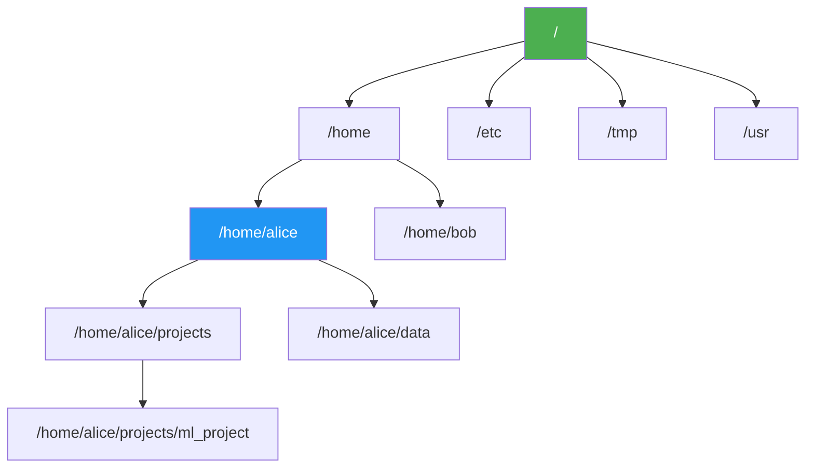

# 文件系统操作

> **所属路径**：`01_基础能力/01_开发环境与技术英语/12_命令行/01_文件系统操作`
> **预计学习时间**：45 分钟
> **难度等级**：⭐

---

## 前置知识

- [文件操作与IO](../../01_编程语言基础/07_文件操作与IO/)（了解 Python 中的文件读写基本概念）
- [项目结构与规范](../../18_Python项目实践/01_项目结构与规范/)（了解 Python 项目的目录组织方式）

> 如果以上内容还不熟悉，建议先完成对应课程再继续。

---

## 学习目标

完成本节后，你将能够：

1. 使用 `pwd`、`cd`、`ls` 在文件系统中自如导航
2. 使用 `cp`、`mv`、`rm`、`mkdir` 等命令管理文件和目录
3. 使用 `find` 命令和通配符高效查找文件
4. 理解 Linux 文件权限模型，使用 `chmod` 修改权限
5. 使用 `du`、`df`、`wc` 等命令获取文件和磁盘信息

---

## 正文讲解

### 1. 为什么要学命令行文件操作？

想象这样一个场景：你正在做一个图像分类项目，训练集包含 50000 张图片，分散在 100 个类别的子目录中。现在你需要把所有 `.png` 文件转移到一个新目录，同时删除所有小于 1KB 的损坏文件，最后统计每个类别的图片数量。如果用图形界面（比如 Windows 的文件管理器），你可能需要一个下午的时间反复点击、拖拽、确认。但在命令行中，三条命令就能搞定。

这就是 **命令行（Command Line）** 的威力。命令行，也叫 **终端（Terminal）** 或 **Shell** ，是一种通过键入文本命令与操作系统交互的方式。在 AI 开发中，命令行的重要性体现在以下几个方面：

- **效率**：批量操作成千上万个文件，比图形界面快几个数量级
- **自动化**：命令可以写入脚本，反复执行，保证一致性
- **远程操作**：GPU 服务器通常只提供命令行界面，没有图形桌面
- **可复现性**：命令记录即操作记录，方便团队协作和实验复现

本节从文件系统操作入手——这是命令行技能中最基础也最常用的部分。掌握了文件操作，你就有了在命令行世界中自由行走的能力。

### 2. 目录导航三板斧：pwd、cd、ls

在图形界面中，你通过双击文件夹来"进入"一个目录，通过地址栏查看当前位置。在命令行中，这些操作对应三个最基本的命令。

**`pwd`（Print Working Directory）—— 我在哪？**

打开终端后，你的第一个问题往往是"我现在在哪个目录？" `pwd` 会告诉你答案：

```bash
$ pwd
/home/alice
```

这个输出是一个 **绝对路径（Absolute Path）** ，从根目录 `/` 开始，完整描述了你在文件系统中的位置。Linux/macOS 的文件系统是一棵倒置的树，根在最顶端：



> 📌 **图解说明**：Linux 文件系统的树状结构。每个用户有自己的 **家目录（Home Directory）** ，如 `/home/alice` 。

**`cd`（Change Directory）—— 去哪里？**

```bash
# 进入子目录
$ cd projects

# 进入嵌套目录（使用绝对路径）
$ cd /home/alice/projects/ml_project

# 返回上一级目录
$ cd ..

# 返回家目录（三种方式都可以）
$ cd ~
$ cd $HOME
$ cd

# 返回上一次所在的目录
$ cd -
```

路径中有两个特殊符号需要记住：`.` 表示当前目录，`..` 表示上一级目录。

**`ls`（List）—— 这里有什么？**

```bash
# 列出当前目录下的文件和子目录
$ ls
data  models  train.py  README.md

# 显示详细信息（权限、大小、修改时间等）
$ ls -l
total 16
drwxr-xr-x 3 alice alice 4096 Apr 10 09:00 data
drwxr-xr-x 2 alice alice 4096 Apr 10 09:05 models
-rw-r--r-- 1 alice alice 2048 Apr 10 08:30 train.py
-rw-r--r-- 1 alice alice  512 Apr  9 14:00 README.md

# 显示隐藏文件（以 . 开头的文件）
$ ls -a
.  ..  .git  .gitignore  data  models  train.py  README.md

# 按时间排序（最近修改的在前）
$ ls -lt

# 以人类可读的方式显示文件大小
$ ls -lh
```

> 💡 **提示**：`ls` 的常用选项可以组合使用，比如 `ls -lah` 同时显示详细信息、隐藏文件和可读文件大小。

### 3. 文件与目录管理

掌握了导航之后，接下来学习如何"动手"——创建、复制、移动和删除文件与目录。

**创建目录和文件**

```bash
# 创建单个目录
$ mkdir experiments

# 递归创建嵌套目录（-p 表示自动创建不存在的父目录）
$ mkdir -p experiments/exp_001/logs

# 创建空文件（或更新已有文件的时间戳）
$ touch notes.txt
```

**复制文件与目录**

```bash
# 复制文件
$ cp train.py train_backup.py

# 复制整个目录（-r 表示递归复制）
$ cp -r experiments experiments_backup

# 复制时保留文件属性（权限、时间戳等）
$ cp -rp data /mnt/backup/
```

**移动和重命名**

```bash
# 移动文件到另一个目录
$ mv train.py experiments/exp_001/

# 重命名文件（本质上就是移动到同一目录下的新名字）
$ mv README.md README_old.md

# 移动整个目录
$ mv experiments/exp_001 experiments/exp_001_done
```

**删除文件与目录**

```bash
# 删除文件
$ rm notes.txt

# 删除空目录
$ rmdir empty_dir

# 递归删除非空目录（⚠️ 危险操作！）
$ rm -r experiments_backup

# 强制删除，不提示确认（⚠️ 更危险！）
$ rm -rf old_data
```

> ⚠️ **警告**：`rm -rf` 是命令行中最危险的操作之一。Linux 没有回收站，删除后无法恢复。永远不要在不确定路径的情况下执行 `rm -rf`，特别是不要执行 `rm -rf /` 或 `rm -rf ~`。练习时建议先用 `ls` 确认目标，或者加上 `-i` 选项让系统逐个确认。

### 4. 文件查找：find 与通配符

当项目文件越来越多，快速找到目标文件变得至关重要。

**通配符（Glob Patterns）**

通配符是 Shell 内置的模式匹配功能，可以直接在命令中使用：

```bash
# * 匹配任意数量字符
$ ls *.py            # 所有 .py 文件
$ ls data/*.csv      # data 目录下所有 .csv 文件

# ? 匹配单个字符
$ ls exp_00?.log     # exp_001.log, exp_002.log, ...

# [] 匹配指定范围的单个字符
$ ls exp_[1-3].log   # exp_1.log, exp_2.log, exp_3.log

# {} 匹配多个选项
$ ls *.{py,yaml,json}  # 所有 .py, .yaml, .json 文件
```

**`find` 命令——强大的搜索引擎**

`find` 是命令行中最强大的文件搜索工具，支持按名称、类型、大小、时间等条件查找：

```bash
# 按名称查找（在当前目录及子目录中递归搜索）
$ find . -name "*.py"

# 按名称查找（不区分大小写）
$ find . -iname "readme*"

# 按类型查找（d=目录, f=普通文件, l=符号链接）
$ find . -type d -name "logs"

# 按大小查找（+10M=大于10MB, -1k=小于1KB）
$ find . -type f -size +10M
$ find . -type f -size -1k

# 按修改时间查找（-mtime -7 = 最近7天内修改过的）
$ find . -type f -mtime -7

# 查找并执行操作（删除所有 .pyc 缓存文件）
$ find . -name "*.pyc" -delete

# 查找并对每个结果执行命令
$ find . -name "*.log" -exec wc -l {} \;
```

> 💡 **AI 开发实用技巧**：训练过程中经常会生成大量检查点文件。用 `find . -name "checkpoint_*.pt" -size +1G -mtime +30` 可以快速找到一个月前保存的、超过 1GB 的旧检查点，方便清理磁盘空间。

### 5. 文件权限基础

在 Linux 系统中，每个文件都有一套权限控制机制，决定了谁可以读、写、执行该文件。当你在服务器上操作数据集或脚本时，理解权限是必不可少的。

`ls -l` 输出的第一列就是权限信息：

```
-rw-r--r--  1 alice ml_team 2048 Apr 10 train.py
```

权限字符串 `-rw-r--r--` 分为四组：

| 位置 | 含义 | 示例 |
| ---- | ---- | ---- |
| 第 1 位 | 文件类型（`-` 普通文件，`d` 目录，`l` 链接） | `-` |
| 第 2–4 位 | 所有者权限（Owner） | `rw-`（可读可写不可执行） |
| 第 5–7 位 | 所属组权限（Group） | `r--`（只读） |
| 第 8–10 位 | 其他人权限（Others） | `r--`（只读） |

**修改权限：chmod**

```bash
# 给脚本添加执行权限
$ chmod +x train.sh

# 设置精确权限（数字模式：r=4, w=2, x=1）
$ chmod 755 train.sh   # 所有者 rwx(7), 组 r-x(5), 其他 r-x(5)
$ chmod 644 config.yaml # 所有者 rw-(6), 组 r--(4), 其他 r--(4)

# 递归修改目录下所有文件的权限
$ chmod -R 755 scripts/
```

### 6. 磁盘使用与文件信息

在 AI 项目中，数据集和模型文件经常占用大量磁盘空间。以下命令帮助你监控和管理存储。

```bash
# 查看文件/目录大小（-s 汇总, -h 可读格式）
$ du -sh data/
4.2G    data/

# 查看各子目录大小并排序
$ du -sh data/* | sort -h
128M    data/test
512M    data/val
3.6G    data/train

# 查看磁盘剩余空间
$ df -h
Filesystem      Size  Used Avail Use% Mounted on
/dev/sda1       100G   72G   28G  72% /

# 统计文件行数、单词数、字节数
$ wc -l train.py       # 行数
$ wc -w README.md      # 单词数
$ wc -c model.bin      # 字节数

# 查看文件类型
$ file model.pt
model.pt: Zip archive data

# 查看文件详细信息（大小、时间戳、inode等）
$ stat config.yaml
```

---

## 动手实践

下面我们通过一个模拟 AI 项目的场景来综合练习以上命令：

```bash
# 1. 创建项目目录结构
$ mkdir -p ~/cli_practice/{data/{train,val,test},models,logs,scripts}

# 2. 创建一些模拟文件
$ cd ~/cli_practice
$ touch data/train/img_{001..020}.png
$ touch data/val/img_{001..005}.png
$ touch data/test/img_{001..005}.png
$ echo '#!/bin/bash\necho "Training..."' > scripts/train.sh
$ echo 'learning_rate: 0.001' > config.yaml

# 3. 查看项目结构
$ find . -type f | head -20

# 4. 统计训练集图片数量
$ ls data/train/ | wc -l

# 5. 找出所有 .png 文件
$ find . -name "*.png" | wc -l

# 6. 给训练脚本添加执行权限
$ chmod +x scripts/train.sh

# 7. 查看目录占用空间
$ du -sh data/*

# 8. 清理实验（完成后删除练习目录）
$ rm -rf ~/cli_practice
```

**运行说明**：
- 在任意 Linux/macOS 终端中执行以上命令
- Windows 用户可使用 WSL（Windows Subsystem for Linux）或 Git Bash

---

## 典型误区

| 误区 | 正确理解 |
| ---- | -------- |
| `rm` 删除的文件可以从回收站恢复 | Linux 命令行的 `rm` 直接删除文件，没有回收站机制。删除前务必确认路径 |
| 相对路径和绝对路径可以随意混用 | 在脚本中建议使用绝对路径，避免因工作目录变化导致路径错误 |
| `cp` 复制目录时不需要 `-r` | 复制目录必须加 `-r`（递归），否则会报错 |
| `chmod 777` 是最方便的权限设置 | `777` 意味着所有人都能读写执行，存在严重安全隐患。生产环境中应使用最小权限原则 |

---

## 练习题

### 练习 1：项目目录创建（难度：⭐）

请用一条 `mkdir` 命令创建以下目录结构：

```
my_project/
├── src/
│   ├── models/
│   └── utils/
├── data/
│   ├── raw/
│   └── processed/
└── notebooks/
```

<details>
<summary>💡 提示</summary>

使用 `mkdir` 的 `-p` 选项可以一次性创建嵌套目录。可以在一条命令中指定多个路径。

</details>

<details>
<summary>✅ 参考答案</summary>

```bash
mkdir -p my_project/{src/{models,utils},data/{raw,processed},notebooks}
```

花括号展开（Brace Expansion）是 Bash 的内置功能，`{a,b}` 会展开为 `a b` 两个参数。

</details>

### 练习 2：文件查找与统计（难度：⭐⭐）

假设你的项目目录中有大量文件。请写出命令：
1. 找出所有大于 100MB 的 `.pt` 文件
2. 统计 `data/` 目录下有多少个 `.csv` 文件
3. 找出最近 3 天内修改过的 Python 文件

<details>
<summary>💡 提示</summary>

使用 `find` 命令，结合 `-name`、`-size`、`-mtime` 等选项。统计数量可以通过管道连接 `wc -l` 。

</details>

<details>
<summary>✅ 参考答案</summary>

```bash
# 1. 大于 100MB 的 .pt 文件
find . -name "*.pt" -size +100M

# 2. data/ 下的 .csv 文件数量
find data/ -name "*.csv" -type f | wc -l

# 3. 最近 3 天修改的 Python 文件
find . -name "*.py" -mtime -3
```

</details>

### 练习 3：权限管理（难度：⭐⭐）

你有一个 `deploy.sh` 脚本，当前权限为 `-rw-r--r--`。请问：
1. 当前权限对应的数字是什么？
2. 如何让所有者能执行这个脚本，同时不改变其他权限？
3. 如何将权限设置为：所有者可读写执行，同组用户可读可执行，其他人无权限？

<details>
<summary>💡 提示</summary>

`r=4, w=2, x=1` ，将三个数字相加得到每组权限的数字表示。

</details>

<details>
<summary>✅ 参考答案</summary>

```bash
# 1. -rw-r--r-- = 644（所有者6, 组4, 其他4）

# 2. 只给所有者添加执行权限
chmod u+x deploy.sh

# 3. 设置为 rwxr-x---
chmod 750 deploy.sh
```

</details>

---

## 下一步学习

- 📖 下一个知识点：[管道与重定向](../02_管道与重定向/02_管道与重定向.md)
- 🔗 相关知识点：[环境变量与脚本](../03_环境变量与脚本/03_环境变量与脚本.md)
- 📚 拓展阅读：[Linux 命令行大全](https://linuxcommand.org/)（公开在线教程）

---

## 参考资料

1. [The Linux Command Line](https://linuxcommand.org/tlcl.php) — William Shotts 著，免费在线阅读的经典 Linux 命令行教程（CC BY-NC-ND 许可）
2. [GNU Coreutils 官方文档](https://www.gnu.org/software/coreutils/manual/) — ls、cp、mv、rm 等核心命令的权威参考（GNU 自由文档）
3. [Linux 文件权限详解 - ArchWiki](https://wiki.archlinux.org/title/File_permissions_and_attributes) — Arch Linux Wiki 上的权限详解（GNU FDL 许可）
