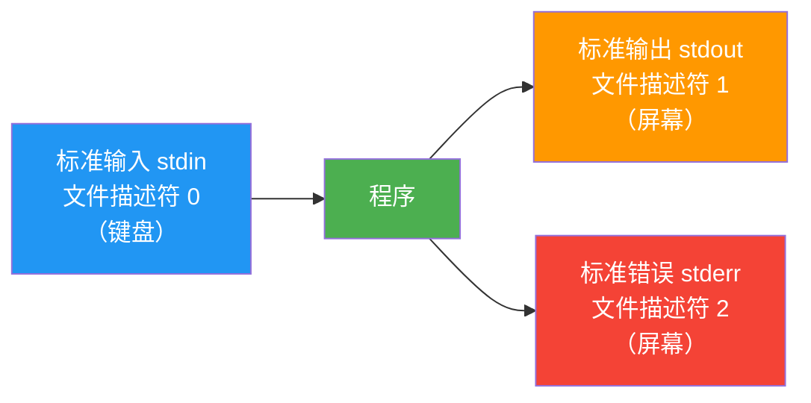
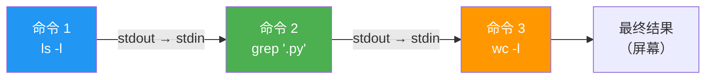

# 管道与重定向

> **所属路径**：`01_基础能力/01_开发环境与技术英语/12_命令行/02_管道与重定向`
> **预计学习时间**：45 分钟
> **难度等级**：⭐⭐

---

## 前置知识

- [文件系统操作](../01_文件系统操作/01_文件系统操作.md)（熟悉基本的命令行导航和文件操作）

> 如果以上内容还不熟悉，建议先完成对应课程再继续。

---

## 学习目标

完成本节后，你将能够：

1. 理解标准输入（stdin）、标准输出（stdout）和标准错误（stderr）三种数据流
2. 使用 `>`、`>>`、`<` 和 `2>` 进行输入输出重定向
3. 使用管道 `|` 将多个命令串联成数据处理流水线
4. 使用 `tee` 和 `xargs` 等高级管道工具
5. 初步了解 `grep`、`sed`、`awk` 文本处理三剑客

---

## 正文讲解

### 1. 数据流的概念：标准输入、输出与错误

在命令行的世界里，每个程序运行时都有三条"数据通道"与外界连接，就像水管中的三根管道：



> 📌 **图解说明**：每个程序默认有三条数据流。标准输入通常来自键盘，标准输出和标准错误默认都显示在屏幕上。重定向和管道的本质，就是改变这些数据流的方向。

- **标准输入（stdin）** ：程序读取数据的来源，默认是键盘输入
- **标准输出（stdout）** ：程序正常输出的目的地，默认是终端屏幕
- **标准错误（stderr）** ：程序错误信息的输出，默认也是终端屏幕

为什么要把 stdout 和 stderr 分开？因为在实际工作中，你经常需要"只保存正常输出，让错误信息继续显示在屏幕上"，或者"只查看错误信息，忽略正常输出"。分离这两条流让你可以独立控制它们。

### 2. 输出重定向：> 与 >>

**重定向（Redirection）** 就是把数据流从默认目的地（屏幕）转向其他地方（通常是文件）。

```bash
# > 将 stdout 写入文件（覆盖已有内容）
$ echo "Hello, AI!" > greeting.txt
$ cat greeting.txt
Hello, AI!

# >> 将 stdout 追加到文件末尾（不覆盖）
$ echo "Hello again!" >> greeting.txt
$ cat greeting.txt
Hello, AI!
Hello again!

# 将命令输出保存到文件
$ ls -la > file_list.txt

# 将错误信息重定向到文件（2> 表示重定向 stderr）
$ find /root -name "*.py" 2> errors.log

# 同时重定向 stdout 和 stderr 到不同文件
$ python train.py > output.log 2> error.log

# 同时重定向 stdout 和 stderr 到同一个文件
$ python train.py > all.log 2>&1
# 或者使用简写形式
$ python train.py &> all.log
```

> 💡 **AI 开发实用技巧**：训练模型时，将输出重定向到日志文件非常实用。`python train.py > train.log 2>&1` 可以把所有输出（包括进度条和警告信息）都保存下来，方便事后分析。

### 3. 输入重定向与 Here Document

输入重定向让程序从文件读取数据，而不是等待键盘输入：

```bash
# < 从文件读取输入
$ wc -l < train.py
# 等价于 wc -l train.py，但语义不同：
# 前者是 Shell 把文件内容"喂"给 wc，后者是 wc 自己打开文件

# Here Document：在命令行中嵌入多行文本
$ cat << EOF > config.yaml
model:
  name: ResNet50
  epochs: 100
  learning_rate: 0.001
EOF
```

**Here Document**（`<< 标记`）允许你在命令行中直接写入多行文本，直到遇到结束标记（如 `EOF`）。这在生成配置文件时非常方便。

### 4. 管道：命令的组合艺术

**管道（Pipe）** 是命令行中最强大的概念之一。它用 `|` 符号把一个命令的 stdout 连接到下一个命令的 stdin，让你可以把多个简单的命令组合成复杂的数据处理流水线。



> 📌 **图解说明**：管道的本质是把前一个命令的标准输出连接到后一个命令的标准输入，形成数据处理的"流水线"。

```bash
# 统计当前目录下有多少个 Python 文件
$ ls -la | grep "\.py$" | wc -l

# 查看占用空间最大的前 5 个文件/目录
$ du -sh * | sort -rh | head -5

# 找出训练日志中所有包含 "loss" 的行，并提取数值
$ cat train.log | grep "loss" | tail -10

# 查看 Python 进程占用的内存
$ ps aux | grep python | grep -v grep

# 去重统计文件中的唯一行数
$ sort data.txt | uniq | wc -l
```

管道的设计哲学是 **Unix 哲学** 的核心——每个程序只做一件事，做好一件事，然后通过管道把它们组合起来完成复杂任务。这个思想在 AI 工作中同样适用：数据清洗、日志分析、结果统计，都可以用管道优雅地完成。

### 5. 高级管道工具：tee 与 xargs

**`tee`——分流器**

`tee` 像一个 T 型水管接头，把数据流同时送到屏幕和文件：

```bash
# 既在屏幕上显示输出，又保存到文件
$ python train.py 2>&1 | tee train.log

# 追加模式
$ echo "new result" | tee -a results.txt
```

**`xargs`——参数构造器**

`xargs` 把标准输入的内容转换成命令的参数：

```bash
# 删除所有 .pyc 文件（find 的结果作为 rm 的参数）
$ find . -name "*.pyc" | xargs rm

# 对每个 Python 文件统计行数
$ find . -name "*.py" | xargs wc -l

# 并行执行（-P 指定并行数）
$ find . -name "*.jpg" | xargs -P 4 -I {} convert {} -resize 224x224 {}
```

> 💡 **提示**：当文件名包含空格或特殊字符时，`find ... -print0 | xargs -0 ...` 组合可以安全处理。

### 6. 文本处理三剑客速览：grep、sed、awk

这三个工具是命令行文本处理的核心，在 AI 开发的日志分析和数据预处理中极为常用。

**`grep`——文本搜索**

```bash
# 在文件中搜索包含关键词的行
$ grep "error" train.log

# 递归搜索目录下所有文件（-r）
$ grep -r "import torch" src/

# 显示行号（-n）和忽略大小写（-i）
$ grep -ni "warning" train.log

# 反向匹配（显示不包含关键词的行）
$ grep -v "DEBUG" train.log

# 使用正则表达式
$ grep -E "epoch [0-9]+" train.log
```

**`sed`——流编辑器**

```bash
# 替换文件中的文本（s/旧/新/g）
$ sed 's/learning_rate/lr/g' config.yaml

# 直接修改文件（-i）
$ sed -i 's/epochs: 100/epochs: 200/' config.yaml

# 删除空行
$ sed '/^$/d' data.txt

# 只显示第 10 到 20 行
$ sed -n '10,20p' train.log
```

**`awk`——字段处理**

```bash
# 打印每行的第 2 个字段（默认以空格分隔）
$ awk '{print $2}' results.txt

# 指定分隔符（-F）
$ awk -F',' '{print $1, $3}' data.csv

# 条件筛选
$ awk '$3 > 0.9 {print $1, $3}' results.txt

# 计算某列的平均值
$ awk '{sum+=$2; n++} END {print sum/n}' scores.txt
```

---

## 动手实践

综合使用管道和重定向来分析一个模拟的训练日志：

```bash
# 创建模拟训练日志
cat << 'EOF' > /tmp/train.log
[2024-04-10 10:00:01] INFO: Epoch 1/10, loss=2.3456, acc=0.1234
[2024-04-10 10:05:32] INFO: Epoch 2/10, loss=1.8765, acc=0.3456
[2024-04-10 10:10:45] WARNING: GPU memory usage high: 95%
[2024-04-10 10:15:21] INFO: Epoch 3/10, loss=1.2345, acc=0.5678
[2024-04-10 10:20:18] INFO: Epoch 4/10, loss=0.9876, acc=0.6789
[2024-04-10 10:25:33] ERROR: CUDA out of memory
[2024-04-10 10:30:01] INFO: Epoch 5/10, loss=0.7654, acc=0.7890
[2024-04-10 10:35:12] INFO: Epoch 6/10, loss=0.5432, acc=0.8234
[2024-04-10 10:40:08] INFO: Epoch 7/10, loss=0.4321, acc=0.8567
[2024-04-10 10:45:22] WARNING: Learning rate too high
[2024-04-10 10:50:15] INFO: Epoch 8/10, loss=0.3210, acc=0.8901
[2024-04-10 10:55:30] INFO: Epoch 9/10, loss=0.2345, acc=0.9123
[2024-04-10 11:00:45] INFO: Epoch 10/10, loss=0.1876, acc=0.9345
EOF

# 1. 只查看 ERROR 和 WARNING
grep -E "(ERROR|WARNING)" /tmp/train.log

# 2. 提取所有 loss 值
grep "loss=" /tmp/train.log | sed 's/.*loss=\([0-9.]*\).*/\1/'

# 3. 统计 INFO/WARNING/ERROR 各多少条
grep -oE "(INFO|WARNING|ERROR)" /tmp/train.log | sort | uniq -c | sort -rn

# 4. 保存只包含 epoch 信息的日志
grep "Epoch" /tmp/train.log > /tmp/epochs.log && cat /tmp/epochs.log
```

---

## 典型误区

| 误区 | 正确理解 |
| ---- | -------- |
| `>` 和 `>>` 效果一样 | `>` 会覆盖文件内容，`>>` 是追加。误用 `>` 可能导致数据丢失 |
| 管道可以传递所有数据 | 管道只传递 stdout，不传递 stderr。要同时传递两者需用 `2>&1 \|` |
| `grep` 搜索的是文件名 | `grep` 搜索的是文件内容。搜索文件名应使用 `find -name` |
| `sed -i` 可以随意使用 | `sed -i` 直接修改原文件，操作前建议先不加 `-i` 预览结果 |

---

## 练习题

### 练习 1：日志分析（难度：⭐）

使用上面创建的 `/tmp/train.log` 文件，写出命令：
1. 找出最后一个 epoch 的 loss 值
2. 统计日志中一共有多少行

<details>
<summary>💡 提示</summary>

使用 `grep` 配合 `tail` 提取最后匹配行；使用 `wc -l` 统计行数。

</details>

<details>
<summary>✅ 参考答案</summary>

```bash
# 1. 最后一个 epoch 的 loss
grep "loss=" /tmp/train.log | tail -1

# 2. 总行数
wc -l < /tmp/train.log
```

</details>

### 练习 2：管道组合（难度：⭐⭐）

编写一条管道命令，完成以下任务：在 `/tmp/train.log` 中找出所有 INFO 级别的日志，提取其中的 accuracy 值（acc=后面的数字），然后按数值排序，显示最高的 3 个。

<details>
<summary>💡 提示</summary>

组合使用 `grep`、`sed`（或 `awk`）、`sort` 和 `head` 。

</details>

<details>
<summary>✅ 参考答案</summary>

```bash
grep "INFO.*acc=" /tmp/train.log | sed 's/.*acc=\([0-9.]*\).*/\1/' | sort -rn | head -3
```

输出：
```
0.9345
0.9123
0.8901
```

也可以用 `awk` ：
```bash
grep "INFO.*acc=" /tmp/train.log | awk -F'acc=' '{print $2}' | sort -rn | head -3
```

</details>

### 练习 3：重定向实践（难度：⭐⭐）

编写命令，把 `find` 搜索当前目录下所有 `.py` 文件的结果保存到 `py_files.txt` ，同时把搜索过程中的权限错误保存到 `errors.txt` 。

<details>
<summary>💡 提示</summary>

分别重定向 stdout（文件描述符 1）和 stderr（文件描述符 2）。

</details>

<details>
<summary>✅ 参考答案</summary>

```bash
find . -name "*.py" > py_files.txt 2> errors.txt
```

如果想同时在屏幕上看到正常输出：
```bash
find . -name "*.py" 2> errors.txt | tee py_files.txt
```

</details>

---

## 下一步学习

- 📖 下一个知识点：[环境变量与脚本](../03_环境变量与脚本/03_环境变量与脚本.md)
- 🔗 相关知识点：[正则表达式](../../05_正则表达式/)（grep/sed/awk 的正则功能详解）
- 📚 拓展阅读：[管道与重定向详解](https://tldp.org/LDP/abs/html/io-redirection.html)（Advanced Bash-Scripting Guide，公开在线教程）

---

## 参考资料

1. [The Linux Command Line - Chapter 6: Redirection](https://linuxcommand.org/tlcl.php) — 管道与重定向的详细讲解（CC BY-NC-ND 许可）
2. [GNU Grep 官方文档](https://www.gnu.org/software/grep/manual/) — grep 命令的完整参考（GNU 自由文档）
3. [GNU Sed 官方文档](https://www.gnu.org/software/sed/manual/) — sed 命令的完整参考（GNU 自由文档）
4. [The AWK Programming Language](https://en.wikipedia.org/wiki/AWK) — AWK 语言概述（维基百科）
