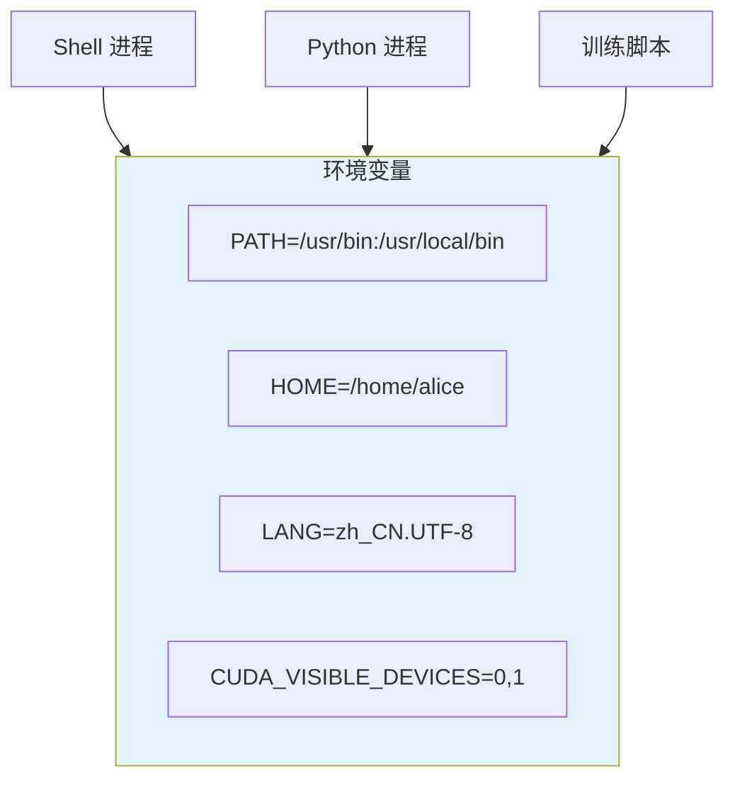
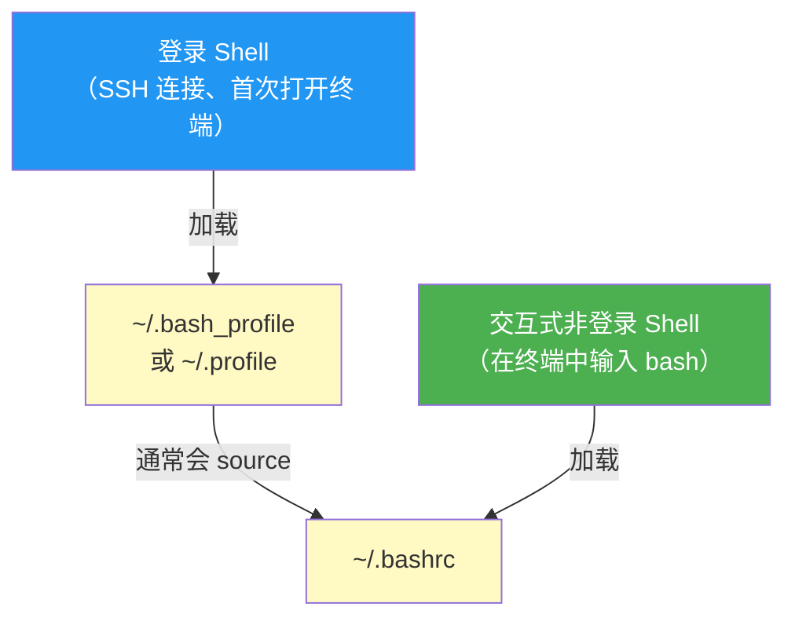

# 环境变量与脚本

> **所属路径**：`01_基础能力/01_开发环境与技术英语/12_命令行/03_环境变量与脚本`
> **预计学习时间**：50 分钟
> **难度等级**：⭐⭐

---

## 前置知识

- [文件系统操作](../01_文件系统操作/01_文件系统操作.md)（熟悉基本的文件操作和权限管理）
- [管道与重定向](../02_管道与重定向/02_管道与重定向.md)（理解标准输入输出和管道的概念）

> 如果以上内容还不熟悉，建议先完成对应课程再继续。

---

## 学习目标

完成本节后，你将能够：

1. 理解环境变量的概念及其在系统中的作用
2. 查看、设置、导出和持久化环境变量
3. 深入理解 PATH 变量的工作机制
4. 编写基本的 Shell 脚本（变量、条件、循环、函数）
5. 掌握 AI 开发中常用的环境变量配置

---

## 正文讲解

### 1. 什么是环境变量？

你是否遇到过这样的场景？安装完 Python 后，在终端输入 `python` 却提示 `command not found` 。明明安装成功了，为什么系统找不到？这背后的原因就与 **环境变量（Environment Variable）** 有关。

环境变量是操作系统中的一种"全局配置"机制。你可以把它理解为一组"键值对"，每个键有一个名称和对应的值，它们影响着系统和程序的行为。就像你在手机设置中调节亮度、音量一样，环境变量就是操作系统的"设置面板"。



> 📌 **图解说明**：环境变量由 Shell 维护，所有从该 Shell 启动的程序都会继承这些变量。不同的程序读取不同的环境变量来决定自己的行为。

### 2. 查看与设置环境变量

**查看环境变量**

```bash
# 查看所有环境变量
$ env
$ printenv

# 查看某个特定变量的值
$ echo $HOME
/home/alice

$ echo $PATH
/usr/local/bin:/usr/bin:/bin

$ printenv USER
alice
```

**设置环境变量**

```bash
# 设置局部变量（仅当前 Shell 可见，子进程不可见）
$ MY_VAR="hello"
$ echo $MY_VAR
hello

# 导出为环境变量（子进程也可以访问）
$ export MY_VAR="hello"

# 一行完成设置和导出
$ export PROJECT_NAME="image_classifier"

# 临时为某条命令设置环境变量
$ CUDA_VISIBLE_DEVICES=0 python train.py

# 删除环境变量
$ unset MY_VAR
```

> 💡 **关键区别**：`MY_VAR="hello"` 只是 Shell 变量，用 `export` 导出后才成为环境变量，才能被子进程（如 Python 脚本）读取。

### 3. PATH 变量详解

**PATH** 是最重要的环境变量之一。当你输入一个命令（如 `python`）时，Shell 会按照 PATH 变量中列出的目录**从左到右**逐个搜索，找到第一个匹配的可执行文件就运行它。

```bash
$ echo $PATH
/home/alice/miniconda3/bin:/usr/local/bin:/usr/bin:/bin

# Shell 查找 python 的过程：
# 1. 在 /home/alice/miniconda3/bin/ 中找 → 找到了！执行它
# 2. (如果没找到) 在 /usr/local/bin/ 中找
# 3. (如果没找到) 在 /usr/bin/ 中找
# ...
```

**向 PATH 添加新目录**

```bash
# 将新目录添加到 PATH 的开头（优先搜索）
$ export PATH="/home/alice/my_tools:$PATH"

# 将新目录添加到 PATH 的末尾
$ export PATH="$PATH:/home/alice/my_tools"
```

> ⚠️ **注意**：直接在终端中修改 PATH 只对当前会话有效。关闭终端后修改就丢失了。要持久化，需要写入 Shell 配置文件。

**验证命令来源**

```bash
# 查看命令的实际路径
$ which python
/home/alice/miniconda3/bin/python

# 查看命令的所有匹配路径
$ which -a python
/home/alice/miniconda3/bin/python
/usr/bin/python
```

### 4. Shell 配置文件

要让环境变量在每次打开终端时自动生效，需要将设置写入 **Shell 配置文件** 。

| Shell | 配置文件 | 加载时机 |
| ----- | -------- | -------- |
| Bash | `~/.bashrc` | 每次打开非登录交互式 Shell |
| Bash | `~/.bash_profile` | 登录时（SSH 登录、首次打开终端） |
| Zsh | `~/.zshrc` | 每次打开新的 Zsh 终端 |

```bash
# 编辑 Bash 配置文件
$ nano ~/.bashrc

# 在文件末尾添加：
export PATH="$HOME/miniconda3/bin:$PATH"
export CUDA_VISIBLE_DEVICES="0,1"
export HF_HOME="$HOME/.cache/huggingface"

# 保存后，让修改立即生效
$ source ~/.bashrc
```

**登录 Shell 与交互式 Shell 的区别**



> 📌 **图解说明**：登录 Shell 加载 `.bash_profile`，交互式 Shell 加载 `.bashrc`。通常在 `.bash_profile` 中添加一行 `source ~/.bashrc` 来保持一致性。

> 💡 **最佳实践**：把环境变量的设置统一放在 `~/.bashrc`（或 `~/.zshrc`）中，然后在 `~/.bash_profile` 中 `source ~/.bashrc` 。这样无论哪种方式打开终端，环境变量都是一致的。

### 5. Shell 脚本基础

Shell 脚本就是把一系列命令写在文件中，让系统自动按顺序执行。在 AI 项目中，Shell 脚本是自动化训练、数据处理、部署的核心工具。

**第一个脚本**

```bash
#!/bin/bash
# 文件名：hello.sh
# 功能：第一个 Shell 脚本

echo "Hello from Shell script!"
echo "Current user: $USER"
echo "Current directory: $(pwd)"
echo "Current time: $(date)"
```

```bash
# 赋予执行权限并运行
$ chmod +x hello.sh
$ ./hello.sh
```

第一行 `#!/bin/bash` 叫做 **Shebang（释伴）** ，它告诉系统用哪个解释器来执行这个脚本。

**变量**

```bash
#!/bin/bash
# 变量赋值（= 两边不能有空格！）
MODEL_NAME="resnet50"
EPOCHS=100
LR=0.001

echo "Training $MODEL_NAME for $EPOCHS epochs with lr=$LR"

# 命令替换：将命令的输出赋给变量
TIMESTAMP=$(date +"%Y%m%d_%H%M%S")
LOG_FILE="logs/train_${TIMESTAMP}.log"
echo "Log will be saved to: $LOG_FILE"
```

**条件判断**

```bash
#!/bin/bash
GPU_COUNT=$(nvidia-smi -L 2>/dev/null | wc -l)

if [ "$GPU_COUNT" -gt 0 ]; then
    echo "Found $GPU_COUNT GPU(s), using GPU training"
    DEVICE="cuda"
elif command -v python3 &>/dev/null; then
    echo "No GPU found, using CPU training"
    DEVICE="cpu"
else
    echo "Error: Python3 not found!"
    exit 1
fi

echo "Device: $DEVICE"
```

**循环**

```bash
#!/bin/bash
# for 循环：批量训练不同学习率
for LR in 0.001 0.01 0.1; do
    echo "Training with lr=$LR..."
    python train.py --lr $LR --output "results/lr_${LR}"
done

# while 循环：等待 GPU 空闲
while [ "$(nvidia-smi --query-gpu=utilization.gpu --format=csv,noheader | head -1 | tr -d ' %')" -gt 50 ]; do
    echo "GPU busy, waiting 60 seconds..."
    sleep 60
done
echo "GPU available! Starting training..."
```

**函数**

```bash
#!/bin/bash
# 定义函数
train_model() {
    local model_name=$1
    local epochs=$2
    local lr=${3:-0.001}  # 默认值 0.001

    echo "=== Training $model_name ==="
    echo "Epochs: $epochs, LR: $lr"
    python train.py --model "$model_name" --epochs "$epochs" --lr "$lr"
}

# 调用函数
train_model "resnet50" 100 0.001
train_model "vgg16" 50 0.01
train_model "mobilenet" 200  # 使用默认学习率
```

### 6. AI 开发中的常见环境变量

| 环境变量 | 用途 | 示例 |
| -------- | ---- | ---- |
| `CUDA_VISIBLE_DEVICES` | 指定 GPU 编号 | `export CUDA_VISIBLE_DEVICES=0,1` |
| `PYTHONPATH` | 添加 Python 模块搜索路径 | `export PYTHONPATH="./src:$PYTHONPATH"` |
| `HF_HOME` | Hugging Face 缓存目录 | `export HF_HOME="/data/hf_cache"` |
| `TRANSFORMERS_CACHE` | Transformers 模型缓存 | `export TRANSFORMERS_CACHE="/data/models"` |
| `TORCH_HOME` | PyTorch 预训练模型缓存 | `export TORCH_HOME="/data/torch_cache"` |
| `WANDB_API_KEY` | Weights & Biases API 密钥 | `export WANDB_API_KEY="your_key"` |
| `OMP_NUM_THREADS` | OpenMP 线程数 | `export OMP_NUM_THREADS=4` |
| `NCCL_DEBUG` | NCCL 调试信息级别 | `export NCCL_DEBUG=INFO` |

```bash
# 一个典型的 AI 训练启动脚本
#!/bin/bash
export CUDA_VISIBLE_DEVICES=0,1
export OMP_NUM_THREADS=4
export PYTHONPATH="./src:$PYTHONPATH"
export WANDB_PROJECT="image_classification"

python -m torch.distributed.launch \
    --nproc_per_node=2 \
    train.py \
    --model resnet50 \
    --epochs 100 \
    --batch_size 64
```

---

## 动手实践

创建一个完整的 AI 训练启动脚本：

```bash
#!/bin/bash
# 文件名：run_training.sh
# 用途：自动化训练脚本模板

# === 配置部分 ===
MODEL=${1:-"resnet50"}          # 第一个参数，默认 resnet50
EPOCHS=${2:-100}                # 第二个参数，默认 100
GPU=${3:-"0"}                   # 第三个参数，默认 GPU 0

TIMESTAMP=$(date +"%Y%m%d_%H%M%S")
LOG_DIR="logs/${MODEL}_${TIMESTAMP}"

# === 环境设置 ===
export CUDA_VISIBLE_DEVICES=$GPU
export PYTHONPATH="./src:$PYTHONPATH"

# === 创建输出目录 ===
mkdir -p "$LOG_DIR"

# === 记录环境信息 ===
echo "=== Environment ===" > "$LOG_DIR/env.txt"
echo "Date: $(date)" >> "$LOG_DIR/env.txt"
echo "GPU: $GPU" >> "$LOG_DIR/env.txt"
python --version >> "$LOG_DIR/env.txt" 2>&1
pip list >> "$LOG_DIR/env.txt" 2>&1

# === 开始训练 ===
echo "Starting training: model=$MODEL, epochs=$EPOCHS, gpu=$GPU"
echo "Log directory: $LOG_DIR"

# 这里用 echo 模拟训练命令
echo "python train.py --model $MODEL --epochs $EPOCHS" | tee "$LOG_DIR/train.log"

echo "Training complete! Check $LOG_DIR for results."
```

```bash
# 使用方式
$ chmod +x run_training.sh
$ ./run_training.sh resnet50 100 0
$ ./run_training.sh vgg16 50 1
```

---

## 典型误区

| 误区 | 正确理解 |
| ---- | -------- |
| 变量赋值 `=` 两边可以有空格 | Shell 中 `VAR = "value"` 会报错，必须写 `VAR="value"`（无空格） |
| `export` 的变量永久有效 | `export` 只对当前 Shell 会话有效。要持久化必须写入配置文件 |
| 修改了 `.bashrc` 立即生效 | 需要执行 `source ~/.bashrc` 或重新打开终端才能生效 |
| 在脚本中可以省略 Shebang | 虽然有时可以运行，但省略 `#!/bin/bash` 可能导致脚本用错误的解释器执行 |

---

## 练习题

### 练习 1：环境变量操作（难度：⭐）

1. 设置一个名为 `MY_PROJECT` 的环境变量，值为 `ai_tutorial`
2. 验证它的值
3. 让这个变量在新打开的子 Shell 中也能访问

<details>
<summary>💡 提示</summary>

设置变量使用 `=` 赋值，要让子进程可见需要使用 `export` 。

</details>

<details>
<summary>✅ 参考答案</summary>

```bash
# 1. 设置变量
MY_PROJECT="ai_tutorial"

# 2. 验证
echo $MY_PROJECT

# 3. 导出为环境变量
export MY_PROJECT

# 或者一步完成：
export MY_PROJECT="ai_tutorial"

# 验证子进程可以访问
bash -c 'echo $MY_PROJECT'
```

</details>

### 练习 2：Shell 脚本编写（难度：⭐⭐）

编写一个名为 `cleanup.sh` 的脚本，功能如下：
1. 接受一个目录路径作为参数
2. 检查该目录是否存在
3. 如果存在，统计目录下 `.log` 文件的数量
4. 如果 `.log` 文件超过 10 个，删除 7 天前的 `.log` 文件

<details>
<summary>💡 提示</summary>

使用 `$1` 获取第一个参数，`[ -d "$1" ]` 判断目录是否存在，`find` 搜索并删除旧文件。

</details>

<details>
<summary>✅ 参考答案</summary>

```bash
#!/bin/bash
TARGET_DIR=${1:?"Usage: $0 <directory>"}

if [ ! -d "$TARGET_DIR" ]; then
    echo "Error: $TARGET_DIR does not exist"
    exit 1
fi

LOG_COUNT=$(find "$TARGET_DIR" -name "*.log" -type f | wc -l)
echo "Found $LOG_COUNT .log files in $TARGET_DIR"

if [ "$LOG_COUNT" -gt 10 ]; then
    OLD_FILES=$(find "$TARGET_DIR" -name "*.log" -mtime +7 -type f)
    if [ -n "$OLD_FILES" ]; then
        echo "Deleting old log files..."
        find "$TARGET_DIR" -name "*.log" -mtime +7 -type f -delete
        echo "Done!"
    else
        echo "No log files older than 7 days"
    fi
else
    echo "Log file count is manageable, no cleanup needed"
fi
```

</details>

### 练习 3：PATH 问题诊断（难度：⭐⭐）

假设你安装了 Miniconda 到 `/opt/miniconda3`，但在终端输入 `conda` 时提示 `command not found`。请解释原因并给出解决方案。

<details>
<summary>💡 提示</summary>

Shell 通过 PATH 变量查找命令。检查 `/opt/miniconda3/bin` 是否在 PATH 中。

</details>

<details>
<summary>✅ 参考答案</summary>

原因：`/opt/miniconda3/bin` 不在 PATH 环境变量中，Shell 无法找到 `conda` 可执行文件。

解决方案：

```bash
# 临时解决（当前会话有效）
export PATH="/opt/miniconda3/bin:$PATH"

# 永久解决（写入配置文件）
echo 'export PATH="/opt/miniconda3/bin:$PATH"' >> ~/.bashrc
source ~/.bashrc

# 验证
which conda
conda --version
```

</details>

---

## 下一步学习

- 📖 下一个知识点：[进程管理与监控](../04_进程管理与监控/04_进程管理与监控.md)
- 🔗 相关知识点：[虚拟环境](../../13_虚拟环境/)（环境变量在虚拟环境中的关键作用）
- 📚 拓展阅读：[Bash 脚本教程](https://tldp.org/LDP/abs/html/)（Advanced Bash-Scripting Guide，公开在线教程）

---

## 参考资料

1. [The Linux Command Line - Chapter 11: The Environment](https://linuxcommand.org/tlcl.php) — 环境变量的详细讲解（CC BY-NC-ND 许可）
2. [Bash Reference Manual](https://www.gnu.org/software/bash/manual/) — GNU Bash 官方手册，Shell 脚本的权威参考（GNU 自由文档）
3. [Shell Scripting Tutorial](https://www.shellscript.sh/) — 面向初学者的 Shell 脚本教程（公开免费教程）
