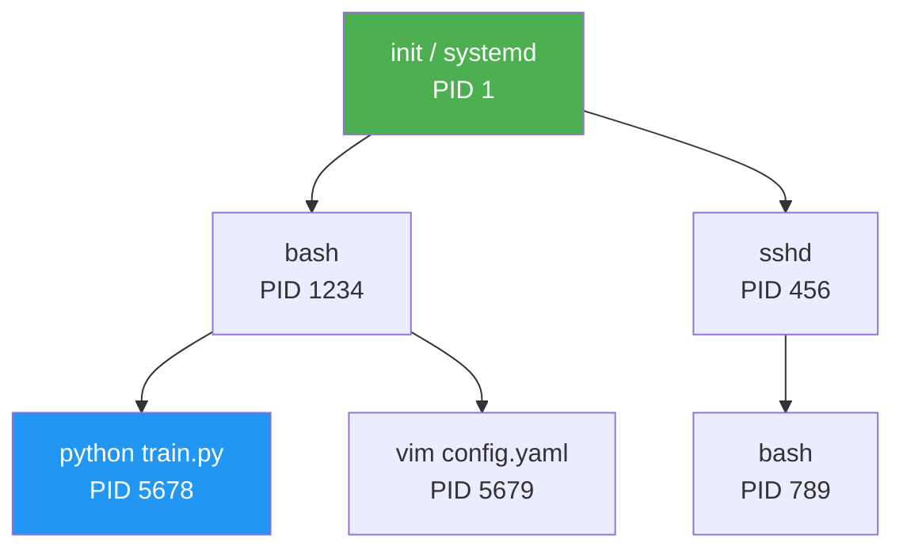

# 进程管理与监控

> **所属路径**：`01_基础能力/01_开发环境与技术英语/12_命令行/04_进程管理与监控`
> **预计学习时间**：50 分钟
> **难度等级**：⭐⭐

---

## 前置知识

- [环境变量与脚本](../03_环境变量与脚本/03_环境变量与脚本.md)（理解环境变量和基本脚本编写）

> 如果以上内容还不熟悉，建议先完成对应课程再继续。

---

## 学习目标

完成本节后，你将能够：

1. 理解进程的基本概念（PID、前台/后台、父子进程）
2. 使用 `ps`、`top`、`htop` 查看系统中运行的进程
3. 使用 `Ctrl+C`、`Ctrl+Z`、`bg`、`fg`、`kill` 控制进程
4. 使用 `nvidia-smi` 监控 GPU 使用情况
5. 使用 `nohup`、`&` 和 `cron` 管理后台任务和定时任务

---

## 正文讲解

### 1. 进程的基本概念

当你在终端中运行 `python train.py` 时，操作系统会创建一个 **进程（Process）** 。进程是程序的一个运行实例——同一个 `python` 程序可以同时运行多个进程，每个进程有自己独立的内存空间和资源。

每个进程都有一个唯一的 **进程 ID（PID）** ，就像每个人的身份证号码。操作系统通过 PID 来识别和管理进程。



> 📌 **图解说明**：进程之间存在父子关系。Shell（bash）是你输入命令后启动的程序的"父进程"。所有进程最终追溯到 PID 为 1 的初始进程。

### 2. 查看进程：ps 与 top

**`ps`——进程快照**

`ps` 显示当前时刻的进程状态，就像拍了一张照片：

```bash
# 查看当前 Shell 的进程
$ ps
  PID TTY          TIME CMD
 1234 pts/0    00:00:00 bash
 5678 pts/0    00:02:30 python

# 查看所有用户的所有进程（最常用的组合）
$ ps aux
USER       PID %CPU %MEM    VSZ   RSS TTY   STAT START   TIME COMMAND
alice     5678 95.0 45.2 8234567 4567890 pts/0 R 10:00  45:30 python train.py
alice     5679  0.1  0.5  123456  56789 pts/0 S 10:05   0:01 vim config.yaml
bob       6789 80.0 30.1 6543210 3456789 pts/1 R 09:30  60:15 python eval.py

# 只查看特定用户的进程
$ ps -u alice

# 查看进程树（显示父子关系）
$ ps auxf
# 或使用专门的命令
$ pstree -p
```

输出列的含义：

| 列名 | 含义 |
| ---- | ---- |
| `USER` | 进程所有者 |
| `PID` | 进程 ID |
| `%CPU` | CPU 使用率 |
| `%MEM` | 内存使用率 |
| `STAT` | 进程状态（R=运行, S=睡眠, Z=僵尸, T=停止） |
| `COMMAND` | 启动命令 |

**`top`——实时监控**

`top` 是动态的、实时更新的进程查看器：

```bash
$ top
```

在 `top` 界面中，常用快捷键：
- `q`：退出
- `P`：按 CPU 使用率排序
- `M`：按内存使用率排序
- `k`：输入 PID 终止进程
- `1`：显示每个 CPU 核心的使用情况

**`htop`——更好的 top**

`htop` 是 `top` 的增强版，提供彩色界面、鼠标支持和更直观的操作：

```bash
# 安装（如果未安装）
$ sudo apt install htop    # Ubuntu/Debian
$ brew install htop        # macOS

# 运行
$ htop
```

> 💡 **AI 开发实用技巧**：训练模型时，用 `htop` 监控 CPU 使用率可以判断数据加载是否成为瓶颈。如果 GPU 利用率低但 CPU 满载，说明数据加载太慢，需要增加 DataLoader 的 `num_workers` 。

### 3. 进程控制：前台、后台与信号

**前台与后台**

在终端中运行命令时，默认是 **前台（Foreground）** 运行——命令占据终端，你无法输入其他命令。可以把命令放到 **后台（Background）** 运行：

```bash
# 在命令末尾加 & 放到后台运行
$ python train.py &
[1] 5678     # [作业号] PID

# 查看后台任务
$ jobs
[1]+  Running    python train.py &

# 将后台任务切换到前台
$ fg %1

# 将正在运行的前台任务挂起并放到后台
# 先按 Ctrl+Z 暂停，然后用 bg 恢复后台运行
$ python train.py
^Z            # 按 Ctrl+Z
[1]+  Stopped    python train.py
$ bg %1
[1]+ python train.py &
```

**信号（Signal）**

信号是操作系统向进程发送的一种通知机制：

| 快捷键 / 命令 | 信号 | 作用 |
| -------------- | ---- | ---- |
| `Ctrl+C` | SIGINT (2) | 中断进程（程序可以捕获并清理） |
| `Ctrl+Z` | SIGTSTP (20) | 暂停进程（可用 `fg`/`bg` 恢复） |
| `kill PID` | SIGTERM (15) | 请求进程终止（程序可以捕获并优雅退出） |
| `kill -9 PID` | SIGKILL (9) | 强制终止进程（无法被捕获，立即杀死） |

```bash
# 终止指定 PID 的进程
$ kill 5678

# 强制终止（当 kill 无效时使用）
$ kill -9 5678

# 按名称查找并终止进程
$ ps aux | grep "train.py" | grep -v grep
alice     5678 95.0 45.2 ... python train.py
$ kill 5678
```

**`nohup`——不挂断运行**

当你通过 SSH 连接服务器并启动训练任务时，断开 SSH 连接会导致任务被终止。`nohup` 可以让任务在断开连接后继续运行：

```bash
# nohup 使任务不受挂断信号影响，& 放到后台
$ nohup python train.py > train.log 2>&1 &
[1] 5678

# 之后可以安全断开 SSH
# 重新连接后，用 ps 或日志查看训练状态
$ tail -f train.log
```

### 4. GPU 监控：nvidia-smi

对于 AI 开发者来说，GPU 监控是日常必需技能。`nvidia-smi` 是 NVIDIA 提供的 GPU 管理工具：

```bash
$ nvidia-smi
+-----------------------------------------------------------------------------+
| NVIDIA-SMI 535.86.01    Driver Version: 535.86.01    CUDA Version: 12.2     |
|-------------------------------+----------------------+----------------------+
| GPU  Name        Persistence-M| Bus-Id        Disp.A | Volatile Uncorr. ECC |
| Fan  Temp  Perf  Pwr:Usage/Cap|         Memory-Usage | GPU-Util  Compute M. |
|===============================+======================+======================|
|   0  NVIDIA A100-SXM4   On   | 00000000:07:00.0 Off |                    0 |
| N/A   45C    P0   150W / 400W |  32000MiB / 40960MiB |     85%      Default |
+-------------------------------+----------------------+----------------------+
|   1  NVIDIA A100-SXM4   On   | 00000000:0B:00.0 Off |                    0 |
| N/A   38C    P0    60W / 400W |   2048MiB / 40960MiB |      5%      Default |
+-------------------------------+----------------------+----------------------+
```

关键信息：
- **Memory-Usage**：显存使用量 / 总显存。如果接近上限，可能出现 OOM（Out of Memory）
- **GPU-Util**：GPU 计算利用率。训练时应该接近 100%，如果很低说明数据加载是瓶颈
- **Temp**：温度。持续超过 85°C 需要注意散热
- **Pwr**：功耗。接近上限说明 GPU 在满负荷运行

```bash
# 持续监控（每 1 秒刷新一次）
$ watch -n 1 nvidia-smi

# 只显示简要信息
$ nvidia-smi --query-gpu=index,name,temperature.gpu,utilization.gpu,memory.used,memory.total --format=csv
index, name, temperature.gpu, utilization.gpu [%], memory.used [MiB], memory.total [MiB]
0, NVIDIA A100-SXM4-40GB, 45, 85 %, 32000 MiB, 40960 MiB
1, NVIDIA A100-SXM4-40GB, 38, 5 %, 2048 MiB, 40960 MiB

# 查看哪些进程在使用 GPU
$ nvidia-smi --query-compute-apps=pid,process_name,used_memory --format=csv
```

### 5. 系统资源监控

除了 GPU，了解 CPU、内存和磁盘的状态也很重要：

```bash
# 查看内存使用情况
$ free -h
              total        used        free      shared  buff/cache   available
Mem:           62Gi        45Gi       2.1Gi       1.2Gi        15Gi        14Gi
Swap:          16Gi       0.5Gi        15Gi

# 持续监控某个命令的输出（每 2 秒刷新）
$ watch -n 2 free -h

# 查看 CPU 信息
$ lscpu | head -15
# 或者
$ nproc  # 显示 CPU 核心数
```

### 6. 任务自动化：cron 与 at

**`cron`——定时任务**

`cron` 是 Linux 的定时任务调度器，适合周期性执行的任务：

```bash
# 编辑当前用户的 cron 任务
$ crontab -e

# cron 表达式格式：
# 分  时  日  月  周  命令
# *   *   *   *   *   command
```

```
# cron 表达式示例
# 每天凌晨 2 点清理 7 天前的日志
0 2 * * * find /home/alice/logs -name "*.log" -mtime +7 -delete

# 每小时检查一次 GPU 温度并记录
0 * * * * nvidia-smi --query-gpu=temperature.gpu --format=csv,noheader >> /home/alice/gpu_temp.log

# 每周日 3 点备份模型
0 3 * * 0 tar -czf /backup/models_$(date +\%Y\%m\%d).tar.gz /home/alice/models/
```

```bash
# 查看当前的 cron 任务
$ crontab -l

# 删除所有 cron 任务
$ crontab -r
```

**`at`——一次性定时任务**

```bash
# 在今天 18:00 执行任务
$ at 18:00
at> python eval.py > eval_results.txt 2>&1
at> <Ctrl+D>

# 查看待执行的任务
$ atq

# 取消任务
$ atrm <job_number>
```

---

## 动手实践

```bash
# 1. 查看系统中所有 Python 进程
$ ps aux | grep python | grep -v grep

# 2. 后台运行一个模拟训练任务
$ nohup bash -c 'for i in $(seq 1 10); do echo "Epoch $i: loss=0.$((RANDOM % 100))"; sleep 2; done' > /tmp/mock_train.log 2>&1 &
echo "训练PID: $!"

# 3. 监控日志输出
$ tail -f /tmp/mock_train.log

# 4. 查看该进程的状态（按 Ctrl+C 退出 tail 后执行）
$ ps aux | grep mock_train

# 5. 清理
$ rm /tmp/mock_train.log
```

---

## 典型误区

| 误区 | 正确理解 |
| ---- | -------- |
| `kill` 一定能终止进程 | `kill`（SIGTERM）可以被程序捕获和忽略。只有 `kill -9`（SIGKILL）才是强制终止 |
| `Ctrl+C` 可以终止任何程序 | `Ctrl+C` 发送 SIGINT，程序可以选择捕获这个信号而不退出 |
| 关闭终端不影响后台进程 | 关闭终端会发送 SIGHUP，后台进程也会被终止。需要用 `nohup` 或 `disown` 防止 |
| GPU 显存占用等于 GPU 利用率 | 显存占用高不代表 GPU 在计算。GPU-Util 才反映实际计算负载 |

---

## 练习题

### 练习 1：进程查看（难度：⭐）

用一条命令找出系统中所有由 `alice` 用户运行的、CPU 使用率超过 50% 的进程，并只显示 PID、CPU 使用率和命令名。

<details>
<summary>💡 提示</summary>

使用 `ps aux` 配合 `awk` 筛选特定用户和 CPU 使用率。

</details>

<details>
<summary>✅ 参考答案</summary>

```bash
ps aux | awk '$1=="alice" && $3>50 {print $2, $3, $11}'
```

或者使用 `ps` 的格式化输出：
```bash
ps -u alice -o pid,%cpu,comm | awk '$2>50'
```

</details>

### 练习 2：后台训练（难度：⭐⭐）

你通过 SSH 连接到 GPU 服务器，需要启动一个训练脚本 `train.py` ，要求：
1. 训练在后台运行
2. 断开 SSH 后训练不会停止
3. 所有输出保存到 `train.log`

请写出完整的命令。

<details>
<summary>💡 提示</summary>

组合使用 `nohup`、重定向和 `&` 。

</details>

<details>
<summary>✅ 参考答案</summary>

```bash
nohup python train.py > train.log 2>&1 &
echo $!  # 记录 PID，方便后续查看或终止
```

重新连接后查看状态：
```bash
# 查看训练是否在运行
ps aux | grep train.py

# 查看最新日志
tail -f train.log
```

</details>

### 练习 3：GPU 监控脚本（难度：⭐⭐）

编写一个脚本，每 30 秒检查一次 GPU 显存使用率，如果超过 90% 就发出警告。

<details>
<summary>💡 提示</summary>

使用 `nvidia-smi` 查询显存，用 `while` 循环和 `sleep` 实现周期检查。

</details>

<details>
<summary>✅ 参考答案</summary>

```bash
#!/bin/bash
THRESHOLD=90

while true; do
    # 获取每个 GPU 的显存使用百分比
    nvidia-smi --query-gpu=index,memory.used,memory.total --format=csv,noheader,nounits | while IFS=', ' read -r idx used total; do
        usage=$((used * 100 / total))
        if [ "$usage" -gt "$THRESHOLD" ]; then
            echo "[WARNING] $(date): GPU $idx memory usage: ${usage}% ($used/$total MiB)"
        fi
    done
    sleep 30
done
```

</details>

---

## 下一步学习

- 📖 下一个知识点：[远程连接与文件传输](../05_远程连接与文件传输/05_远程连接与文件传输.md)
- 🔗 相关知识点：[并发编程](../../07_并发编程/)（Python 中的多进程编程）
- 📚 拓展阅读：[nvidia-smi 官方文档](https://developer.nvidia.com/nvidia-system-management-interface)（NVIDIA 官方文档）

---

## 参考资料

1. [The Linux Command Line - Chapter 10: Processes](https://linuxcommand.org/tlcl.php) — 进程管理的详细讲解（CC BY-NC-ND 许可）
2. [nvidia-smi 官方文档](https://developer.nvidia.com/nvidia-system-management-interface) — GPU 监控工具的权威参考（NVIDIA 官方文档）
3. [htop 官方网站](https://htop.dev/) — htop 交互式进程查看器（GPL 开源）
4. [Crontab Guru](https://crontab.guru/) — cron 表达式在线生成和解读工具（免费在线工具）
