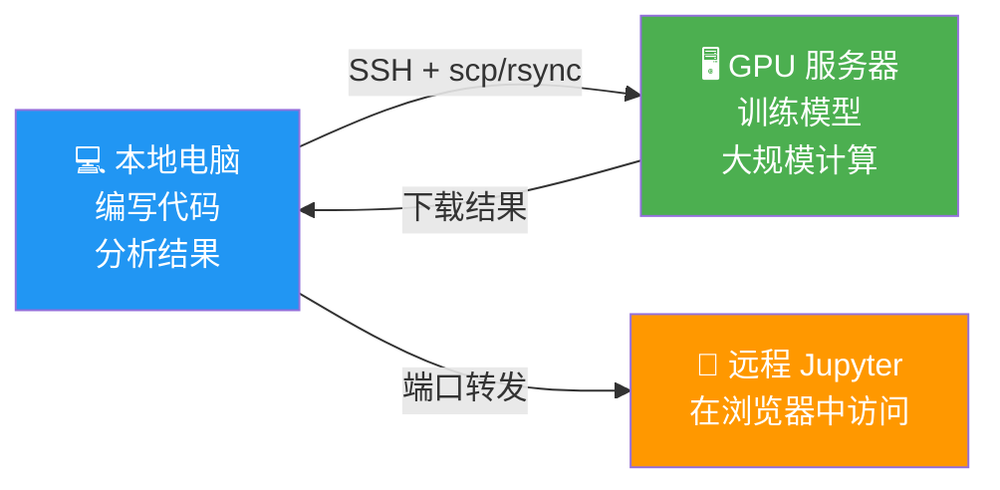
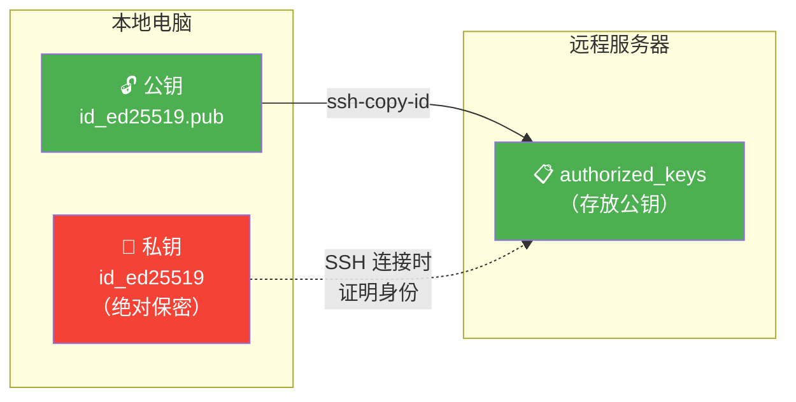

# 远程连接与文件传输

> **所属路径**：`01_基础能力/01_开发环境与技术英语/12_命令行/05_远程连接与文件传输`
> **预计学习时间**：60 分钟
> **难度等级**：⭐⭐⭐

---

## 前置知识

- [进程管理与监控](../04_进程管理与监控/04_进程管理与监控.md)（理解前台/后台进程和 nohup 的使用）
- [环境变量与脚本](../03_环境变量与脚本/03_环境变量与脚本.md)（了解 Shell 配置文件）

> 如果以上内容还不熟悉，建议先完成对应课程再继续。

---

## 学习目标

完成本节后，你将能够：

1. 使用 SSH 连接远程服务器并进行基本操作
2. 配置 SSH 密钥认证，免去每次输入密码的麻烦
3. 使用 SSH 配置文件简化连接命令
4. 使用端口转发访问远程服务（如 Jupyter Notebook）
5. 使用 `scp`、`rsync` 在本地和远程之间传输文件
6. 使用 `tmux` 管理长期运行的训练任务

---

## 正文讲解

### 1. 为什么需要远程操作？

在 AI 开发中，你的代码和实验几乎不可能只在本地笔记本电脑上运行。一个典型的工作场景是：你在本地编写代码，然后把代码和数据传输到装有强大 GPU 的远程服务器上进行训练，训练完成后再把结果拉回本地分析。



> 📌 **图解说明**：AI 开发的典型远程工作流。SSH 是连接本地和远程服务器的桥梁，scp/rsync 负责文件传输，端口转发让你在本地浏览器中访问远程服务。

**SSH（Secure Shell）** 是远程连接的标准协议。它通过加密通道在你的电脑和远程服务器之间建立安全连接，让你像在本地终端一样操作远程机器。

### 2. SSH 基础连接

**基本连接**

```bash
# 连接远程服务器
$ ssh username@server_ip
# 示例
$ ssh alice@192.168.1.100

# 指定端口（默认是 22）
$ ssh -p 2222 alice@192.168.1.100

# 连接后直接执行命令（不进入交互式 Shell）
$ ssh alice@192.168.1.100 "nvidia-smi"
$ ssh alice@192.168.1.100 "ls -la /data/models/"
```

**SSH 密钥认证**

每次 SSH 连接都输入密码非常烦人，而且密码可能被暴力破解。SSH 密钥认证既方便又安全：

```bash
# 第 1 步：在本地生成密钥对（如果还没有的话）
$ ssh-keygen -t ed25519 -C "alice@workstation"
# 按提示选择保存路径（默认 ~/.ssh/id_ed25519）和密码短语

# 第 2 步：将公钥复制到远程服务器
$ ssh-copy-id alice@192.168.1.100
# 或者手动复制：
$ cat ~/.ssh/id_ed25519.pub | ssh alice@192.168.1.100 "mkdir -p ~/.ssh && cat >> ~/.ssh/authorized_keys"

# 第 3 步：现在可以免密码连接了
$ ssh alice@192.168.1.100
```

密钥认证的原理：



> 📌 **图解说明**：SSH 密钥认证的工作流程。私钥留在本地（绝不外传），公钥放到服务器上。连接时，服务器用公钥验证你持有对应的私钥。

### 3. SSH 配置文件

当你经常连接多台服务器时，每次输入完整的 `ssh username@ip -p port` 非常繁琐。SSH 配置文件 `~/.ssh/config` 可以为每台服务器设置别名：

```bash
# 编辑 SSH 配置文件
$ nano ~/.ssh/config
```

```
# ~/.ssh/config 示例

# GPU 训练服务器
Host gpu-server
    HostName 192.168.1.100
    User alice
    Port 22
    IdentityFile ~/.ssh/id_ed25519

# 公司跳板机
Host jumpbox
    HostName jump.company.com
    User alice
    Port 2222

# 通过跳板机连接内网 GPU 服务器
Host gpu-internal
    HostName 10.0.0.50
    User alice
    ProxyJump jumpbox

# 保持连接不断开
Host *
    ServerAliveInterval 60
    ServerAliveCountMax 3
```

```bash
# 现在只需要输入别名就能连接
$ ssh gpu-server
$ ssh gpu-internal
```

### 4. SSH 端口转发

端口转发（Port Forwarding）是 SSH 最实用的高级功能之一。它让你可以通过 SSH 隧道安全地访问远程服务器上的服务。

**本地端口转发**——在本地访问远程服务：

```bash
# 场景：远程服务器上运行了 Jupyter Notebook（端口 8888）
# 你想在本地浏览器中访问它

# 将本地 8888 端口转发到远程的 8888 端口
$ ssh -L 8888:localhost:8888 alice@gpu-server

# 现在打开本地浏览器访问 http://localhost:8888 就能使用远程 Jupyter 了

# 转发 TensorBoard（端口 6006）
$ ssh -L 6006:localhost:6006 alice@gpu-server

# 后台运行端口转发（不打开交互式 Shell）
$ ssh -fNL 8888:localhost:8888 alice@gpu-server
```

**在 SSH 配置文件中设置自动转发**：

```
Host gpu-server
    HostName 192.168.1.100
    User alice
    LocalForward 8888 localhost:8888
    LocalForward 6006 localhost:6006
```

### 5. 文件传输工具

**`scp`——简单文件传输**

```bash
# 从本地复制文件到远程
$ scp train.py alice@gpu-server:/home/alice/project/

# 从远程复制文件到本地
$ scp alice@gpu-server:/home/alice/results/metrics.json ./

# 复制整个目录（-r 递归）
$ scp -r ./data alice@gpu-server:/home/alice/project/

# 使用 SSH 配置的别名
$ scp train.py gpu-server:~/project/
```

**`rsync`——智能同步（推荐）**

`rsync` 是比 `scp` 更强大的文件传输工具，它只传输发生变化的部分（增量传输），在传输大量数据时效率极高：

```bash
# 同步本地目录到远程（-a 保留属性，-v 显示详情，-z 压缩传输）
$ rsync -avz ./src/ gpu-server:~/project/src/

# 从远程同步到本地
$ rsync -avz gpu-server:~/project/results/ ./results/

# 显示传输进度
$ rsync -avz --progress ./data/ gpu-server:~/data/

# 排除不需要传输的文件
$ rsync -avz --exclude='*.pyc' --exclude='__pycache__' --exclude='.git' \
    ./project/ gpu-server:~/project/

# 使用 --delete 让远程目录与本地完全一致（删除远程多出的文件）
$ rsync -avz --delete ./project/ gpu-server:~/project/

# 模拟运行（-n），先查看会传输哪些文件
$ rsync -avzn ./project/ gpu-server:~/project/
```

> 💡 **最佳实践**：在 AI 项目中，优先使用 `rsync` 而非 `scp` 。特别是同步代码目录时，`rsync` 只传输修改过的文件，比 `scp` 快得多。

**`sftp`——交互式文件传输**

```bash
# 连接远程服务器的 SFTP
$ sftp gpu-server
sftp> ls                    # 列出远程目录
sftp> cd project            # 切换远程目录
sftp> lcd ./local_dir       # 切换本地目录
sftp> get results.csv       # 下载文件
sftp> put train.py          # 上传文件
sftp> bye                   # 退出
```

### 6. 终端复用：tmux

在远程服务器上训练模型时，最大的烦恼是：SSH 连接断开后，训练任务也随之终止。虽然 `nohup` 可以解决这个问题，但你无法重新"接管"一个 nohup 启动的任务来查看实时输出。

**tmux（Terminal Multiplexer）** 是终端复用器，它完美解决了这个问题。tmux 在服务器上运行一个持久的会话，即使 SSH 断开，会话中的程序也继续运行。你可以随时重新连接并恢复会话。

```bash
# 安装（如果未安装）
$ sudo apt install tmux    # Ubuntu/Debian
$ brew install tmux        # macOS
```

**基本使用**

```bash
# 创建一个新的命名会话
$ tmux new -s training

# 在 tmux 会话中启动训练
$ python train.py

# 按 Ctrl+B 然后按 D 来分离（detach）会话
# （训练继续在后台运行）

# 查看所有会话
$ tmux ls
training: 1 windows (created Tue Apr 10 10:00:00 2024)

# 重新连接到会话
$ tmux attach -t training
# 或简写
$ tmux a -t training
```

**tmux 常用快捷键**（先按 `Ctrl+B` 松开，然后按功能键）：

| 快捷键 | 功能 |
| ------ | ---- |
| `Ctrl+B` → `D` | 分离当前会话 |
| `Ctrl+B` → `C` | 创建新窗口 |
| `Ctrl+B` → `N` | 切换到下一个窗口 |
| `Ctrl+B` → `P` | 切换到上一个窗口 |
| `Ctrl+B` → `%` | 水平分割面板 |
| `Ctrl+B` → `"` | 垂直分割面板 |
| `Ctrl+B` → 方向键 | 在面板间切换 |
| `Ctrl+B` → `[` | 进入滚动模式（可用方向键和 PgUp/PgDn 翻看历史输出，按 `Q` 退出） |

**tmux 在 AI 训练中的典型工作流**

```bash
# 1. 连接服务器并创建 tmux 会话
$ ssh gpu-server
$ tmux new -s exp001

# 2. 分割窗口：一边训练，一边监控 GPU
# 按 Ctrl+B 然后 %（水平分割）
# 左边面板：运行训练
$ python train.py --epochs 100

# 按 Ctrl+B 然后 → 切换到右边面板
# 右边面板：监控 GPU
$ watch -n 1 nvidia-smi

# 3. 分离会话（按 Ctrl+B 然后 D），安全断开 SSH
$ exit

# 4. 第二天重新连接，恢复会话
$ ssh gpu-server
$ tmux a -t exp001
# 训练还在运行！可以看到最新的输出
```

---

## 动手实践

> **注意**：以下练习需要一台远程 Linux 服务器。如果没有，可以用本地机器模拟（`ssh localhost`），或跳过实际连接只学习命令格式。

```bash
# 1. 生成 SSH 密钥（如果还没有）
$ ls ~/.ssh/id_ed25519 2>/dev/null || ssh-keygen -t ed25519

# 2. 创建 SSH 配置文件
$ cat > ~/.ssh/config << 'EOF'
Host *
    ServerAliveInterval 60
    ServerAliveCountMax 3
EOF
$ chmod 600 ~/.ssh/config

# 3. 练习 rsync（本地到本地模拟）
$ mkdir -p /tmp/rsync_test/{src,dst}
$ echo "hello" > /tmp/rsync_test/src/file1.txt
$ echo "world" > /tmp/rsync_test/src/file2.txt
$ rsync -avz /tmp/rsync_test/src/ /tmp/rsync_test/dst/
$ ls /tmp/rsync_test/dst/

# 4. 练习 tmux
$ tmux new -s test
# 在 tmux 中运行一个命令
$ echo "I'm in tmux!" && sleep 5 && echo "Done!"
# 按 Ctrl+B 然后 D 分离
$ tmux ls
$ tmux a -t test
# 按 Ctrl+D 关闭会话

# 5. 清理
$ rm -rf /tmp/rsync_test
```

---

## 典型误区

| 误区 | 正确理解 |
| ---- | -------- |
| SSH 密码认证足够安全 | 密码可能被暴力破解。密钥认证更安全，生产环境应禁用密码登录 |
| `scp` 和 `rsync` 功能一样 | `rsync` 支持增量传输、断点续传和文件排除，效率远高于 `scp` |
| 关闭 SSH 窗口等于退出 SSH | 关闭窗口会发送 SIGHUP 信号终止远程进程。应使用 `tmux` 或 `nohup` 保护长期任务 |
| 端口转发很复杂 | 记住一个模式就够了：`ssh -L 本地端口:localhost:远程端口 服务器`，用于在本地访问远程服务 |

---

## 练习题

### 练习 1：SSH 配置（难度：⭐）

为以下信息编写 SSH 配置文件条目：
- 服务器 IP：10.0.1.50
- 用户名：ml_user
- 端口：22
- 要自动转发 Jupyter（8888）和 TensorBoard（6006）

<details>
<summary>💡 提示</summary>

在 `~/.ssh/config` 中使用 `Host`、`HostName`、`User`、`Port` 和 `LocalForward` 指令。

</details>

<details>
<summary>✅ 参考答案</summary>

```
Host ml-server
    HostName 10.0.1.50
    User ml_user
    Port 22
    LocalForward 8888 localhost:8888
    LocalForward 6006 localhost:6006
    ServerAliveInterval 60
```

使用：`ssh ml-server` 即可连接并自动转发端口。

</details>

### 练习 2：文件同步（难度：⭐⭐）

你需要将本地 `project/` 目录同步到远程服务器 `gpu-server:~/project/`，但要排除以下内容：
- `__pycache__` 目录
- `.git` 目录
- 所有 `.pyc` 文件
- `data/` 目录（太大了，另外传输）

请写出 `rsync` 命令。

<details>
<summary>💡 提示</summary>

使用 `--exclude` 选项可以排除特定的文件或目录模式。

</details>

<details>
<summary>✅ 参考答案</summary>

```bash
rsync -avz --progress \
    --exclude='__pycache__' \
    --exclude='.git' \
    --exclude='*.pyc' \
    --exclude='data/' \
    ./project/ gpu-server:~/project/
```

也可以把排除规则写在文件中：
```bash
# .rsyncignore 文件
__pycache__
.git
*.pyc
data/

# 使用 --exclude-from
rsync -avz --progress --exclude-from='.rsyncignore' ./project/ gpu-server:~/project/
```

</details>

### 练习 3：tmux 工作流（难度：⭐⭐）

描述如何用 tmux 实现以下工作流：
1. 创建一个名为 `experiment` 的 tmux 会话
2. 分割成左右两个面板
3. 左边面板运行训练脚本
4. 右边面板用 `watch nvidia-smi` 监控 GPU
5. 安全地断开 SSH 连接
6. 第二天重新连接并查看训练进度

<details>
<summary>💡 提示</summary>

使用 `tmux new -s` 创建会话，`Ctrl+B %` 分割面板，`Ctrl+B D` 分离会话，`tmux a -t` 重新连接。

</details>

<details>
<summary>✅ 参考答案</summary>

```bash
# 1. 创建命名会话
tmux new -s experiment

# 2. 分割面板：按 Ctrl+B 然后 %

# 3. 在左侧面板运行训练
python train.py --epochs 100

# 4. 切换到右侧面板（Ctrl+B 然后 →）
watch -n 1 nvidia-smi

# 5. 分离会话：按 Ctrl+B 然后 D
# 然后安全退出 SSH
exit

# 6. 第二天重新连接
ssh gpu-server
tmux a -t experiment
# 可以看到训练仍在运行，GPU 监控仍在刷新
```

</details>

---

## 下一步学习

- 📖 下一个知识点：[环境隔离原理](../../13_虚拟环境/01_环境隔离原理/01_环境隔离原理.md)
- 🔗 相关知识点：[版本控制](../../15_版本控制/)（用 Git 管理远程代码仓库）
- 📚 拓展阅读：[SSH 权威指南](https://www.ssh.com/academy/ssh) — SSH Academy 在线教程（公开免费资源）

---

## 参考资料

1. [OpenSSH 官方文档](https://www.openssh.com/manual.html) — SSH 客户端和服务器的权威参考（BSD 许可）
2. [rsync 官方文档](https://rsync.samba.org/documentation.html) — rsync 的完整使用指南（GPL 开源）
3. [tmux Wiki](https://github.com/tmux/tmux/wiki) — tmux 终端复用器的使用教程（GitHub 公开 Wiki）
4. [SSH Academy](https://www.ssh.com/academy/ssh) — SSH 技术的全面介绍，包含最佳安全实践（公开免费资源）
