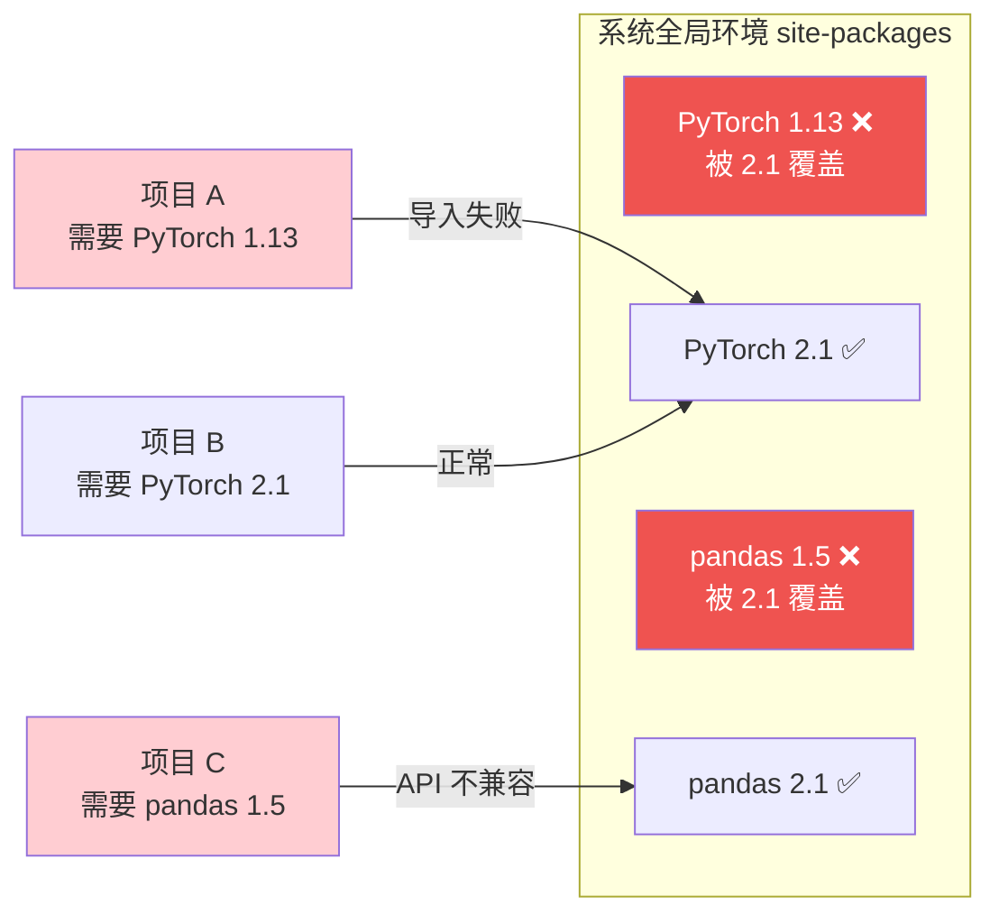
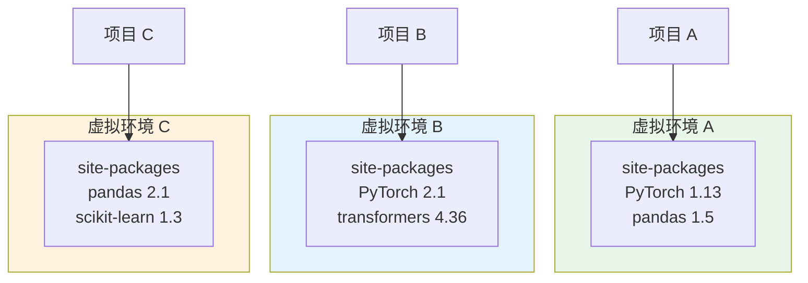
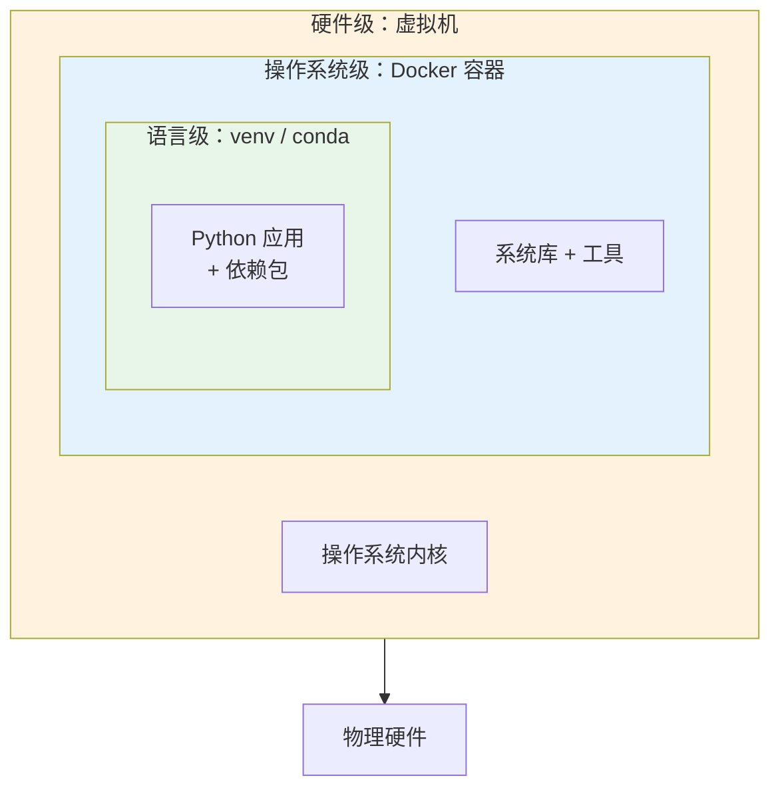

# 环境隔离原理

> **所属路径**：`01_基础能力/01_开发环境与技术英语/13_虚拟环境/01_环境隔离原理`
> **预计学习时间**：35 分钟
> **难度等级**：⭐

---

## 前置知识

- [环境变量与脚本](../../12_命令行/03_环境变量与脚本/03_环境变量与脚本.md)（了解 PATH 环境变量的作用）
- [函数与模块](../../01_编程语言基础/03_函数与模块/)（了解 Python 的 `import` 机制和模块搜索路径）

> 如果以上内容还不熟悉，建议先完成对应课程再继续。

---

## 学习目标

完成本节后，你将能够：

1. 解释 Python 全局环境下依赖冲突的成因
2. 描述 `site-packages` 目录和 `sys.path` 在包导入中的作用
3. 说明虚拟环境通过目录隔离和 PATH 操控实现环境独立的原理
4. 区分语言级、操作系统级和硬件级三种环境隔离方式的适用场景

---

## 正文讲解

### 1. 一个真实的噩梦：依赖冲突

想象这样一个场景：你是一名 AI 工程师，手头同时维护三个项目。

第一个项目是半年前上线的图像分类服务，它依赖 PyTorch 1.13 和 torchvision 0.14，运行在 CUDA 11.7 上，一切稳定。第二个项目是你正在开发的大语言模型微调实验，需要 PyTorch 2.1 和最新版的 Transformers 库，而 Transformers 4.36 要求 `tokenizers>=0.14` ，它依赖的 Rust 编译产物与旧版 PyTorch 不兼容。第三个项目是同事交接给你的数据分析脚本，它使用 `pandas==1.5.3` ，而你的系统上已经安装了 `pandas==2.1.0` ，两个版本的 API 有破坏性变更。

如果这三个项目共享同一个 Python 环境，会发生什么？

你为第二个项目安装 PyTorch 2.1，`pip` 会自动卸载 PyTorch 1.13——第一个项目立刻崩溃。你降级 pandas 到 1.5.3，自己的其他脚本又开始报错。你陷入了一个"按下葫芦浮起瓢"的死循环。这就是 **依赖冲突（Dependency Conflict）** ，也是每位 Python 开发者或早或晚都会遇到的噩梦。



> 📌 **图解说明**：当多个项目共享同一个全局环境时，同一个包只能存在一个版本。安装新版本会覆盖旧版本，导致依赖旧版本的项目无法正常运行。

### 2. Python 的包安装机制

要理解虚拟环境为什么能解决依赖冲突，我们需要先了解 Python 是怎样查找和加载包的。

**`site-packages` 目录**

当你使用 `pip install numpy` 安装一个包时，它会被放到一个叫 `site-packages` 的目录中：

```bash
# 查看 site-packages 的位置
$ python -c "import site; print(site.getsitepackages())"
['/usr/lib/python3.10/site-packages']

# 查看某个已安装包的位置
$ python -c "import numpy; print(numpy.__file__)"
/usr/lib/python3.10/site-packages/numpy/__init__.py
```

**`sys.path` ——模块搜索路径**

当你在 Python 中写 `import numpy` 时，Python 会按照 `sys.path` 列表中的目录**从前到后**逐个搜索，找到第一个匹配的模块就加载它：

```python
import sys
for p in sys.path:
    print(p)
# 输出示例：
# /home/alice/project        ← 当前目录
# /usr/lib/python3.10        ← 标准库
# /usr/lib/python3.10/site-packages  ← 第三方包
```

**关键洞察**：如果我们能让不同的项目使用不同的 `site-packages` 目录，那每个项目就可以安装不同版本的包，互不干扰。这正是虚拟环境的核心思路。

### 3. 虚拟环境的工作原理

**虚拟环境（Virtual Environment）** 的本质非常简单：它在一个独立的目录中创建一套 Python 环境的"骨架"，包含：

1. 一个指向系统 Python 解释器的符号链接（或副本）
2. 一个独立的 `site-packages` 目录
3. 一组修改 PATH 的激活脚本

```bash
# 创建虚拟环境后的目录结构
my_env/
├── bin/                     # (Linux/macOS) 或 Scripts/ (Windows)
│   ├── python → /usr/bin/python3.10  # 符号链接到系统 Python
│   ├── pip                  # 独立的 pip
│   └── activate             # 激活脚本
├── lib/
│   └── python3.10/
│       └── site-packages/   # ← 独立的包安装目录！
└── pyvenv.cfg               # 环境配置文件
```

当你 **激活（activate）** 虚拟环境时，激活脚本做了两件关键的事：

1. **修改 PATH** ：把虚拟环境的 `bin/` 目录放到 PATH 最前面，这样输入 `python` 和 `pip` 时会优先使用虚拟环境中的版本
2. **修改命令行提示符** ：在提示符前加上环境名称（如 `(my_env)` ），提醒你当前在哪个环境中

```bash
# 激活前
$ which python
/usr/bin/python
$ echo $PATH
/usr/local/bin:/usr/bin:/bin

# 激活后
$ source my_env/bin/activate
(my_env) $ which python
/home/alice/my_env/bin/python
(my_env) $ echo $PATH
/home/alice/my_env/bin:/usr/local/bin:/usr/bin:/bin
```



> 📌 **图解说明**：每个虚拟环境有自己独立的 `site-packages` ，不同项目可以安装不同版本的依赖，互不干扰。

### 4. 环境隔离的层级

虚拟环境解决了 Python 包的依赖冲突，但它不能隔离系统级别的依赖（如 CUDA 驱动、C 语言库、操作系统差异）。根据隔离的彻底程度，环境隔离技术分为三个层级：

| 层级 | 技术 | 隔离范围 | 开销 | 适用场景 |
| ---- | ---- | -------- | ---- | -------- |
| 语言级 | venv、conda | Python 包 | 极低 | 日常开发、快速实验 |
| 操作系统级 | Docker | 整个用户空间（包+系统库+配置） | 低 | 部署、CI/CD、跨平台 |
| 硬件级 | 虚拟机（VM） | 整个操作系统（含内核） | 高 | 完全隔离、安全要求高 |



> 📌 **图解说明**：三种环境隔离技术形成了从内到外的嵌套关系。越外层的隔离越彻底，但资源开销也越大。日常 AI 开发中，venv/conda 已能满足大多数需求；需要跨环境部署时使用 Docker；虚拟机用于特殊的安全隔离场景。

对于大多数 AI 开发者来说：
- **日常实验**：使用 `venv` 或 `conda` 即可
- **团队协作和部署**：加上 Docker 确保环境一致
- **虚拟机**：通常不需要自己管理，云服务商已经帮你处理好了

---

## 动手实践

让我们亲手验证虚拟环境的隔离机制：

```bash
# 1. 查看当前系统 Python 的 site-packages
$ python3 -c "import site; print(site.getsitepackages())"

# 2. 创建一个虚拟环境
$ python3 -m venv /tmp/test_env

# 3. 查看虚拟环境的目录结构
$ ls /tmp/test_env/
$ ls /tmp/test_env/bin/   # Linux/macOS
$ ls /tmp/test_env/lib/python*/site-packages/

# 4. 激活虚拟环境
$ source /tmp/test_env/bin/activate

# 5. 对比激活前后的 PATH 和 python 路径
(test_env) $ which python
(test_env) $ python -c "import sys; print(sys.path)"

# 6. 安装一个包，验证它只存在于虚拟环境中
(test_env) $ pip install cowsay
(test_env) $ python -c "import cowsay; cowsay.cow('Hello!')"

# 7. 退出虚拟环境
(test_env) $ deactivate

# 8. 验证系统环境中没有这个包
$ python3 -c "import cowsay"  # 应该报 ModuleNotFoundError

# 9. 清理
$ rm -rf /tmp/test_env
```

---

## 典型误区

| 误区 | 正确理解 |
| ---- | -------- |
| 虚拟环境会复制一份完整的 Python 解释器 | 大多数情况下，虚拟环境只创建到系统 Python 的符号链接，非常轻量 |
| 虚拟环境可以隔离 CUDA 驱动版本 | venv 只隔离 Python 包。CUDA 驱动等系统级依赖需要 Docker 或 conda 来管理 |
| 创建虚拟环境后就不需要系统 Python 了 | 虚拟环境依赖系统 Python。如果系统 Python 被删除或升级，虚拟环境可能会损坏 |
| 虚拟环境目录可以随意移动 | 虚拟环境中包含硬编码的路径。移动目录后环境会失效，需要重新创建 |

---

## 练习题

### 练习 1：概念理解（难度：⭐）

请解释以下两条命令在依赖安装上的区别：

```bash
# 命令 A（未激活任何虚拟环境）
$ pip install numpy==1.24.0

# 命令 B（激活了虚拟环境 my_env 后）
(my_env) $ pip install numpy==1.24.0
```

<details>
<summary>💡 提示</summary>

思考两条命令使用的 `pip` 来自哪里，以及 numpy 会安装到哪个 `site-packages` 目录。

</details>

<details>
<summary>✅ 参考答案</summary>

命令 A 使用的是系统 Python 的 `pip` ，numpy 1.24.0 会安装到系统的 `site-packages` 目录，影响所有项目。

命令 B 使用的是虚拟环境 `my_env` 中的 `pip` ，numpy 1.24.0 只安装到 `my_env/lib/pythonX.Y/site-packages/` 中，不影响系统环境和其他虚拟环境。

</details>

### 练习 2：隔离层级选择（难度：⭐⭐）

对于以下三个场景，分别建议使用哪种隔离技术（venv/conda、Docker、虚拟机）？请说明理由。

1. 你需要同时开发两个项目，一个用 scikit-learn 0.24，另一个用 scikit-learn 1.3
2. 你的模型部署需要 CUDA 11.8 + cuDNN 8.6 的精确版本组合
3. 你想在本地 macOS 上复现同事在 Ubuntu 22.04 上的训练结果

<details>
<summary>💡 提示</summary>

根据需要隔离的层级来选择：纯 Python 包 → venv/conda；系统库和工具 → Docker；操作系统 → Docker 或虚拟机。

</details>

<details>
<summary>✅ 参考答案</summary>

1. **venv 或 conda** ：scikit-learn 是纯 Python 包，用虚拟环境就能隔离不同版本。
2. **Docker（推荐）或 conda** ：CUDA 和 cuDNN 是系统级依赖，Docker 可以精确控制这些版本。conda 也能在一定程度上管理 CUDA 工具包，但不如 Docker 彻底。
3. **Docker** ：跨操作系统复现需要 OS 级隔离。使用 Docker 可以在 macOS 上运行与 Ubuntu 完全相同的环境（Docker 底层通过 Linux 虚拟机实现）。

</details>

---

## 下一步学习

- 📖 下一个知识点：[创建与激活](../02_创建与激活/02_创建与激活.md)
- 🔗 相关知识点：[Docker基础](../04_Docker基础/04_Docker基础.md)（操作系统级隔离的详细讲解）

---

## 参考资料

1. [Python 官方文档 - venv](https://docs.python.org/3/library/venv.html) — 虚拟环境模块的权威参考（Python 官方文档）
2. [Python 官方文档 - sys.path](https://docs.python.org/3/library/sys.html#sys.path) — 模块搜索路径的详细说明（Python 官方文档）
3. [Real Python - Virtual Environments Primer](https://realpython.com/python-virtual-environments-a-primer/) — 虚拟环境入门教程（公开免费教程）
