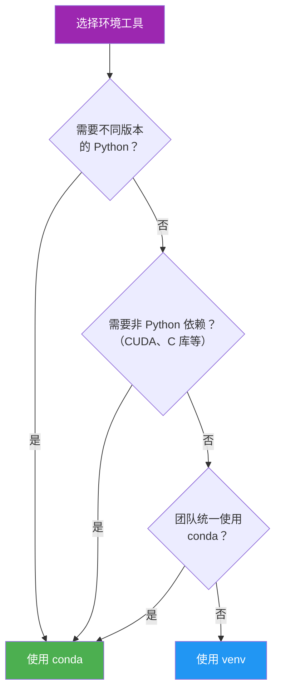

# 创建与激活

> **所属路径**：`01_基础能力/01_开发环境与技术英语/13_虚拟环境/02_创建与激活`
> **预计学习时间**：35 分钟
> **难度等级**：⭐

---

## 前置知识

- [环境隔离原理](../01_环境隔离原理/01_环境隔离原理.md)（理解虚拟环境的工作原理和 PATH 操控机制）

> 如果以上内容还不熟悉，建议先完成对应课程再继续。

---

## 学习目标

完成本节后，你将能够：

1. 使用 `venv` 创建、激活和删除虚拟环境
2. 使用 `conda` 创建和管理虚拟环境
3. 根据项目需求选择 `venv` 或 `conda`
4. 养成良好的虚拟环境命名和管理习惯

---

## 正文讲解

### 1. venv：Python 内置的轻量级方案

`venv` 是 Python 3.3+ 内置的虚拟环境模块，无需额外安装，是最简单直接的环境隔离工具。

**创建虚拟环境**

```bash
# 基本语法
$ python3 -m venv 环境目录名

# 在项目目录中创建（最常见的做法）
$ cd my_project
$ python3 -m venv .venv

# 指定 Python 版本（如果系统中安装了多个版本）
$ python3.11 -m venv .venv
```

> 💡 **命名惯例**：推荐使用 `.venv` 作为环境目录名。以 `.` 开头使它成为隐藏目录，不会干扰项目文件的浏览。大多数 `.gitignore` 模板已包含 `.venv` 的忽略规则。

**激活虚拟环境**

激活命令因操作系统和 Shell 而异：

| 操作系统 | Shell | 激活命令 |
| -------- | ----- | -------- |
| Linux / macOS | bash / zsh | `source .venv/bin/activate` |
| Linux / macOS | fish | `source .venv/bin/activate.fish` |
| Windows | cmd | `.venv\Scripts\activate.bat` |
| Windows | PowerShell | `.venv\Scripts\Activate.ps1` |

```bash
# 激活后，提示符会显示环境名
$ source .venv/bin/activate
(.venv) $

# 验证激活成功
(.venv) $ which python
/home/alice/my_project/.venv/bin/python

(.venv) $ which pip
/home/alice/my_project/.venv/bin/pip

# 在虚拟环境中安装包
(.venv) $ pip install numpy pandas torch
```

**退出虚拟环境**

```bash
(.venv) $ deactivate
$  # 提示符恢复正常
```

**删除虚拟环境**

虚拟环境只是一个普通目录，删除就是直接删除目录：

```bash
$ rm -rf .venv
```

### 2. conda：更强大的全能方案

**conda** 是 Anaconda/Miniconda 提供的环境管理工具。与 `venv` 不同，conda 不仅能管理 Python 包，还能管理非 Python 依赖（如 CUDA 工具包、C 语言库、R 语言环境等），并且可以自由切换不同版本的 Python。

```bash
# 安装 Miniconda（如果未安装）
# 从 https://docs.conda.io/en/latest/miniconda.html 下载安装脚本
$ bash Miniconda3-latest-Linux-x86_64.sh
```

**创建环境**

```bash
# 创建环境并指定 Python 版本
$ conda create -n my_project python=3.10

# 创建环境并同时安装包
$ conda create -n ml_env python=3.10 numpy pandas scikit-learn

# 创建环境并安装 PyTorch（含 CUDA 支持）
$ conda create -n torch_env python=3.10
$ conda activate torch_env
$ conda install pytorch torchvision torchaudio pytorch-cuda=12.1 -c pytorch -c nvidia
```

**激活与切换环境**

```bash
# 激活环境
$ conda activate my_project
(my_project) $

# 查看当前环境信息
(my_project) $ conda info

# 切换到另一个环境
(my_project) $ conda activate another_env
(another_env) $

# 返回 base 环境
(another_env) $ conda deactivate
(base) $
```

**管理环境**

```bash
# 列出所有环境
$ conda env list
# conda environments:
#
base                  *  /home/alice/miniconda3
my_project               /home/alice/miniconda3/envs/my_project
torch_env                /home/alice/miniconda3/envs/torch_env

# 删除环境
$ conda env remove -n my_project

# 克隆环境（基于现有环境创建副本）
$ conda create -n my_project_v2 --clone my_project
```

### 3. venv vs conda：如何选择？



> 📌 **图解说明**：选择 venv 还是 conda 的决策树。venv 适合纯 Python 项目的轻量级隔离，conda 适合需要管理非 Python 依赖或多版本 Python 的复杂场景。

两种工具的详细对比：

| 特性 | venv | conda |
| ---- | ---- | ----- |
| 安装方式 | Python 内置，无需安装 | 需要安装 Miniconda/Anaconda |
| Python 版本管理 | 不支持（使用系统已安装的 Python） | 支持，可自由切换 Python 版本 |
| 非 Python 包管理 | 不支持 | 支持（CUDA、cuDNN、gcc 等） |
| 环境存储位置 | 项目目录内（如 `.venv/`） | 集中存储（`~/miniconda3/envs/`） |
| 磁盘占用 | 非常小（几 MB 起） | 较大（conda 自身 + 包缓存） |
| 创建速度 | 非常快（秒级） | 较慢（需要下载和解析依赖） |
| 包源 | PyPI（pip） | conda-forge + PyPI |
| 适用场景 | 纯 Python 项目、轻量级实验 | AI/ML 项目、跨语言项目 |

> 💡 **实际建议**：在 AI 开发中，很多团队会选择 **conda 管理环境 + pip 安装 Python 包** 的混合方式——用 conda 创建包含特定 Python 版本和 CUDA 的基础环境，然后在环境中用 `pip install` 安装其余的 Python 包。

### 4. 环境管理最佳实践

**命名规范**

```bash
# 好的命名：描述性强
$ conda create -n image_cls_torch2 python=3.10
$ python3 -m venv .venv

# 不好的命名：含义不清
$ conda create -n test python=3.10
$ conda create -n env1 python=3.10
```

**项目配套的环境工作流**

```bash
# 一个 AI 项目的标准起步流程
$ mkdir my_ml_project && cd my_ml_project
$ git init

# 选项 A：使用 venv
$ python3 -m venv .venv
$ source .venv/bin/activate
$ echo ".venv/" >> .gitignore

# 选项 B：使用 conda
$ conda create -n my_ml_project python=3.10
$ conda activate my_ml_project

# 安装依赖并固定版本（下一课详讲）
$ pip install torch numpy pandas
$ pip freeze > requirements.txt
```

**避免在全局环境中安装包**

```bash
# ❌ 不推荐：直接安装到系统 Python
$ pip install torch

# ✅ 推荐：先创建虚拟环境再安装
$ python3 -m venv .venv && source .venv/bin/activate
(.venv) $ pip install torch
```

---

## 动手实践

```bash
# 1. 创建一个 venv 虚拟环境
$ mkdir /tmp/venv_practice && cd /tmp/venv_practice
$ python3 -m venv .venv
$ source .venv/bin/activate

# 2. 安装一个包并验证隔离性
(.venv) $ pip install cowsay
(.venv) $ python -c "import cowsay; cowsay.cow('venv works!')"

# 3. 查看安装的包
(.venv) $ pip list

# 4. 退出并验证隔离
(.venv) $ deactivate
$ python3 -c "import cowsay" 2>&1 | head -1
# 应该报错：ModuleNotFoundError

# 5. 清理
$ rm -rf /tmp/venv_practice
```

如果安装了 conda，还可以练习：

```bash
# 1. 创建 conda 环境
$ conda create -n practice_env python=3.10 -y

# 2. 激活并安装包
$ conda activate practice_env
(practice_env) $ pip install cowsay
(practice_env) $ python -c "import cowsay; cowsay.cow('conda works!')"

# 3. 查看环境列表
$ conda env list

# 4. 清理
$ conda deactivate
$ conda env remove -n practice_env
```

---

## 典型误区

| 误区 | 正确理解 |
| ---- | -------- |
| 创建虚拟环境后忘记激活就安装包 | 未激活虚拟环境时，`pip install` 会安装到系统环境中。始终先激活再安装 |
| 在 conda 环境中混用 `conda install` 和 `pip install` 时不注意顺序 | 建议先用 `conda install` 安装能找到的包，再用 `pip install` 补充。反过来可能导致依赖冲突 |
| 把虚拟环境目录（`.venv/`）提交到 Git | 虚拟环境目录应该加入 `.gitignore` 。分享环境应通过 `requirements.txt` 或 `environment.yml` |
| 每个小实验都创建新环境 | 对于临时测试，可以复用一个通用环境。只有正式项目才需要独立环境 |

---

## 练习题

### 练习 1：创建与使用 venv（难度：⭐）

为一个新的数据分析项目创建虚拟环境，安装 pandas 和 matplotlib，然后验证它们只在虚拟环境中可用。

<details>
<summary>💡 提示</summary>

使用 `python3 -m venv` 创建，`source` 激活，`pip install` 安装，`deactivate` 退出后验证。

</details>

<details>
<summary>✅ 参考答案</summary>

```bash
# 创建项目和环境
mkdir /tmp/data_analysis && cd /tmp/data_analysis
python3 -m venv .venv
source .venv/bin/activate

# 安装包
pip install pandas matplotlib

# 验证
python -c "import pandas; print(pandas.__version__)"
python -c "import matplotlib; print(matplotlib.__version__)"

# 退出并验证隔离
deactivate
python3 -c "import pandas" 2>&1 | head -1
# ModuleNotFoundError（如果系统没有安装 pandas）

# 清理
rm -rf /tmp/data_analysis
```

</details>

### 练习 2：选择合适的工具（难度：⭐⭐）

对以下三个场景，分别选择 venv 还是 conda，并说明理由：

1. 一个纯 Python 的 Web API 项目，只用到 Flask 和 SQLAlchemy
2. 一个需要 PyTorch + CUDA 11.8 + cuDNN 8.6 的深度学习项目
3. 一个使用 Python 3.8 的遗留项目（你的系统只安装了 Python 3.11）

<details>
<summary>💡 提示</summary>

考虑是否需要管理 Python 版本和非 Python 依赖。

</details>

<details>
<summary>✅ 参考答案</summary>

1. **venv** ：纯 Python 包，不需要管理 Python 版本或系统依赖。venv 更轻量、更快。

2. **conda** ：需要安装 CUDA 工具包和 cuDNN 这些非 Python 依赖。conda 可以在不影响系统 CUDA 的情况下安装特定版本。
   ```bash
   conda create -n dl_env python=3.10
   conda activate dl_env
   conda install pytorch pytorch-cuda=11.8 -c pytorch -c nvidia
   ```

3. **conda** ：需要 Python 3.8，但系统只有 3.11。只有 conda 能安装并管理不同版本的 Python 解释器。
   ```bash
   conda create -n legacy_project python=3.8
   ```

</details>

---

## 下一步学习

- 📖 下一个知识点：[依赖固定](../03_依赖固定/03_依赖固定.md)
- 🔗 相关知识点：[Docker基础](../04_Docker基础/04_Docker基础.md)（更彻底的操作系统级隔离）
- 📚 拓展阅读：[conda 官方文档](https://docs.conda.io/projects/conda/en/latest/)（公开免费文档）

---

## 参考资料

1. [Python 官方文档 - venv](https://docs.python.org/3/library/venv.html) — venv 模块的权威参考（Python 官方文档）
2. [conda 官方文档 - Managing Environments](https://docs.conda.io/projects/conda/en/latest/user-guide/tasks/manage-environments.html) — conda 环境管理完整指南（公开免费文档）
3. [Miniconda 安装指南](https://docs.conda.io/en/latest/miniconda.html) — Miniconda 官方安装说明（公开免费文档）
