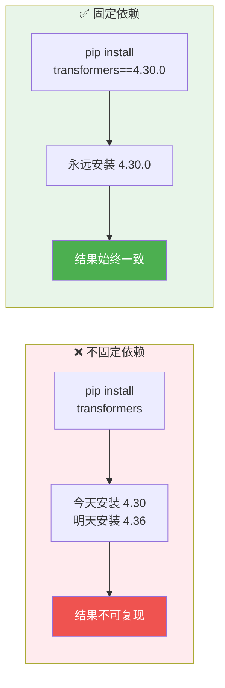

# 依赖固定

> **所属路径**：`01_基础能力/01_开发环境与技术英语/13_虚拟环境/03_依赖固定`
> **预计学习时间**：45 分钟
> **难度等级**：⭐⭐

---

## 前置知识

- [创建与激活](../02_创建与激活/02_创建与激活.md)（能够熟练使用 venv 或 conda 创建和管理虚拟环境）

> 如果以上内容还不熟悉，建议先完成对应课程再继续。

---

## 学习目标

完成本节后，你将能够：

1. 使用 `pip freeze` 和 `requirements.txt` 固定 Python 依赖
2. 理解版本约束的不同写法（精确、范围、兼容）
3. 使用 conda 导出和恢复环境
4. 了解 pip-tools 和 Poetry 等现代依赖管理工具
5. 掌握 AI 项目中依赖固定的最佳实践

---

## 正文讲解

### 1. 为什么要固定依赖？

你花了一周时间训练了一个效果很好的模型，提交了论文。三个月后，审稿人要求你补充实验。你重新运行代码，结果和之前完全不同——模型精度差了好几个百分点。

怎么回事？你检查代码，一行也没改过。最后发现原因是：三个月前你用的 `transformers==4.30.0` ，而 `pip install transformers` 现在安装的是 `4.36.0` ，新版本修改了默认的注意力计算方式，导致结果不可复现。

这就是为什么 **依赖固定（Dependency Pinning）** 如此重要——在 AI 研究中，它直接关系到实验的 **可复现性（Reproducibility）** 。



> 📌 **图解说明**：不固定依赖版本时，不同时间安装可能得到不同版本，导致实验结果不可复现。固定版本号可以确保一致性。

### 2. requirements.txt 详解

`requirements.txt` 是 Python 生态中最通用的依赖声明文件。

**生成 requirements.txt**

```bash
# 方法 1：导出当前环境的所有包（精确版本）
(.venv) $ pip freeze > requirements.txt
```

```
# requirements.txt（pip freeze 生成的示例）
certifi==2023.11.17
charset-normalizer==3.3.2
numpy==1.24.3
pandas==2.1.4
python-dateutil==2.8.2
pytz==2023.3.post1
six==1.16.0
torch==2.1.0
```

注意 `pip freeze` 会导出**所有**包，包括依赖的依赖。这保证了精确复现，但文件会很长，且不容易看出哪些是你"直接需要的"。

**手动编写 requirements.txt**

更好的做法是手动编写，只列出项目直接依赖的包：

```
# requirements.txt（手动编写）
# 核心依赖
torch==2.1.0
transformers==4.36.0
datasets==2.14.0

# 数据处理
numpy==1.24.3
pandas==2.1.4

# 可视化
matplotlib==3.8.0

# 工具
tqdm>=4.60.0
```

**版本约束写法**

| 写法 | 含义 | 示例 | 适用场景 |
| ---- | ---- | ---- | -------- |
| `==` | 精确版本 | `torch==2.1.0` | 关键依赖，必须精确复现 |
| `>=` | 最低版本 | `tqdm>=4.60.0` | 辅助工具，灵活接受新版本 |
| `<=`、`<` | 版本上限 | `numpy<2.0` | 已知新大版本不兼容 |
| `>=,<` | 版本范围 | `pandas>=2.0,<2.2` | 允许在兼容范围内更新 |
| `~=` | 兼容版本 | `requests~=2.28.0` | 等价于 `>=2.28.0,<2.29.0` |
| `!=` | 排除版本 | `scipy!=1.11.0` | 某个版本有已知 bug |

**从 requirements.txt 恢复环境**

```bash
# 创建新环境并安装依赖
$ python3 -m venv .venv
$ source .venv/bin/activate
(.venv) $ pip install -r requirements.txt
```

### 3. conda 环境导出与恢复

conda 使用 `environment.yml` 文件来描述环境：

**导出环境**

```bash
# 导出完整环境（含平台特定的包信息）
$ conda env export > environment.yml

# 导出跨平台兼容的版本（推荐）
$ conda env export --from-history > environment.yml
```

```yaml
# environment.yml 示例
name: ml_project
channels:
  - pytorch
  - nvidia
  - conda-forge
  - defaults
dependencies:
  - python=3.10
  - pytorch=2.1.0
  - pytorch-cuda=12.1
  - numpy=1.24.3
  - pip:
    - transformers==4.36.0
    - datasets==2.14.0
```

**从 environment.yml 恢复环境**

```bash
# 创建新环境
$ conda env create -f environment.yml

# 更新已有环境
$ conda env update -f environment.yml
```

### 4. 现代依赖管理工具

随着 Python 项目的复杂度增加，`requirements.txt` 的局限性逐渐显现。一些现代工具提供了更强大的依赖管理能力。

**pip-tools：requirements.txt 的增强版**

pip-tools 引入了"声明 vs 锁定"的分离概念：

```bash
# 安装 pip-tools
$ pip install pip-tools
```

```
# requirements.in（你声明直接依赖）
torch==2.1.0
transformers==4.36.0
pandas>=2.0
```

```bash
# 编译出完整的锁定文件（自动解析所有间接依赖）
$ pip-compile requirements.in -o requirements.txt

# 同步安装（精确匹配锁定文件，删除多余的包）
$ pip-sync requirements.txt
```

**Poetry：一站式项目管理**

Poetry 是一个更现代的 Python 项目管理工具，集成了环境管理、依赖解析和打包发布：

```bash
# 安装 Poetry
$ pip install poetry

# 初始化项目
$ poetry init

# 添加依赖
$ poetry add torch transformers pandas

# 安装所有依赖
$ poetry install
```

Poetry 使用 `pyproject.toml` 声明依赖，`poetry.lock` 锁定精确版本：

```toml
# pyproject.toml（部分）
[tool.poetry.dependencies]
python = "^3.10"
torch = "2.1.0"
transformers = "^4.36.0"
pandas = ">=2.0,<3.0"
```

### 5. AI 项目的依赖固定策略

AI 项目的依赖管理有一些特殊挑战：深度学习框架与 CUDA 版本的耦合、模型库的快速迭代、GPU 驱动的兼容性等。以下是推荐的策略：

**分层管理依赖**

```
# requirements/base.txt（核心依赖，精确固定）
torch==2.1.0
transformers==4.36.0
datasets==2.14.0
numpy==1.24.3

# requirements/dev.txt（开发工具，宽松约束）
-r base.txt
pytest>=7.0
black>=23.0
jupyter>=1.0

# requirements/deploy.txt（部署依赖）
-r base.txt
fastapi>=0.100.0
uvicorn>=0.20.0
```

```bash
# 开发环境
$ pip install -r requirements/dev.txt

# 生产环境
$ pip install -r requirements/deploy.txt
```

**CUDA 兼容性注意事项**

```bash
# PyTorch 安装时必须注意 CUDA 版本匹配
# 查看系统 CUDA 版本
$ nvidia-smi | grep "CUDA Version"

# 安装与 CUDA 版本匹配的 PyTorch
# CUDA 12.1
$ pip install torch==2.1.0 --index-url https://download.pytorch.org/whl/cu121
# CUDA 11.8
$ pip install torch==2.1.0 --index-url https://download.pytorch.org/whl/cu118
# CPU only
$ pip install torch==2.1.0 --index-url https://download.pytorch.org/whl/cpu
```

**记录完整的环境信息**

```bash
# 在项目中创建环境信息记录脚本
#!/bin/bash
# save_env_info.sh
echo "=== Python ===" > env_info.txt
python --version >> env_info.txt
echo "=== Pip Packages ===" >> env_info.txt
pip freeze >> env_info.txt
echo "=== CUDA ===" >> env_info.txt
nvidia-smi 2>/dev/null >> env_info.txt || echo "No GPU" >> env_info.txt
echo "=== OS ===" >> env_info.txt
uname -a >> env_info.txt
```

---

## 动手实践

```bash
# 1. 创建虚拟环境
$ python3 -m venv /tmp/dep_practice
$ source /tmp/dep_practice/bin/activate

# 2. 安装几个包
(.venv) $ pip install requests flask

# 3. 生成 requirements.txt
(.venv) $ pip freeze > /tmp/requirements_full.txt
(.venv) $ cat /tmp/requirements_full.txt

# 4. 手动编写一个简洁版本
(.venv) $ cat > /tmp/requirements_clean.txt << EOF
requests>=2.28,<3.0
flask~=3.0.0
EOF

# 5. 创建新环境验证可复现性
(.venv) $ deactivate
$ python3 -m venv /tmp/dep_practice2
$ source /tmp/dep_practice2/bin/activate
(.venv) $ pip install -r /tmp/requirements_full.txt
(.venv) $ pip list

# 6. 清理
(.venv) $ deactivate
$ rm -rf /tmp/dep_practice /tmp/dep_practice2 /tmp/requirements_*.txt
```

---

## 典型误区

| 误区 | 正确理解 |
| ---- | -------- |
| `pip freeze` 的输出就是最好的 requirements.txt | `pip freeze` 包含所有间接依赖，不易维护。建议手动编写直接依赖，再用 pip-tools 生成完整锁定文件 |
| 所有包都应该用 `==` 精确固定 | 核心包（torch、transformers）用 `==`，辅助工具（tqdm、black）可以用 `>=` 保持更新 |
| requirements.txt 放在项目根目录就够了 | 对于复杂项目，建议分层管理（base/dev/deploy），放在 `requirements/` 子目录中 |
| conda 和 pip 的依赖文件可以互换 | `requirements.txt` 是 pip 格式，`environment.yml` 是 conda 格式。两者语法不同，不可互换 |

---

## 练习题

### 练习 1：版本约束（难度：⭐）

解释以下每行 requirements.txt 的含义：

```
numpy==1.24.3
pandas>=2.0,<2.2
requests~=2.28.0
scipy!=1.11.0
torch>=2.0
```

<details>
<summary>💡 提示</summary>

回忆各版本约束符号的含义：`==` 精确、`>=` 最低、`<` 上限、`~=` 兼容、`!=` 排除。

</details>

<details>
<summary>✅ 参考答案</summary>

1. `numpy==1.24.3` ：精确安装 numpy 1.24.3 版本
2. `pandas>=2.0,<2.2` ：安装 pandas 2.0 到 2.2 之间的版本（不含 2.2）
3. `requests~=2.28.0` ：安装 requests 2.28.x 系列的最新版（>=2.28.0, <2.29.0）
4. `scipy!=1.11.0` ：安装 scipy 的任意版本，但排除 1.11.0
5. `torch>=2.0` ：安装 torch 2.0 或更新版本

</details>

### 练习 2：环境复现（难度：⭐⭐）

你的同事发来一个 AI 项目，只有代码没有 requirements.txt。项目的 `import` 语句如下：

```python
import torch
import transformers
import datasets
import numpy as np
import pandas as pd
from tqdm import tqdm
```

请为这个项目编写一个合理的 `requirements.txt`，区分核心依赖和辅助工具的版本约束策略。

<details>
<summary>💡 提示</summary>

核心 AI 库用精确版本（`==`），通用工具用最低版本约束（`>=`）。先确认当前可用版本再固定。

</details>

<details>
<summary>✅ 参考答案</summary>

```
# 核心 AI 依赖（精确固定以确保可复现）
torch==2.1.0
transformers==4.36.0
datasets==2.14.0

# 数据处理（兼容约束）
numpy>=1.24,<2.0
pandas>=2.0,<3.0

# 辅助工具（宽松约束）
tqdm>=4.60.0
```

注意：实际使用时应先用 `pip install` 安装这些包，运行代码确认无误后，再用 `pip freeze` 获取精确版本号来替换上面的范围约束。

</details>

### 练习 3：conda 环境导出（难度：⭐⭐）

编写一个 `environment.yml` 文件，描述以下环境：
- Python 3.10
- PyTorch 2.1（CUDA 12.1）
- scikit-learn 最新版
- 用 pip 安装 transformers 4.36.0

<details>
<summary>💡 提示</summary>

注意 `channels` 的顺序，以及 conda 和 pip 依赖的写法区别。

</details>

<details>
<summary>✅ 参考答案</summary>

```yaml
name: my_ml_env
channels:
  - pytorch
  - nvidia
  - conda-forge
  - defaults
dependencies:
  - python=3.10
  - pytorch=2.1.0
  - pytorch-cuda=12.1
  - scikit-learn
  - pip:
    - transformers==4.36.0
```

使用：
```bash
conda env create -f environment.yml
conda activate my_ml_env
```

</details>

---

## 下一步学习

- 📖 下一个知识点：[Docker基础](../04_Docker基础/04_Docker基础.md)
- 🔗 相关知识点：[包管理](../../14_包管理/)（pip 和 conda 的高级用法）
- 📚 拓展阅读：[pip-tools 文档](https://pip-tools.readthedocs.io/)（公开免费文档）

---

## 参考资料

1. [pip 官方文档 - Requirements File Format](https://pip.pypa.io/en/stable/reference/requirements-file-format/) — requirements.txt 格式的权威说明（Python 官方文档）
2. [conda 官方文档 - Managing Environments](https://docs.conda.io/projects/conda/en/latest/user-guide/tasks/manage-environments.html) — conda 环境导出与恢复指南（公开免费文档）
3. [pip-tools 文档](https://pip-tools.readthedocs.io/) — pip-tools 的使用指南（公开免费文档）
4. [Poetry 官方文档](https://python-poetry.org/docs/) — Poetry 项目管理工具文档（公开免费文档）
