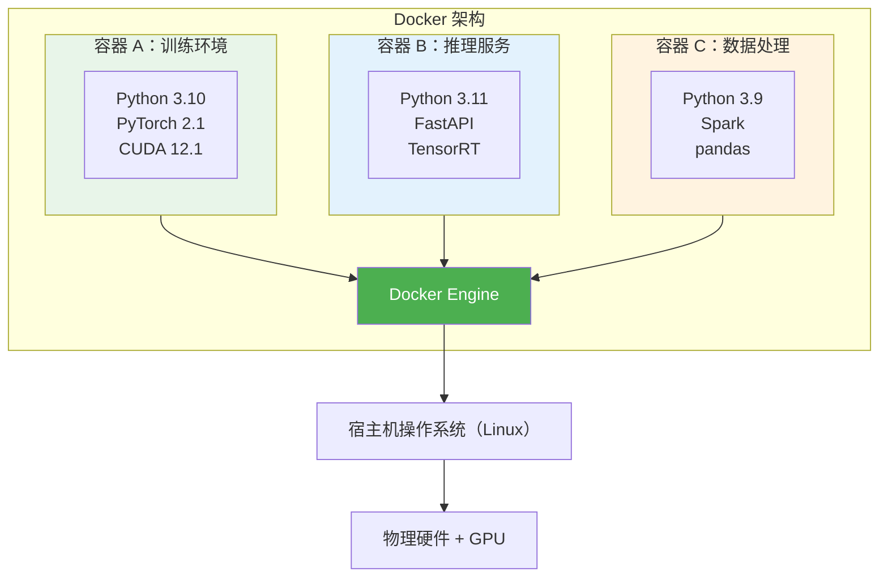
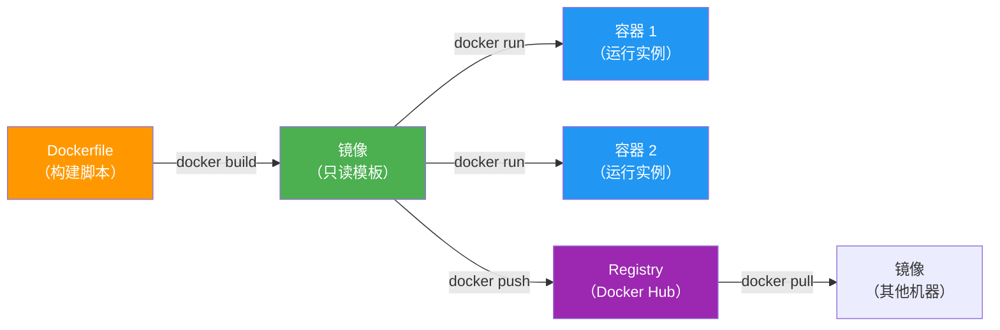

# Docker基础

> **所属路径**：`01_基础能力/01_开发环境与技术英语/13_虚拟环境/04_Docker基础`
> **预计学习时间**：70 分钟
> **难度等级**：⭐⭐⭐

---

## 前置知识

- [环境隔离原理](../01_环境隔离原理/01_环境隔离原理.md)（理解语言级与操作系统级隔离的区别）
- [依赖固定](../03_依赖固定/03_依赖固定.md)（了解 requirements.txt 的使用）
- [文件系统操作](../../12_命令行/01_文件系统操作/01_文件系统操作.md)（基本命令行操作能力）

> 如果以上内容还不熟悉，建议先完成对应课程再继续。

---

## 学习目标

完成本节后，你将能够：

1. 理解 Docker 的核心概念（镜像、容器、Dockerfile、仓库）
2. 编写 Dockerfile 构建 AI/ML 项目的运行环境
3. 使用 Docker 命令管理容器的生命周期
4. 了解 nvidia-docker 实现 GPU 容器化的方式
5. 使用 Docker Compose 编排多容器应用

---

## 正文讲解

### 1. 为什么 AI 开发需要 Docker？

在 [环境隔离原理](../01_环境隔离原理/01_环境隔离原理.md) 中我们了解到，虚拟环境（venv/conda）只能隔离 Python 包。但实际的 AI 项目还依赖很多系统级组件：CUDA 运行时库、cuDNN、特定版本的 GCC 编译器、OpenCV 的系统依赖等。当你需要在不同机器上复现完全相同的训练环境，或者将模型部署到生产服务器时，仅靠 `requirements.txt` 是远远不够的。

**Docker** 通过将应用程序及其所有依赖（包括操作系统级别的库、工具和配置）打包成一个标准化的 **容器（Container）** ，实现了"一次构建，到处运行"的目标。



> 📌 **图解说明**：多个 Docker 容器共享宿主机的操作系统内核，但各自拥有独立的文件系统、库和配置。容器之间完全隔离，互不影响。

### 2. Docker 核心概念

| 概念 | 类比 | 说明 |
| ---- | ---- | ---- |
| **镜像（Image）** | 安装光盘 | 一个只读的环境模板，包含操作系统、库、代码和配置 |
| **容器（Container）** | 运行中的虚拟机 | 镜像的运行实例，可读写，有自己的进程和网络 |
| **Dockerfile** | 安装脚本 | 描述如何从零开始构建一个镜像的文本文件 |
| **仓库（Registry）** | 应用商店 | 存储和分发镜像的平台（如 Docker Hub） |



> 📌 **图解说明**：Docker 的工作流程。从 Dockerfile 构建镜像，从镜像创建容器，通过 Registry 分享镜像。

### 3. Docker 安装与基本命令

```bash
# 安装 Docker（Ubuntu）
$ curl -fsSL https://get.docker.com -o get-docker.sh
$ sudo sh get-docker.sh

# 将当前用户添加到 docker 组（避免每次都用 sudo）
$ sudo usermod -aG docker $USER
# 重新登录后生效

# 验证安装
$ docker --version
$ docker run hello-world
```

**常用命令速查**

```bash
# === 镜像操作 ===
$ docker pull python:3.10-slim      # 从 Registry 下载镜像
$ docker images                      # 列出本地镜像
$ docker rmi python:3.10-slim       # 删除镜像

# === 容器操作 ===
$ docker run -it python:3.10-slim bash   # 交互式运行容器
$ docker ps                              # 查看运行中的容器
$ docker ps -a                           # 查看所有容器（含已停止的）
$ docker stop <容器ID>                    # 停止容器
$ docker rm <容器ID>                      # 删除容器

# === 数据管理 ===
$ docker run -v /本地路径:/容器路径 镜像名  # 挂载目录
```

### 4. 编写 Dockerfile

Dockerfile 是构建镜像的"配方"。下面是一个面向 AI 项目的 Dockerfile 示例：

```dockerfile
# 基础镜像：选择包含 Python 的 NVIDIA CUDA 镜像
FROM nvidia/cuda:12.1.0-cudnn8-runtime-ubuntu22.04

# 设置环境变量，避免交互式安装卡住
ENV DEBIAN_FRONTEND=noninteractive
ENV PYTHONUNBUFFERED=1

# 安装系统依赖
RUN apt-get update && apt-get install -y --no-install-recommends \
    python3.10 \
    python3-pip \
    python3.10-venv \
    git \
    wget \
    && rm -rf /var/lib/apt/lists/*

# 设置 Python 别名
RUN ln -sf /usr/bin/python3.10 /usr/bin/python

# 设置工作目录
WORKDIR /app

# 先复制依赖文件（利用 Docker 缓存层）
COPY requirements.txt .

# 安装 Python 依赖
RUN pip install --no-cache-dir -r requirements.txt

# 复制项目代码
COPY . .

# 默认命令
CMD ["python", "train.py"]
```

**构建和运行**

```bash
# 构建镜像（在 Dockerfile 所在目录执行）
$ docker build -t my-ml-project:v1 .

# 运行容器
$ docker run my-ml-project:v1

# 交互式运行（进入容器内的 Shell）
$ docker run -it my-ml-project:v1 bash

# 挂载数据目录和模型输出目录
$ docker run -v $(pwd)/data:/app/data -v $(pwd)/output:/app/output my-ml-project:v1
```

**Dockerfile 最佳实践**

| 实践 | 原因 |
| ---- | ---- |
| 先复制 `requirements.txt`，再复制代码 | 利用 Docker 构建缓存：只要依赖不变，重新构建时不需要重新安装包 |
| 使用 `--no-cache-dir` 安装 pip 包 | 减小镜像体积（不保存下载缓存） |
| 使用 `.dockerignore` 排除不需要的文件 | 避免把 `.git`、`data/`、`__pycache__` 等打包进镜像 |
| 选择合适的基础镜像 | 用 `slim` 或 `alpine` 版本减小体积；AI 项目用 `nvidia/cuda` 镜像 |
| 合并多个 `RUN` 命令 | 减少镜像层数，缩小体积 |

**`.dockerignore` 示例**

```
.git
.gitignore
__pycache__
*.pyc
.venv
data/
output/
*.log
.env
```

### 5. GPU 支持：nvidia-docker

要在 Docker 容器中使用 GPU，需要安装 NVIDIA Container Toolkit：

```bash
# 安装 NVIDIA Container Toolkit（Ubuntu）
$ distribution=$(. /etc/os-release;echo $ID$VERSION_ID)
$ curl -fsSL https://nvidia.github.io/libnvidia-container/gpgkey | sudo gpg --dearmor -o /usr/share/keyrings/nvidia-container-toolkit-keyring.gpg
$ curl -s -L https://nvidia.github.io/libnvidia-container/$distribution/libnvidia-container.list | \
    sed 's#deb https://#deb [signed-by=/usr/share/keyrings/nvidia-container-toolkit-keyring.gpg] https://#g' | \
    sudo tee /etc/apt/sources.list.d/nvidia-container-toolkit.list
$ sudo apt-get update
$ sudo apt-get install -y nvidia-container-toolkit
$ sudo systemctl restart docker
```

```bash
# 使用 GPU 运行容器
$ docker run --gpus all my-ml-project:v1

# 指定特定 GPU
$ docker run --gpus '"device=0,1"' my-ml-project:v1

# 验证 GPU 可用
$ docker run --gpus all nvidia/cuda:12.1.0-base-ubuntu22.04 nvidia-smi
```

### 6. Docker Compose：多容器编排

当你的 AI 应用由多个服务组成（如模型服务 + 向量数据库 + API 网关）时，Docker Compose 可以用一个 YAML 文件同时管理多个容器：

```yaml
# docker-compose.yml
version: '3.8'

services:
  # 模型推理服务
  model-server:
    build: .
    ports:
      - "8000:8000"
    volumes:
      - ./models:/app/models
    deploy:
      resources:
        reservations:
          devices:
            - driver: nvidia
              count: 1
              capabilities: [gpu]
    command: python serve.py

  # 向量数据库
  vector-db:
    image: qdrant/qdrant:latest
    ports:
      - "6333:6333"
    volumes:
      - ./qdrant_data:/qdrant/storage
```

```bash
# 启动所有服务
$ docker compose up -d

# 查看服务状态
$ docker compose ps

# 查看日志
$ docker compose logs -f model-server

# 停止所有服务
$ docker compose down
```

---

## 动手实践

即使没有 GPU，也可以在本地练习 Docker 的基本操作：

```bash
# 1. 拉取 Python 镜像
$ docker pull python:3.10-slim

# 2. 交互式运行
$ docker run -it --rm python:3.10-slim bash
root@abc123:/# python --version
root@abc123:/# pip install numpy
root@abc123:/# python -c "import numpy; print(numpy.__version__)"
root@abc123:/# exit

# 3. 创建一个简单的 Dockerfile
$ mkdir /tmp/docker_practice && cd /tmp/docker_practice
$ cat > app.py << 'EOF'
import sys
print(f"Python {sys.version}")
print("Hello from Docker!")
try:
    import numpy as np
    print(f"NumPy {np.__version__}")
    print(f"Random array: {np.random.rand(3)}")
except ImportError:
    print("NumPy not installed")
EOF

$ cat > requirements.txt << 'EOF'
numpy==1.24.3
EOF

$ cat > Dockerfile << 'EOF'
FROM python:3.10-slim
WORKDIR /app
COPY requirements.txt .
RUN pip install --no-cache-dir -r requirements.txt
COPY . .
CMD ["python", "app.py"]
EOF

# 4. 构建并运行
$ docker build -t my-test-app .
$ docker run --rm my-test-app

# 5. 清理
$ docker rmi my-test-app
$ rm -rf /tmp/docker_practice
```

---

## 典型误区

| 误区 | 正确理解 |
| ---- | -------- |
| Docker 容器和虚拟机一样重 | 容器共享宿主机内核，启动只需秒级，资源开销远低于虚拟机 |
| 容器停止后数据就丢失了 | 容器内的修改会保留直到容器被删除。持久化数据应使用 `-v` 挂载卷 |
| 需要在容器内安装 CUDA 驱动 | CUDA 驱动由宿主机提供。容器只需要 CUDA 运行时库（包含在 nvidia/cuda 镜像中） |
| 每次代码改动都要完全重建镜像 | 利用 Docker 构建缓存，将不常变化的层（如依赖安装）放在前面，只有代码层需要重建 |

---

## 练习题

### 练习 1：Dockerfile 编写（难度：⭐⭐）

为一个 FastAPI 模型服务编写 Dockerfile，要求：
- 基于 `python:3.10-slim`
- 安装 `fastapi`、`uvicorn`、`torch`
- 暴露 8000 端口
- 启动命令为 `uvicorn app:app --host 0.0.0.0 --port 8000`

<details>
<summary>💡 提示</summary>

使用 `EXPOSE` 声明端口，`CMD` 设置启动命令。记住先复制 requirements.txt 再复制代码。

</details>

<details>
<summary>✅ 参考答案</summary>

```dockerfile
FROM python:3.10-slim

WORKDIR /app

# 安装依赖
COPY requirements.txt .
RUN pip install --no-cache-dir -r requirements.txt

# 复制代码
COPY . .

# 声明端口
EXPOSE 8000

# 启动服务
CMD ["uvicorn", "app:app", "--host", "0.0.0.0", "--port", "8000"]
```

对应的 requirements.txt：
```
fastapi>=0.100.0
uvicorn>=0.20.0
torch==2.1.0
```

构建和运行：
```bash
docker build -t model-server .
docker run -p 8000:8000 model-server
```

</details>

### 练习 2：挂载目录（难度：⭐⭐）

你的训练脚本需要读取 `/home/alice/data/train` 的数据集，并将模型保存到 `/home/alice/models/` 。请写出 `docker run` 命令，正确挂载这两个目录。

<details>
<summary>💡 提示</summary>

使用 `-v` 选项挂载本地目录到容器内的路径。

</details>

<details>
<summary>✅ 参考答案</summary>

```bash
docker run --gpus all \
    -v /home/alice/data/train:/app/data \
    -v /home/alice/models:/app/models \
    my-ml-project:v1 \
    python train.py --data_dir /app/data --output_dir /app/models
```

注意：容器内的路径（`/app/data`、`/app/models`）需要与训练脚本中的路径参数一致。

</details>

### 练习 3：概念辨析（难度：⭐）

解释 Docker 镜像和 Docker 容器的区别。一个镜像可以创建多少个容器？

<details>
<summary>💡 提示</summary>

回忆镜像和容器的类比：镜像像是"安装光盘"，容器像是"运行中的程序"。

</details>

<details>
<summary>✅ 参考答案</summary>

**Docker 镜像**是一个只读的环境模板，包含了运行应用所需的所有文件（操作系统库、Python、依赖包、代码等）。它类似于"类"或"蓝图"。

**Docker 容器**是镜像的运行实例，它是一个可读写的、有自己独立进程和网络的隔离环境。它类似于从类创建的"对象"。

一个镜像可以创建**任意多个**容器。每个容器都是独立的，它们之间互不影响。例如，同一个训练镜像可以同时创建多个容器，在不同 GPU 上并行训练不同的超参数组合。

</details>

---

## 下一步学习

- 📖 下一个知识主题：[包管理](../../14_包管理/)
- 🔗 相关知识点：[容器](../../../../03_工程落地/01_人工智能工程化与部署/06_容器/)（深入学习容器化部署）
- 📚 拓展阅读：[Docker 官方入门教程](https://docs.docker.com/get-started/)（Docker 官方文档）

---

## 参考资料

1. [Docker 官方文档](https://docs.docker.com/) — Docker 的权威参考文档（公开免费文档）
2. [Docker 官方入门教程](https://docs.docker.com/get-started/) — 从零开始学 Docker（公开免费文档）
3. [NVIDIA Container Toolkit 文档](https://docs.nvidia.com/datacenter/cloud-native/container-toolkit/overview.html) — GPU 容器化的官方指南（NVIDIA 官方文档）
4. [Best practices for writing Dockerfiles](https://docs.docker.com/develop/develop-images/dockerfile_best-practices/) — Dockerfile 最佳实践指南（Docker 官方文档）
