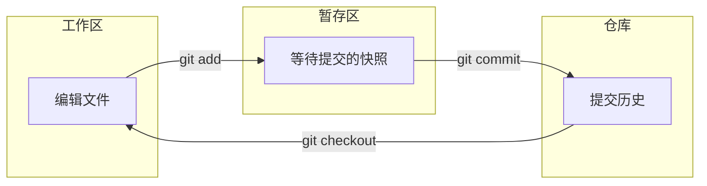

# 仓库与提交

> **所属路径**：`01_基础能力/01_开发环境与技术英语/15_版本控制/01_仓库与提交`
> **预计学习时间**：40 分钟
> **难度等级**：⭐

---

## 前置知识

- [文件系统操作](../../12_命令行/01_文件系统操作/01_文件系统操作.md)

> 如果以上内容还不熟悉，建议先完成对应课程再继续。

---

## 学习目标

完成本节后，你将能够：

1. 解释版本控制的核心价值和 Git 的基本工作原理
2. 使用 `git init` 初始化仓库或 `git clone` 克隆远程仓库
3. 使用 `git add`、`git commit` 完成一次完整的代码提交流程
4. 使用 `git log` 查看提交历史，使用 `git diff` 比较文件差异
5. 编写规范的 `.gitignore` 文件排除不需要跟踪的文件

---

## 正文讲解

### 1. 为什么需要版本控制？

想象一下这样的场景：你正在编写一个数据分析脚本，改着改着发现程序跑不通了，但你已经记不清之前哪个版本是好的。于是你开始手动创建 `analysis_v1.py`、`analysis_v2.py`、`analysis_final.py`、`analysis_final_final.py`……这种混乱的局面，相信每个人都经历过。

**版本控制（Version Control）** 就是为了解决这个问题而生的。它让你可以：

- 记录文件的每一次有意义的变更
- 随时回到历史上的任何一个版本
- 在不影响主线代码的情况下尝试新功能
- 与他人协作时避免互相覆盖

**Git** 是目前最主流的 **分布式版本控制系统（Distributed Version Control System, DVCS）** ，由 Linus Torvalds 在 2005 年创建，最初是为了管理 Linux 内核的源代码。与早期的集中式版本控制系统（如 SVN）不同，Git 让每个开发者都拥有仓库的完整副本，可以在本地完成所有操作，无需依赖网络连接。

### 2. Git 的三棵树模型

要理解 Git 的工作方式，最重要的是掌握它的 **三棵树模型** 。这三棵"树"分别是：

- **工作区（Working Directory）** ：你在文件系统中实际看到和编辑的文件
- **暂存区（Staging Area）** ：也叫索引（Index），是一个准备下次提交内容的区域
- **仓库（Repository）** ：Git 存储所有提交历史的数据库，位于 `.git` 目录中



> 📌 **图解说明**：文件的变更从工作区出发，经过 `git add` 进入暂存区，再经过 `git commit` 永久记录到仓库中。如果需要恢复某个历史版本，可以用 `git checkout` 将仓库中的文件还原到工作区。

为什么要有暂存区这个"中间层"？因为在实际开发中，你可能同时修改了很多文件，但只想把其中一部分变更记录为一次提交。暂存区让你可以精确控制每次提交包含哪些内容，就像在寄快递之前先把要寄的东西放进箱子里检查一遍。

### 3. 初始化仓库

有两种方式开始使用 Git 管理项目：

**方式一：从零开始创建本地仓库**

```bash
# 创建项目目录并进入
mkdir my-project
cd my-project

# 初始化 Git 仓库
git init
```

执行 `git init` 后，当前目录下会出现一个隐藏的 `.git` 文件夹，这就是 Git 仓库的"大脑"，里面存储了所有的版本历史信息。

**方式二：克隆一个已有的远程仓库**

```bash
# 克隆远程仓库到本地
git clone https://github.com/username/repo-name.git
```

`git clone` 会自动完成三件事：创建目录、初始化仓库、下载远程仓库的所有历史记录。

### 4. 查看状态与差异

在进行任何操作之前，养成查看仓库状态的好习惯：

```bash
# 查看当前状态
git status
```

`git status` 会告诉你：

- 哪些文件被修改了但还没暂存
- 哪些文件已暂存但还没提交
- 哪些文件是新文件（未被 Git 跟踪）

如果你想看具体改了什么内容：

```bash
# 查看工作区与暂存区的差异（未暂存的修改）
git diff

# 查看暂存区与最新提交的差异（已暂存但未提交的修改）
git diff --staged
```

### 5. 添加与提交

理解了三棵树模型后，提交流程就很清晰了：

```bash
# 第一步：将修改添加到暂存区
git add hello.py           # 添加单个文件
git add src/               # 添加整个目录
git add .                  # 添加当前目录下所有变更

# 第二步：将暂存区的内容提交到仓库
git commit -m "feat: 添加 hello world 脚本"
```

每一次 `git commit` 都会生成一个 **提交对象（Commit Object）** ，它包含：

- 一个唯一的 SHA-1 哈希值（如 `a1b2c3d`），作为提交的"身份证号"
- 提交的作者和时间
- 提交信息（Commit Message）
- 指向上一次提交的指针（父提交）
- 本次快照的内容

> 💡 **提示**：`git add .` 虽然方便，但在实际项目中建议明确指定要添加的文件，避免误提交不相关的文件。

**提交信息规范**

好的提交信息是团队协作的基础。推荐使用以下格式：

```
<类型>: <简短描述>

<可选的详细说明>
```

常用的类型前缀：

| 类型 | 说明 | 示例 |
| ---- | ---- | ---- |
| `feat` | 新功能 | `feat: 添加数据加载模块` |
| `fix` | 修复 bug | `fix: 修复训练时内存泄漏` |
| `docs` | 文档变更 | `docs: 更新 README 安装说明` |
| `refactor` | 重构代码 | `refactor: 重构特征提取逻辑` |
| `test` | 测试相关 | `test: 添加模型评估单元测试` |
| `chore` | 构建/工具变更 | `chore: 更新依赖版本` |

### 6. 查看提交历史

```bash
# 查看完整的提交历史
git log

# 简洁的一行显示
git log --oneline

# 带分支图的显示（后续学习分支时会用到）
git log --oneline --graph --all
```

`git log` 的输出示例：

```
commit a1b2c3d4e5f6 (HEAD -> main)
Author: Alice <alice@example.com>
Date:   Mon Jan 15 10:30:00 2025 +0800

    feat: 添加数据加载模块

commit 9f8e7d6c5b4a
Author: Alice <alice@example.com>
Date:   Mon Jan 15 09:00:00 2025 +0800

    初始提交：项目结构搭建
```

这里的 `HEAD` 是一个特殊指针，表示"你当前所在的位置"。`HEAD -> main` 说明你当前在 `main` 分支上，且 `HEAD` 指向最新的提交。

### 7. 配置 .gitignore

在任何项目中，都有一些文件不应该被 Git 跟踪——比如编译产物、日志文件、包含密码的配置文件、大型数据集等。 `.gitignore` 文件就是用来告诉 Git"忽略这些文件"的。

一个典型的 Python / AI 项目的 `.gitignore` ：

```gitignore
# Python 编译产物
__pycache__/
*.py[cod]
*.egg-info/

# 虚拟环境
venv/
.env/

# Jupyter Notebook 检查点
.ipynb_checkpoints/

# IDE 配置
.vscode/
.idea/

# 数据文件和模型（通常太大，不适合放在 Git 中）
data/
*.h5
*.pt
*.onnx

# 操作系统文件
.DS_Store
Thumbs.db

# 日志文件
*.log

# 环境变量文件（可能包含密钥）
.env
```

> ⚠️ **注意**：`.gitignore` 只对尚未被 Git 跟踪的文件生效。如果一个文件已经被提交过了，即使后来加到 `.gitignore` 中也不会自动取消跟踪。需要先用 `git rm --cached <文件>` 将其从跟踪列表中移除。

### 8. 初次使用 Git 的配置

在第一次使用 Git 之前，需要配置用户信息，这些信息会出现在每次提交记录中：

```bash
# 设置用户名和邮箱
git config --global user.name "Your Name"
git config --global user.email "your.email@example.com"

# 设置默认分支名为 main
git config --global init.defaultBranch main

# 查看当前配置
git config --list
```

`--global` 表示这些设置对当前用户的所有仓库生效。如果某个项目需要使用不同的身份信息，可以在项目目录内去掉 `--global` 进行局部配置。

---

## 动手实践

下面我们来完成一个完整的 Git 工作流练习。请打开终端，逐步执行以下命令：

```bash
# 1. 创建并进入练习目录
mkdir git-practice && cd git-practice

# 2. 初始化 Git 仓库
git init

# 3. 创建第一个文件
echo "print('Hello, Git!')" > hello.py

# 4. 查看状态——此时 hello.py 是未跟踪状态
git status

# 5. 添加到暂存区
git add hello.py

# 6. 再次查看状态——此时 hello.py 已暂存
git status

# 7. 提交
git commit -m "feat: 添加 hello world 脚本"

# 8. 修改文件
echo "print('Hello, Version Control!')" >> hello.py

# 9. 查看具体改了什么
git diff

# 10. 创建 .gitignore
echo "__pycache__/" > .gitignore
echo "*.pyc" >> .gitignore

# 11. 一次性暂存并提交所有变更
git add .
git commit -m "feat: 更新问候语并添加 .gitignore"

# 12. 查看提交历史
git log --oneline
```

**预期输出**（最后一步）：

```
b2c3d4e (HEAD -> main) feat: 更新问候语并添加 .gitignore
a1b2c3d feat: 添加 hello world 脚本
```

> 💡 **提示**：你的哈希值会与示例不同，这是正常的——每次提交的哈希值取决于内容、时间、作者等因素的组合。

---

## 典型误区

| 误区 | 正确理解 |
| ---- | -------- |
| `git add` 就是提交 | `git add` 只是将变更放入暂存区，必须再执行 `git commit` 才会真正记录到仓库 |
| 提交信息随便写 `asdf` | 提交信息是给未来的自己和队友看的，应清晰描述本次变更内容 |
| `.gitignore` 可以忽略已跟踪的文件 | `.gitignore` 只对未被 Git 跟踪的新文件生效，已跟踪的文件需先 `git rm --cached` |
| `.git` 文件夹可以删除 | 删除 `.git` 意味着丢失全部版本历史，相当于"格式化"仓库 |
| 每次都用 `git add .` | 应该有意识地选择暂存哪些文件，避免误提交敏感信息或无关文件 |

---

## 练习题

### 练习 1：初始化并提交（难度：⭐）

请完成以下任务：
1. 创建一个名为 `ml-experiment` 的目录
2. 初始化为 Git 仓库
3. 创建一个 `train.py` 文件，内容为 `print("Training started")`
4. 创建一个合适的 `.gitignore` 文件（至少排除 `__pycache__/` 和 `*.pyc`）
5. 将两个文件提交到仓库，提交信息为 `feat: 初始化训练脚本`

<details>
<summary>💡 提示</summary>

使用 `mkdir` 创建目录，`cd` 进入后执行 `git init`。用 `echo` 或文本编辑器创建文件，然后 `git add` + `git commit`。

</details>

<details>
<summary>✅ 参考答案</summary>

```bash
mkdir ml-experiment && cd ml-experiment
git init
echo 'print("Training started")' > train.py
echo -e "__pycache__/\n*.pyc" > .gitignore
git add train.py .gitignore
git commit -m "feat: 初始化训练脚本"
```

用 `git log --oneline` 验证提交记录。

</details>

### 练习 2：理解三棵树（难度：⭐）

以下操作序列执行后，`data.csv` 处于什么状态？

```bash
git init
echo "id,value" > data.csv
git add data.csv
echo "1,100" >> data.csv
```

选项：
- A. 工作区和暂存区的 `data.csv` 内容相同
- B. 暂存区有第一行 `id,value`，工作区有两行
- C. `data.csv` 完全未被跟踪
- D. 工作区和暂存区都有两行内容

<details>
<summary>💡 提示</summary>

`git add` 暂存的是执行 `add` 那一刻的文件内容。之后对文件的修改不会自动进入暂存区。

</details>

<details>
<summary>✅ 参考答案</summary>

**答案：B**

执行 `git add data.csv` 时，暂存区保存的是当时文件的快照（只有 `id,value` 一行）。之后在工作区追加了 `1,100`，但这次修改没有再次 `git add`，所以暂存区仍然是旧内容。

这正是三棵树模型的核心：工作区和暂存区是独立的。可以用 `git diff` 查看工作区与暂存区的差异，用 `git diff --staged` 查看暂存区与最新提交的差异。

</details>

### 练习 3：修复 .gitignore（难度：⭐⭐）

你的同事不小心把 `config.env`（包含数据库密码）提交到了仓库。现在需要：
1. 将 `config.env` 从 Git 跟踪中移除（但保留本地文件）
2. 将 `config.env` 添加到 `.gitignore`
3. 提交这次变更

请写出完整的命令序列。

<details>
<summary>💡 提示</summary>

`git rm --cached` 可以将文件从 Git 跟踪中移除而不删除本地文件。

</details>

<details>
<summary>✅ 参考答案</summary>

```bash
# 从 Git 跟踪中移除（不删除本地文件）
git rm --cached config.env

# 添加到 .gitignore
echo "config.env" >> .gitignore

# 提交变更
git add .gitignore
git commit -m "fix: 移除敏感配置文件并更新 .gitignore"
```

> ⚠️ 虽然文件从当前版本移除了，但之前的提交历史中仍然保留着这个文件。如果包含真正的密码，应该立即更换密码，并考虑使用 `git filter-branch` 或 BFG Repo-Cleaner 来清理历史记录。

</details>

---

## 下一步学习

- 📖 下一个知识点：[分支与合并](../02_分支与合并/02_分支与合并.md)
- 🔗 相关知识点：[环境变量与脚本](../../12_命令行/03_环境变量与脚本/03_环境变量与脚本.md)
- 📚 拓展阅读：[Jupyter Notebook与交互式开发](../../16_Jupyter%20Notebook与交互式开发/)

---

## 参考资料

1. [Pro Git（中文版）](https://git-scm.com/book/zh/v2) — Scott Chacon 和 Ben Straub 著，Git 官方推荐的免费在线书籍（CC BY-NC-SA 3.0 许可）
2. [Git 官方文档](https://git-scm.com/docs) — Git 命令的权威参考（开源文档）
3. [GitHub Git 速查表](https://education.github.com/git-cheat-sheet-education.pdf) — GitHub 官方提供的 Git 常用命令速查表（公开资源）
4. [Missing Semester: Version Control (Git)](https://missing.csail.mit.edu/2020/version-control/) — MIT 公开课"计算机教育中缺失的一课"版本控制章节（CC BY-NC-SA 4.0 许可）
