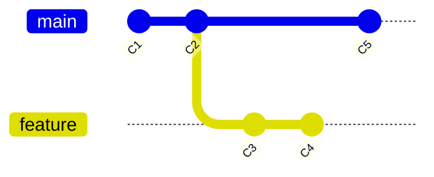
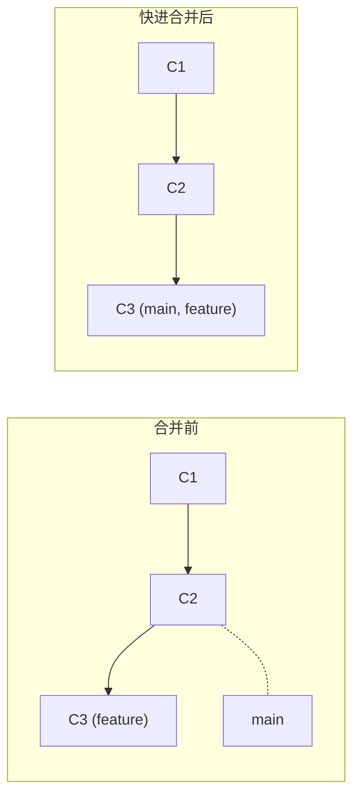
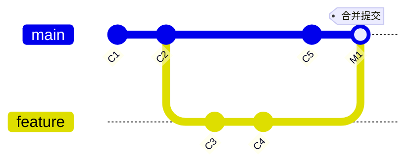
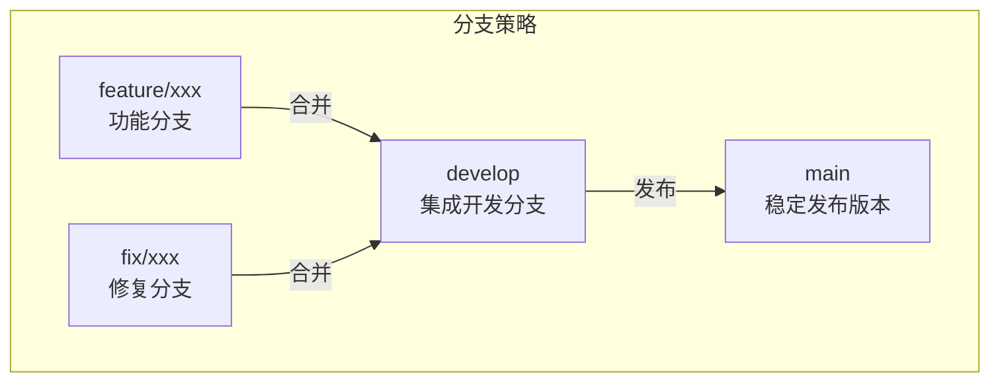

# 分支与合并

> **所属路径**：`01_基础能力/01_开发环境与技术英语/15_版本控制/02_分支与合并`
> **预计学习时间**：45 分钟
> **难度等级**：⭐⭐

---

## 前置知识

- [仓库与提交](../01_仓库与提交/01_仓库与提交.md)

> 如果以上内容还不熟悉，建议先完成对应课程再继续。

---

## 学习目标

完成本节后，你将能够：

1. 解释 Git 分支的本质——指向提交的可移动指针
2. 使用 `git branch`、`git switch` 创建和切换分支
3. 区分快进合并（Fast-forward）和三路合并（Three-way Merge）
4. 使用 `git merge` 将特性分支合并到主分支
5. 解释 `git rebase` 与 `git merge` 的区别和适用场景

---

## 正文讲解

### 1. 分支是什么？

在上一节中，我们知道每次 `git commit` 都会创建一个提交对象，这些提交对象通过指向父提交的指针串成一条链。那如果我们想同时进行两个方向的开发——比如一边修复线上 Bug，一边开发新功能——该怎么办？

这就是 **分支（Branch）** 要解决的问题。

Git 的分支设计非常轻量。一个分支本质上就是一个指向某个提交的 **可移动指针** 。当你在分支上做新的提交时，这个指针就自动向前移动，指向最新的提交。



> 📌 **图解说明**：`main` 和 `feature` 是两个分支，各自独立地向前推进。`main` 在 C2 之后创建了 C5，而 `feature` 从 C2 分叉出来，独立创建了 C3 和 C4。两条开发线互不干扰。

还记得上一节提到的 `HEAD` 吗？ `HEAD` 就是指向"你当前所在分支"的特殊指针。当你切换分支时，`HEAD` 会跟着移动到目标分支。

### 2. 创建与切换分支

```bash
# 查看所有分支（当前分支前面有 * 标记）
git branch

# 创建新分支（不切换）
git branch feature-login

# 切换到新分支（推荐使用 switch，更语义化）
git switch feature-login

# 或者使用旧命令
git checkout feature-login

# 创建并立即切换（一步到位）
git switch -c feature-login
# 等同于旧命令
git checkout -b feature-login
```

> 💡 **提示**：`git switch` 是 Git 2.23 版本引入的新命令，专门用于切换分支，比 `git checkout` 更直观。`git checkout` 功能过于复杂（既能切换分支又能恢复文件），容易混淆，因此推荐使用 `git switch`。

创建分支后，你在新分支上的所有提交都不会影响 `main` 分支。这就好比从主路上岔出一条小路，你可以在小路上自由探索，不会影响主路的交通。

### 3. 分支命名规范

良好的分支命名能让团队一目了然。常见的命名约定：

| 前缀 | 用途 | 示例 |
| ---- | ---- | ---- |
| `feature/` | 新功能开发 | `feature/data-loader` |
| `fix/` | Bug 修复 | `fix/memory-leak` |
| `hotfix/` | 紧急修复 | `hotfix/login-crash` |
| `experiment/` | AI 实验分支 | `experiment/bert-finetune` |
| `docs/` | 文档更新 | `docs/api-reference` |

### 4. 合并分支

当特性分支上的开发完成后，我们需要把它合并回主分支。这就是 `git merge` 的用武之地。Git 的合并有两种基本模式：

#### 快进合并（Fast-forward Merge）

如果从创建分支到合并期间，主分支没有任何新的提交，Git 会直接把主分支的指针"快进"到特性分支的最新提交，不产生额外的合并提交。



> 📌 **图解说明**：快进合并时，`main` 指针直接移动到 `feature` 所在的提交 C3，历史保持线性。

```bash
# 切换到主分支
git switch main

# 合并特性分支（如果可以快进，Git 默认采用快进）
git merge feature-login
```

#### 三路合并（Three-way Merge）

如果主分支在分叉后也有了新提交，Git 就无法简单地快进了。此时 Git 会找到两个分支的 **最近公共祖先（Common Ancestor）** ，然后将三个版本（公共祖先、主分支最新、特性分支最新）做一次合并，生成一个新的 **合并提交（Merge Commit）** 。



> 📌 **图解说明**：C2 是公共祖先，Git 比较 C5（main 的变更）和 C4（feature 的变更），将它们合并生成 M1。M1 有两个父提交：C5 和 C4。

```bash
# 切换到主分支
git switch main

# 合并特性分支——如果有分叉，自动创建合并提交
git merge feature-login
```

合并完成后，如果特性分支不再需要，可以删除它：

```bash
# 删除已合并的分支
git branch -d feature-login
```

### 5. Rebase：另一种合并方式

除了 `git merge`，还有一种合并方式叫 **变基（Rebase）** 。它的作用是将特性分支的提交"嫁接"到主分支的最新提交之后，让历史看起来像是线性的。

```bash
# 在特性分支上执行
git switch feature-login
git rebase main

# 然后切换回主分支，快进合并
git switch main
git merge feature-login
```

**Merge vs Rebase 对比**

| 对比项 | merge | rebase |
| ------ | ----- | ------ |
| 历史记录 | 保留分支分叉和合并的完整历史 | 将提交重新排列为线性历史 |
| 合并提交 | 产生额外的合并提交 | 不产生合并提交 |
| 安全性 | 不改写历史，安全 | 改写提交历史，有风险 |
| 适用场景 | 公共分支合并、保留上下文 | 个人分支整理、保持历史整洁 |

> ⚠️ **黄金法则**：**永远不要对已经推送到远程共享仓库的分支执行 rebase** 。因为 rebase 会改写提交历史，如果别人已经基于这些提交做了开发，就会产生混乱。只对本地的、尚未共享的分支使用 rebase。

### 6. 分支策略

在实际项目中，团队通常会约定一套分支策略来规范开发流程。以下是一个简洁实用的策略：



> 📌 **图解说明**：功能分支和修复分支都从 `develop` 分出，完成后合并回 `develop`。`develop` 经过测试后合并到 `main` 进行发布。

- **main**：始终保持稳定可发布的状态
- **develop**：日常开发集成分支
- **feature/xxx**：从 `develop` 分出，完成后合并回 `develop`
- **fix/xxx**：修复 Bug 的分支，修复后合并回 `develop`

在后续的 [协作工作流](../05_协作工作流/05_协作工作流.md) 中，我们会更深入地学习 GitHub Flow 等轻量级工作流。

---

## 动手实践

让我们来模拟一个完整的分支开发和合并流程：

```bash
# 1. 初始化仓库并创建初始提交
mkdir branch-practice && cd branch-practice
git init
echo "# My ML Project" > README.md
git add README.md
git commit -m "feat: 初始化项目"

# 2. 创建并切换到特性分支
git switch -c feature/data-loader

# 3. 在特性分支上开发
echo 'def load_data(path):
    """加载数据集"""
    print(f"Loading data from {path}")
    return []' > data_loader.py
git add data_loader.py
git commit -m "feat: 添加数据加载函数"

echo 'def preprocess(data):
    """预处理数据"""
    print("Preprocessing...")
    return data' >> data_loader.py
git add data_loader.py
git commit -m "feat: 添加数据预处理函数"

# 4. 切换回主分支，模拟另一个开发者的提交
git switch main
echo "## 安装方法" >> README.md
git add README.md
git commit -m "docs: 添加安装说明"

# 5. 合并特性分支到主分支
git merge feature/data-loader -m "merge: 合并数据加载功能"

# 6. 查看合并后的历史
git log --oneline --graph --all

# 7. 清理：删除已合并的分支
git branch -d feature/data-loader
```

**预期输出**（第 6 步）：

```
*   e5f6a7b (HEAD -> main) merge: 合并数据加载功能
|\
| * c3d4e5f feat: 添加数据预处理函数
| * a1b2c3d feat: 添加数据加载函数
* | b2c3d4e docs: 添加安装说明
|/
* 9f8e7d6 feat: 初始化项目
```

从输出中可以清楚地看到：主分支在 C2 后分叉为两条线，feature 分支做了两次提交，main 分支做了一次提交，最终通过一个合并提交汇合。

---

## 典型误区

| 误区 | 正确理解 |
| ---- | -------- |
| 分支会复制一份完整的代码副本 | Git 分支只是一个 41 字节的指针，创建分支几乎不消耗磁盘空间 |
| 必须先推送分支再能切换 | 分支是本地操作，不需要网络，可以随时创建和切换 |
| rebase 比 merge 更好 | 两者各有适用场景，rebase 适合整理本地历史，merge 适合保留完整上下文 |
| 删除分支会丢失提交 | 只要提交已合并到其他分支，删除分支只是删除指针，提交不会丢失 |
| 一个分支只能做一件事 | 这不是技术限制，而是最佳实践——每个分支专注一个任务会让历史更清晰 |

---

## 练习题

### 练习 1：分支基本操作（难度：⭐）

请完成以下操作并回答问题：
1. 创建一个新仓库，做一次初始提交
2. 创建一个 `experiment/lr-tuning` 分支并切换到该分支
3. 在该分支上做两次提交
4. 切回 `main` 分支

问题：此时执行 `git log --oneline` 在 `main` 上能看到几条提交记录？

<details>
<summary>💡 提示</summary>

每个分支有自己独立的提交历史。在 `main` 上执行 `git log` 只能看到 `main` 分支上的提交。

</details>

<details>
<summary>✅ 参考答案</summary>

只能看到 **1 条**（初始提交）。在 `experiment/lr-tuning` 分支上的两次提交不会出现在 `main` 的历史中。

```bash
mkdir branch-quiz && cd branch-quiz
git init
echo "init" > README.md
git add . && git commit -m "初始提交"

git switch -c experiment/lr-tuning
echo "lr=0.01" > config.txt
git add . && git commit -m "实验: 学习率 0.01"
echo "lr=0.001" > config.txt
git add . && git commit -m "实验: 学习率 0.001"

git switch main
git log --oneline
# 输出：只有一条 "初始提交"
```

如果想看所有分支的提交，使用 `git log --oneline --all`。

</details>

### 练习 2：判断合并类型（难度：⭐⭐）

以下场景中，执行 `git merge feature` 时，Git 会使用快进合并还是三路合并？

**场景 A**：
```
main:    C1 → C2
feature: C1 → C2 → C3 → C4
```

**场景 B**：
```
main:    C1 → C2 → C5
feature: C1 → C2 → C3 → C4
```

<details>
<summary>💡 提示</summary>

快进合并的条件是：main 分支在分叉点之后没有新的提交。

</details>

<details>
<summary>✅ 参考答案</summary>

- **场景 A：快进合并**。`main` 停在 C2，`feature` 是 C2 的直接后续。Git 只需将 `main` 指针移动到 C4。
- **场景 B：三路合并**。`main` 在 C2 之后有了 C5，形成了分叉。Git 需要找到公共祖先 C2，对比 C5 和 C4 的变更，生成一个合并提交。

</details>

### 练习 3：Rebase 实践（难度：⭐⭐）

在一个仓库中执行以下操作，然后用 `git log --oneline --graph --all` 查看结果，描述你看到的历史图形状：

```bash
git init && echo "init" > f.txt && git add . && git commit -m "C1"
git switch -c feature
echo "feature work" > g.txt && git add . && git commit -m "C2"
git switch main
echo "main work" > h.txt && git add . && git commit -m "C3"
git switch feature
git rebase main
```

<details>
<summary>💡 提示</summary>

Rebase 会把 `feature` 的提交"移动"到 `main` 的最新提交之后。

</details>

<details>
<summary>✅ 参考答案</summary>

执行 rebase 后，`feature` 的 C2 被重新应用到 C3 之后，变成一个新的提交 C2'。历史看起来是线性的：

```
* (feature) C2'  — feature work
* (main) C3      — main work
* C1              — init
```

注意 C2' 虽然内容与原来的 C2 相同，但它是一个全新的提交（哈希值不同），因为它的父提交从 C1 变成了 C3。

</details>

---

## 下一步学习

- 📖 下一个知识点：[冲突与回滚](../03_冲突与回滚/03_冲突与回滚.md)
- 🔗 相关知识点：[仓库与提交](../01_仓库与提交/01_仓库与提交.md)
- 📚 拓展阅读：[协作工作流](../05_协作工作流/05_协作工作流.md)

---

## 参考资料

1. [Pro Git: Git 分支](https://git-scm.com/book/zh/v2/Git-%E5%88%86%E6%94%AF-%E5%88%86%E6%94%AF%E7%AE%80%E4%BB%8B) — Git 官方书籍的分支章节（CC BY-NC-SA 3.0 许可）
2. [Learn Git Branching](https://learngitbranching.js.org/?locale=zh_CN) — 交互式学习 Git 分支的可视化工具（开源项目）
3. [Git 官方文档: git-merge](https://git-scm.com/docs/git-merge) — `git merge` 命令的权威参考（开源文档）
4. [Atlassian Git 教程: Merging vs. Rebasing](https://www.atlassian.com/git/tutorials/merging-vs-rebasing) — 清晰对比 merge 和 rebase 的教程（公开资源）
