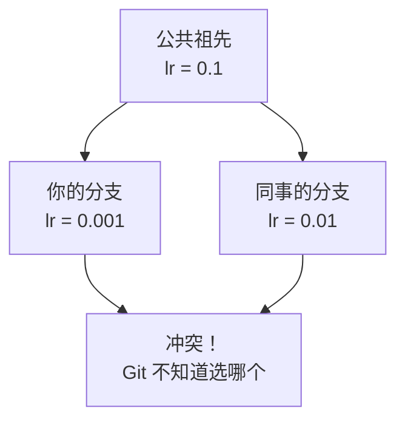
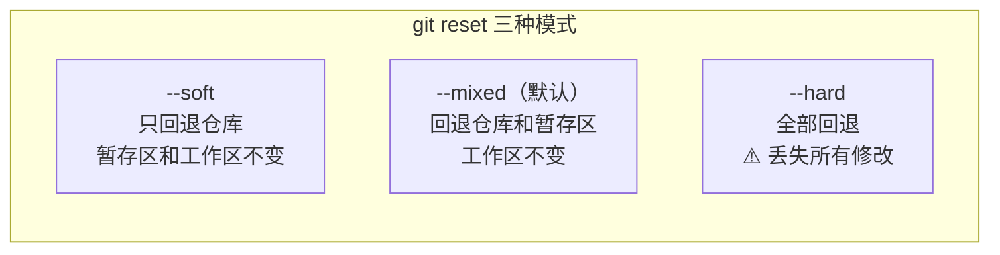

# 冲突与回滚

> **所属路径**：`01_基础能力/01_开发环境与技术英语/15_版本控制/03_冲突与回滚`
> **预计学习时间**：40 分钟
> **难度等级**：⭐⭐

---

## 前置知识

- [分支与合并](../02_分支与合并/02_分支与合并.md)

> 如果以上内容还不熟悉，建议先完成对应课程再继续。

---

## 学习目标

完成本节后，你将能够：

1. 解释合并冲突的产生原因并识别冲突标记
2. 按照正确的步骤手动解决合并冲突
3. 使用 `git restore` 撤销工作区的修改
4. 区分 `git reset` 的 `--soft`、`--mixed`、`--hard` 三种模式
5. 使用 `git revert` 安全地撤销已推送的提交
6. 使用 `git stash` 临时保存未提交的修改

---

## 正文讲解

### 1. 合并冲突是怎么产生的？

在上一节学习分支合并时，我们看到 Git 通常能自动把两个分支的修改合并在一起。但有一种情况 Git 无法自动处理：**两个分支修改了同一个文件的同一部分** 。

想象这样一个场景：你和同事都在修改 `config.py` 中的学习率配置。你把学习率改成了 `0.001`，同事改成了 `0.01`。Git 不知道应该用谁的版本，因此它会暂停合并过程，告诉你："我遇到了 **合并冲突（Merge Conflict）** ，请你来决定。"



> 📌 **图解说明**：两个分支从相同的祖先出发，对同一处做了不同的修改。Git 无法自动判断应该保留哪一个版本，因此产生冲突。

### 2. 识别冲突标记

当冲突发生时，Git 会在冲突文件中插入特殊的标记：

```python
# config.py
batch_size = 32
<<<<<<< HEAD
learning_rate = 0.001
=======
learning_rate = 0.01
>>>>>>> feature/colleague
epochs = 100
```

这三个标记把冲突区域分成两部分：

| 标记 | 含义 |
| ---- | ---- |
| `<<<<<<< HEAD` | 当前分支（你的版本）的内容开始 |
| `=======` | 分隔线，上面是你的版本，下面是对方的版本 |
| `>>>>>>> feature/colleague` | 对方分支的内容结束 |

### 3. 解决冲突的步骤

解决冲突并不复杂，只需要四步：

**第一步：找到冲突文件**

```bash
# 查看哪些文件有冲突
git status
```

Git 会标记冲突文件为 `both modified`。

**第二步：打开文件，手动编辑**

删除冲突标记（`<<<<<<<`、`=======`、`>>>>>>>`），保留你想要的内容。你可以选择保留一方、合并双方，或者写一个全新的版本：

```python
# config.py —— 解决冲突后
batch_size = 32
learning_rate = 0.005  # 取两人的折中值
epochs = 100
```

**第三步：标记冲突已解决**

```bash
git add config.py
```

**第四步：完成合并**

```bash
git commit
# Git 会自动生成一条合并提交信息，你可以直接保存退出
```

> 💡 **提示**：很多编辑器（VS Code、PyCharm 等）提供了可视化的冲突解决工具，可以点击按钮选择"接受当前版本""接受传入版本"或"接受双方"，比手动编辑更方便。

### 4. 撤销工作区修改：git restore

有时你修改了文件但还没暂存，突然发现改错了方向，想恢复到最新提交的状态。这时可以使用 `git restore`：

```bash
# 丢弃工作区中某个文件的修改（恢复到暂存区或最新提交的版本）
git restore config.py

# 丢弃工作区中所有文件的修改
git restore .

# 将已暂存的文件取消暂存（放回工作区）
git restore --staged config.py
```

> ⚠️ **注意**：`git restore` 丢弃的工作区修改是 **不可恢复** 的！因为这些修改从未被 Git 记录过。执行前请确认这些修改确实不需要了。

`git restore` 是 Git 2.23 引入的新命令，替代了之前容易混淆的 `git checkout -- <file>` 用法。

### 5. 回退提交：git reset

如果你已经提交了，但想"撤回"这次提交，可以使用 `git reset`。它有三种模式，区别在于对工作区和暂存区的处理方式：



> 📌 **图解说明**：三种模式从温和到激进，影响的范围逐渐扩大。`--soft` 最安全，`--hard` 最危险。

具体使用方式：

```bash
# 回退最近 1 次提交，保留修改在暂存区（可以直接重新 commit）
git reset --soft HEAD~1

# 回退最近 1 次提交，修改保留在工作区（需要重新 add + commit）
git reset --mixed HEAD~1    # --mixed 是默认模式，可省略
git reset HEAD~1            # 等同于上面

# 回退最近 1 次提交，彻底丢弃所有修改
git reset --hard HEAD~1
```

| 模式 | 仓库（HEAD） | 暂存区 | 工作区 | 使用场景 |
| ---- | ------------ | ------ | ------ | -------- |
| `--soft` | ✅ 回退 | 不变 | 不变 | 想修改提交信息或合并多次提交 |
| `--mixed` | ✅ 回退 | ✅ 回退 | 不变 | 想重新选择要暂存的文件 |
| `--hard` | ✅ 回退 | ✅ 回退 | ✅ 回退 | 彻底丢弃错误的提交和修改 |

> ⚠️ **警告**：`git reset --hard` 会 **永久丢弃** 工作区和暂存区的修改。如果不确定，优先使用 `--soft` 或 `--mixed`。

### 6. 安全撤销：git revert

`git reset` 会改写提交历史，因此 **不适合撤销已经推送到远程仓库的提交** ——其他同事可能已经基于这些提交做了开发。

对于已推送的提交，应该使用 **`git revert`** 。它不会删除原来的提交，而是创建一个新的提交来"反转"指定提交的变更：

```bash
# 撤销最近一次提交（生成一个新的"反转"提交）
git revert HEAD

# 撤销指定的某次提交
git revert a1b2c3d
```

对比 `reset` 和 `revert`：

| 对比项 | git reset | git revert |
| ------ | --------- | ---------- |
| 修改历史 | 是（删除提交） | 否（新增反转提交） |
| 适用范围 | 本地未推送的提交 | 已推送的提交 |
| 安全性 | 有数据丢失风险 | 安全，不影响他人 |

### 7. 临时保存：git stash

你正在特性分支上写代码写到一半，突然同事说有个紧急 Bug 需要切换到 `main` 分支修复。但你当前的修改还没写完，不想做一个半成品的提交。这时 **`git stash`** 就派上用场了：

```bash
# 将当前未提交的修改保存到"储藏栈"
git stash

# 可以附加说明信息
git stash push -m "数据加载功能开发中"

# 查看储藏栈中的所有记录
git stash list

# 恢复最近一次储藏的修改（并从栈中删除）
git stash pop

# 恢复最近一次储藏的修改（但保留在栈中）
git stash apply

# 删除某条储藏
git stash drop stash@{0}

# 清空所有储藏
git stash clear
```

`git stash` 就像是一个"暂存抽屉"：你把手头的东西先放进去，去处理别的事情，回来后再从抽屉里拿出来继续。

---

## 动手实践

让我们来模拟一个完整的冲突解决和回滚流程：

```bash
# 1. 初始化仓库
mkdir conflict-practice && cd conflict-practice
git init

# 2. 创建初始文件
cat > config.py << 'EOF'
# 模型配置
learning_rate = 0.1
batch_size = 32
epochs = 10
EOF
git add config.py
git commit -m "feat: 添加初始配置"

# 3. 创建分支 A，修改学习率
git switch -c branch-a
sed -i 's/learning_rate = 0.1/learning_rate = 0.001/' config.py
git add config.py
git commit -m "feat: 降低学习率到 0.001"

# 4. 切回 main，创建分支 B，做不同的修改
git switch main
git switch -c branch-b
sed -i 's/learning_rate = 0.1/learning_rate = 0.01/' config.py
git add config.py
git commit -m "feat: 调整学习率到 0.01"

# 5. 切回 main，先合并 branch-a（无冲突）
git switch main
git merge branch-a

# 6. 再合并 branch-b（产生冲突！）
git merge branch-b
# 此时 Git 会提示冲突

# 7. 查看冲突状态
git status

# 8. 查看冲突内容
cat config.py

# 9. 手动解决冲突（选择一个值）
cat > config.py << 'EOF'
# 模型配置
learning_rate = 0.005
batch_size = 32
epochs = 10
EOF

# 10. 标记已解决并完成合并
git add config.py
git commit -m "merge: 合并学习率配置，取折中值 0.005"

# 11. 查看完整历史
git log --oneline --graph --all
```

**运行说明**：
- 环境要求：Git 2.23+
- 以上命令可在任何 Bash 终端中执行

**预期输出**（第 8 步，冲突文件内容）：

```
# 模型配置
<<<<<<< HEAD
learning_rate = 0.001
=======
learning_rate = 0.01
>>>>>>> branch-b
batch_size = 32
epochs = 10
```

---

## 典型误区

| 误区 | 正确理解 |
| ---- | -------- |
| 冲突说明代码出了 Bug | 冲突只是说明两个人修改了同一处，需要人为决定保留哪个版本，与代码质量无关 |
| `git reset --hard` 可以随意使用 | `--hard` 会永久丢失未提交的修改，应谨慎使用；已推送的提交应用 `revert` |
| 冲突很可怕，应该尽量避免 | 冲突是正常的协作现象，掌握解决方法后，冲突只需几分钟即可处理 |
| `git stash` 和 `git commit` 差不多 | `stash` 是临时保存，用于中断切换场景；`commit` 是正式记录，形成永久历史 |
| 撤销操作只有一种 | Git 提供多种粒度的撤销：`restore`（工作区）、`reset`（本地历史）、`revert`（远程安全） |

---

## 练习题

### 练习 1：解读冲突标记（难度：⭐）

以下是一个冲突文件的内容，请问冲突区域中"当前分支"的内容和"合并进来的分支"的内容分别是什么？

```python
import torch

<<<<<<< HEAD
model = torch.nn.Linear(512, 256)
=======
model = torch.nn.Linear(512, 128)
>>>>>>> feature/small-model

optimizer = torch.optim.Adam(model.parameters())
```

<details>
<summary>💡 提示</summary>

`<<<<<<< HEAD` 到 `=======` 之间是当前分支（HEAD）的内容，`=======` 到 `>>>>>>>` 之间是合并进来的分支的内容。

</details>

<details>
<summary>✅ 参考答案</summary>

- **当前分支（HEAD）**：`model = torch.nn.Linear(512, 256)` — 输出维度为 256
- **合并进来的分支（feature/small-model）**：`model = torch.nn.Linear(512, 128)` — 输出维度为 128

要解决这个冲突，你需要删除三行标记符号，并决定保留哪个版本（或写一个新版本）。例如保留 128：

```python
import torch

model = torch.nn.Linear(512, 128)

optimizer = torch.optim.Adam(model.parameters())
```

</details>

### 练习 2：选择正确的撤销方式（难度：⭐⭐）

针对以下每个场景，说明应该使用哪个命令：

1. 你修改了 `train.py` 但还没暂存，想丢弃修改恢复原样
2. 你已经 `git add` 了 `train.py`，想取消暂存但保留工作区修改
3. 你做了一次提交但还没推送，想撤回重新组织提交
4. 你的提交已经推送到远程仓库，想撤销这次提交的效果

<details>
<summary>💡 提示</summary>

根据修改所在的位置（工作区 / 暂存区 / 本地仓库 / 远程仓库）来选择对应的工具。

</details>

<details>
<summary>✅ 参考答案</summary>

1. `git restore train.py` — 撤销工作区修改
2. `git restore --staged train.py` — 取消暂存，修改回到工作区
3. `git reset --soft HEAD~1` — 回退提交，修改保留在暂存区
4. `git revert HEAD` — 创建一个反转提交，安全撤销已推送的变更

记忆口诀：**未暂存用 restore，未推送用 reset，已推送用 revert** 。

</details>

### 练习 3：git stash 实战（难度：⭐⭐）

你正在 `feature/data-aug` 分支上开发数据增强功能，修改了 `augment.py` 但还没提交。这时你需要紧急切换到 `main` 分支修复一个 Bug。请写出完整的操作序列（包括修复 Bug 后回来继续开发）。

<details>
<summary>💡 提示</summary>

使用 `git stash` 保存当前工作，切换分支修复 Bug，再切回来用 `git stash pop` 恢复。

</details>

<details>
<summary>✅ 参考答案</summary>

```bash
# 1. 保存当前修改
git stash push -m "数据增强功能开发中"

# 2. 切换到 main 分支
git switch main

# 3. 创建修复分支并修复 Bug
git switch -c fix/urgent-bug
# ... 修复代码 ...
git add .
git commit -m "fix: 修复紧急 Bug"

# 4. 合并修复到 main
git switch main
git merge fix/urgent-bug
git branch -d fix/urgent-bug

# 5. 切回原来的分支
git switch feature/data-aug

# 6. 恢复之前的修改
git stash pop

# 7. 继续开发...
```

</details>

---

## 下一步学习

- 📖 下一个知识点：[标签与版本管理](../04_标签与版本管理/04_标签与版本管理.md)
- 🔗 相关知识点：[分支与合并](../02_分支与合并/02_分支与合并.md)
- 📚 拓展阅读：[协作工作流](../05_协作工作流/05_协作工作流.md)

---

## 参考资料

1. [Pro Git: 合并冲突](https://git-scm.com/book/zh/v2/Git-%E5%88%86%E6%94%AF-%E5%88%86%E6%94%AF%E7%9A%84%E6%96%B0%E5%BB%BA%E4%B8%8E%E5%90%88%E5%B9%B6#_%E9%81%87%E5%88%B0%E5%86%B2%E7%AA%81%E6%97%B6%E7%9A%84%E5%88%86%E6%94%AF%E5%90%88%E5%B9%B6) — Git 官方书籍的冲突处理章节（CC BY-NC-SA 3.0 许可）
2. [Git 官方文档: git-reset](https://git-scm.com/docs/git-reset) — `git reset` 命令的权威参考（开源文档）
3. [Git 官方文档: git-revert](https://git-scm.com/docs/git-revert) — `git revert` 命令的权威参考（开源文档）
4. [Atlassian Git 教程: Undoing Changes](https://www.atlassian.com/git/tutorials/undoing-changes) — 系统讲解各种撤销操作的教程（公开资源）
