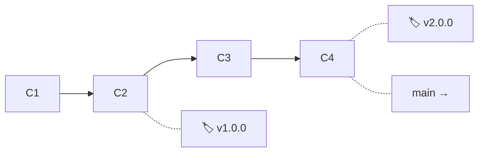
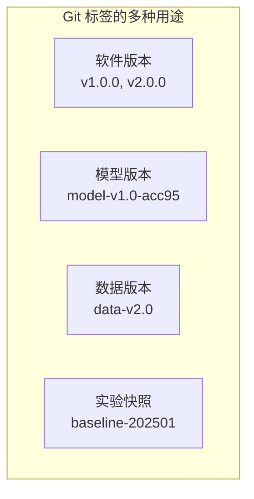

# 标签与版本管理

> **所属路径**：`01_基础能力/01_开发环境与技术英语/15_版本控制/04_标签与版本管理`
> **预计学习时间**：30 分钟
> **难度等级**：⭐⭐

---

## 前置知识

- [仓库与提交](../01_仓库与提交/01_仓库与提交.md)

> 如果以上内容还不熟悉，建议先完成对应课程再继续。

---

## 学习目标

完成本节后，你将能够：

1. 区分轻量标签和附注标签的用途和区别
2. 使用 `git tag` 创建、查看和删除标签
3. 解释语义版本号（SemVer）的三段式含义
4. 在 AI 项目中使用标签管理模型版本和数据集版本

---

## 正文讲解

### 1. 为什么需要标签？

在前面的学习中，我们知道 Git 的每次提交都有一个长长的 SHA-1 哈希值，比如 `a1b2c3d4e5f6g7h8`。但当你需要找到"上线发布的那个版本"或者"精度达到 95% 的那次模型"时，你不可能记住这些哈希值。

**标签（Tag）** 就是给某个特定的提交取一个人类可读的名字。它就像书签一样，让你能快速定位到重要的历史节点。

与分支不同，标签是 **不可移动的指针** ——一旦创建，它就永远指向那个提交。分支会随着新提交向前移动，而标签不会。



> 📌 **图解说明**：`v1.0.0` 和 `v2.0.0` 是两个标签，分别"钉"在 C2 和 C4 上。即使 `main` 分支继续前进，这两个标签的位置也不会改变。

### 2. 轻量标签与附注标签

Git 支持两种类型的标签：

**轻量标签（Lightweight Tag）**

轻量标签就是一个简单的名字指针，不包含任何额外信息：

```bash
# 创建轻量标签（给当前提交打标签）
git tag v1.0.0

# 给指定的提交打标签
git tag v0.9.0 a1b2c3d
```

**附注标签（Annotated Tag）**

附注标签是 Git 中的一个完整对象，包含打标签者的信息、日期和附注信息，还可以用 GPG 签名进行验证：

```bash
# 创建附注标签
git tag -a v1.0.0 -m "第一个稳定发布版本"

# 查看标签详细信息
git show v1.0.0
```

`git show v1.0.0` 的输出示例：

```
tag v1.0.0
Tagger: Alice <alice@example.com>
Date:   Mon Jan 15 10:30:00 2025 +0800

第一个稳定发布版本

commit a1b2c3d4e5f6...
Author: Alice <alice@example.com>
Date:   Mon Jan 15 10:00:00 2025 +0800

    feat: 完成核心功能开发
```

**两种标签的对比**

| 对比项 | 轻量标签 | 附注标签 |
| ------ | -------- | -------- |
| 存储方式 | 仅是一个指针 | 独立的 Git 对象 |
| 附加信息 | 无 | 包含作者、日期、注释 |
| 适用场景 | 临时标记、个人使用 | 正式发布、团队共享 |
| 推荐程度 | 一般 | ✅ 推荐用于正式版本 |

> 💡 **最佳实践**：对于正式发布的版本，始终使用附注标签。它提供了完整的审计信息，便于追踪谁在什么时候发布了什么版本。

### 3. 标签的常用操作

```bash
# 查看所有标签
git tag

# 按模式筛选标签
git tag -l "v1.*"

# 切换到标签对应的代码状态（进入"分离 HEAD"状态）
git checkout v1.0.0

# 基于标签创建新分支（更安全的做法）
git switch -c hotfix/v1.0.1 v1.0.0

# 删除本地标签
git tag -d v1.0.0

# 推送标签到远程仓库
git push origin v1.0.0

# 推送所有标签
git push origin --tags

# 删除远程标签
git push origin --delete v1.0.0
```

> ⚠️ **注意**：`git checkout v1.0.0` 会让你进入 **分离 HEAD（Detached HEAD）** 状态。在这个状态下做的提交不属于任何分支，很容易丢失。如果你需要基于标签做修改，请先创建一个新分支。

### 4. 语义版本号

在软件项目中，标签名通常遵循 **语义版本号（Semantic Versioning, SemVer）** 规范，格式为 `MAJOR.MINOR.PATCH`：

```
v2.1.3
│ │ │
│ │ └── PATCH（补丁号）：向后兼容的 Bug 修复
│ └──── MINOR（次版本号）：向后兼容的新功能
└────── MAJOR（主版本号）：不兼容的 API 变更
```

举例说明：

| 版本变化 | 说明 | 示例 |
| -------- | ---- | ---- |
| `1.0.0` → `1.0.1` | 修复了一个 Bug | 修复数据加载时的编码错误 |
| `1.0.1` → `1.1.0` | 添加了新功能（向后兼容） | 新增 CSV 格式的数据导出功能 |
| `1.1.0` → `2.0.0` | 有不兼容的变更 | 重构了 API，旧的调用方式不再支持 |

预发布版本可以添加后缀：`v2.0.0-alpha`、`v2.0.0-beta.1`、`v2.0.0-rc.1`。

在 Python 项目中，版本号通常与 [依赖清单与锁定文件](../../14_包管理/03_依赖清单与锁定文件/03_依赖清单与锁定文件.md) 中 `setup.py` 或 `pyproject.toml` 中的版本字段保持一致。

### 5. 标签在 AI 项目中的应用

在 AI 和机器学习项目中，标签的用途远不止标记软件发布版本。以下是一些常见的应用场景：

**标记模型版本**

```bash
# 标记一个性能里程碑
git tag -a model-v1.0-acc95 -m "模型准确率达到 95%，使用 ResNet-50"

# 标记不同实验配置
git tag -a exp-bert-base-lr3e5 -m "BERT-base, lr=3e-5, batch=32, F1=0.87"
```

**标记数据集版本**

```bash
# 数据集更新时打标签
git tag -a data-v2.0 -m "数据集扩充：新增 5000 条标注数据"
```

**标记基线实验**

```bash
# 标记作为对照基线的版本
git tag -a baseline-202501 -m "2025年1月基线：LR模型，AUC=0.82"
```

**GitHub Release**

在 GitHub 上，标签可以与 **发布（Release）** 关联。创建 Release 时可以附加二进制文件（如编译好的模型、打包好的数据集），方便用户下载。这在开源 AI 项目中非常常见——用户不需要自己训练模型，直接下载 Release 中附带的预训练权重即可。



> 📌 **图解说明**：在 AI 项目中，标签不仅用于标记软件版本，还可以用来标记模型、数据和实验的关键节点。

---

## 动手实践

让我们来模拟一个 AI 项目的版本管理流程：

```bash
# 1. 初始化项目
mkdir ml-version-practice && cd ml-version-practice
git init

# 2. 初始提交
echo "# ML Project" > README.md
echo 'def train():
    print("Training v1...")' > train.py
git add .
git commit -m "feat: 项目初始化"

# 3. 完成 v1.0.0 的开发
echo 'def predict(x):
    print(f"Predicting: {x}")
    return 0' > predict.py
git add .
git commit -m "feat: 添加预测功能"

# 4. 打附注标签 v1.0.0
git tag -a v1.0.0 -m "v1.0.0: 基础训练和预测功能"

# 5. 继续开发 v1.1.0——添加新功能
echo 'def evaluate(y_true, y_pred):
    acc = sum(a == b for a, b in zip(y_true, y_pred)) / len(y_true)
    print(f"Accuracy: {acc:.2%}")
    return acc' > evaluate.py
git add .
git commit -m "feat: 添加评估功能"
git tag -a v1.1.0 -m "v1.1.0: 新增模型评估功能"

# 6. 修复 Bug——发布 v1.1.1
echo 'def evaluate(y_true, y_pred):
    if len(y_true) == 0:
        print("Warning: empty input")
        return 0.0
    acc = sum(a == b for a, b in zip(y_true, y_pred)) / len(y_true)
    print(f"Accuracy: {acc:.2%}")
    return acc' > evaluate.py
git add .
git commit -m "fix: 修复空输入时的除零错误"
git tag -a v1.1.1 -m "v1.1.1: 修复评估函数空输入 Bug"

# 7. 查看所有标签
git tag

# 8. 查看标签详情
git show v1.0.0

# 9. 查看标签对应的提交历史
git log --oneline --decorate
```

**预期输出**（第 7 步）：

```
v1.0.0
v1.1.0
v1.1.1
```

**预期输出**（第 9 步，示意）：

```
f5e6d7c (HEAD -> main, tag: v1.1.1) fix: 修复评估函数空输入 Bug
c3d4e5f (tag: v1.1.0) feat: 添加评估功能
a1b2c3d (tag: v1.0.0) feat: 添加预测功能
9f8e7d6 feat: 项目初始化
```

---

## 典型误区

| 误区 | 正确理解 |
| ---- | -------- |
| 标签和分支差不多 | 分支是可移动的指针，标签是固定不动的"书签"。分支用于开发，标签用于标记 |
| 版本号可以随便取 | 建议遵循语义版本号规范，让版本号携带有意义的信息 |
| 标签会自动推送到远程 | 默认不会！需要明确执行 `git push origin --tags` 或 `git push origin <tag>` |
| 只有软件项目需要打标签 | AI 项目同样需要——标记模型版本、数据版本、实验基线等 |

---

## 练习题

### 练习 1：创建和管理标签（难度：⭐）

请完成以下操作：
1. 创建一个新仓库，做 3 次提交
2. 为第 1 次提交打轻量标签 `v0.1.0`
3. 为第 3 次（最新）提交打附注标签 `v1.0.0`，注释为"首次稳定发布"
4. 列出所有标签
5. 查看 `v1.0.0` 的详细信息

<details>
<summary>💡 提示</summary>

使用 `git log --oneline` 获取历史提交的哈希值，然后用 `git tag <tagname> <hash>` 为指定提交打标签。附注标签使用 `-a` 和 `-m` 参数。

</details>

<details>
<summary>✅ 参考答案</summary>

```bash
mkdir tag-practice && cd tag-practice
git init

echo "v1" > file.txt && git add . && git commit -m "提交 1"
echo "v2" > file.txt && git add . && git commit -m "提交 2"
echo "v3" > file.txt && git add . && git commit -m "提交 3"

# 获取第 1 次提交的哈希值
FIRST_COMMIT=$(git log --oneline | tail -1 | cut -d' ' -f1)

# 为第 1 次提交打轻量标签
git tag v0.1.0 $FIRST_COMMIT

# 为最新提交打附注标签
git tag -a v1.0.0 -m "首次稳定发布"

# 列出所有标签
git tag

# 查看详细信息
git show v1.0.0
```

</details>

### 练习 2：版本号判断（难度：⭐⭐）

以下变更应该分别对应什么版本号变化？假设当前版本是 `v2.3.1`：

1. 修复了模型导出时文件名编码错误
2. 新增了对 ONNX 格式的导出支持（不影响原有功能）
3. 重构了训练 API，原有的 `trainer.run()` 改为 `trainer.fit()`

<details>
<summary>💡 提示</summary>

回忆语义版本号的三段含义：MAJOR（不兼容变更）、MINOR（向后兼容的新功能）、PATCH（Bug 修复）。

</details>

<details>
<summary>✅ 参考答案</summary>

1. **v2.3.2** — Bug 修复，PATCH +1
2. **v2.4.0** — 新增功能且向后兼容，MINOR +1，PATCH 归零
3. **v3.0.0** — API 不兼容变更，MAJOR +1，MINOR 和 PATCH 归零

</details>

---

## 下一步学习

- 📖 下一个知识点：[协作工作流](../05_协作工作流/05_协作工作流.md)
- 🔗 相关知识点：[仓库与提交](../01_仓库与提交/01_仓库与提交.md)
- 📚 拓展阅读：[依赖清单与锁定文件](../../14_包管理/03_依赖清单与锁定文件/03_依赖清单与锁定文件.md)

---

## 参考资料

1. [Pro Git: 标签](https://git-scm.com/book/zh/v2/Git-%E5%9F%BA%E7%A1%80-%E6%89%93%E6%A0%87%E7%AD%BE) — Git 官方书籍的标签章节（CC BY-NC-SA 3.0 许可）
2. [语义版本号规范 2.0.0](https://semver.org/lang/zh-CN/) — SemVer 官方规范中文版（CC BY 3.0 许可）
3. [GitHub Docs: 管理发布](https://docs.github.com/zh/repositories/releasing-projects-on-github/managing-releases-in-a-repository) — GitHub 官方文档的 Release 管理教程（公开文档）
