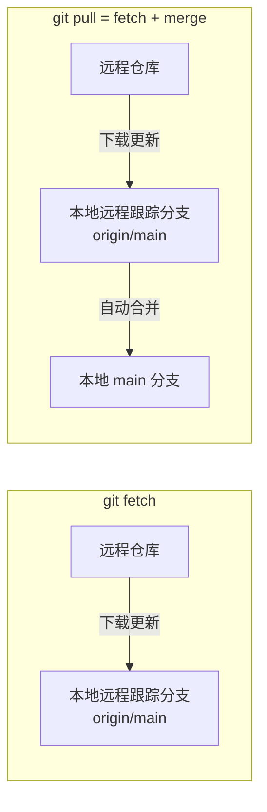
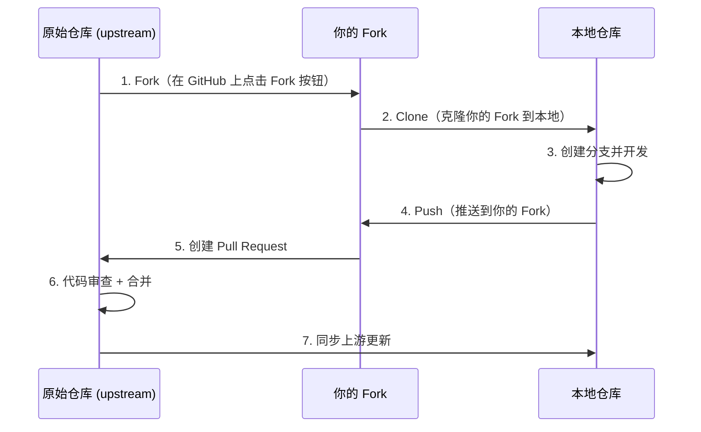
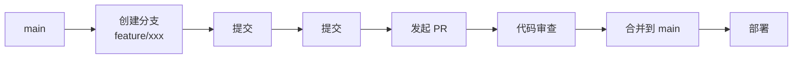

# 协作工作流

> **所属路径**：`01_基础能力/01_开发环境与技术英语/15_版本控制/05_协作工作流`
> **预计学习时间**：50 分钟
> **难度等级**：⭐⭐⭐

---

## 前置知识

- [分支与合并](../02_分支与合并/02_分支与合并.md)
- [冲突与回滚](../03_冲突与回滚/03_冲突与回滚.md)

> 如果以上内容还不熟悉，建议先完成对应课程再继续。

---

## 学习目标

完成本节后，你将能够：

1. 使用 `git remote`、`git push`、`git pull`、`git fetch` 与远程仓库交互
2. 描述 Fork + Pull Request 工作流的完整流程
3. 解释 GitHub Flow 工作流并在实际项目中应用
4. 说明代码审查（Code Review）的流程和关键要点
5. 针对 AI 项目配置 `.gitignore` 并了解 Git LFS 的用途

---

## 正文讲解

### 1. 远程仓库

到目前为止，我们所有的 Git 操作都在本地完成。但在真实项目中，团队成员需要共享代码，这就需要一个 **远程仓库（Remote Repository）** 。GitHub、GitLab、Gitee 等平台提供了远程仓库托管服务。

**远程仓库的核心操作**

```bash
# 查看已配置的远程仓库
git remote -v

# 添加远程仓库（克隆的仓库会自动添加名为 origin 的远程）
git remote add origin https://github.com/username/repo.git

# 将本地分支推送到远程
git push origin main

# 首次推送时设置上游分支（以后可以简写为 git push）
git push -u origin main

# 从远程拉取最新代码并合并到当前分支
git pull origin main

# 仅下载远程更新，但不合并（更安全）
git fetch origin
```

`git pull` 和 `git fetch` 的区别是初学者常混淆的点：



> 📌 **图解说明**：`git fetch` 只是把远程的更新下载到本地的 `origin/main` 分支，不会自动修改你的工作内容。`git pull` 则在 fetch 之后自动执行 merge。在不确定远程有什么变更时，先 `fetch` 再手动合并更安全。

**推送和拉取时的常见场景**

```bash
# 场景 1：远程有新提交，你也有新提交（push 被拒绝）
git push origin main
# error: failed to push some refs to 'origin'
# hint: Updates were rejected because the remote contains work that you do not have locally.

# 解决方案：先拉取再推送
git pull origin main    # 可能需要解决冲突
git push origin main
```

### 2. Fork + Pull Request 工作流

当你想为一个开源项目贡献代码时，通常没有直接向原始仓库推送的权限。这时就需要使用 **Fork + Pull Request** 工作流。



> 📌 **图解说明**：Fork + PR 工作流的完整生命周期。你先 Fork 原始仓库到自己的账号下，克隆到本地开发，推送到自己的 Fork，然后向原始仓库发起 Pull Request 请求合并。

**详细步骤**

```bash
# 1. 在 GitHub 上点击 Fork 按钮（网页操作）

# 2. 克隆你的 Fork
git clone https://github.com/your-username/repo.git
cd repo

# 3. 添加原始仓库为上游
git remote add upstream https://github.com/original-owner/repo.git

# 4. 创建特性分支
git switch -c feature/my-contribution

# 5. 开发、提交
echo "new feature" > feature.py
git add feature.py
git commit -m "feat: 添加新功能"

# 6. 推送到你的 Fork
git push origin feature/my-contribution

# 7. 在 GitHub 上创建 Pull Request（网页操作）

# 8. 同步上游的最新代码
git fetch upstream
git switch main
git merge upstream/main
git push origin main
```

### 3. GitHub Flow 工作流

**GitHub Flow** 是一个轻量级的协作工作流，非常适合持续部署的项目。它的核心规则很简单：

1. `main` 分支始终保持可部署状态
2. 所有开发都在特性分支上进行
3. 通过 Pull Request 进行代码审查
4. 审查通过后合并到 `main`
5. 合并后立即部署



> 📌 **图解说明**：GitHub Flow 的流程简洁明了——从 main 创建分支、开发、发起 PR、审查、合并、部署。整个流程围绕 Pull Request 展开。

与更复杂的 Git Flow（有 develop、release、hotfix 等多种分支）相比，GitHub Flow 更简单，适合大多数项目。除非你的项目需要同时维护多个发布版本，否则 GitHub Flow 是一个很好的起点。

### 4. 代码审查

**代码审查（Code Review）** 是通过 Pull Request 进行的团队协作核心环节。好的代码审查不仅能发现 Bug，更能促进知识共享、提升代码质量。

**发起 PR 时的最佳实践**

- 写清楚 PR 标题和描述：这次变更做了什么？为什么要做？
- 保持 PR 小而专注：一个 PR 只做一件事（不超过 300–400 行变更为佳）
- 自己先审查一遍：推送前通过 `git diff main` 检查自己的所有变更
- 添加必要的测试：修复 Bug 时附带复现测试，新功能附带功能测试

**审查 PR 时的关注点**

| 关注点 | 检查内容 |
| ------ | -------- |
| 正确性 | 逻辑是否正确？边界情况是否处理？ |
| 可读性 | 命名是否清晰？注释是否必要且准确？ |
| 一致性 | 是否遵循项目已有的代码风格和规范？ |
| 测试 | 是否有充分的测试覆盖？ |
| 安全性 | 是否有硬编码的密钥或敏感信息？ |

**审查中的沟通原则**

- 对事不对人：说"这段代码可以优化"而非"你写得不好"
- 给出具体建议：不只指出问题，也提供改进方向
- 区分"必须修改"和"建议改进"
- 及时回复和更新

### 5. AI 项目中的协作实践

AI 项目在版本控制方面有一些特殊的需求和挑战：

**实验分支管理**

AI 项目中常有大量的实验。一种推荐的做法是使用 `experiment/` 前缀的分支：

```bash
# 实验分支命名建议
experiment/bert-large-lr1e5
experiment/data-augmentation-v2
experiment/distillation-teacher-gpt2
```

实验结束后，将成功的实验合并到 `main`，失败的实验可以保留分支作为记录（或在分支描述中记录结论后删除）。

**大文件管理：Git LFS**

AI 项目中经常会遇到大文件——模型权重（数百 MB 到数十 GB）、数据集、预处理后的特征文件等。这些文件不适合直接放在 Git 仓库中（会让仓库极其臃肿），这时可以使用 **Git LFS（Large File Storage）** ：

```bash
# 安装 Git LFS（只需执行一次）
git lfs install

# 指定哪些文件类型由 LFS 管理
git lfs track "*.h5"
git lfs track "*.pt"
git lfs track "*.onnx"
git lfs track "data/*.csv"

# 上述命令会修改 .gitattributes 文件，需要提交
git add .gitattributes
git commit -m "chore: 配置 Git LFS 跟踪大文件"

# 之后正常使用 git add / commit / push
# LFS 文件会自动上传到 LFS 存储服务器
```

Git LFS 的原理是：在 Git 仓库中只存储一个轻量的指针文件，实际的大文件存储在专门的 LFS 服务器上。

**AI 项目的 .gitignore 模板**

一个完整的 Python/AI 项目 `.gitignore` 配置：

```gitignore
# ===== Python =====
__pycache__/
*.py[cod]
*$py.class
*.egg-info/
dist/
build/
*.egg

# ===== 虚拟环境 =====
venv/
.env/
env/

# ===== Jupyter =====
.ipynb_checkpoints/

# ===== IDE =====
.vscode/
.idea/
*.swp
*.swo

# ===== 数据与模型（大文件通常不入库）=====
data/raw/
data/processed/
models/
*.h5
*.pt
*.pth
*.onnx
*.pkl
*.joblib

# ===== 实验输出 =====
outputs/
logs/
runs/
wandb/
mlruns/

# ===== 操作系统 =====
.DS_Store
Thumbs.db

# ===== 敏感信息 =====
.env
*.pem
secrets/
```

> 💡 **提示**：GitHub 提供了各种语言和框架的 `.gitignore` 模板，可以在创建仓库时选择，也可以访问 [github/gitignore](https://github.com/github/gitignore) 仓库查看。

### 6. 协作中的常用技巧

**保持分支与主线同步**

在长期开发的特性分支上，定期同步主分支的更新可以减少最终合并时的冲突：

```bash
# 方法 1：merge（保留分叉历史）
git switch feature/my-work
git merge main

# 方法 2：rebase（线性历史，适合个人分支）
git switch feature/my-work
git rebase main
```

**查看远程分支状态**

```bash
# 查看所有远程分支
git branch -r

# 查看本地和远程的所有分支
git branch -a

# 删除已在远程被删除的本地跟踪分支
git fetch --prune
```

**多人协作的提交规范**

团队中建议统一使用结构化的提交信息格式（如 Conventional Commits），这样可以：
- 自动生成变更日志（Changelog）
- 自动确定语义版本号
- 让 `git log` 一目了然

---

## 动手实践

由于远程协作需要 GitHub 账号和网络环境，这里我们模拟一个本地的"远程仓库"来练习核心操作：

```bash
# 1. 创建一个"远程仓库"（裸仓库）
mkdir -p collab-practice/remote.git
cd collab-practice/remote.git
git init --bare
cd ..

# 2. 模拟开发者 A：克隆仓库
git clone remote.git dev-a
cd dev-a
echo "# Collaborative Project" > README.md
git add README.md
git commit -m "feat: 项目初始化"
git push origin main
cd ..

# 3. 模拟开发者 B：克隆同一个仓库
git clone remote.git dev-b
cd dev-b

# 4. 开发者 B 创建特性分支并开发
git switch -c feature/model
echo 'def build_model():
    print("Building model...")
    return "model"' > model.py
git add model.py
git commit -m "feat: 添加模型构建函数"
git push origin feature/model

# 5. 切换到开发者 A 的目录
cd ../dev-a

# 6. 开发者 A 获取远程更新
git fetch origin

# 7. 查看远程分支
git branch -r

# 8. 开发者 A 检出开发者 B 的分支进行审查
git switch -c feature/model origin/feature/model
cat model.py

# 9. 审查通过，切回 main 合并
git switch main
git merge feature/model
git push origin main

# 10. 查看最终历史
git log --oneline --graph --all
```

**运行说明**：
- 环境要求：Git 2.23+
- 以上命令模拟了两个开发者通过一个共享仓库协作的完整流程

**预期输出**（第 10 步，示意）：

```
* b2c3d4e (HEAD -> main, origin/main) feat: 添加模型构建函数
* a1b2c3d feat: 项目初始化
```

---

## 典型误区

| 误区 | 正确理解 |
| ---- | -------- |
| `git pull` 和 `git fetch` 一样 | `fetch` 只下载不合并，`pull` = `fetch` + `merge`。不确定时先 `fetch` |
| Fork 是 Git 的功能 | Fork 是 GitHub/GitLab 等平台的功能，Git 本身没有 Fork 概念 |
| 大文件直接放 Git 仓库 | 大文件（模型权重、数据集）应使用 Git LFS 或专门的数据版本管理工具 |
| 代码审查只是找 Bug | 代码审查更重要的价值是知识共享、保持代码一致性、提升团队整体水平 |
| 遇到 push 被拒绝就 force push | `git push --force` 会覆盖远程历史，极其危险。正确做法是先 `pull` 再 `push` |

---

## 练习题

### 练习 1：远程操作排序（难度：⭐）

请将以下操作按正确的顺序排列，完成一次从开发到推送的完整流程：

A. `git push origin feature/new-api`
B. `git switch -c feature/new-api`
C. `git add api.py`
D. `git commit -m "feat: 添加新 API"`
E. `git fetch origin` && `git merge origin/main`（先同步最新代码）

<details>
<summary>💡 提示</summary>

先同步最新代码，再创建分支开发，最后推送。

</details>

<details>
<summary>✅ 参考答案</summary>

正确顺序：**E → B → C → D → A**

1. `git fetch origin` && `git merge origin/main` — 先同步远程最新代码
2. `git switch -c feature/new-api` — 基于最新代码创建特性分支
3. `git add api.py` — 暂存修改
4. `git commit -m "feat: 添加新 API"` — 提交
5. `git push origin feature/new-api` — 推送到远程

</details>

### 练习 2：工作流选择（难度：⭐⭐）

你所在的团队有以下三个项目，请为每个项目推荐合适的工作流：

1. 一个开源的 Python 工具库，有大量外部贡献者
2. 一个 5 人小团队的 Web 应用，每天多次部署
3. 一个发布周期为 3 个月的桌面软件，需要同时维护 v1.x 和 v2.x

<details>
<summary>💡 提示</summary>

考虑贡献者权限、部署频率和版本维护需求。

</details>

<details>
<summary>✅ 参考答案</summary>

1. **Fork + Pull Request 工作流** — 外部贡献者没有直接推送权限，需要 Fork 后通过 PR 贡献代码。维护者审查后合并。
2. **GitHub Flow** — 小团队、高频部署，适合简单直接的工作流：从 main 创建分支，PR 审查，合并后自动部署。
3. **Git Flow** — 需要同时维护多个发布版本，适合使用 develop、release、hotfix 等长期分支来管理复杂的发布周期。

</details>

### 练习 3：配置 AI 项目的 .gitignore（难度：⭐⭐）

你正在启动一个新的 AI 项目，使用 PyTorch 框架，Jupyter Notebook 做实验，VS Code 作为编辑器。请编写一个 `.gitignore` 文件，至少覆盖以下类别：
- Python 编译产物
- 虚拟环境
- Jupyter 检查点
- IDE 配置
- 模型权重文件（.pt, .pth）
- 实验日志目录
- 敏感配置文件

<details>
<summary>💡 提示</summary>

参考正文第 5 节的 `.gitignore` 模板。注意区分不同类别的文件。

</details>

<details>
<summary>✅ 参考答案</summary>

```gitignore
# Python
__pycache__/
*.py[cod]
*.egg-info/

# 虚拟环境
venv/
.env/

# Jupyter
.ipynb_checkpoints/

# IDE
.vscode/

# 模型权重
*.pt
*.pth

# 实验日志
runs/
logs/
wandb/

# 敏感配置
.env
secrets.yaml
```

创建后用 `git add .gitignore && git commit -m "chore: 配置 .gitignore"` 提交即可。

</details>

---

## 下一步学习

- 📖 下一个主题：[Jupyter Notebook与交互式开发](../../16_Jupyter%20Notebook与交互式开发/)
- 🔗 相关知识点：[标签与版本管理](../04_标签与版本管理/04_标签与版本管理.md)
- 📚 拓展阅读：[Python项目实践](../../18_Python项目实践/)

---

## 参考资料

1. [Pro Git: 分布式工作流程](https://git-scm.com/book/zh/v2/%E5%88%86%E5%B8%83%E5%BC%8F-Git-%E5%88%86%E5%B8%83%E5%BC%8F%E5%B7%A5%E4%BD%9C%E6%B5%81%E7%A8%8B) — Git 官方书籍的协作工作流章节（CC BY-NC-SA 3.0 许可）
2. [GitHub Flow 介绍](https://docs.github.com/zh/get-started/using-github/github-flow) — GitHub 官方文档的工作流指南（公开文档）
3. [GitHub Docs: Pull Requests](https://docs.github.com/zh/pull-requests) — GitHub 官方的 Pull Request 文档（公开文档）
4. [Git LFS 官方文档](https://git-lfs.com/) — Git Large File Storage 的官方站点（开源项目）
5. [github/gitignore](https://github.com/github/gitignore) — GitHub 维护的各语言 .gitignore 模板集合（CC0 公共领域）
