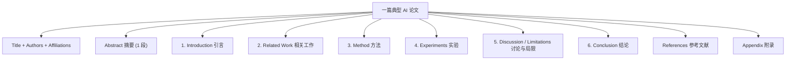
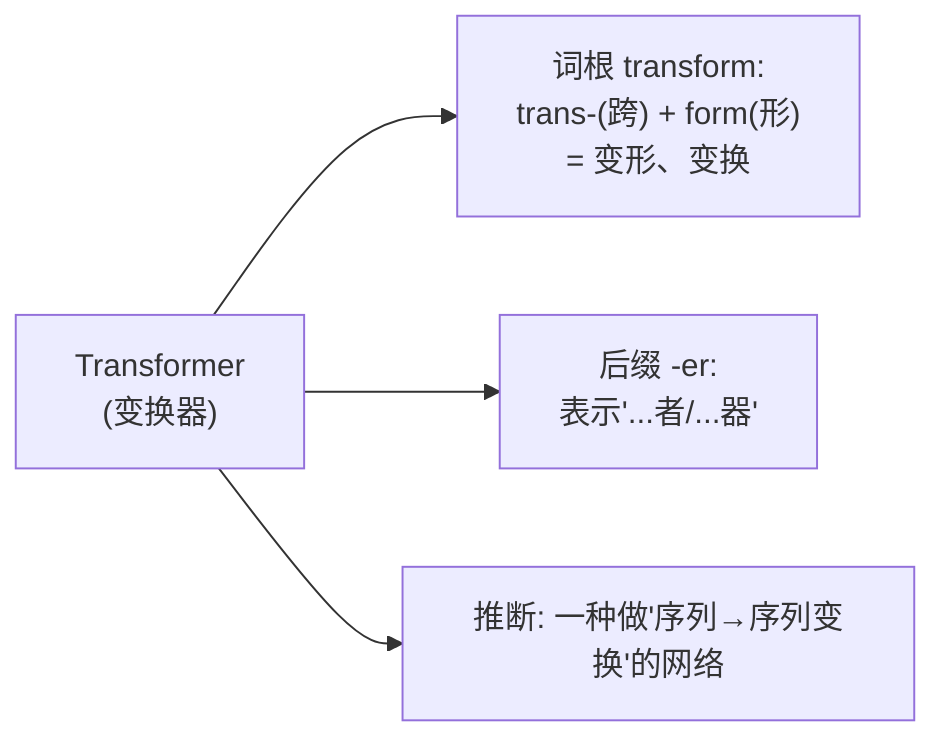

# 论文阅读基础

> **所属路径**：`01_基础能力/01_开发环境与技术英语/17_阅读英文文档与技术资料/04_论文阅读基础`
> **预计学习时间**：70 分钟
> **难度等级**：⭐⭐⭐

---

## 前置知识

- [技术文章摘要](../03_技术文章摘要/03_技术文章摘要.md)
- [接口文档阅读](../02_接口文档阅读/02_接口文档阅读.md)
- [总结与记笔记 · 章节摘要](../../../../00_高中复习/02_英语基础/04_总结与记笔记/02_章节摘要/02_章节摘要.md)

> 如果以上内容还不熟悉,建议先完成对应课程再继续。

---

## 学习目标

完成本节后,你将能够:

1. 描述一篇典型机器学习/AI 论文的标准结构(摘要/引言/相关工作/方法/实验/结论)
2. 用"三遍阅读法"(Keshav 经典方法)读懂一篇 arXiv 论文
3. 识别论文中的关键信息位置:贡献点、模型公式、实验表格、消融研究
4. 用词根词缀解码 AI 领域的大量新造术语
5. 区分"顶会正式论文"与"arXiv 预印本"的可信度差异

---

## 正文讲解

### 1. 从技术博文到学术论文的跨越

在上一节你学会了读技术博文——它的作者往往已经**替你做了很多消化工作**:把复杂公式讲成类比,把实验表格画成柱状图,把结论用大字写在开头。学术论文则不同:它是**写给同行专家看的证据报告**,默认读者已经熟悉这个领域的术语、符号和方法。第一次打开一篇 arXiv 论文,感觉信息量爆炸是正常的。

好消息是,**99% 的 AI 论文遵循同一个结构骨架**。一旦你熟悉了这个骨架,以及几十个高频术语和公式记号,无论是读 Transformer 的原始论文还是最新的多模态模型,都可以用同一套流程应对。本节教你这套流程。

这也是你进入 [论文阅读(04 阶段)](../../../../04_持续研究/01_研究与持续学习/01_论文阅读/) 和 [复现](../../../../04_持续研究/01_研究与持续学习/02_复现/) 的预备课。

### 2. 一篇典型 AI 论文的结构

绝大多数机器学习和 AI 论文采用下面这个骨架:

> 📌 **图解说明**:每一块都有固定作用,也有固定读法。本节的核心就是教你"在每一块里该找什么"。

下面逐块拆解。

### 3. 标题与摘要:30 秒内决定要不要继续

**标题**通常包含三种信息之一:

- 方法名称:"Attention Is All You Need"
- 任务 + 方法:"ImageNet Classification with Deep Convolutional Neural Networks"
- 系统名 + 效果:"GPT-3: Language Models are Few-Shot Learners"

**摘要**(Abstract)是整篇论文的压缩版,通常遵循"PARI"结构的紧凑表述:问题 → 方法 → 结果 → 启示。读摘要要抓三个关键数字:

- **模型规模**:参数量、训练数据量
- **性能提升**:在哪个基准上提升了多少百分点
- **资源开销**:训练需要多少 GPU 小时、推理多快

如果摘要里这三类数字一个都没有——要么论文还在早期,要么它主打的是方法新颖性而非性能。

### 4. 三遍阅读法(Keshav 方法)

加拿大滑铁卢大学教授 S. Keshav 提出的经典"三遍法"是阅读学术论文的事实标准:

**第一遍(Bird's-Eye View,10 分钟)**:

读标题、摘要、各级小标题、引言的最后一段(通常列出贡献点)、图表、结论、参考文献里你熟悉的名字。**目标**:回答五个"5C"问题——

| 5C | 中文 | 回答的问题 |
| --- | ---- | ---------- |
| Category | 类别 | 这是理论/系统/综述/工程论文? |
| Context | 背景 | 在已有工作中,它属于哪个脉络? |
| Correctness | 正确性 | 假设看起来合理吗? |
| Contributions | 贡献点 | 它说自己有哪些贡献? |
| Clarity | 清晰度 | 写得好不好读? |

完成第一遍后,你应该能决定:是否值得进入第二遍。

**第二遍(Capture the Content,1 小时)**:

认真读正文,但**跳过推导细节**。重点看图表及其标题——大部分顶会论文的图表已经浓缩了论文的核心发现。把不理解的术语/记号**圈出来**,但不要当场停下查,继续往下读。结束时你应该能够:

- 复述方法的核心思想(用 3-5 句话)
- 画出方法的架构图(哪怕简化版)
- 说出实验用了哪些数据集、哪些基线、得出什么结论

**第三遍(Virtual Re-implementation,4-5 小时)**:

"重新实现"级别的精读——问自己:如果现在让我复现这篇工作,每一个步骤的细节够不够?这一遍会暴露论文的所有隐含假设、写作漏洞、实验局限。只有你真正需要深入研究这个方向,或打算动手复现时,才进行第三遍。

### 5. 方法章节:识别模型公式

方法章节(Method / Approach)是信息密度最高的部分。一个可靠的阅读顺序是:

1. **先找架构图**:几乎每篇现代 AI 论文都有一张描述整体流程的 Architecture Figure。它比任何公式都直观。
2. **再读记号表**:论文开头往往会定义符号,例如"Let $x \in \mathbb{R}^d$ denote the input vector, $W \in \mathbb{R}^{d \times h}$ the weight matrix"。读懂这些符号后,公式就只是"记号的拼装"。
3. **最后读公式**:带着直觉读公式。例如自注意力核心公式:

$$
\text{Attention}(Q, K, V) = \text{softmax}\!\left(\frac{QK^{\top}}{\sqrt{d_k}}\right) V
$$

> **直觉解读**:给定查询 $Q$ 、键 $K$ 和值 $V$ ,先算查询和键的相似度,除以 $\sqrt{d_k}$ 防止数值过大,softmax 归一化后作为权重,对值 $V$ 做加权求和。公式复杂,直觉简单。

读公式的一个诀窍是**总能翻译成一句话的"它在算什么"**。如果你翻译不出来,说明前面的符号定义没看懂,回去补。

### 6. 实验章节:四类必看内容

实验章节看似最长,但真正的信息集中在四处:

- **主实验表(Main Result Table)**:通常在 Experiments 章节第一张表,对比"本文方法 vs 各基线"在核心任务上的表现。注意**粗体**数字——这是论文想让你记住的。
- **消融实验(Ablation Study)**:一种"拆零件"实验,每次去掉或替换一个模块,看性能掉多少。消融表告诉你"方法的哪个部分真正重要"。
- **定性样例(Qualitative Examples)**:生成/理解类论文尤其重要——几张模型输出的真实样例。
- **局限性(Limitations)**:近年来顶会要求论文必须有这一节。读这一节能让你快速知道"这个方法什么时候不适用"。

读实验章节时的批判性问题:

- 基线选的够不够强?有没有刻意选弱基线?
- 数据集是否"恰好"有利于本文方法?
- 实验的超参数是怎么调的?调参公平吗?
- 多 seed 报告了标准差吗?

### 7. arXiv 预印本 vs. 顶会论文

同一篇论文可能有多个版本,它们的可信度**并不相同**:

| 来源 | 审核程度 | 何时引用 |
| ---- | -------- | -------- |
| arXiv 预印本 | **未同行评审** | 快速了解前沿,谨慎引用 |
| 顶会论文(NeurIPS/ICML/ICLR/CVPR/ACL/EMNLP) | 严格同行评审 | 主要引用来源 |
| 期刊论文(TPAMI/JMLR) | 最严格评审 + 更长流程 | 高权威但时效性弱 |
| 博客、Twitter 推文 | 无评审 | 只作为线索,不作为证据 |

一个实用习惯:每次看到 arXiv 论文,查一下它是否已经被顶会接收。很多 arXiv 预印本的早期版本有严重错误,在正式版本中才修正。

### 8. 论文里那些"你必须认识的词"

AI 论文作者创造新词的速度是惊人的。好在 99% 的新词都能用词根词缀拆解:

| 新词 | 拆解 | 含义 |
| ---- | ---- | ---- |
| autoencoder | `auto-`(自) + `encode`(编码) + `-er`(器) | 自编码器 |
| transformer | `transform`(变换) + `-er`(器) | 变换器 |
| ablation | `ab-`(去除) + `latio`(带走) | 消融(去掉某模块看效果) |
| embedding | `em-`(进入) + `bed`(嵌入) + `-ing` | 嵌入表示 |
| perplexity | `per-`(彻底) + `plex`(折叠) + `-ity`(名词) | 困惑度 |
| distillation | `dis-`(分离) + `stil`(蒸) + `-ation` | (知识)蒸馏 |
| hallucination | `halluc`(梦幻) + `-ination` | (模型)幻觉 |

下面这张图以 Transformer 为例,展示一个复杂术语如何被拆解:

> 📌 **图解说明**:AI 论文中约三分之二的新术语都能这样拆解。记住 20 个高频词根,你的新词处理速度会提升一个量级。

---

## 论文阅读高频语块

| 语块 | 中文含义 | 出现位置 |
| ---- | -------- | -------- |
| State of the art (SOTA) | 当前最优水平 | 引言 / 实验 |
| To the best of our knowledge | 据我们所知 | 引言 / 相关工作 |
| We argue that | 我们认为 | 引言 |
| It is worth noting that | 值得注意的是 | 方法 / 讨论 |
| Ablation study | 消融实验 | 实验 |
| Out of scope | 超出本文范围 | 讨论 |
| Future work | 未来工作 | 结论 |
| We leave X to future work | 我们把 X 留给未来工作 | 结论 |
| As shown in Figure X | 如图 X 所示 | 全文 |
| Without loss of generality | 不失一般性 | 方法 |
| w.r.t. (with respect to) | 关于 / 相对于 | 方法 |
| i.e. (id est) | 也就是 | 全文 |
| e.g. (exempli gratia) | 例如 | 全文 |
| et al. (et alia) | 等人 | 引用 |

> 💡 **语块记忆法**:这些表达在每篇论文中都会出现,记住整体,阅读时像看中文一样流畅。

---

## 动手实践

### 任务:用三遍法第一遍读 Transformer 原论文

**论文**:Vaswani et al., "Attention Is All You Need", NeurIPS 2017(arXiv:1706.03762)

**第一遍目标**(严格限时 10 分钟):

打开论文,只读:

1. 标题 + 作者 + 机构
2. Abstract(1 段)
3. 第 1 节 Introduction 的**最后一段**("The Transformer is the first transduction model...")
4. Figure 1(架构图)
5. 第 7 节 Conclusion
6. 翻一下 References,看看引用了多少熟悉的名字

读完后,请**不看论文**回答:

- 它属于什么类型?(综述/理论/系统/工程?)
- 它的核心贡献是什么?用一句话说
- 它的基础架构是什么?(记得图形即可)
- 它主要在哪个任务上做实验?
- 它的主要基线是什么?

**参考答案**:

- 类型:**系统/方法论文**,提出新模型架构
- 核心贡献:**抛弃 RNN/CNN,仅用注意力机制构建序列到序列模型**
- 架构:**编码器-解码器,都由堆叠的"多头自注意力 + 前馈"层组成**
- 主任务:**机器翻译(WMT 2014 英德、英法)**
- 主要基线:**基于 RNN 和卷积的 Seq2Seq 模型**

如果大部分都答出来了,你已经具备进入第二遍的能力。

---

## 典型误区

| 误区 | 正确理解 |
| ---- | -------- |
| 论文要从头读到尾 | 错,第一遍只读 6 个位置 |
| 公式读不懂就放弃 | 先绕过公式看图和文字,往往能补上理解 |
| arXiv 论文等于已发表 | 未经同行评审,可能有未修正错误 |
| 读论文必须纸笔 | 数字化笔记同样有效,关键是"输出伴随输入" |
| SOTA 就是最好 | "在某个 benchmark 上最好"不等于"在你的场景里最好" |

---

## 练习题

### 练习 1:5C 判别(难度:⭐)

给一篇论文做第一遍阅读后,如果你无法回答"Contributions"(贡献点)这个 C,最可能是什么原因?

✅ 参考答案

最可能是**没有读到引言的最后一段**。按学术惯例,作者会在 Introduction 末尾用项目符号列出"Our contributions are:"——这是贡献点最显眼的位置。初次读论文的人常常在引言中间就跳走,错过了这一段。

### 练习 2:术语解码(难度:⭐⭐)

请用词根词缀拆解下列 AI 术语,并猜测其含义:

1. `multimodal`
2. `pretraining`
3. `zero-shot`
4. `generalization`

✅ 参考答案

1. `multi-`(多) + `modal`(模态)→ 多模态
2. `pre-`(预先) + `training`(训练)→ 预训练
3. `zero`(零) + `shot`(射击/尝试)→ 零样本(不给任何训练样本直接测试)
4. `general`(一般) + `-ization`(名词化)→ 泛化(向未见过的数据推广)

### 练习 3:实验章节审阅(难度:⭐⭐⭐)

你读了一篇 arXiv 论文,实验部分只报告了主实验的一个最好数字,没有消融研究、没有标准差、没有局限性分析。你应如何评价它?

💡 提示

这样的论文在顶会评审中大概率会被哪种意见拒稿?

✅ 参考答案

这篇论文至少有三方面的严重缺失:

1. **没有消融研究**:无法判断它的性能来自哪个模块创新,可能只是某个超参带来的涨点。
2. **没有标准差**:单次运行的数字可能是偶然,重跑几次可能就失去 SOTA。
3. **没有局限性分析**:可能刻意回避了失败场景,审稿人通常会质疑其"可重复性"。

建议:**只把它作为线索**,不轻易采用其结论。等它被顶会接收后再考虑引用,或自己复现验证。

---

## 记忆策略

### 核心策略:每周一篇论文 + 三遍法记录

承诺每周读 1 篇论文,在 Notion/Obsidian/本地 Markdown 里维护一张表:

| 论文 | 第一遍(日期) | 5C 答案 | 第二遍(日期) | 方法核心 | 第三遍? | 最终评价 |
| ---- | ------------ | ------- | ------------ | -------- | ------- | -------- |
| ... | ... | ... | ... | ... | ... | ... |

第一遍的 10 分钟几乎没有门槛,关键是**不跳过表格记录**——表格强迫你输出。

### 间隔复习建议

| 复习时间 | 建议方式 |
| -------- | -------- |
| 当天 | 对本节动手实践的 Transformer 第一遍答案复盘 |
| 第 2 天 | 对同一篇论文完成第二遍(约 1 小时) |
| 第 7 天 | 换一篇论文(例如 BERT 或 ResNet)再走第一遍 |
| 第 30 天 | 已经形成每周一篇的阅读节奏 |
| 第 90 天 | 在组会或博客上做一次"我最近读到的有趣论文"分享 |

---

## 下一步学习

- 📖 下一个主题:[Python项目实践](../../18_Python项目实践/)
- 🔗 相关知识点:[论文阅读(04 阶段)](../../../../04_持续研究/01_研究与持续学习/01_论文阅读/)、[源码阅读(04 阶段)](../../../../04_持续研究/01_研究与持续学习/06_源码阅读/)
- 📚 拓展阅读:
  - S. Keshav, "How to Read a Paper" — 三遍法原始论文(CC 许可公开 PDF)
  - [arXiv.org](https://arxiv.org/) — 最主要的 AI 预印本站点(开放获取)

---

## 参考资料

1. S. Keshav. "How to Read a Paper". ACM SIGCOMM CCR, 2007 — 三遍阅读法(作者公开 PDF)
2. [Papers With Code](https://paperswithcode.com/) — 论文 + 代码 + 基准(开放数据)
3. [arXiv AI/CS Listings](https://arxiv.org/list/cs.LG/recent) — 最新 AI 预印本(开放获取)
4. Andrew Ng. "How to Read Research Papers" — 公开 YouTube 讲座(Stanford CS230 公开课)
